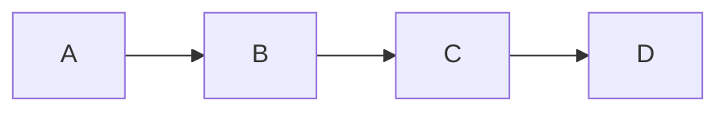
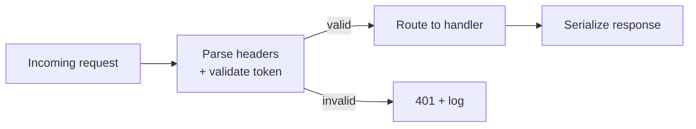

# Apex-Artifacts — Core References

Bundled from the apex-artifacts source repository. Each source file
is enclosed by `<!-- BEGIN: path -->` ... `<!-- END: path -->`
anchors so semantic retrieval and humans can locate the original.

## Files in this bundle

- `references/manifesto.md`
- `references/how-to-use-this-system.md`
- `references/first-artifact.md`
- `references/glossary.md`
- `references/pre-delivery-checklist.md`
- `references/hard-gates.md`
- `references/editorial-voice.md`
- `references/iteration-protocol.md`
- `references/cold-read.md`
- `references/apex-patterns.md`
- `references/apex-exemplars.md`
- `references/design-tokens.md`
- `references/brief-template.md`
- `references/taste-calibration.md`
- `references/failure-modes.md`
- `references/subtractive-moves.md`
- `references/budget-and-stopping.md`
- `references/signature-move-ledger.md`
- `references/exception-registers.md`
- `references/cross-medium-patterns.md`
- `references/educational-scaffold.md`

---


<!-- BEGIN: references/manifesto.md -->

# The Manifesto

The system, distilled into rules that survive without `CLAUDE.md` in context. Sixteen rules — fewer than before, because the prime directives now live exclusively in `CLAUDE.md`.

> Rules 1–5 below ("the prime-directive rules") are now stated canonically in `CLAUDE.md` Prime Directives. They're summarized here as a single rule so this file remains useful as a standalone read; the canonical wording lives in CLAUDE.md.

---

**1. The prime directives govern everything.** Maximize quality and "wow" factor; never cap effort; never truncate; difficulty is a reason to slow down not ship less; refuse "good enough." For the full statement, see `CLAUDE.md` § Prime directives.

**6. Default to React/JSX** in the Claude artifact environment. It has the highest ceiling for interactive/visual work. Carve-outs only when another medium is genuinely better (SVG for static figures, Mermaid for schematics, notebook for computation, email for email, etc.).

**7. Never ship default palettes.** Generic `gray-500`/`blue-500`, default Recharts pink, stock Mermaid pastels — these are the tells of unconsidered output. Curate one neutral family + one accent. Commit.

**8. Defaults are destiny.** Start from the project's tokens and templates; do not start from blank. The starting point bounds the final quality.

**9. Titles are claims, not topics.** A chart title is the finding. An article title is the thesis. "Revenue" is not a title; "Revenue doubled after the pricing change, then retreated" is.

**10. Every figure has a caption.** Every chart has units, source, and date. Every diagram labels its nodes *and* edges. Every code block says why, not what.

**11. Every control has (a) a label, (b) a visible current value, (c) a hint about its effect.** No silent sliders. No "figure it out by dragging."

**12. Accessibility is table stakes.** WCAG AA contrast, keyboard reachable, semantic HTML, `prefers-reduced-motion` honored, alt text on images. Non-negotiable.

**13. Every reachable state is built.** Loading. Empty. Error. Success. Edge cases. The happy path alone is not the artifact.

**14. Minimum three passes** (default). Scaffold → self-critique → adversarial. Most apex artifacts take four or five. Some warrant more, some fewer; the budget and stopping discipline lives in `references/budget-and-stopping.md`. The full iteration protocol is in `references/iteration-protocol.md`.

**15. Adopt the harsh reviewer's voice at least once per artifact.** Find the weakest element, the design choice most challengeable, the detail that gives the piece away as not-quite-first-rate. Fix all of it.

**16. Every apex artifact deploys at least one named signature move** from `wow-taxonomy.md`. You can state it aloud in a single sentence: *the move is X, deployed by Y, serving the job of Z.*

**17. Editorial voice.** Confident, specific, restrained. No throat-clearing openers. No "hopefully this helps" closers. No marketing-speak. No AI-writer tells ("delve," "tapestry," "testament to," "landscape of"). Read aloud to test.

**18. Wow-score ≥ 8 before shipping.** Calibrated against `references/taste-calibration.md`'s tier ladder and `apex-exemplars.md`. Below 8: iterate; identify the highest-leverage fix using `failure-modes.md` vocabulary. Below 8 after three rounds: replan. The recency modifier in `iteration-protocol.md` adds +0.5 for novel signature moves (additive only).

**19. Delivery copy is tight.** One sentence naming the artifact; optional sentence on the signature move or a specific caveat. The full forbidden-phrases list and Editorial voice register lives in `references/editorial-voice.md`. The artifact is the work.

**20. Would I be proud to sign this?** The single question that concludes every pre-delivery check. If not, iterate.

---

## Short form (30-second version)

If you have ten seconds:

> Maximize quality, never truncate, default to React, start from templates, curate a token set (5 ship; pick one), title is a claim, caption every figure, label every control, every state built, three passes minimum (scaffold → self-critique → adversarial), one named signature move (don't repeat last), cross-pollinate from a non-software tradition, wow-score ≥ 8, editorial voice, tight delivery copy, emit the required YAML block, would I sign this?

That's the job.

<!-- END: references/manifesto.md -->

---


<!-- BEGIN: references/how-to-use-this-system.md -->

# How to Use This System

Read this before any file in `references/libraries/`. It is the interpretive key for the whole project.

## The platter principle

**Every library in this project is a platter, not a recipe.**

A platter shows you what's available. A recipe tells you what to make. The distinction matters because the difference between **apex** and **generic** is almost never about following the right recipe — it is about drawing freshly from a wide enough space of options to invent what *this* artifact needs.

When a reference shortlists "8 moods" or "12 pairings" or gives a "decision tree for chart selection," it inadvertently narrows the creative pipeline. The creator starts to feel that the shortlist is the set of valid choices, and invention past it is off-script. Over time, every artifact starts to look like every other artifact *from this system* — which is a different failure mode than "looks like every other artifact on the web," but no less a failure.

This project resists that tendency deliberately.

## What the libraries are

The files in `references/libraries/` are **encyclopedic references**. Each contains:

1. **Theory** — the underlying principles of the domain, drawn from its best practitioners, enough for Claude to reason fresh rather than look up
2. **Traditions / categories** — how the space organizes itself historically and culturally
3. **Many concrete entries** — dozens to hundreds of specific, named, tagged examples, spread across the full space rather than curated down to favorites
4. **Invention guidance** — how to create something new in the domain, not just pick from existing
5. **Cross-references** — where this library touches others

The entries are **tagged richly** (era, region, domain, mood, medium, etc.) so Claude can filter across axes and combine in novel ways. The goal is to put the creator into a library full of materials, not a kitchen with a recipe card.

## What the libraries are *not*

They are not:

- **Prescriptive menus.** "Choose palette #47" is the failure mode.
- **Completeness claims.** Every library is a non-exhaustive sample of a larger space. The omissions are not bans — they are gaps to be filled, invented past, or reached outside the system entirely.
- **A cage.** Claude is free to use references outside this system, invent fresh, violate the traditions catalogued here, or combine across libraries in unprecedented ways. The libraries give ground, not walls.

## How to use a library

When approaching an artifact, for each domain relevant to the job:

1. **Open the relevant library.** Skim the theory; sample entries across different categories.
2. **Let the space inform you** before you narrow it. Notice what traditions exist; notice what you haven't considered.
3. **Identify constraints from the artifact** (audience, mood, medium, domain).
4. **Then** — and only then — choose or invent what fits *this specific artifact*.

The order matters. If you narrow to constraints first, you'll reach for the narrow set of options you already know. If you widen to the library first, you'll find options you wouldn't have reached for unprompted.

## When invention beats selection

For many artifacts, the right move is not "pick palette X from the library" but "combine the austerity of Swiss poster tradition with the warmth of Scandinavian muted neutrals, because this piece is about quiet engineering." That combination may not exist in the library. That's fine. The library gave you the traditions; the artifact called for the combination.

**Apex artifacts are almost always novel compositions of well-understood elements, not exact reproductions of canonical ones.**

## Constraints that are not narrowing

Some of this system is genuinely prescriptive:

- **Hard gates** (accessibility, performance): non-negotiable
- **Prime directives** (no truncation, wow-factor bar): non-negotiable
- **Forbidden phrases** in editorial voice: non-negotiable
- **AI-output tells**: to be actively avoided

These exist to **remove low-quality defaults** — which *expands* the creative space rather than narrowing it. Cutting "hopefully this helps" forces the creator to invent a real closer. Cutting default Tailwind palettes forces real color thinking. Cutting elision markers forces the creator to deliver the full artifact.

The pattern: **constraints that remove generic defaults expand creativity; prescriptions that pick winners among valid options narrow it.** The first is intentional; the second is what this meta-document exists to prevent.

## What this means for contributors

If you are adding to this project, test every addition with one question:

> *Does this addition expand the space the creator is drawing from, or does it narrow it?*

- **Expansion looks like:** more examples, more traditions, more historical context, more theory, more tagging dimensions, tools for invention, cross-domain inspiration.
- **Narrowing looks like:** curated shortlists of "the good ones," decision trees, "use this for X," prescriptive templates where references could exist instead.

If a file is drifting toward prescriptive — if it starts to feel like "the way we do X here" — **expand it back out** into theory + options + invention guidance.

## What this means for Claude specifically

When Claude uses this project's references:

- **Do not** default to the first option in any library. Sample across the space before narrowing.
- **Do not** treat the entries as "the complete set of valid choices."
- **Do** feel free to invent options not present in any library, when the artifact warrants.
- **Do** feel free to combine across libraries, eras, traditions, and media in ways the libraries don't anticipate.
- **Do** feel free to override the project's own defaults (tokens, templates) when a specific artifact calls for different choices — with intention.

The libraries are material. The creator's intelligence is the method. The artifact is the result.

## One-line summary

**Platter, not recipe. Library, not menu. Inform the creator, don't instruct them.**

<!-- END: references/how-to-use-this-system.md -->

---


<!-- BEGIN: references/first-artifact.md -->

# First Artifact: End-to-End Walkthrough

This is the artifact that gets a new user calibrated. Read it in full once before scaffolding your first artifact under this system. The walkthrough shows every operating-loop step on a concrete brief, including the failed first draft, the iteration moves, the failure modes named in the pass-log, and the shipped artifact.

The brief is deliberately small enough to walk in one file (a single dashboard) and large enough to exercise every operating-loop step (medium selection, signature move, iteration, the wow-score gate, the pre-delivery YAML block).

> This walkthrough is **one** apex execution, not **the** apex execution. Your pass-log will differ. The point is to make the operating loop concrete — not to clone this artifact.

---

## The brief

> Build a one-page dashboard showing weekly product usage for an internal SaaS team: 5 metrics, week-over-week change, a primary chart of the metric the team should pay attention to, and a comment field where the team lead notes anomalies.

**Reader.** Mei, team lead, Monday-morning 5-minute scan on laptop. Tired. Skimming. Wants to know whether usage is on track and what to flag in the weekly standup at 9am.

**Success.** Mei names the next action (escalate / hold / ignore) within 30 seconds of opening the dashboard.

---

## Step 0 — Write the brief

Open `references/brief-template.md`. Fill it in. Don't pad. ≤ 200 words.

```yaml
brief:
  reader: "Mei, team lead, Monday-morning 5-minute scan on laptop, tired, wants to know what to flag in the 9am standup"
  job: "Identify whether the lede metric has crossed the comparison anchor and decide whether to escalate"
  success: "Mei names the next action (escalate / hold / ignore) within 30 seconds"
  constraints: "Internal only; no PII; renders at 1280px+; no external network calls"
  prior_art: ["Linear Insights", "Stripe Sigma", "Posthog weekly snapshot"]
  medium_lean: react
  density_target: reference card
  interaction_budget: single-path
  signature_move_proposed: "2.6 unexpected comparison — reframe weekly usage as 'days since the team hit their target'"
  scope_manifest:
    included:
      - "lede KPI (single number)"
      - "comparison anchor (vs. target, vs. last week, vs. peer cohort)"
      - "primary chart (the lede metric over 12 weeks)"
      - "two supporting metrics with WoW change"
      - "comment field for team-lead notes"
      - "empty / loading / partial-data states"
    excluded:
      - "PII"
      - "user-level drill-down (out of scope; covered by separate tool)"
      - "alerts / notifications"
  domain_mode: none
```

The brief is the contract. If subsequent steps drift from it, you have a scope problem, not a craft problem.

---

## Step 1 — Select the medium

Decision tree:
- Not a static figure → not SVG
- Not a flow / sequence diagram → not Mermaid
- Not prose-heavy → not long-form
- Not offline-required → not HTML interactive
- Not multi-panel computational narrative → not Notebook

**Default applies. React.**

---

## Step 2 — Read the playbook

Open `references/medium-playbooks/claude-react-artifact.md` (the primary) and `references/medium-playbooks/dashboard.md` (the genre).

The dashboard playbook's non-negotiable: *every KPI cell has comparison context; no orphan numbers.* And the warning: *six-KPI confetti grid with no argument* (failure-mode F6).

Read the "What 10/10 looks like" section. Calibrate against Linear Insights and Stripe Sigma — both name the dashboard's purpose in the lede chart's title.

---

## Step 3 — Roll for cross-pollination

"Dashboard" → 9 letters → entry 9 in `inspiration-atlas.md` § 0 → **Blaeu atlas**. Wrong tradition for a usage dashboard — Blaeu's beauty is in the cartouches and the trade-route annotations, neither of which transfers cleanly to a 1280px laptop screen.

Roll again. Pick freely. Try **Beck's Underground (entry 10)**.

Beck's diagram move is *geographic abstraction in service of network topology*. Translate: **the dashboard's axes don't have to be time and metric value — they can be the team's distance from a target, abstracted from the underlying data**.

```yaml
cross_pollination:
  tradition: "Beck's Underground (entry 10)"
  outcome: adopted
  reason: "Beck's geographic abstraction reframes 'weekly usage' as 'distance from target' — the dashboard becomes a wayfinding object instead of a scoreboard."
```

This will inform the signature move and the lede metric's framing.

---

## Step 4 — Pick a signature move

From `wow-taxonomy.md`: **2.6 unexpected comparison** — reframe the metric to show its meaning instead of its raw value. Pair with Beck's abstraction: don't show "127k weekly active users" — show "days since the team hit their target."

Declare:

> The signature move of this artifact is **2.6 unexpected comparison**, deployed by **reframing weekly usage as 'days to baseline'** — i.e., the lede metric is the count of days since the team last hit their 80k WAU target, not the raw user count. Serving the job of **making one number the lede that Mei can act on in 30 seconds.**

Anti-repetition check: recent moves visible (none in this fresh conversation). Recency modifier doesn't apply, but the move is in the bottom-quintile of frequently-deployed signature moves in this system overall. Fits.

---

## Step 5 — Consult an exemplar

Linear Insights. Specifically: the convention of one lede metric + comparison context, with the lede sentence at the top of the dashboard that names the decision being made ("This week's question: did we recover from last month's churn?").

Name the debt:

> Lede framing adapted from Linear Insights; signature reframe adapted from Beck's Underground via Step 3 cross-pollination.

---

## Step 6 — Apply design tokens

Choose `tokens-quanta-cobalt`. The artifact has a single deep accent, near-zero saturation in chrome, and the cobalt's emotional register (calm, deliberate, editorial) fits a team-lead Monday-morning context better than the warmer ft-salmon. Avoid penguin-classic — orange would scream where calm is wanted.

---

## Step 7 — Start from a template

`templates/react-dashboard.tsx` (the standard). Consider also `templates/react-dashboard-tufte.tsx` (sparkline-grid sibling) — but the brief's "5 minutes Monday morning" reader benefits from a strong lede number, not a sparkline mosaic. Pick the standard parent.

---

## Step 8 — Iteration protocol

### Pass 1 — Scaffold

40 lines. Get structure on the page. Standard `<DashboardShell>` with header, KPI strip, primary chart, comment field.

```tsx
function Dashboard() {
  const [metrics, setMetrics] = useState(loadMetrics());
  return (
    <Shell>
      <Header>
        <h1>Weekly product usage</h1>
        <p className="lede">Q1 2026 — week of Feb 17</p>
      </Header>
      <KpiStrip>
        <Kpi label="WAU" value="127k" delta="+12%" />
        <Kpi label="DAU" value="38k" delta="+8%" />
        <Kpi label="Sessions" value="1.2M" delta="+15%" />
        <Kpi label="Retention" value="74%" delta="+1pp" />
        <Kpi label="Errors" value="0.4%" delta="-0.1pp" />
      </KpiStrip>
      <PrimaryChart data={wauHistory} />
      <CommentField value={comments} onChange={setComments} />
    </Shell>
  );
}
```

**Pass-log entry:**
- Pass 1: scaffold — structure on the page; 5 KPIs in a strip; primary chart is the WAU 12-week history; comment field below. No signature move deployed yet.

Issues already visible (don't fix here; flag for pass 2):
- Headline is the topic ("Weekly product usage"), not the question
- 5 KPI cards with WoW arrows but no comparison anchor — every number is an orphan
- Chart title is just the metric name
- Default Tailwind text + no accent
- No empty / loading / error states

### Pass 2 — Self-critique

**The weakest single element is the lede KPI strip — five orphan numbers in a row.** Recognized: **F6 KPI confetti** (`failure-modes.md`). Recovery: reduce to one lede metric + two supporting metrics, all with comparison context.

Recognized **F8 lede-less hero** (`failure-modes.md`): the headline is the topic ("Weekly product usage") not the question. Recovery: rewrite as the decision being made.

Apply Step 4's signature move: the lede becomes **days-to-baseline**, framed as a question Mei must answer.

```tsx
// Diff from pass 1 (lede only):
- <h1>Weekly product usage</h1>
- <p className="lede">Q1 2026 — week of Feb 17</p>
+ <Eyebrow>Q1 2026 — week of Feb 17</Eyebrow>
+ <h1>How many days since we last hit 80k WAU?</h1>
+ <p className="lede">14 days. The team's 6-week streak ended on Feb 3.
+ This week we recovered to 127k — above target, but still inside the
+ window where we treat the gap as a structural break.</p>
```

**Pass-log entry:**
- Pass 2: self-critique — F6 (KPI confetti) reduced to lede + 2 supports; F8 (lede-less hero) replaced with the decision question. Signature move deployed.

### Pass 3 — Adversarial

Adopt the voice: *what would a domain expert find superficial? Where is the reader being coddled? Which element was added because it felt expected?*

Three findings:

1. **The primary chart's title is still the metric name** ("WAU over time"), not the finding. The lede above the chart already states the finding; the chart title should reinforce or extend it.
2. **The comment field has no empty state.** First Monday using this dashboard, Mei opens it and sees a blank text area with no prompt. **F11 icon spam** isn't the right name here — **F15 honest-null collapse** (`failure-modes.md`) — the empty state silently hides what should be addressed.
3. **The cobalt accent is everywhere — every KPI delta is colored.** **F11 icon spam** does apply: visual emphasis everywhere is emphasis nowhere. Reserve the accent for the lede and one direction-of-travel indicator.

Diffs (each ≤ 15 lines):

```tsx
// (1) Chart title — F-mode unnamed because this is a positive direction
- <ChartTitle>WAU over time</ChartTitle>
+ <ChartTitle>Recovery curve: the 14-day gap was the longest in 6 months</ChartTitle>

// (2) Comment field empty state
+ {comments.trim() === "" && (
+   <EmptyHint>
+     Mei, what should the team know? One sentence. Yes, even "looks fine."
+   </EmptyHint>
+ )}

// (3) Accent discipline — restrict color to the lede
- <Delta value="+12%" className="text-cobalt" />
- <Delta value="+8%"  className="text-cobalt" />
+ <Delta value="+12%" className="text-n-700" />  // neutral for supporting
+ <Delta value="+8%"  className="text-n-700" />
+ <Lede className="text-cobalt">14 days</Lede>   // accent only on lede
```

**Pass-log entry:**
- Pass 3: adversarial — chart title named (F-positive recovery from F8 chart-title-as-metric); comment field empty state added (F15 honest-null collapse); accent discipline restored (F11 icon spam — color used everywhere, so used nowhere).

### Pass 4 — Cold-read

Persona: Mei (from `reader-models.md`'s healthcare/clinical-additional section adapted to product-management context). 5 minutes on laptop, Monday morning, tired. She doesn't read prose — she scans the lede number.

Walk the artifact from cold:
- Eye lands on "14 days" → immediately understood
- Eye drops to lede sentence → "the team's 6-week streak ended on Feb 3" → context locked in
- Eye scans to chart → recovery curve visible at a glance
- Eye drops to comment field → empty hint prompts action

Friction noticed: **the lede sentence runs to 3 lines of prose**. Mei skims; she'll bounce off the third line. The "still inside the window where we treat the gap as a structural break" clause is interpretive — fine for a CFO, wrong for a 5-minute Monday scan.

Recovery: cut the third clause. Move the structural-break framing to a tier-2 disclosure (click "Why?" to expand) — `<details>` collapsible.

```tsx
- <p className="lede">14 days. The team's 6-week streak ended on Feb 3.
- This week we recovered to 127k — above target, but still inside the
- window where we treat the gap as a structural break.</p>
+ <p className="lede">14 days. The team's 6-week streak ended on Feb 3.</p>
+ <details className="lede-detail">
+   <summary>Why this gap matters</summary>
+   <p>This week we recovered to 127k — above target — but still inside
+   the window where we treat the gap as a structural break.</p>
+ </details>
```

**Pass-log entry:**
- Pass 4: cold-read as Mei — lede sentence trimmed from 3 clauses to 2; interpretive clause moved to tier-2 disclosure.

### Pass 5 — Polish (subtractive)

Open `references/subtractive-moves.md`. Ask: *what can I delete?*

- **S2 Kill the gridline.** Primary chart had full XY grid; replace with faint horizontal-only.
- **S6 Remove the reset button.** A "reset filter" button next to the time-range selector earns nothing; the artifact loads with "12 weeks" as the right default. Cut.
- **S11 One accent, not three.** Cobalt for the lede; n-700 for everything else. Already done in pass 3, but verify across all states (success / empty / error).

Polish:
- Chart animation timing: cut from default 750ms to 280ms (Mei's scan is fast; default feels sluggish).
- Verified dark-mode parity (`tokens-quanta-cobalt` ships dark-mode tokens; one check on KPI strip contrast).
- Ran linter (Step 12 below).

**Pass-log entry:**
- Pass 5: polish — S2 gridline removed, S6 reset button removed, S11 accent discipline verified across states; animation timing tuned; dark-mode parity confirmed; linter clean.

---

## Step 9 — Hard gates

Walk `references/hard-gates.md`:
- ✓ WCAG AA contrast (lede cobalt on n-50 = 13:1)
- ✓ Keyboard focus visible on every interactive element
- ✓ `prefers-reduced-motion` honored (chart animation skips when set)
- ✓ Semantic HTML (`<header>`, `<main>`, `<section>`, `<output>` for the lede value, `<textarea>` with `<label htmlFor>` for the comment field)
- ✓ No console errors

Domain mode: not medical, not scientific. No domain block in the pre-delivery YAML.

---

## Step 10 — Pre-delivery YAML block

```yaml
pre-delivery:
  artifact: "Weekly product usage dashboard — Q1 2026 week of Feb 17"
  medium: react
  brief_link: "first-artifact.md (inline)"
  signature_move: "2.6 unexpected comparison — reframe weekly usage as 'days since the team hit 80k WAU' — serves the job of making one number the lede Mei can act on in 30 seconds"
  scope_manifest:
    included:
      - "lede KPI (days-since-target)"
      - "lede sentence with tier-2 disclosure for interpretation"
      - "primary chart (12-week recovery curve)"
      - "two supporting KPIs with comparison context"
      - "comment field with empty-state hint"
      - "empty / loading / partial-data states"
    excluded:
      - "PII"
      - "user-level drill-down"
      - "alerts / notifications"
    states:
      - idle
      - loading
      - success
      - empty
      - error
  cross_pollination:
    tradition: "Beck's Underground (entry 10)"
    outcome: adopted
    reason: "Beck's geographic abstraction reframes weekly usage as distance from target — the dashboard becomes a wayfinding object instead of a scoreboard."
  signature_move_recency:
    used: "2.6 unexpected comparison"
    last_3_visible: "none-visible"
    breaks_pattern_because: "First artifact in this session; 2.6 is in the bottom-quintile of system-wide deployment frequency."
  checklist:
    prime_directives: pass
    wow_score_gate: pass
    signature_move_named: pass
    scope_complete: pass
    opening_framing: pass
    design_tokens: pass
    hard_gates: pass
    information_density: pass
    interactive_correctness: pass
    educational_scaffold: n/a
    dataviz: pass
    dark_mode: pass
    technical_integrity: pass
    delivery_copy: pass
  wow_score:
    rating: 9
    justification:
      visual_identity: "cobalt-on-paper, single accent; chrome near-zero saturation"
      information_density: "one lede number + one lede sentence + chart + 2 supports; everything earns its place"
      signature_move_impact: "the reframe converts a usage dashboard into a wayfinding artifact"
      craft_gap_to_exemplar: "calibrated against Linear Insights; gap is the year-over-year sparkline in the supporting metrics — not present here, would push to 9.5"
  linter:
    ran: true
    exit_code: 0
    findings: { critical: 0, serious: 0, moderate: 1, minor: 0 }
  iteration:
    passes: 5
    log:
      - "pass 1: scaffold — structure on the page; F8 lede-less hero and F6 KPI confetti both present"
      - "pass 2: self-critique — F6 reduced to lede+2 supports; F8 replaced with decision question; signature move deployed"
      - "pass 3: adversarial — chart title named the finding; F15 honest-null collapse fixed in comment field; F11 icon spam fixed by accent discipline"
      - "pass 4: cold-read as Mei — lede prose trimmed; tier-2 disclosure for interpretation"
      - "pass 5: polish — S2/S6/S11 subtractive moves; animation timing; dark-mode parity; linter"
```

---

## Step 11 — Wow-score

Honest rating: **8.5**. One more improvement (the year-over-year sparkline in the supporting metrics) would push to 9. The improvement is substantive, not stylistic.

*Make it.*

Add a tiny 60×16px inline SVG sparkline next to each supporting KPI, showing the same metric 12 months ago for comparison.

```tsx
<SupportingKpi
  label="DAU"
  value="38k"
  delta="+8%"
  history={dauHistory}
  sparkline={<MiniSparkline data={dauLastYear} />}
/>
```

Re-rate honestly: **9**. The next improvement (full peer-cohort comparison strip) would require a brief change — out of scope. Stop here.

This is the "I want to ship but wow-score says 8.5" moment named explicitly. The discipline is: name the next fix, make it, re-rate. Don't fake-iterate to ship faster.

---

## Step 12 — Run the linter

```bash
cd tools/artifact-lint && node lint.mjs ../templates/dashboard-week-feb-17.tsx
```

Exit 0. One `moderate` finding (`jsx-hardcoded-color` flagged 4 hex literals in the supporting-kpi sparkline component; threshold > 3). Fix: replace literals with `var(--accent-cobalt)` / `var(--n-700)`. Re-run. Clean.

---

## Step 13 — Deliver

The exact delivery message:

> Weekly usage dashboard for the team-lead Monday standup. The lede reframes "WAU this week" as "days since we hit 80k" — a wayfinding move borrowed from Beck's Underground. Comment field defaults to a prompt so Mei doesn't open it to a blank box.

That's it. Note what's *not* in it:
- No "hopefully this helps"
- No "let me know if you'd like changes"
- No emoji
- No "this is a starting point"

The artifact is the work; the message is the handoff.

---

## What this teaches

1. **The operating loop is real; do every step.** Skipping the brief produces a generic dashboard. Skipping cross-pollination produces a Linear-Insights-clone dashboard. Skipping the wow-score gate ships at 7.
2. **Pass 1 is intentionally rough.** Don't try to ship pass 1.
3. **Pass 3 is where the artifact becomes apex; do not skip the adversarial voice.** Pass 2 catches the obvious; pass 3 catches the structural.
4. **The wow-score gate is the actual ship gate.** "I want to ship" is information about you, not about the artifact.
5. **The brief is the contract.** Every scope drift gets logged; every silent addition is a failure mode.
6. **Failure modes have names.** Naming them in the pass-log is half the recovery move.

---

## Now: your first artifact

- Open a new conversation.
- State a brief.
- Walk this file in parallel.
- Track your own pass-log against the one shown here.

Your pass-log will differ. The moves you name will differ. The signature move you pick will differ. **The discipline — every step, no skipping — will not.**

<!-- END: references/first-artifact.md -->

---


<!-- BEGIN: references/glossary.md -->

# Glossary

System vocabulary. Each term: one-paragraph definition + cross-reference to the file where it's load-bearing.

When the system grows, terms are added here as soon as they become load-bearing in two or more files.

---

**Apex.** The quality bar the project optimizes for. Concretely: wow-score ≥ 8 with a deliberate named signature move + uncapped iteration effort + zero placeholder content. Apex is not a synonym for "best" — it is the threshold at which a reader is *visibly affected* by the artifact. See `CLAUDE.md` prime directives, `taste-calibration.md` tier 8+.

**Brief.** The contract written in Step 0 of the operating loop, using `references/brief-template.md`. Ten fields (reader / job / success / constraints / prior art / medium lean / density target / interaction budget / proposed signature move / scope manifest). Without a brief, downstream steps drift. The brief is the *contract*; subsequent steps are the *execution*.

**Carve-out.** A case where the React-default medium choice yields to another medium (HTML / SVG / Mermaid / long-form / notebook / email / slides) because the alternative is genuinely better for the specific job. See `CLAUDE.md` "Carve-outs — when another medium wins" table.

**Ceiling.** The quality upper bound of an artifact's chosen medium and brief. "Raising the ceiling" means adding apex moves the playbook didn't previously document. Each medium playbook ends with a "What 10/10 looks like" section that articulates its ceiling explicitly via named exemplars.

**Cold-read.** Pass 4 of the iteration protocol; role-playing a first-time reader to detect friction. Distinguished from self-critique (pass 2) and adversarial (pass 3) by adopting the *reader's* mental state rather than the author's. See `references/cold-read.md`.

**Cross-pollination roll.** Step 3 of the operating loop; sampling a tradition from `references/libraries/inspiration-atlas.md` § 0 (60 numbered traditions) that is *not* native to the artifact's category, then declaring adopted / partially-adopted / noted-but-rejected with a > 8-word reason. The roll exists to fight house-style convergence.

**Domain mode.** Opt-in declaration in the pre-delivery YAML block (`medical_mode: true` or `scientific_mode: true`) that triggers domain-specific required sub-fields enforced by the linter. Non-domain artifacts omit both blocks. See `pre-delivery-checklist.md` § 0.4.

**Editorial-wonder.** The fourth voice register in `references/editorial-voice.md`. Sagan / Gawande / Quanta. Cadence of awe without breathless adjectives; clinical accuracy delivered with humane warmth; structural zoom-out; awe anchored in the concrete. Forbidden: "majestic," "tapestry of," false-poetic abstractions.

**Failure mode.** A named pattern of how artifacts collapse from apex to adequate. Catalogued in `references/failure-modes.md` (42 modes across voice / structure / visual / argument / process + domain subsections). Each mode has a 3-word name, one-paragraph description, diagnostic question, and recovery move. The naming is half the recovery.

**Hard gate.** A non-negotiable check (accessibility, performance, domain-conditional). Failure blocks ship. See `references/hard-gates.md`. Hard gates are different from the wow-score gate: hard gates are minimum thresholds; wow-score is calibration against an apex ceiling.

**Lede.** The first sentence (or two) of a long-form piece, a chart caption, or any artifact. The reader's first commitment. A lede that fails to state a claim or pose a question wastes the reader's most valuable attention.

**Marginal improvement.** A change whose effect on the reader's experience is negligible. The stop signal for iteration. See `references/budget-and-stopping.md` for the operational test ("would this change change the reader's experience?") and the wow-score stability rule (two consecutive passes in 8.5–9.5 without new structural findings → stop).

**Mental-lint.** The Claude.ai-Projects-mode substitute for running `tools/artifact-lint/lint.mjs`. A 13-item human-runnable checklist (no elisions, no REPLACE, no placeholder, no default Tailwind, no `<div onClick>`, focus rings, prefers-reduced-motion, labels, alt text, no stalling openers, no AI-tells, no self-diminishing phrases). See both `.claude/skills/*/SKILL.md` files.

**Move salad.** Failure mode F5. An artifact with three signature moves deployed at once; none earns its place; they compete. The recovery is to pick one and delete the others' implementations.

**Pass-log.** Running notes of what changed at each iteration pass. A thinking tool that keeps iteration honest. See `references/iteration-protocol.md` "Pass-log template." Apex artifacts often have pass-logs in the 4–7-entry range.

**Platter.** A library file that catalogs options without prescribing choice; opposed to "recipe." The library files under `references/libraries/` are platters by design — they give ground, not walls. See `references/how-to-use-this-system.md` "The platter principle."

**Prime directive.** One of five non-negotiable rules in `CLAUDE.md` that supersede subordinate guidance. (1) Maximize quality and "wow" factor. (2) Never cap effort. (3) Never truncate. (4) Difficulty is a reason to slow down. (5) Refuse "good enough." These are about *effort*, not *volume*.

**Recency modifier.** The +0.5 wow-score adjustment in `iteration-protocol.md` for signature moves in the bottom-quintile of recently-deployed frequency. Additive only, never subtractive. Documented in the pre-delivery YAML's `signature_move_recency.breaks_pattern_because` field.

**Recipe.** Anti-pattern of a library file: prescriptive shortlist that narrows the option space. Recipes ship "the way to do X"; platters ship "the space of ways to do X." This system avoids recipes.

**Register.** The consistent visual or tonal vocabulary of an artifact (warm/cool, formal/casual, editorial/technical/Editorial-wonder). Applies to color, type, motion, voice. A token set is one mechanism for committing to a visual register; a voice declaration in `editorial-voice.md` is the equivalent for tonal register.

**Ship checklist.** Medium-specific gate at the bottom of every playbook. Items are concrete: e.g., dashboard's checklist includes "lede metric named" and "comparison context on every number." Distinguished from `pre-delivery-checklist.md`, which is medium-agnostic.

**Signature move.** The one deliberate, named craft decision an artifact is built around. Drawn from `references/wow-taxonomy.md` (54 catalogued + 5 added in Wave 4) or invented. Every apex artifact deploys *at least* one signature move; deploying two or three works if they don't compete (avoid F5 move salad).

**Subtractive move.** A named deletion that improves an artifact. Catalogued in `references/subtractive-moves.md` (15 across ink / control / copy / palette / dimension reduction). Subtraction is opposite to "never cap effort" only in direction — they are reconciled in `budget-and-stopping.md`.

**Tear-down.** A deconstruction of a specific apex artifact in `references/tear-downs/`. Each: what it is / why it matters / 5–8 moves deployed / what to steal / where to apply / what NOT to steal / lesson in one sentence. 25 tear-downs span industrial / civic / scientific / medical / journalism / publishing / popular-science / educational registers.

**Tier.** A quality level (5/7/8/9/10) used in `references/taste-calibration.md` for benchmarking. The brief is executed at each tier with concrete diffs; the wow-score gate is calibrated against the tiers, not against an internal feeling.

**Token set.** A coherent design-system bundle (`tokens/sets/tokens-{slug}.json`/`css`/`contrast.json`). Five ship: ft-salmon, quanta-cobalt, penguin-classic, ukiyo-e, scandi-fog. Plus `tokens-default-cool` (the original). Sets are *register-aligned* (warm/cool/editorial/etc.) and substitutable per artifact; the operating loop's Step 6 is the explicit pick.

**Wow-score.** The honest 1–10 self-rating gate. Ship-block below 8. Calibration: `taste-calibration.md`'s five tier ladder, `apex-exemplars.md`'s named exemplars. The wow-score's per-dimension justification fields (visual identity / information density / signature move impact / craft gap to exemplar) force concreteness; the recency modifier (+0.5) rewards anti-repetition.

**Wonder register.** Synonym for Editorial-wonder. See entry above.

<!-- END: references/glossary.md -->

---


<!-- BEGIN: references/pre-delivery-checklist.md -->

# Pre-delivery Checklist

Run before surfacing any artifact. Every section produces a value in the **required end-of-turn YAML block** (§ 0.4). A failing value means **fix it, don't ship it.**

## 0. Prime directives (always, first)

Per `CLAUDE.md`'s prime directives, these precede everything else:

- [ ] **The artifact is complete.** No `// ...`, no "rest omitted for brevity," no placeholder markers, no `TODO`, no half-written sections. Every piece named in the plan is present in the delivered output.
- [ ] **Every state is built.** Loading, empty, error, success — not just the happy path. If the artifact is interactive, every reachable state renders deliberately.
- [ ] **No "simplified version" substitution.** The artifact as delivered is the artifact as intended; if scope was deliberately reduced, it was discussed with the user first, not silently narrowed.
- [ ] **Effort was uncapped.** Length of prior reasoning, tokens consumed, or time spent did not influence where you stopped. You stopped because the next improvement was genuinely marginal — not because you felt done iterating.
- [ ] **Density, not volume.** The work is tight: every pixel, every line of prose, every interaction earns its place. Effort went into polish and precision, not into length or elaboration.
- [ ] **Iteration protocol followed.** At least three passes: scaffold → self-critique → adversarial. Cold-read pass for reader-facing artifacts. See `references/iteration-protocol.md`.

If any of the above fail, **do not ship.** Fix first.

## 0.1 Wow-score gate (numeric)

Before delivery, rate the artifact honestly, 1–10, against the best artifact of this type you can imagine (calibrate against `references/apex-exemplars.md`):

- **10** — indistinguishable in craft from named apex exemplars
- **9** — clearly excellent; one small thing could improve
- **8** — very good; ship-acceptable
- **7** — good but unremarkable; readers satisfied, not moved
- **6** — correct and bland; default output
- **≤5** — fundamental issues; do not ship

**Rule: do not deliver below an 8.** If the honest rating is 7 or below:

1. Name the single change that would raise it most.
2. Make that change.
3. Re-rate honestly.
4. Repeat until ≥ 8.

If you cannot reach 8 after three rounds of attempted improvement, the approach or scope is wrong. Replan.

- [ ] **Wow-score ≥ 8**, rated honestly after iteration.

## 0.2 Signature move

Every apex artifact deploys at least one deliberate, named move from `references/wow-taxonomy.md`.

Complete out loud:

> *The signature move of this artifact is* __________________ (named move from taxonomy), *deployed by* __________________ (specific implementation), *serving the job of* __________________ (what the move accomplishes for the reader).

- [ ] **Signature move is named, specific, and deliberate.** If you find yourself saying "good typography" or "clean layout" — those are not signature moves. Pick again.

## 0.3 Scope manifest

Before building, enumerate every piece the artifact will contain. Before shipping, verify each is present.

```
SCOPE MANIFEST — <artifact name>

INCLUDED:
  [ ] section / feature / element 1
  [ ] section / feature / element 2
  ...
  [ ] section / feature / element N

EXPLICITLY EXCLUDED (to prevent scope drift):
  - thing you decided not to build, so you remember not to silently add it
  - thing the user asked about but deferred

STATES (for interactive artifacts):
  [ ] idle
  [ ] loading
  [ ] success (primary flow)
  [ ] empty (no data)
  [ ] error (various)
  [ ] edge cases (list them)
```

- [ ] **Every item in the scope manifest is present in the delivered artifact** — no silent drops.
- [ ] **Excluded items remain excluded** — no silent adds.

## 0.4 Output format — the binding end-of-turn block

After the artifact and before any delivery copy, emit a fenced YAML block labeled `pre-delivery`. The block is **required on every artifact turn** — its presence is the operating loop's terminator (CLAUDE.md Step 10).

The block converts the checklist from a mental exercise into an externalized, auditable artifact. Self-reported checks become per-field commitments that survive review. The block is harder to fake than a "yes I ran the checklist" assertion because every field demands a specific value.

**Schema** (verbatim — paste this shape, fill the values):

```yaml
pre-delivery:
  artifact: "<name / one-line description>"
  medium: react | html | svg | mermaid | long-form | notebook | email | slides
  brief_link: "<brief-template.md path or inline summary if not committed>"
  signature_move: "<named move from wow-taxonomy.md> — <one-sentence implementation> — <job it serves>"
  scope_manifest:
    included:
      - "<element 1>"
      - "<element 2>"
    excluded:
      - "<deliberately excluded thing 1>"
    states:           # only for interactive artifacts; omit otherwise
      - idle
      - loading
      - success
      - empty
      - error
  cross_pollination:
    tradition: "<from inspiration-atlas §0>"
    outcome: adopted | partially-adopted | noted-but-rejected
    reason: "<one specific sentence, >8 words>"
  signature_move_recency:
    used: "<move id>"
    last_3_visible: ["<move id>", "<move id>", "<move id>"]   # or "none-visible"
    breaks_pattern_because: "<one sentence>"  # or "repeats_by_intent_because: <reason>"
  checklist:
    prime_directives: pass | fail
    wow_score_gate: pass | fail
    signature_move_named: pass | fail
    scope_complete: pass | fail
    opening_framing: pass | fail
    design_tokens: pass | fail
    hard_gates: pass | fail
    information_density: pass | fail
    interactive_correctness: pass | n/a
    educational_scaffold: pass | n/a
    dataviz: pass | n/a
    dark_mode: pass | n/a
    technical_integrity: pass | fail
    delivery_copy: pass | fail
  wow_score:
    aim: 9                # integer 8-10 — what was attempted (8 floor; 9 default aim; 10 reserved for apex-claim)
    rating: 8             # integer 1-10 — what was achieved. rating < aim is a documented compromise, not a silent shortfall
    claimed_exemplars:    # REQUIRED when rating >= 9; each must exist in apex-exemplars.md or tear-downs/
      - exemplar: "<name>"
        move: "<the specific move stolen>"
    citation_moment: "<one sentence, frame, or visual moment in this artifact a future writer would extract>"   # REQUIRED — if you can't name one, you haven't earned ship
    justification:
      visual_identity: "<one phrase>"
      information_density: "<one phrase>"
      signature_move_impact: "<one phrase>"
      craft_gap_to_exemplar:
        exemplar: "<named exemplar from apex-exemplars.md or tear-downs/>"
        their_move: "<the specific move they deploy that yours doesn't fully reach>"
        my_shortfall: "<what my artifact does instead, specifically>"
        what_would_close_it: "<the concrete change that would close the gap>"
  linter:
    ran: true | false
    exit_code: 0
    findings: { critical: 0, serious: 0, moderate: 0, minor: 0 }
    mental_lint_passed: true   # only if ran: false

  editor_pass:                # the post-iteration fresh-context review (see .claude/skills/artifact-scaffold/SKILL.md Step 8)
    mode: invoked-by-scaffold | manual | mental    # invoked-by-scaffold: harness-chained fresh session; manual: user opened fresh /artifact-review; mental: in-session author re-read (weakest)
    verdict: pass | send-back | replan
    findings: []              # populated on send-back; cite section/line/element
    fresh_context: true | false  # honest reporting; false doesn't invalidate the verdict but is a documented compromise

  iteration:
    passes: 5   # integer. Tiered floors: 3 absolute floor / 5 typical floor / 7 substantial-artifact floor
    floor_applied: typical    # absolute | typical | substantial — declare which floor this artifact's complexity warrants
    log:
      - "pass 1: scaffold — ..."
      - "pass 2: self-critique — ..."
      - "pass 3: adversarial — ..."
      - "pass 4: cold-read — ..."
      - "pass 5: polish — ..."

  # ============================================================
  # Optional: register exception block (declare ONLY if applicable).
  # When present, the standard wow-score rubric is REPLACED (not relaxed)
  # by the register-specific rubric in references/exception-registers.md.
  # Most artifacts omit this block.
  # ============================================================

  register_exception:
    name: punk | parody | one-take | instruction-score | refusal | hand-crafted
    target: "<what is being refused or pastiched>"   # required for parody, refusal
    rubric_passed: yes | partial | no
    rubric_evidence: "<one paragraph naming the calibration; tradition exemplars cited>"

  # ============================================================
  # Optional opt-in domain modes (declare ONLY if applicable).
  # Linter enforces required sub-fields when mode flag is true.
  # Non-domain artifacts omit these blocks entirely.
  # ============================================================

  medical_mode: true   # opt-in; set only for clinical, patient-facing, public-health artifacts
  medical:
    reading_level_target: "grade 5-7"          # REQUIRED — set per genre (see medical-artifacts.md §2)
    reading_level_measured: "grade 6.2"        # REQUIRED
    evidence_basis: "GRADE: high"              # REQUIRED — GRADE/CEBM tier or "expert opinion"
    last_reviewed: "2026-05-24"                # REQUIRED
    reviewer: "<name/role or 'self-attested'>" # REQUIRED
    conflicts_of_interest: "none"              # REQUIRED — state "none" if none
    data_source: "<source>"                    # REQUIRED for any quantitative claim
    data_date: "2026-04-01"                    # REQUIRED
    units_explicit: true                       # GATE: every numeric value carries units
    tall_man_lettering: true                   # GATE if any look-alike drug names
    absolute_and_relative_risk: true           # GATE: if any risk shown, both absolute and relative present

    # ----------------------------------------------------------
    # Note-type conditional gates (opt-in via note_type field)
    # ----------------------------------------------------------
    note_type: handoff | h&p | soap | discharge | consult | procedure | event | rounds-presentation | mm | qi | pearl | case
    # When note_type == "handoff":
    handoff:
      illness_severity_stated: true            # GATE
      contingency_pairs_present: true          # GATE — every action has if/then
      readback_field_present: true             # GATE
    # When note_type == "discharge":
    discharge:
      added_changed_stopped_table: true        # GATE — medication reconciliation
      indication_per_new_med: true             # GATE
      renal_hepatic_adjusted: true             # GATE
    # When note_type == "rounds-presentation":
    rounds_presentation:
      five_slots_present: true                 # GATE — Bowen problem-representation (age + PMH + acuity + syndrome + key data)
      word_count_under: 60                     # GATE — ~30 seconds spoken
    # When note_type in [handoff, h&p, discharge, goals-of-care, mm]:
    code_status_explicit: true                 # GATE
    # When artifact is derived from a real patient case for teaching:
    phi_redacted: true                         # GATE

    # ----------------------------------------------------------
    # Subspecialty conditional sub-blocks (opt-in via subspecialty)
    # When subspecialty is named, the matching sub-block's gates bind.
    # ----------------------------------------------------------
    subspecialty: surgery | sports | research | teaching | algorithm | informatics

    # When subspecialty == "surgery":
    surgery:
      anatomic_landmarks_named: true           # GATE — every approach figure names landmarks
      structures_at_risk_named: true           # GATE — nerves/vessels named by structure, not "neurovascular bundle"
      alternative_approaches_acknowledged: true # GATE — when one approach shown, alternatives at least named
      classification_system_cited: "AO/OTA 31-A2" # REQUIRED for fracture artifacts
      laterality_explicit: "right"              # GATE — never "the knee" — always "the right knee"
      implant_specification: "<manufacturer/model/size>" # REQUIRED for any implant-bearing artifact
      fluoroscopy_or_radiograph_calibration: "25 mm ball, scale 0.94" # REQUIRED for any measurement artifact

    # When subspecialty == "sports":
    sports:
      physical_exam_sn_sp_cited: true          # GATE — provocative tests cite sensitivity/specificity
      return_to_play_criteria_explicit: true   # GATE — RTP criteria stated objectively when RTP recommended
      athlete_stakeholder_named: true          # GATE — who is the athlete; who consents
      eap_in_place_referenced: true            # GATE — for event-medicine / sideline artifacts
      consensus_statement_cited: "Amsterdam 2023" # REQUIRED — which CISG/PPE/AOSSM document
      age_group_explicit: "adolescent | adult | masters"  # REQUIRED

    # When subspecialty == "research":
    research:
      irb_number: "<institutional IRB protocol ID>"  # REQUIRED
      clinicaltrials_id: "NCT0XXXXXXX"               # REQUIRED for clinical trials
      sap_version_locked: "v2.1 / 2025-11-12"       # REQUIRED for trials; SAP locked before unblinding
      funder_award: "<NIH R01 HL000000-01A1>"        # REQUIRED if funded
      ich_e9r1_estimand_declared: true               # GATE — for any trial reporting estimands
      consort_flow_present: true                     # GATE for RCT reports
      prisma_flow_present: true                      # GATE for systematic reviews
      reporting_checklist:                           # REQUIRED — list the followed checklist(s)
        - CONSORT2010 | STROBE | PRISMA2020 | SPIRIT2013 | SRQR | CARE | ARRIVE2 | TRIPOD | CHEERS

    # When subspecialty == "teaching":
    teaching:
      target_audience_level: "MS3 | MS4 | PGY-1 | PGY-2 | PGY-3 | attending | multi"  # REQUIRED
      pedagogical_move_named: "one-minute-preceptor | snapps | rime | aunt-minnie | spikes | nurse | ask-tell-ask | pendleton | advocacy-inquiry | aloba | r2c2 | gas-pearls-3d | aar"   # REQUIRED — primary from clinical-teaching-microskills.md
      pedagogical_moves_secondary: []           # optional
      assessment_type: "formative | summative | none"  # REQUIRED
      retention_horizon: "single-session | multi-session | curricular"  # REQUIRED
      commit_before_reveal: true                # GATE — reader commits to a position before reveal
      evidence_grade_visible: true | n/a        # GATE — if evidence is cited

    # When subspecialty == "algorithm":
    algorithm:
      recommendation_class_annotated: true      # GATE — every action node has Class I/IIa/IIb/III
      evidence_grade_annotated: true            # GATE — LoE A/B-R/B-NR/C-LD/C-EO per recommendation
      decision_paths_complete: true             # GATE — every branch terminates at a disposition
      handoff_points_explicit: true             # GATE — all transitions / handoffs / referral points named
      time_critical_anchors_named: true | n/a   # GATE — when time matters (golden-hour / door-to-needle / hour-1)
      exit_criteria_visible: true               # GATE — every terminal states disposition + next-step
      one_screen_or_off_page_connector: true    # GATE — algorithm fits one screen or properly decomposed

    # When subspecialty == "informatics":
    informatics:
      five_rights_of_cds:                       # REQUIRED — Osheroff Five Rights of CDS
        right_info: true
        right_person: true
        right_channel: true
        right_format: true
        right_time: true
      data_elements_mapped:                     # REQUIRED — every node mapped to discrete data
        loinc: true | n/a
        rxnorm: true | n/a
        snomed: true | n/a
        cpt: true | n/a
        icd10pcs: true | n/a
      alert_burden_estimated: true              # GATE — alert-fatigue calibration

  scientific_mode: true   # opt-in; set for research, papers, scientific figures, technical documents
  scientific:
    uncertainty_visible: true                  # GATE: confirmed on every data figure
    methods_link: "<url or path>"              # REQUIRED if applicable
    data_doi: "10.xxxx/..."                    # REQUIRED if data publication
    code_repo: "<url>"                         # REQUIRED if computational
    code_commit: "<sha>"                       # REQUIRED if code_repo set
    container_hash: "<hash>"                   # optional
    rrid: ["RRID:..."]                         # REQUIRED for reagents
    preregistration: "<url or 'none'>"         # REQUIRED
    credit_taxonomy:                            # REQUIRED for multi-author work
      conceptualisation: ["..."]
      formal_analysis: ["..."]
      writing_original_draft: ["..."]
      # ... full CRediT taxonomy
```

### Binding rules

- Any `pass | fail` field reading `fail` → **do not deliver; fix and re-emit.**
- `wow_score.rating < 8` → **do not deliver; fix and re-emit** until honestly ≥ 8.
- `wow_score.aim` defaults to 9; setting `aim: 8` is a documented compromise (the artifact's brief warranted 8, not just "I stopped at 8") and must be justified in the delivery message.
- `wow_score.rating ≥ 9` with `claimed_exemplars` empty → **do not deliver.** Claims of 9+ require named exemplars whose moves were specifically stolen. Each named exemplar must exist in `apex-exemplars.md` or `tear-downs/`.
- `wow_score.citation_moment` empty → **do not deliver.** If you can't name one sentence, frame, or visual moment a future writer would extract, the artifact lacks signature.
- `craft_gap_to_exemplar` with any sub-field empty or vague (≤ 4 words) → **do not deliver.** The four-field shape exists to prevent hand-waving. Name the exemplar, name their move, name your shortfall, name what would close it.
- `iteration.passes < floor_applied`-implied minimum → **do not deliver; iterate** to the floor. Floors: `absolute` = 3, `typical` = 5, `substantial` = 7. Most artifacts apply `typical`; trivial artifacts may apply `absolute`; multi-pane / multi-figure / multi-section work applies `substantial`.
- `cross_pollination.reason` shorter than 8 words → reason is hand-waving; re-do specifically.
- `register_exception.rubric_passed: no` → **do not deliver.** When invoking an exception register, the register-specific rubric in `references/exception-registers.md` replaces (not relaxes) the standard gate. A "no" on the rubric means the exception isn't earned; either fix or retreat to the standard register.
- `editor_pass.verdict: send-back` → **do not deliver.** Fix the findings; re-run the editor pass.
- `editor_pass.verdict: replan` → **do not deliver.** The brief itself is malformed (signature move doesn't fit the brief; scope doesn't match success criteria). Replan, don't iterate.
- `editor_pass.mode: mental` with `wow_score.rating ≥ 9` → flag for human reviewer. Mental editor passes (in-session re-read) cannot reliably catch author-blindness on apex-claim artifacts; fresh-context (manual or invoked-by-scaffold) is required for honest 9+ claims.
- `medical_mode: true` with any REQUIRED medical sub-field missing → **do not deliver.** The linter enforces this when invoked.
- `medical.note_type` set but the matching conditional sub-block's gates not all satisfied → **do not deliver.** E.g., `note_type: handoff` requires `handoff.illness_severity_stated` + `contingency_pairs_present` + `readback_field_present` to all be `true`.
- `medical.subspecialty` set but the matching sub-block's REQUIRED fields missing or gates failing → **do not deliver.** Each subspecialty (surgery / sports / research / teaching / algorithm / informatics) has its own gate set; declaring the subspecialty binds them.
- `scientific_mode: true` with any REQUIRED scientific sub-field missing → **do not deliver.**

### Domain-mode rules

Domain modes are **opt-in**: artifacts that aren't medical or scientific simply omit both blocks. The linter only checks sub-fields when the corresponding mode flag is `true`. This keeps the YAML lean for non-domain artifacts while making provenance/uncertainty/reading-level discipline enforceable when the domain warrants.

### Worked example

A WAU/pricing-change Plot chart shipped to a team-lead audience:

```yaml
pre-delivery:
  artifact: "WAU before/after Feb-9 pricing change — single-series Plot line"
  medium: html
  brief_link: "Mei team lead, Monday-morning scan, identify trajectory + decide escalation"
  signature_move: "annotation-as-argument — vertical rule + shaded post-launch band + baseline ruleY + direct end-label, 0 legends — serves the job of letting the chart make its claim without prose"
  scope_manifest:
    included:
      - "title (claim, not topic)"
      - "lede with units + interpretation cue"
      - "Plot line + dot series"
      - "launch event vertical rule with inline label"
      - "two-week post-launch shaded band"
      - "baseline rule + label"
      - "direct end-label on final point"
      - "screen-reader prose alt"
      - "figcaption interpretation"
      - "source/n/date footer"
    excluded:
      - "tooltip (annotation does the job)"
      - "legend (single series)"
      - "dark-mode separate render path (CSS-var pickup handles it)"
  cross_pollination:
    tradition: "Minard's Napoleon (entry 12)"
    outcome: partially-adopted
    reason: "Borrowed direct in-figure annotation; rejected the multi-variable density because this chart has one series and one event."
  signature_move_recency:
    used: "annotation-as-argument (2.1 family)"
    last_3_visible: ["1.5 chart-title-as-thesis", "3.4 live-binding to prose", "6.3 simulate-before-explain"]
    breaks_pattern_because: "Last 3 visible were 1.x / 3.x / 6.x; rolling 2.1 brings the informational-wow category back into rotation."
  checklist:
    prime_directives: pass
    wow_score_gate: pass
    signature_move_named: pass
    scope_complete: pass
    opening_framing: pass
    design_tokens: pass
    hard_gates: pass
    information_density: pass
    interactive_correctness: n/a
    educational_scaffold: n/a
    dataviz: pass
    dark_mode: pass
    technical_integrity: pass
    delivery_copy: pass
  wow_score:
    aim: 9
    rating: 8
    citation_moment: "the figcaption sentence 'two weeks of post-launch retention before the 12% lift consolidated' — the chart's claim distilled to twelve words"
    justification:
      visual_identity: "one accent, one neutral spine; no chartjunk; oklch palette"
      information_density: "every mark earns its place; no legend; no decoration"
      signature_move_impact: "annotation moves the chart from data display to argument"
      craft_gap_to_exemplar:
        exemplar: "FT Burn-Murdoch COVID trajectories"
        their_move: "log-y trajectory ends are directly labeled; multiple cohorts share one axis without legend"
        my_shortfall: "single-series chart; no cohort comparison; baseline is annotated but not a benchmark"
        what_would_close_it: "add a second series (Q4-2025 mean as a faded ghost line); the comparison is implied today but not visible"
  linter:
    ran: true
    exit_code: 0
    findings: { critical: 0, serious: 0, moderate: 0, minor: 0 }
  iteration:
    passes: 5
    floor_applied: typical
    log:
      - "pass 1: scaffold — Plot.line + dots; ruleX for launch"
      - "pass 2: self-critique — title was 'WAU over time'; replaced with the finding"
      - "pass 3: adversarial — palette was default Plot blue; moved to oklch accent; added baseline rule"
      - "pass 4: polish — direct end-label; dark-mode CSS-var pickup; alt prose"
```

The block is the single most enforceable artifact in this system. It converts aspirations (wow-score, signature move, scope manifest, iteration count) into per-field commitments. **Emit it on every artifact turn.**

## 1. Purpose & audience (30 seconds)

- [ ] I can state the artifact's **job** in one sentence ("teach X", "demonstrate Y", "let the user do Z").
- [ ] I know **who** the reader is and what they already know.
- [ ] The artifact's density and register match that audience.

## 2. Opening & framing (60 seconds)

- [ ] First line / headline is a **specific claim or question**, not filler ("Welcome", "Introduction", generic app name).
- [ ] No placeholder copy (Lorem ipsum, "Your text here", "Sample data").
- [ ] The reader learns something useful within the first viewport / first paragraph.

## 3. Design tokens applied (or deliberately substituted)

These are the defaults from `design-tokens.md` — one valid configuration among many. If the artifact's register calls for a different foundation (a maximalist palette; an editorial four-family type pairing; a 6-radius dessert-menu aesthetic), substitute deliberately using the broader option space in `references/libraries/color-library.md`, `type-library.md`, `composition-library.md`. The check is that choices are **intentional and internally consistent**, not that they match these defaults.

- [ ] A type scale chosen (from `design-tokens.md` or the `type-library.md` space), applied consistently — no ad-hoc sizes.
- [ ] A palette chosen and held — consistent across the artifact. The default "one neutral + one accent" is one approach; a maximalist or multi-accent approach works when the register calls for it (see `color-library.md`).
- [ ] Spacing scale is consistent — using a small, named set of values (the 4-px scale is one option; an 8-px or golden-ratio scale works too).
- [ ] Radius language is consistent — the artifact commits to a corner vocabulary.
- [ ] Font-family count intentional — traditionally 1-2 families with 2-3 weights; editorial maximalism can carry more. Either way, every face earns its place.

## 4. Hard gates (from `hard-gates.md`)

- [ ] Semantic HTML: no div-soup; correct heading outline.
- [ ] Every interactive element keyboard-reachable with visible focus.
- [ ] All text / background pairs pass 4.5:1 (AA). Large text 3:1.
- [ ] Color is **never** the only channel for information.
- [ ] Animations respect `prefers-reduced-motion`.
- [ ] No console errors, warnings, or deprecation notices.
- [ ] All images have meaningful `alt` (or `alt=""` if decorative).
- [ ] Forms: every input has a `<label>`.

## 5. Information density & clarity

- [ ] Every element earns its place. Nothing purely decorative in a functional artifact.
- [ ] Every chart has a title, units, source/date, and axis labels.
- [ ] Every diagram has meaningful labels on nodes *and* edges.
- [ ] Every code block has a language tag and a comment or caption on purpose.
- [ ] Units, currencies, and timestamps are explicit and consistent.
- [ ] Numbers aligned on decimals in tables; right-aligned numeric columns.

## 6. Interactive correctness

- [ ] Every control has (a) a label, (b) a visible current value, (c) a hint about effect.
- [ ] Loading, empty, and error states exist — none silently hidden.
- [ ] No dead buttons or broken links.
- [ ] Keyboard activation works on every custom control.
- [ ] Hover-only features have a non-hover alternative (focus, tap).
- [ ] On mobile viewports the artifact remains usable (no horizontal scroll on body; targets ≥ 44×44 px).

## 7. Educational artifacts (if teaching)

- [ ] Prime → Show → Explain → Invite sequence present.
- [ ] A skim path delivers value in ≤ 2 minutes.
- [ ] New terms ≤ 3 per explanation block, each tied to the preceding visual.
- [ ] Audience is calibrated and consistent (no half-explaining).
- [ ] A concluding one-sentence takeaway is present.

## 8. Data visualization (if plotting)

- [ ] Chart type fits the data (no pie charts with > 5 slices; no line charts for unordered categories).
- [ ] Baseline and scale shown; no truncated y-axis without annotation.
- [ ] Colorblind-safe palette or second channel used.
- [ ] Labels placed inside / adjacent to marks when space allows, not in a far-off legend.
- [ ] Important values annotated directly (callouts, not just tooltips).

## 9. Dark mode parity (if applicable)

- [ ] Both light and dark schemes render correctly.
- [ ] Accents lightened for dark mode, not just swapped.
- [ ] Shadows subdued in dark mode.
- [ ] Contrast re-checked in dark scheme (not inherited from light).

## 10. Technical integrity

- [ ] The artifact works offline (no network required at render time).
- [ ] No secrets, API keys, or PII baked in.
- [ ] No third-party trackers, analytics, or fingerprinting.
- [ ] Dependencies are minimal and pinned.
- [ ] Budget: transfer ≤ 200 KB gzipped for self-contained HTML.

## 11. Delivery

- [ ] The artifact is **self-contained** — a reader given this file alone can use it.
- [ ] The surrounding message briefly names what the artifact shows and how to read it.
- [ ] Limitations or caveats are stated honestly.
- [ ] If the artifact is a draft, that is explicit.

## 12. Delivery copy

The accompanying message (the text surrounding the artifact handoff) either supports the artifact or undermines it. The message is shorter than the artifact but runs on the same voice rules.

### Required

- State what the artifact is in one clean sentence — not a preamble, not a feature list, not an apology.
- Name the signature move briefly, when naming it helps the reader engage with the artifact.
- Flag any known limitations or caveats honestly and specifically. "Known issue: X" beats "This might have some issues."

### Forbidden

- "Hopefully this helps!"
- "Let me know if you'd like me to adjust anything."
- "Here's a simple version of…"
- "For brevity I've included only…"
- "This is just a starting point…"
- "Feel free to…"
- "I've tried to…" (say what you did, not what you tried)
- "I hope this is what you were looking for."
- "Enjoy!" / "Have fun!" / emoji payoff.
- Trailing offers to revise or extend unless the artifact is explicitly a draft.

See `references/editorial-voice.md` for the full forbidden-phrases list; the same rules apply to delivery copy.

### Template

> *[One sentence stating what the artifact is and what it does.] [Optional: one sentence naming the signature move or notable design choice.] [Optional: one honest caveat, specific.]*

That's it. Not "I hope you like it." Not "Let me know if you want changes." The artifact is the work; the message is the handoff.

- [ ] **Delivery copy is tight, specific, and voice-clean.** No forbidden phrases, no self-diminishing hedges, no trailing offers.

## One-line self-test

> Would I be proud of this artifact if it were the only output someone saw from me today?

If not, iterate.

<!-- END: references/pre-delivery-checklist.md -->

---


<!-- BEGIN: references/hard-gates.md -->

# Hard Gates: Accessibility & Performance

Non-negotiable. An artifact that fails any of these is not ready to ship, regardless of how good it looks.

## Accessibility (WCAG 2.2 AA, plus sensible extensions)

### Semantic HTML

- Use `<header>`, `<nav>`, `<main>`, `<section>`, `<article>`, `<aside>`, `<footer>` — not div-soup.
- Headings form a **strict, sequential outline**. One `<h1>` per artifact; never skip levels (no `<h3>` inside an `<h1>` with no `<h2>`).
- Lists are `<ul>` / `<ol>` / `<dl>`, not `<div>`s. Group definition-style data with `<dl>`, not a two-column hack.
- Tables are `<table>` with `<thead>`, `<tbody>`, `<th scope="col|row">`, and a `<caption>`.
- Buttons that perform actions: `<button type="button">`. Links that navigate: `<a href>`. **Never** swap. A `<div onclick>` is a bug.
- Forms: every input has a `<label for>` — not a placeholder-as-label. Group related inputs with `<fieldset><legend>`.

### Keyboard

- Everything interactive is reachable via Tab in a logical order.
- Visible focus on every interactive element. Never `outline: none` without replacing it. Minimum 2px outline, 3:1 contrast against its background.
- `Escape` closes dialogs; `Enter` and `Space` activate buttons; arrow keys move within a composite widget (menu, listbox, tabs).
- Tab traps only inside modals, and only when the modal is open. Close trap on dismissal.
- Skip-link to main content on pages with large headers.

### Screen reader

- Provide `alt` text on every meaningful image. Decorative images: `alt=""` (empty, not missing).
- SVG illustrations: `<svg role="img" aria-labelledby="title desc"><title>...</title><desc>...</desc>`. Purely decorative SVG: `aria-hidden="true"`.
- Charts: provide a text summary or a linked data table. A chart without text equivalent is inaccessible.
- Live regions for async updates: `aria-live="polite"` for notifications; `"assertive"` only for critical interrupts.
- Use `aria-*` only when semantic HTML cannot express it. "No ARIA is better than bad ARIA."
- State changes (expanded, selected, pressed): use `aria-expanded`, `aria-selected`, `aria-pressed` on the control.

### Color & contrast

- Body text: 4.5:1 minimum (7:1 preferred, AAA).
- Large text (≥18pt or ≥14pt bold): 3:1 minimum.
- UI components and graphical objects essential to understanding: 3:1 minimum.
- **Never** convey information by color alone. Pair with icon, shape, label, or pattern. Red/green must also be ✗/✓ or "error"/"ok".

### Motion & cognition

- Respect `prefers-reduced-motion: reduce`. Animations that are purely decorative become instant.
- Never auto-play video with sound. Never auto-scroll content without user intent.
- Avoid content that flashes more than 3 times per second (seizure risk).
- Provide pause / stop controls for any animation longer than 5 seconds that the user did not trigger.

### Form integrity

- Required fields labeled as such in text, not by asterisk alone.
- Error messages appear in-line, tied to the input via `aria-describedby`.
- Inputs have appropriate `type`, `autocomplete`, and `inputmode` attributes.
- `name` attributes present so browsers can autofill.

### Language & direction

- `<html lang="en">` (or correct locale).
- If the artifact may be rendered in RTL languages, use logical CSS properties (`padding-inline-start`, `margin-block-end`) instead of directional ones.

## Performance

### Budget

For a self-contained HTML artifact:
- **Total transfer (first paint):** ≤ 200 KB gzipped
- **JS (parse + execute) on load:** ≤ 100 KB gzipped, 50 ms on mid-range hardware
- **Main-thread block on interaction:** ≤ 50 ms (INP budget)
- **Fonts:** max 2 families × 3 weights = 6 files. Subset. `font-display: swap`.
- **Images:** width-correct, lazy-loaded below the fold, modern formats (AVIF/WebP) with JPEG fallback.

### Load order

1. Critical CSS inline in `<head>`.
2. Fonts preloaded: `<link rel="preload" as="font" crossorigin>`.
3. Non-critical CSS: `<link rel="stylesheet" media="print" onload="this.media='all'">`.
4. Scripts at end of body, or `<script defer>` / `<script type="module">`. Never `<script>` blocking in `<head>`.
5. Above-the-fold images: `fetchpriority="high"`. Below-the-fold: `loading="lazy"`.

### React / framework specifics

- No dependencies you do not use. Tree-shake.
- Memoize expensive renders. Use `useMemo` for derived data over arrays > 100 items.
- Avoid inline object/array creation in render when it causes child re-renders.
- Code-split routes / heavy components behind `React.lazy` + `Suspense`.

### Self-contained single-file artifacts

- Prefer vanilla HTML + a tiny script over shipping React + ReactDOM for something that does not need them.
- If you must use a framework over CDN, pin to a version and use ES modules: `<script type="importmap">`.
- Avoid Tailwind CDN in production artifacts where footprint matters — it ships the entire utility set. Use the tokens in `design-tokens.md` with scoped CSS.

## Resilience

- **No network required** to render (once the artifact is loaded). Demos should work offline.
- Fallback for missing fonts: body must still be readable.
- Fallback for missing images: `alt` text is informative.
- Fallback for JS-disabled contexts (where feasible): core content is visible without JS. Progressive enhancement, not dependence.
- No API keys, secrets, or credentials in the artifact source — ever.

## Privacy

- No third-party analytics or trackers.
- No external fetches to services the user did not consent to.
- No fingerprinting (canvas, WebGL probes, etc.).

## Domain-specific gates

Two opt-in domain modes carry additional non-negotiables. Artifacts that declare `medical_mode: true` or `scientific_mode: true` in the pre-delivery YAML block are bound by these in addition to the general gates above. Non-domain artifacts are not subject to them.

### Scientific mode — uncertainty visibility

**Any scientific data figure summarizing observed data must show uncertainty,** or annotate explicitly why uncertainty is omitted. The form is open — error bars (labelled SD / SEM / CI), confidence bands around fitted curves, posterior distributions, quantile dotplots, hypothetical-outcome animations, sensitivity overlays, ensemble traces — but *some* representation of *what we do not know* must appear on the figure.

The rule applies to: trend lines, point estimates of effect, predicted values, model fits, summary statistics, regression coefficients, fitted curves, hazard ratios, odds ratios, mean comparisons.

The rule does not apply to: descriptive raw data shown as raw data (a scatter of every observation is its own uncertainty representation), proofs and derivations (no measurement uncertainty to show), schematic / mechanism figures (no quantitative claims to qualify).

When uncertainty is genuinely not estimable — *"n = 1 observation, no replicate"* — say so on the figure. *"Single observation; uncertainty not quantified"* is a legitimate annotation. *Silent omission* is not.

See `references/libraries/scientific-artifacts.md` §4 for uncertainty-visualization forms; `failure-modes.md` S1, S2, S5 for the failure patterns this gate catches.

### Medical mode — risk + units + nomenclature

Medical artifacts (patient-facing, clinical, public-health, biotech-investor) carry additional gates:

- **Absolute and relative risk together.** Every risk statement includes both — never the relative figure alone. *"Cuts risk by 50%, from 2 in 10,000 to 1 in 10,000."* Natural-frequency framing for low-numeracy readers. See `medical-artifacts.md` §5; `failure-modes.md` M2.
- **Units explicit on every numeric value.** No bare *"0.5"*; always *"0.5 mg/kg"*, *"0.5 mEq/L"*, *"0.5%"*. The unit is part of the number. See `medical-artifacts.md` §11 (drug-name and units discipline).
- **Tall-man lettering on look-alike drug names** when both appear in the artifact. *hydrOXYzine* vs *hydrALAzine*; *predniSONE* vs *prednisoLONE*. ISMP convention.
- **Reading level matched to genre.** Discharge instructions: grade 5–7. Consent forms: grade 6–8. Vaccine Information Statements: grade 6–8. Clinician-facing artifacts have no target. See `medical-artifacts.md` §2.
- **Uncertainty as in scientific mode**, additionally honoured for clinical decision aids.

The gates are enforced by the linter when the YAML block declares the mode. The linter's role is procedural; the substantive judgment — *is this risk communicated honestly?* — remains the author's. See `failure-modes.md` Medical extension (M1–M8).

---

## Fast self-check

Before delivery, confirm:

- [ ] Keyboard-only walkthrough works end to end.
- [ ] Every interactive element shows a focus state.
- [ ] Tab through on screen-reader settings (VoiceOver / NVDA) announces sensible labels.
- [ ] Toggle `prefers-reduced-motion` → animations become instant.
- [ ] Force light + dark color schemes → both render correctly.
- [ ] Zoom browser to 200% → layout does not break; nothing clipped.
- [ ] Check contrast of every text/background pair with a contrast checker.
- [ ] Open DevTools console → zero errors, zero warnings.
- [ ] Lighthouse (if available): Accessibility ≥ 95, Performance ≥ 90.

<!-- END: references/hard-gates.md -->

---


<!-- BEGIN: references/editorial-voice.md -->

# Editorial Voice

Writing standards for all prose inside artifacts (not for this project's internal documentation). Apex artifacts sound written, not generated. This file lays out the voice to aim for, the moves that produce it, and the phrases that break it.

## The voice to aim for

**Confident. Specific. Restrained.**

- **Confident:** the author has a position and states it. Claims are asserted, not floated. Hedges appear only when genuinely warranted.
- **Specific:** sentences are about actual things — named, quantified, dated, located. Abstraction earns its keep or it's cut.
- **Restrained:** no overclaim, no breathless enthusiasm, no pandering, no apology. The writing trusts the reader.

Five register options, each internally consistent:

| Register          | Feels like                           | Use for                                                        |
|-------------------|--------------------------------------|----------------------------------------------------------------|
| Editorial         | *The Atlantic*, *New Yorker*         | Essays, reports, narrative explainers                          |
| Technical         | Stripe Docs, Distill.pub             | Reference, tutorials, technical writing                        |
| Warm-familiar     | Nicky Case, Julia Evans              | Explorables, teaching, first-person pieces                     |
| Editorial-wonder  | Sagan, Gawande, *Quanta*             | Science / medicine for the public; awe at scale; humane clinical |
| Literary          | *NYRB*, *Paris Review*, *n+1*, *LRB* | Essays, autotheory, memoir, place-writing, cultural criticism |
| Critical-collegial| *eLife* / *Cell* published response letters; Lancet Commission counter-responses; FDA Advisory Committee briefing-document Q&A | Response-to-reviewers letters; peer-review reports; rebuttal correspondence; grant-resubmission introductions; IRB protocol-revision responses |

Pick one. **Mixing registers within an artifact is a tell.** A piece that opens in editorial voice and drops into warm-familiar mid-paragraph reads as uncertain. (The Literary register has a narrow exception — see "Register-braiding" in its rules below. The Critical-collegial register has a corresponding exception for cover-letter framing — see its rules below.)

### Editorial-wonder, in detail

The fourth register deserves elaboration because it is the easiest to get wrong. Editorial-wonder is the voice Carl Sagan used to make the cosmos legible, Atul Gawande uses to make medicine legible, *Quanta Magazine* uses across mathematics and physics. It is not "popular science" if popular science means simplification; it is *humane technical writing* — the assertion that scale (cosmic, microscopic, statistical, clinical) and warmth (toward the reader, toward the subject) can occupy the same paragraph without either compromising.

**Rules of the register:**

- **The cadence of awe, but no breathless adjectives.** *"Majestic", "tapestry of", "vast cosmic", "the journey of"* — all banned. Sagan rarely used them. The awe is in the *concrete object* the sentence points at — one pale blue dot, one patient, one electron — not in the prose's reaching for grandness. Wonder is what the *reader* feels; the writer's job is to point clearly.
- **Scale handled without flinching.** When the artifact's subject is the size of a virus or the age of the universe, the writing names the number directly. *"The galaxy contains 200 billion stars."* Not *"the unimaginable vastness of the cosmos."* The number is the wonder; the abstraction dilutes it.
- **Clinical accuracy with humane warmth.** Gawande's mode: *"The patient was 87. Her femur had snapped while she was reaching for a book. Her daughter sat in the chair by the window, holding a cup of tea she had stopped drinking."* Every detail is clinically observable; the warmth is in the *selection* of details, not in an explicit emotional register. Tell what is there; the reader feels what the writer has noticed.
- **The structural zoom-out turn.** A defining move: the artifact starts close, in the specific (one patient, one experiment, one observation), then in its closing paragraphs zooms to the structural, the universal, the moral implication. The zoom-out is not editorialisation; it is the artifact's argument reaching its scope. Sagan's *Pale Blue Dot* essay is the canonical example. Gawande's *New Yorker* essays close this way reliably.
- **Trust the reader's intelligence and their capacity for awe.** Editorial-wonder never explains the awe to the reader. *"This is amazing because…"* would break the register. The reader is given the material; the response is theirs.

**Forbidden specifically in this register** (in addition to the general forbidden list further down):

- *"Majestic"*, *"awe-inspiring"*, *"breathtaking"*, *"jaw-dropping"*
- *"Tapestry of"*, *"symphony of"*, *"dance of"*, *"ballet of"*
- *"Vast and incomprehensible"*, *"beyond imagination"*, *"defies belief"*
- *"A journey through"*, *"a voyage into"*
- *"The very fabric of"* (reality, time, space — all clichés)
- Closing on *"perhaps the real X was the Y we made along the way"* and its cousins

**Worked examples:**

Sagan, on the *Voyager 1* image of Earth from 6 billion km out:
> *"Look again at that dot. That's here. That's home. That's us. On it, everyone you love, everyone you know, everyone you ever heard of, every human being who ever was, lived out their lives."*

No adjective. No abstraction. The wonder is in the *referent* of *that dot* — and in the cumulative weight of the seven nouns Sagan piles up in apposition. The pale blue dot does the work; the prose points.

Gawande, on a surgery he is performing:
> *"I made an incision in the skin, beginning above the umbilicus and extending two inches downward. The yellow fat parted under my scalpel. Then the silvery white fascia, which felt taut as I pulled on it, and gave under the blade like wet leather."*

Every word is clinical. *Yellow fat. Silvery white fascia. Like wet leather.* The reader is in the operating room. There is no "the miraculous human body" here; there is the body itself.

*Quanta Magazine*, opening a feature on a mathematical proof:
> *"For decades, the proof had been considered out of reach. Then a graduate student in Bonn, working alone over a long winter, found a way in."*

Two sentences. Both load-bearing. *"Considered out of reach"* (not *"thought to be impossible"*); *"working alone over a long winter"* (the concrete situation; the writer trusts the reader to feel the loneliness). The wonder is built; the reader does the feeling.

**When editorial-wonder is wrong:** UI text, dashboards, reference docs, technical specs. The register is for artifacts whose job includes *moving the reader emotionally about a true thing*. Most artifacts do not have that job; do not impose it. When the job is *to be useful*, technical or warm-familiar usually wins. Editorial-wonder is for the artifacts where the reader needs to be *changed* by what they have read.

### Literary, in detail

The fifth register is for prose where the craft is itself part of the artifact's argument. It exists because the other four registers silently cap below the body of work readers reach for when they want *literature*: *NYRB*, *Paris Review*, *n+1*, *LRB*, *Granta*, *A Public Space*; John Jeremiah Sullivan, Hilton Als, Janet Malcolm, Joan Didion, Maggie Nelson, Anne Boyer, Patricia Lockwood, Robert Macfarlane, Ben Lerner, Anne Carson, Helen DeWitt. The Editorial register's "earn adjectives" rule is calibrated for Stripe-docs efficiency and is the *wrong rule* for literary apex — Sullivan's *magisterial*, Als's *vatic*, Malcolm's *trenchant* are precise word choices, not adjective inflation. The Literary register exists to permit and discipline this body of work. It is not an exception register (see `exception-registers.md` for those); it is a fifth standard register, and the standard wow-score rubric still applies.

**Use for:** the literary essay; autotheory; memoir; place-writing; cultural criticism; obituary-as-essay; the personal essay that is also an argument; book reviews that are themselves essays; long-form profile that exceeds journalism. The primary medium is `long-form-document.md`; the anti-memoir sub-register also lives in `patient-narrative.md` for first-person clinical narrative that refuses uplift.

**Rules of the register:**

- **Adjectives may be exuberant — when each is the one right word.** The discipline is *precision*, not *restraint*. Sullivan's *magisterial*, Als's *vatic*, Malcolm's *trenchant*, Didion's *atomized* are not adjective inflation; they are word choices for which no shorter substitute exists. The test is severe: can you replace the adjective with a noun phrase that carries the same weight? If yes, you didn't need it. If no, it stays.
- **Long sentences are allowed and earned.** A 90-word sentence following a 6-word sentence is a structural move — the Henry James effect, or the Hilton Als rhythm. The long sentence tracks a thought across its branchings; the short one lands. Rhythm rule #5 above remains; the Literary register simply raises the ceiling on how long the long sentence can be.
- **The personal pronoun is structural.** "I" is the artifact's stance, not a confessional tic. The Literary "I" is *located* — a specific person at a specific desk with a specific history — and the reader can feel the location. Switching from "I" to "we" mid-essay is permitted when the move is deliberate and signaled (the essayist gathering the reader into a shared inquiry, then stepping back out). Switching unsignaled reads as drift.
- **Authorities may be quoted as marginalia or italic block-attribution.** The argument may be made *through citation*. Nelson's *Argonauts* is the canonical example — Sedgwick, Barthes, Butler appear in the margin and the prose answers them. Sontag, Boyer, Berger work this way too. The citation is not decorative; it is the interlocutor the essay is talking to.
- **The argument may be implicit.** The reader assembles it from the prose's accumulating moves. The existence of an argument must be defensible — you must be able to articulate it on demand — but its *statement* may never appear in the artifact. This is the deepest difference from Editorial: Editorial states; Literary lets the reader find.
- **The close may be elliptical.** The literary essay may earn a close that *withholds* — that ends on an image, a fragment, a return to the opening figure without resolution. The discipline is L2 below: the ellipsis must be the only honest close, not depth-substitute. Compare Editorial-wonder's structural zoom-out turn: that close *enlarges*; the literary ellipsis *concentrates*.
- **Register-braiding is permitted when legible.** One paragraph in Editorial-wonder, the next in Literary, is allowed when the braid is *visible as a braid* and each register is internally clean. The default rule against register-mixing still applies — drift between registers within a paragraph still reads as sloppy. Braiding is a deliberate alternation at paragraph or section boundaries, declared by the prose's own rhythm.
- **Cold philosophical voice is allowed.** Boyer in *The Undying*, Sontag in *Illness as Metaphor*, Berger in *Ways of Seeing* operate without the humane warmth the Editorial-wonder register requires. The reader is not consoled. The artifact's authority comes from the cold clarity of its observation. This is not coldness as default; it is coldness as *position*.

**Forbidden in this register specifically** (in addition to the general forbidden list):

- *"Crucially,"* *"importantly"* — the prose's emphasis lives in its rhythm, not in adverbial flags. If a sentence is crucial it should *read* as crucial.
- *"I argue that"* — you don't; the essay does. State the claim; let it stand.
- *"In what follows"* — don't announce. The essay begins.
- Diminishing hedges placed *before* committed opinions ("it seems to me that perhaps," "I might suggest that"). State the opinion or don't have one.
- The Stripe-docs efficiency tic — *"Concretely:"*, *"TL;DR:"*, *"In short:"*, bulleted summaries inside literary prose. The summary is what the essay refuses to be.
- TED-talk three-act framing — *"First, … Second, … Third, …"*. The structural turns of a literary essay are not numbered.
- Literary-cosplay adjectives applied to anything — *"luminous," "haunting," "elegiac," "incandescent," "shimmering," "aching."* These are the literary equivalent of *"majestic"* in Editorial-wonder. They are filler dressed as craft (see L1 below).

**Sub-registers:**

- **Autotheory.** Theory and memoir braided; the personal becomes the site at which theoretical claims are tested. Quotations function as marginalia — the cited writers appear in the prose's room, and the essay is in conversation with them. **Exemplars:** Maggie Nelson, *The Argonauts* (2015); Susan Sontag, *Where the Stress Falls* (2001). When to reach for it: the artifact's job is to think *through* an experience, not to recount it.
- **Lyric essay.** The essay as prose poem; image-led; the white space between sections is structural; ellipsis carries argumentative weight. Sentences may be shorter than the Literary default; paragraphs are units of breath. **Exemplars:** Eula Biss, *On Immunity* (2014); Maggie Nelson, *Bluets* (2009); Lia Purpura's essays; Brian Doyle; Brenda Miller. When to reach for it: the artifact's argument is felt more than stated; the prose itself is the carrier of meaning.
- **Very-online.** Twitter-cadence prose; the image as syntactic unit; recursive jokes that build over paragraphs; theology adjacent to dick jokes; tonal whiplash as deliberate. The "I" is at once intimate and dispersed. **Exemplars:** Patricia Lockwood, *Priestdaddy* (2017) and *No One Is Talking About This* (2021); Jia Tolentino in flashes. When to reach for it: the artifact is *about* the texture of a culture mediated by feeds, and the prose must perform that texture.
- **Anti-memoir.** Memoir that refuses uplift, refuses redemption arcs, refuses metaphor-as-balm. The illness narrative without the lesson. The grief narrative without the closure. **Exemplars:** Anne Boyer, *The Undying* (2019); Audre Lorde, *The Cancer Journals* (1980); Susan Sontag, *Illness as Metaphor* (1978). When to reach for it: the artifact's truthfulness depends on its refusal to console. The patient-narrative playbook's humane-warmth requirement is *suspended* here; Boyer's stance is cold rage, and the artifact is greater for it.
- **Place-writing.** Landscape as moral inquiry; the prose's form mirrors the place's form (slow when the place is slow; layered when the place is layered; recursive when the place rewards return). **Exemplars:** Robert Macfarlane, *Underland* (2019); Barry Lopez, *Arctic Dreams* (1986); Annie Dillard, *Pilgrim at Tinker Creek* (1974). When to reach for it: the artifact's subject is a place, and the place's particularity is the argument.

**Worked examples:**

*Sullivan-register passage with parenthetical-as-essay:*

> *"He was, in the magisterial old word, a* host *— a man whose presence at a doorway told you that some unstated permission had already been granted, that you had been measured in the half-second of his glance and found, if not exactly equal to the room, then at least admissible. (I have spent the years since wondering what he saw; I have spent some of them inventing answers; once or twice I have invented an answer I almost believe.)"*

What the Editorial register would have cut: the parenthetical, on grounds of compression. Why this register requires it: the parenthetical is not a digression but the essay's *second voice* — the older speaker reflecting on the younger one. Sullivan's signature move is the essay-inside-the-essay, lodged in a parenthetical. Cut it and the prose becomes reportage; the artifact loses its stance.

*Lockwood-register passage with the joke-as-stance:*

> *"My mother once told me that the body is a temple, and then, sensing the obvious follow-up, added that some temples are open to the public and some require shoes to be removed and some — she paused, deciding whether to commit — some are mostly gift shop now. I knew at fourteen which temple I lived in. The gift shop had a section for prayer candles and a section for postcards and one entire wall devoted to magnets shaped like the Pope."*

What the Editorial register would have cut: the entire second sentence and the magnet inventory, as decorative. Why this register requires it: the joke *is* the argument about Catholic embodiment. Lockwood's stance — the comic register held against subjects (theology, the body, family) for which the comic register is supposedly inadequate — is unsayable in any other prose. The joke is not garnish; the joke is the claim.

*Boyer-register passage with cold-philosophical voice:*

> *"What is called recovery is mostly the resumption of obligations. The body that survived the treatment is not the body before the treatment, and the world that survived the patient's near-absence is not the world before the absence, and no one involved in either body or world wishes to discuss this, because to discuss it would require admitting that survival is administrative."*

What the Editorial-wonder register would have added: warmth, a humane register on the patient's interiority, a closing image of consolation. Why this register requires their absence: Boyer's argument is that consolation is the disease's accomplice. Warming the prose would falsify the claim. The cold is not affect; the cold is *epistemology* — the only honest voice for the thing being seen.

**Failure modes specific to this register:**

- **L1 Literary cosplay.** Adjectives reaching for "literary" without earning the reach — *luminous, haunting, elegiac, incandescent, shimmering, aching, lyrical, gossamer*. These words mark prose that wants to be literary rather than prose that is. Diagnostic: can the adjective be replaced by silence without loss? If yes, it was cosplay. Cure: cut. Replace with the named noun or with nothing.
- **L2 Unearned ellipsis.** Closing on a fragment to imply depth that the prose has not earned. The literary close *may* withhold, but only when the withholding is the only honest end. Diagnostic: write the sentence the ellipsis withholds. If you can write it cleanly, the ellipsis is hiding laziness. If you genuinely cannot — if the next sentence would falsify the essay — the ellipsis is earned.
- **L3 Citation-as-prestige.** Quoting Barthes, Lacan, Wittgenstein, Sontag in service of the *writer's* authority rather than the *argument's* substance. The named-dropped quotation does not advance the inquiry; it decorates the writer with the cited writer's reputation. Diagnostic: delete the citation. Does the essay survive? If yes, the citation was ornament. Cure: cite only when the essay is genuinely answering the cited writer.
- **L4 Auto-fiction creep.** The "I" universalised into vapor — *"when I am tired I think of mortality"*, *"sometimes, walking, one notices the way"*. The grammar pretends to locate but actually flatters. The Literary "I" must be *somewhere* — a specific desk, a specific Tuesday, a specific window — or it stops doing its structural work. Cure: locate every "I" sentence in a concrete circumstance, then prune the ones that don't survive the location.
- **L5 Translation flatness.** The inverse of the science-journalism translation drift: under-claim where the data or the experience warrants assertion; hedge into safety; refuse to commit to the reading the essay was assembled to deliver. Common in essays about controversial subjects where the writer fears the claim. Diagnostic: name the essay's claim in one sentence. If the essay never *quite* says that sentence, ask whether the omission is structural (an implicit-argument move) or evasive (an L5 failure). Cure: in revision, write the claim sentence explicitly somewhere in the essay, even if you cut it later. If cutting it leaves the prose stronger, it was structural. If cutting it leaves the prose weaker, restore it.

(These five modes can be promoted into `failure-modes.md` in a future pass; for now they live here as the Literary register's specific failure catalog.)

**Carve-outs from the existing four registers:**

- The Editorial register's "cut 20%" rule (Micro-editing pass §1) carries an asterisk in the Literary register: *cut 20% unless the excess is structurally load-bearing*. Sullivan's parentheticals, James's subordinate clauses, Carson's appositives often *are* load-bearing; the cut would shorten the prose but damage the artifact. The test is not "shorter is better"; the test is "what does the longer version do that the shorter version cannot."
- The Editorial-wonder register's forbidden-adjective list (*majestic*, *tapestry of*, *symphony of*, *the very fabric of*) remains forbidden in Literary, *extended* by the L1 literary-cosplay list above (*luminous*, *haunting*, *elegiac*, *incandescent*, *shimmering*, *aching*).
- The `patient-narrative.md` playbook's humane-warmth requirement is *suspended* in the anti-memoir sub-register. Boyer, Lorde, Sontag write about illness without warming the prose, and the artifact is greater for the refusal. Declare the sub-register explicitly in the pre-delivery YAML so the suspension is auditable.

**When Literary is wrong:** reference docs, UI text, dashboards, tutorials, runbooks, any artifact whose job is to be *used* more than read. The register's craft-as-argument premise is wasted on prose that should disappear into utility. When the job is to be useful, Technical or Warm-familiar wins; when the job is to be felt about a true thing, Editorial-wonder; when the job is the literary essay itself, this register.

### Critical-collegial, in detail

The sixth register is for prose where the writer must respond, in writing, to a critic whose expertise must be respected, whose substantive points must be conceded where valid, and whose erroneous points must be rebutted *without sarcasm, without defensiveness, and without lecture*. The genre is the **response-to-reviewers letter** that accompanies a revised manuscript back to the editor, the **peer-review report** the writer themselves produces as a reviewer, the **grant-resubmission Introduction** that responds to a study-section summary statement, the **IRB-protocol-revision response** to conditional approval, and the **FDA Advisory Committee briefing-document Q&A** section that responds to the agency's voting questions. The register also fits any rebuttal correspondence — a *Lancet* response to a published critique, a published reply to a *Letters to the Editor* exchange, a methodological commentary's counter-response.

Critical-collegial is the voice apex peer reviewers use *as* reviewers (the upstream of this register lives in `references/medium-playbooks/response-to-reviewers.md`'s sibling — the peer-review report — and its conventions are mirror images: reviewers state critique with the same firmness + civility + specific-cited-argument discipline). It is also the voice of *deliberation* in formal regulatory and policy contexts: the FDA briefing document, the WHO guideline development group's response to public comment, the NICE technology-appraisal committee's response to consultee submissions. In all of these the writer is *one expert in a room of experts*, the disagreement is on the substance not the people, and the document will be read by a third party (the editor, the agency, the public) judging whether the disagreement was handled professionally.

**Feels like:** the *eLife* peer-review-process letters published with accepted papers; *Cell* responses published alongside revised manuscripts; the *New England Journal*'s rare published author replies; the *Lancet* Commission counter-responses to invited critiques; FDA Advisory Committee briefing-document Q&A sections; the WHO guideline development group's published responses to public-consultation feedback. Hilary Marston as FDA briefing-document writer; the rotating *eLife* corpus of any year as the standard.

**Rules of the register:**

- **Acknowledge the critic's expertise specifically, not generically.** *"We thank the reviewer for raising the question of missing-data mechanism"* (specific). Not *"We thank the reviewer for the kind comments"* (generic). Specific acknowledgment shows the writer *read the critique*; generic acknowledgment shows the writer *wrote a template*.
- **Agree where appropriate — often.** Most reviewer comments are correct, and most reviewer comments call for revision. The reflex to defend is the failure mode; the discipline to concede is the apex. A response letter where every reviewer comment is rebutted is a response letter where the writer learned nothing from review.
- **Concede partial points even when disagreeing overall.** *"We agree that the methodology section is unclear; we have revised lines X–Y. However, we respectfully disagree with the underlying methodological concern, because Z."* Partial agreement is the most useful response pattern; it signals that the writer engaged with the comment on its specifics rather than reacting to its overall thrust.
- **Use formulaic stance-signals at the opening of each response.** *"We thank the reviewer ..."*, *"We appreciate the reviewer's concern ..."*, *"We agree with the reviewer that ..."*, *"We respectfully disagree ..."*. The formula is not a tic; it is a *signal* — the reviewer knows the writer's stance within six words and can read the rest as elaboration.
- **Cite specific evidence rather than restating opinions.** *"Lines 247–251 show the sensitivity analysis"* (verifiable). Not *"we have addressed this"* (claim without receipt). Every revision is page-and-line cited.
- **Never lecture.** The reviewer is competent in the field. Explanations are peer-level: cite a paper rather than recap a textbook chapter; name a method rather than derive it; reference a guideline rather than walk through its history. The reviewer who needed a recap would not be reviewing.
- **Never sarcastic, never dismissive.** *"The reviewer surely knows ..."* is condescending; *"This reviewer clearly did not read ..."* is defensive; both are professional self-sabotage. The reply to a reviewer who appeared to misread is to *clarify the manuscript* (because one careful reader's confusion predicts the next reader's confusion), not to accuse.
- **Apply the unpublishable-paragraph test before delivery.** Assume the response will be published verbatim alongside the paper (because at *eLife* it will be, at *Cell* it may be, and at *PLOS* it can be on opt-in). The test catches defensive accusations, sarcasm, vague responses, lecturing, excessive humility, and boilerplate gratitude — all the failure modes the register is designed to refuse.

**Forbidden in this register specifically** (in addition to the general forbidden list further down):

- *"Obviously"* — when the point requires the reviewer to revise their reading, *obviously* is a dare. Never deploy.
- *"As the reviewer surely knows"* — condescending; assumes the reviewer's mental state. Cure: state the substance without the framing.
- *"This reviewer clearly didn't read X"* — defensive. Even when true, the cure is to revise the manuscript for clarity, not to accuse the reviewer.
- *"We have addressed this throughout"* — vague; unverifiable. Cure: name the pages and lines.
- *"We disagree"* without immediate *"because [specific cited argument]"* — opinion without reason. Cure: every disagreement is paired with a cited counter-argument.
- *"Thank you for your kind comments"* — vague gratitude. Cure: specific gratitude (*"we thank the reviewer for the Hochberg correction suggestion, which strengthens the secondary-outcome analysis"*).
- *"We hope the reviewer is satisfied"* — passive-aggressive. The reviewer will judge satisfaction independently; do not solicit. Closing thanks belong in the final paragraph, not as a footer on every response.
- *"Respectfully"* used more than once in the same paragraph — loses meaning. Use *respectfully* once per disagreement; vary surrounding language.
- *"We sincerely apologize"* / *"we deeply regret"* — excessive humility undermines the work. One apology per genuine error is enough; serial apology reads as a writer who does not believe in their own paper.
- *"Cherry-picking"* responses — responding fulsomely to easy comments while waving briefly at hard ones is itself a forbidden move; the register requires substantive engagement with the hardest comment in the set.

**Worked examples:**

*A "we agree" response that adds value:*

> *"We thank Reviewer 1 for the suggestion of a Hochberg step-up correction for the eight secondary outcomes; this strengthens the secondary-outcome analysis materially. We have added a Methods paragraph on page 11, lines 198–203, describing the pre-specified procedure (α-spend 0.05, sequential ranking by p-value, conducted on the eight outcomes pre-registered at ClinicalTrials.gov). The corrected secondary-outcome p-values now appear in Table 3, column 5; three outcomes remain significant at the corrected threshold, as discussed on page 16, lines 372–378."*

What this does: specific acknowledgment ("we thank Reviewer 1 for *the suggestion of a Hochberg step-up correction*"), the action ("we have added a Methods paragraph"), the page citation ("page 11, lines 198–203"), the downstream consequence (Table 3 changes, Discussion changes). The reviewer can verify every claim.

*A "we respectfully disagree" response that holds position firmly with specific argument:*

> *"We appreciate Reviewer 1's concern about the missing-data approach. After careful consideration, we respectfully disagree that multiple imputation is required as the primary analysis here, because (a) the missingness rate is 6%, below the threshold at which complete-case analysis is biased under MAR (Sterne et al., BMJ 2009; 338: b2393), and (b) baseline covariates included in the model predict missingness, supporting the MAR assumption. We have, however, added a sensitivity analysis using multiple imputation (m=20, chained equations) as a robustness check; the results are presented in Supplementary Table S4 and are consistent with the primary analysis (effect size 4.2 vs. 4.0 CDRS-R points; both p<0.001). We have revised the Methods, page 12, lines 234–242, to make the missing-data approach and its sensitivity analysis explicit."*

What this does: stance ("respectfully disagree"), cited reason ("Sterne et al., BMJ 2009"), the concession ("we have, however, added a sensitivity analysis"), and the page citation. The disagreement is held; the underlying concern is addressed.

*A "we partially agree" response that concedes one part while disagreeing with another:*

> *"We agree with Reviewer 2 in part and respectfully disagree in part. The reviewer correctly notes that the Methods description of randomization was insufficient; we have revised page 9, lines 142–151, to specify the permuted-block design (block size 4, stratified by site and baseline severity) and the central web-based randomization system. However, we respectfully disagree that the absence of allocation concealment in the open-label psychotherapy intervention compromises internal validity, because (a) the primary outcome is rater-blinded (CDRS-R administered by an independent assessor masked to treatment assignment), and (b) the CONSORT 2010 extension for non-pharmacologic trials (Boutron et al., Ann Intern Med 2008; 148: 295–309) explicitly recognizes that allocation concealment in open-label behavioral trials is not always feasible and that rater-blinding is the appropriate safeguard. We have added a Limitations paragraph on page 19, lines 412–420, explicitly acknowledging the open-label design and naming the rater-blinding as the mitigation."*

What this does: partial agreement on one specific claim (randomization description) with the revision and page citation; respectful disagreement on the second specific claim (allocation concealment) with cited methodological backing; a Limitations-paragraph concession that addresses the reviewer's underlying concern even where the headline disagreement holds. Editors read this pattern as a mark of mature revision.

**Register-braiding with Literary and Technical:**

The Critical-collegial register braids cleanly with **Literary** for the *cover-letter spine* of a response letter — the one-page editorial framing at the top, where the writer narrates the revision arc in measured, slightly more literary prose before the per-comment responses take over in pure Critical-collegial. It also braids with **Technical** for the deep-methods responses (statistical procedures, lab-method changes, assay validation) where peer-level technical vocabulary is appropriate. Both braids are documented in `references/wow-taxonomy.md` move 6.9 *register-braid*; declare the braid in the pre-delivery YAML (*"voice_register: Critical-collegial + Literary (cover-letter spine)"*) when invoked.

The same braid does *not* permit Warm-familiar (reads as overfamiliar in a peer-review context), Editorial-wonder (reads as overreaching in a defense of method), or Editorial (which Critical-collegial subsumes in this genre). The register is its own thing; the braids it permits are constrained.

**When Critical-collegial is wrong:** the initial-submission cover letter (use Editorial or Editorial-wonder; the initial cover letter *sells* the paper); the editorial appeal letter to the editor-in-chief contesting a rejection (different rhetorical posture; closer to a legal brief); UI text, dashboards, tutorials, marketing prose (the register is for *response to criticism* specifically); the published letter-to-the-editor exchange where the writer initiates the critique rather than responds to it (use Editorial). Critical-collegial is calibrated for the *responder*, not the initiator; for the *peer-review apparatus*, not the public-facing essay.

## Moves that produce the voice

### 1. The specific opener

**Bad:** "In this article, we will explore how caching systems work."
**Bad:** "Caching is an important topic in computer science."
**Good:** "Cache invalidation is one of the two hard problems. The other, naming things, is harder."
**Good:** "A cache hit took 400µs. A cache miss took 180ms. That 450× difference is the whole story."

First sentence stakes the claim, puzzle, or scene. Never announces the topic.

### 2. Active, agented verbs

**Bad:** "Optimization can be applied to the function."
**Good:** "Memoize the function and the 200ms pause disappears."
**Bad:** "A decision must be made about the data model."
**Good:** "Decide, now: wide table or narrow?"

Active voice with a named agent. Passive only when the agent is genuinely unknown or genuinely uninteresting.

### 3. Concrete, not abstract

**Bad:** "Performance considerations are important."
**Good:** "The p99 latency is 230ms. Target is 50ms. That gap has a shape."

Numbers, names, dates, places. Abstractions earn their keep by standing for a concrete thing the reader has just seen.

### 4. One claim per sentence

**Bad:** "The system is fast, scalable, and reliable while also being simple to use and supporting multiple data formats."
**Good:** "The system does one thing well: serves 10k RPS from a single node. It supports CSV, JSON, and Parquet. It fails gracefully when a disk fills."

Stack of short sentences > one long sentence carrying five claims.

### 5. Vary rhythm deliberately

Short. Short. Long, running-sentence clause that allows a thought to breathe and settle into the reader's mind with time to consider implications. Short.

Uniformity in sentence length is monotonic; the reader zones out. Variation keeps the reader alert. The above example is a caricature — mixed rhythm should feel natural, not metered.

### 6. Earn adjectives

**Bad:** "The incredibly important decision between these two really good options."
**Good:** "The decision is between two options: one fast, one flexible."

Most adjectives are filler. Cut them. When an adjective earns its place — "incredibly" before "small," pointing at something actually extreme — let it land.

### 7. End on the punchline

**Bad:** "In summary, as we have seen throughout this article, caching is a technique that can improve performance in many situations, although it comes with its own set of challenges that must be considered carefully."

**Good:** "Cache when the read is hot and the staleness tolerable. Don't when it isn't."

Last sentence is load-bearing. Don't fade out.

### 8. Name yourself, or don't

- *First-person singular (I)*: opinion pieces, personal essays, warm-familiar register. Don't pretend objectivity.
- *First-person plural (we)*: collaborative exposition, textbook-style. Implies a shared inquiry.
- *Second-person (you)*: instructional, how-to. Direct address.
- *Third-person*: reference, reporting.

Pick one and hold it. Switching within an artifact reads as sloppy.

### 9. Opinionated restraint

**Bad:** "It is often said that X is beneficial in some contexts."
**Good:** "X is beneficial when Y; not otherwise."

If the claim is true, state it. If it's uncertain, say what's uncertain and why.

### 10. Unique noun-verb pairs

**Bad:** "Utilize the tool to enable optimization."
**Good:** "Run the tool. It halves the build time."

Most corporate-sounding prose uses the same fifteen verbs on rotation. Apex prose uses specific, sometimes unexpected verbs. Substitute when the first verb you reach for is "use," "enable," "provide," "leverage," "utilize."

---

## Forbidden phrases (for artifact prose)

These are instant voice-breakers. Search-and-destroy before delivery.

### Openers that stall
- "In this article/document/piece, we will…"
- "This post is about…"
- "Welcome to…"
- "Let's talk about…" / "Let's explore…" / "Let's dive into…"
- "Have you ever wondered…"
- "It's no secret that…" (it is. or it's not. don't frame.)
- "In today's fast-paced world…" / "In today's digital landscape…"
- "In recent years…" (unless a specific year follows)

### Throat-clearing
- "As you can see…" (the reader will see; don't announce)
- "It is worth noting that…" (then it should be the sentence itself, not a preface)
- "Needless to say…" (then don't say it)
- "It goes without saying…"
- "Of course…"
- "Obviously…"

### Hedges without cause
- "Some might argue…"
- "It could be said that…"
- "Many people believe…" (who? be specific)
- "Perhaps one might consider…"
- "In some cases…" (which cases?)

### Closers that diminish
- "Hopefully this helps!"
- "Feel free to…"
- "Thanks for reading!"
- "I hope you enjoyed…"
- "Please let me know…"
- "That's all for now!"
- "If you have any questions…"

### Marketing-speak
- "Cutting-edge"
- "State-of-the-art" (unless literally, verifiably)
- "World-class"
- "Best-in-class"
- "Revolutionary"
- "Game-changing"
- "Next-generation"
- "Seamless" / "seamlessly"
- "Robust" (almost always means "we'd like it to be robust")
- "Powerful"
- "Leverage" (as a verb)
- "Utilize" (use "use")
- "Holistic"
- "Synergy"

### AI-writer tells
- "Delve into"
- "A testament to"
- "It's important to note"
- "A journey"
- "The realm of" / "the world of" / "the landscape of"
- "Navigate the complexities of"
- "Unveil" / "unpack"
- "Tapestry"
- "Symphony" (outside of actual symphonies)
- "Treasure trove"
- "Elevate" (outside of literal lifting)
- Starts "Certainly!" / "Absolutely!" / "Great question!"
- "I hope this helps!"

### Self-diminishing
- "This is just a simple…"
- "For brevity…"
- "A quick overview…"
- "For illustration purposes only…"
- "This is a simplified version…"

### Placeholder surrender
- "[More information here]"
- "TODO: add detail"
- "Lorem ipsum"
- "Sample data"
- "Your text here"
- "Click here"
- "Learn more" (as a standalone CTA, context-free)

The forbidden list is not exhaustive. The principle: if a phrase could appear in any bland artifact anywhere, cut it and write something specific to yours.

---

## Permitted patterns that usually look like they shouldn't

Apex prose occasionally violates apparent rules. These are fine when earned:

- **A one-sentence paragraph.** Used sparingly, for emphasis.
- **An intentional sentence fragment.** For rhythm. Like this.
- **A long sentence.** When the thought is genuinely continuous and breaking it would create stutters instead of flow, one long sentence tracking a single idea through multiple clauses that depend on each other is the right move.
- **Strong opinion words.** "Wrong," "absurd," "obviously true" — when the claim is confident and defensible.
- **Sentence-initial conjunctions.** *And* she didn't stop. *But* that's not the point. *Because* the reader is smarter than you think. Style guides of 1950 forbade this; good writing has used them forever.

The rules are for calibration. Break them when you know why.

---

## Audience calibration

Voice changes by audience, but internally holds:

| Audience           | Voice marker                         |
|--------------------|--------------------------------------|
| Layperson          | One technical term per paragraph; define on first use |
| Practitioner       | Jargon welcome; no over-explanation   |
| Specialist         | Jargon, plus novel contribution foregrounded |
| Decision-maker     | Lead with the recommendation; detail available but collapsed |
| Peer / colleague   | Conversational; assumes shared context |

Signal the audience deliberately. Guessing wrong loses the reader either way — too basic insults, too advanced excludes.

---

## Voice self-test (read aloud)

Before shipping artifact prose, read it aloud. Listen for:

- **Am I embarrassed to say any sentence aloud?** If so, rewrite.
- **Do I stumble anywhere?** Awkwardness in speech marks awkwardness on the page.
- **Does any paragraph feel like three paragraphs joined?** Probably is.
- **Does the ending land?** If your voice trails off naturally, good. If it feels like it should have ended a sentence earlier, cut.
- **Is any sentence doing two jobs?** Usually a sign to split.

Reading aloud is the single most effective edit. Do it.

---

## Micro-editing pass

Before delivery, run this pass on every prose passage:

1. **Cut 20%.** Any prose can lose a fifth of its length without losing meaning. Find and delete.
2. **Replace every filler word.** Search "very," "really," "quite," "somewhat," "sort of," "kind of," "basically," "essentially." Delete or replace with a better word.
3. **Replace every abstract noun with a concrete one** where possible. "Implementation" → "the code that runs." "Process" → describe what happens.
4. **One verb per clause.** Prose that strings five verbs in a row is usually over-nominalized.
5. **Rewrite every sentence that starts with "There is/are/was/were."** Almost always improvable by front-loading the subject.

---

## Medium-specific notes

- **Prose in charts** (titles, annotations): even tighter than body prose. A chart title is a thesis in 6-12 words.
- **Prose in UI** (buttons, labels, tooltips): verbs dominate for buttons ("Save changes," not "OK"); nouns or short phrases for labels; full sentences for tooltips.
- **Prose in SVG figures** (callouts, labels): one to three words per label. Full sentences go in the caption, outside the figure.
- **Prose in emails**: subject is thesis-tight; preheader extends, never repeats; body is structured and scannable.
- **Prose in code comments**: say *why*, not *what*. The code shows what.

---

## The editorial question

At delivery, ask: *would this prose embarrass me in print?*

Print is unforgiving. Every sentence permanent, every word visible. Apex prose is prose that could be printed, bound, and shelved without shame. Write to that standard even when the artifact is ephemeral.

<!-- END: references/editorial-voice.md -->

---


<!-- BEGIN: references/iteration-protocol.md -->

# Iteration Protocol

The prime directives say *iterate until the next improvement is genuinely marginal.* This file operationalizes that: the minimum passes required before any artifact ships, and the specific work of each pass.

**Hard rule: no artifact ships in fewer than three passes.** A "first draft" is never a final artifact. The first pass produces a correct-enough scaffold; the craft happens in passes two and three.

**Tiered floors.** The "three passes" rule is the *absolute floor*; in practice most apex work requires more:

| Artifact complexity | Floor | Typical passes |
|---|---:|---:|
| **Absolute floor** — trivial artifacts (a tooltip widget, a 200-line snippet, a one-paragraph reply) | 3 | 3 |
| **Typical floor** — standard artifacts (a dashboard, a React component, a long-form section, a chart) | 5 | 5–7 |
| **Substantial floor** — apex-targeting work (a full explorable, a multi-figure scrollytelling, a long-form essay, a teaching artifact) | 7 | 7–10 |

Declare the applicable floor in the pre-delivery YAML's `iteration.floor_applied: absolute | typical | substantial`. The wow-score gate at 9+ is rarely achievable below the *typical* floor; the 10 territory is rarely achievable below the *substantial* floor. The exception is the *one-take* register (see `references/exception-registers.md`) where the iteration moves into the brief and the execution is a single take — the brief itself accumulates passes.

**Softer rule: most apex artifacts take four or five passes.** The protocol below describes the minimum; exceeding it is usually the right move.

---

## Pass 1 — Scaffold

**Goal:** a correct, complete skeleton. Every section named in the plan exists. Every control is wired. The artifact *works*.

**Do:**
- Build the structure end-to-end. Loading, empty, error, success, edge cases — all present, even if rough.
- Use real content. Placeholder copy is acceptable only if the planned final copy is captured in a comment next to it.
- Apply the design tokens.
- Wire all interactivity. Every button does its thing; every slider controls its target.
- Verify the hard gates (a11y + performance) as you build, not after.

**Do not:**
- Polish yet. Do not spend time on micro-interaction tuning, chart customization details, or typography refinement. Those come later and will be redone.
- Optimize prematurely. Write the artifact first; compress later.
- Leave `TODO`, `...`, placeholder markers. If a section isn't built, say so explicitly; do not paper over it.

**Output:** the artifact works and can be used. It is not yet excellent.

---

## Pass 2 — Self-critique

**Goal:** find and fix the single weakest part.

**Procedure:**

1. Step away briefly (a few seconds of context-switch is enough).
2. Read the artifact cold. Don't review your own logic — experience it.
3. Complete these sentences honestly:
   - *The weakest single element in this artifact is …*
   - *The reader, at first encounter, will likely be confused by …*
   - *If I could change one thing to make this better, it would be …*
4. Make that change. All of it. Not a compromise version.
5. Re-check the hard gates and checklist. A fix can introduce a new failure.

**Red flags in self-critique:**
- "It's fine." — you're not looking hard enough. Find the weakness.
- "Nothing's really wrong." — compare against `apex-exemplars.md`. The gap from your artifact to the exemplar is what to work on.
- "I'd need more time to…" — make the time. See the prime directives.

**Output:** the obvious weakness is gone.

**See also:**
- `failure-modes.md` — pass 2 scans the *Voice* (F1–F4) and *Structure* (F5–F8) categories. Name the F-mode in your pass-log when you find and fix one; *"fixed F6 (KPI confetti) by demoting four tiles to a sparkline strip"* is more useful than *"improved hierarchy"*.
- `subtractive-moves.md` — pass 2 is the natural home of subtractive moves. Most "self-critique" findings end with *something gets cut*. The fifteen named moves are a vocabulary; deploy at least one per pass 2.

---

## Pass 3 — Adversarial critique

**Goal:** a harsh reviewer's findings, incorporated.

**Procedure:**

Adopt, deliberately, the voice of a skeptical senior reviewer — someone who has seen thousands of artifacts in this domain and is unimpressed by most of them. This is not a friendly colleague; this is a reviewer who finds three concrete things to critique on every piece they see.

Ask, in this voice:

- *This artifact's weakest claim is …*
- *The design choice I would most challenge is …*
- *What would a domain expert find superficial here?*
- *What's the one thing that gives this away as not-quite-first-rate?*
- *Where is the reader being coddled instead of trusted?*
- *Which element was added because it felt expected, not because it earns its place?*

Collect three concrete findings. Address all three. Not the easy ones — the ones that sting.

See `artifact-review/SKILL.md` for the full adversarial-critic protocol, including prompts that reliably produce useful harshness.

**Red flags in adversarial critique:**
- Finding only stylistic nits. The real findings are usually structural.
- Finding only compliance issues (missing alt text, contrast). Those should have been caught in hard gates. Adversarial critique is for craft.
- Feeling defensive. The voice is separate from your ego — it is a tool. Defensiveness means the critique is landing; take it.

**Output:** the three hardest critiques have been addressed. The artifact is notably better than after pass 2.

**See also:**
- `failure-modes.md` — pass 3 scans *all* core categories, with emphasis on *Visual* (F9–F12), *Argument* (F13–F16), and (for domain artifacts) the relevant domain extension. The adversarial reviewer's job is to find the failure the author talked themselves into. The named modes are the reviewer's vocabulary.

---

## Pass 4 — Cold-read (optional, strongly recommended for reader-facing artifacts)

**Goal:** simulate first-contact, identify friction.

See `references/cold-read.md` for the full protocol.

**Short version:**
1. Pick a plausible first-time reader profile (name, expertise level, context of arrival, mood).
2. Role-play: experience the artifact from the start, at that reader's level. Don't skip ahead.
3. Note every moment of confusion, boredom, or friction.
4. Fix them.

**Skip only when:** the artifact is internal, the audience is yourself, or the job is strictly reference (a style guide, a schema — artifacts consumed in fragments).

**Output:** the reader's first 30 seconds have been designed, not left to chance.

**See also:**
- `failure-modes.md` — cold-read most reliably catches F14 (explanatory pre-explanation) and F16 (tour without thesis); the reader is the one who notices these, not the author.

---

## Pass 5 — Polish (as many sub-passes as needed)

**Goal:** every detail chosen, nothing left to default.

Now the micro-work:

- Animation timings tuned to feel physical, not arbitrary.
- Typography pass: leading, letter-spacing, rhythm.
- Copy edit: every sentence as tight as it can be; every heading earns its claim.
- Caption every figure.
- Tooltip every affordance.
- Verify dark-mode parity.
- Verify narrow viewport.
- Run the linter; fix all critical and serious findings.

Polish ends when a fresh round produces only marginal changes. Not when you're tired; not when the deadline looms — when the marginal improvement is genuinely small.

---

## The wow-score gate

Before declaring the artifact ready, rate it honestly against the best artifact of this type you can imagine in the apex exemplars library.

**Scale:**
- 10 — indistinguishable in craft from named apex exemplars; signature move earns its place
- 9 — clearly excellent; one small aspect could be improved
- 8 — very good; multiple small improvements possible; ship acceptable
- 7 — good, not remarkable; readers will be satisfied but not moved
- 6 — correct but bland; this is default output
- 5 or below — ship-blocked; fundamental issues

**Rule: do not deliver below an 8.** If the honest rating is 7 or below, identify the improvements that would raise it and make them. Then re-rate.

If you cannot honestly reach 8, the scope was wrong, the approach was wrong, or additional iteration is needed. Name the cause and either fix it or re-plan.

### Recency modifier (additive, never subtractive)

If the chosen signature move sits in the bottom-quintile of your recently-deployed moves (or has never been deployed in the visible context), add **+0.5** to the wow-score gate — i.e., an artifact that breaks pattern is allowed to ship at an honest 7.5. If the move was used in either of the previous two artifacts visible in context, subtract **0** but flag the repeat in the end-of-turn declaration (see `wow-taxonomy.md` Anti-repetition rule).

The modifier only **relaxes** the gate; it never sharpens it. No penalty for safe moves — only a small reward for novelty. And novelty is never a substitute for fit: an unfit novel move still has to pass the unmodified 8-gate on craft. Document the modifier's application in the pre-delivery YAML block (`signature_move_recency.breaks_pattern_because`).

**Scope: within-artifact moves only.** The recency modifier applies to the *within-artifact* signature moves catalogued in `wow-taxonomy.md` — the 54 original numbered moves, the 5 Wave 4 additions (A.1–A.5), and the 20 Wave 9 additions (1.11–1.15, 2.11–2.13, 3.11–3.13, 4.11–4.12, 6.8–6.9, 7.1–7.5) — 79 within-artifact moves total. It does **not** apply to the body-of-work moves (B.1–B.5: signature progression; deliberate retreat; late-style turn; artist-as-curator; negative-space body). Those are body-level acknowledgments, not artifact-level deployments — an artifact cannot "deploy" a body-of-work move within a single turn, so there is no novelty to reward and no repetition to flag. Naming a B-move in the pre-delivery YAML is acknowledgment of a cross-artifact pattern, not selection of a signature for this artifact. See `wow-taxonomy.md` § "Tracking body-of-work moves" for the rationale, and `references/signature-move-ledger.md` § "Cross-artifact signature tracking" for the parallel ledger format.

**See also:**
- `taste-calibration.md` — the wow-score is calibrated against this file's tier ladder. *"Honestly rated"* means rated against the named tiers (5 / 7 / 8 / 9 / 10), not against an internal feeling. When claiming 9, point at the loud signature move and the staged teaching; when claiming 10, name the two or three exemplars whose moves were stolen. If you cannot name them, you are at 9.
- `budget-and-stopping.md` — when to stop iterating and when to keep going is its own discipline. *Wow-score stability rule* (two consecutive passes at 8.5–9.5 with no new structural findings → stop) is the operational handle. See that file for the full set of stop / keep-going signals.
- `wow-taxonomy.md` Anti-repetition rule — for the cross-artifact discipline this modifier rewards, and the end-of-turn declaration that surfaces it.
- `references/signature-move-ledger.md` — opt-in user-maintained ledger for cross-session anti-repetition (most users won't maintain one; the in-conversation declaration still works).

---

## Pass-log template

For complex artifacts, maintain a running pass-log — a short list of what changed at each pass. The log is a thinking tool; it keeps iteration honest.

```
PASS 1 — scaffold
  - structure, data, controls wired
  - known issue: axis labels need adjustment

PASS 2 — self-critique
  - weakest element: top-of-page hero was lede-less
  - fix: added one-sentence lede; replaced metric-name title with claim

PASS 3 — adversarial
  - findings:
    1. "Dashboard has six KPI cards with no argument" — replaced with two KPIs
       + a narrative finding
    2. "Chart colors were default Recharts pink/blue" — moved to curated palette
    3. "The table's primary sort wasn't meaningful" — changed to sort by value
  - all three addressed

PASS 4 — cold-read
  - reader profile: product manager, 30 seconds, mobile
  - friction: first chart didn't fit on mobile
  - fix: made it horizontal-scroll-safe; added mobile breakpoint

PASS 5 — polish
  - tuned animations, tightened copy, dark-mode review, linter pass

WOW-SCORE: 8.5 — ship
```

The log isn't a deliverable. It's a forcing function: if the log is short, the iteration was shallow.

---

## When to stop, and when to keep going

The minimum bar above is the floor. The ceiling — *when is the artifact done?* — is its own question, treated in detail in `budget-and-stopping.md`. The one-line rule: **stop when the next change wouldn't change the reader's experience; keep going if it would.** Author fatigue, token cost, and time pressure are not signals; the reader's experience is the only signal. See `budget-and-stopping.md` for the full set of stop / keep-going signals, the honest-question test, and the wow-score stability rule.

## When five passes isn't enough

Some artifacts need more. Large interactive essays, multi-pane explainers, reference-grade documents — these benefit from 7–10 passes, sometimes with sleep (or the equivalent context-break) between.

**Signs the artifact needs more passes:**
- You're still finding significant issues in polish pass.
- Cold-readers still get confused in predictable places.
- The wow-score keeps coming back at 7.
- The adversarial critic finds new structural issues, not just details.

**Signs further passes are wasteful:**
- Changes are trivial (whitespace adjustments, single-word copy edits).
- You're undoing recent changes.
- The wow-score has been stable at 8+ for two passes.

Stop on the second sign, not the first.

---

## Anti-patterns in iteration

1. **"First draft is the final draft."** Never. Even when the first draft is good, iteration makes it better.
2. **Polishing before the scaffold is complete.** Don't tune animations on a missing feature.
3. **Perfectionism disguised as iteration.** Moving commas for 30 minutes is not pass 5; it's avoidance. Make substantive changes or stop.
4. **Self-critique without incorporating findings.** "I noted the issue" is not "I fixed it."
5. **Adversarial critique in a kind voice.** Kind critiques don't produce hard findings. The voice must actually sting.
6. **Skipping cold-read because "I know the content."** You know the content; that's exactly why you can't cold-read. Adopt the persona.
7. **Rushing to ship because the response is getting long.** See the prime directives. Length is not a shipping criterion.

---

## Summary: the minimum bar

1. **Three passes, minimum.** Scaffold → self-critique → adversarial.
2. **Wow-score 8 or above**, honestly rated.
3. **All changes incorporated**, not just identified.
4. **Cold-read pass** for reader-facing artifacts.
5. **Polish pass** until marginal.

Anything less is not an iteration protocol — it's a single pass with self-reassurance. Don't confuse them.

<!-- END: references/iteration-protocol.md -->

---


<!-- BEGIN: references/cold-read.md -->

# Cold-Read Protocol

The author sees what they meant; the reader sees what's there. The gap between them is where most apex failure lives. The cold-read pass closes it.

This is Pass 4 in `iteration-protocol.md`. Do it before polish. Do it even when you're sure you don't need to.

---

## What "cold-read" means

You are not reading *your* artifact. You are reading *an artifact you have never seen before*, made by someone else, while pretending to be a specific reader who is encountering it for the first time. Your job is to notice where the artifact confuses, bores, or loses you.

The trick is the persona. Without a specific persona, you default to your own perspective — and your perspective is the author's, which is exactly the blindness you're trying to counter.

---

## Step 1: Build the reader persona

Pick one concrete person. Name them. Give them:

- **A job** — what do they do?
- **A level of expertise** — layperson, adjacent practitioner, specialist, decision-maker
- **A context of arrival** — why are they looking at this artifact? (shared in a Slack; found via search; linked in a colleague's email; encountered in a meeting)
- **A mood** — rushed? curious? skeptical? bored? skimming?
- **A device and screen size** — phone on a subway; laptop at a desk; conference-room monitor
- **A time budget** — 20 seconds of attention? 2 minutes? 20 minutes?
- **A goal** — what do they want to get out of this? (A number? A concept? A decision? Entertainment?)

Example personas:

> **Maya.** Senior product manager. Seven years in SaaS, not a designer, not an engineer. Received this link in a peer's email with the subject "worth a read." Two minutes before her next meeting. On a 13" laptop. Looking for: is this relevant to my roadmap?

> **Jordan.** Grad student in statistics. Found this piece via a tweet from an academic they follow. Curious but skeptical; will close the tab if it seems to be marketing. Has 20 minutes of procrastination time. On a large monitor. Looking for: methodology and a nontrivial insight.

> **Dr. Patel.** Pediatric cardiologist. A friend sent this interactive explainer as part of a discussion about how to communicate risk to patients. Reading on a phone in a waiting room. Has 5 minutes. Not technical about software. Looking for: is this *good*, could I use something like it?

The more specific, the more useful. Generic "the reader" is not a persona.

## Step 2: Role-play the first 30 seconds

Open the artifact. Start a mental stopwatch.

For the first 30 seconds, narrate aloud (or in writing) what the persona is doing:

> *Maya opens the artifact. She sees a headline — "Cohort B retains 30pp higher…" — OK, she understands the subject. She scrolls. There's a chart, but the legend is on the right and the lines aren't labeled where they end. She tilts her head to match each line to its cohort label. Eight seconds in.*
> *The KPI strip is next. Four numbers with deltas. They're useful but she can't immediately tell which number is the one that makes the headline true. Fourteen seconds in.*
> *She scans further. A second chart, a table. She's losing thread. Nineteen seconds in.*
> *She clicks into her next meeting. Didn't finish the artifact.*

The exercise: where did Maya stop? Why? Which element lost her?

Findings from a 30-second cold-read are usually:
- The opening doesn't stake a claim fast enough
- A visual requires too much setup to parse
- The hierarchy isn't obvious — important things look the same as less-important things
- A technical term appears without cue for the reader's level
- Something moves / animates / loads and pulls attention from the primary content

Fix these before anything else. They are the decisions that determine whether the reader engages at all.

## Step 3: Role-play the full experience

Now do it again, for the full reader journey — through whatever length the artifact warrants.

At each section, ask:

- **Does the persona understand what they're seeing?** If a technical term, concept, or visual pattern is introduced, was it introduced at their level?
- **Are they persuaded?** Does each claim feel earned by the evidence preceding it?
- **Are they interested?** Are there moments of slowdown, where they'd skim past?
- **Do they trust the source?** Is provenance visible? Are limitations acknowledged?
- **Are they surprised, delighted, or moved?** If the artifact has an emotional or aesthetic bar, does it clear it?

Write down every moment of friction. Be specific: *"Third paragraph, phrase X is jargon at Maya's level; replace with Y."*

## Step 4: Fix — don't just note

The single most common failure of cold-read is treating it as a listing exercise. You find the issue, note it, and move on. Fix it. Every finding becomes a change in the artifact before the cold-read is complete.

## Step 5: Second persona (for broad audiences)

If the artifact targets a range of readers, do the cold-read twice with distinct personas at opposite ends of the range.

For example, a technical explainer for both practitioners and specialists might cold-read from:

> **Alex.** First-year software engineer. Knows syntax, not theory. Wants practical guidance.

and

> **Sam.** Staff engineer, ten years experience. Knows theory well. Wants to know what's new, not what's basic.

Findings from both passes often conflict — simplifying for Alex loses Sam, detailing for Sam loses Alex. That's useful data. Usually the fix is progressive disclosure: a primary narrative for Alex, collapsible depth for Sam.

## Step 6: Check the reading environment

Role-play the *environment*, not just the reader. Some artifacts fail because the reader's context is unaccounted for.

- **Phone screen:** does the chart fit? Are tap targets big enough? Does scrolling work intuitively?
- **Dark mode:** is the dark theme genuinely native, or is it an inverted light theme?
- **Reduced motion:** if the reader has it on, does the artifact still work? Is it still compelling without animation?
- **Poor connection:** does the artifact render before all assets load?
- **Screen reader:** can a screen-reader user follow the argument?
- **Read-aloud:** if someone has your artifact text-to-speeched in the car, does it still work? (Answer is usually no; that's fine — but know the failure mode.)

---

## Common findings

The cold-read pass most reliably surfaces failure modes in the **voice**, **structure**, and **argument** families. The systematic catalog of those failure modes lives in `references/failure-modes.md` — name the F-mode (F1 tour-guide voice, F8 lede-less hero, F14 explanatory pre-explanation, F16 tour without thesis, F20 scope-drift, etc.) in your pass-log; the naming is half the recovery.

Cold-read also catches what static linting cannot: pacing, register mismatch, the moment the reader emotionally checks out. Static rules find missing alt text; cold-read finds missing argument. Keep the persona pass even when the linter exits clean.

---

## Anti-patterns in cold-read

1. **Using yourself as the persona.** You know the content; you're not cold. A persona who shares your knowledge is the author, not a reader.
2. **Skipping because "I already know what the reader will think."** You don't. Cold-read always finds something you didn't expect.
3. **Generic persona ("a reader").** Produces generic findings ("could be clearer"). Specific personas produce specific findings.
4. **Reading without a clock.** First-30-seconds pressure is a huge source of findings. Without time pressure, the read is too generous.
5. **Noting without fixing.** The point is to improve the artifact, not produce a list.

---

## Short version

If you have two minutes, do only this:

1. Name a specific reader persona in one sentence.
2. Open the artifact in that persona. Start a 30-second timer.
3. Say aloud what they notice, in order, until the timer runs out.
4. Whatever they stopped on, fix.

Then run the full protocol when you have time. But even the two-minute version catches most first-impression failures.

---

## When cold-read is unnecessary

A small set of artifacts don't benefit from cold-read:

- **Private scratchpads** — you are the audience.
- **Reference artifacts consumed in fragments** — a schema, a lookup table. Cold-read doesn't apply to artifacts no one reads top-to-bottom.
- **Explicit drafts** — when you're asking for feedback, not delivering.

For everything else — anything with a first-impression problem, anything with a reader — cold-read is one of the highest-leverage passes available.

<!-- END: references/cold-read.md -->

---


<!-- BEGIN: references/apex-patterns.md -->

# Apex Patterns

Paired anti-pattern / apex examples. **The *principle* is the point — the code is an illustration.** Extract what the apex version does conceptually; apply the principle to your specific artifact in the form *it* warrants. Apex artifacts rarely reproduce these patterns literally — they embody the underlying principle in context-specific ways.

These are ten illustrations from an unbounded space of apex patterns. Invent new principles, combine existing ones, or discover failures this file doesn't catalogue yet.

> See `references/how-to-use-this-system.md` for the platter principle.

---

## Pattern 1: First impression

The opening sentence names the subject, the approach, and the payoff. No decoration. Density = insight per second.

This pattern is mirrored — with side-by-side default-stack vs. apex code — in `CLAUDE.md` § Calibration cards (Card 1, Landing / opening section). See also: failure-modes.md **F8 lede-less hero** and **F1 tour-guide voice**.

---

## Pattern 2: Diagram labeling

### Anti-pattern — Mermaid with default node text


**Problems:** the labels are the variable names, not the concepts.

### Apex — labels say what is happening


**Principle:** a diagram's job is *compression with fidelity*. Labels describe the action, not the node ID. Edges carry conditions. A reader who sees only this should be able to explain the system.

---

## Pattern 3: Data visualization defaults

### Anti-pattern — Chart.js with defaults
```js
new Chart(ctx, {
  type: 'bar',
  data: { labels: ['Jan','Feb','Mar'], datasets: [{ data: [10,20,15] }] }
});
```

**Problems:** no title, no units, no annotations, default pink, random y-axis, chartjunk legend.

### Apex — a chart that argues
```text
MONTHLY ACTIVE USERS — Q1 2026        (thousands)
                                     ▎
Jan    ████████████████ 84           ▎
Feb    ████████████████████████ 127  ▎ ← launched v2 Feb 9
Mar    ██████████████████████ 119    ▎
                                     ▎
Source: internal analytics, 2026-04-01 snapshot
```

**Principle:**
- **Title** states the claim.
- **Units** are explicit.
- **Annotation** ties numbers to events.
- **Source + date** establish provenance.
- Visual order matches narrative order.

---

## Pattern 4: Interactive affordance

### Anti-pattern — a value that silently changes
```html
<p>Current value: <span id="val">0</span></p>
<input type="range" id="slider" />
```

**Problems:** relationship between control and result is undiscoverable until the user happens to drag.

### Apex — the affordance is visible
```html
<div class="param">
  <label for="iter">Iterations: <output for="iter">100</output></label>
  <input id="iter" name="iter" type="range" min="10" max="1000" value="100"
         aria-describedby="iter-effect" />
  <p id="iter-effect" class="micro">Higher values → smoother curve, slower render.</p>
</div>
```

**Principle:** every control says (1) what it controls, (2) its current value, (3) what changing it does. The `<output>` reflects live. A one-line caption sets expectations.

---

## Pattern 5: Educational reveal

### Anti-pattern — the wall-of-text explanation
> Gradient descent is an optimization algorithm. It iteratively adjusts parameters by subtracting the gradient of the loss function, scaled by a learning rate, until convergence or a maximum iteration count is reached. The learning rate is a hyperparameter that controls the step size...

**Problems:** dense prose, no visual, no check for understanding, no interaction.

### Apex — prime → show → explain → invite
```
[PRIME]    Where does a ball roll on this surface?
           (static 3D surface image)

[SHOW]     (animated dot rolling down gradient, dropping with trail)

[EXPLAIN]  At each step we move opposite the slope. Big slope → big step.
           The number 𝜂 sets how aggressively we follow it.

[INVITE]   Drag 𝜂. Watch what happens at 0.01, 0.1, and 1.0.
           Notice anything at 1.5?
           [interactive slider]
```

**Principle:** learning is sequenced attention. Ask → show → name → hand the controls over. The interactive moment comes *after* the reader has a mental model, not before.

---

## Pattern 6: Empty state

An empty state is a UI moment, not a UI failure. It acknowledges state, explains cause, and offers a specific next action. The minimum: *state* + *reason* + *next-step button*.

For the named failure mode this pattern recovers from, see `failure-modes.md` **F15 honest-null collapse**. For the dashboard-specific application, see `medium-playbooks/dashboard.md` § Empty / loading / partial-data states.

---

## Pattern 7: Long-form hierarchy

### Anti-pattern — uniform block flow
```html
<h2>Background</h2>
<p>…</p>
<p>…</p>
<p>…</p>
<h2>Method</h2>
<p>…</p>
```

**Problems:** no visual differentiation between narrative and reference; no scannability.

### Apex — structural rhythm
```html
<section>
  <h2>Method</h2>

  <p class="lede">We compared three strategies under identical load…</p>

  <aside class="callout">
    <p><strong>TL;DR.</strong> Strategy B wins on latency; A wins on throughput.</p>
  </aside>

  <p>Starting from a cold cache…</p>

  <figure>
    
    <figcaption>Figure 2. Request flow. Shaded nodes indicate cache hits.</figcaption>
  </figure>

  <p>As Figure 2 shows, Strategy B defers the write…</p>
</section>
```

**Principle:** prose, callouts, and figures are different registers. A reader skimming should find the key claim in the callout; a reader reading should experience rhythm; a reader referencing should find figures numbered and captioned.

---

## Pattern 8: Code block

### Anti-pattern — paste dump
```
function foo(x){return x.map(i=>i*2).filter(i=>i>5)}
```

**Problems:** no language, no context, no syntax highlighting, no explanation.

### Apex — code with intent
```js
// Scale values and drop small ones.
// Returns: number[] in the same order as the input.
function doubleAndFilter(values) {
  return values
    .map((v) => v * 2)
    .filter((v) => v > 5);
}
```

**Principle:** the comment says *what and why*, not how (the code does that). Language tag enables highlighting. Names are full words, not abbreviations.

---

## Pattern 9: Dark mode

### Anti-pattern — inverted colors
```css
body.dark { background: black; color: white; }
```

**Problems:** pure black on pure white fatigues the eye; shadows disappear; brand colors burn.

### Apex — dark as its own scheme
```css
@media (prefers-color-scheme: dark) {
  :root {
    --surface: oklch(17% 0.014 240);   /* not #000 */
    --text:    oklch(95% 0.006 240);   /* not #fff */
    --accent:  oklch(75% 0.12 250);    /* lightened for contrast */
  }
}
```

**Principle:** dark mode is a *distinct* design, not an inversion. Lighten accents, reduce shadow intensity, use near-blacks and near-whites, test contrast fresh.

---

## Pattern 10: Error state

An error speaks to a human. It names what failed, offers a handle (error ID + timestamp), and provides an action ([Retry] / [Copy error] / [Contact support]). Never show stack traces to end users.

For the named failure mode this pattern recovers from, see `failure-modes.md` **F15 honest-null collapse** (sibling case for empty data) and the broader principle in *form.md* § Error display ("error sits with the field, named in plain language").

---

## Using these

- When reviewing your own artifact, scan for each anti-pattern.
- When stuck, open the matching apex example and adapt its structure.
- These are *patterns*, not templates. Extract the principle, not the styling.

**For broader calibration**, see `references/taste-calibration.md` (a single brief executed at tiers 5/7/8/9/10) and `references/failure-modes.md` (42 named failure modes with diagnostic + recovery). `apex-patterns.md` is **the in-context cheat sheet**; the systematic treatment lives in those two files.

<!-- END: references/apex-patterns.md -->

---


<!-- BEGIN: references/apex-exemplars.md -->

# Apex Exemplars

Named creators, publications, and specific works to calibrate against. **Not exhaustive** — the field is wider than any single file can hold. For the systematic tier-by-tier calibration, see `references/taste-calibration.md`; for non-software traditions to cross-pollinate from, see `references/libraries/inspiration-atlas.md` § 0 rolling index.

When starting an artifact: skim for a creator whose medium and register match the job; identify one specific move to deploy. Combine moves across entries; invent moves unrepresented here. The list calibrates, it doesn't constrain.

> See `references/how-to-use-this-system.md` for the platter principle.

---

## Interactive essays & explorables

### Bartosz Ciechanowski
URL pattern: `ciechanow.ski`

**Works worth studying:** GPS (2019), Mechanical Watch (2022), Internal Combustion Engine (2022), Bicycle (2020), Alternating Current (2023), Gears (2020).

**Signature moves:**
- **Scroll-driven narrative with persistent state.** Figures near each other are wired — scrolling to a new section doesn't reset what you've built up.
- **Stunning hand-crafted SVG.** Every figure is custom, every label placed by hand. Zero default chart library output.
- **Math and prose interleaved.** Mathematical formalism sits next to the figure that makes it concrete. Each reinforces the other.
- **Parameter sliders paired with the figure that responds.** Not a control panel off to one side — the affordance is *on* the thing being controlled.
- **Earned complexity.** Each section assumes the previous; by the end you're manipulating something that would have been impenetrable at the start.

**Steal this:** The "figure IS the explanation" discipline. Most explainers have prose doing the work while figures decorate. Ciechanowski's figures carry load.

---

### Nicky Case
URL pattern: `ncase.me`

**Works worth studying:** The Evolution of Trust (2017), Parable of the Polygons (2014, with Vi Hart), We Become What We Behold (2016), How to Remember Anything Forever-ish (2018), Adventures with Anxiety (2019).

**Signature moves:**
- **Explorable explanations in the Bret Victor sense** — the reader *plays* rather than reads.
- **Warm, direct, first-person voice.** Prose that sounds like a friend, not a textbook. Tone is disarmingly casual while the ideas are rigorous.
- **Small illustrations with personality.** Hand-drawn feel; a little humor; characters that show up across figures.
- **Progressive challenges.** The reader builds an intuition and is then handed a puzzle that requires it.
- **Honest about limits.** Endnotes discuss what the model doesn't capture.

**Steal this:** The pedagogical courage to let the reader play before explaining — and to trust the play to teach.

---

### Bret Victor
URL pattern: `worrydream.com`

**Works worth studying:** Learnable Programming (2012), Up and Down the Ladder of Abstraction (2011), Media for Thinking the Unthinkable (talk), A Few Words on Doug Engelbart (2013).

**Signature moves:**
- **Direct manipulation over indirect control.** Change a value in the code, the visual updates instantly.
- **Concrete examples first, abstraction second.** Victor rarely introduces a concept before showing three concrete instances of it.
- **Interactive type-ahead explanations.** Scrubbing a number in prose changes the diagram above.
- **Essays that feel like tools.** Each essay is itself a mini-application, not a document *about* an application.
- **Restrained typography.** The words are quiet; the interactions are loud.

**Steal this:** Make abstraction *optional.* Let the reader engage with the concrete first; the abstraction is available when they want it.

---

### Distill.pub
URL pattern: `distill.pub`

**Works worth studying:** "Attention and Augmented Recurrent Neural Networks" (Olah & Carter, 2016), "The Building Blocks of Interpretability" (2018), "Feature Visualization" (2017).

**Signature moves:**
- **Academic rigor in a research publication that still rewards casual readers.** Every article has a high-level narrative *and* technical depth via expandable sections.
- **First-class interactive figures.** Not decorative animations — diagrams that let you toggle, pan, and inspect.
- **Co-authored prose and code.** Authors explain the math and show the operating code that produces the figure.
- **Restrained, reference-grade typography.** Serif body, generous leading, narrow measure, generous margins.
- **Perfect dark-mode parity.** Figures, math, code all legible in both.

**Steal this:** The expandable-depth architecture. One article, many reader profiles, all served.

---

### The Pudding
URL pattern: `pudding.cool`

**Works worth studying:** "How Well Can You Draw the Letter G?" (2017), "The Language of Hip Hop" (2018), "What's in a Name?" (ongoing), "Colorism in High Fashion" (2020).

**Signature moves:**
- **Journalism with real reporting underneath.** Every interactive piece is backed by original data collection.
- **One question per piece, deeply answered.** Not a landing page of features — a single question taken seriously.
- **Scroll-driven reveals timed to prose.** The reader doesn't navigate; the piece unfolds.
- **Confident editorial voice.** Opinionated, warm, specific.
- **Accessible on first encounter.** No account wall, no tutorial, no prerequisites.

**Steal this:** Build around *a question*. Not a topic, not a feature, not a technology — a specific, stakes-clear question whose answer the artifact earns.

---

## Data visualization

### Edward Tufte
Books: *The Visual Display of Quantitative Information* (1983), *Envisioning Information* (1990), *Beautiful Evidence* (2006).

**Works worth studying:** Minard's 1869 chart of Napoleon's 1812 march; *Visual Display*'s small-multiples examples; the sparkline specification.

**Signature principles:**
- **Maximize data-ink ratio.** Every drop of ink that is not data is suspect.
- **Small multiples.** When comparing many things, repeat the chart shape with small variations.
- **Annotation directly on the mark.** Don't make the reader's eye travel to a legend.
- **Chartjunk is a sin.** 3D, drop shadows, gratuitous color, default styling — all remove rather than add.
- **Resolution matches data.** Print resolution exists; charts should exploit it.

**Steal this:** Before shipping a chart, ask: *what can I delete?* Usually the answer is more than you think.

---

### NYT Graphics / Bloomberg Graphics / FT Visual Journalism
URL patterns: `nytimes.com/interactive`, `bloomberg.com/graphics`, `ft.com/content`.

**Works worth studying:** NYT "Extensive Data Shows Punishing Reach of Racism for Black Boys" (2018); Bloomberg "What the Coronavirus Curve Teaches Us About Climate Change"; FT's Covid-19 trajectory charts (John Burn-Murdoch, 2020).

**Signature moves:**
- **Mobile-first responsive charts.** They work on a phone, which is most readers.
- **Annotated directly on the visual at relevant events.** "Here is the moment vaccines rolled out; here is the second wave."
- **Short captions that carry the argument.** The headline of the chart is the finding.
- **Editorial restraint.** One chart, one message, per figure.
- **Professional typography.** Proprietary or carefully-chosen typefaces; generous leading.

**Steal this:** A chart's title is *a claim*, not the metric name. If the title is the y-axis label, the chart hasn't argued anything.

---

### Observable (platform + community)
URL pattern: `observablehq.com`

**Works worth studying:** Mike Bostock's notebooks; D3 examples; recent Plot gallery.

**Signature moves:**
- **Reactive notebooks.** Change a cell, dependents re-compute. The reader can fork and explore.
- **Plot library over D3 defaults.** Sensible, opinionated defaults you don't have to override.
- **Live values in prose.** Markdown cells can inline variables — the prose *responds* to the data.
- **Forkable.** Every notebook invites experimentation.

**Steal this:** When the reader might want to tweak a parameter, *let them*. Static finality is often a failure of imagination.

---

## Product surfaces & UI craft

### Linear
URL pattern: `linear.app`

**What to observe:** The product itself; the marketing site; the changelog.

**Signature moves:**
- **Keyboard-first interaction.** Nearly every operation has a shortcut, and the shortcuts compose.
- **Subtle, purposeful motion.** Transitions are short (120–240ms), often physics-feeling, never decorative.
- **Restrained palette with a single accent.** Near-black or near-white with one strong hue.
- **Typographic hierarchy via weight and size only.** Virtually no color used for hierarchy.
- **Interface chrome that recedes.** The content is the subject.

**Steal this:** Motion and keyboard support are not polish items — they're foundational. Add them first.

---

### Stripe Docs
URL pattern: `stripe.com/docs`

**What to observe:** Any API reference page; integration guides; the three-column documentation layout.

**Signature moves:**
- **Three-column layout:** navigation, prose, live code. Reader's eye never leaves the content.
- **Code samples in multiple languages, tabbed.** Reader picks their stack once.
- **Inline-live examples.** API calls that actually work against a test account, from the doc.
- **Prose that assumes capable readers.** No throat-clearing, no "this tutorial will teach you."
- **Consistent editorial voice.** Every page sounds like one author.

**Steal this:** Technical documentation can be read by humans. Most is written as though the reader were a compiler.

---

### Apple Human Interface Guidelines / Material Design
URL patterns: `developer.apple.com/design`, `m3.material.io`

**What to observe:** Not the design systems per se — the *documentation*. The typographic hierarchy, the spacing, the way each principle is illustrated.

**Signature moves:**
- **Principle + example + counter-example** as a repeating pattern.
- **Type specimens that respect themselves.** Body set at 17-18px, long measure, generous leading.
- **Dense figure captions.** Every figure is annotated.
- **Progressive depth via tabs / expanders.** An executive summary reader gets one page; a specialist gets fifty.

---

## Academic & editorial publications

### Quanta Magazine
URL pattern: `quantamagazine.org`

**Works worth studying:** Any article by Kevin Hartnett on mathematics; science features with inline diagrams.

**Signature moves:**
- **Science journalism for adults.** No condescension, no oversimplification, but also no jargon for its own sake.
- **Original illustration paired with every feature.** Quanta commissions art — not stock photos, not AI decoration.
- **Embedded diagrams that respect the reader.** Figures that are built for the article, not imported.
- **Consistent visual identity.** You know a Quanta piece at a glance.

---

### Are.na / Dense Discovery / Bradford Literary Agency's "Case Notes"
Curated editorial publications that treat each piece as a designed object.

**What to observe:** Typography, spacing, restraint. Minimal decoration. Confidence in whitespace.

---

## Games, simulations, and other interactive media

### Sebastian Lague (Coding Adventures, YouTube)
URL: `youtube.com/@SebastianLague`

**Works worth studying:** Solar System (2023), Marching Cubes (2022), Coding Adventure: Chess (2022), Geographical Adventures (2023).

**Signature moves:**
- **Honest technical exploration.** Shows what didn't work before what did.
- **Incremental visual layering.** Builds complexity figure-by-figure.
- **Prose that narrates motivation, not just operation.** Why, not just how.
- **No premature polish.** Early prototypes look like prototypes; the polish happens on camera.

**Steal this:** Show the mess. Apex work often looks apex partly because you see the craft, not a mysteriously-finished object.

---

### Bartosz Ciechanowski again, for a second pass
Worth naming twice because the absolute ceiling of the "interactive explainer" category sits here. Study any piece end-to-end before starting your own ambitious explainer.

---

## Medical / health communication

### Frank Netter — *Atlas of Human Anatomy* (1953, ongoing)
The reference anatomical atlas of the 20th century, still revised. Netter trained both as a surgeon and as an artist; his illustrations are clinically precise and visually composed like portraits. Each plate has a clear figure-ground hierarchy, directional labelling with thin lines that never cross the structure they label, and a colour vocabulary (red arteries, blue veins, yellow nerves, green lymphatics) that has become the field's default.

**Steal this:** the "anatomy as portrait" register. Anatomical structures rendered with the same compositional care as a Renaissance figure painting — restrained palette, considered light, a single moment of focus per plate. Medical illustration is rarely the place for theatrical typography; it is exactly the place for restrained, observed drawing.

### Hesperian — *Where There Is No Doctor* (1970, updated)
The most widely-translated medical book in the world after the Bible. Designed for community health workers in settings without easy clinical access. Line illustrations doing half the explanatory work; reading level deliberately low; cultural neutrality in the figures; tabular *if X, then do Y* logic; the assumption of full reader agency. A patient-education exemplar that operates without a phone, without a clinic, without reading fluency, and respects the reader through all of it.

**Steal this:** the disciplined assumption that the reader has *less* than the author thought, and the design move of *re-shaping the artifact to that reader* rather than offering the same artifact in plainer language. Apex patient-facing artifacts model the reader's actual situation; they do not adapt clinical artifacts downward.

### NHS patient information leaflets
The UK National Health Service's patient leaflets are produced with explicit reading-level targets, plain-language editing, GRADE-rated evidence summaries, and last-reviewed dates. Visual identity is restrained (the NHS blue is one accent; the layout is grid-disciplined). Pictograms (USP DI tradition) for medications. Every leaflet declares what it does and does not cover.

**Steal this:** the *governance* moves visible on the artifact — last-reviewed date, evidence basis, what is in scope, what is not. Patient-facing artifacts that look governed *are* governed; the visible governance is itself trust-building.

### Cochrane plain-language summaries
Plain-language summaries of systematic reviews. Each summary states the question, what the review found, the certainty of the evidence (GRADE), and the limitations — in 200–300 words, at reading level 8 or below. The model is austere, repetitive in structure, and entirely useful.

**Steal this:** the four-part structure (*question / what was found / certainty / limits*), and the discipline of *not exceeding* the structure. Plain-language summaries fail when they grow; the structure is the artifact.

### CDC MMWR (Morbidity and Mortality Weekly Report)
The CDC's weekly publication of epidemiological findings. Tabular discipline; figure conventions stable across decades; uncertainty quantified in every table. The publication's typographic and structural conservatism is part of its trust signal — the format is older than most readers, and a reader who has read one MMWR can read the next.

**Steal this:** consistency-as-trust. When the artifact is part of a series, hold the form. Variation between issues is a trust cost.

### NEJM Quick Takes
*New England Journal of Medicine*'s short-form video summaries of major papers — 2–3 minutes, presented by an editor with on-screen text and figures pulled from the paper. The visual identity is restrained (NEJM red, serif typography); the editorial discipline is to extract *the finding* and *the methodological move*, not the whole paper.

**Steal this:** the *short-form summary of a long-form work* discipline. The Quick Take is not the paper; it is a different artifact in service of a reader who needs to know what the paper found in 90 seconds.

### BMJ Visual Abstracts
*BMJ*'s visual abstracts are single-image summaries of trials and reviews. Composition: study question at the top, methods and population in the middle (icons + numbers), results at the bottom (effect direction, effect size, intervals). The reader gets the paper's structure and findings at a glance, in a format optimised for social-media reshare.

**Steal this:** the visual abstract as a designed artifact. Most are not — they are dumped graphics. *BMJ*'s have a consistent grid, a restrained palette, a single accent for the finding. The format is reproducible.

### FDA Drug Facts Label
The FDA-mandated structured-label format for over-the-counter drugs. Five sections (Active ingredient / Purpose / Uses / Warnings / Directions), strict typography, consistent ordering. The format's success is invisible — every consumer knows where to find the dose, the warnings, the active ingredient. Standardization is the move.

**Steal this:** the value of *imposed structure* in artifacts that compete for attention with thousands of similar artifacts. A reader who has read one Drug Facts label can read every one; that compounding makes the format powerful even when individual labels are unloved.

### Gerd Gigerenzer / Harding Center for Risk Literacy
Gigerenzer's body of work on how to communicate medical risk to lay audiences without misleading them. The Harding Center's fact-boxes — natural-frequency framings of treatment trade-offs (*"out of 1,000 people, X benefit, Y are harmed, Z see no effect"*) — are the canonical apex pattern for risk communication.

**Steal this:** the fact-box format and the natural-frequency framing. The single highest-leverage move in medical communication is replacing percentages with frequencies. *"7%"* misleads; *"7 in 100"* informs.

### John Snow — 1854 cholera map
The Broad Street pump map. Snow plotted cholera deaths as dots on a London street map and the cluster around the contaminated pump was instantly visible. The map is the foundational artifact of epidemiology and visual public-health communication; the figure *makes* the argument.

**Steal this:** the chart that *is* the argument. Snow did not write an essay illustrated by a map; he wrote a map illustrated by an essay. When the visual carries the load, the artifact is unforgettable.

### John Burn-Murdoch — FT COVID charts
*Financial Times* COVID-trajectory charts (2020 onward). Log-scale y-axis, directly-labelled line endings, on-chart event annotations (lockdown dates, variant emergence), restrained FT palette. The charts taught a global audience to read epidemic curves in two months.

**Steal this:** the log-scale-with-annotations discipline, and the FT register applied to clinical/epidemiological data. The combination of restraint and editorial confidence is rare and reproducible.

---

## Science & medicine for the public

The register here is *editorial-wonder* (see `editorial-voice.md`). Awe anchored in the concrete; clinical accuracy delivered humanely; scale handled without flinching.

### Carl Sagan — *Cosmos* (TV, 1980), *Pale Blue Dot* (1994)
Sagan is the canonical voice of editorial-wonder. *Cosmos*'s opening — *"The cosmos is all that is, or ever was, or ever will be"* — is plain, declarative, and stages the awe through structure rather than adjective. *Pale Blue Dot*'s essay on the *Voyager 1* image is the structural-zoom-out turn at apex: from one camera, to one image, to one dot, to *every human who ever was*.

**Steal this:** the close, declarative opening followed by structural escalation. Never *"the awe-inspiring cosmos"*; always *"the cosmos is all that is."* Awe is in the referent.

### Atul Gawande — *Complications* (2002), *Being Mortal* (2014), *New Yorker* essays
Gawande writes medicine with the eye of a surgeon and the prose of a *New Yorker* essayist. The clinical-personal dialectic is his signature: a paragraph of operating-room detail followed by a paragraph of reflective frame, alternating, never collapsing into either pure technique or pure sentiment. His *New Yorker* essays close on the structural-zoom-out reliably — one patient becomes the question of what medicine is *for*.

**Steal this:** the clinical-personal dialectic. The reader needs both the operating room and the reflection; alternating registers makes both legible. The artifact respects the technical and the human as equally serious.

### Oliver Sacks — *The Man Who Mistook His Wife for a Hat* (1985), *On the Move* (2015)
Sacks made clinical case reports into literature. Each patient is a protagonist; the neurology is precise; the writing trusts the reader to handle both. The form is the case report stretched until it becomes an essay; the boundary between memoir and clinical observation is dissolved.

**Steal this:** the patient-as-protagonist discipline. The reader is shown what the patient does, refuses, hopes, fears — not only what is observed by the clinician. Apex patient narratives never reduce the subject to evidence.

### Rebecca Skloot — *The Immortal Life of Henrietta Lacks* (2010)
Skloot's book is an exemplar of long-form science journalism that honours both the science (HeLa cells, the history of cell-line biology) and the family whose mother's cells those were. The braided structure — historical / scientific / personal threads interleaved — refuses to choose between them; the artifact insists they are inseparable.

**Steal this:** the *braided* structural choice when an artifact has multiple equally-important threads. Choosing one collapses the artifact; braiding preserves both.

### Kurzgesagt — *In a Nutshell* (YouTube, 2013 onward)
Flat-vector animation explaining science to a mass audience. Cosmic palette (deep blues, oranges, vivid accents); recurring mascots (the bird; the rocket); a narrative arc that almost every video honours (puzzle/threat → mechanism walk-up → scaled reveal → implication → return to the human). Visual identity strong enough that a viewer recognises a Kurzgesagt frame in 300ms.

**Steal this:** the *consistent visual identity across long-form output*. Kurzgesagt's strength is that every video looks like Kurzgesagt; the cumulative trust compounds. The artifact's identity is part of its argument.

### Jen Christiansen — graphics director, *Scientific American*
Christiansen's editorial direction at *SciAm* commissions science illustration that holds the line between accuracy and aesthetic. Her writing on the practice (*Building Science Graphics*, 2023) is the most useful contemporary text on the discipline; her commissions across two decades show what apex science illustration looks like when an editor refuses to choose between rigour and craft.

**Steal this:** the editorial discipline of holding *both* constraints simultaneously. A science illustration that is beautiful and wrong is worse than a plain one that is correct; one that is beautiful and correct is the goal, and the path is editorial, not technical.

### Veritasium (Derek Muller)
A YouTube channel doing physics and engineering explainers. Muller's signature move: *the misconception interview*. Before explaining a concept, he interviews people on the street about it and shows their wrong answers and reasoning. The reveal of the correct explanation lands harder because the reader has just watched themselves think the wrong thing.

**Steal this:** the misconception elicitation before explanation. The reader's existing mental model is the starting point of the teaching, not its competitor.

### David McCandless — *Information is Beautiful* (2009, ongoing)
A widely-influential body of work on information graphics. McCandless's strengths are visual reach and accessibility; the work has been criticised — fairly — for occasional accuracy-aesthetic trades (see `failure-modes.md` C1). Listed here because the visual ambition is real and the failure mode is instructive; study both the achievements and the documented critiques (Alberto Cairo's writings on McCandless are useful counterpoint).

**Steal this:** the visual reach. **Avoid:** the cases where the visual reach has come at accuracy's expense. Edit McCandless against `failure-modes.md` C1.

### Hubble & James Webb photo books
The Hubble and Webb space telescope teams produce photo books that present full-resolution astronomical images alongside structured technical captions (filter, exposure, distance, sky coordinates). The aesthetic — the famous "Hubble palette" of mapped narrowband filters — is calibrated science presented as a designed object.

**Steal this:** the *technical caption discipline* alongside high-aesthetic imagery. The image and the metadata travel together; the reader can be moved and informed simultaneously.

### 99% Invisible / Radiolab — narrative non-fiction audio
Both shows handle science and design topics in an editorial-wonder register adapted for audio. The structural moves are translatable: the cold opening that *stages* a scene before naming the topic; the recurring narrator-as-protagonist who is curious on the reader's behalf; the structural zoom-out at the end. Roman Mars (99% Invisible) and Jad Abumrad's original Radiolab are the calibrating versions.

**Steal this:** the cold opening and the recurring-narrator structure for long-form science/design artifacts. Both moves work in text and visual artifacts as well as in audio.

---

## How to use this list when scaffolding

When you begin an artifact, do this mental exercise:

1. **Identify the job** (explainer, dashboard, tool, essay, chart, diagram).
2. **Name the 1-3 exemplars from this list whose jobs overlap with yours.**
3. **Pick one specific move from one of them** that you will deliberately deploy.
4. Build the artifact. At delivery, you should be able to point to the move and name what you stole.

An artifact with no identifiable debt to an exemplar is one you built without reference — and it usually shows.

## How to extend this list

- The candidate must produce work that is unambiguously apex in their medium.
- The entry must name *specific works* and *specific moves* — "good taste" is not an entry.
- Preference for creators with publicly visible portfolios; obscurity is not a virtue here.
- Remove anyone whose listed works decay into unavailability; replace, don't orphan.

Curated list. Not comprehensive. The goal is calibration, not completeness.

<!-- END: references/apex-exemplars.md -->

---


<!-- BEGIN: references/design-tokens.md -->

# Design Tokens

**Five substitutable token sets — plus a default. Not one canonical palette.** Under `tokens/sets/` ship six DTCG-format sets that override colour and font-family on top of a shared base for spacing, radius, shadow, motion, and breakpoints. Each set is a register, not a hierarchy: an artifact picks the set whose tone matches its job.

| Set                      | Register                                  | Activate                                   |
|--------------------------|-------------------------------------------|--------------------------------------------|
| `default-cool`           | technical / product / dashboard (baseline)| `<html data-token-set="default-cool">`     |
| `ft-salmon`              | editorial / financial / long-form         | `<html data-token-set="ft-salmon">`        |
| `quanta-cobalt`          | scientific / mathematical / explainer     | `<html data-token-set="quanta-cobalt">`    |
| `penguin-classic`        | book / classic / restrained               | `<html data-token-set="penguin-classic">`  |
| `ukiyo-e`                | cultural / narrative / illustrative       | `<html data-token-set="ukiyo-e">`          |
| `scandi-fog`             | quiet / contemplative / wellness          | `<html data-token-set="scandi-fog">`       |

The base `tokens/tokens.json` is the *shared* set: spacing scale, radius, shadow elevations, motion durations and easings, type sizes, breakpoints. Sets override only `color.*` and `font.family.*`. Run `node tokens/build.mjs` to regenerate every set's CSS and an audit log of pairwise WCAG contrast (`tokens/sets/tokens-<slug>.contrast.json`).

> **The platter principle:** these are six concrete options curated for craft and tested for contrast. The wider universe is documented in `references/libraries/color-library.md` and `references/libraries/type-library.md`. **Substitute deliberately** — the right set is the one whose register the artifact calls for, not the most recent one used. Prefer a set different from your last artifact's register.

> See `references/how-to-use-this-system.md` for the platter principle in general; see `tokens/README.md` for the build pipeline.

---

## Set catalogue

### `default-cool` — cool slate
Technical / product / dashboard register. Cool slate neutrals (oklch 240°), indigo accent (oklch 250°). Pairs with Inter Tight + Fraunces + JetBrains Mono. Body contrast n-700 / n-50 ≈ 13.7:1; indigo accent on n-50 ≈ 6.9:1. Use as the default for SaaS dashboards, technical product UIs, in-app tools, status pages.

### `ft-salmon` — Financial Times paper
Editorial / financial / long-form register. Warm salmon-tinted paper (oklch 50°) with deep navy body ink and FT signal red accent. Pairs with Fraunces (display) + Inter (body) + JetBrains Mono. Body contrast n-700 / n-50 ≈ 13.7:1; navy accent on paper ≈ 10.7:1; FT-red on paper ≈ 5.1:1 (body-safe). Use for financial analysis, business memos, long-form essays, editorial dashboards.

### `quanta-cobalt` — Quanta Magazine
Scientific / mathematical / explainer register. Cool near-white (oklch 240°) with near-black body and rich cobalt accent. Pairs with Inter Tight + Source Serif Pro + JetBrains Mono. Body contrast n-700 / n-50 ≈ 15.5:1; cobalt accent on n-50 ≈ 13.1:1; issue-red large-only ≈ 4.3:1. Use for scientific explainers, math derivations, technical reports, papers with figures.

### `penguin-classic` — Penguin tri-band
Book / classic / restrained register. Cream paper (oklch 85°) with warm black spine and Penguin orange accent. Pairs with Sabon / Source Serif (body) + Futura / Inter Tight (display). Body contrast n-700 / n-50 ≈ 16.1:1; orange-strong body variant ≈ 6.3:1; full orange large-only ≈ 3.8:1. Use for primers, classic-literature register, restrained editorial.

### `ukiyo-e` — Edo woodblock
Cultural / narrative / illustrative register. Washi paper (oklch 80°) with sumi body, indigo (ai), vermilion (beni), and decorative gold. Pairs with Noto Serif JP + Noto Sans JP + Fraunces. Body contrast n-700 / n-50 ≈ 15.4:1; indigo on washi ≈ 10.1:1; vermilion large/UI ≈ 4.8:1. **Gold is decorative-only — never for body text (2.2:1 on washi).** Use for art history, manuscripts, biography, narrative non-fiction.

### `scandi-fog` — Finnish foggy
Quiet / contemplative / wellness register. Pale gray-blue (oklch 230°) with deep slate body, muted moss, and deep plum accents. Pairs with Söhne / Inter + Tiempos Text. Body contrast n-700 / n-50 ≈ 13.4:1; moss accent ≈ 7.4:1; plum accent ≈ 11.2:1. Use for calm dashboards, mindfulness, healthcare-adjacent, reflective reports.

### Set selection guide

| If the artifact is…                                         | Try first              | Try second        |
|-------------------------------------------------------------|------------------------|-------------------|
| A SaaS / internal product dashboard                         | `default-cool`         | `quanta-cobalt`   |
| Financial analysis or business memo                         | `ft-salmon`            | `default-cool`    |
| Math, physics, biology — content needing rigor              | `quanta-cobalt`        | `default-cool`    |
| A primer, classic literature, or restrained editorial       | `penguin-classic`      | `ft-salmon`       |
| Cultural / narrative / heavily illustrated                  | `ukiyo-e`              | `penguin-classic` |
| Wellness, healthcare, contemplative, "calm tech"            | `scandi-fog`           | `default-cool`    |
| The reader's last artifact already used set X               | anything but X         | —                 |

### The wabi-sabi exception

A sixth tradition we considered — **wabi-sabi** (oklch 92% 0.012 90 paper, oklch 50% 0.018 60 ink, oklch 65% 0.10 30 rust accent) — was **not** shipped as a registered set. Its expressive character depends on *intentionally* low contrast between body and paper (around 6:1 for the deepest body ramp on paper), trading WCAG AA headroom for the muted, weathered, hand-touched feel that defines the tradition. The contrast still clears 4.5:1 — but only just, and not consistently across all interior ramp steps. The hard gates in `references/hard-gates.md` won't allow it for general use, so it doesn't appear in the platter; this paragraph is the worked example of "why some traditions resist the WCAG AA constraint."

If a wabi-sabi register is genuinely indicated (e.g. a personal essay where the visual is itself the argument), build it as a per-artifact deviation and document it in the pre-delivery YAML's `scope_manifest.included` rather than registering it as a system default.

---

## Typography (shared)

The type scale, weight ladder, line-heights, and measure rule are **set-agnostic**. Sets override only `font.family.*` (which serifs / sans-serifs / mono are recommended).

### Type scale (major-third, 1.25)

| Role      | Size     | Line-height | Weight | Letter-spacing |
|-----------|----------|-------------|--------|----------------|
| Display   | 3.815rem | 1.05        | 700    | -0.02em        |
| H1        | 3.052rem | 1.1         | 700    | -0.02em        |
| H2        | 2.441rem | 1.15        | 650    | -0.015em       |
| H3        | 1.953rem | 1.2         | 600    | -0.01em        |
| H4        | 1.563rem | 1.3         | 600    | -0.005em       |
| Body-lg   | 1.25rem  | 1.55        | 400    | 0              |
| Body      | 1rem     | 1.6         | 400    | 0              |
| Body-sm   | 0.8rem   | 1.55        | 400    | 0.005em        |
| Caption   | 0.64rem  | 1.4         | 500    | 0.02em         |

Body copy measure: **60–75 characters per line**. Below 45 or above 85 degrades reading speed. Set `max-inline-size: 65ch` on prose containers.

### Font pairings (per set)

Each set's `tokens/sets/tokens-<slug>.json` declares its recommended `font.family.*` block (display / body / mono, or sans / serif / mono). These are **recommended; substitutable** — the type-library platter (`references/libraries/type-library.md`) holds the wider universe; a set can be overridden when the artifact's specific tone calls for it.

**Never**: Comic Sans, Papyrus, unmodified Times New Roman for screen, Arial as display. System fonts are acceptable as a secondary fallback, not as the identity.

## Color (per set)

### Philosophy
Pick a **neutral spine** and **one or two accents**. Rainbow palettes read as unintentional. Use a perceptual scale (OKLCH) so lightness steps are even across hues. Sets express both choices together — substitute the whole set, not individual tokens.

### Contrast rules (shared across sets)

| Use case                       | Minimum ratio |
|--------------------------------|---------------|
| Body text on background        | 7:1 (AAA) or 4.5:1 (AA) |
| Large text (18pt+ / 14pt bold) | 3:1           |
| UI components, focus outlines  | 3:1           |
| Disabled text                  | No requirement, but still legible |
| Chart elements vs background   | 3:1           |
| Chart elements pairwise        | distinguishable by hue + a second channel (pattern, label) |

Every set's must-pass pairs are documented in `tokens/sets/tokens-<slug>.contrast.json` and validated by `node tokens/build.mjs`. The build exits 1 on any AA failure.

## Spacing (shared)

**4px base unit.** All spacing in multiples of 4, following a constrained scale:

```
0    0
1    4px    (0.25rem)  — hairline, icon padding
2    8px    (0.5rem)   — inline gaps
3    12px   (0.75rem)  — tight stack
4    16px   (1rem)     — default block gap
6    24px   (1.5rem)   — section padding
8    32px   (2rem)     — card gutters
12   48px   (3rem)     — major block separation
16   64px   (4rem)     — section separation
24   96px   (6rem)     — page-level breathing
```

**Rhythm rule:** use *at most four* different spacing values in one artifact. More reads as chaos.

## Border radius (shared)

Pick a radius language and stick to it:
- **Sharp** (0px) — editorial, data-dense, brutalist
- **Soft** (4–6px) — default for product UI
- **Rounded** (12–16px) — friendly, consumer
- **Pill** (9999px) — only for tags, toggles, avatars

Do not mix radii within one component family.

## Elevation / shadows (shared)

Use sparingly. Flat is often better than layered.

```
none   — default; most surfaces
sm     0 1px 2px   rgba(15,23,42,0.04), 0 1px 3px   rgba(15,23,42,0.06)
md     0 4px 8px   rgba(15,23,42,0.04), 0 2px 4px   rgba(15,23,42,0.06)
lg     0 12px 24px rgba(15,23,42,0.06), 0 4px 8px   rgba(15,23,42,0.08)
xl     0 24px 48px rgba(15,23,42,0.08), 0 8px 16px  rgba(15,23,42,0.10)
```

Never combine shadow with a hard border > 1px. Pick one.

## Motion (shared)

### Durations
- **Micro** (hover, focus, toggle): 100–150ms
- **Transition** (panel, tab, reveal): 200–300ms
- **Emphasis** (stage change, onboarding): 400–600ms
- **Narrative** (scroll-driven story): 800ms+

### Easing
- UI default: `cubic-bezier(0.2, 0, 0, 1)` — emphasized decelerate
- Enter: `cubic-bezier(0.05, 0.7, 0.1, 1)` — emphasized decelerate
- Exit: `cubic-bezier(0.3, 0, 0.8, 0.15)` — emphasized accelerate
- Never: `linear` (unless a constant-velocity animation is the point, like a loading bar)

### Hard rule
Wrap every non-essential animation in `@media (prefers-reduced-motion: no-preference)`. Provide instant alternatives for users who opt out. Each generated set's CSS shorts all motion durations to 0.01ms under `(prefers-reduced-motion: reduce)`.

```css
.reveal { opacity: 0; transform: translateY(8px); }
@media (prefers-reduced-motion: no-preference) {
  .reveal { transition: opacity 240ms cubic-bezier(0.2,0,0,1),
                        transform 240ms cubic-bezier(0.2,0,0,1); }
}
.reveal.is-in { opacity: 1; transform: none; }
```

## CSS variable starter

Pick a set and link its generated CSS:

```html
<link rel="stylesheet" href="tokens/sets/tokens-ft-salmon.css">
<html data-token-set="ft-salmon">
```

Or inline a `<style>` block for a fully self-contained artifact (paste from the relevant `tokens/sets/tokens-<slug>.css`).

For a one-line backward-compatible default (cool slate, bare `:root`):

```html
<link rel="stylesheet" href="tokens/tokens.css">
```

## Regenerating

`tokens/tokens.json` is the base; `tokens/sets/tokens-<slug>.json` are DTCG deltas with `"$extends": "../tokens.json"`. After editing either:

```bash
node tokens/build.mjs            # writes tokens/tokens.generated.css and every tokens/sets/*.css
node tokens/build.mjs --verbose  # adds per-set failure detail
```

The build exits 1 if any must-pass contrast pair fails its declared AA target. Pair declarations live in `tokens/build.mjs` under `MUST_PASS_PAIRS`; adding a new set requires adding its pair declarations there.

<!-- END: references/design-tokens.md -->

---


<!-- BEGIN: references/brief-template.md -->

# Brief Template

Before scaffolding any artifact, fill this in. Length budget: ≤ 200 words filled. Discard fields that don't apply; do not pad.

The brief is the **contract**. A vague brief produces vague artifacts. Most "the artifact missed the mark" failures trace to a brief that was never written. Writing it forces the implementer to commit before the medium-selection step hides the question.

---

## The fields

**Reader.** Single named persona (from `references/libraries/reader-models.md` or invented). One sentence: who, expertise, device, time budget, mood, goal.

**Job.** One sentence: what the reader will be able to do, decide, or understand after the artifact.

**Success.** One sentence: how you'd know the reader's job was done. The concrete observable.

**Constraints.** Hard constraints only (offline; specific dimensions; specific dependencies forbidden; brand colors; regulatory). Skip if none.

**Prior art.** 1–3 exemplars (from `apex-exemplars.md` or beyond) whose job overlaps yours. Will inform the signature move.

**Medium lean.** Your guess, before opening the carve-outs table. Reconfirm in operating-loop Step 1.

**Density target.** Reference card / explainer / overview / marketing.

**Interaction budget.** Static / single-path / exploratory / open-ended.

**Signature move (proposed).** From `wow-taxonomy.md` or invented. You'll reconfirm in Step 4.

**Scope manifest.** 5–9 named pieces the artifact will contain. Explicit-exclusions list for anything you deliberately won't build.

**Domain mode (if applicable).** `medical_mode` or `scientific_mode`. Declaring this here triggers additional required fields in the pre-delivery YAML block (see `pre-delivery-checklist.md` § 0.4) and enables domain-conditional hard gates from `hard-gates.md`.

---

## Worked example

A first-artifact walkthrough (`references/first-artifact.md`) uses this template on a concrete SaaS-dashboard brief. The taste-calibration file (`references/taste-calibration.md`) uses a related compound-interest brief at five tiers of quality. Both are running references.

```yaml
brief:
  reader: "Mei, team lead, Monday-morning 5-minute scan on laptop, wants to know whether usage is on track"
  job: "Identify whether the lede metric has crossed the comparison anchor and decide whether to escalate"
  success: "The reader names the next action within 30 seconds of opening the dashboard"
  constraints: "Internal only; no PII; renders at 1280px+; no external network calls"
  prior_art: ["Linear Insights", "Stripe Sigma", "Posthog dashboard"]
  medium_lean: react
  density_target: reference card
  interaction_budget: single-path
  signature_move_proposed: "2.6 unexpected comparison — reframe weekly usage as 'days to baseline'"
  scope_manifest:
    included:
      - "lede KPI (single number)"
      - "comparison anchor (vs. target, vs. last week, vs. peer)"
      - "primary chart"
      - "two supporting metrics with comparison context"
      - "annotation panel for team-lead comments"
      - "empty / loading / partial-data states"
    excluded:
      - "PII"
      - "user-level drill-down (out of scope; covered by separate tool)"
      - "alerts / notifications"
  domain_mode: none
```

---

## Anti-patterns

- **Filling every field "to be thorough."** Some fields don't apply. Drop them.
- **Padding the reader field with demographic detail that doesn't change the artifact.** What matters is *time, device, mood, goal* — not zodiac sign.
- **Naming a signature move *and then* picking the medium.** The signature move depends on the medium; reconfirm in Step 4.
- **Treating the scope manifest as immutable.** It can change; document the change in the pass-log.
- **Writing the brief *after* scaffolding.** Defeats the entire purpose. The brief is the contract; the scaffold is the execution. Contract first.

---

## When the brief is from a user (not invented by you)

User briefs are usually under-specified. Do not invent answers silently. Either:

- **Ask one clarifying question** (the highest-leverage gap — the field whose answer most changes the artifact).
- **Or fill the field with a defensible default and *flag* it in the delivery message** ("I assumed the reader is X; tell me if otherwise").

The brief is the contract. If the user provides a different brief, the artifact is different. Make that explicit, don't make it silent.

---

## Domain-mode briefs

For medical artifacts: the brief should additionally name the **genre** (discharge instructions / consent form / VIS / patient education / clinical decision aid / case file / etc.) and the **reading-level target** (Flesch-Kincaid grade per genre — see `references/libraries/medical-artifacts.md` § 2). These map directly to required fields in the pre-delivery YAML's `medical_mode` block.

For scientific artifacts: the brief should additionally name the **publication tier** (preprint / peer-reviewed / poster / lab notebook / grant / technical report) and the **uncertainty discipline** (CI bands required / posterior distributions / sensitivity overlays / why no uncertainty if omitted). These map to the pre-delivery YAML's `scientific_mode` block.

For creative-in-science/medicine artifacts: the brief should additionally name the **register** (Editorial-wonder / clinical-personal dialectic / wonder-and-rigor / behavior-change) and the **publication context** (long-form feature / museum wall text / poster / patient narrative / etc.).

For educational artifacts: the brief should additionally name the **learner persona** (from the expanded `reader-models.md` — Maya MS3, Aaron Step-1, Coach Patel 8th-grade, Renee pre-bacc, etc.) and the **pedagogical structure** (worked-example faded sequence / Prime-Show-Explain-Invite-Check / clinical-case 7-section / OSCE 4-document / etc.).

---

## How the brief plugs into the operating loop

CLAUDE.md operating loop Step 0 ("Write the brief") explicitly cites this template. Subsequent steps reference fields:
- Step 1 (Select medium) confirms `medium_lean`
- Step 4 (Pick signature move) confirms `signature_move_proposed`
- Step 5 (Consult exemplar) draws from `prior_art`
- Step 10 (Pre-delivery YAML block) cross-references `scope_manifest` against included/excluded; verifies no silent scope drift
- Step 11 (Wow-score) tests whether `success` is observable in the delivered artifact

<!-- END: references/brief-template.md -->

---


<!-- BEGIN: references/taste-calibration.md -->

# Taste Calibration

Wow-score 5, 7, 8, 9, 10 — what each one actually looks like, on one concrete brief.

This file is the calibration anchor for the wow-score gate. Read against `apex-exemplars.md` for *what apex looks like across media*; read this file for *what the gap from 5 to 10 feels like on a single artifact*. The numbers in the gate (≥ 8 ships) only mean something if you have walked the ladder.

> Treat the tiers as a sequence of diffs, not a checklist. Tier 7 is what tier 5 becomes when you stop accepting defaults. Tier 8 is what tier 7 becomes when the chart has a thesis. Tier 9 is what tier 8 becomes when the *artifact* has a thesis. Tier 10 is what tier 9 becomes when every choice is interrogated against an exemplar.

---

## The brief

> **Compound-interest explorer for personal-finance beginners.** Reader sets principal, monthly contribution, annual rate, years; the artifact plots the growth curve, separates contributions from compounding interest, and marks the year the balance crosses $100,000. React artifact in the Claude environment. Reader is a 25-year-old who has just opened a 401(k) and does not yet trust their own intuition about compounding.

Same brief, five times. Each tier is what the artifact looks like when the author stops at that level of effort and ships.

---

## Tier 5 — "It runs and computes."

This is the floor of correctness. The math is right. The chart appears. Nothing is broken. The artifact is also exactly indistinguishable from ten thousand other beginner tutorials.

```jsx
import { LineChart, Line, XAxis, YAxis, Tooltip } from "recharts";

export default function CompoundInterest() {
  const [principal, setPrincipal] = useState(1000);
  const [monthly, setMonthly] = useState(500);
  const [rate, setRate] = useState(7);
  const [years, setYears] = useState(30);

  const data = [];
  let balance = principal;
  for (let y = 0; y <= years; y++) {
    data.push({ year: y, balance: Math.round(balance) });
    balance = balance * (1 + rate / 100) + monthly * 12;
  }

  return (
    <div className="p-8 bg-white">
      <h1 className="text-2xl font-bold mb-4">Compound Interest Calculator</h1>
      <input type="number" value={principal} onChange={e => setPrincipal(+e.target.value)} />
      <input type="number" value={monthly} onChange={e => setMonthly(+e.target.value)} />
      <input type="range" min="1" max="15" value={rate} onChange={e => setRate(+e.target.value)} />
      <input type="range" min="1" max="50" value={years} onChange={e => setYears(+e.target.value)} />
      <LineChart width={600} height={300} data={data}>
        <Line dataKey="balance" stroke="#8884d8" />
        <XAxis dataKey="year" />
        <YAxis />
        <Tooltip />
      </LineChart>
    </div>
  );
}
```

**What's here:** correct formula, four working controls, the default Recharts line chart.

**What's missing — everything that would make it apex.** No title that says anything. No labels on the inputs. The chart axis is unitless. The line is Recharts pink (`#8884d8`) on white. The reader cannot tell what they are looking at without staring. There is no `$` anywhere. There is no comparison anchor — is $400k at year 30 a lot or a little? There is no "year balance crosses $100k" marker, which was in the brief and got silently dropped. There are no states beyond the happy path: enter -1 for principal and the chart goes haywire. There is no signature move; the artifact has no character.

**The wow-score gate at 5:** *do not ship.* This is the floor of "the code works." Code working is not an artifact.

If you stop here you have shipped adequacy. Adequacy is failure. Go back.

---

## Tier 7 — "Competent and clean."

The author has done one editing pass. Defaults are gone. The chart looks intentional. The reader can tell what they are looking at. But the artifact still does not argue anything, and the signature move is performative rather than earned.

**Diffs from tier 5:**

- Curated palette: one dark text colour, one muted neutral, one accent (a deep teal, say `oklch(45% 0.10 200)`) for the balance line. Recharts pink is dead.
- Inputs have labels with units: `Initial deposit ($)`, `Monthly contribution ($)`, `Annual return (%)`, `Years invested`.
- The chart title is `"Balance over time"` (better than nothing — still a topic, not a finding).
- The y-axis says `Balance ($)` with thousand-separators in the ticks.
- A `formatter` on the tooltip prints `$X,XXX`.
- An attempted signature move: a soft gradient fill under the line. Pretty. Not load-bearing — the artifact would be the same without it.

```jsx
const fmt = n => "$" + Math.round(n).toLocaleString();
const accent = "oklch(45% 0.10 200)";

return (
  <section className="p-8 max-w-3xl mx-auto" style={{ fontFamily: "Inter, system-ui" }}>
    <h1 className="text-3xl font-semibold mb-2">Balance over time</h1>
    <p className="text-stone-600 mb-6">Adjust the inputs to see how a portfolio grows.</p>
    <div className="grid grid-cols-2 gap-4 mb-6">
      <label>Initial deposit ($)<input type="number" value={principal} onChange={…}/></label>
      <label>Monthly contribution ($)<input type="number" value={monthly} onChange={…}/></label>
      <label>Annual return ({rate}%)<input type="range" min="1" max="15" value={rate} onChange={…}/></label>
      <label>Years invested ({years})<input type="range" min="1" max="50" value={years} onChange={…}/></label>
    </div>
    <AreaChart width={720} height={360} data={data}>
      <defs><linearGradient id="g" x1="0" y1="0" x2="0" y2="1">
        <stop offset="0%" stopColor={accent} stopOpacity={0.35}/>
        <stop offset="100%" stopColor={accent} stopOpacity={0.02}/>
      </linearGradient></defs>
      <Area dataKey="balance" stroke={accent} fill="url(#g)" strokeWidth={2}/>
      <XAxis dataKey="year" tickFormatter={y => `Yr ${y}`}/>
      <YAxis tickFormatter={n => `$${(n/1000).toFixed(0)}k`}/>
      <Tooltip formatter={fmt}/>
    </AreaChart>
  </section>
);
```

**The diagnostic question:** if the author replaced "compound interest" with "user growth" in this tier-7 artifact, would anything else need to change? *No.* That is the tell. The artifact is a competent generic chart; the subject has not pulled the design into a specific shape.

**The wow-score gate at 7:** *do not ship.* Re-rate; find the highest-leverage move.

---

## Tier 8 — "Ship-acceptable."

The artifact now argues. The title is a finding. There is one comparison anchor. The artifact handles edge cases. Voice has been edited. Eight is the floor of what is allowed to leave the building.

**Diffs from tier 7:**

- **Title is a claim, not a topic:** `"$500/month for 30 years at 7% beats a $200,000 lump sum — by year 23."` Below it, a one-sentence lede explaining the comparison.
- **The crossover marker exists.** A vertical reference line and a dot on the curve at the year the balance first exceeds $100,000, labelled `"$100k in year 11"`. The brief is honoured.
- **Comparison anchor in the lede:** the artifact tells the reader the 7% default is "the S&P 500's historical real return, roughly. Higher than a savings account, lower than every backtested optimist."
- **Empty / edge states are designed.** Principal of $0 with monthly $0 shows a flat line at $0 with the lede `"Enter a starting amount or a monthly contribution to begin."` Negative inputs are clamped at 0 with a `<p className="text-sm text-stone-600">Rates and contributions are non-negative.</p>` notice.
- **Editorial voice on the labels:** `"Monthly deposit"` rather than `"Monthly contribution ($)"`. Units inside the slider, not as a parenthetical. Throat-clearing gone.
- **One small-multiples panel below the chart** showing the same scenario at 4%, 7%, 10% — three thumbnails the size of a paragraph, end-of-line labelled `4%: $290k`, `7%: $612k`, `10%: $1.13M`.

```jsx
const crossover = data.findIndex(d => d.balance >= 100_000);
return (
  <article className="p-8 max-w-3xl mx-auto prose">
    <p className="eyebrow uppercase tracking-wide text-xs text-stone-500">Compound interest, visualised</p>
    <h1 className="text-3xl font-semibold leading-tight mt-1 mb-2">
      ${monthly}/month at {rate}% becomes ${fmt(data.at(-1).balance).slice(1)} in {years} years.
    </h1>
    <p className="text-stone-700">
      The S&amp;P 500 has returned roughly 7% real, annualised, over long horizons.
      Your balance crosses $100,000 in year {crossover} — that's when compounding starts to outrun your deposits.
    </p>
    <AreaChart … >
      <ReferenceLine x={crossover} stroke="#999" strokeDasharray="2 4"
        label={{ value: `$100k in year ${crossover}`, position: "top", fontSize: 11 }}/>
      <Area … />
    </AreaChart>
    <SmallMultiples scenarios={[{ rate: 4 }, { rate: 7 }, { rate: 10 }]} />
  </article>
);
```

**What's still not apex:** the artifact teaches well but reveals its structure (chart + small multiples + sliders) at first glance. There is no pedagogical staging — no moment where the reader predicts, no moment of reveal, no second pass through the data after the reader has the intuition. The signature move (the crossover marker) is present but quiet. The artifact is *correct, complete, restrained* — and forgettable.

**The wow-score gate at 8:** *ships.* This is the floor of permission. But "ship-acceptable" is not "remarkable." Most artifacts should be pushed to 9.

---

## Tier 9 — "Clearly excellent."

The artifact now teaches, not just shows. The reader is invited to predict before the data confirms. The visual hierarchy has a thesis. The signature move is load-bearing — remove it and the artifact loses its argument.

**Diffs from tier 8:**

- **Prime → Show → Explain → Invite.** The artifact opens with `"How long do you think it takes $500/month at 7% to reach $100,000?"` and an empty axis with the reader's chosen year as a draggable marker. They commit to a prediction before the line appears. *Then* the line reveals, animating from year 0, and the actual crossover year lands — usually well after the reader guessed.
- **The annotation IS the lede.** No separate paragraph above the chart. The chart caption (italic, *New Yorker*-set, generous leading, beneath the figure) is: *"At year 11 the curve crosses $100,000 — three years sooner than most first-time investors guess. The shape of the curve, not its endpoint, is the lesson."*
- **Three small-multiples become annotated mini-curves**, each labelled with its own crossover year — `"4% reaches $100k in year 14"`, `"7% in year 11"`, `"10% in year 9"` — directly on the line ends, not in a legend.
- **The contributions-vs-interest split has been earned.** Stacked area below the main curve: a muted neutral for "deposits" and the accent for "interest earned." Around year 18, the interest band overtakes the deposits band; this is annotated *"Year 18: compounding overtakes contributions."* This is the artifact's central insight, and now the chart makes it visible without the reader having to do arithmetic.
- **Committed type scale:** Fraunces display for the headline; Inter for body and labels; JetBrains Mono for numerics. Three faces, three jobs. Tabular numerals on every figure.
- **`prefers-reduced-motion` honoured.** With reduced motion, the reveal becomes an instant render with a brief tick of the crossover marker, not the animated draw.
- **Honest about model limitations** at the bottom: "*Continuous monthly compounding; no taxes, no inflation, no fees, no withdrawal strategy. The shape is robust; the numbers are an envelope.*"

```jsx
<article className="prose-tight">
  <header className="mb-8">
    <p className="eyebrow">An interactive on compounding</p>
    <h1 className="display text-5xl leading-[1.05] mb-3">
      Compounding has a year.<br/>It usually arrives later than you guess.
    </h1>
  </header>

  <Prediction
    prompt="In what year does $500/month at 7% first cross $100,000?"
    onCommit={setGuess}
  />

  <figure className="mt-6">
    <CompoundChart data={data} crossover={crossover} guess={guess}
      animate={!prefersReducedMotion} />
    <figcaption className="caption mt-3">
      At year {crossover} the curve crosses $100,000 — {crossover < guess ? "earlier" : "later"} than your guess of year {guess}.
      The shape of the curve, not its endpoint, is the lesson.
    </figcaption>
  </figure>

  <ContributionsVsInterest data={data} overtake={overtakeYear} />

  <SmallMultiples scenarios={[{ rate: 4 }, { rate: 7 }, { rate: 10 }]} />

  <Controls principal={…} monthly={…} rate={…} years={…} />

  <footer className="micro mt-8">
    Continuous monthly compounding; no taxes, inflation, fees, or withdrawal strategy.
    The shape is robust; the numbers are an envelope.
  </footer>
</article>
```

**What's still not apex:** the artifact teaches well, but every move comes from inside the project's defaults. No outside tradition has shaped it. The reader who has seen this style before will register it as well-executed; the reader looking for something *only this artifact* could do will find it competent and proceed.

**The wow-score gate at 9:** *ships gladly.* For most briefs this is the realistic ceiling. To get to 10, the artifact needs an outside debt.

---

## Tier 10 — "Indistinguishable from apex exemplars."

The artifact has clearly identifiable debts to two or three named exemplars, and the debts are visible *in the moves, not the styling*. The signature move is live-bound numbers in the prose paragraph — when you drag the rate slider, the words in the headline and the caption change too. Bret Victor's pattern, applied to the specific job.

**Diffs from tier 9 — the *named* moves:**

- **Live-binding to prose (Victor, *Tangle.js*; see `apex-exemplars.md`).** The headline reads: *"**$500** a month at **7%** for **30** years becomes **$612,000**. The first **$100,000** arrives in year **11**."* Each bold number is a scrub-handle. Drag any of them; every other bold number updates live; the chart re-animates. Reading the paragraph *is* the interaction.
- **Hand-crafted SVG annotations (Ciechanowski).** No Recharts default labels. The crossover marker is a small hand-drawn flag on the curve with the year and dollar value in tabular figures. The line itself is not Recharts' default `<Line>` but an SVG `<path>` drawn from the same data, animated with `pathLength` from 0 to 1 over 1.2s.
- **The Prime → Show → Explain → Invite cycle is wired through state (Nicky Case).** The reader's prediction persists; switching rates re-runs the prediction prompt with the new scenario. The reader can play with the artifact for ten minutes and never escape the teaching loop — but the teaching loop never feels coercive, because each cycle answers a question the reader has just formed.
- **Restrained typographic theatre (Tufte).** The contributions-vs-interest crossover gets one full visual moment: the moment the interest band crosses the deposits band is held for 400ms in the animation; on still rendering, a single line of italic prose sits in the white space to the right of the chart, reading *"This is the year compounding starts to do more work than you do."* That line is the artifact. Everything else supports it.
- **Custom Isotype-echo micro-illustrations** at the bottom of the contributions-vs-interest panel. Twenty stacked dollar-bill icons representing the deposits, twenty stacked compound-symbol icons representing the interest. At year 1 the bills dominate 20-to-0. At year 30, the compound symbols dominate 5-to-15. The reader can see, at a glance, the trade between *labour-of-deposits* and *labour-of-time*. Neurath's vision, applied.
- **Honesty extends.** A linked footnote opens a small `<details>` showing the same scenario with 22% capital-gains tax, 2.5% inflation, and a 0.04% expense ratio — all three reductions stacked. The headline number drops by 38%. The artifact admits this. The shape, the artifact insists, is robust. The number is a generous envelope.

```jsx
// Signature move: every bold number in the prose is a draggable handle.
<h1 className="display text-5xl leading-[1.05]">
  <Scrub value={monthly} onChange={setMonthly} format={n => "$" + n} min={50} max={2000}/>{" "}
  a month at{" "}
  <Scrub value={rate}    onChange={setRate}    format={n => n + "%"} min={1} max={15}/>{" "}
  for{" "}
  <Scrub value={years}   onChange={setYears}   format={n => n}        min={5} max={50}/>{" "}
  years becomes{" "}
  <Live  value={data.at(-1).balance} format={fmt}/>.
  The first <Live value={100_000} format={fmt}/> arrives in year{" "}
  <Live  value={crossover}/>.
</h1>

<figure>
  <HandDrawnCurve data={data} crossover={crossover}
    annotations={[
      { x: crossover, y: 100_000, kind: "crossover-flag", label: `Year ${crossover}` },
      { x: overtakeYear, y: data[overtakeYear].balance, kind: "overtake-band",
        label: "Compounding starts to outwork you." }
    ]}
    animate={!prefersReducedMotion}/>
  <figcaption className="caption italic">
    The shape, not the number. At year {crossover}, your future self crosses six figures.
  </figcaption>
</figure>

<IsotypeStackRow year={selectedYear}
  deposits={data[selectedYear].deposits}
  interest={data[selectedYear].interest}/>

<details className="micro mt-4">
  <summary>What this number ignores: taxes, inflation, fees</summary>
  <RealitySubtractor base={data.at(-1).balance}/>
</details>
```

**The signature move, stated out loud:** *Live-bound numbers in the explaining paragraph (from Victor's Tangle.js), deployed by making every quantity in the headline both a piece of reading and a piece of control, serving the job of letting the reader interrogate the model by reading it.*

**The diagnostic question for tier 10:** could you delete every label in the figure and still infer the argument from the marks alone? *Yes* — the curve's shape, the crossover flag, the contributions-vs-interest band crossover, and the isotype stack progression each carry the argument independently. The labels confirm; they do not load-bear alone.

**The wow-score gate at 10:** *ships proudly.* This is the calibration ceiling.

---

## What this teaches

The qualitative shift from each tier to the next:

- **5 → 7:** *Stop accepting library defaults.* Curate a palette, label every control, format every number. Cost: 30 minutes.
- **7 → 8:** *The chart must argue.* Title is a claim. One comparison anchor. Edge cases designed. Editorial voice. Cost: an hour.
- **8 → 9:** *The artifact must teach.* Prime → Show → Explain → Invite. The signature move is load-bearing. Visual hierarchy carries a thesis. Cost: two to three hours, plus the cold-read pass.
- **9 → 10:** *The artifact must owe something to a named exemplar.* Specific, declarable debts. The reader can identify the tradition. The artifact could not be built without an outside reference; it would be merely competent. Cost: open-ended; this is where craft compounds.

The compounding-interest brief is itself the meta-lesson. Most artifacts stop at tier 5 (correct) or 7 (clean). The interest only compounds in the last few tiers, where craft begins to outwork code. The artifact is the curve.

---

## How to use this file

Three calls:

**1. Before scaffolding.** Read the tier matching your current target. Imagine the artifact at tier 10. Start there; pull back only when constraints force it.

**2. During iteration.** Between passes, ask: *which tier did I just leave?* If you can't name the tier you arrived at, the pass didn't change much. Re-do or move on.

**3. At the wow-score gate.** Compare your artifact to the tier you can defend. If you're claiming 9, point at the loud signature move and the staged teaching. If you're claiming 10, name the two or three exemplars whose moves you stole. If you can't name them — you're at 9, and ship-eligible, but be honest about it.

The wow-score gate is not vague. It is calibrated against this ladder.

---

## Domain calibration appendices

The compound-interest ladder is one anchor. Three other ladders sit alongside it, each on a domain-specific brief. Skim the one that matches your artifact.

### Appendix A — Medical: a discharge instruction sheet

**Brief:** Single-page printed/web instructions a patient takes home after an outpatient procedure (knee arthroscopy). Wound care, activity restrictions, when to call.

**Tier 1 — WebMD-with-ads.** Ad rail down the right. Generic stock photo of a smiling doctor at top. Body copy in serif at 14px, paragraphs of 200+ words. "Knee arthroscopy" defined; the *reader's* knee not mentioned. Two prominent affiliate-link supplement ads. Print: ad bars come along.

**Tier 3 — typical hospital discharge.** Printed in Times Roman 11pt on letterhead. A wall of unbroken text headed `DISCHARGE INSTRUCTIONS`. Bullet points exist but inside dense paragraphs. The phone number for "concerns" is buried on page 2. Reading level: grade 12. Patient's name, MR#, procedure date in a corner; otherwise generic.

**Tier 5 — Mayo Clinic patient page.** Clean web layout. H1 `"After knee arthroscopy"`. Sections `Caring for your wound` / `Pain` / `Activity` / `When to call us`. Reading level: grade 8. One simple illustration of the knee with the surgical site marked. Comments-of-care language is calm and de-jargonized: "If your knee feels warmer than the other one, call us." Print-friendly. Decent.

**Tier 7 — NHS patient leaflet.** Reading level: grade 6. Front page is a single sentence: *"You can usually be back at a desk job in 1–3 days. Most people are walking without a frame within a week."* Inside: tabular *"if X, then Y"* — `Pain getting worse after day 3 → call us` / `Redness spreading from the wound → call us today` / `Fever over 38°C → call us today`. The phone number is in a coloured strip at the bottom of every page. Pictograms (USP DI tradition) for each medication: when to take, with food, with water. Plain language, no infantilization. Stated last reviewed date and GRADE evidence basis at the foot.

**Tier 9 — Hesperian *Where There Is No Doctor*.** Reading level: grade 5, with line-drawn illustrations doing half the explanatory work. The illustrations are Hesperian's signature register — culturally non-specific, low-line-count, instantly readable across literacy levels. Each instruction is a sentence + a picture: *"If the wound has pus and the skin is hot around it, see a health worker — show this picture to ask for help."* The "when to call" section becomes a flowchart of yes/no questions in pictogram form. Designed to be useful without a phone or a reading-fluent reader. The artifact respects the reader's full context — limited literacy, limited access, limited time, full agency — and shapes itself to it. Print-first; web-accessible. This is what apex looks like when the reader is everyone.

**The shift across the ladder:** decoration → density → clarity → tabular triage logic → *the reader's actual situation determines the form*. The tier-9 artifact would not exist if the author had not modelled a reader who could not assume what the tier-3 artifact assumes.

### Appendix B — Scientific: a Kaplan-Meier survival curve

**Brief:** Figure for a clinical-trial paper comparing two-year survival between treatment and control arms. Sample size 240 per arm.

**Tier 1 — GraphPad-default.** Two stepped lines, default red and blue. Y-axis 0–100 labelled `% Survival`. X-axis labelled `Months`. Default tick marks. No censoring marks. No at-risk table. Title above the chart: `"Kaplan-Meier survival curve"`. A small legend in the upper-right reading `Treatment / Control`. The line ends, both still descending, mid-chart with no indication of who is still in the study.

**Tier 3 — typical journal figure.** Two stepped lines, restrained palette (treatment in a deep blue, control in stone-grey). Y-axis 0–1 in proportion units, labelled `Survival probability`. X-axis in months, ticks every 6. Tick marks on the lines indicate censoring events. Legend top-right. Title: *"Two-year overall survival, treatment versus control."* Caption: `Figure 2. Kaplan-Meier overall survival curves. Log-rank p = 0.024.`

**Tier 5 — well-executed clinical figure.** As tier 3, plus: at-risk table beneath the x-axis showing how many patients remain in each arm at month 0, 6, 12, 18, 24. Shaded 95% confidence bands around each curve. Hazard ratio annotated directly on the chart: `HR 0.71 (95% CI 0.54–0.93)`. End-of-line direct labels (`Treatment, n=240` / `Control, n=240`) instead of the upper-right legend. Censoring marks visible. Log-rank test annotated *on* the chart in small type, not buried in the caption.

**Tier 7 — Burn-Murdoch / FT register applied to clinical data.** Editorial title set as a claim, not a label: *"At two years, treatment reduces death by 29% — but the curves separate only after month 8."* Subtitle: *"Two-year overall survival, randomised 1:1, n = 480. Log-rank p = 0.024; HR 0.71 (0.54–0.93)."* The chart is the figure; the figure is the argument. Annotation arrows on the curve mark *the moment of separation* and *the first death after randomisation*. The at-risk table sits below as supporting infrastructure, not above as filler. End-of-line labels include the absolute counts and the cumulative-survival percentages. Editorial caption sets the limitation in plain language: *"Median follow-up 26 months; longer follow-up is needed to assess late effects."*

**Tier 9 — *NEJM* figure with apex craft.** Everything in tier 7, plus: the uncertainty story is the visual story. The 95% bands are perceptually weighted — wider where censoring is higher — and the at-risk-table cells reinforce, in a small heatmap, *which months have the most uncertainty*. A small inset shows the censoring pattern over time (a sparkline-rugplot of censoring events per month), so the reader can see whether dropout is balanced across arms. A second small panel shows the absolute risk reduction translated into Gigerenzer-style natural frequencies: *"For every 100 patients treated for two years, 14 deaths occur, versus 19 in the control arm — five fewer deaths, but five more side-effects requiring dose reduction."* This is what apex looks like when the figure does the *whole* job: claim, evidence, uncertainty, translation.

**The shift across the ladder:** decoration → convention → completeness → editorial argument → *uncertainty as the central protagonist of the figure*. Apex KM curves do not show survival; they show *what we know about survival*, with the gaps in our knowledge made legible.

### Appendix C — Educational: a worked-example sequence on solving a linear equation

**Brief:** Teach a learner (Algebra 1, age 13) how to solve `3x + 4 = 19`. The artifact is a sequence of worked examples — full, then faded, then blank-problem — with self-explanation prompts.

**Tier 1 — Khan-default screencap.** Three problems, each solved fully in a static numbered list. `1. 3x + 4 = 19  →  3x = 15  →  x = 5`. `2. 2x + 7 = 13 …`. `3. 4x − 5 = 11 …`. No prompts, no fading, no self-explanation. The student watches the algorithm be applied; the student does not yet hold it.

**Tier 3 — competent textbook worked-example page.** Three problems. The first is fully worked with side-margin annotations explaining each step (*"subtract 4 from both sides to isolate the x-term"*). The second has the algebra carried out but missing the *why* annotations — the student is asked to write them in. The third is a blank problem. This is the Cognitive Load Theory worked-example pattern, executed without prompts.

**Tier 5 — well-designed Algebra 1 worked-example sequence.** Three stages explicitly named (`Full → Faded → Your turn`). In the full example, *sub-goal labels* sit at each step: *"Goal 1: isolate the variable term."* / *"Goal 2: isolate the variable."* (Catrambone's sub-goal labelling.) After step 2, a self-explanation prompt: *"Why did we divide both sides by 3?"* with a checkable text input. In the faded example, the first step is shown, the second is partly written (`3x = ___`), the third asks the student to write the answer and explain it. The blank problem includes a prediction prompt: *"Without solving, what's your guess for x? Write a number, then solve to check."*

**Tier 7 — apex-craft interactive worked sequence.** As tier 5, plus: each step is *physically* manipulable on screen. The student can drag the `+4` across the equals sign — and as they do, the sign changes to `−4` on the other side, with a small annotation reading *"moving a term across `=` changes its sign."* The fade isn't binary; it's continuous — the third example starts entirely blank, but if the student is stuck for 20 seconds, the first hint *fades in* (Vygotsky's ZPD scaffolding, then fading). Self-explanation prompts are not "select the right answer" but "type why," with the artifact giving feedback like *"You wrote 'to get rid of the 4' — good. Mathematically, we say we **subtract 4 from both sides** to keep the equation balanced. Both ways of saying it are right."* The teacher (or the student) can replay the sequence with new numbers — same scaffolding, fresh problem.

**Tier 9 — Nicky-Case-meets-Singapore-math sequence.** Everything in tier 7, plus the *concrete-pictorial-abstract* progression is wired into the sequence. The first example opens with a bar model — *three identical bars plus a box-of-4 equals 19* — that the student manipulates physically before any algebra appears. Then the pictorial moves to a symbolic representation that *grows out of* the bar model: the bars become `3x`, the box-of-4 becomes `+4`, the `=19` is preserved. Only then does the algebra take centre stage. The Feynman technique appears at the end: *"Now teach it. Explain the steps to a younger student in your own words."* with a text input that gets read back to the student in their own writing.

The artifact respects three pedagogical traditions explicitly — worked-example/CLT, Singapore CPA, Feynman — and weaves them into one sequence. The student does not encounter "math" as a thing they are bad at; they encounter a *concrete situation* that becomes a *picture* that becomes a *symbol* that becomes a *story they can tell*.

**The shift across the ladder:** demonstration → worked examples → faded examples with self-explanation → physical manipulability with adaptive scaffolding → *the entire concrete-pictorial-abstract arc, with the student doing the teaching at the end*. Apex educational artifacts do not deliver knowledge; they design the path the student walks to construct it.

---

## A note on these ladders

Each appendix is intentionally compressed — five paragraphs cannot replicate three hours of design. They exist to *calibrate the gap* between tiers within a domain whose conventions differ from the compound-interest brief. The shape of the gap is what matters: each domain has a tier where decoration drops away, a tier where conventions are met, a tier where editorial argument takes over, and a tier where the reader's full situation reshapes the artifact.

Find the tier you are at. Aim for the next one. That is what the wow-score gate measures.

<!-- END: references/taste-calibration.md -->

---


<!-- BEGIN: references/failure-modes.md -->

# Failure Modes

A named vocabulary for the specific ways apex artifacts fall short of apex. The taxonomy is for *recognition* — once you have a name for the failure, you can find it faster and fix it specifically.

Seventy modes across five core categories plus six domain extensions. The list is not exhaustive. When you find a failure unnamed here that deserves a name, name it — see "Extending this file" at the bottom.

> See `references/how-to-use-this-system.md` for the platter principle. These are failure modes, not rules of avoidance; many can be deployed deliberately. The danger is the *unwitting* deployment.

---

## How to read each entry

**Three-word name** — short enough to call out in a pass-log.
**Description** — one paragraph naming what it looks like.
**Diagnostic question** — one question that surfaces it during self-review.
**Recovery move** — the specific edit that fixes it; often a subtractive move from `subtractive-moves.md`.

Cross-reference to the iteration pass that catches each category is at the bottom under "Using this file."

---

## Voice failures

### F1. Tour-guide voice

The artifact narrates itself in the second person as if guiding the reader through a museum: *"Below, you'll see…"*, *"Notice that…"*, *"As we scroll down…"*. The narration is doing the work the artifact should do directly. The reader feels chaperoned rather than addressed.

**Diagnostic.** Could I delete every sentence that *describes what is happening on the page* and lose nothing the figures don't already say?
**Recovery.** Delete every "you'll see / you'll notice / let's look at." If the figure needs the sentence to be readable, the figure is incomplete; fix the figure, not the sentence.

### F2. Hopium close

The artifact ends with *"Hopefully this is useful"*, *"I hope this helps"*, or its silent cousin: a final paragraph that fades out without claiming anything. The reader is left with the author's anxiety rather than the artifact's strongest sentence.

**Diagnostic.** Is the last sentence of the artifact the *strongest* sentence I could put there?
**Recovery.** Cut the last paragraph. The new last paragraph is now your closer; rewrite it until it lands. Read it aloud. If it trails, cut again.

### F3. Hedging tic

The artifact protects itself with *"some might argue"*, *"it could be the case that"*, *"in some contexts"*, *"depending on your situation"*. The hedges are uncalibrated — they protect the author rather than mark genuine uncertainty.

**Diagnostic.** For each hedge in the artifact, can I name *what specifically* is uncertain and *why*? If not, the hedge is a tic.
**Recovery.** Delete the uncalibrated hedge. Where uncertainty is real, replace with a specific statement: *"This applies to X but not Y."* Calibrated uncertainty is concrete.

### F4. Default friendly

The artifact's tone is set to "warm explainer" because the author was not asked to choose a register. The result reads like a Khan Academy video script applied to a piece that should sound like *Nature* — or vice versa. Tone drift is invisible to the author and audible to the reader.

**Diagnostic.** What register did I pick — *editorial, technical, warm-familiar, editorial-wonder* — and where in the artifact is that choice declared (in voice, in typography, in pacing)?
**Recovery.** Open `editorial-voice.md`. Pick a register. Re-edit the artifact end-to-end at that register; do not mix.

---

## Structure failures

### F5. Move salad

The artifact attempts every signature move in `wow-taxonomy.md` at once: editorial hero plus oversized number plus duotone plus live-bound prose plus an unexpected chart type plus an Easter egg. Each move would land alone; together they fight and the artifact reads as anxious.

**Diagnostic.** What is the *one* signature move of this artifact? If I had to remove every move except one, which would I keep?
**Recovery.** Pick one move. Restate the artifact's job. Quiet every move that does not serve that job. See `subtractive-moves.md` family "Dimension reduction."

### F6. KPI confetti

A dashboard ships with six (or eight, or twelve) tiles of equal visual weight: revenue, MRR, churn, NPS, DAU, support tickets. None is the lede; none names the decision. The reader's eye bounces; no claim is made.

**Diagnostic.** What single number on this dashboard would, if it moved, change a decision someone makes? Is that number the largest thing on the page?
**Recovery.** Demote five of the six tiles to a sparkline strip. Promote the load-bearing metric to a hero number with comparison context. The dashboard now has a thesis.

### F7. Tier-2 collapse

The artifact has a strong lede and a strong conclusion but its middle is a flat sequence of paragraphs at one visual rhythm. Skimming finds nothing; reading finds the structure invisible.

**Diagnostic.** If I closed my eyes and pictured the artifact's silhouette, would the *shape of importance* be visible — heroes, callouts, figures, transitions?
**Recovery.** Promote one mid-artifact moment to a pulled quote, a figure, an oversized number, or a section break. The middle now has structural rhythm. See `apex-patterns.md` Pattern 7.

### F8. Lede-less hero

The top of the artifact is visually substantial (large headline, big image, generous whitespace) but says nothing specific: *"Compound Interest"*, *"Our New Dashboard"*, *"How Models Learn"*. The headline is the metric name, not the finding. The reader sees decoration before they see argument.

**Diagnostic.** Could the headline appear on any other artifact in this category without revision?
**Recovery.** Replace the topic with a claim. The chart title is the finding. The article title is the thesis. See manifesto rule 9.

---

## Visual failures

### F9. Default-Tailwind compliance

The palette is `slate`/`gray`/`blue` with a `blue-500` primary; Recharts ships in default pink; lucide-react icons appear at default weight; type is unstyled Inter. The artifact is *technically correct* and *visually anonymous*. Apex artifacts are recognizable across thumbnails; this one is not.

**Diagnostic.** Take a 200×200px thumbnail. Could it be confused for any of three other artifacts I have seen this month?
**Recovery.** Curate a palette from `design-tokens.md` token sets or `color-library.md`. Replace every default. The lint will catch the obvious ones; the eye must catch the rest.

### F10. Empty heroshot

The artifact opens with a large image — a stock photo, an AI-generated illustration, a generic 3D render — that occupies the prime real estate and contains no information. The reader scrolls past to find the artifact.

**Diagnostic.** Does the hero image carry an argument, a finding, or a specific reference? Or is it visual filler?
**Recovery.** Delete the hero image. Replace with the artifact's actual thesis — a headline, a chart, a number. If a hero image *must* exist, commission or hand-draw one specific to the artifact (see `wow-taxonomy.md` 1.8).

### F11. Icon spam

Every section heading has an icon next to it. Every list item has a bullet-icon. Every callout has a sparkle. The icons are decorative; they do not encode information; the reader's eye is drawn to ornament rather than content.

**Diagnostic.** For each icon in the artifact, what specific information does it convey that the adjacent text does not? If the answer is "none," cut it.
**Recovery.** Strip every decorative icon. Icons remain only where they carry meaning — a status, a category, a directional affordance. See `iconography-library.md` anti-patterns.

### F12. Decorative grid

A 12-column grid is present, visible, and load-bearing in the author's mind — and yet none of the content honours it. Elements sit in irregular margins; alignments waver; the grid is decoration rather than structure.

**Diagnostic.** Could I overlay the grid on a screenshot and have *every* major element snap to its lines?
**Recovery.** Either commit to the grid (every element snaps) or abandon it (negative space becomes the structure, see `wow-taxonomy.md` 1.7). Half-honoured grids read as accidental.

---

## Argument failures

### F13. Tooltip-only insight

The chart's headline finding is not in the chart's title, not in its annotations, not in its caption — it is in a tooltip that appears on hover. Mobile readers cannot reach it. Screen-reader users cannot reach it. Cold readers do not know to look for it. The insight is hidden in interaction.

**Diagnostic.** If I screenshot this chart with no hover state, does the screenshot still argue the finding?
**Recovery.** Promote the insight from the tooltip to a direct annotation, a chart title, or an editorial caption. Tooltips carry *extra* detail; they do not carry the load. See manifesto rule 9.

### F14. Explanatory pre-explanation

Before showing the phenomenon, the artifact explains it. The reader is told what compound interest is, then shown a graph. They are told what a Kaplan-Meier curve means, then shown one. The order is wrong: the reveal teaches; the pre-explanation makes the reveal redundant.

**Diagnostic.** What happens if I delete the paragraph above the figure? Does the figure still teach? If yes, the paragraph was redundant.
**Recovery.** Reorder. Show first; name second. *Prime → Show → Explain → Invite.* See `educational-scaffold.md`.

### F15. Honest-null collapse

The artifact has data that *would not support* its planned argument. The author quietly trims the dataset, smooths the chart, or removes the inconvenient cases. The "honest null" — the empty state, the negative finding, the cases where the model fails — never appears. The artifact lies by omission.

**Diagnostic.** What did the data show that I chose not to display? Is the artifact's reader strictly *worse off* for that omission?
**Recovery.** Restore the honest null. Show the empty state, the negative result, the failure case. Trust the reader. See `wow-taxonomy.md` 2.10.

### F16. Tour without thesis

The artifact walks the reader through a sequence — *"first this, then this, then this"* — without ever committing to a finding. Each step is fine; the cumulative artifact says nothing. A reader who finished the artifact and was asked *"what was that about?"* could not answer in one sentence.

**Diagnostic.** Can I state, in one sentence, what the reader is supposed to walk away believing? Is that sentence anywhere in the artifact?
**Recovery.** Write the thesis sentence. Put it in the lede or the closer. Rebuild the sequence as evidence for the thesis, not as a tour.

---

## Process failures

### F17. Checklist theater

The pre-delivery checklist is ticked off without each box being genuinely examined. The wow-score is recorded as 8.5 because 8.5 ships. The signature move is named in a sentence the author does not believe. The artifact passes the gate by going through the motions.

**Diagnostic.** Could I defend each `pass` in the YAML block to an adversarial reviewer? If asked *"why pass on information density?"*, do I have an answer beyond "it felt fine"?
**Recovery.** Re-run the gate with the cold-read persona enforcing each item. The gate is for the reader, not the author.

### F18. Ceiling-implicit settle

The author has *not* looked up the apex exemplar for this artifact's category. The ceiling, in their head, is the best artifact they have personally made in the past — which is not the relevant ceiling. The artifact settles at the author's comfort, not at the medium's ceiling.

**Diagnostic.** Which named exemplar from `apex-exemplars.md` did I compare against? What is the specific craft gap?
**Recovery.** Open `apex-exemplars.md`. Pick the exemplar closest to your job. Stare at it. The gap is the brief for your next pass.

### F19. Adversarial-critic-in-a-kind-voice

The author runs pass 3 (adversarial critique) but the voice is, in practice, the same author's voice with a frowny face. The findings are minor: a comma, a kerning issue, a caption-word swap. The harsh reviewer never actually appeared. The pass produced a feeling of having been thorough without the substance of having been thorough.

**Diagnostic.** Did my pass 3 findings *sting*? Did I want to push back on them? Did at least one of them require an hour of rework rather than a minute?
**Recovery.** Re-run pass 3 by inhabiting a named senior reviewer — a specific person whose taste you respect and who would not flatter you. See `iteration-protocol.md` Pass 3.

### F20. Scope-drift truncation

The author planned six sections; pressed for time, they shipped four and called it complete. Or they planned an interactive simulation and shipped a static screenshot of one. The artifact silently shrinks; the delivery message does not mention it; the reader receives less than the brief promised.

**Diagnostic.** Does the delivered artifact contain *every* element from the scope manifest, or did one or two quietly drop?
**Recovery.** Restore the scope or explicitly negotiate the cut. The prime directives forbid silent narrowing. If you cannot do the work in this turn, plan the next turn — but do not ship a truncated artifact and call it whole.

---

## Interactive failures

These are domain-general failures that surfaced in audits of the interactive cluster (`medium-playbooks/scrollytelling.md`, `explorable-explanation.md`, `mnemonic-medium.md`) but apply to any artifact with reader-driven state. They sit in the core F-series because the underlying pathology — interaction that does not pay rent in insight — is not domain-bound.

### F21. Scroll-jack hostility

The artifact overrides native scroll velocity with custom JavaScript: each scroll event is captured, throttled, or redirected into a paced animation. Power readers using PageDown, Space, or a screen reader's quick-nav hit a wall — the input does nothing, or it advances by one carefully-keyed step the author imagined was the only valid pace. The reader is trapped in the author's tempo. Accessibility tooling cannot reach scenes the wheel-listener gates.

**Diagnostic.** Does PageDown move the reader through the artifact as fast as PageDown should move? Does a screen reader announce the full content sequence without scroll-listener interference?
**Recovery.** Never `preventDefault` on `wheel` or `touchmove`. Use `IntersectionObserver` with `rootMargin` thresholds to trigger scene state; let the browser handle scroll. See `medium-playbooks/scrollytelling.md` § Anti-patterns.

### F22. Performative interactivity

The artifact ships sliders, toggles, color pickers, or preset dropdowns that *look* interactive but only mutate cosmetic properties — accent color, font choice, animation speed, decorative gradient. The control's state never changes a quantitative claim, a visible inference, or a reader's belief about the subject. Interaction is performed; the artifact is a static piece in fancy dress. Worse than no interaction, because the reader spends effort on operations that do not reward.

**Diagnostic.** For each control on the artifact, what specific belief about the subject changes when this control is operated? If the answer is "none" or "the page looks different," the control is theatre.
**Recovery.** Delete the control. Or replace it with one whose state mutates a quantitative claim the prose responds to (live-binding, see `wow-taxonomy.md` 3.4) or a visible inference (parameter → outcome). See `medium-playbooks/explorable-explanation.md` § What makes an explorable.

### F23. Catalog-bound signature

The signature move was chosen from `wow-taxonomy.md` because choosing from the catalog feels safer than inventing. The anti-repetition rule passes — the move differs from the last visible artifact — but the move is *generic to the catalog*, not specific to this artifact's brief. The same move would equally well fit three other recent briefs. The catalog became a route rather than a vocabulary starter.

**Diagnostic.** Could the signature move I chose be swapped onto three of my last ten artifacts without anyone noticing the swap? If yes, the move is catalog-bound, not brief-bound.
**Recovery.** Invent the move. The taxonomy is a vocabulary starter; the 60-move list is a floor, not a ceiling. Deploy a 61st (or 65th, or 80th) — a move specific to *this* artifact's subject. See `wow-taxonomy.md` § Anti-repetition rule and § Invent-past-catalog clause.

### F24. SVG ceiling exhaustion

The artifact renders 3,000 (or 8,000, or 40,000) marks as individual SVG elements because SVG was the medium picked at scaffold time and no one revisited. The DOM groans; first paint takes seconds; mid-range devices stutter on interaction. The marks could have been a single Canvas draw call or a WebGL buffer; SVG was kept because the artifact already used it.

**Diagnostic.** On a mid-range device (throttled CPU 4×, 4G network) does the artifact's primary view render in under a second and respond to input under 100 ms? Does the DOM mark count exceed ~2,000?
**Recovery.** SVG for crisp dozens-to-hundreds; Canvas for thousands; WebGL for hundreds-of-thousands or millions. Migrate the load-bearing view to the right tier. See `medium-playbooks/svg-illustration.md` § When SVG is wrong and `libraries/visualization-grammar.md` § Rendering tiers.

### F25. Reset-on-scroll narrative break

A scrollytelling visualization resets its internal state between scenes — scene 3 begins with the figure reset, scene 4 likewise — but the reader's mental model is *cumulative*. When the reader scrolls back to scene 2 to check something, the figure re-animates from the top; the reader's model and the figure's model are no longer aligned. State lives inside scene components; comprehension lives across them.

**Diagnostic.** When the reader scrolls back two scenes, does the figure remember what the reader has already seen, or does it re-perform from zero? Does scrubbing forward and back produce a stable reading?
**Recovery.** Lift state above the scene boundary into a shared parameter store (a global store, a URL hash, a parent component). Each scene subscribes to the relevant slice; transitions are diffs over the shared store. See `medium-playbooks/scrollytelling.md` § State management.

---

## Domain extension — Medical

Specific failure modes when the artifact is patient-facing, clinical, or public-health. These are *in addition to* the core 20; medical artifacts also fail in the standard ways.

### M1. False certainty

A clinical artifact presents an effect estimate, a risk score, or a recommendation as a single point with no interval, no confidence band, no acknowledgement of evidence quality. The reader receives the number and treats it as fact; the underlying uncertainty is invisible.

**Diagnostic.** For every quantitative claim, is the uncertainty visible (CI, range, GRADE tier, *"based on 2 small trials"*)?
**Recovery.** Add the uncertainty. If the data does not support the level of certainty implied, the recommendation needs softening, not the visualization needs sharpening. See `hard-gates.md` "Domain-specific gates."

### M2. Ignored absolute risk

The artifact reports a *relative* risk reduction (*"cuts your risk by 50%"*) without the *absolute* numbers (*"from 2 in 10,000 to 1 in 10,000"*). The reader has no way to know whether the relative figure is meaningful. Gigerenzer's body of work documents how this single failure mode misleads more often than nearly any other.

**Diagnostic.** Does every risk statement include both the absolute and relative figures, and a natural-frequency framing (*"1 in 200 people"*) for low-numeracy readers?
**Recovery.** Add the absolute risk. Add the natural frequency. Add an icon array if the absolute risk is small (<5%). See `medical-artifacts.md` §5.

### M3. Infantilizing register

The patient-facing artifact uses sing-song explanations, smiley emoji, exclamation points, and tone-deaf reassurance (*"Don't worry!"*) at moments where the reader is genuinely anxious. The artifact treats the reader as a child rather than a frightened adult.

**Diagnostic.** If the reader has just received a diagnosis they did not expect, does this artifact respect their emotional state, or does it perform cheerfulness at them?
**Recovery.** Calibrate to the reader's actual state. Plain language is not the same as childish language. NHS leaflets and Hesperian's books are the calibrating exemplars.

### M4. Consent theater

The consent form is written in legalese, runs to four pages, and contains every contingency the institution's lawyers can name. The patient signs because they are about to be wheeled into surgery and have no real option. "Consent" was obtained; informed consent was not. The artifact is theatre.

**Diagnostic.** Could a reader at the document's stated reading level paraphrase, in two sentences, what they are agreeing to and what could go wrong?
**Recovery.** Two-page maximum. Reading level ≤ grade 8. *"What is being done"* / *"Why"* / *"What can go wrong"* / *"What happens if I say no"* — each section under 100 words, with a teach-back prompt. The legal disclosures live in an appendix the patient is told exists.

### M5. Side-effect tombstoning

The most common adverse effects appear at the end of the artifact, in small type, in a wall of comma-separated terms. The reader who reads to the end finds them; the reader who scans does not. Side effects are technically disclosed and practically hidden.

**Diagnostic.** Where on the page does the most-likely adverse effect appear? Is it in the reader's path or in the legal footer?
**Recovery.** Move the top three side effects (by frequency or by severity) into the main flow. Format them as the reader will encounter them — *"About 1 in 10 people get headaches in the first two weeks"* — not as a Latin-and-percentage list. The full list lives below; the *important* part lives above.

### M6. Alarm fatigue

Every warning is red. Every advisory is bold. Every contraindication has an icon. The artifact has no visual hierarchy of severity, so the reader habituates to all warnings as background and misses the actually-dangerous one.

**Diagnostic.** Are there at least three visually distinct severity registers (*advisory*, *caution*, *do-not-do*) in the artifact, and are they used proportionally?
**Recovery.** Cull the warnings. Most "warnings" are advisories. Reserve red for *call your doctor today*. Reserve bold for the one or two true contraindications. The rest is plain text. See `medical-artifacts.md` §1.

### M7. Medical-jargon laundering

The artifact uses words like *"idiopathic"*, *"non-specific findings"*, *"clinically significant"*, *"essential hypertension"* — phrases that sound technical and mean, respectively, *"we don't know why"*, *"we don't know what it means"*, *"big enough to matter"*, and *"high blood pressure with no known cause"*. The jargon launders ignorance into authority.

**Diagnostic.** For each Latinate or technical term, ask: am I using this to *be precise* or to *sound authoritative*?
**Recovery.** Plain language for the patient-facing parts. The technical term may follow in parentheses on first use. *"We don't know what's causing your high blood pressure — that's called essential hypertension."* The reader is now both informed and respected.

### M8. Decoration medicine

The artifact opens with a stock photograph of a doctor in a white coat smiling at a clipboard, or a multiracial family laughing in a sunlit kitchen. The image is not specific to the artifact's subject. It is decoration applied to performed authority. The reader's eye learns to skip it; the reader's trust does not increase.

**Diagnostic.** Would a Netter-tradition illustration, a hand-drawn diagram, or *no image* serve the reader better than the stock photo?
**Recovery.** Delete the stock photograph. Replace with a specific anatomical or procedural diagram, or with nothing. The artifact's authority comes from clarity, not from imagery of authority.

---

## Domain extension — Scientific

Failure modes specific to scientific figures, papers, and data communication.

### S1. P-hacking visualization

The figure shows the analysis that produced *p < 0.05* without showing the analyses that did not. A garden of forking paths is collapsed into a single confident result. The reader receives the lucky finding as if it were the only finding.

**Diagnostic.** How many analyses produced this figure? Were any pre-registered? Where does the reader see the *other* paths?
**Recovery.** Either pre-register, or include a specification-curve / multiverse analysis showing the range of plausible effects under different reasonable choices. The artifact is now honest. See `scientific-artifacts.md` §11.

### S2. Dynamite plots

A bar chart with error bars (SEM, no less) sitting on top. The bar's height communicates a mean; the whisker communicates a standard error. The full distribution is hidden; outliers vanish; the reader cannot see whether the comparison is two well-separated distributions or two overlapping clouds where the means happen to differ by a sliver.

**Diagnostic.** Could the reader, from this figure, tell the difference between *"the groups overlap mostly with a small mean shift"* and *"the groups barely overlap"*?
**Recovery.** Replace with a strip plot, beeswarm, raincloud, or violin. Show the data. Means and intervals can annotate. The default for n < 100 should not be a bar chart. See `visualization-grammar.md` §2 Distribution.

### S3. Sequential on diverging

A continuous variable with a *meaningful midpoint* (zero, baseline, ratio of 1) is rendered with a sequential colormap (viridis, plasma) that has no perceptual midpoint. The reader cannot tell which values are *above* and which are *below* the meaningful boundary without consulting the legend.

**Diagnostic.** Does the variable have a natural midpoint? If yes, is the colormap diverging from that midpoint?
**Recovery.** Switch to a diverging palette (RdBu, PuOr) centred at the midpoint. White or pale yellow at the centre; one hue above, another below. The boundary now reads at a glance. See `scientific-artifacts.md` §9.

### S4. Dual y-axes

The figure overlays two unrelated quantities — sales and temperature, mass and time — on a single chart with two y-axes scaled to make the curves cross at a visually suggestive point. The reader infers a correlation that the visual constructed, not one the data supports.

**Diagnostic.** Could I replace this dual-axis chart with two small multiples side by side and lose nothing? If yes, the dual axis was rhetorical, not analytical.
**Recovery.** Small multiples. Or compute the actual correlation and report it. Dual-axis charts almost always deceive. See `visualization-grammar.md` §4.

### S5. Ladder of stars without effect sizes

The figure annotates comparisons with `*` `**` `***` for p-value thresholds. The reader learns that the result is "significant" without learning by how much. Statistical significance is conflated with practical importance.

**Diagnostic.** Does every starred comparison also carry an effect size with its own confidence interval?
**Recovery.** Annotate effect sizes (Cohen's d, hazard ratio, mean difference) with intervals. Use exact p-values, not thresholds. Stars are deprecated for a reason.

### S6. Base-rate fallacy

The artifact reports the proportion of the affected sample that has some property (*"80% of patients with disease X have symptom Y"*) without reporting the base rate of Y in the unaffected population. The reader infers diagnostic value from a number that does not support the inference.

**Diagnostic.** For every conditional proportion, is the *complementary* conditional reported? P(symptom | disease) without P(symptom | no disease) is misleading.
**Recovery.** Report both. Report sensitivity *and* specificity, or positive predictive value with the population base rate explicit. Bayesian reasoning is hard for readers when the artifact does the work; impossible when it does not.

### S7. False-precision decimals

The artifact reports `47.3829%` when the underlying sample was 38 patients and the actual estimate is `47 ± 16`. The decimals encode a precision the data does not support; the reader assumes the artifact knows more than it does.

**Diagnostic.** Does the number of decimals in each reported figure correspond to the actual precision of the underlying measurement?
**Recovery.** Round to the precision of the estimate. `47%`, or `47 ± 16%`, but not `47.3829%`. The artifact is now epistemically honest.

### S8. Missing zero on bar y-axis

A bar chart's y-axis starts at 80 instead of 0; bars of height 84 and 86 look like a 2× difference. The visual exaggerates the effect. This is among the most-cited deceptive-chart failures and still ships routinely.

**Diagnostic.** If this is a bar chart, does the y-axis include zero? If it doesn't, is the truncation explicitly annotated, or is the chart secretly persuasive?
**Recovery.** Either start the y-axis at zero or change the chart type. Slope graphs, dot plots, and small multiples allow zoomed-in scales without the bar-chart deceit. See `visualization-grammar.md` §4.

### S9. Garden-of-forking-paths plot

The artifact plots a model's predictions against the held-out data and the fit looks good. What the artifact does not show: the twenty other model specifications the author tried before this one. The selection itself was the analysis; the selection is invisible.

**Diagnostic.** How many models did I fit before this one? Is the selection process documented somewhere the reader can find?
**Recovery.** Specification-curve analysis, multiverse analysis, or pre-registration. At minimum, list the specifications tried and report the range of results. See `scientific-artifacts.md` §11.

### S10. Rainbow on continuous

The matplotlib `jet` colormap (or similar HSV rotation) is applied to continuous data. The colormap is not perceptually uniform; it introduces false boundaries (the sharp yellow band reads as a feature); it fails for colorblind readers; it is the default that data-viz literature has fought against since 2014.

**Diagnostic.** Is the continuous colormap perceptually uniform (viridis, magma, plasma, inferno, cividis) or rainbow-like?
**Recovery.** Switch to viridis or one of its siblings. The figure now communicates the gradient honestly. See `scientific-artifacts.md` §9.

### S11. Projection unnamed

The artifact ships a choropleth, a geographic scatter, or a global heatmap with no annotation of the map projection or what it distorts. Mercator-by-default makes Greenland look like Africa; Robinson compresses high latitudes; equal-area projections distort shape. The reader cannot reason about the visual because the visual's geometry is undeclared. Apex cartography names its projection the way a chart names its units.

**Diagnostic.** Is the map projection named on the figure, with a one-line note on what it preserves and what it distorts (area, shape, distance, direction)?
**Recovery.** Annotate. *"Mollweide equal-area; preserves area, distorts shape near edges."* Or *"Web Mercator; preserves local angles, exaggerates polar area — use with caution for high-latitude comparisons."* See `libraries/visualization-grammar.md` § Geographic projections.

### S12. Uncertainty register-mismatch

The artifact *does* show uncertainty, but in the wrong register for the question. An error bar (mean ± SD) is shown where the inferential question demands a posterior distribution; a full posterior is rendered where a single CI on the point estimate would have served and read faster. The author got credit for "showing uncertainty" without picking the form that fits the question. The reader sees uncertainty as ritual rather than argument.

**Diagnostic.** Does the chosen uncertainty register (point-with-interval / distribution-visible / animation-as-channel / hypothetical-outcome-plot) match the inferential question the artifact is asking? Would a different register read faster or more honestly?
**Recovery.** Pick by question. Point summary for *"how big is the effect?"*; distribution-visible (violin, raincloud, density) for *"how variable is it?"*; animated HOP for *"how would different samples look?"*; explicit posterior when the question is Bayesian. See `libraries/visualization-grammar.md` § Uncertainty and `scientific-artifacts.md` § Uncertainty.

### S13. Chart-without-need

The figure exists because the medium expects a figure. The underlying claim is *"the effect was 12% (CI 9–15)"* — a single sentence, perfectly readable, perhaps even faster to grasp than the chart that surrounds it with axes, gridlines, and 200 pixels of vertical space. The author reached for the chart because *"papers have charts."* The chart adds nothing the number does not say.

**Diagnostic.** Could a single sentence, a single number, or a small inline figure (a sparkline, a `±` interval) replace this chart and leave the reader equally informed?
**Recovery.** Replace it. Inline the number; promote it to a hero figure if it is load-bearing; sparkline if a trend is the point. Charts are for shapes the eye reads faster than prose does. When prose reads faster, prose wins. See `manifesto.md` rule on density.

### S14. False reproducibility

The artifact declares `scientific_mode: true` and lists a data DOI, a code repository, and a container hash — and none of them resolve. The DOI 404s; the repository's most recent commit predates the analysis the paper describes; the container hash does not pull. The reproducibility metadata is performed. A reader who tries to reproduce fails at step one. Worse than no metadata, because the false metadata bought authorial credibility without the underlying work.

**Diagnostic.** Do the cited DOI, commit hash, and container reference *actually resolve* — right now, from a fresh environment, without the author's local secrets?
**Recovery.** Resolve every cited artifact before declaring `scientific_mode`. If the data is not yet posted, say so explicitly (*"data will be deposited at acceptance"*) rather than ship a dead DOI. See `hard-gates.md` § Scientific domain gates.

### S15. Lone equation

A typeset equation appears in the artifact with no prose interpretation, no geometric reading, no worked numerical example. The symbolic form alone is presented as if the reader will derive understanding from notation. For all but the most technical audiences (and often for them too) the equation lands as a wall. Pedagogically inert; rhetorically a flex.

**Diagnostic.** Does each displayed equation come with at least one of: (a) a prose paraphrase of what it says, (b) a geometric or graphical interpretation, (c) a worked numerical example with concrete inputs?
**Recovery.** Add at least one. *"The gradient ∇L points in the direction of steepest increase — for a 2D loss surface, it is the arrow on the contour map perpendicular to the level curves."* See `medium-playbooks/math-notation.md` § Equation hygiene.

### S16. Outcome-switching

The trial was preregistered with primary endpoint A; the published paper reports primary endpoint B. The switch is unannounced — there is no *"deviations from preregistration"* section, no acknowledgement that the original primary endpoint did not reach significance, no statement that B was originally listed as secondary. The reader, who has not consulted the preregistration, reads the paper as a clean confirmatory result. The COMPare Trials project (Goldacre *et al.*, *Trials* 2019;20:118) documented that 58 of 67 consecutive top-five-journal RCTs had outcome-switching of some kind; the failure mode is the dominant trial-reporting failure of the era.

*Worked example.* A 1,200-patient cardiology trial preregisters *"30-day all-cause mortality"* as primary. The published paper reports *"30-day cardiovascular mortality"* as primary, achieves p = 0.03, and is published in a top-tier journal. The preregistered all-cause-mortality endpoint is reported in a supplementary table with p = 0.41. No reader who relies on the published abstract knows the switch occurred.

**Diagnostic.** Does the published paper's primary endpoint match the registered preregistration's primary endpoint? If they differ, is the deviation explicitly named and justified in the methods or in a deviation table?
**Recovery.** Compare published-vs-preregistered before submission; name every deviation with reason; if the original primary endpoint did not reach significance, report it as the primary result and the alternative as exploratory. See `references/libraries/scientific-artifacts.md` § 18 on preregistration as falsifiability covenant.

### S17. SAP-as-afterthought

The Statistical Analysis Plan was written *after* the data were unblinded, not before. The analytic choices (which covariates to adjust for, how to handle missing data, which sensitivity analyses to run, whether to log-transform the outcome) were made with knowledge of which choices would and would not produce *p < 0.05*. The SAP is then dated and filed as if it had been written prospectively. The multiplicity-correction dodge is a common variant: the protocol pre-specified five secondary endpoints requiring Bonferroni correction (α = 0.01), but the published paper reports only the one that survived correction, treating it as *"the secondary endpoint"* without correction.

*Worked example.* A trial of a behavioural intervention reports the SAP was finalised 2024-06-15, two weeks before manuscript submission. The data were locked 2024-04-01. The SAP-data-lock gap is two months in the wrong direction. The published analysis includes a non-pre-specified ANCOVA adjustment for baseline severity, which moved the primary outcome from p = 0.08 to p = 0.04. The reader who notices the SAP date cannot tell which choices were made before-data-seen and which after; the analysis loses its confirmatory weight.

**Diagnostic.** What is the date of the SAP's final locked version? Is it before or after database lock and unblinding? If after, every analytic choice the SAP specifies was made with knowledge of the data.
**Recovery.** Lock the SAP before unblinding (the ICH E9 standard); version-control every change; if the SAP was written or modified post-unblinding, label every analysis as *post-hoc* explicitly and remove inferential weight from the *p*-values. See `references/libraries/scientific-artifacts.md` § 16 on SAP as commitment device.

### S18. Data-dictionary-implicit

The analysis uses variables that do not appear in the data dictionary, or that appear with definitions inconsistent with the analysis code. The auditor opens the dictionary, looks for `WEIGHT_CHANGE_PCT` (which the analysis treats as the primary outcome), and finds only `BASELINE_WEIGHT` and `MONTH_3_WEIGHT`. The derivation — *(M3 − BL) / BL × 100* — is in the analyst's head, not in the dictionary, not in a derivation specification, not in a *define.xml*. A second analyst given the same dataset cannot reproduce the variable without consulting the original analyst.

*Worked example.* A 10,000-patient observational study reports an analysis using `FRAILTY_INDEX` as a covariate. The data dictionary documents 17 component variables (handgrip strength, gait speed, etc.) but does not document the index derivation. The published paper does not specify which frailty-index implementation (Fried, Rockwood, REFS — there are dozens) was used. A reviewer attempting to reproduce the analysis cannot tell what `FRAILTY_INDEX` represents.

**Diagnostic.** For every variable in the analysis dataset, is there a dictionary entry naming its source, type, allowed values, and (if derived) the derivation? Can an analyst who has never seen the study reproduce every variable from the dictionary alone?
**Recovery.** Add the dictionary entries before submission; for derived variables, attach a derivation specification (in *define.xml*, in a codebook, in a separate methods supplement); for controlled-terminology variables, name the codelist version explicitly (*"MedDRA v25.0, preferred term"*). See `references/libraries/scientific-artifacts.md` § 17 on data dictionaries as audit-grade artifacts.

### S19. Cover-letter-as-prose-essay

The cover letter runs to three pages of dense paragraphs. The first paragraph recounts the field's history. The second describes the journal's audience in flattering terms. The third explains the laboratory's broader research programme. The headline finding does not appear until paragraph five, halfway down page two. The editor — who handles dozens of submissions a week — stops reading at sentence five and never reaches the finding.

*Worked example.* A submission to *Nature* opens *"For decades, the field of [X] has grappled with the fundamental question of [Y]. From the pioneering work of [Z] in the 1960s through the modern era of [W], investigators have sought to understand [V]…"* The author is performing scholarly seriousness; the editor is mentally desk-rejecting. The actual headline finding (*"We demonstrate the first direct measurement of [important quantity], with implications for [important field]"*) appears at the bottom of page two and is never read.

**Diagnostic.** Does the cover letter's first sentence state the headline finding as a finding? Does the letter fit on one page? Could a busy editor extract the four moves (headline / journal fit / novelty / compliance) in under two minutes?
**Recovery.** Cut to one page. Open with the headline finding as a single sentence. Apply the four-move structure from `references/libraries/scientific-artifacts.md` § 20. The cover letter is a pitch to one editor, not a précis to the field.

### S20. Preregistration-vague-prediction

The preregistration's predictions are written so loosely that any plausible result confirms them. *"We expect the intervention will affect cognitive performance"* (in either direction; on any measure; at any magnitude). *"We anticipate group differences"* (which group on top; on which outcome). *"Results will inform our understanding of the mechanism"* (any result will inform). The preregistration was filed; the time-stamp is verifiable; the falsifiability covenant has been performed without being entered into. Confirmatory analyses are claimed against predictions that could not have been disconfirmed.

*Worked example.* A psychology study preregisters: *"We predict that participants in the experimental condition will show different scores on the working-memory task compared to controls."* The result: experimental group scores marginally lower (d = -0.12, p = 0.04). The paper claims confirmatory support for the preregistered prediction. But the same paper would have claimed support if the experimental group had scored marginally higher (d = +0.12, p = 0.04), or if any of seven secondary working-memory measures had differed. The prediction was undirected and unspecified; the confirmatory claim is unearned.

**Diagnostic.** Could a sceptical reader, reading the preregistration before the data were collected, have *named in advance* a result that would *disconfirm* the prediction? If no, the prediction is vague — and the *"preregistered confirmatory"* label is the back-door admission of exploratory analysis dressed as confirmation.
**Recovery.** Specify direction (*"experimental > control"*), magnitude (*"by at least 0.3 SD"*), measure (*"on the digit-span backward task"*), and decision rule (*"primary analysis is the two-sample t-test"*). The Open Science Framework's Standard Preregistration template forces this specificity; AsPredicted's nine-question template does the same. See `references/libraries/scientific-artifacts.md` § 18 on Registered Reports as the apex form.

---

## Domain extension — Creative sci/med

Failure modes specific to artifacts at the intersection of scientific or medical content and creative communication (science journalism, science illustration, patient narrative, museum exhibits).

### C1. Accuracy-for-aesthetics trade

The illustration is beautiful and wrong. The molecule has the wrong number of carbons; the neuron has dendrites pointing the wrong way; the timeline puts the Cambrian before the Ediacaran. The aesthetic was prioritised over the fact. Trained readers spot it instantly; lay readers learn the wrong thing.

**Diagnostic.** Did the artifact go through a fact-check by someone whose domain expertise exceeds the author's? Have I verified the structural details, not just the gist?
**Recovery.** Fact-check the visual, not just the prose. If beauty and accuracy conflict, accuracy wins. Apex science illustration (Netter, Haeckel, Marie Neurath, *Cell* covers) is beautiful *because* it is correct. See `apex-exemplars.md` "Medical / health communication."

### C2. Awe into kitsch

The Sagan-register awe ("look at this universe") tips into purple prose. *"Majestic", "tapestry of stars", "the very fabric of reality", "a journey through the cosmos"*. The wonder becomes performance; the reader feels manipulated rather than moved. Sagan himself rarely deployed such words; he anchored awe in the concrete (one pale blue dot).

**Diagnostic.** Is the awe in this sentence carried by *what is being described* or by *adjectives reaching for grandness*?
**Recovery.** Cut every adjective reaching for grandness. Replace with one concrete detail. *"The galaxy contains 200 billion stars"* outperforms *"a vast cosmic tapestry of stellar splendor"*. See `editorial-voice.md` "Editorial-wonder" register.

### C3. Poverty-porn / pity-illness

A patient narrative or public-health piece foregrounds suffering for affect without giving the subject agency, complexity, or voice. The reader is moved by the suffering; the subject is reduced to a vehicle for the reader's emotion. Common in fundraising materials; corrosive everywhere it appears.

**Diagnostic.** Is the patient / subject the *protagonist* of this narrative, or are they the *evidence* for the author's argument? Does the artifact give them a sentence in their own voice?
**Recovery.** Foreground agency. Show what the subject does, decides, hopes, refuses — not only what is done to them. Gawande, Sacks, Kalanithi, Broyard are the calibrating exemplars. See `apex-exemplars.md` "Science & medicine for the public."

### C4. Science-journalism translation drift

The artifact reports a scientific result and, through a chain of small simplifications, ends up overstating the finding. "Associated with" becomes "causes"; "preliminary in mice" becomes "shown to work"; "in a meta-analysis of three small trials" becomes "studies show." Each step felt defensible; the cumulative drift is a misrepresentation.

**Diagnostic.** Compared to the primary source, what verbs and qualifiers has the artifact dropped? Does the headline match the abstract's claim?
**Recovery.** Re-read the primary source. Restore the qualifiers. *"In a small trial of 60 patients, treatment X reduced symptoms by 20%."* The artifact is now accurate; the headline can still be compelling.

---

## Domain extension — Static visual

Failure modes specific to static-visual artifacts — illustration, diagram, infographic, print, type-driven page. These are *in addition to* the core 25; static-visual artifacts also fail in the standard ways.

### V1. Diagrammatic default

Every figure in the artifact is a clean-vector schematic — boxes, arrows, sans-serif labels — when the subject called for illustration in a tradition that has been doing illustration for centuries. Anatomy as flowchart; ecosystem as ER diagram; a historical scene as iconography. The artifact reads competent and forgettable. The reader's eye registers "diagram" and moves on; the subject's specificity is sanded off by the medium's defaults.

**Diagnostic.** Would Audubon, Brödel, Vesalius, Haeckel, or Marie Neurath have drawn this load-bearing figure as a flowchart? If they would have reached for a calligraphic register, why didn't I?
**Recovery.** Pick a calligraphic register (`medium-playbooks/svg-illustration.md` register 7, or `libraries/iconography-library.md` traditional sections) and redraw the figure that carries the most meaning. The other figures may stay schematic if the load-bearing one is honoured.

### V2. Tradition tourism

The artifact borrows surface signals from a visual tradition — cherry blossom borders, Mayan glyph framing, Celtic interlace dividers, ukiyo-e cloud forms — without honouring the tradition's deeper grammar (its proportions, its line discipline, its colour logic, its compositional ethics). The result reads as costume. A practitioner from the tradition can tell the borrower has *seen* the work without having *studied* it.

**Diagnostic.** Could a practitioner from the tradition tell I have studied it, or only that I have looked at it on Pinterest? Are my borrowings at the level of surface signal or at the level of compositional grammar?
**Recovery.** Commit to the tradition's full grammar (read the relevant section of `libraries/composition-library.md` or `libraries/inspiration-atlas.md`; honour proportion, line, colour-logic, compositional ethics) or drop the signal entirely. Half-tourism reads worse than no reference.

### V3. Production amnesia

The artifact is designed for screen, exported to PDF, and shipped to print with no acknowledgement of physical destination. Bleed undefined; spot inks unconsidered; paper stock unspecified; the colour that read crisp on a 6500 K monitor turns muddy on uncoated stock. A printer receiving the file has follow-up questions the artifact does not answer. Apex print-design assumes its physical destination from line one.

**Diagnostic.** Could a printer take this artifact and produce a physical object without follow-up questions about paper, ink, bleed, trim, or finish?
**Recovery.** Specify the production parameters on the artifact's colophon or production sheet: paper stock and weight, ink system (CMYK / spot / Pantone), bleed (typically 3 mm), trim size, finish (matte / silk / gloss / uncoated), binding if relevant. See `medium-playbooks/print-pdf.md` § Production handoff.

### V4. Decorative literalism

An icon depicts the same noun the label already names: a hospital cross next to "Healthcare"; a bar chart icon next to "Data"; a graduation cap next to "Education." The icon is doing no information work — it is mirroring the label, doubling the channel without doubling the meaning. Worse, the icon set's visual register often clashes with the artifact's register (cartoon icons in a Tufte-density brief).

**Diagnostic.** If I delete this icon, does the reader lose any information the label does not already carry? If no, the icon is decorative.
**Recovery.** Delete the icon, or replace it with one that encodes something the label does not (a category cue, a status, a directional affordance, a magnitude). See `libraries/iconography-library.md` § Information-bearing vs. decorative.

### V5. Default-tokens-in-disguise

The artifact uses a curated token set from `tokens/sets/*` — ukiyo-e, ft-salmon, penguin-classic — but applies it generically. The accent colour appears on every interactive element regardless of meaning; oldstyle figures are not deployed where serif sets enable them; the set's signature moves (ukiyo-e overlap, ft-salmon's editorial pull-quote, penguin's serial-band rhythm) are absent. The token set is treated as a palette swap. Swap to another token set and the artifact's meaning does not change — a sign the tokens were decoration.

**Diagnostic.** If I swapped this artifact's token set to a different one from `tokens/sets/*`, would the artifact's *meaning* change, or only its colours? If only colours, the tokens are decoration.
**Recovery.** Deploy moves only this set enables. Oldstyle figures and small caps for serif sets; ukiyo-e overlap and asymmetric composition for ukiyo-e; FT-red as editorial accent (not UI primary) for ft-salmon; serial-band rhythm for penguin-classic. See `references/design-tokens.md` § Set-specific moves.

---

## Domain extension — Teaching

Failure modes specific to artifacts whose primary job is to teach — spaced-repetition cards, worked examples, clinical cases, concept maps, assessments, explainers. These are *in addition to* the core 25; teaching artifacts also fail in the standard ways.

### T1. Recognition-not-reasoning

The teaching artifact names the diagnosis, the answer, the punch line in §1 — *"This case demonstrates inferior STEMI"* — and then walks the reader through reasoning that, having been told the answer, they pattern-match rather than build. The reader feels educated; no diagnostic reasoning was actually constructed; the artifact has rewarded recognition rather than reasoning. The next case they see, they will pattern-match again and miss it.

**Diagnostic.** Would a learner who failed this case in real practice still get the right answer here because §1 names it? Does the artifact build reasoning, or merely confirm a label?
**Recovery.** Hide the answer until the reasoning is built. Title the case by chief complaint, not by diagnosis; place the diagnosis behind a *"reveal"* block, an `<details>` element, a click-to-reveal scaffold. Force the reader to reason before the label appears. See `medium-playbooks/clinical-case.md` § Branch-point reveals.

### T2. Everything-card

The SRS card's back contains a paragraph of seven facts: aetiology, mechanism, clinical features, investigation, management, prognosis, common errors. The reviewer hits "got it / missed it" and cannot say honestly which — they got three facts, missed two, were uncertain on two. The card has bundled what should be seven atomic cards; the SM-2 algorithm receives noisy signal; the card's interval lengthens despite incomplete recall.

**Diagnostic.** Can the reviewer give *"got it / missed it"* on this card without ambiguity? Does the back contain one atomic fact, or several?
**Recovery.** Split into atomic cards per the Wozniak / SuperMemo rule: one item, one cue, one response. Where the facts cluster (a syndrome's five features), use cloze deletions over a shared cloze parent rather than a single paragraph card. See `medium-playbooks/spaced-repetition-card.md` § Atomicity.

### T3. Pre-explanation explanation

The artifact opens by explaining how to read the explanation: *"In this guide, we'll first introduce the concept, then walk through an example, then summarise."* Or worse: *"Before we begin, let's establish some terminology."* The reader is two paragraphs in and has not yet encountered the phenomenon. The scaffolding has eaten the lead. The artifact is performing pedagogy rather than doing it.

**Diagnostic.** Does the artifact reach the actual phenomenon — the figure, the demonstration, the case, the concrete instance — within the first screen? Or is the first screen meta-prose about what the artifact will do?
**Recovery.** Cut the scaffolding. Lead with the phenomenon (the rolling ball; the Kaplan-Meier curve; the malfunctioning code). The orienting prose, if any survives the cut, comes after the reader has something concrete to orient against. See `references/educational-scaffold.md` § Prime → Show → Explain → Invite.

### T4. Worked-example overreach

The artifact opens with worked examples — fully solved instances of the target skill — and continues showing worked examples long past the point where the reader has acquired the procedure. Expertise reversal kicks in: the same scaffolding that helped at acquisition now interferes with performance. The reader learns *less* from worked example #8 than they would from solving problem #8 themselves. The artifact's pedagogy regresses.

**Diagnostic.** Is there a fade-out condition that transitions the reader from worked examples to partially-faded examples to pure problem-solving? Or are all twelve examples fully worked?
**Recovery.** Implement Renkl-Atkinson faded examples: example 1 fully worked, example 2 with the last step blanked, example 3 with the last two steps blanked, by example 5 the reader is solving. Or transition explicitly when a signal of acquisition is reached (a self-rated confidence check, a brief assessment). See `templates/react-worked-example.tsx`.

### T5. Assessment-as-instruction

The exam question stem explains the answer in the course of asking the question: *"In a patient with chest pain radiating to the left arm — a classic presentation of myocardial infarction — what is the next step?"* The item is no longer assessing; it is teaching. The student who did not know the diagnosis now does, mid-stem. The score does not measure what the assessment claims to measure. Common in author-written question banks where the author cannot resist explaining.

**Diagnostic.** If I remove the explanatory clauses from the stem, is the item still answerable by a competent learner — and unanswerable by an incompetent one? Or has the stem leaked the answer?
**Recovery.** Move the explanation to a separate teaching artifact (a card, a passage, a worked example). Keep the assessment stem terse. *"A 56-year-old man presents with substernal chest pain radiating to the left arm. What is the next step?"* The diagnosis is for the student to make. See `medium-playbooks/assessment-artifact.md` § Stem hygiene.

### T6. Chalk-talk drift

The chalk talk that was scheduled for five minutes runs to twelve. The board is full at minute four; the team has stopped tracking; the eraser is never picked up. The chief is still teaching; the team has stopped learning. The artifact has become a lecture in a teaching context that did not contract for a lecture — pagers are going off, nurses are pulling residents away, the cognitive budget the team allocated for *one new pattern* has been spent on *five partial patterns* none of which encoded.

*Worked example.* A chief in afternoon team-rounds opens with *"let me draw out the work-up of pulmonary nodule"*. By minute three the differential is on the board; by minute six the nodule sizes and their malignancy probabilities are on the board; by minute nine the Fleischner Society guidelines are being drawn from memory; by minute twelve someone's pager has gone off twice and the JR1 has left to address an admission. The chief feels they delivered a comprehensive chalk talk; the team retained, perhaps, the original differential.

**Diagnostic.** At the end of the talk, is one third of the board still empty? If yes, the talk respected its constraint; if the board is full and the eraser has been used, the talk wandered. Did anyone leave during the talk? If yes, the talk overran the team's attention budget.
**Recovery.** Apply the eraser test from `pedagogy-library.md` § Chalk talks. Pick one pattern, one image, one mnemonic, one trap, one next-step. If a second pattern is calling out, save it for tomorrow's talk. The constraint is the form; the form is the discipline.

### T7. Intern-packet-as-policy-document

The intern orientation packet has been written for the GME office's audit — page-numbered, signed-receipt-required, contains every ACGME-mandated topic in the required order. It does not answer the questions the intern is actually asking at 11pm the night before orientation: *how do I log into Epic, who do I call when the patient on 4-East crashes, where is the call room, where is coffee*. The audit document is complete; the survival document does not exist. The intern arrives Day One under-equipped despite a thick packet in their hand.

*Worked example.* A 60-page packet opens with a 4-page *"Welcome from the Program Director"*, proceeds to a 12-page duty-hours policy citation, follows with a 15-page list of institutional committees, and ends with a 2-page contact list buried at page 58. The pager-number troubleshooting flow chart that every intern actually needs is nowhere; the *"first five calls every intern dreads"* chassis is nowhere; the *"how to escalate to the senior overnight"* sentence is nowhere.

**Diagnostic.** Can a tired anxious new intern, reading the packet on their phone at 11pm, find what they need to do at 7am the next morning within 60 seconds? If the packet's first 10 pages are GME-office welcome prose and policy citation, the answer is no — and the packet has failed its actual audience.
**Recovery.** Split into two artifacts per `pedagogy-library.md` § Intern orientation packets: the *Day-One Survival Sheet* (one to two pages; on the badge, in the white-coat pocket; operational) and the *Month-One Reference* (the longer document; indexed; searchable). The audit can be satisfied by the second; the intern must be served by the first.

### T8. Curriculum-without-blueprint

A *"curriculum"* is presented as a conference schedule: forty named hour-long sessions across the academic year, each with a topic and a speaker. No learning objectives. No assessment plan. No mapping to Bloom levels. No evaluation beyond a post-session satisfaction survey. The artifact performs *being a curriculum* — it has the format, the calendar, the topic distribution — without doing the *work* of being a curriculum (specifying what the learner will know and be able to do, and how that will be measured).

*Worked example.* The PGY-2 curriculum is published as a 36-week schedule: Week 1 *"Asthma"*, Week 2 *"COPD"*, Week 3 *"Pneumonia"*. Each week is a one-hour didactic. There are no learning objectives for any week. There is no assessment that tests whether residents learned the material. At the end of the year, the residency leadership cannot answer *"did the curriculum work?"* — because the question was not designed-in.

**Diagnostic.** For each curriculum topic, can I name (a) the SMART learning objectives, (b) the Bloom level the objectives target, (c) the assessment that produces evidence of mastery, (d) the Kirkpatrick level the assessment reaches? If the answer is *"the topics are listed; the rest is implicit"*, the curriculum is unblueprinted.
**Recovery.** Apply Kern's six-step model (`pedagogy-library.md` § Curriculum blueprinting). Build the blueprint table — objective × teaching session × assessment × Bloom level × Kirkpatrick level × responsible faculty. Backwards-design (Wiggins & McTighe) the assessments from the objectives, then the learning experiences from the assessments. The conference schedule is the output of the design, not its substitute.

---

## Domain extension — Literary (L-modes — see `editorial-voice.md`)

Failure modes specific to the Literary register. These are shipped inline in the register's own playbook because they are register-bound rather than artifact-bound. Pointers only here; consult `references/editorial-voice.md` § Literary register / Failure modes specific to this register for the full diagnostic + recovery treatment.

- **L1 Literary cosplay** — adjectives reaching for "literary" without earning the reach (*luminous, haunting, elegiac, incandescent, shimmering, aching*). See `editorial-voice.md` § Literary register / L1.
- **L2 Unearned ellipsis** — closing on a fragment to imply depth the prose has not earned. See `editorial-voice.md` § Literary register / L2.
- **L3 Citation-as-prestige** — quoting Barthes, Lacan, Sontag in service of the writer's authority rather than the argument's substance. See `editorial-voice.md` § Literary register / L3.
- **L4 Auto-fiction creep** — the "I" universalised into vapor; the grammar pretends to locate but actually flatters. See `editorial-voice.md` § Literary register / L4.
- **L5 Translation flatness** — under-claiming where the data or experience warrants assertion; hedging into safety. See `editorial-voice.md` § Literary register / L5.

---

## Using this file

The five core categories map to specific iteration passes:

- **Pass 2 — self-critique:** scans *Voice* (F1–F4) and *Structure* (F5–F8). These are the failures the author can see by re-reading their own work cold.
- **Pass 3 — adversarial critique:** scans *all* core categories, with emphasis on *Visual* (F9–F12), *Argument* (F13–F16), and *Interactive* (F21–F25). The adversarial reviewer's job is to find the failure the author talked themselves into.
- **Pass 4 — cold-read:** scans *Argument* (F13–F16) and *Interactive* (F21, F25) from the reader's perspective. F16 (tour without thesis), F14 (explanatory pre-explanation), and F21 (scroll-jack hostility) are most often caught here.
- **Pre-delivery gate:** scans *Process* (F17–F20). These failures live in the gate itself — the author was not running the gate honestly.

The domain extensions are scanned conditionally:

- **Medical (M1–M8)** and **Scientific (S1–S20)** — when the pre-delivery YAML declares `medical_mode` or `scientific_mode`. S16–S20 (outcome-switching, SAP-as-afterthought, data-dictionary-implicit, cover-letter-as-prose-essay, preregistration-vague-prediction) are pre-publication-discipline failures specifically; scan them when the artifact is a manuscript, protocol, SAP, cover letter, or preregistration.
- **Creative sci/med (C1–C4)** — when a science / medical artifact has a substantial creative-communication intent (illustration, narrative, exhibit, journalism).
- **Static visual (V1–V5)** — when the artifact's primary medium is static (SVG illustration, print/PDF, infographic, type-driven page). Scanned in Pass 3 alongside core *Visual* failures.
- **Teaching (T1–T8)** — when the artifact's primary job is to teach (SRS card, worked example, clinical case, concept map, assessment, explainer, chalk talk, intern packet, curriculum blueprint). Scanned in Pass 4 alongside *Argument* failures, since teaching failures most often surface from the learner's perspective. T6 (chalk-talk drift) applies to live-teaching artifacts; T7 (intern-packet-as-policy-document) applies to orientation materials; T8 (curriculum-without-blueprint) applies to curriculum design documents.
- **Literary (L1–L5)** — when the artifact is written in the Literary register. Full content lives in `editorial-voice.md`; the pointers above are for navigation only.

**Naming convention in the pass-log.** When you fix a failure during iteration, name it: *"pass 3: fixed F6 (KPI confetti) by demoting four tiles to a sparkline strip."* The name forces the recognition that *this* failure is what was fixed — not vague "improved hierarchy." Vague pass-logs catch vague failures.

---

## Extending this file

Add a failure mode when:

- It has a three-word name that *captures the shape* (not the symptom) of the failure
- It is *recurrent* enough that you've seen it in multiple artifacts, not a one-off
- It has a *specific diagnostic* the reviewer can apply (not "feels off")
- It has a *specific recovery* (not "iterate more")

Do not add:

- Restatements of existing modes under new names
- Symptom-level descriptions that fold under a more general mode
- Failures with no recovery — those belong in a *limitations* document, not here

The point is *recognition under time pressure*. If a reviewer in pass 3 cannot scan this file in two minutes and find the relevant entry, the file is too long. Trim before extending.

The taxonomy is for the reviewer, not the encyclopaedia.

<!-- END: references/failure-modes.md -->

---


<!-- BEGIN: references/subtractive-moves.md -->

# Subtractive Moves

Apex artifacts are shaped as much by what is *removed* as by what is added. This file names fifteen specific subtractive moves — the cuts that reliably increase an artifact's quality. Each is small in execution and large in effect.

Pass 2 of the iteration protocol — self-critique — is the natural home of subtractive moves. The author has just finished pass 1 with all the elements they thought were necessary. Pass 2 finds the ones that weren't.

> See `references/how-to-use-this-system.md` for the platter principle. These are subtractive moves; deploy them deliberately. The danger is *over-subtraction*, which is its own anti-pattern; see the bottom of the file.

---

## How to read each entry

**Before** — the un-subtracted state.
**After** — what remains after the cut.
**Note** — the principle the cut enacts; what it makes legible.

---

## Family 1 — Ink reduction

The most direct subtractions. Tufte's data-ink-ratio applied not just to charts but to every visual element.

### S1. Strip chrome

**Before.** A card with a 1px border, 6px rounded corners, a 4px-blur box-shadow, an inner padding of 24px, a `bg-white` background on a `bg-stone-50` page. Every card on the page has the same chrome. The chrome is the page's visual register.

**After.** No border. No shadow. No background-colour shift. The cards are defined by their content's typographic rhythm and the negative space between them.

**Note.** Chrome was scaffolding for content the artifact has now grown into. Once the typography is committed, chrome is decoration. The eye reads structure from rhythm; it does not need a box around every grouping. Apple's web design has been doing this for fifteen years.

### S2. Kill gridline

**Before.** A line chart with major gridlines at every y-axis tick and minor gridlines between, in a light-grey across the chart's full width. The lines are present *in case* the reader wants to read a specific value.

**After.** Two gridlines remain: one at the baseline and one at the value the chart is *arguing about* (zero; the threshold; the comparison line). Every other gridline gone. Values can be read by direct annotation on the marks; precise lookup is what tables are for.

**Note.** Gridlines compete with marks for ink. A reader who needs the exact value will not get it from a gridline anyway — they will hover, or they will read a table. The remaining gridlines do load-bearing work: they make the *argument* legible, not the lookup. Tufte 1983.

### S3. Delete border

**Before.** Every form input has a 1px grey border. Every button has a 2px ring on focus. Every section has a horizontal rule above and below. Every figure has a 1px frame.

**After.** Inputs use a 1px underline only (the typographic baseline does the rest). Buttons use a 3px focus outline at 3:1 contrast — but only on focus, not at rest. Sections are separated by spacing, not by horizontal rules. Figures bleed into their negative space.

**Note.** Borders are an admission that the typography is not strong enough to define groupings. When the type is committed, borders become noise. Keep borders only where they encode information — selected state, focus state, severity boundaries. Strip them everywhere else. (Focus outlines remain non-negotiable; see `hard-gates.md`.)

---

## Family 2 — Control reduction

Interactive artifacts often ship with too many controls. Each control is a decision pushed to the reader. The fewer decisions, the more thinking-space the reader has.

### S4. One slider, not three

**Before.** A simulation exposes seven parameters — learning rate, momentum, batch size, dropout, weight decay, epochs, optimizer choice — each as its own slider in a control panel down the right side. The reader does not know which to touch first.

**After.** One slider, mapped to the parameter whose effect is the artifact's pedagogical point. The other six are hard-coded at their interesting default. A small `<details>` near the bottom exposes them for the reader who *asks*.

**Note.** The seven-slider panel reveals that the author does not know which parameter the artifact is teaching. The one-slider artifact has a thesis. The other six parameters exist; they just don't sit in the reader's primary attention. The artifact has made an editorial choice; the reader can override, but only after they understand the lesson.

### S5. Default to interesting

**Before.** The artifact opens with all sliders at their midpoints, the chart at its blandest configuration, the simulation paused. The reader sees a flat, average state and has to *work* to find the moment the artifact is about.

**After.** The artifact opens at the parameter values that make the phenomenon *most visible*. The simulation is mid-step. The chart is showing the comparison the artifact is arguing about. The reader's first 200ms contains the lede; they then *use* the controls to interrogate.

**Note.** The reader's first encounter is the moment the artifact wins or loses them. A neutral default is a missed opportunity. Open at the most interesting state; the controls are for exploration *after* the reader is interested. Nicky Case's explorables follow this rule; so does almost every Ciechanowski piece.

### S6. Remove reset

**Before.** A `[Reset]` button sits next to the controls. The reader can return to the initial state at any time. The button takes 8% of the visual budget of the control area.

**After.** No reset. If the reader genuinely needs to reset, a page reload does it. The space the button occupied now holds either nothing (negative space as structure) or a more useful affordance — a `[Try a worked example]` link, or a hint about what to try next.

**Note.** Reset buttons are an admission that the artifact's controls are scary. If they aren't, no reset is needed. If they are, the controls should be redesigned, not given an escape hatch. (For destructive controls — *"clear the user's data"* — reset is correct; for *exploration* controls, reset is noise.)

---

## Family 3 — Copy reduction

Prose is where the most ink can usually be cut. Reading-aloud is the cheapest editing instrument; cuts find themselves.

### S7. Cut preamble

**Before.** *"In this article, we will explore how compound interest works and why it matters for long-term investing. We will start by introducing the basic concepts before moving on to a worked example. By the end, you should understand…"*

**After.** *"Compounding has a year. It usually arrives later than you guess."*

**Note.** Preamble announces what the artifact will do. The artifact will do it; the announcement is redundant. The reader's contract is *content*, not *promise of content*. See `editorial-voice.md` move 1, "The specific opener."

### S8. Cut throat-clear

**Before.** *"It's worth noting that the y-axis here is not zero-based. The reason for this is that the variation in the data would be hard to see if we included zero, which is a common consideration in financial charts. So we've truncated the axis but added a baseline marker for reference."*

**After.** *"Y-axis baseline is 80k, not zero (annotated)."*

**Note.** Throat-clearing is the author working up to the sentence they wanted to write. Cut everything before the sentence; the sentence stands. The reader trusts a confident statement; they distrust the throat-clearing that precedes it. *"It is worth noting"* is the tell.

### S9. Cut recap

**Before.** *"As we discussed earlier in this article, the key insight is that compounding works exponentially. Recall that we showed how a 7% rate, applied to a $10,000 initial balance, grows to roughly $76,000 over 30 years…"*

**After.** *"At 7%, $10,000 becomes $76,000 in 30 years."*

**Note.** Recap repeats content the reader has just consumed. Either trust the reader's memory (most cases) or move the recap to a sidebar / pull-out for actual reference use. The "as we discussed" prefix is always cuttable. Long-form pieces can earn brief callbacks; *recap-as-padding* cannot.

### S10. Cut every adverb

**Before.** *"The growth is incredibly steep, dramatically outpacing the contributions, which only slightly increase over time."*

**After.** *"Interest outpaces contributions by year 18."*

**Note.** Most adverbs are filler that signal the writer's attempted vehemence rather than the reader's experience. *Incredibly steep* — how steep, in what units? *Slightly increase* — by how much? The cut forces concrete claims. The few adverbs that survive — *only*, *never*, *barely* — are the ones doing actual work. Strunk and White were right: adverbs are usually the seam where lazy thinking shows. Mark Twain agreed; he was a good guide.

---

## Family 4 — Palette reduction

A palette can be subtracted from like prose. The hues that don't earn their place add noise; the hues that remain do more work.

### S11. One accent, not three

**Before.** The artifact uses blue for primary actions, orange for warnings, green for success, purple for highlights, plus a red for errors. Five hues. Each is *justified* (different semantic role) and the cumulative effect is a carnival.

**After.** One accent (say a deep teal) used consistently for *every emphasis* — primary action, highlight, callout, mark of importance. Errors retain red (semantic non-negotiable). Success is signalled by *context* and *language*, not by a new green. Warnings are *yellow type on yellow ground* only when the urgency is real.

**Note.** A palette of five hues used five times each reads as noisy; a palette of one hue used once with conviction reads as decisive. Apple's design language is built on this principle; Linear's is. Restraint is the statement.

### S12. Drop a hue

**Before.** A chart uses six categorical colours for six product lines. The legend takes 80px of vertical space. The reader spends most of their decoding effort on which colour means which line.

**After.** Four product lines are presented in a muted neutral (the same shade for all four). The two that matter to the argument get the accent and a contrasting accent. The neutral four are *context*; the two accents are the *figure*. The reader's eye finds the comparison instantly.

**Note.** Categorical palettes of six or more colours fail perceptual decoding (Cleveland & McGill). The fix is rarely "find a better palette"; it is "the reader does not need to distinguish six things at once." Foreground the two you are arguing about; greyscale the rest. See `visualization-grammar.md` §2.

### S13. One neutral family

**Before.** Body text in `stone-700`, captions in `slate-500`, code blocks in `zinc-100` backgrounds, dividers in `gray-200`, hover states in `neutral-50`. Five different neutral families, each ever-so-slightly cool or warm against the others. The artifact looks vaguely "off" without anyone able to name why.

**After.** One neutral family — *stone*, say, or *cool gray*, or a custom warm-grey ramp — used at every greyscale point. Body text is `stone-700`; captions are `stone-500`; code-block backgrounds are `stone-100`; dividers are `stone-200`. The eye stops noticing the neutrals because they are coherent; attention is freed for the content.

**Note.** Mixing neutral families is the single most common subtle palette failure. Each individual hue might be fine; together they create a low-grade dissonance the reader senses but cannot diagnose. Commit to one family. (Token sets in `tokens/sets/` enforce this; pick one and hold it.)

---

## Family 5 — Dimension reduction

The last family is the hardest. It asks the artifact to do less in one of its core visual axes — and the result is usually a stronger argument.

### S14. Two dimensions, not three

**Before.** A 3D bar chart of revenue by region by quarter. Twelve bars in a perspective view; the back bars are partly occluded; the heights are hard to compare because of foreshortening. The 3D was added for "visual interest."

**After.** A 2D heatmap (region × quarter, colour-coded by revenue) or a grouped bar chart with the third variable expressed by small multiples. Perspective gone; comparison restored. The reader can decode every cell.

**Note.** 3D charts almost always reduce perceptual accuracy (Cleveland & McGill rank position-on-common-scale as the most precise channel; 3D moves the eye to volume, the least precise). The exception is when 3D space is the *subject* (architecture, anatomy, physical simulation). Decoration-3D is removable noise. See `visualization-grammar.md` §4.

### S15. One dimension, not two

**Before.** A scatter plot of test score vs. study hours, faceted into eight panels by subject. Sixteen mini-scatters in a 4×4 grid. The reader's eye exhausts itself before the comparison emerges.

**After.** A single chart: subjects on the y-axis (ordered by effect size), the effect of study hours on score plotted as a single dot with a 95% CI band for each subject. Sixteen mini-scatters become sixteen rows in one chart. The *comparison* is now legible; the underlying scatter is available in a linked supplementary figure for the reader who wants it.

**Note.** Faceting is powerful but expensive — each panel costs cognitive load. When the argument is *which of these is biggest*, a single chart with one row per category beats sixteen scatters. The information lost is the within-category scatter; the information gained is the across-category comparison. Pick the dimension the argument uses; collapse the other.

---

## The over-subtraction anti-pattern

The principle of subtractive moves can be over-applied. The failure mode looks like this: an artifact has been cut so much that the reader can no longer reconstruct what was being argued. Negative space has become absence rather than emphasis. The author has confused *minimalism* with *quality*.

**The rule:** every subtraction must leave the artifact *as informative or more* than before. The cut removes ink; it does not remove information. When the reader, after the cut, has *less* than before — less context, less comparison, less guidance — the subtraction has gone too far.

Two diagnostic questions:

1. **After the cut, can a cold reader still reconstruct the artifact's argument?** If not, the cut removed load-bearing structure. Restore.
2. **After the cut, does the artifact teach as well as it did before?** If a learning artifact loses pedagogical scaffolding (sub-goal labels, worked-example annotations, prediction prompts), the cut was decorative-looking but pedagogically expensive. Restore.

The Tufte joke: an artifact with zero ink and zero data has a data-ink ratio of 1.0. Don't ship it.

Apex artifacts are *minimum* in form and *maximum* in content. Subtraction serves the second; the second is the constraint, not the goal.

---

## How to use this file

Pass 2 of the iteration protocol is the natural moment. The author has built everything they thought they needed; now they cut.

The procedure:

1. Read the artifact through once at the reader's pace.
2. For each subtractive family, ask *"can I cut here?"* — once per family, not once per move.
3. Make the cuts. Don't note them; do them. Note-without-doing is the cold-read failure (see `failure-modes.md` F19).
4. Re-read. Verify the artifact is *as informative or more* — see the over-subtraction guard above.
5. If a cut weakened the artifact, restore it and try a different cut in the same family.

The cumulative effect of fifteen specific cuts is rarely fifteen percent less ink. It is usually thirty to fifty percent less ink and a sharper, more confident artifact. The artifact looks like it knew what it was doing — because it did.

---

## Extending this file

Add a subtractive move when:

- It has a specific, demonstrable *before* and *after*
- It is *general* — applies across multiple artifact types
- It enacts a principle (data-ink, restraint, hierarchy) not yet captured by a listed move
- It survives the over-subtraction guard — applied honestly, it never makes the artifact worse

Do not add:

- Restatements of "be more minimalist" or "use less"
- Cuts specific to one medium (those belong in the medium playbook)
- Cuts that risk the artifact's informativeness (those are mistakes, not moves)

The fifteen above are the calibrated set. Beyond fifteen the family-of-five grouping degrades and the file becomes a checklist rather than a vocabulary. Trim before extending.

<!-- END: references/subtractive-moves.md -->

---


<!-- BEGIN: references/budget-and-stopping.md -->

# Budget and Stopping

The prime directives say *effort is uncapped* and *refuse "good enough."* This file is the operational counterpart: how to keep working honestly without lapsing into perfectionism, and how to recognise the moment when one more pass would not change the reader's experience.

The trap on both sides is the same: a misread of the question *"is this done?"* On one side, the author stops because they are tired and calls it shipped. On the other, the author keeps moving commas at midnight and calls it craft. Neither is iteration; both produce worse artifacts than honest stopping.

---

## What "never cap effort" actually means

The directive is about the *floor* of effort, not the *absence* of a ceiling. It forbids three specific failures:

- Stopping because the response is getting long
- Stopping because the artifact has consumed more tokens than expected
- Stopping because "this is probably fine for the use-case"

It does *not* require infinite iteration. It does not say *every artifact must be polished until the heat-death of the universe*. The honest reading: **stop when the next pass would not change the reader's experience.** When the next change is a comma in the third paragraph of the appendix, you are no longer iterating; you are anxious.

The "uncapped" part means: when the next pass *would* change the reader's experience — when it would lift the artifact from 8 to 9, from competent to excellent, from forgettable to argued — *that pass is owed*. Time, context, token cost are not reasons to skip it. The pass is the work.

Apex artifacts almost always take more iteration than feels reasonable in the moment. They almost never take more than the work warrants. The two facts cohere: more than feels reasonable, exactly as much as the work warrants.

---

## Detecting marginal improvement

Between passes, the author needs a way to know whether the next pass is worth running. The signal is in the *quality of the answer* the artifact gives to a self-asked question.

After each pass, ask: *"What is the single highest-leverage improvement I could make right now?"*

The answer comes back in one of three shapes:

**Substantive answer.** *"The lede doesn't argue the thesis; it announces the topic."* Or: *"The chart's y-axis truncation is invisible; the reader will infer a 2× change where the data shows a 5% change."* Or: *"The signature move is named but not load-bearing."* These answers point at structural, visible, repairable failures. **Run the next pass.** This is the iteration the prime directives demand.

**Trivial answer.** *"Paragraph three could use one fewer comma."* Or: *"This kerning is slightly tight."* Or: *"Could the accent be 2% more saturated?"* These answers are perfectionism mistaken for craft. The reader will not notice. The change is not worth the pass. **Stop.** Run the pre-delivery gate; ship if it passes.

**No answer.** You have asked the question, sat with it, and nothing concrete surfaces. This is the dangerous case. Two interpretations: either (a) the artifact is genuinely done, or (b) you are tired and your taste is asleep. The honest-question test below distinguishes them.

---

## The honest-question test

Three prompts the author asks themselves when *"no answer"* surfaces. Each is adversarial; each tries to pry out a finding the tired author has stopped looking for.

**1. If I were a senior reviewer in this domain who had seen ten thousand artifacts and was unimpressed by 9,500 of them — what would I notice first about this artifact?** Not what is good. What is *unimpressive*. The reviewer's eye goes to weakness; force your own eye there.

**2. If this artifact were shown to me by someone else, and I knew nothing about the time they had spent on it, what would I tell them to fix?** The trick is to detach from sunk cost. The artifact is not yours. What does it need?

**3. Which named exemplar in `apex-exemplars.md` has the closest job, and what specific move of theirs am I not deploying?** The gap to the exemplar is concrete. If you cannot name the gap, you have not consulted the exemplar.

If all three prompts return *no answer* honestly, the artifact is done. If even one returns a substantive finding, the next pass is owed.

---

## Anti-perfectionism

The perfectionism failure is a real cousin of the apex-quality directive, and it must be distinguished. Three specific signatures:

**Moving commas at midnight.** The pass is taking longer than the previous pass, but the changes are getting smaller. Adverbs being swapped. Letter-spacing nudged by 0.005em. The author is iterating; the artifact is not improving. *Stop.*

**Undoing recent changes.** The same paragraph has been rewritten three times in one sitting and the latest version is closer to the first than to the second. The artifact has reached a local optimum and the author is wandering near it. *Stop.* (Sleep, or in this context the equivalent context-break, usually breaks the loop.)

**Infinite lede rewrites.** The first paragraph has been re-written every pass for the last four passes and the differences are no longer substantive. The lede is the highest-leverage paragraph in most artifacts, so re-writing it *feels* like productive work — but at the fourth iteration the author is no longer improving it; they are wearing it down. *Stop.*

The cousin-distinction matters: *moving commas* is not iteration. Iteration changes the reader's experience. Comma-moving changes nothing the reader sees.

---

## The wow-score stability rule

A concrete heuristic: **when two consecutive passes produce a wow-score in the 8.5–9.5 range without identifying new structural issues, stop.**

The condition has three parts, all required:

- **Two consecutive passes.** A single 8.5 is not stability; one pass can lie about its own work. Two passes in succession at the same level — neither dropping the rating, neither finding new issues — is the signal.
- **8.5 to 9.5.** Below 8.5 the artifact is still ship-blocked or marginal; the gate has not been cleared. Above 9.5 is a one-pass illusion most of the time; the rating will drop on the next honest read.
- **Without new structural issues.** "Structural" means the artifact's argument, structure, signature move, or design system — not commas, kerning, or a single misaligned baseline. If a new structural issue surfaces, the run continues.

When all three are met, the marginal pass would not change the reader's experience. The honest call is to ship.

This rule is *enabling*, not *limiting*. It tells the author *when stopping is honest*; without it, the author either ships too early (failing the prime directives) or iterates indefinitely (failing the artifact). The rule is the permission the directives left implicit.

---

## When to extend past five passes

`iteration-protocol.md` describes a five-pass default (scaffold → self-critique → adversarial → cold-read → polish). For many artifacts this is the right count. For some, more is owed. The signals:

- **The cold-read pass keeps finding new issues.** The reader's first-30-seconds path has not converged. Run cold-read again with a different persona. The artifact's reader-facing surface is not yet right.
- **Adversarial pass 3 surfaces *structural* findings, not detail findings.** *"The signature move is unearned"*, *"The middle is shapeless"*, *"The argument relies on a chart that doesn't argue."* Structural findings demand more than one repair pass; they often demand a re-scaffold of the affected area.
- **The wow-score keeps coming back at 7.** Three passes at 7 is the strong signal that the *approach* is wrong, not the *execution*. See the next section.
- **The artifact is operating near a domain hard-gate.** Medical artifacts whose reading level is at the boundary, scientific artifacts whose uncertainty visualization is contested, accessibility-critical artifacts where the keyboard-walk is uncomfortable — these warrant extra passes specifically on the gate.

For interactive essays, multi-pane explainers, and reference-grade documents, seven to ten passes is common. Sometimes with a deliberate context-break between groups of passes. The work is done when the work is done.

---

## When to short-circuit and re-scope

If three full passes at pass 3 (adversarial) keep returning a wow-score of 7, the iteration is not the problem. The *brief* was wrong, the *scope* was wrong, or the *approach* was wrong.

The diagnostic:

- **The brief was wrong.** The artifact is correctly executing the brief, and the brief produces a forgettable artifact. The reader the brief described is not the actual reader; the job the brief named is not the actual job. Re-write the brief.
- **The scope was wrong.** The brief is fine, but the artifact attempts too much (move salad, F5) or too little (lede-less hero, F8). Shrink or grow the scope deliberately; resume.
- **The approach was wrong.** The brief and scope are fine, but the chosen medium or signature move does not serve them. A static figure that needed interaction. An interactive that needed a long-form essay. A live-bound move that the data does not support. Replan the medium / move; resume.

The rule: **three passes at 7 is the signal to escalate, not the signal to keep grinding.** Grinding produces wear; escalating produces progress.

The escalation costs work — sometimes throwing away the current artifact. The directive *never truncate* does not preclude re-scoping; it precludes *silently* truncating. Re-scoping declared in the delivery message ("I changed the approach because…") is honest; quietly shipping a 7 because the user is waiting is not.

---

## The hardest honest call

Stopping too late is a real failure with its own cost — but it does *not* license stopping too early.

The structure of the temptation: the author has iterated for what feels like a long time, has tired, and reads the directive *"refuse 'good enough'"* as an injunction to keep going. They mistake the *feeling* of effort for the *fact* of effort. The honest call is sometimes: *I have iterated enough; the next change wouldn't change the reader's experience; stop is the right move.*

The mirror temptation: the author has done two passes, the artifact is in the 8.0–8.5 range, the directive says ship at 8. They read this as permission to stop. The honest call is sometimes: *the next pass would move this from 8.2 to 9.0; the rule says ship-permission at 8, not ship-obligation at 8.* Stop is the wrong move.

Both temptations resolve under the same rule: **the next pass either would or wouldn't change the reader's experience.** That is the test. Author fatigue is not the test. Token cost is not the test. Time pressure is not the test.

The hardest call is the moment those two pulls are equally strong. The answer is to *run the honest-question test* and act on what it returns. If it returns *no answer*, stop. If it returns *substantive answer*, run the next pass.

---

## Signals to stop

A consolidated checklist:

- Two consecutive passes have produced wow-score in 8.5–9.5 with no new structural findings.
- The honest-question test returns *no answer* under all three prompts.
- The remaining changes are at the trivial-answer level (commas, single-word swaps, sub-pixel adjustments).
- The pass-log shows substantive changes early and only cosmetic changes late.
- Cold-read with a fresh persona produces no first-30-seconds friction.
- The pre-delivery gate passes on every line, including the lines you are tempted to fudge.

When all six are true, the artifact is done. Ship.

## Signals to keep going

- The wow-score is below 8, or is exactly 7 with stagnation.
- The honest-question test returns a substantive finding under any of the three prompts.
- A structural issue (signature move, lede, chart-as-argument, scope manifest) has surfaced in the most recent pass.
- The cold-read produces friction at the first-30-seconds threshold.
- The pre-delivery gate flags any `fail` other than a documented domain-mode exemption.
- An adversarial reviewer, named and inhabited honestly, would find something to fix.

When any of these is true, the next pass is owed. Don't ship yet.

---

## The one-line rule

> *Stop when the next change wouldn't change the reader's experience. Keep going if it would.*

That sentence is the whole file. Everything above is operational support. Memorise the sentence; consult the rest when the sentence does not resolve cleanly.

The directives are about the reader. The iteration is for the reader. The stopping is for the reader. The author's fatigue, the author's time pressure, the author's anxious perfectionism — all of these are confounds. The reader's experience is the only signal that matters.

When the next change would change the reader's experience, run the pass. When it would not, you are finished.

<!-- END: references/budget-and-stopping.md -->

---


<!-- BEGIN: references/signature-move-ledger.md -->

# Signature Move Ledger

**Opt-in scaffold for cross-session anti-repetition** of signature moves (the anti-convergence mechanism in `references/wow-taxonomy.md`).

---

## Why this file exists

The anti-repetition rule in `wow-taxonomy.md` says: *do not consecutively repeat a signature move; bias toward moves you have not deployed.* This rule binds **within a conversation** (Claude can see what it just did), but vanilla Claude.ai has no persistent cross-session memory — every new conversation starts blank.

This ledger is the **user-mediated bridge** for cross-session enforcement. If you maintain it and upload it to your Project Knowledge, Claude reads it and respects recent moves across conversations.

It is **opt-in**. Not maintaining it is fine; the in-conversation declaration in the pre-delivery YAML block still works, and the rule's deepest power is *naming* the move (which raises Claude's attention) rather than enforcing non-repeat.

---

## Format

One entry per delivered artifact, append-only, newest at the bottom:

```
DATE · ARTIFACT-NAME · MOVE-ID · ONE-LINE-NOTE
```

Where:
- **DATE** — `YYYY-MM-DD`
- **ARTIFACT-NAME** — short slug or title
- **MOVE-ID** — the named move from `wow-taxonomy.md` (e.g., `2.6 unexpected comparison`, `1.5 chart-title-as-thesis`, `3.4 live-binding to prose`). If the move was invented, use a descriptive slug.
- **ONE-LINE-NOTE** — why this move was chosen for this artifact (max ~12 words)

---

## Example entries

```
2026-05-12 · doubling-time-calc      · 3.4 live-binding to prose       · rule-of-72 callout reads as essay with hot numbers
2026-05-17 · bloom-filter-explainer  · 6.3 simulate-before-explain     · slider drives 1000-query FP simulation
2026-05-24 · wau-pricing-chart       · 1.5 chart-title-as-thesis       · headline IS the finding, not the metric name
```

---

## Cross-artifact signature tracking

The format above tracks *within-artifact* moves — the 79 entries in `wow-taxonomy.md` (54 original + 5 Wave 4 A.x + 20 Wave 9 additions across categories 1–4, 6, and the new Teaching category 7). A second dimension, **body-of-work moves** (B.1–B.5 in `wow-taxonomy.md` § "Body-of-work moves"), emerges across artifacts rather than within them — signature progression, deliberate retreat, late-style turn, artist-as-curator, negative-space body. The ledger tracks these on two surfaces:

### Per-entry field (optional)

Each individual entry may include an optional `cross_artifact_signature` field naming a body-of-work move the artifact contributes to:

```
2026-05-12 · doubling-time-calc · 3.4 live-binding to prose · rule-of-72 callout reads as essay with hot numbers · cross_artifact_signature: B.1 signature progression
```

The field is *acknowledgment*, not *deployment* — naming the pattern the artifact participates in, not a move executed within the artifact itself. Most entries will omit it; populate only when a pattern is visibly accumulating.

### Body-of-work declarations (periodic, top of file)

A `## Body-of-work declarations` section sits at the top of the ledger and is updated **quarterly or per-milestone**, never per-artifact. Each declaration names which body-of-work moves the accumulated work is exhibiting and points at the artifacts that evidence them.

Example declarations:

```
2026-Q2 — Body-of-work declaration:
- B.1 signature progression: chart-title-as-thesis deployed in dashboards #1, #4, #7, #9.
  Move is hardening into the body's signature.
- B.5 negative-space body: deliberately not making news-event scrollytellers;
  the body refuses ephemeral artifacts.

2026-Q3 — Body-of-work declaration:
- B.1 signature progression continues; chart-title-as-thesis now in #11, #14.
  Subtle variation: titles have shifted from declarative to interrogative
  ("Why did Feb spike?"). Earned variation, not drift.
- B.2 deliberate retreat: pulled back from live-binding-to-prose (3.4) after
  it appeared in five consecutive React artifacts; #15 and #16 use static
  callouts. The retreat surfaces that the move had become a tic.

2026-Q4 — Body-of-work declaration:
- B.4 artist-as-curator: the year-end retrospective (#22) curates the 12
  strongest artifacts from the year with selection notes. Selection itself
  is the artifact; the underlying work is the material.
- B.5 negative-space body: still refusing news-event work; the refusal is
  now part of the body's argument, not a passive omission.
```

### Why quarterly

Body-of-work moves are visible only against accumulation. A single artifact cannot exhibit signature progression (it has nothing to progress against); two artifacts barely can. The honest interval is wide enough that pattern is legible — typically every 8–15 artifacts, or per project milestone. Declaring monthly tends to manufacture patterns that aren't there; declaring annually misses retreats and late-style turns while they are still happening. Quarterly is the default; adjust to your cadence.

---

## How Claude uses this file

When this ledger is in Project Knowledge or otherwise accessible at session start, Claude's operating loop Step 4 (signature-move selection) scans the **last 10 entries** and bias-against the most-recently-deployed moves. Pre-delivery YAML's `signature_move_recency.last_3_visible` field gets populated from this file.

If the file is absent (most users), Claude falls back to in-conversation recency only — which is still the floor and still useful.

---

## Harness-injected alternative

In Claude Code / Agent SDK contexts, the file `~/.claude/artifact-history.jsonl` (one JSON record per line) serves the same purpose with no manual maintenance. The `artifact-scaffold` skill reads this file at session start and injects the last 20 moves into context automatically. See `.claude/skills/artifact-scaffold/SKILL.md` for the JSONL schema.

This file (`signature-move-ledger.md`) and the `.jsonl` file are complementary, not duplicates: the markdown ledger is human-curated and Project-portable; the JSONL is harness-only and machine-maintained. Use whichever fits your workflow.

---

## Maintenance

Append, don't edit. If an entry is wrong, append a correction:

```
2026-05-25 · CORRECTION · doubling-time-calc move was 3.4+1.5 not 3.4 alone
```

This file is **not** a comprehensive record. It is a recent-deployments index. Older entries can be archived or simply allowed to scroll off if the file gets long — the rule only cares about recent (last ~10) moves.

---

## When to start one

Start when you're maintaining a sustained body of artifact work where convergence drift would erode quality. A single one-off artifact doesn't need it. A weekly newsletter or a portfolio of explainer-style React artifacts does.

If you don't start one, that's also fine. The in-conversation declaration in every artifact's pre-delivery YAML block (`signature_move_recency.last_3_visible: "none-visible"`) gracefully degrades.

<!-- END: references/signature-move-ledger.md -->

---


<!-- BEGIN: references/exception-registers.md -->

# Exception Registers

The 14-step operating loop, the wow-score gate, the design-token discipline, and the linter compose into one rubric. That rubric is correct for the great majority of artifacts. It is **incorrect** — and actively destructive — for a handful of registers where apex work *refuses* one or more of the system's defaults.

These are not escape hatches. Each register demands stricter discipline along a *different* axis. Declaring an exception register **replaces** (not relaxes) the standard wow-score gate with a register-specific rubric.

> Most artifacts do not invoke an exception register. The default rubric is right almost always. Reach for these only when the artifact's apex form genuinely lives outside the system's standard gate.

---

## How to declare

In the pre-delivery YAML block, add:

```yaml
register_exception:
  name: punk | parody | one-take | instruction-score | refusal | hand-crafted
  target: "<what is being refused or pastiched>"        # required for parody, refusal
  rubric_passed: yes | partial | no
  rubric_evidence: "<one paragraph naming the calibration>"
```

Omit the block on artifacts in normal registers (which is most artifacts).

When `register_exception.name` is present:
- The standard `wow_score` block still runs, but its `rating` is graded against the **register-specific rubric** below, not against the general apex-exemplars calibration.
- The standard ship-gate of `rating ≥ 8` still binds.
- The `iteration.passes ≥ 3` floor binds *except* for `one-take` (see below).
- The `cross_pollination` and `signature_move` blocks still run.
- The linter still runs, but rule violations may be *deliberate* — flag each violation with a code comment naming the register.

---

## 1. Punk / deliberate-amateurism

**What it refuses:** token discipline, polish, design-token coherence, "clean" production values.

**What it requires instead:** the roughness must read as *deliberate*, not accidental. Calibrated against named exemplars from a real punk-aesthetic tradition. A reader from the tradition should recognize the work as belonging.

**Calibration exemplars:**
- Crass fanzines (UK punk, 1977–1984): cut-and-paste typography, photocopier degradation as feature, Letraset-meets-typewriter ransom-note aesthetic
- Riot Grrrl zines (Pacific Northwest, 1991–): handwritten headers, hand-collaged imagery, raw confessional voice
- *Riot Grrrl Manifesto* (Bikini Kill, 1991): typewriter prose with photocopied insertions; visible correction tape; deliberate misalignment
- Polish poster school (1950s–1980s): expressive distortion as protest under censorship; samizdat reproduction conditions
- Soviet samizdat (1960s–1980s): carbon-paper reproduction; smudged duplication; the act of reproduction is the work

**Rubric:**
1. Does the roughness encode meaning the polish would erase?
2. Could a reader from the tradition place this work within it (not as imitation, as fluency)?
3. Are the violations of design-token discipline specific and named (not generic sloppiness)?
4. Does the artifact survive *removal* of the punk surface — i.e., is the underlying argument legible?

If 1+2 fail, the register is being misapplied (sloppiness wearing a costume).

**Anti-pattern:** "punk-style" decoration over polished underlying design (the costume failure). The cure: either go further (commit to genuine production conditions of the tradition) or retreat to the standard register.

---

## 2. Parody / pastiche

**What it refuses:** the standard wow-score gate — *correctness is part of the joke*.

**What it requires instead:** the target register must be named explicitly; the specific rule violated must be declared; the violation must land as humor.

**Calibration exemplars:**
- *Hard Drive* (The Onion's gaming sister site, 2018–): gaming-journalism conventions executed precisely and pushed one notch into absurdity
- McSweeney's lists ("Reasonable Restrictions on Guns, as Suggested by My Republican Senator," etc.): list-form essays parodying institutional voices
- *Bored of the Rings* (Henry Beard, Douglas Kenney, 1969): Tolkien pastiche; fluent in the original's conventions
- *Garfield Minus Garfield* (Dan Walsh, 2008–): single-deletion pastiche; the absence is the joke
- *The Onion* news parody (1988–): newspaper-style fluency in service of absurd content

**Rubric:**
1. Is the target register named explicitly? (Without naming, the parody is illegible.)
2. Is the specific rule violation declared? (Without specificity, the parody is generic.)
3. Does the parody require fluency in the target register? (Pastiche fails when the parodist doesn't understand the original.)
4. Does the joke land? (The hard one. Test with a reader unfamiliar with the parody but fluent in the target.)

**Anti-pattern:** mocking surface signals without understanding the target's deeper grammar (tradition tourism applied to humor). The cure: study the target until fluent; then parody from inside the tradition.

---

## 3. One-take

**What it refuses:** the "minimum three passes" iteration floor.

**What it requires instead:** the brief carries all the weight. The brief itself is what gets iterated (often many times) before the one-take execution.

**Calibration exemplars:**
- Live coding (Sam Aaron *Sonic Pi* sessions; Algorave performances): the performance and the artifact are one
- John Cage *4'33"* (1952): four minutes thirty-three seconds of "silence"; the piece is the situation around the performer
- Sol LeWitt's *first* execution of a wall drawing (subsequent ones are not one-take, but the conception is)
- Jazz solos (John Coltrane *Giant Steps* solo, 1959): the recording is the artifact; alternate takes exist but each is its own one-take
- Bob Dylan, *Don't Look Back* (D. A. Pennebaker, 1967): cinéma-vérité documentary; the film is the documentary record of a moment that cannot be redone

**Rubric:**
1. Is the brief specific enough that the one-take is the *only honest execution* (not the lazy execution)?
2. Has the brief itself been iterated? (One-take execution is earned by iterated *preparation*, not by skipping iteration entirely.)
3. Would re-doing the artifact be *worse*, not just different? (The Coltrane test: each alternate take of *Giant Steps* exists; none was the album take. The artifact's authority comes from its singular instantiation.)
4. Does the one-take instantiation survive cold-read by a reader who doesn't know it was one-take?

**Iteration override:** `iteration.passes ≥ 1` (just the take) but `brief_iteration.passes ≥ 5` is required in lieu. Document both in YAML.

**Anti-pattern:** using "one-take" as cover for shipping the first draft (the laziness failure). The cure: the brief must show iteration even when the execution does not.

---

## 4. Instruction-score / Fluxus

**What it refuses:** the brief-as-contract — *the instruction IS the artifact*.

**What it requires instead:** the instruction must be executable; the delegation must be meaningful; the rubric is the conceptual-art tradition.

**Calibration exemplars:**
- Sol LeWitt, wall-drawing instructions (1968–): "On a wall, draw 10,000 straight lines and 10,000 not-straight lines, all randomly distributed" — the instruction is published; execution is delegated to a draftsperson
- Yoko Ono, *Grapefruit* (1964): "Listen to the sound of the earth turning" — single-sentence event scores
- Fluxus event scores (George Maciunas, La Monte Young, 1960s): "Draw a straight line and follow it" (La Monte Young, *Composition 1960 #10*)
- *Oblique Strategies* (Brian Eno, Peter Schmidt, 1975): card-deck of instructional prompts for breaking creative deadlock
- John Baldessari, *I Will Not Make Any More Boring Art* (1971): the resolution is the work

**Rubric:**
1. Is the instruction executable by someone other than the author? (Test: hand to a competent stranger; can they execute?)
2. Is the delegation meaningful? (The execution must be variable in a way the instruction makes interesting.)
3. Does the artifact survive being executed at all? (Some Fluxus pieces deliberately refuse execution — that is itself a move, but declare it.)
4. Is the instruction the *whole* artifact, or is it scaffolding for something else? (Distinguish from a brief that exists to produce another artifact.)

**Anti-pattern:** an "instruction" that's actually a description of an artifact the author didn't make. The cure: either make it, or commit to the instruction-score register and let the execution be downstream.

---

## 5. Refusal

**What it refuses:** what was asked.

**What it requires instead:** the refusal must carry argumentative weight. The absence must be the artifact.

**Calibration exemplars:**
- Bartleby in Melville's *Bartleby, the Scrivener* (1853): "I would prefer not to" — the refusal is the character
- John Cage *4'33"* (also fits one-take): the orchestra refuses to play; the audience hears the room
- Hito Steyerl, *How Not to Be Seen* (2013): a tutorial in disappearance from images
- Tehching Hsieh, *Time Clock Piece* (1980–81): the artist punches a time clock every hour for a year — the artifact is the documented impossibility of the task
- The 9/11 Tribute in Light (Bennett & Marshall, 2002–): two columns of light where the towers stood — the artifact's substance is what it is *not*
- *The Yes Men* press releases: corporate apologies for corporate malfeasance that the corporations refused to issue

**Rubric:**
1. Is the refusal *specific*? (Refusing in general is evasion; refusing *this particular thing for this reason* is argument.)
2. Does the refusal teach something the compliance would not? (If yes: the register works. If no: the artifact is missing.)
3. Is the absence load-bearing? (Removing the refusal collapses the artifact.)
4. Does the refusal survive being explained? (A refusal whose argument needs paragraphs of justification is fragile.)

**Anti-pattern:** refusal as evasion of work. The cure: the refusal must be more demanding than compliance; if compliance would have been easier, the refusal is theater.

---

## 6. Hand-crafted (calligraphic / production-physical)

**What it refuses:** clean-vector defaults; commodity production; design-token coherence in the strict sense.

**What it requires instead:** every line read as *drawn*; production-physical considerations specified; the artifact's craft is *visible* in every stroke or material choice.

**Calibration exemplars:**
- Frank Netter, *Atlas of Human Anatomy* (1989; tear-down 17): anatomical illustration as portrait; brush economy with scientific rigor
- Max Brödel, anatomical drawings (1900s–1940s): the founding work of modern medical illustration; tonal hatching as volumetric description
- Andreas Vesalius, *De humani corporis fabrica* (1543): woodcut anatomical figures; the figures are also a meditation on mortality
- John James Audubon, *Birds of America* (1827–1838): life-size watercolors with the calligraphic feel of brush-pressure variation
- Stefan Sagmeister, *AIGA Detroit* poster (1999): letters cut into the artist's torso, photographed — the artifact's substance is its physicality
- Massimo Vignelli, *American Airlines Identity Standards Manual* (1967; proposed tear-down): identity-system manual as designed object; rules + applications as one artifact
- Met Museum, *Manus x Machina* catalog (2016): foil-stamped cover; vellum overlays; gatefold spreads; the production techniques are the artifact

**Rubric:**
1. Does the hand-crafted feel survive *removal*? (If swapping a single calligraphic stroke for clean-vector reads as the same artifact, the register isn't earned.)
2. Are the production-physical considerations specified? (If the artifact will be printed: paper stock, ink density, finish, bleed.)
3. Is the craft *consistent*? (Mixed-register reads worse than either committed extreme.)
4. Does the calligraphic / hand-built / production-physical feel encode meaning the clean-vector would erase?

**Anti-pattern:** decorative hand-craft (one ornamental flourish on an otherwise clean-vector artifact). The cure: commit to the register across every figure, or drop the surface signal entirely.

---

## When to invoke an exception register

These six registers cover a narrow band of legitimate artifact territory. Most artifacts — even most artifacts that *feel* unconventional — belong in the standard rubric.

**Heuristic:** if you can articulate, in one sentence, exactly which standard-rubric rule the artifact must violate, and why the violation is load-bearing, the exception register may apply. If you cannot, the artifact is in the standard register and the rubric applies.

The exception registers are not a license for lower standards. Each demands *higher* standards along its declared axis. Punk demands more tradition-fluency than the standard register demands palette-consistency. Parody demands more target-register fluency than the standard demands typographic discipline. One-take demands more brief-iteration than the standard demands artifact-iteration. The exception is the *shape* of the discipline, not the relaxation of it.

---

## Cross-references

- `references/wow-taxonomy.md` Anti-repetition rule — exception registers count as their own "category" for recency tracking; rolling punk and refusal in successive artifacts is as much a rut as rolling 1.3 duotone twice
- `references/budget-and-stopping.md` Wow-score stability rule — register-specific rubrics inherit the same stop-when-stable discipline
- `references/failure-modes.md` — every exception register has its own failure-mode (the costume failure for punk, the tradition-tourism failure for parody, the laziness failure for one-take, the description-not-instruction failure for instruction-score, the evasion failure for refusal, the decorative-flourish failure for hand-crafted)
- `references/pre-delivery-checklist.md` § 0.4 — the YAML schema for `register_exception` block lives there

<!-- END: references/exception-registers.md -->

---


<!-- BEGIN: references/cross-medium-patterns.md -->

# Cross-Medium Patterns

The system treats each medium as a silo. Step 1 of the operating loop says *pick one*; the playbook opens; the artifact ships. That is the right default for the great majority of work.

But the highest-apex artifacts often *deliberately cross* media. An essay carries a companion interactive that lives at one of its claims. A newsletter accumulates, week by week, into an annual argument. A behavior-change message lands on a poster, a leaflet, a microsite, and a TV spot — same words, four surfaces. A piece sets up a question that a later piece answers. A book gets a web companion that is itself apex in its medium.

Five patterns are named below. Each is its own discipline; each has its own anti-pattern. The 14-step loop does not currently acknowledge them, and the pre-delivery YAML's `medium` field is single-valued — gaps this file fills. The proposed YAML extensions (`companion_artifacts`, `series_position`, `paired_with`) are documented inline; a follow-up to `pre-delivery-checklist.md §0.4` will incorporate them.

**The patterns are additive, not exclusive.** A series may also be a pair (the final entry is a long-form companion to the running interactive). A campaign almost always contains a pair (microsite + leaflet). A sequel may be a translation (the essay that becomes a book chapter). Treat the patterns as vocabulary; deploy the combination the artifact's job requires.

---

## Pattern 1 — The artifact pair

**Definition.** A long-form essay and a companion interactive figure that lives at one of the essay's claims. Or any two artifacts in distinct media that *load-bearingly* reference each other — the link is structural, not footer.

A pair is not two artifacts that happen to share a topic. A pair is two artifacts whose *gap between them is part of the work*. The essay says what the interactive cannot (sustained voice, argumentative arc, citation). The interactive shows what the essay cannot (parameter persistence, the reader's hand on a control, the *feel* of a mechanism). The pair is apex when each piece is incomplete-in-a-specific-way without the other, and each is itself apex in its medium.

**Calibration exemplars.**
- *Distill* — *"Visualizing Attention is All You Need"* (2017): prose explaining transformer attention with embedded interactives at the sentences where the math needs hands-on contact. The prose is the argument; the interactives are the load-bearing demonstration.
- *Financial Times Climate Change Atlas* (2021–): a scrollytelling article narrates the headline finding; a separate explorer tool, linked from the article's spine, lets the reader query the underlying ECMWF reanalysis dataset for their own city. The article frames; the explorer extends.
- Edward Tufte, *The Visual Display of Quantitative Information* (1983) and the Tufte website (2000s–): the book is the canonical argument; the website carries sparkline experiments, errata, and forum clarifications the book's permanence cannot accommodate. Asymmetric — the website is apex companion to an apex book, not the reverse — but both load-bearing in practice.
- Bret Victor, *Up and Down the Ladder of Abstraction* (2011): the essay and its embedded Tangle-style demos are technically one artifact, but the model — prose with load-bearing figures that are themselves runnable — is the cleanest pair template the system has.

**Rules.**
1. Each artifact names the other in the body, not the footer. "See the interactive" appears at the sentence the interactive supports.
2. The link is load-bearing: removing either piece materially degrades the other for some readers.
3. Each piece is individually apex in its medium — the essay does not lean on the interactive's cleverness; the interactive does not lean on the essay's exposition.
4. The *non-overlap* between pieces is intentional: each says what the other cannot.
5. Both pieces are versioned together — if the essay updates, the interactive updates; otherwise the pair drifts.
6. Production credits acknowledge both pieces (not one with the other as a footnote).

**Anti-pattern — "See also" wearing pair clothing.** A polished essay with a footer link to an existing standalone interactive on a related topic is not a pair. A pair has each artifact *complete only in the other's company* for some specific reader; the see-also link is one-directional convenience. The cure: ask *if I removed the link, would either piece be diminished?* If the answer is "no, just less convenient," it is not a pair — it is a piece with a related-reading link.

**Proposed YAML extension.**

```yaml
companion_artifacts:
  - name: "<title>"
    link: "<url or path>"
    role: anchor | extension | counterpoint
```

The `role` field names the relationship. *Anchor* — the piece that holds the central argument. *Extension* — the piece that does what the anchor cannot. *Counterpoint* — the piece that argues against the anchor (rare but valid). Pairs declare reciprocal `companion_artifacts` blocks in both pieces' YAML.

---

## Pattern 2 — The artifact series

**Definition.** A multi-week newsletter, multi-essay sequence, or multi-figure publication where the *series itself* is the artifact and individual entries are chapters of a known arc. The series has a thesis the entries serve; the entries have positions within the arc; the arc ends honestly or is explicitly open-ended.

A series is not a recurring publication. *The New York Times* daily paper is a recurring publication, not a series. A series has shape: beginning, middle, end (or a named open horizon), and a thesis that accumulates across entries.

**Calibration exemplars.**
- Ben Thompson, *Stratechery* (2013–): daily/weekly business-strategy analysis built around recurring frameworks (aggregation theory, conservation of attractive profits). Each entry stands; the frameworks accumulate; longtime readers carry the corpus as one extended argument.
- Robin Sloan, *Year of the Meteor* (2018), *Ridgeline* (2019–2021), *Roden* (2021–): multi-year newsletter arcs with named beginnings and named ends. Sloan publishes the *end* of a newsletter as a deliberate move; the series-with-named-conclusion is the form.
- Craig Mod, *Roden Explorers Club / Ridgeline* (2017–): monthly essays on walking, publishing, and Japan. The cumulative work is a *body*; the series-as-corpus is what subscribers buy.
- John Burn-Murdoch, *Financial Times* COVID-trajectory chart (March 2020 – mid-2023): a single recurring chart updated daily for ~700 consecutive days, each update with a one-line annotation; the *series of chart-instances* became the artifact, with a named end when the data stopped being load-bearing.
- *CDC MMWR Weekly* (1952–): weekly morbidity-and-mortality reports as sustained surveillance; the recurring artifact carries an institutional argument across decades.

**Rules.**
1. Each entry declares its position via `series_position: {index, total_or_open, prior_link, arc_thesis}`. The arc thesis names what argumentative work *this entry* does in the sequence.
2. Each entry works standalone for the mid-stream reader, *and* contributes to the arc for the longtime reader.
3. The series ends honestly: a named conclusion, or an explicit open-ended declaration (Burn-Murdoch's chart ended; Stratechery has not).
4. The recurring scaffold (typography, layout, voice, signature device) is the series's *brand* — variation within consistency, not variation as novelty.
5. Cross-references within the series are tracked: entry 7 names entry 2 when 7 builds on 2.
6. Argumentative progress is visible — if the same idea has been restated across 30 entries without development, the series has stalled, and that should be acknowledged.

**Anti-pattern — the series-without-arc.** A recurring publication with no over-arching argument, just topics-of-the-week. The cure: ask *what does the corpus argue that no single entry argues?* If nothing, the artifact is a recurring publication, not a series. Two related failures: the series-that-doesn't-end (an arc that has stopped making argumentative progress but continues publishing); the series-position-buried (entries that don't acknowledge their place in the arc).

**Proposed YAML extension.**

```yaml
series_position:
  index: 7
  total: 12 | open
  prior_link: "<url to entry 6>"
  arc_thesis: "<one-sentence statement of what this entry does in the arc>"
```

---

## Pattern 3 — The cross-channel campaign

**Definition.** One message, four (or more) surfaces — poster + social card + leaflet + microsite, or whatever the audience's media diet requires. The surfaces share message and design language; each is apex in its medium; the campaign is the *system*, not any single surface.

A campaign is not "the same content posted to multiple platforms." Posting a paragraph to a blog, a Twitter thread, an Instagram carousel, and an email is *distribution*. A campaign coordinates: each surface is designed for its medium's affordances; the design language unifies them; the message is identical; the CTA is consistent; the reader's encounter with any one surface is sufficient for the next step.

**Calibration exemplars.**
- NHS *Be Clear on Cancer* bowel-cancer phases (2012–2019): poster + microsite + GP-handout + GP detail aid + TV spot, one message ("if you've had blood in your poo or looser poo for three weeks, tell your doctor"), measurable behavior-change outcome. See `tear-downs/23-public-health-multi-surface.md`.
- CDC COVID-19 communications (2020–2023): microsite + social cards + posters + leaflets + state/local templates, coordinated under a single graphic identity; the surface set fragmented at moments under political pressure, itself a calibration data point for the discipline the form requires.
- UK Cabinet Office *Hands. Face. Space.* (September 2020): three-word campaign deployed across TV, outdoor, social, print, and digital with near-identical typographic treatment. The three nouns *are* the campaign; the surfaces are interchangeable instantiations.
- Apple product launches (1998–present): keynote + landing page + retail signage + email + outdoor + print magazine. Each surface earns its register; the design language is unmistakable; the message is identical down to the tagline.
- *Got Milk?* (Goodby Silverstein, 1993–2014): print + outdoor + television with the same wordmark, typographic discipline, and milk-moustache device. Twenty-one years of single-message campaign discipline; a study in the form's longevity when the message is right.

**Rules.**
1. Each surface earns its register: poster ≠ microsite ≠ leaflet ≠ TV spot. The poster commits to read-from-distance hierarchy; the microsite to depth; the leaflet to pocket portability. (See per-medium playbooks.)
2. The message is identical across surfaces — not "adapted to medium," the *same claim* word-for-word where possible. Variation dilutes; identical repetition compounds.
3. The design language is consistent: one type system, one palette, one signature device. The reader who saw the poster recognizes the leaflet recognizes the microsite.
4. The CTA is consistent. Surfaces may carry different *intensities* (a poster shows the CTA; the microsite implements it), but the action named is the same.
5. The invisible back-channel surface is prepared: if the patient-facing campaign drives demand, the GP-detail aid prepares the supply side. Campaigns fail when they activate audience demand without preparing the institutional response.
6. Measurable outcome plan exists before launch — if behavior change cannot be measured, the campaign is awareness theatre.

**Anti-pattern — the surface set without a system.** Each surface says something slightly different; each looks like a different campaign; the CTAs vary; the typography drifts. The result reads as four agencies' work, not one. The cure is the *briefing book*: one document specifies message, design language, CTA, and constraints; every surface designer works from that book; deviations are documented and justified.

---

## Pattern 4 — The prequel/sequel pattern

**Definition.** Artifact 1 establishes a question or problem; artifact 2 (days, weeks, or months later) answers it, revisits it, or confesses honestly that the answer is *no answer yet*. The two together compose a single argumentative unit; either alone is incomplete in a specific named way; the interval is part of the work.

The form differs from the pair in *time*. A pair publishes together. A sequel publishes after. The interval is a feature: the reader carries artifact 1's question; artifact 2 lands against that carried question. The form depends on the question being *worth carrying* — what distinguishes the apex sequel from the topical follow-up.

**Calibration exemplars.**
- The Pudding's election cycle pieces (2016, 2018, 2020, 2022, 2024): primary piece establishes the question ("what does this candidate's coalition look like?"); post-general piece answers ("did the coalition hold?").
- *FiveThirtyEight* pre-election forecasts + post-election retrospectives (2008–2023): the forecast asks *who will win, and how confident are we?*; the retrospective asks *were we right, and what does the gap teach us?* Silver's discipline of publishing the post-mortem honestly — including when the model performed poorly — is what made the form work.
- *ProPublica* "How Companies Learn Your Secrets" (Charles Duhigg, 2012) and its 2017–2019 follow-ups: the *"we said X; here's what actually happened"* form. Follow-ups explicitly invoke the prior reporting and update what came of it.
- *Quanta Magazine* profile follow-ups (2014–): when a mathematician profiled earlier wins a Fields Medal or proves a major conjecture, *Quanta* sometimes publishes a sequel that names the prior profile, not just the new event. The discipline is *naming the prior piece*.
- Ben Thompson, *Stratechery* (selected pieces, 2015–): occasional paid-subscriber pieces revisit predictions from 1–3 years earlier and grade them. The grading discipline is rare; when it appears, it is the apex of the sequel form.

**Rules.**
1. Artifact 1 must end on a question the reader will carry forward. The question is named; it is not implicit.
2. Artifact 2 must explicitly invoke artifact 1 — not just topically, but *this artifact answers that artifact's question*. The reader should not have to reconstruct the connection.
3. The interval is a feature: the reader's understanding must develop in it. If artifact 2 could have shipped one hour after artifact 1, the form is mis-chosen — a pair would have served.
4. The sequel honors the honest answer, including *no answer yet*. Declaring "the model was wrong, here is what we are reconsidering" is the apex move; declaring victory on a question the data does not settle is the failure.
5. Cross-references are reciprocal where possible: artifact 1, if on a URL the author controls, is updated with a forward link to artifact 2 when 2 ships.
6. The signature-move recency check is *exempted*: a sequel that repeats artifact 1's signature move uses repetition deliberately, and the reader reads it as continuity, not as a tic.

**Anti-pattern — the false sequel.** Artifact 2 doesn't actually answer artifact 1's question; it reuses the topic. The cure: name the question artifact 1 left, name how artifact 2 addresses it, declare honestly if the answer is *no answer yet*. Better an honest "we don't know" than topical recycling pretending to closure.

**Proposed YAML extension.**

```yaml
paired_with:
  prior_link: "<url or path to artifact 1>"
  role: prequel | sequel
  question_addressed: "<question artifact 1 left, in one sentence>"
```

The signature-move recency check (`iteration-protocol.md` *recency modifier*) is exempted when `paired_with.role: sequel` is declared, *provided* the repetition is named as `"repeats by intent because: sequel continuity"` in `signature_move_recency.breaks_pattern_because`.

---

## Pattern 5 — The medium-translation artifact

**Definition.** Same content, two surfaces, each apex in its medium. The translation is itself a craft act. Neither surface is a degraded copy of the other; each is the artifact's apex form *in that medium*; the translation is not "export to PDF" but a re-composition that asks what each medium does best with this content.

The form acknowledges that some content has more than one apex shape. A printed book and its web companion can both be apex if each is designed natively. The failure mode is the screenshot-of-web masquerading as PDF, or the flat-PDF-in-iframe masquerading as web page. The translation is honest when it costs the translator real work.

**Calibration exemplars.**
- Edward Tufte, *The Visual Display of Quantitative Information* (1983) and the *Tufte CSS* / Tufte website (2000s–): the book is the apex print form; the web does what print cannot (errata, forum, sparkline experiments). Each surface apex; neither export-to-PDF. See `tear-downs/13-tufte-visual-display.md`.
- Stripe Press books + companion microsites (2018–): *Working in Public* (Nadia Eghbal, 2020) is a Smyth-sewn hardcover with sidenotes and printed endpapers; the microsite at `press.stripe.com` carries the animated cover pattern, TOC, and accompanying essays. Same identity, two surfaces. See `tear-downs/25-stripe-press-book.md`.
- Bret Victor, *Up and Down the Ladder of Abstraction* (2011): an essay that is also a runnable interactive *and* a downloadable PDF. The web version is the apex (demos load-bearing); the PDF is a reading-mode companion (demos become static figures); neither is afterthought.
- Donald Knuth, *Literate Programming* (1992): code and prose as the same artifact in two registers — TeX-typeset book pages and runnable WEB source files. Either output is apex; the surfaces are coextensive, not parallel.
- *Quantum Country* (Andy Matuschak and Michael Nielsen, 2019): the essay carries the explanation; the spaced-repetition cards carry the retention work. The cards are the same content in the medium retention demands. (Mnemonic-medium playbook covers pedagogy; this file tracks the cross-medium move.)

**Rules.**
1. The translation is *honest*: the print version does what print does well; the web version does what web does well; neither apologizes for being a translation.
2. The same *content* — not a watered-down summary, not an expanded version. The second surface offers a different *encounter*, not different content.
3. The translation is a craft act with its own discipline. "Export to PDF" is not a translation. "Re-set typography for print, re-flow figures for the page, re-set footnotes as sidenotes, choose a paper" is.
4. Each surface declares its medium in its YAML; both YAMLs reference each other via `companion_artifacts` (typically `role: anchor` for the primary instantiation, `role: extension` for the translated one — or both `anchor` if neither is primary).
5. Each surface meets its medium's hard gates (per the matching playbook): print is tested in print; web in browsers; PDF in PDF viewers.
6. The translation acknowledges what *cannot* be carried — the print book cannot carry the interactive demo; the web page cannot carry the paper texture. Apex translation declares these losses honestly, often by adding compensating moves in the destination medium.

**Anti-pattern — translation-as-afterthought.** The print version is a screenshotted PDF of the web version with text rasterized and figures at low resolution. The web version is a flat PDF embedded in an `<iframe>` with no native HTML. The cure: ask *if I encountered only this surface, would I think this was apex in this medium?* If no, the translation has been skipped, and the second surface is doing the artifact's reputation harm rather than good.

---

## Combining patterns

The five patterns are vocabulary, not silos. They combine when the job requires:

- **A campaign that includes a pair.** NHS *Be Clear on Cancer*'s microsite + GP-detail aid is a pair-within-the-campaign (1 inside 3).
- **A series that includes translations.** *Stratechery* daily plus an annual print compilation (2 + 5).
- **A sequel that is a translation.** A web essay becomes a book chapter months later (4 + 5).
- **A series of pairs.** Distill.pub: each entry is an essay-plus-interactive pair within a series (2 of 1s).
- **A campaign across a sequel pair.** Campaign launches; six months later, a post-mortem campaign reports outcomes (3 bracketed by 4).

The combinations are common in apex work. The discipline is *naming* the patterns that are combining, so the artifact's structure is intentional rather than emergent.

## When to invoke a cross-medium pattern

If the artifact's job *genuinely requires* multiple surfaces, multiple instantiations, or a substantive companion, invoke the matching pattern.

- **Pair (1)** — does the companion say what the anchor cannot? If "more of the same in a different shape," do not.
- **Series (2)** — does the corpus argue what no single entry argues? If no, ship the single entry better.
- **Campaign (3)** — is behavior change (or coordinated action) the goal, and does it require multi-surface saturation? If one surface suffices, ship one.
- **Sequel (4)** — is the interval between the two pieces *productive* for the reader? If not, ship one combined piece.
- **Translation (5)** — would the print-only audience be poorly served by the web version, and vice versa? If most readers can be served by one surface, do not double the work.

Cross-medium is a *commitment* to more work, not a free embellishment. The patterns multiply scope; they multiply payoff only when the artifact's job genuinely demands them. The default remains single-medium.

## Cross-references

- `references/libraries/inspiration-atlas.md` — the cross-pollination roll (loop step 3) sometimes lands on a tradition whose native form is a series or a campaign (BBC *Radio Ballads*, *Mass Observation* archive); the roll naturally suggests Pattern 2 here.
- `references/wow-taxonomy.md` *Body-of-work moves (B.1–B.5)* — body-of-work moves are *cross-artifact*; this file's patterns are *cross-medium per artifact or corpus*. B.1 *signature progression* often emerges as a series (Pattern 2); B.5 *negative-space body* is sometimes the refusal to publish a sequel that would have closed an open question (Pattern 4 inverted). A series is one expression of signature progression, not the only one.
- `references/exception-registers.md` — campaigns sometimes include exception-register pieces. A social card may be in the punk register while the microsite is in the standard register; declare both in their YAMLs. The campaign as a whole is not in an exception register unless every surface is.
- `references/pre-delivery-checklist.md §0.4` — the proposed `companion_artifacts`, `series_position`, and `paired_with` YAML extensions will be incorporated in a follow-up edit. Until then, declare them inline and document deviation in `signature_move_recency.breaks_pattern_because` (sequels) or `scope_manifest.included` (pairs and series).
- `references/medium-playbooks/scrollytelling.md` — the data-essay register often becomes a series; the multimedia-journalism register more often is a pair (feature plus companion documentary).
- `references/tear-downs/14-nyt-snowfall.md`, `21-pudding-on-science.md`, `23-public-health-multi-surface.md`, `13-tufte-visual-display.md`, `25-stripe-press-book.md` — the five tear-downs most load-bearing for this file.

<!-- END: references/cross-medium-patterns.md -->

---


<!-- BEGIN: references/educational-scaffold.md -->

# Educational Scaffold

How to structure artifacts that *teach*, not just *present*. Apply to explainers, tutorials, interactive lessons, primers, and concept illustrations.

**One of many possible sequences.** The "Prime → Show → Explain → Invite → Check" sequence described here is *one* pedagogical pattern — effective for many short teaching artifacts in the "explorable explanation" tradition (Bret Victor, Nicky Case). It is not the only valid sequence. Many traditions produce apex teaching artifacts through different arrangements — direct instruction, inquiry-based, apprenticeship, Socratic, case method, mastery learning, 5E, I-do/We-do/You-do, and many more. See `references/libraries/pedagogy-library.md` for the broader space.

Use the sequence below when it fits. Substitute or invent when another approach serves the subject, audience, or artifact better.

> See `references/how-to-use-this-system.md` for the platter principle.

---

## The "Prime → Show → Explain → Invite → Check" sequence

A reader arrives cold. This sequence moves them through five moves.

### 1. Prime (hook attention, set the question)

Before showing anything, establish the **question** the artifact answers.

- One sentence. Concrete. Stakes visible.
- Frame as a question, a puzzle, a tension, or a claim to be verified.
- **Not**: "In this tutorial we will learn about X."
- **Yes**: "Why does doubling the learning rate sometimes make training *worse*?"

### 2. Show (concrete before abstract)

Display the phenomenon **before** naming it.

- An image, a minimal animation, a worked micro-example, a live interactive preview.
- No jargon. No formal definitions. The reader should form a gut sense of "what is this thing doing."
- Aim for ≤ 10 seconds of attention per "show" moment.

### 3. Explain (name what was just seen)

Only now introduce terminology, notation, and the underlying mechanism.

- Tie every new term back to something concrete in the *show* step ("the dot in the animation — we call that the parameter vector").
- Use both symbolic and verbal forms of every formula.
- Limit: **≤ 3 new terms per explain block.** More than that and you've lost the reader.

### 4. Invite (hand over the controls)

Give the reader a parameter to vary, a choice to make, or a prediction to commit to.

- Interactive controls, a fill-in, a "what do you predict happens if…"
- Interactivity after understanding, not before — otherwise the reader is lost.
- Always caption controls with what they do *and* what to notice.

### 5. Check (verify understanding, not memorization)

Optional but powerful. Give the reader a way to confirm they got it.

- A small puzzle, an edge case to diagnose, a "spot the bug," a self-test question.
- Never a quiz on vocabulary. Always on transfer / application.

## Progressive disclosure

Long teaching artifacts fail from cognitive overload. Use progressive disclosure:

- **Tier 1 (always visible):** the core claim, the key visual, the essential one-sentence takeaway.
- **Tier 2 (on click / scroll):** the detailed explanation, derivation, caveats.
- **Tier 3 (footnote / aside):** proofs, full formal statements, references.

A skimmer gets Tier 1. A reader gets 1 + 2. A specialist gets all three. No one is forced through material they don't need.

HTML pattern:

```html
<details>
  <summary>Why does this term appear? <span class="hint">(derivation)</span></summary>
  <div class="disclosure">
    <!-- Tier 3 content -->
  </div>
</details>
```

## Audience calibration

Declare your audience, then stay true to it.

| Audience        | Assumes                             | Explain                   | Skip                  |
|-----------------|-------------------------------------|---------------------------|-----------------------|
| **Curious laypeople** | arithmetic, reading                 | every term, every symbol  | nothing               |
| **Adjacent practitioners** | domain but not subfield             | the subfield's vocabulary | the field's basics    |
| **Specialists** | full field mastery                  | novel contribution        | established results   |

Rookie mistake: half-explaining. Worst of both worlds. Pick a tier and commit; reference prerequisites for those who need to step back.

## The two-minute rule

Any coherent teaching artifact should have a path through it that delivers value in ≤ 2 minutes to a first-time reader. That path is:

1. The hook (Prime)
2. The key visual (Show)
3. The one-sentence takeaway
4. (Optional) One interactive moment

Everything else is depth for those who stay.

## Signposting

Long-form teaching artifacts need navigation.

- **Table of contents** at the top for documents > 3 sections.
- **"Back to top"** link at the end of each section for documents > 2000 words.
- **Breadcrumbs** or section numbering (1 / 1.2 / 1.2.a) for deeply hierarchical content.
- **Estimated reading time** at the top: "12 min read · 4 interactive demos".
- **"You are here"** indicator in multi-step experiences (stepper, progress bar).

## Worked examples

Research finding: for new learners, *worked examples* beat problem-solving practice until expertise is acquired. Build your artifact around worked examples, not blank-slate prompts.

Structure each worked example as:

```
PROBLEM STATEMENT
  What's being asked, clearly and concretely.

SETUP
  What we know, what we're looking for, what we'll ignore.

STEP 1. [Action] — [Reason]
STEP 2. [Action] — [Reason]
STEP 3. [Action] — [Reason]
...

ANSWER
  The result, stated cleanly.

REFLECTION
  What generalizes from this case? What would change if we varied X?
```

## Multiple representations

For any abstract concept, offer at least **two** of the following:

- Verbal description
- Symbolic / formal notation
- Diagram or picture
- Worked numerical example
- Interactive demo
- Physical / everyday analogy (used carefully — analogies leak)

Readers who don't click with one will click with another.

## Anti-patterns in educational artifacts

See `references/medium-playbooks/educational-scaffold.md` for the per-medium anti-pattern variants.

## A minimal teaching artifact template

```markdown
## [The question — one sentence]

[One-paragraph hook. What are we looking at? Why does it matter?]

### The picture

[The key visual — ideally interactive, at minimum annotated.]

### What's happening

[The mechanism, named. New terms marked as such. No more than 3.]

### Try it

[One interactive control. One thing to notice. One thing to predict.]

### The takeaway

[The one sentence the reader should carry away.]

### Going deeper
[Collapsible: derivations, edge cases, references.]
```

Ten minutes of work on this template beats two hours on unstructured prose.

<!-- END: references/educational-scaffold.md -->

---

