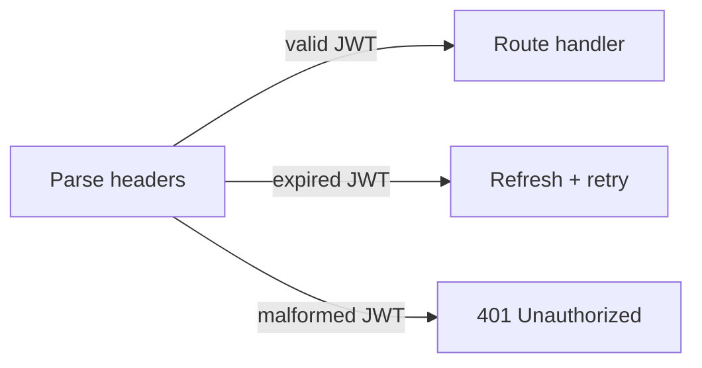
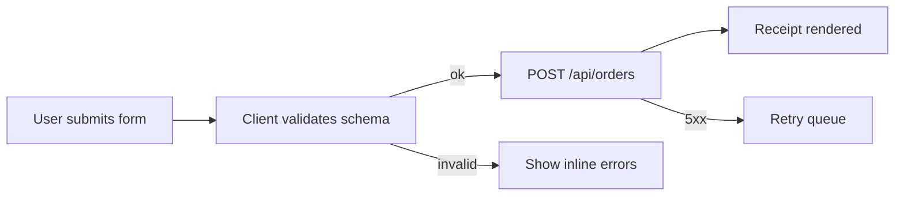
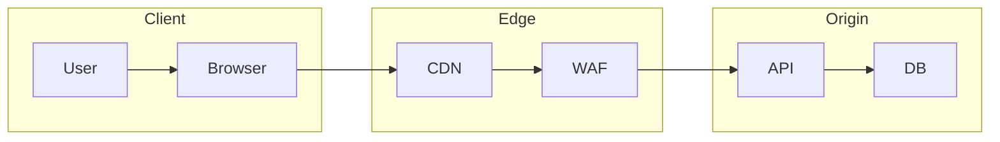
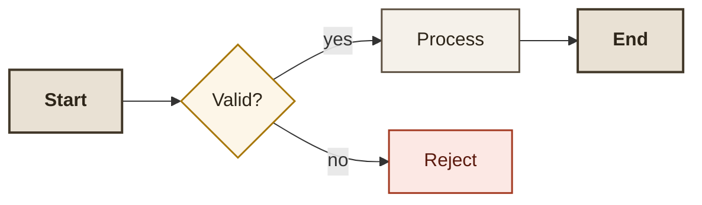
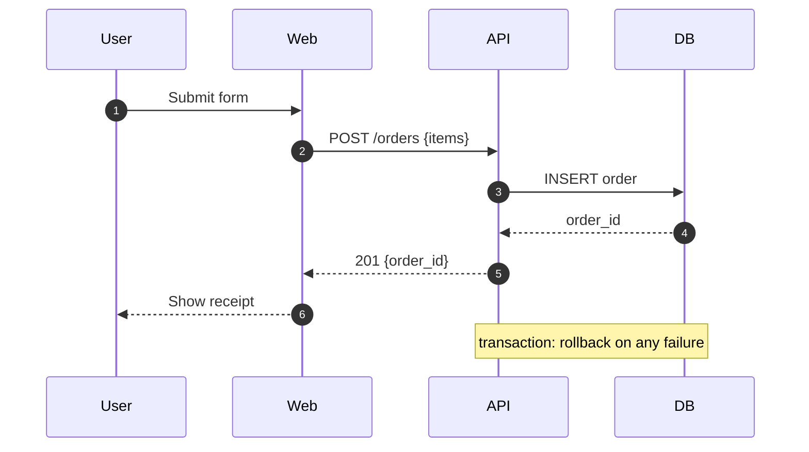
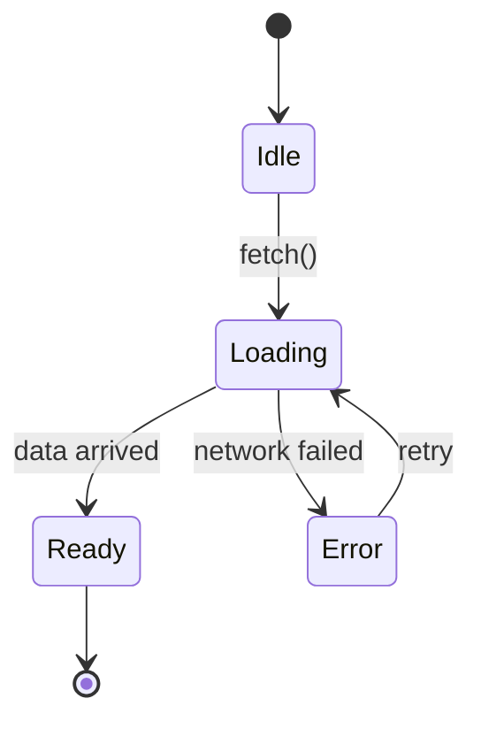
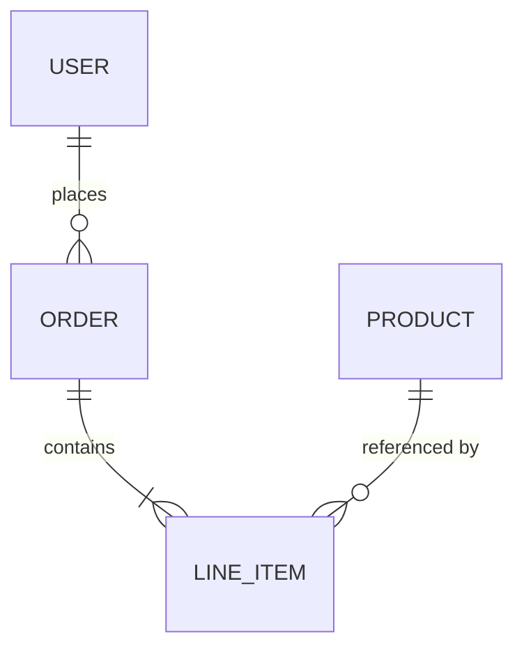
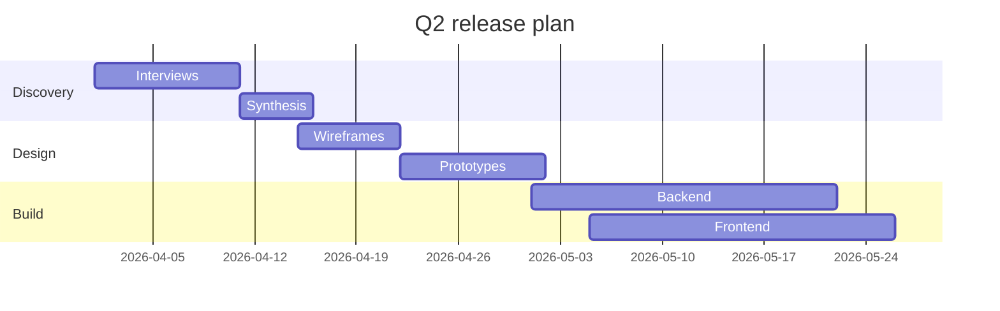
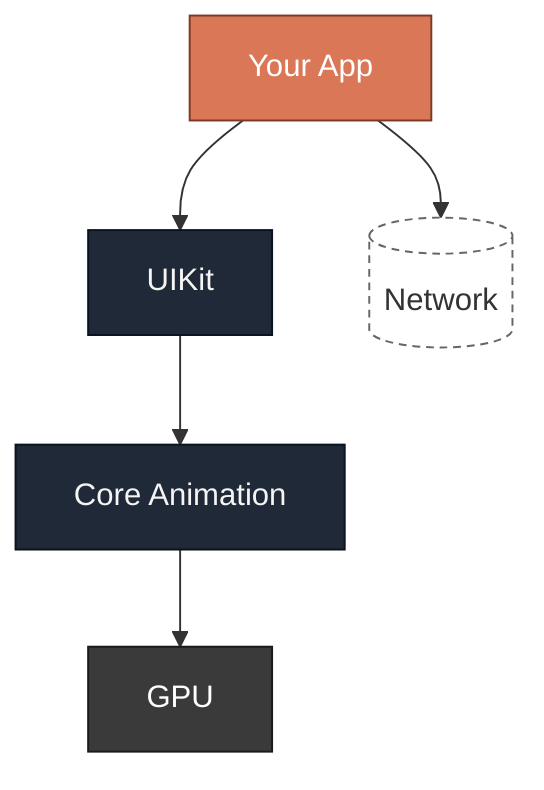
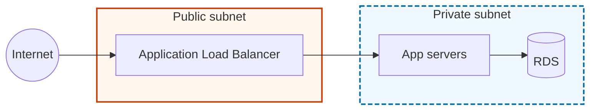

# Apex-Artifacts — Medium Playbooks (general media)

Bundled from the apex-artifacts source repository. Each source file
is enclosed by `<!-- BEGIN: path -->` ... `<!-- END: path -->`
anchors so semantic retrieval and humans can locate the original.

## Files in this bundle

- `references/medium-playbooks/claude-react-artifact.md`
- `references/medium-playbooks/react-component.md`
- `references/medium-playbooks/data-visualization.md`
- `references/medium-playbooks/svg-illustration.md`
- `references/medium-playbooks/mermaid-diagram.md`
- `references/medium-playbooks/long-form-document.md`
- `references/medium-playbooks/html-interactive.md`
- `references/medium-playbooks/math-notation.md`
- `references/medium-playbooks/slide-deck.md`
- `references/medium-playbooks/notebook.md`
- `references/medium-playbooks/email.md`
- `references/medium-playbooks/dashboard.md`
- `references/medium-playbooks/form.md`
- `references/medium-playbooks/print-pdf.md`
- `references/medium-playbooks/technical-document.md`
- `references/medium-playbooks/infographic.md`
- `references/medium-playbooks/educational-scaffold.md`
- `references/medium-playbooks/scrollytelling.md`
- `references/medium-playbooks/explorable-explanation.md`
- `references/medium-playbooks/mnemonic-medium.md`

---


<!-- BEGIN: references/medium-playbooks/claude-react-artifact.md -->

# Medium Playbook: Claude React Artifact

**The default medium for interactive / visual artifacts in Claude.**

**Patterns below are defaults, not prescriptions.** For broader creative choices, draw from `references/libraries/` — color, typography, motion, composition, icons, components, readers, etc. See `references/how-to-use-this-system.md` for the platter principle.

React artifacts rendered inside Claude.ai (chat + Projects) have the highest ceiling for visual fidelity, interactivity, and polish. This file documents that specific environment — what's preloaded, what isn't, and the idioms that produce apex output there. For general React best practices see `react-component.md`; this file is the Claude-specific overlay.

## When this is the right medium

**Default to React/JSX** for any artifact that:

- Requires any user-driven interactivity (inputs, toggles, dragging, playback)
- Shows derived views of data (charts, tables, filtered lists)
- Composes multiple visual regions (dashboard, tabs, modals, side-by-side)
- Benefits from animation or state transitions
- Wants the polish of a real UI component library

**Carve-outs — choose another medium when:**

| Medium           | Use when                                                           |
|------------------|--------------------------------------------------------------------|
| SVG              | Static illustration, schematic, figure for a document              |
| Mermaid          | Flow / sequence / ER / state diagram where the source is the asset |
| HTML             | Single-file page that must work outside Claude, or leverages non-React libs (Observable Plot, WebGL, heavy Canvas) |
| Markdown         | Essay, report, memo, primer — prose is the primary mode            |
| Notebook         | Executable computation narrated with prose                         |

When in doubt, **React wins.** The visual and interactive ceiling is higher, and the render environment is richer. Don't fall back to HTML unless you have a specific reason React can't deliver.

## The render environment

Claude's React artifact runtime is a sandboxed single-component preview. The exact library set evolves across Claude versions; always write so a missing optional library downgrades gracefully.

### Reliably available (treat as baseline)

- **React 18+** — hooks, Suspense, `<StrictMode>`-safe patterns required
- **Tailwind CSS** — the full utility set; use freely, but curate a palette (see below)
- **Recharts** — preferred chart library
- **lucide-react** — icon set; ~1,500 icons available

### Usually available

- **shadcn/ui-style primitives** importable from `@/components/ui/*`
  (`button`, `card`, `input`, `select`, `tabs`, `dialog`, `toggle`, `slider`, `switch`, `label`, `separator`, `tooltip`, `popover`, `sheet`, `table`, `badge`, `alert`, `checkbox`, `radio-group`, `accordion`, `progress`)
- **`@/lib/utils`** — contains `cn()` (clsx + tailwind-merge) for class composition
- **framer-motion / motion** — animation
- **mathjs** — numeric / symbolic math
- **d3** — the full library; typically used for complex layouts / scales, not rendering (Recharts does that better)
- **three.js + @react-three/fiber + @react-three/drei** — 3D

### Not available (don't assume)

- **Network access.** No `fetch`, no external URLs for images, fonts, or data. Embed all data inline.
- **LocalStorage / sessionStorage / cookies.** Treat as unavailable; state is in-memory only.
- **Routers.** Single-page, single-component.
- **Custom npm packages** you introduce. Use only what's preloaded.
- **Build-time features.** No CSS modules, no SCSS, no PostCSS plugins beyond what Tailwind provides.

### Verify before trusting

If you depend on a specific library, wrap its import in a try/catch pattern in your head — if you find yourself unsure whether it's available, either:
1. Use the baseline alternative (Tailwind + vanilla React + Recharts + lucide-react)
2. Ask the user to confirm the environment includes it

Never let an artifact fail at render because of an optional library.

## Skeleton

Every Claude React artifact is a single default-exported component:

```tsx
import { useState, useMemo } from 'react';
import { Card, CardContent, CardHeader, CardTitle } from '@/components/ui/card';
import { Button } from '@/components/ui/button';
import { LineChart, Line, XAxis, YAxis, CartesianGrid, Tooltip, ResponsiveContainer } from 'recharts';
import { TrendingUp, Settings2 } from 'lucide-react';

export default function Artifact() {
  const [state, setState] = useState(initial);
  const derived = useMemo(() => compute(state), [state]);

  return (
    <div className="min-h-screen bg-stone-50 text-stone-900 p-6">
      {/* layout */}
    </div>
  );
}
```

### Root container rules

- Use `min-h-screen` or an explicit height so the component fills the artifact panel.
- Set background and text color at the root — do not inherit from the artifact frame.
- Add `p-6` or larger for breathing room; the preview panel has no automatic margins.
- Use a custom color scale (see Tailwind palette discipline below), not the default `gray` / `blue`.

## Tailwind palette discipline

The default Tailwind palette (`gray-500`, `blue-500`) is the most-common tell of a bland artifact. Apex artifacts curate.

### Pick a neutral family

Prefer Tailwind's warmer or cooler neutrals over generic gray:

- **Editorial / warm:** `stone-*`, `neutral-*`
- **Technical / cool:** `slate-*`, `zinc-*`

Commit to one family and use the full range (50, 100, 200, 700, 900). Mixing `stone` and `slate` in one artifact reads as accidental.

### Pick one accent hue

Pair with **one** accent from Tailwind's saturated palette:

- `sky` / `blue` / `indigo` — confident cool
- `rose` / `red` — signal / warmth
- `emerald` / `teal` — growth / neutral-positive
- `amber` / `orange` — attention / energy
- `violet` / `purple` — creative / distinctive

Shades to use: the accent's `500` / `600` / `700` for primary, `50` / `100` for soft fills, `950` for text-on-white dark applications.

### Palette template

```tsx
// Pick one pair at the top of the component; reuse everywhere.
const palette = {
  bg:        'bg-stone-50',
  surface:   'bg-white',
  surfaceAlt:'bg-stone-100',
  border:    'border-stone-200',
  text:      'text-stone-900',
  textMuted: 'text-stone-600',
  textFaint: 'text-stone-500',
  accent:    'bg-indigo-600 hover:bg-indigo-700 text-white',
  accentText:'text-indigo-700',
  accentSoft:'bg-indigo-50 text-indigo-900',
  success:   'text-emerald-700',
  danger:    'text-rose-700',
};
```

Or via CSS variables in a `<style>` block at the top of the component for maximum consistency.

### Token-set choice

Before committing to a Tailwind palette, pick a **token set** from `tokens/sets/` and let it carry the colour and font identity. Inline its CSS via a `<style>` tag at the top of the component (the set's `:root[data-token-set="<slug>"]` selector activates when you set the attribute on a wrapping element). Pick deliberately; prefer a register different from your last artifact.

| Set                | Use when…                                                                              |
|--------------------|----------------------------------------------------------------------------------------|
| `default-cool`     | SaaS / internal product / dashboard / status page — the technical default              |
| `ft-salmon`        | Financial analysis, business memo, editorial long-form — paper-and-navy gravitas       |
| `quanta-cobalt`    | Scientific explainer, math derivation, technical paper figure — rigor with cobalt      |
| `penguin-classic`  | Primer, classic-literature register, restrained editorial — cream + spine black + orange |
| `ukiyo-e`          | Cultural / narrative / illustrative — washi + indigo + vermilion (gold decorative-only) |
| `scandi-fog`       | Wellness, healthcare-adjacent, contemplative — pale fog + moss + plum                  |

When you opt into a set, source `--n-*`, `--accent-*`, `--chart-*` from it rather than hand-picking Tailwind utilities — the Tailwind palette discipline above still applies, but it becomes "use Tailwind utilities sparingly for layout/state, defer to set tokens for colour."

### Never ship with:
- `bg-gray-500`, `text-gray-600`, `bg-blue-500` as your identity
- Six different accent hues
- Mixed neutral families (stone + slate)
- Default shadcn/ui styling with no theming touches

## Composition patterns

### Layout primitives

```tsx
// Full-bleed dashboard
<div className="min-h-screen bg-stone-50 text-stone-900">
  <header className="border-b border-stone-200 px-6 py-4 bg-white">...</header>
  <main className="max-w-7xl mx-auto px-6 py-8 grid grid-cols-12 gap-6">
    <aside className="col-span-3">...</aside>
    <section className="col-span-9">...</section>
  </main>
</div>

// Centered reading-width artifact
<article className="max-w-3xl mx-auto px-6 py-12 prose prose-stone">
  ...
</article>

// Two-pane explainer
<div className="grid lg:grid-cols-[360px_1fr] min-h-screen">
  <aside className="bg-stone-100 p-6 border-r border-stone-200">...</aside>
  <main className="p-8">...</main>
</div>
```

### State modeling

For any artifact with > 2 states, use a tagged union:

```tsx
type Phase =
  | { kind: 'idle' }
  | { kind: 'running'; tick: number }
  | { kind: 'paused'; tick: number }
  | { kind: 'done'; result: Result };

const [phase, setPhase] = useState<Phase>({ kind: 'idle' });
```

Never combine `isLoading`, `data`, `error` booleans — they produce impossible states. Tagged unions don't.

### Controls with live output

Every user-facing control follows the Affordance Principle: say what you control, show current value, hint at effect.

```tsx
<label htmlFor="eta" className="flex justify-between items-baseline font-medium">
  <span>Learning rate η</span>
  <output htmlFor="eta" className="font-mono text-indigo-700 tabular-nums">
    {eta.toFixed(3)}
  </output>
</label>
<input
  id="eta"
  type="range" min={0.001} max={1.5} step={0.001}
  value={eta}
  onChange={(e) => setEta(Number(e.target.value))}
  className="w-full accent-indigo-600"
  aria-describedby="eta-hint"
/>
<p id="eta-hint" className="text-sm text-stone-500 mt-1">
  Smaller → slower convergence. Above 1.0, the optimizer may diverge.
</p>
```

### Charts: always customize

The worst React artifacts have default Recharts output. Required customization:

```tsx
<ResponsiveContainer width="100%" height={320}>
  <LineChart data={data} margin={{ top: 16, right: 24, bottom: 24, left: 8 }}>
    <CartesianGrid stroke="#e7e5e4" strokeDasharray="2 4" vertical={false} />
    <XAxis
      dataKey="x"
      tick={{ fill: '#44403c', fontSize: 12 }}
      axisLine={{ stroke: '#d6d3d1' }}
      tickLine={false}
    />
    <YAxis
      tick={{ fill: '#44403c', fontSize: 12 }}
      axisLine={false}
      tickLine={false}
      width={40}
    />
    <Tooltip
      contentStyle={{
        background: '#fff',
        border: '1px solid #e7e5e4',
        borderRadius: 6,
        fontSize: 13,
      }}
      labelStyle={{ fontWeight: 600, color: '#1c1917' }}
    />
    <Line
      dataKey="y"
      stroke="#4f46e5"
      strokeWidth={2}
      dot={false}
      activeDot={{ r: 4 }}
      isAnimationActive={false}
    />
  </LineChart>
</ResponsiveContainer>
```

Title, units, annotations → **outside** the chart (HTML above), not inside its config. `<ReferenceLine>` and `<ReferenceArea>` for in-plot annotation.

### Icons

lucide-react icons are line-based, consistent, and restrained. Use them as signals, not decoration:

```tsx
import { Play, Pause, RotateCcw, TrendingUp } from 'lucide-react';

<Button className="gap-2">
  <Play className="w-4 h-4" />
  Run
</Button>
```

Rules:
- One icon set per artifact (don't mix lucide with emoji with custom SVG).
- Icons at `w-4 h-4` alongside text; `w-5 h-5` for standalone buttons.
- Never as pure decoration (a lone sparkle icon next to every heading is noise).
- `aria-hidden` if accompanied by a visible text label.

### shadcn/ui primitives

When available, prefer shadcn components over re-rolling basic UI. They're accessible by default:

```tsx
import { Card, CardHeader, CardTitle, CardDescription, CardContent, CardFooter } from '@/components/ui/card';
import { Tabs, TabsList, TabsTrigger, TabsContent } from '@/components/ui/tabs';
import { Button } from '@/components/ui/button';
import { Slider } from '@/components/ui/slider';
import { Switch } from '@/components/ui/switch';

<Card>
  <CardHeader>
    <CardTitle>Parameters</CardTitle>
    <CardDescription>Adjust these to see the effect.</CardDescription>
  </CardHeader>
  <CardContent>...</CardContent>
</Card>
```

Caveat: the visual identity of pure shadcn defaults is recognizable. Apply palette overrides via `className`; don't ship stock-gray cards.

## Animation

Two tiers:

### Subtle (CSS transitions via Tailwind)

For hover states, focus transitions, panel expand/collapse:

```tsx
<div className="transition-all duration-200 ease-out hover:-translate-y-0.5 hover:shadow-lg">
```

Honor reduced motion via Tailwind's `motion-safe:` prefix:

```tsx
<div className="motion-safe:transition-transform motion-safe:duration-300 hover:scale-[1.02]">
```

### Rich (framer-motion / motion)

For data-driven transitions, staged reveals, drag interactions:

```tsx
import { motion, AnimatePresence } from 'motion/react';

<AnimatePresence mode="wait">
  {phase.kind === 'running' && (
    <motion.div
      key="running"
      initial={{ opacity: 0, y: 8 }}
      animate={{ opacity: 1, y: 0 }}
      exit={{ opacity: 0, y: -8 }}
      transition={{ duration: 0.24, ease: [0.2, 0, 0, 1] }}
    >
      ...
    </motion.div>
  )}
</AnimatePresence>
```

framer-motion respects `prefers-reduced-motion` if you set `<MotionConfig reducedMotion="user">` at the root.

## Playback controls (for simulators / step-throughs)

```tsx
const [phase, setPhase] = useState<'idle' | 'playing' | 'paused'>('idle');
const [tick, setTick] = useState(0);
const [speed, setSpeed] = useState(1); // steps per frame

useEffect(() => {
  if (phase !== 'playing') return;
  const id = setInterval(() => {
    setTick((t) => (t >= maxTicks ? t : t + speed));
  }, 1000 / 60);
  return () => clearInterval(id);
}, [phase, speed]);

// Controls row:
<div className="flex items-center gap-2">
  <Button onClick={() => setPhase(phase === 'playing' ? 'paused' : 'playing')}>
    {phase === 'playing' ? <Pause /> : <Play />}
  </Button>
  <Button variant="ghost" onClick={() => { setPhase('idle'); setTick(0); }}>
    <RotateCcw /> Reset
  </Button>
  <div className="flex-1 mx-2">
    <input type="range" min={0} max={maxTicks} value={tick}
           onChange={(e) => setTick(Number(e.target.value))} className="w-full" />
  </div>
  <span className="font-mono text-sm text-stone-500">
    {tick} / {maxTicks}
  </span>
</div>
```

## Keyboard support

Every interactive artifact should expose keyboard shortcuts:

```tsx
useEffect(() => {
  function onKey(e: KeyboardEvent) {
    if (e.target instanceof HTMLInputElement) return; // don't hijack typing
    if (e.key === ' ') { e.preventDefault(); togglePlay(); }
    if (e.key === 'ArrowRight') step(+1);
    if (e.key === 'ArrowLeft') step(-1);
    if (e.key === 'r') reset();
  }
  window.addEventListener('keydown', onKey);
  return () => window.removeEventListener('keydown', onKey);
}, [togglePlay, step, reset]);
```

Document shortcuts somewhere visible — a small "Keyboard: space = play, ←/→ = step, r = reset" at the bottom.

## Data handling

All data is inline. Keep constants near the top:

```tsx
const DATA = [
  { date: '2026-01-01', value: 64, event: null },
  { date: '2026-02-09', value: 92, event: 'Pricing change' },
  ...
] as const;
```

For larger datasets (> 200 rows), generate procedurally in a `useMemo`:

```tsx
const data = useMemo(() => {
  const rows = [];
  for (let t = 0; t < 1000; t++) {
    rows.push({ t, y: simulate(t, params) });
  }
  return rows;
}, [params]);
```

## Text content

- No placeholder prose. Lorem ipsum / "Click here" / "Welcome" are instant quality tells.
- Title = claim or specific question, not a topic.
- One-sentence lede that establishes scope and payoff.
- Captions on figures ("Figure 1. X evolved as Y changed.").
- Metadata footer if the artifact represents data: source, n, date.

## Anti-patterns specific to Claude React artifacts

1. **Default Tailwind palette.** `gray-500` + `blue-500` as the design system.
2. **Stock Recharts output.** Pink lines, corner legends, no customization.
3. **Icon spam.** Every heading gets an icon, every paragraph gets a bullet with an icon.
4. **Shadcn-as-design.** Plain shadcn cards with no theming read as framework-default.
5. **The six-card dashboard.** Generic "revenue / users / orders / average / conversion / retention" KPI grid with no argument.
6. **Scrolling horror.** Setting `overflow-x: auto` on a responsive container and shipping a wide table with no column controls.
7. **Un-pauseable animations.** Auto-playing looping visualizations that can't be stopped.
8. **Tooltip-only information.** Key values visible only on hover, inaccessible on touch or keyboard.
9. **No empty / loading / error states.** Only the happy path is designed.
10. **Math / derived values without units.** `12.847` means nothing without context.
11. **Network fetches.** `fetch()` to an external API. Will fail silently in the sandbox.
12. **External image URLs.** Not loaded. Use inline SVG or generate visuals procedurally.

## What 10/10 looks like

Two named exemplars from beyond the 7/10 baseline this playbook teaches.

### Exemplar 1 — Bartosz Ciechanowski, *Mechanical Watch* (2022)

A web essay that explains a watch movement by letting the reader drive every gear. Each scroll position binds to a parameter (escapement angle, balance amplitude, beat rate); the same hand-drawn SVG components persist across sections, so the reader feels the same parts being re-explained, not new ones being introduced. Default scrollytelling resets between sections; Ciechanowski refuses that reset. The move resists default reproduction because it requires one shared state container under every figure on the page. **The move to steal: *scroll-bound state persisting across hand-drawn SVG figures.***

```tsx
const [scrollY, setScrollY] = useState(0);
useEffect(() => {
  const onScroll = () => setScrollY(window.scrollY);
  window.addEventListener('scroll', onScroll, { passive: true });
  return () => window.removeEventListener('scroll', onScroll);
}, []);
const angle = Math.min(scrollY / 600, 1) * 45; // shared across every <Gear/> below
return <Gear rotation={angle} teeth={24} />;
```

### Exemplar 2 — Linear product UI (Linear.app, 2019–present)

A project tracker whose keyboard surface is the product. Every action has a shortcut; shortcuts compose (`g i` for *go to inbox*, `a` to assign, `c` to comment); the command palette (`⌘K`) is a typed fuzzy-searched mirror of every menu. Default React app keyboard support is tab order; Linear's is a grammar. The move resists default reproduction because it requires a single registry of actions, each named, each callable from palette and shortcut alike. **The move to steal: *keyboard-first command surface with composable shortcuts.***

```tsx
const actions = {
  'assign-me': { keys: 'a m', label: 'Assign to me', run: () => assign(me) },
  'go-inbox':  { keys: 'g i', label: 'Go to inbox',  run: () => nav('/inbox') },
};
useHotkeys(actions); // bind every shortcut
return <CommandPalette actions={actions} hotkey="mod+k" />;
```

### Calibration question

If you removed every shadcn default class, would the artifact still feel designed?

## Ship checklist (Claude React artifact)

- [ ] Single default-exported component; compiles with no errors.
- [ ] Palette: one curated neutral family + one accent; no default `gray`/`blue`.
- [ ] Every chart customized (colors, axes, fonts); title+units live outside the chart.
- [ ] Every control has label, visible value, and effect-hint.
- [ ] Interactive state modeled as tagged union (for > 2 states).
- [ ] Keyboard support for primary actions; shortcuts documented.
- [ ] `prefers-reduced-motion` respected.
- [ ] Empty / loading / error states present where applicable.
- [ ] No `fetch`, no external URLs, no localStorage assumed.
- [ ] No placeholder copy anywhere.
- [ ] All data and text have units, sources, and captions where applicable.
- [ ] Tested: resize the artifact panel narrow — still usable?
- [ ] Tested: with reduced motion turned on — still functional?

<!-- END: references/medium-playbooks/claude-react-artifact.md -->

---


<!-- BEGIN: references/medium-playbooks/react-component.md -->

# Medium Playbook: React Component

> **Scope note.** For Claude artifact-runtime work (the default medium), start with `claude-react-artifact.md` — it covers the sandbox constraints, preloaded libraries, and apex moves for that specific environment. *This* file covers React-component-hygiene principles that apply outside the Claude artifact runtime: production React apps, design-system components, library code. Read both for Claude artifacts; read this one alone for anything else.

For artifacts rendered as React components.

**These patterns are defaults, not prescriptions.** For broader creative choices — color, typography, composition, motion, icon systems, component variants, data shapes — draw from `references/libraries/`. See `references/how-to-use-this-system.md` for the platter principle.

## Environment defaults

- Assume React 18+ with hooks. No class components.
- Tailwind utility classes are available; shadcn/ui-style primitives may be available.
- Lucide icons available via `lucide-react`. Use them sparingly (icon as signal, not decoration).
- Recharts is typically available for data visualization.
- No network fetches (CORS + preview environment). Data is embedded or mocked.
- Export a single default component.

## Non-negotiables

- **TypeScript-style prop types** in comments when JS, or actual TS interfaces if TS is used. No `any`.
- **All hooks at top level.** No conditional hooks.
- **Keys on list items** — use stable identifiers, not array indices (unless the list truly is order-only).
- **Controlled inputs** — every form element has a value + onChange pair, or is explicitly uncontrolled with a `defaultValue`.
- **No memory leaks** — any `setInterval`, `setTimeout`, event listener, or subscription is cleaned up in the `useEffect` return.
- **Accessible semantics** — see `hard-gates.md`. Tailwind's `sr-only` utility is your friend.

## Composition pattern

```tsx
// Small, focused, pure where possible. State lives at the lowest sufficient level.
function App() {
  const [state, setState] = useState(initial);
  return (
    <Layout>
      <Header title="..." />
      <Main>
        <ControlPanel value={state} onChange={setState} />
        <Visualization data={derive(state)} />
        <Legend />
      </Main>
    </Layout>
  );
}
```

Rules of thumb:
- A component file > 200 lines is probably two components.
- Pass derived data down, not raw data + logic.
- Lift state up only to the lowest ancestor that needs it.
- Use `useMemo` for expensive derivations over > 100 items.
- Prefer composition over props explosion. A component with 9+ props wants to be split.

## Styling

Use the CSS variables in `design-tokens.md` as a foundation; Tailwind's `[--var]` syntax works with them:

```tsx
<div className="bg-[var(--n-50)] text-[var(--n-900)] p-6 rounded-[var(--r-md)]">
```

Or, for richer components, define a small `<style>` block with the token scaffold at the top, then use semantic class names.

**Do not**: sprinkle `bg-blue-500`, `text-gray-600`, `shadow-lg` from defaults. The result is visually indistinguishable from every other generic React artifact.

## Interactive state machine

Any component with > 2 states (idle, loading, success, error, etc.) should model states explicitly:

```tsx
type Phase =
  | { kind: 'idle' }
  | { kind: 'loading' }
  | { kind: 'ready'; data: Result }
  | { kind: 'error'; message: string };

const [phase, setPhase] = useState<Phase>({ kind: 'idle' });

return (
  <>
    {phase.kind === 'idle' && <IdleView onStart={...} />}
    {phase.kind === 'loading' && <Spinner label="Computing…" />}
    {phase.kind === 'ready' && <Ready data={phase.data} />}
    {phase.kind === 'error' && <ErrorView message={phase.message} />}
  </>
);
```

A boolean `isLoading` invariably ends up tangled with a `data` and an `error` and produces impossible states. Tagged unions don't.

## Data visualization (Recharts)

Never ship a chart with defaults. Minimum customization:

```tsx
<ResponsiveContainer width="100%" height={320}>
  <LineChart data={data} margin={{ top: 16, right: 24, bottom: 24, left: 8 }}>
    <CartesianGrid stroke="var(--n-200)" strokeDasharray="2 4" vertical={false} />
    <XAxis
      dataKey="date"
      tick={{ fill: 'var(--n-700)', fontSize: 12 }}
      axisLine={{ stroke: 'var(--n-300)' }}
      tickLine={false}
    />
    <YAxis
      tick={{ fill: 'var(--n-700)', fontSize: 12 }}
      axisLine={false}
      tickLine={false}
      width={40}
    />
    <Tooltip
      contentStyle={{
        background: 'var(--n-50)',
        border: '1px solid var(--n-200)',
        borderRadius: 8,
        fontSize: 13,
      }}
      labelStyle={{ color: 'var(--n-900)', fontWeight: 600 }}
    />
    <Line
      dataKey="value"
      stroke="var(--accent)"
      strokeWidth={2}
      dot={false}
      activeDot={{ r: 4 }}
    />
  </LineChart>
</ResponsiveContainer>
```

Title, unit, and source belong *above* the chart in HTML, not inside the chart config. Annotation callouts pinned to specific data points belong as `<ReferenceLine>` or `<ReferenceArea>` with labels.

## Error boundaries

Wrap risky subtrees (anything that parses untrusted input, anything async, anything that computes from user controls) in an error boundary. React 18 doesn't give a hook form; use a class boundary or a library primitive.

## Anti-patterns to avoid

1. `useEffect` as a state setter on every render (missing dependency array → infinite loop).
2. Mutating state directly (`state.push(x)` instead of `setState([...state, x])`).
3. Deriving state that could be computed during render — leads to drift.
4. Prop drilling more than 2 levels deep — use context.
5. Over-memoization. `useMemo` for a cheap lookup is cargo culting.
6. Destructuring in a render that creates a new object each time, passed as a prop to a memoized child (defeats the memo).
7. Using `index` as a `key` when the list can be reordered.

## What 10/10 looks like

Two named exemplars from beyond the 7/10 baseline this playbook teaches.

### Exemplar 1 — Radix UI primitives (WorkOS / @radix-ui, 2020–present)

Headless component primitives — `Dialog`, `Popover`, `Select`, `Tabs` — that ship behavior, accessibility, and keyboard semantics, but zero styling. State is exposed not through props but through `data-state` attributes on the rendered DOM (`data-state="open"`, `data-state="checked"`, `data-orientation="vertical"`), so styling hooks are just attribute selectors. Default React components ship behavior and styling fused; Radix refuses the fusion. The move resists default reproduction because every state must be reified as a DOM attribute, not just internal state. **The move to steal: *headless behavior + visible state via data-attributes for styling hooks.***

```tsx
function Toggle({ pressed, onPressedChange, children }: Props) {
  return (
    <button
      type="button"
      aria-pressed={pressed}
      data-state={pressed ? 'on' : 'off'}
      onClick={() => onPressedChange(!pressed)}
    >
      {children}
    </button>
  );
}
// CSS: [data-state="on"] { background: var(--accent); }
```

### Exemplar 2 — TanStack Table v8 column definitions (Tanner Linsley, 2022)

A table library where the column schema is the API. Each column is an object with `accessorKey`, `header`, `cell`, `sortingFn`, `filterFn` — render-prop style. Sort, filter, format, and display are decoupled from the JSX; the table just iterates the schema. Default React table components hard-code columns into the markup; TanStack hoists them into data. The move resists default reproduction because it requires every cell concern to be expressible as a function on row data, not as JSX children. **The move to steal: *render-prop column schema decoupling sort/filter/format from JSX.***

```tsx
const columns: ColumnDef<Row>[] = [
  { accessorKey: 'name', header: 'Name', cell: (c) => <strong>{c.getValue()}</strong> },
  { accessorKey: 'amount', header: 'Amount',
    cell: (c) => fmtUSD(c.getValue<number>()), sortingFn: 'basic' },
];
const table = useReactTable({ data, columns, getCoreRowModel: getCoreRowModel() });
return <Table table={table} />;
```

### Calibration question

Could a second developer write a new variant without touching the component's internals?

## Ship checklist (React-specific)

- [ ] Renders with no console errors or warnings.
- [ ] `strictMode` passes (no double-render side effects).
- [ ] All interactive elements keyboard-reachable.
- [ ] Resize the preview to narrow — still usable? Wrap? Scroll?
- [ ] Dark mode via `@media (prefers-color-scheme: dark)` works.
- [ ] No unused imports, unused state, or console logs.
- [ ] Props typed (TS) or documented (JSDoc).

<!-- END: references/medium-playbooks/react-component.md -->

---


<!-- BEGIN: references/medium-playbooks/data-visualization.md -->

# Medium Playbook: Data Visualization

Charts, plots, and info-graphics embedded in artifacts. Apply these whether using Recharts, D3, Observable Plot, Chart.js, or raw SVG.

**Patterns below are defaults, not prescriptions.** For the full grammar of visualization — every named chart form including uncommon ones (horizon, slope, bump, ridgeline, alluvial, marimekko, isotype, parallel coordinates), visualization literature, composition from primitives — see `references/libraries/visualization-grammar.md`. For palettes that extend beyond the default chart palette, see `references/libraries/color-library.md`.

## Start from the question

A chart exists to answer a specific question. Write the question out before drawing:

- **Comparison** ("is A bigger than B?") → bar, dot plot.
- **Composition** ("what fraction is each part?") → stacked bar, treemap; pie *only* for ≤ 4 parts, clearly differentiated.
- **Distribution** ("how is X spread?") → histogram, density plot, strip plot, box plot.
- **Relationship** ("how does X relate to Y?") → scatter, binned scatter, 2D density.
- **Change over time** ("how did X evolve?") → line, small multiples, horizon chart.
- **Flow / path** ("how does X move between states?") → Sankey, chord, parallel coordinates.
- **Geography** ("where is X?") → choropleth, bubble map, dot-density.
- **Hierarchy** ("how does X nest?") → sunburst, icicle, treemap.

Pick the chart that best answers the question — not the one most readily available.

## The ink-to-insight ratio

Tufte's principle: minimize non-data-ink.

**Remove**:
- Chart borders.
- Background fills.
- Heavy grids (use faint horizontal rules only when needed).
- Legends placed far from the data (inline labels win).
- 3D effects on 2D data.
- Shadows.
- Default outlines on bars and points.

**Keep**:
- The data marks.
- Axes (usually thin, with tick labels but minimal tick marks).
- Labels and annotations that interpret the data.
- Reference lines and bands that provide context.

## Composition: title, lede, chart, source

Every chart is a miniature document:

```
TITLE — the claim ("Growth concentrated in Q2, then plateaued")
LEDE  — context sentence ("7-day rolling average; shaded = post-launch")
CHART — the data, annotated
SOURCE — "Source: internal analytics, 2026-04 snapshot. n = 84,912."
```

A chart with a title that is the metric's name alone ("Revenue") is underbaked. A chart with a title that is the finding ("Revenue doubled after pricing change, then retreated") is apex.

## Axes

- Start y-axis at zero for bar/area charts. Truncating a bar-chart y-axis misleads.
- Line charts may start above zero *when* the variance is small relative to the absolute values and *when* the truncation is annotated.
- Logarithmic scale for data spanning > 2 orders of magnitude; annotate log scale explicitly.
- Axis labels include **units** and, if non-obvious, **direction** ("higher = better").
- Tick density: enough to read values, not so many they clutter. 5–8 ticks per axis is usually right.
- Dates on x-axis: show year only at year boundaries; show month/day at natural intervals.
- Rotated labels ruin scanning — if labels are long, use horizontal bars (i.e., swap x and y) instead.

## Color

### Categorical data
- Use the ordinal palette from `design-tokens.md` (≤ 8 colors).
- If > 8 categories: bucket the tail into "Other," or switch to small multiples.
- Never rely on color alone — pair with shape (scatter) or position (reference).

### Sequential data
- Single-hue ramp. Lightness encodes magnitude.
- Viridis / Magma are fine but may be overused; the stone or slate ramp from the palette is fresher.

### Diverging data
- Two hues meeting at a neutral midpoint (often white or stone-50).
- Midpoint must be meaningful (zero, baseline, average).
- Verify colorblind safety: red ↔ blue works; red ↔ green doesn't.

### Semantic color
- Reserve red for "bad" / error / loss. Green for "good" / gain. Amber for caution.
- Do not double-duty semantic color for categorical encoding.

## Annotation

Annotation is the difference between a chart and an argument.

- **Labels on data points** beat tooltips when the set is small. A 5-line chart should have end-labels, not a legend.
- **Reference lines** for thresholds, targets, averages.
- **Reference bands** for ranges (normal operating range, confidence interval).
- **Callouts** (short text + leader line) for specific values worth pointing out.

```
  value
  100 ┤
      │                    ╭─── launch ──── 89
   75 ┤        ╭──────────╯
      │       ╱
   50 ┤──────╯            │
      │                    ▲  Feb 9 pricing change
   25 ┤
      └┬────┬────┬────┬────┬
       Jan  Feb  Mar  Apr  May
```

## Small multiples

When comparing > 3 series, small multiples often beat a single overlaid chart.

- Shared axes (same scale across panels) for comparability.
- 3–4 panels per row typically.
- Highlight the "focused" series in each panel; render others in faint gray as context.

## Interactive charts

Interactivity earns its place if it answers a question the reader has that can't be answered from the static view.

Default interactions:
- **Hover**: tooltip with full data for the mark under cursor.
- **Legend click**: toggle a series on/off.
- **Brushing**: drag to select a range (filters, zooms).
- **Linked views**: selection in one chart highlights matching items in another.

Non-defaults (avoid unless necessary):
- Autoplay animations of data transitions.
- Mandatory tooltips (the data should be partially visible without hovering).
- Deep zoom — often a second "detail" chart beats zoom.

## Direct labeling vs. legends

Direct labeling is almost always better than a legend:

```
[Anti-pattern]
  ├── chart ──┤   ◼ revenue
              ◼ cost
              ◼ profit

[Apex]
  ├── chart ──── revenue (top line)
                  cost (middle line)
                  profit (bottom line)
```

Reader's eye doesn't leave the data. The labels *are* the legend.

Exceptions: when direct labels would overlap catastrophically; when series count is high; when labels change frequently (interactive).

## Chart-specific gotchas

### Bar charts
- Horizontal for categorical labels > 8 characters.
- Order bars by value (descending) unless the categorical order is meaningful (e.g., time).
- Gap between bars ≈ 20–30% of bar width.

### Line charts
- If > 5 lines, the chart fails. Use small multiples or highlight.
- Dots on lines only if the data points are genuinely discrete and sparse (≤ ~20 points).
- Never connect across gaps; break the line.

### Scatter plots
- Alpha-blend points when they overlap (`fill-opacity: 0.6`).
- Add a trend line or smoother if the relationship is the point.
- Jitter when many points share exact values on one axis.

### Pie / donut
- ≤ 4 slices. More → bar chart.
- No 3D pies. Ever.
- Label slices directly with percentage; don't rely on the legend alone.

### Heatmaps
- Order rows/columns by clustering, magnitude, or semantic order — never alphabetically unless alphabet is meaningful.
- Include a color scale legend.
- Annotate individual cells with values when the grid is small enough (< 30 × 30).

### Stacked area
- Use only when the total is meaningful and the components sum to something interpretable.
- Order categories by stability (largest or most stable at the bottom).

## Anti-patterns to avoid

1. **Dual y-axes**. Almost always misleading. Use two panels instead.
2. **Pie chart with 10 slices**.
3. **Rainbow (jet) colormap** on continuous data — not perceptually uniform.
4. **Missing units** on axes.
5. **Legend far from the marks**.
6. **3D anything** on 2D data.
7. **Chart junk**: background images, decorative borders, gratuitous gradients.
8. **Truncated y-axis on a bar chart** without annotation.
9. **Unordered categorical bars** (alphabetical when no meaning).
10. **Time series with missing data silently connected** (pretends continuity).

## What 10/10 looks like

Two named exemplars from beyond the 7/10 baseline this playbook teaches.

### Exemplar 1 — John Burn-Murdoch / Financial Times, COVID trajectory charts (2020)

The "days since Nth case" series that anchored pandemic understanding for months. The y-axis is logarithmic, so exponential growth reads as a straight line and countries on different doubling times become visually comparable. Country trajectory endings are directly labeled (no legend); policy events (lockdowns, mask mandates, school closures) are annotated on the chart surface where they happen. Default dataviz keeps annotations in captions; FT pinned them to the marks. The move resists default reproduction because each annotation requires editorial judgment about *which* event mattered. **The move to steal: *log y-axis with directly-labeled trajectory ends and event annotations on the chart surface.***

```tsx
<LineChart data={byCountry}>
  <YAxis scale="log" domain={[1, 'auto']} ticks={[1,10,100,1000,10000]} />
  <XAxis dataKey="daysSinceN" label={{ value: 'Days since 100th case' }} />
  {countries.map(c => <Line key={c.iso} dataKey={c.iso} stroke={c.color} dot={false} />)}
  <ReferenceLine x={42} stroke="#888" strokeDasharray="2 4"
    label={{ value: 'UK lockdown', position: 'top', fontSize: 11 }} />
  <LabelList dataKey="iso" position="right" /> {/* direct label, no legend */}
</LineChart>
```

### Exemplar 2 — Edward Tufte, sparklines in *Beautiful Evidence* (2006)

Word-sized graphics that read as type: a 60-data-point trend tucked inline with the prose, no axes, no labels, just the shape. "Glucose has been steady ▁▂▂▃▂▁▁ since the dose change." The chart sits in the line of running text, the same x-height as the surrounding letters. Default dataviz reaches for a 400×300 figure; Tufte argued for word-scale. The move resists default reproduction because every chart library defaults to chrome the sparkline must refuse. **The move to steal: *inline word-scale graphics that read as type.***

```tsx
function Sparkline({ data }: { data: number[] }) {
  const w = 60, h = 14;
  const max = Math.max(...data), min = Math.min(...data);
  const pts = data.map((v, i) =>
    `${(i / (data.length - 1)) * w},${h - ((v - min) / (max - min)) * h}`).join(' ');
  return <svg width={w} height={h} style={{ verticalAlign: 'baseline' }}>
    <polyline points={pts} fill="none" stroke="currentColor" strokeWidth={1} />
  </svg>;
}
// Usage: <p>Glucose <Sparkline data={readings}/> steady since the dose change.</p>
```

### Calibration question

What can I delete from this chart without losing information?

## Ship checklist (dataviz)

- [ ] Chart type fits the question.
- [ ] Title is a claim, not a metric name.
- [ ] Units, scale, and source are explicit.
- [ ] Axes readable; ticks sensible; no rotated labels.
- [ ] Palette is project-consistent and colorblind-safe.
- [ ] Direct labeling used where possible; legend adjacent when not.
- [ ] Annotations explain the "why" of peaks, troughs, changes.
- [ ] Truncated axes are annotated as such.
- [ ] Interactive features (if any) work keyboard-accessibly.
- [ ] A blind user could get the point from an accompanying text summary or table.

<!-- END: references/medium-playbooks/data-visualization.md -->

---


<!-- BEGIN: references/medium-playbooks/svg-illustration.md -->

# Medium Playbook: SVG Illustration

For figures, diagrams, schematics, decorative graphics, and icon-scale illustrations.

**Patterns below are defaults, not prescriptions.** Illustration has vast traditions — botanical plates, anatomical atlases, scientific diagrams, medieval marginalia, cartographic work, Art Nouveau, Japanese woodblock, and more. See `references/libraries/inspiration-atlas.md`, `references/libraries/iconography-library.md`, `references/libraries/medical-artifacts.md`, and `references/libraries/scientific-artifacts.md`.

## Set up the canvas

```xml
<svg xmlns="http://www.w3.org/2000/svg"
     viewBox="0 0 800 500"
     role="img"
     aria-labelledby="title desc"
     font-family="Inter, system-ui, sans-serif">
  <title id="title">Request flow through the validator</title>
  <desc id="desc">Three stages: receive, validate, dispatch. Two error paths return 4xx responses.</desc>
  <!-- content -->
</svg>
```

- Use `viewBox`, not `width`/`height` attributes. The SVG scales responsively.
- Always provide `<title>` and `<desc>` for accessibility. The `<title>` is the short label announced first; the `<desc>` is the longer description.
- If purely decorative, set `aria-hidden="true"` and omit title/desc.

## Coordinate system

- Design on a grid (typically 8 or 10 units). Snap to the grid; keeps visual rhythm.
- Common `viewBox` sizes: 800×500 (wide figure), 400×400 (square), 600×300 (banner), 24×24 (icon).
- Treat stroke width as a first-class design variable: 1.5 or 2 for lines, 1 for detail, 3+ for emphasis. Do not mix 1.5 and 1.7 accidentally.

## Typography in SVG

- Set `font-family` and `font-size` on the root `<svg>` so labels inherit.
- Use `text-anchor` (`start` | `middle` | `end`) deliberately.
- Use `dominant-baseline` (`hanging` | `middle` | `alphabetic`) deliberately — relying on defaults produces misalignment.
- Labels should never overlap shapes. When shapes are dense, use leader lines, not packed labels.

```xml
<text x="400" y="40" text-anchor="middle" dominant-baseline="middle"
      font-size="18" font-weight="600" fill="var(--n-900)">
  Figure 1. Request flow
</text>
```

## Color in SVG

Use CSS variables or explicit values from the palette. Avoid reinventing per-SVG colors.

```xml
<style>
  .node { fill: var(--n-100); stroke: var(--n-300); stroke-width: 1.5; }
  .node-accent { fill: var(--accent-soft); stroke: var(--accent); }
  .edge { stroke: var(--n-500); stroke-width: 1.5; fill: none; }
  .edge-error { stroke: var(--danger); stroke-dasharray: 4 4; }
  .label { font-size: 14px; fill: var(--n-900); }
  .label-meta { font-size: 12px; fill: var(--n-500); }
</style>
```

Embed the `<style>` inside the SVG for portability.

## Arrows

Arrows need consistent heads. Define once, reuse:

```xml
<defs>
  <marker id="arrow" viewBox="0 0 10 10" refX="9" refY="5"
          markerWidth="6" markerHeight="6" orient="auto-start-reverse">
    <path d="M 0 0 L 10 5 L 0 10 z" fill="var(--n-500)"/>
  </marker>
</defs>

<path class="edge" d="M 100 200 L 300 200" marker-end="url(#arrow)" />
```

For different arrow colors, define parallel markers (`#arrow-accent`, `#arrow-error`).

## Paths

- Prefer relative path commands (`m`, `l`, `c`, `q`) for reusable shapes.
- Close shapes with `Z`.
- Use rounded joins: `stroke-linejoin="round" stroke-linecap="round"` — eliminates harsh corners.
- For edges with bends, use cubic Bézier (`C`) with control points placed ⅓ and ⅔ along the line for smooth S-curves.

## Patterns and textures

Subtle texture > flat fill for large areas, when a distinctive look is wanted.

```xml
<defs>
  <pattern id="dots" width="8" height="8" patternUnits="userSpaceOnUse">
    <circle cx="2" cy="2" r="1" fill="var(--n-300)"/>
  </pattern>
</defs>
<rect x="0" y="0" width="800" height="500" fill="url(#dots)"/>
```

Use rarely. Patterns compete with information.

## Annotation

Good figures are annotated. Don't bury explanation in a caption — put it *on* the figure where relevant.

```xml
<g class="annotation">
  <line x1="420" y1="150" x2="520" y2="120" class="edge" stroke-dasharray="3 3"/>
  <circle cx="420" cy="150" r="3" fill="var(--accent)"/>
  <text x="525" y="124" class="label-meta" fill="var(--accent)">
    loaded from cache
  </text>
</g>
```

## Structure: layers

Organize content into groups in a sensible z-order:

```xml
<svg ...>
  <defs>...</defs>
  <g id="background">...</g>
  <g id="grid">...</g>        <!-- subtle backdrop -->
  <g id="edges">...</g>        <!-- drawn under nodes -->
  <g id="nodes">...</g>
  <g id="labels">...</g>       <!-- always on top -->
  <g id="annotations">...</g>
</svg>
```

## Making SVG interactive

Inline SVG in HTML is fully CSS-/JS-addressable. A clean pattern:

```xml
<g class="node" data-id="validator" tabindex="0" role="button" aria-label="Validator stage">
  <rect x="300" y="100" width="160" height="80" rx="8"/>
  <text x="380" y="148" text-anchor="middle">Validate</text>
</g>
```

```css
.node { cursor: pointer; transition: transform 160ms var(--ease); }
.node:hover, .node:focus-visible { transform: translateY(-2px); }
.node:focus-visible rect { stroke: var(--accent); stroke-width: 2; }
```

## Export and optimization

- Remove editor-specific cruft (Sketch, Figma, Illustrator metadata) before shipping.
- `decimals` in path data: 2 is plenty. More is noise.
- For inline SVG, omit `<?xml?>` prolog; for standalone `.svg` files, include it.
- If reusing shapes, use `<symbol>` + `<use>` — especially for icons.

## Anti-patterns to avoid

1. **Rasterized text**. Keep text as `<text>`, not converted-to-path, so it is selectable and searchable.
2. **Massive exported files from illustrator with nested `<g>` 10 layers deep**. Flatten.
3. **Inline styles on every element**. Use a `<style>` block.
4. **Fixed `width`/`height` with no `viewBox`**. Defeats responsiveness.
5. **Reliance on `currentColor` without testing in dark mode**. Always verify both schemes.
6. **Icon set mixing** (some Feather, some Heroicons, some custom). Pick one set for the artifact.

## Register catalog

The opening paragraph names a half-dozen traditions in passing — botanical plate, blueprint, Isotype, axonometric, woodcut, Haeckel-style specimen-art. Those six are the *clean diagrammatic* family and they ship as defaults in most SVG work. The 17 registers below extend the catalog into the *expressive*, *ornamental*, *historical-print*, *production-physical*, and *medical / clinical-pedagogical* families. Pick a register before you scaffold; mixing registers within a single figure reads as confused, never eclectic.

For each register: a short description, named exemplars, a worked code fragment short enough to absorb in one read, and a "when to use" line. The fragments are *seeds*, not finished plates — they show the move's signature, not the full plate's density.

### 1. Botanical plate

A specimen on a neutral ground, scaled to the page, with Latin label in italic, locality and date in roman small caps below. Outline carries volume through stroke modulation; hatching, when present, is sparse and structural. Maria Sibylla Merian *Metamorphosis Insectorum Surinamensium* (1705), Pierre-Joseph Redouté *Les Roses* (1817–24), the Curtis Botanical Magazine plates (1787–present).

```xml
<g class="specimen">
  <path class="contour" d="M120,40 Q160,80 150,160 T140,260" fill="none"/>
  <path class="leaf" d="M140,120 Q170,110 195,135 Q175,150 140,140 Z"/>
  <text class="latin" x="60" y="290" font-style="italic">Rosa gallica</text>
  <text class="locality" x="60" y="305">Bagatelle · 1820</text>
</g>
```

**When to use:** specimen subjects (one organism, one mineral, one artifact) where the still-life convention encodes both rigor and beauty.

### 2. Blueprint / engineering schematic

White or cyan lines on deep-blue ground; dimension lines with extension lines and arrowheads; section indicators; the diagram reads as *measured*. Distinct from register 11 below — blueprint is the *visual identity* (cyan-on-blue or white-on-blue); register 11 is the *convention system* (ISO 128, ANSI Y14.5).

```xml
<rect class="ground" fill="#1B3A6B" width="100%" height="100%"/>
<g stroke="#E8F2FF" stroke-width="0.8" fill="none">
  <rect x="120" y="80" width="240" height="120"/>
  <line x1="120" y1="220" x2="360" y2="220"/>
  <text x="240" y="240" fill="#E8F2FF" font-size="9" text-anchor="middle">240 mm</text>
</g>
```

**When to use:** when *measured-and-archival* is the visual claim; technical heritage projects; product-doc covers that want the engineering register.

### 3. Isotype pictogram

Otto Neurath's Vienna Method (1925–34) and Marie Neurath's extensions (1948–86). Restricted line weights (typically 4), restricted palette (one accent + 2 neutrals), every symbol on a shared grid, counting through repetition rather than scaling. See `references/tear-downs/12-marie-neurath-children.md`.

```xml
<g class="quantity">
  <!-- five workers = five people; do not scale to "5×" -->
  <use href="#worker" x="0" y="0"/>
  <use href="#worker" x="24" y="0"/>
  <use href="#worker" x="48" y="0"/>
  <use href="#worker" x="72" y="0"/>
  <use href="#worker" x="96" y="0"/>
</g>
```

**When to use:** quantity-comparison figures; public-health communication; any figure where the reader counts, not measures.

### 4. Exploded axonometric

A device or assembly shown with components separated along their assembly axes; assembly lines (dashed) link the pieces. The convention encodes *constructability*. iFixit teardowns, IKEA assembly diagrams, Eadweard Muybridge motion-study plates (analogous structural rhythm).

```xml
<g class="exploded" stroke="#1a1a1a" stroke-width="1" fill="#f3eee2">
  <rect x="180" y="60" width="80" height="20"/>   <!-- top plate -->
  <line x1="220" y1="80" x2="220" y2="120" stroke-dasharray="3 3"/>
  <rect x="180" y="120" width="80" height="40"/>  <!-- body -->
  <line x1="220" y1="160" x2="220" y2="200" stroke-dasharray="3 3"/>
  <rect x="180" y="200" width="80" height="16"/>  <!-- base -->
</g>
```

**When to use:** any artifact whose argument is *how it goes together*; product documentation; teardowns; mechanism explainers.

### 5. Woodcut / line-engraving

Heavy black contour, parallel hatching for shadow and form, cross-hatching only at darkest values, no halftones. Albrecht Dürer woodcuts (1490s–1520s), Thomas Bewick wood engravings (1790s), the *Penny Magazine* illustrations (1832–45).

```xml
<g class="woodcut" stroke="#111" fill="none">
  <path stroke-width="2.5" d="M60,40 Q120,30 180,40 Q200,90 180,140 Q120,150 60,140 Z"/>
  <!-- parallel hatch on the shadow side -->
  <path stroke-width="0.6" d="M150,60 L170,80 M150,70 L170,90 M150,80 L170,100"/>
</g>
```

**When to use:** historical and folk subjects; book illustration; artifacts that want a *printed* feel without invoking later photographic conventions.

### 6. Haeckel-style specimen-art

Six grammatical registers per plate — outline, hatching, label, leader, callout, plate caption — applied consistently across a series. Symmetry as composition. See `references/tear-downs/24-haeckel-kunstformen.md`. Ernst Haeckel *Kunstformen der Natur* (1899–1904).

```xml
<g class="haeckel-plate">
  <path class="outline" d="M150,40 Q200,100 150,200 Q100,100 150,40 Z"/>
  <path class="hatch"   d="M140,80 L160,100 M135,90 L155,110"/>
  <text class="label" x="170" y="60" font-style="italic">Discomedusae</text>
  <line class="leader" x1="150" y1="60" x2="165" y2="58"/>
  <text class="callout" x="155" y="120" font-weight="600">1</text>
  <text class="caption" x="60" y="240" letter-spacing="0.08em">PLATE XII · MEDUSAE</text>
</g>
```

**When to use:** scientific-illustration series where the consistency of *grammar* is itself the system; multi-plate atlases; any artifact that will live in a sequence.

### 7. Calligraphic plate

Every contour drawn with pressure variation — the line itself communicates volume and gesture. Variable-stroke SVG paths (segment-by-segment stroke-width modulation, or filled-path equivalents); `stroke-linecap="round"` and slight per-segment opacity jitter. The drawing's craft is part of its rigor; the same plate executed in clean uniform strokes reads as a different artifact. John James Audubon *Birds of America* (1827–38), Max Brödel anatomical drawings (1900s–40s), Andreas Vesalius *De humani corporis fabrica* (1543).

```xml
<g class="calligraphic">
  <!-- A wing's leading edge varies smoothly from 0.6px (tip) to 2.4px (shoulder) -->
  <path d="M40,80 Q70,60 110,55" stroke="#1a1a1a" stroke-width="0.6" fill="none" stroke-linecap="round"/>
  <path d="M110,55 Q150,55 190,65" stroke="#1a1a1a" stroke-width="1.2" fill="none" stroke-linecap="round"/>
  <path d="M190,65 Q230,80 260,105" stroke="#1a1a1a" stroke-width="1.8" fill="none" stroke-linecap="round"/>
  <path d="M260,105 Q280,130 290,160" stroke="#1a1a1a" stroke-width="2.4" fill="none" stroke-linecap="round"/>
</g>
```

**When to use:** scientific illustration where craft is part of the rigor; specimen plates; medical-textbook anatomy; any figure that should read as *drawn by a person who could see what they were drawing*.

### 8. Cartouche / ornamental frame

A decorative border carries the figure's title, source, and date in a single ornamental device — the metadata is *designed* into the plate, not bolted on as a caption. Medieval manuscript cartouches; Renaissance cartography (the title cartouche on a Blaeu atlas plate is itself a composition); contemporary postage-stamp design. Joan Blaeu *Atlas Maior* (1662), the title cartouches on Mercator's world maps, the engraved frontispieces of 18th-century encyclopedias.

```xml
<g class="cartouche" stroke="#1a1a1a" fill="none">
  <!-- Baroque-curve outline -->
  <path id="frame" d="M40,20 Q120,5 200,20 Q220,40 200,60 Q120,75 40,60 Q20,40 40,20 Z"
        stroke-width="1.2"/>
  <!-- Title follows the upper curve -->
  <text font-family="Georgia" font-size="11" font-variant="small-caps" fill="#1a1a1a">
    <textPath href="#frame" startOffset="20%">Plate IX — Avian Anatomy</textPath>
  </text>
</g>
```

**When to use:** maps; scientific plates that want to signal belonging to a tradition; figures where metadata (title, date, plate number, source) is a *designed* element rather than an afterthought.

### 9. Ukiyo-e nishiki-e (multi-block flat-color)

3–5 SVG layers of flat color with intentional 1–2px registration play between layers; carved black contour bounding the flat fills; occasional `bokashi`-style gradient where the printer wiped pigment unevenly. The aesthetic encodes a specific production tradition — multi-block woodblock printing in 19th-century Japan — and using it gestures toward that tradition deliberately. Hokusai *Thirty-six Views of Mount Fuji* (1830–32), Hiroshige *Sixty-nine Stations of the Kisokaidō* (1834–42), Utagawa Kuniyoshi prints.

```xml
<g class="nishiki-e">
  <!-- Block 1: cyan, intentionally offset 1.5px right -->
  <path d="M61.5,60 L161.5,60 L161.5,200 L61.5,200 Z" fill="#3A6E8F" opacity="0.85"/>
  <!-- Block 2: vermilion, offset 1px down -->
  <path d="M80,81 L180,81 L180,150 L80,150 Z" fill="#B73824" opacity="0.85"/>
  <!-- Block 3: sumi black contour (the carved key block) -->
  <path d="M60,60 L160,60 L160,200 L60,200 Z" fill="none" stroke="#1a1a1a" stroke-width="1.5"/>
  <!-- Bokashi: pigment-wipe gradient at the top edge -->
  <rect x="60" y="60" width="100" height="14" fill="url(#bokashi-fade)"/>
</g>
```

**When to use:** when the woodblock-print aesthetic encodes meaning (heritage projects, craft-tradition subjects, the ukiyo-e token set's natural figure register).

### 10. Comparative plate (Sibley)

Multiple subjects drawn at the *same scale* on the *same baseline*, with subtle but consistent labeling, ordered by some axis (taxonomy, chronology, magnitude). Distinct from small-multiples (which operates on charts); the comparative plate operates on illustrated *marks*. The reader compares directly because the page makes comparison trivial. David Sibley *Field Guide to Birds* (2000), Roger Tory Peterson field guides (1934–), Linnaeus-era taxonomic plates.

```xml
<g class="comparative-plate">
  <!-- Three subjects, same baseline, same scale, ordered left to right -->
  <line x1="40" y1="200" x2="460" y2="200" stroke="#aaa" stroke-width="0.4"/>
  <use href="#bird-a" x="60"  y="120"/>
  <use href="#bird-b" x="200" y="120"/>
  <use href="#bird-c" x="340" y="120"/>
  <!-- Latin labels at consistent anchor below each subject -->
  <text x="100" y="220" text-anchor="middle" font-style="italic" font-size="10">Setophaga petechia</text>
  <text x="240" y="220" text-anchor="middle" font-style="italic" font-size="10">Cardellina pusilla</text>
  <text x="380" y="220" text-anchor="middle" font-style="italic" font-size="10">Setophaga magnolia</text>
</g>
```

**When to use:** taxonomic comparison; species-recognition guides; product-comparison plates; anywhere the reader's question is *"which of these is the one I'm looking at?"*.

### 11. Architectural section / ISO 128

Section-cut hatching at 45° on cut surfaces; elements above the cut drawn in full weight, below in light weight; section markers (`A-A`); dimension lines with extension lines and arrowheads at ANSI Y14.5 / ISO 128 conventions. Le Corbusier architectural sections (the *Modulor* drawings, 1948); iFixit teardown plates; Vitruvius-tradition orthographic projections.

```xml
<g class="iso-section" stroke="#1a1a1a" fill="none">
  <!-- Section cut: 45° hatching pattern -->
  <defs>
    <pattern id="hatch-45" patternUnits="userSpaceOnUse" width="6" height="6" patternTransform="rotate(45)">
      <line x1="0" y1="0" x2="0" y2="6" stroke="#1a1a1a" stroke-width="0.5"/>
    </pattern>
  </defs>
  <rect x="80" y="120" width="200" height="20" fill="url(#hatch-45)" stroke-width="1.2"/>
  <!-- Dimension line with extension lines -->
  <line x1="80"  y1="170" x2="80"  y2="155" stroke-width="0.4"/>
  <line x1="280" y1="170" x2="280" y2="155" stroke-width="0.4"/>
  <line x1="80"  y1="165" x2="280" y2="165" stroke-width="0.6" marker-start="url(#tick)" marker-end="url(#tick)"/>
  <text x="180" y="178" text-anchor="middle" font-size="9">200 mm</text>
  <!-- Section indicator A-A -->
  <text x="290" y="125" font-size="10" font-weight="600">A</text>
  <text x="290" y="145" font-size="10" font-weight="600">A</text>
</g>
```

**When to use:** engineering drawings; architecture; teardown plates; any artifact where exact dimensions and section conventions matter and the reader is fluent in the conventions.

### 12. PCB silkscreen / designed circuit-board

Black solder mask, white silkscreen text and graphics, copper traces and circular pads; the silkscreen layer treated as *typography* — silkscreen text is the load-bearing graphic element, not a label tacked onto a layout. The board is a designed object. Adafruit board art (the Circuit Playground series, the Feather line); SparkFun designed silkscreens; the Tindie maker-board tradition.

```xml
<g class="pcb">
  <rect x="40" y="40" width="320" height="180" fill="#0E1A0E" rx="6"/>           <!-- solder mask -->
  <!-- Silkscreen: typography is the graphic -->
  <text x="56" y="64" font-family="JetBrains Mono, monospace" font-size="11"
        font-weight="700" fill="#F4F0E2" letter-spacing="0.12em">FEATHER M4 · v3</text>
  <!-- Copper pads and traces -->
  <circle cx="64" cy="100" r="4" fill="#C99350"/>
  <circle cx="64" cy="120" r="4" fill="#C99350"/>
  <path d="M68,100 L120,100 L120,140" stroke="#C99350" stroke-width="1.5" fill="none"/>
  <!-- Silkscreen pin labels -->
  <text x="76" y="103" font-family="monospace" font-size="7" fill="#F4F0E2">3V3</text>
  <text x="76" y="123" font-family="monospace" font-size="7" fill="#F4F0E2">GND</text>
</g>
```

**When to use:** hardware product documentation; the "designed object" register for electronics; maker-community artifacts; any subject where the PCB itself is a product surface.

### 13. Risograph / spot-color economy

Author the artifact in 2–3 spot colors with intentional overlap zones where the colors multiply optically; loose registration; ink saturation that mimics Risograph-realistic output (slightly under-saturated, with visible grain at large fills). The contemporary zine-and-small-press aesthetic. People of Print; the Riso Society; Print Club London; contemporary independent comics (the *Now* anthology, Spaceboy Books).

```xml
<g class="riso">
  <!-- Layer 1: federal blue, multiply-blend on overlap -->
  <circle cx="120" cy="120" r="60" fill="#3C46A0" opacity="0.85" style="mix-blend-mode: multiply"/>
  <!-- Layer 2: fluorescent pink, offset 3px to suggest loose registration -->
  <circle cx="153" cy="120" r="60" fill="#FF5BA0" opacity="0.85" style="mix-blend-mode: multiply"/>
  <!-- Optical third color appears in the overlap (a muddy purple-mauve) -->
</g>
```

**When to use:** zine projects; the contemporary-print aesthetic; when two-color economy *is* the move; small-press editorial; album-art register.

### 14. Calendar / almanac leaf

Dense time-bound layout: Mayan codex (vertical columns reading right-to-left, day-glyphs in a 20-day cycle); Chinese almanac (radial daily-good-luck grid); medieval book-of-hours (Latin liturgical cycle with marginal calendar and saints'-day rota); contemporary perpetual calendars; the periodic table as a calendrical artifact (one cell per element, structured by periodicity). The structure encodes time as a *table*, not a line.

```xml
<g class="almanac-leaf">
  <!-- Central diagram -->
  <circle cx="200" cy="160" r="90" fill="none" stroke="#1a1a1a" stroke-width="1"/>
  <!-- Marginal calendar: 31 days in a vertical strip -->
  <g transform="translate(30,40)" font-family="Georgia" font-size="9">
    <text y="0"  font-weight="600">MARCH</text>
    <text y="14">1  S. David</text>
    <text y="26">2  S. Chad</text>
    <text y="38">3  Embertide</text>
    <!-- ...continues through 31 -->
  </g>
  <!-- Liturgical season banner -->
  <text x="200" y="30" text-anchor="middle" font-family="Georgia" font-size="11"
        font-variant="small-caps" letter-spacing="0.1em">Quadragesima</text>
</g>
```

**When to use:** calendrical artifacts; almanacs; periodic-table-style figures where periodicity is the structural axis; liturgical or commemorative artifacts.

### 15. Cyanotype / historical-photographic

Single-blue-channel rendering as the artifact's graphic identity — the deep Prussian-blue ink of the cyanotype process (Atkins's nominal blue is `#0B3A6B`) on a cream or pale-blue ground. The contour reads as *photographic silhouette*, the detail as *transmitted-light shadow*, both inhabiting one chroma. Anna Atkins *Photographs of British Algae: Cyanotype Impressions* (1843 — the first photographically illustrated book of any kind); William Henry Fox Talbot photogenic drawings; contemporary cyanotype-on-paper artists (Christian Marclay, Marco Breuer).

```xml
<g class="cyanotype">
  <rect width="100%" height="100%" fill="#F4ECD8"/>             <!-- cream ground -->
  <!-- Specimen rendered as a single-chroma blue silhouette -->
  <path d="M120,40 Q150,80 160,140 Q140,180 110,200 Q90,170 100,120 Q110,80 120,40 Z"
        fill="#0B3A6B" opacity="0.92"/>
  <!-- Vein detail in slightly lighter blue, like a partial light-transmission -->
  <path d="M120,60 Q125,100 130,150 M115,80 Q120,120 125,170"
        stroke="#1F5A8E" stroke-width="0.5" fill="none" opacity="0.7"/>
  <text x="60" y="240" font-family="Georgia" font-style="italic" font-size="11" fill="#0B3A6B">
    Polypodium vulgare
  </text>
</g>
```

**When to use:** botanical / specimen artifacts where the historical-photographic process *is* the aesthetic move; archive / heritage projects; commemorative artifacts that want a 19th-century photographic register without falling into pastiche.

### 16. Medical-imaging overlay

A grayscale or low-opacity raster medical image — radiograph, CT slice, MRI sequence, ultrasound frame, fluoroscopy still — placed as `<image>` backdrop, with vector annotation drawn over it in a disciplined medical color vocabulary: **yellow (`#FFD700`) for nerve, red (`#C8102E`) for artery, blue (`#0066CC`) for vein, forest green (`#2E8B57`) for ligament or tendon, dashed white for fracture line, magenta (`#C71585`) for tumor or lesion, cyan (`#00CED1`) for implant or hardware.** Measurement constructs are first-class graphic elements: the angle-vertex with two rays (neck-shaft angle, Cobb angle, alpha angle); the parallel-distance with tick caps (leg-length discrepancy, joint space); the circle-fit for joint surfaces with a center-crosshair (Mose circles on the femoral head); the linear caliper (lesion length on MRI). A calibration scale binds the measurement to real-world units — the 25 mm reference ball convention for radiographic templating; the cm/mm scale and depth markers along the ultrasound frame edge; the FOV indicator on MRI. Orientation markers (R / L / A / P / cranial / caudal) and, for ultrasound, a small transducer-position inset showing probe orientation on the body. Window/level disclosure when image processing materially affects the appearance. Distinct from register 7 (calligraphic) and register 17 (pure-vector physical exam): this register's load-bearing content is the raster image itself; the vector overlay's job is to *direct attention and measure*, not to reproduce anatomy.

```xml
<g class="imaging-overlay">
  <image href="ap-pelvis.png" x="0" y="0" width="600" height="600" opacity="0.85"/>
  <!-- Fracture line: dashed white -->
  <path d="M 280,320 Q 305,350 332,392" stroke="#FFFFFF" stroke-width="2"
        stroke-dasharray="5 3" fill="none"/>
  <!-- Neck-shaft angle: vertex + two rays -->
  <path d="M 240,240 L 200,180 M 240,240 L 310,300" stroke="#00CED1" stroke-width="1.5" fill="none"/>
  <text x="248" y="232" fill="#00CED1" font-size="11">128°</text>
  <!-- Calibration scale: 25 mm reference -->
  <line x1="60" y1="560" x2="110" y2="560" stroke="#FFD700" stroke-width="2"/>
  <text x="85" y="554" fill="#FFD700" font-size="10" text-anchor="middle">25 mm</text>
  <!-- Orientation marker -->
  <text x="560" y="40" fill="#FFFFFF" font-size="14" font-weight="700">R</text>
</g>
```

**Named exemplars.** David Stoller *Magnetic Resonance Imaging in Orthopaedics and Sports Medicine* (3rd ed., 2007) — the convention atlas for MRI annotation; Radsource MRI Web Clinic case-of-the-month series (radsource.us) — contemporary teaching standard; AIUM *Practice Parameter for the Performance of a Musculoskeletal Ultrasound Examination* (2022 revision) — orientation, transducer-inset, and labeling conventions; the AO/OTA fracture-classification system (Müller et al., 1990 → AO Foundation 2018 update) — the radiograph + overlay convention for fracture classification.

**When to use:** any artifact whose load-bearing content is a medical image with annotation — pre-operative planning sketches, fracture classification cards, measurement reference guides, MRI / ultrasound finding cards, paper figures with imaging, M&M slides, teaching cases built around annotated radiographs, radiology report illustrations.

### 17. Physical-exam maneuver plate

A vector-only anatomy diagram of the relevant limb, joint, or body region serving as the base; examiner-hand and patient-positioning indicators shown; the provocative maneuver rendered as one or more **force-vector arrows with magnitude annotation** (e.g., the anterior-translation arrow on the proximal tibia for the Lachman test; the valgus stress arrow at the elbow for the Tommy John exam); and an **interpretation panel** carrying endpoint quality, the positive-test criteria, and diagnostic accuracy values (sensitivity, specificity, positive and negative likelihood ratios). The plate is most often a triptych — *positioning frame* (where the examiner and patient are in space), *maneuver frame* (the force applied and the response), *interpretation frame* (how to read the result and the evidence behind it). The color vocabulary from register 16 carries over (yellow nerve, red artery, green ligament) so a clinician fluent in one register reads the other without re-learning. Distinct from register 16 (which depends on an imaging backdrop): this register is pure vector — the body is *drawn*, not photographed — because the audience is reading the maneuver, not the imaging.

```xml
<g class="maneuver-plate">
  <!-- Anatomy: stylized knee, lateral view, 25° flexion -->
  <path d="M 80,40 Q 100,80 110,140 L 110,200" stroke="#1A1A1A" stroke-width="1.5" fill="#F4ECDC"/>
  <path d="M 110,200 Q 130,260 140,340" stroke="#1A1A1A" stroke-width="1.5" fill="#F4ECDC"/>
  <!-- ACL traced in green (intact reference) -->
  <path d="M 105,170 Q 115,190 130,215" stroke="#2E8B57" stroke-width="2" fill="none"/>
  <!-- Anterior-translation force vector -->
  <path d="M 100,240 L 50,240" stroke="#C8102E" stroke-width="3"
        marker-end="url(#force-arrow)" fill="none"/>
  <text x="48" y="232" fill="#C8102E" font-size="10" text-anchor="end">anterior · gentle</text>
  <!-- Interpretation -->
  <text x="200" y="60" font-size="11" font-weight="700">Sn 85% · Sp 94%</text>
  <text x="200" y="76" font-size="10" fill="#5D5142">LR+ 14.2 · LR− 0.16</text>
</g>
```

**Named exemplars.** Stanley Hoppenfeld *Physical Examination of the Spine and Extremities* (1976) — the modern foundation, with Hugh Thomas's line drawings setting the convention for examiner-hand glyphs and arrow grammar; David Magee *Orthopedic Physical Assessment* (7th ed., 2021) — the contemporary clinical-evidence atlas pairing each maneuver with published sensitivity / specificity / likelihood ratios; Frank Netter physical-exam plates in the *Atlas of Human Anatomy* and the *Netter's Orthopaedic Clinical Examination* series — the watercolor-anatomy register applied to maneuver teaching.

**When to use:** provocative-test reference cards (Lachman, Hawkins, Spurling, FABER, McMurray, Tinel, Phalen, Finkelstein, etc.); OSCE-station figure sheets; sports-medicine clinic teaching plates; physical-therapy diagnostic guides; chiropractic and osteopathic test references; any artifact whose argument is *here is the maneuver, here is what it shows, here is how good the evidence is*.

---

## Pattern A: Calligraphic-line recipe

A clean SVG path with uniform `stroke-width` reads as *vector*. A drawn line reads as *gesture*. To produce gesture in SVG you have two practical options:

1. **Path-splitting with per-segment stroke-width** — break a single conceptual contour into 4–8 sub-paths, each with its own stroke-width chosen to follow the contour's logic. The seam between sub-paths must land at an inflection or a natural taper point, never mid-curve.

2. **Filled-path equivalents** — draw the contour as a *closed shape* whose interior is the stroke. This is what calligraphers actually do; the "line" is a filled region with two parallel boundaries. More work to author, but produces the smoothest result.

```xml
<!-- Recipe 1: path-splitting. Wing leading-edge of a Wood Thrush. -->
<g stroke="#1a1a1a" fill="none" stroke-linecap="round">
  <path d="M60,140 Q80,120 110,118" stroke-width="0.6" opacity="0.95"/>
  <path d="M110,118 Q150,118 190,128" stroke-width="1.1" opacity="0.97"/>
  <path d="M190,128 Q230,142 260,168" stroke-width="1.7" opacity="0.95"/>
  <path d="M260,168 Q278,194 286,224" stroke-width="2.3" opacity="0.96"/>
  <path d="M286,224 Q288,250 282,272" stroke-width="2.0" opacity="0.93"/>
</g>

<!-- Recipe 2: filled-path. The "line" is the interior of this shape. -->
<path fill="#1a1a1a" d="M60,140 Q80,119.6 110,117.4 L110,118.6 Q80,120.4 60,140.6 Z"/>
```

**Failure modes.** Uniform jitter (every segment varying by the same delta) reads as fake — the gesture has to *follow the contour's logic*. A line getting thicker toward a wing's shoulder is right; a line getting thicker because every fourth segment is heavier is wrong. Test by looking at the line with the subject removed: does the variation alone read as a plausible drawn stroke?

`stroke-linecap="round"` on every sub-path; without it the seams show as flat ends butted against each other. Per-segment `opacity` of 0.93–0.97 (never 1.0) suggests ink-on-paper variation without obvious pixel-jitter; if the opacity is uniform 1.0 the strokes read as printed, not drawn.

---

## Pattern B: Micro-typography recipe

The small typography decisions distinguish a plate that *belongs* to a tradition from one that *cosplays* the tradition. Three families of micro-typographic moves to deploy deliberately:

**Hanging numerals in sidenotes and captions.** Old-style figures (text figures) descend below the baseline and ascend above the x-height like lowercase letters; tabular figures sit on the baseline at uniform width. Use old-style for figures embedded in body prose; tabular for columns of numbers in tables and labels.

```xml
<text font-feature-settings="'onum' 1, 'kern' 1" font-family="Source Serif Pro" font-size="10">
  Audubon completed 435 plates between 1827 and 1838.
</text>
<text font-feature-settings="'tnum' 1, 'lnum' 1" font-family="Source Serif Pro" font-size="10">
  Plate     1  Wood Thrush
  Plate     2  Hermit Thrush
</text>
```

**Ornament dingbats as section markers.** The choice signals register: `❦` and `❧` (aldus leaf, hedera) are *literary*; `❀ ✿ ✣` (florets) are *editorial-decorative*; `⁂` (asterism) is *modernist*; `⁕` (flower-asterisk) is *bibliographic*; centered `* * *` is *print-journalism*; `❆` (snowflake) is *seasonal*; `⸙` (hedera variant) is *archaic*. Use one ornament per artifact; mixing two ornament traditions reads as visual noise.

The period-and-register tradition:

| Ornament | Tradition | Register |
|----------|-----------|----------|
| `❦` `❧`  | Aldus Manutius, 1499– | Literary, editorial-classical |
| `⁂`      | Modernist / typographic | Editorial-modernist |
| `* * *`  | Newspaper, 19th–21st c. | Print-journalism, NYRB |
| `✿ ❀ ✣`  | Decorative, ornamental | Editorial-decorative, romantic |
| `⸙`      | Manuscript hedera | Archaic, scholarly |
| `❆`      | Seasonal almanac | Calendrical, commemorative |

**Manicules and paragraph marks.** A manicule (`☞`) in the margin is a *scholarly* callout, the medieval reader's annotation. The pilcrow (`¶`) as an *inline* mark — between sentences, not as a paragraph break — is a print-scholarly move from the 16th-century commentary tradition. Both are register-specific; do not deploy them in modern editorial work.

```xml
<g class="marginalia" font-family="Georgia" font-size="11" fill="#5d5142">
  <text x="20" y="120">☞</text>
  <text x="38" y="120" font-style="italic">See plate IX for the comparative.</text>
</g>
<text font-family="Source Serif Pro" font-size="11">
  The first conclusion <tspan fill="#a83232">¶</tspan> The second conclusion
</text>
```

**Em-ruled separators in headers.** A title with a separator like `Polypodium vulgare — Common Polypody` is set with a true em-dash (`—`, U+2014) flanked by hair-spaces (U+200A), not a hyphen-minus or a spaced en-dash. The hierarchy of dashes matters: hyphen for compound words; en-dash for ranges and conjunctions; em-dash for clausal interruption. Set them correctly or set them not at all.

---

## Pattern C: Production-real specification

When an SVG's destination is *print* — not screen — a different set of specifications binds. Most SVG illustrations on the web ignore this; an SVG destined for a printed plate cannot.

**Bleed.** Any element that touches the page edge in the final print must extend 3–5mm *beyond* the trim line. The printer trims through a stack of pages; the cut wanders by 0.5–1mm; a design without bleed shows a white strip where the trim missed the edge. In SVG: extend the background `<rect>` 3–5mm past the `viewBox` if the SVG will be set into a bleed page, or set the SVG `viewBox` to include the bleed region and mark the trim with separate `trim-box` metadata.

**Trim.** The line at which the page actually cuts. Mark the trim with corner cross-hair registration marks (a `+` mark with arms of ~5mm length, ~3mm outside the trim box, in 100% K — pure black for printer alignment).

```xml
<!-- Trim mark, top-left corner. Mirror at three other corners. -->
<g stroke="#000" stroke-width="0.25" fill="none">
  <line x1="0" y1="10" x2="0" y2="0"/>
  <line x1="10" y1="0" x2="0" y2="0"/>
  <line x1="-5" y1="-5" x2="5" y2="-5"/>   <!-- horizontal hair-cross outside trim -->
  <line x1="-5" y1="-5" x2="-5" y2="5"/>   <!-- vertical hair-cross outside trim -->
</g>
```

**Registration marks.** For multi-plate printing (CMYK or spot-color jobs), registration marks at each corner let the press operator align successive plates. The mark is a `+` inside a circle, with each color's plate carrying its own version in its own ink — they overlay perfectly on a registered print. Use the convention `<g id="reg-mark">` with all process colors stacked at the same coordinates.

**Paper stock.** Specify in the artifact's metadata what the design is intended for. Conventional weights and finishes:

- **Uncoated 80–100lb text** — natural; ink soaks slightly; warm appearance; best for body text in monographs. Stocks: Mohawk Superfine, Crane's Lettra.
- **Coated 80–100lb text** — gloss or matte; ink sits on the surface; saturated color; best for photography and color-critical work. Stocks: McCoy, Sappi Magno.
- **Specialty** — vellum overlays (translucent), embossed papers (texture), tinted papers (the ukiyo-e washi register, register 9). Specify the supplier and the GSM.

**Ink density.** Total ink coverage (TIC) in CMYK must stay below 280% for most uncoated stocks (lower for newsprint, ~240%). A `#000` body type rendered as 100/100/100/100 CMYK is 400% TIC — the ink does not dry, smudges, and offsets onto the facing page. Rich black for body type: 30/30/30/100 = 190% TIC and reads as deeper-than-pure-black on the page.

**Spot colors.** Pantone matching for any color that *must* match across multiple print runs (a logo, a brand accent, a flag color). The CMYK conversion of a Pantone is approximate; the spot ink is exact. Specify in the artifact: "Accent: Pantone 200 C" or "Accent: Pantone Reflex Blue C." Spot colors cost more — typically a per-color setup fee plus per-impression cost — but the consistency across runs is the payoff.

**Finishes.** Production-physical moves that the SVG itself cannot render, but that the SVG's metadata can specify:
- **Foil stamp** — metallic foil pressed onto the stock at heat. Specify the foil color (Crown 220 gold, Crown 800 silver, etc.).
- **Deboss / emboss** — recessed (debossed) or raised (embossed) impression in the stock. Specify the depth (0.3–0.5mm typical) and the registration to the printed art.
- **Die-cut** — the stock is cut to a custom shape. Specify the die-line as a separate SVG layer in a designated "die" color (often magenta).
- **Edge-paint** — the trimmed page edges painted in a custom color. Specify the ink and the application method.

The SVG itself cannot reproduce these finishes; an SVG destined for print must include a `<desc>` or a sidecar specification document describing what the finishes are, where they apply, and what color/material/depth they use. The printer needs the specification; the design without it will be printed as flat ink only.

For the full print pipeline — `@page` rules, font embedding, CMYK-safe palettes, the engine choice between CSS Paged Media / LaTeX / Typst / DTP — see `references/medium-playbooks/print-pdf.md`.

---

## What 10/10 looks like

Two named exemplars from beyond the 7/10 baseline this playbook teaches.

### Exemplar 1 — Marie Neurath, Isotype children's books (1948–1986)

The picture books Neurath designed for Adprint/Max Parrish (*Wonder World of Nature*, *Visual History of Mankind*) extending Otto Neurath's Isotype system to children's pedagogy. Every figure on a spread sits on the same invisible grid; only four line weights are permitted; one accent color carries the focal device while everything else stays in two neutrals. The reader's eye is never confused about what to look at because the grammar is consistent across every plate. Default SVG illustration mixes weights and accents freely; Neurath's discipline is severe. **The move to steal: *figure-ground discipline: every symbol on the same grid, only 4 line weights, one accent color used as the focal device.***

```svg
<svg viewBox="0 0 240 120" xmlns="http://www.w3.org/2000/svg">
  <style>
    .hairline{stroke:#333;stroke-width:0.5;fill:none}
    .thin    {stroke:#333;stroke-width:1.25;fill:none}
    .body    {stroke:#333;stroke-width:2;fill:#e7e1d6}
    .heavy   {stroke:#c44;stroke-width:3;fill:#c44}  /* one accent, focal only */
  </style>
  <rect x="20" y="80" width="200" height="2" class="hairline"/>  <!-- ground -->
  <rect x="40" y="40" width="40" height="40" class="body"/>      <!-- subject -->
  <rect x="100" y="50" width="40" height="30" class="body"/>
  <circle cx="180" cy="60" r="14" class="heavy"/>                <!-- focus -->
</svg>
```

### Exemplar 2 — Ernst Haeckel, *Kunstformen der Natur* (1899–1904) — and Wenping Wang's contemporary anatomical plates

Naturalist plates where every figure observes the same six typographic and visual registers: *outline* (heavy black contour), *hatching* (fine cross-hatching for shadow and volume), *label* (italic Latin name at the figure), *leader* (thin line from label to anatomical feature), *callout* (small numeric tag with key below), and *plate caption* (bottom-of-plate Roman small caps). The reader who learns the grammar on plate 1 reads plate 20 fluently. Default scientific SVG uses one register (just labels) or invents new conventions per figure; Haeckel committed to six. **The move to steal: *six named registers — outline, hatching, label, leader, callout, plate caption — each with a typographic and visual treatment.***

```svg
<svg viewBox="0 0 300 240" xmlns="http://www.w3.org/2000/svg">
  <style>
    .outline {stroke:#1a1a1a;stroke-width:1.5;fill:#fdfaf3}
    .hatch   {stroke:#1a1a1a;stroke-width:0.4;fill:none;opacity:0.6}
    .label   {font:italic 11px Georgia;fill:#1a1a1a}
    .leader  {stroke:#1a1a1a;stroke-width:0.5;fill:none}
    .callout {font:600 9px Georgia;fill:#7a3a25}
    .caption {font:600 10px Georgia;letter-spacing:0.08em;text-transform:uppercase;fill:#333}
  </style>
  <path class="outline" d="M60,40 Q120,20 180,40 T240,120 Q200,200 120,200 T40,120 Z"/>
  <path class="hatch" d="M80,60 L100,80 M90,70 L110,90 M100,80 L120,100"/>
  <line class="leader" x1="180" y1="60" x2="240" y2="40"/>
  <text class="label" x="246" y="44">Discomedusae</text>
  <text class="callout" x="120" y="120">1</text>
  <text class="caption" x="60" y="230">Plate XII — Medusae</text>
</svg>
```

### Calibration question

Could a reader infer the visual grammar from any single figure, and would the next figure honor it?

## Ship checklist (SVG-specific)

- [ ] `<title>` and `<desc>` present (or `aria-hidden` if decorative).
- [ ] `viewBox` set; scales to container.
- [ ] Labels don't overlap shapes; leader lines used if needed.
- [ ] Edges have arrows where direction matters.
- [ ] Stroke widths are consistent within a weight class.
- [ ] Colors from the project palette, not invented.
- [ ] Renders correctly in light and dark mode (if using `currentColor` or variables).
- [ ] File is < 50 KB for figure-scale art.

<!-- END: references/medium-playbooks/svg-illustration.md -->

---


<!-- BEGIN: references/medium-playbooks/mermaid-diagram.md -->

# Medium Playbook: Mermaid Diagram

For flowcharts, sequence diagrams, state diagrams, entity-relationship, class diagrams, Gantt, and timeline.

**Patterns below are defaults, not prescriptions.** When Mermaid doesn't fit — architectural diagrams, rich annotation, custom visual language — SVG is usually better (see `svg-illustration.md`). For the wider space of visual thinking about diagrams, see `references/libraries/composition-library.md` and `references/libraries/visualization-grammar.md`.

## Choose the right diagram type

| Intent                               | Diagram type    |
|--------------------------------------|-----------------|
| Step-by-step process with branches   | `flowchart`     |
| Message exchange over time           | `sequenceDiagram` |
| System states and transitions        | `stateDiagram-v2` |
| Data model, relationships            | `erDiagram`     |
| Object structure                     | `classDiagram`  |
| Timeline of events                   | `timeline`      |
| Project schedule                     | `gantt`         |
| Hierarchy, decomposition             | `flowchart TB` (top-to-bottom) |
| Mind-map brainstorm                  | `mindmap`       |

Wrong type = forcing the tool. Switch types rather than bending one.

## Node labels earn their shape

- `[Text]` — rectangle, default. Actions, steps, generic.
- `(Text)` — rounded rectangle. Softer, often a "state" or "thing."
- `([Text])` — stadium. Start/end in a flow.
- `{{Text}}` — hexagon. Decision-like, special.
- `{Text}` — diamond. **Decisions only.**
- `[(Text)]` — cylinder. **Databases / persistent stores only.**
- `((Text))` — circle. Start nodes, or terminal states.
- `>Text]` — asymmetric. Input.

Shape is information. Do not pick `{{}}` because it looks neat; pick it because the node has the meaning the shape implies.

## Edges earn their labels



- Label every edge that represents a condition or cause.
- Unlabeled edges = "then, always."
- `-->` for flow; `-.->` for async / side-channel; `==>` for emphasis; `---` for undirected association (non-flowchart).

## Labels that say what is happening

Anti-pattern:
```
A --> B
B --> C
```

Apex:


A diagram should be readable without the surrounding prose. The labels do that work.

## Layout direction

- `TD` / `TB` (top to bottom): hierarchies, trees, decompositions.
- `LR` (left to right): processes, pipelines, causal flows.
- `RL`, `BT`: rarely — only when the reading order genuinely reverses.

A diagram that spills off the page horizontally reads worse than a vertical one. Prefer `TB` for deep flows.

## Subgraphs and clustering

Use subgraphs when nodes share a meaningful context (system boundary, phase, ownership):



Subgraphs are labels. Name them by the concept they represent, not `Group 1`.

## Styling (classDef)

Mermaid's default palette is noisy. Impose your own:



Limit to 4–5 classes. More classes = more noise.

## Sequence diagrams



- `autonumber` on for anything > 4 messages — referenceable steps.
- Participants ordered by activation time, left to right.
- `-->>` for returns; `->>` for calls.
- `note` blocks for constraints, invariants, and caveats.
- `alt`/`opt`/`loop` blocks for conditional/repetitive flows.

## State diagrams



- Always show initial `[*] -->` and terminal `--> [*]` transitions.
- Label every transition with the event/action that triggers it.
- Group related states with `state "GroupName" as g { ... }`.

## ER diagrams

Relationships must use correct crow's-foot cardinality:



- `||--||` one-to-one (rare)
- `||--o{` one-to-many (common)
- `}o--o{` many-to-many
- Verb between entities describes the relationship; quote if it contains a space.

## Gantt



Always include dependencies (`after`) — that's the point of the format.

## Anti-patterns

1. **Default styling.** The pastel palette Mermaid ships is recognizable; using it signals "I did not customize this."
2. **Node labels that are variable names** (`userSvc`, `dbConn`). Labels are for the *reader*, not the code.
3. **Unlabeled edges.** Reader has to infer the relationship.
4. **A single giant flowchart.** If it has > 25 nodes, split into a high-level diagram and detail diagrams per subgraph.
5. **Abbreviations without explanation.** `CDN`, `WAF` fine if the audience knows; otherwise spell out.
6. **Inconsistent direction.** Flow arrows should largely follow one direction; backflows are the exception, marked visually.
7. **Decorative emoji in nodes.** A diagram is schematic; emoji dilute the line quality.

## What 10/10 looks like

Two named exemplars from beyond the 7/10 baseline this playbook teaches.

### Exemplar 1 — Apple system architecture diagrams (HIG / WWDC slides)

The diagrams Apple uses across the Human Interface Guidelines and WWDC engineering sessions to describe iOS / macOS architecture. Every diagram in the suite uses the same four-register palette: *system services* (warm grey), *third-party app* (one accent), *kernel / framework* (cool dark), *external / network* (outline only, no fill). The reader who has seen one diagram already knows the grammar of the next. Default Mermaid uses pastel-by-node-type with no meaning; Apple's palette *is* the legend. The move resists default reproduction because it requires committing to one palette across the entire diagram set, not picking new colors per figure. **The move to steal: *4-register palette (system / app / kernel / external) consistently across an entire diagram suite.***



### Exemplar 2 — AWS reference architecture posters (Amazon, 2015–present)

Wall-sized PDFs describing canonical AWS workloads (data lake, three-tier web, ML pipeline). The signature: services are grouped inside thick-bordered subgraph boxes that visually encode *zone* — VPC, public subnet, private subnet, on-premises. The borders are not decoration; they are the trust / network boundary. Default Mermaid subgraphs are box-and-label with no semantic weight; AWS used the border itself as a primary data channel. The move resists default reproduction because it requires assigning *meaning* to subgraph borders, not just using them for grouping. **The move to steal: *grouping by zone with subgraph borders implying network or trust boundaries.***



### Calibration question

Does the diagram's palette encode meaning, or is it just default pastel?

## Ship checklist (Mermaid)

- [ ] Correct diagram type for the intent.
- [ ] Every node has a meaningful label (not a variable name).
- [ ] Every conditional edge has a label.
- [ ] Layout direction fits the reading order.
- [ ] Custom `classDef` applied (no default mermaid pastels).
- [ ] Node count ≤ 25 in any one diagram; split if more.
- [ ] Works in both light and dark themes (use neutral colors with high contrast).
- [ ] Caption in surrounding prose explains what the diagram shows.

<!-- END: references/medium-playbooks/mermaid-diagram.md -->

---


<!-- BEGIN: references/medium-playbooks/long-form-document.md -->

# Medium Playbook: Long-form Document

For essays, reports, primers, technical documents, research write-ups, briefs, and any Markdown artifact > ~800 words.

**Patterns below are defaults, not prescriptions.** For rhetorical structures beyond what's mentioned here (kishōtenketsu, ring composition, IMRAD, SCQA, Toulmin, and many more), see `references/libraries/rhetorical-atlas.md`. For editorial voice, see `references/editorial-voice.md`. For typography, see `references/libraries/type-library.md`.

## Structural skeleton

Every long-form document has these positions. Not every position needs every element, but the skeleton helps the reader.

```
TITLE — the claim or question, not the topic
  One descriptive sentence (the lede)
  Metadata: author / date / read time / revision

TL;DR — three bullets or one paragraph. The punchline.

SETUP — what the reader needs to bring in (prereqs, scope, non-goals)

BODY — sectioned, with rhythm
  Each section has:
    heading (claim, not topic)
    lede sentence
    supporting prose + figures + callouts

TAKEAWAY — restated, strengthened by the body

APPENDIX — optional deep dives, data tables, derivations, references
```

## Titles

Bad:
- "Caching"
- "An Introduction to Event Sourcing"
- "Thoughts on API Design"

Good:
- "When caching makes your system slower"
- "Event sourcing is worth the complexity for three specific problems"
- "The four API design choices that bite you in year two"

A title is a small contract with the reader. Specific claim > generic topic.

## Ledes

The first sentence is the second most important. It earns the rest.

Templates that work:
- **The puzzle**: "X should be obvious, but …"
- **The stakes**: "A decision you make this week will shape …"
- **The contrarian claim**: "Everyone agrees about X. Everyone is wrong."
- **The concrete scene**: "It's 3 a.m. The pager goes off."
- **The number**: "In 2025, 73% of companies migrated off …"

Never: "In this article, we will examine …" — tell the story, don't announce it.

## Rhythm

Long prose without rhythm is a wall. Vary:

- **Sentence length**: alternate short and long. A short sentence after a long one lands.
- **Paragraph length**: 2–5 sentences for most; a single-sentence paragraph for emphasis; 6+ sentences only for a single sustained argument.
- **Register**: prose → callout → figure → prose → table → prose. Change modality every 200–400 words.

## Headings

- Sentence case, not Title Case. Reads as natural language.
- Headings describe *claims*, not topics. "Why the retry logic fails under load" beats "Retry logic."
- **H2** for major sections; **H3** for subsections. Avoid H4 unless the document is > 3000 words and truly hierarchical.
- Never stack headings (H2 immediately followed by H3). A heading is followed by prose.

## Callouts

Use sparingly; they are loud. Purposes:

- **TL;DR / summary** — key takeaway, pulled up where the reader first lands.
- **Aside** — tangential context the main flow doesn't need.
- **Warning / caveat** — something the reader must know.
- **Worked example** — a boxed concrete case within the abstract prose.

Visual treatment: left border, subtle background, small uppercase label.

```html
<aside class="callout callout-warning">
  <p class="callout-label">Caveat</p>
  <p>This assumes strong consistency. Under eventual consistency …</p>
</aside>
```

## Figures and tables

- **Number** every figure and table (`Figure 1.`, `Table 2.`).
- **Caption** below the figure, above or below the table consistently.
- **Caption** structure: `Figure N. Title.` + one-sentence interpretation.
- **Reference** in the prose: "as Figure 2 shows…" — not "the chart below."
- **Source** and **date** on any chart with data.

## Tables

- Right-align numeric columns.
- Align decimals.
- Header row bold or boxed, never just color.
- Zebra-stripe only if rows are long and comparison across columns is needed.
- Column order follows the reader's question — usually: dimension first, measure second.
- Numbers to the precision the measurement supports, not further.

| Region   | Population (M) | GDP per capita (USD) |
|----------|---------------:|---------------------:|
| North    |           84.3 |               52,100 |
| South    |           61.7 |               38,700 |
| East     |          112.9 |               46,400 |

## Links

- Prefer inline links over footnotes, unless the citation is a formal reference.
- Link the phrase, not "click here" or bare URLs.
- Open external links in the same tab unless there's a strong reason not to.
- For technical writing, link to primary sources; for opinion, link to what you're agreeing or disagreeing with.

## Code in prose

- Inline code for identifiers: `serialize()`, not serialize().
- Fenced blocks with language tag for snippets > 3 tokens.
- A short comment or caption above every block stating its purpose.
- Keep blocks ≤ 30 lines in-line; link to a full file for longer.

## Math

- MathJax or KaTeX rendered — never images of equations.
- Inline: `$\alpha$`; display: `$$\alpha = \frac{1}{2}\sigma^2$$`.
- Every symbol used has been introduced in words first. "Let $\alpha$ denote the learning rate."
- Boxed final equations for key results.

## Voice and tense

- Active voice for claims. "The algorithm converges" beats "Convergence is achieved by the algorithm."
- First-person plural ("we") is fine for exposition. First-person singular ("I") is fine for opinion / experience pieces.
- Present tense for descriptive statements ("the cache stores…"). Past tense for narrative / case studies.
- Be willing to assert. Hedging every sentence reads as lack of conviction.

## Length

- Prefer two well-argued pieces over one sprawling one. Each argument deserves its own title.
- There is no minimum length. A tight 400-word piece that says something real beats a 4000-word piece that doesn't.
- Cut 20% after writing. The cut is always an improvement.

## Ending

Bad:
- "In conclusion, …"
- "Hopefully this was helpful."
- Trailing off into caveats.

Good:
- Restate the takeaway in a new way.
- Name the open question.
- End on the single most important sentence.

The last sentence, like the first, is disproportionately remembered. Earn it.

## Anti-patterns

1. "In this article, we will…" as an opener.
2. Throat-clearing: multi-paragraph preamble before the actual topic.
3. Undefined jargon on first use.
4. Figures with no caption or unreferenced in the prose.
5. Bullet lists of everything. Prose is also a tool.
6. Nested bullets > 2 levels deep.
7. ALL CAPS for emphasis (use **bold** sparingly).
8. Italic for emphasis on every other sentence — inflation.
9. Footnotes that should be inline parentheticals (or cut).
10. Ending with "Thanks for reading" or "Feel free to share."

## What 10/10 looks like

Two named exemplars from beyond the 7/10 baseline this playbook teaches.

### Exemplar 1 — Edward Tufte, *The Visual Display of Quantitative Information* (Graphics Press, 1983)

A book printed at Tufte's own press because no commercial publisher would honor the layout. The signature: sidenotes — citations, asides, qualifications — set in the wide right margin at the same vertical position as the prose they annotate. The reader's eye stays at reading level; the footnote-down-the-page tax disappears. Default web long-form parks footnotes at the end of the document; Tufte parked them at eye level. The move resists default reproduction because most CSS resets and Markdown renderers do not natively support marginalia. **The move to steal: *sidenotes (Tufte CSS) — marginalia at reading-eye level, not foot of page.***

```html
<style>
  .body { max-width: 55ch; margin-left: 6ch; }
  .sidenote { float: right; clear: right; width: 18ch;
    margin-right: -22ch; font: 13px/1.4 Georgia; color: #555; }
</style>
<p class="body">Minard's map of Napoleon's Russian campaign is
  the best statistical graphic ever drawn<span class="sidenote">
  Tufte 1983, p. 40; the claim has been contested but rarely
  surpassed.</span>, combining six variables in a single image.</p>
```

### Exemplar 2 — Craig Mod / Robin Sloan long-form essays (2010s–present)

Essays delivered as designed pages, not Markdown rendered with defaults. A 4em drop cap opens the first paragraph; the first line (or first phrase) sits in small caps with letter-spacing wider than the body; subsequent paragraphs return to a quiet serif. The reader receives a typographic invitation before any prose. Default long-form opens with a blank `<p>`; Mod and Sloan open with a designed entry-point. The move resists default reproduction because every browser stylesheet strips this. **The move to steal: *drop cap + first-paragraph small caps as a typographic invitation.***

```html
<style>
  .lede::first-letter { float: left; font: 700 4.5em/0.85 Georgia;
    padding: 0.08em 0.12em 0 0; color: #1a1a1a; }
  .lede::first-line   { font-variant-caps: small-caps; letter-spacing: 0.06em; }
</style>
<p class="lede">There is a kind of book — and a kind of reader —
  that the algorithm cannot quite reach, and that is the kind
  this essay is about.</p>
```

### Calibration question

Does the artifact look like a designed page, or like Markdown rendered with defaults?

## Ship checklist (long-form)

- [ ] Title is a claim or a question, not a topic.
- [ ] Lede earns the rest of the piece.
- [ ] TL;DR is present if > 1500 words.
- [ ] Every section heading is a claim.
- [ ] Every figure/table is numbered, captioned, and referenced.
- [ ] Reading time estimate is present if > 1500 words.
- [ ] Cut 20% from the first draft before delivery.
- [ ] Last sentence is the sentence you want remembered.

<!-- END: references/medium-playbooks/long-form-document.md -->

---


<!-- BEGIN: references/medium-playbooks/html-interactive.md -->

# Medium Playbook: HTML Interactive

For single-file HTML artifacts: explainers, demos, tools, mini-apps.

**Patterns below are defaults, not prescriptions.** For broader creative choices, draw from `references/libraries/`. See `references/how-to-use-this-system.md` for the platter principle.

## File shape

One file. Inline `<style>` and `<script>`. No external CSS or JS unless from a pinned CDN for a specific named dependency.

```html
<!doctype html>
<html lang="en">
<head>
  <meta charset="utf-8">
  <meta name="viewport" content="width=device-width, initial-scale=1">
  <title>Descriptive title — what this page shows</title>
  <meta name="description" content="One sentence describing the artifact.">
  <style>
    /* design tokens block from design-tokens.md */
    /* then scoped component styles */
  </style>
</head>
<body>
  <main id="main">
    <!-- semantic structure here -->
  </main>
  <script type="module">
    // modules preferred over inline scripts
  </script>
</body>
</html>
```

## Critical setup (always)

- `color-scheme: light dark;` at `:root` — browser scrollbars and form controls pick it up.
- A visible focus ring: `:focus-visible { outline: 2px solid var(--accent); outline-offset: 2px; }`.
- `box-sizing: border-box` globally.
- A single `max-width` on the main reading column (65–72ch for prose, 1080–1200px for dashboards).

```css
*, *::before, *::after { box-sizing: border-box; }
html { color-scheme: light dark; }
body {
  margin: 0;
  font-family: var(--font-sans);
  color: var(--n-900);
  background: var(--n-50);
  line-height: 1.6;
}
:focus-visible {
  outline: 2px solid var(--accent);
  outline-offset: 2px;
  border-radius: 2px;
}
```

## Layout

### Single-column reading layouts
- Max inline size 65ch, centered.
- Consistent vertical rhythm (one `--s-6` or `--s-8` between blocks).
- Figures break out of the column at a clear, chosen max-width.

### Multi-pane tool layouts
- **CSS Grid** for top-level layout. Avoid nested flexbox for 2D arrangement.
- Define named grid areas for clarity.
- Use `min-content` and `fr` units; avoid fixed pixel widths except for narrow control columns.

```css
.app {
  display: grid;
  grid-template-columns: minmax(220px, 280px) 1fr;
  grid-template-rows: auto 1fr;
  grid-template-areas:
    "header header"
    "controls stage";
  height: 100vh;
  gap: var(--s-4);
}
```

## Interaction primitives

### Range slider with live output

```html
<div class="control">
  <label for="iter">Iterations
    <output for="iter" id="iter-out">100</output>
  </label>
  <input id="iter" type="range" min="10" max="1000" value="100" step="10"
         aria-describedby="iter-help">
  <p id="iter-help" class="hint">Higher → smoother curve, slower render.</p>
</div>

<script type="module">
  const iter = document.getElementById('iter');
  const out = document.getElementById('iter-out');
  iter.addEventListener('input', () => { out.textContent = iter.value; onChange(); });
</script>
```

### Toggle (switch vs. checkbox)

- Switch: immediate on/off with no confirmation. Use `role="switch" aria-checked="true|false"`.
- Checkbox: part of a form or multi-select. Standard `<input type="checkbox">`.

### Button hierarchy

- **Primary**: one per view, `var(--accent)` background. The expected next action.
- **Secondary**: outlined, neutral. Alternatives to primary.
- **Ghost / tertiary**: text-only with hover background. Destructive or minor actions.

```css
.btn { padding: var(--s-2) var(--s-4); border-radius: var(--r-sm); font: inherit; font-weight: 500; cursor: pointer; transition: background 120ms var(--ease); }
.btn-primary { background: var(--accent); color: var(--n-50); border: 0; }
.btn-primary:hover { background: oklch(from var(--accent) calc(l - 5%) c h); }
.btn-secondary { background: transparent; color: var(--n-900); border: 1px solid var(--n-300); }
.btn-ghost { background: transparent; color: var(--n-700); border: 0; }
.btn-ghost:hover { background: var(--n-100); }
```

## State model for vanilla JS

Even without a framework, manage state explicitly:

```js
const state = {
  iterations: 100,
  noise: 0.1,
  playing: false,
};

function setState(patch) {
  Object.assign(state, patch);
  render();
}

function render() {
  // pure function of state → DOM updates
}
```

Do not scatter DOM updates throughout handlers. A single `render()` that reads `state` and updates the DOM is easier to reason about and far less buggy.

## Animation

CSS where possible (transitions + transforms). JS animation (`requestAnimationFrame`) for data-driven motion, canvas, WebGL.

- Animate `transform` and `opacity` — these are cheap.
- Avoid animating `width`, `height`, `top`, `left` — these trigger layout.
- Honor `prefers-reduced-motion`:

```css
@media (prefers-reduced-motion: reduce) {
  *, *::before, *::after {
    animation-duration: 0.01ms !important;
    transition-duration: 0.01ms !important;
    scroll-behavior: auto !important;
  }
}
```

## Canvas / WebGL

- Set `canvas.width = clientWidth * devicePixelRatio` (and height similarly) for crisp rendering; scale in CSS separately.
- Clear with `ctx.clearRect` each frame, not by resizing (resizing wipes state + costs GPU).
- Cap framerate to 60 fps; pause on `visibilitychange` → hidden.
- For WebGL, provide a fallback message in a `<noscript>`-adjacent element when context creation fails.

## Anti-patterns to avoid

1. `document.write` — never.
2. jQuery for a fresh artifact — you don't need it; the DOM API is capable.
3. Loading full Tailwind CDN for 10 utility classes — write the CSS.
4. Fonts loaded from Google Fonts in the head as render-blocking — preload + `font-display: swap`.
5. `<div class="button">` — use `<button>`.
6. `<a href="javascript:void(0)">` — use `<button>`.
7. Emoji as iconography — use proper inline SVG or an icon set.
8. Fixed pixel sizes on text — use `rem`.
9. `overflow: hidden` on `body` to "fix" scroll issues — the real bug is elsewhere.
10. Listening for every keypress to build a keyboard shortcut — use the KeyboardEvent.code and check for modifiers correctly.

## What 10/10 looks like

Two named exemplars from beyond the 7/10 baseline this playbook teaches.

### Exemplar 1 — Bret Victor, *Up and Down the Ladder of Abstraction* (2011)

A landmark interactive essay where numbers embedded *in the prose itself* are live. The sentence reads "the car turns left at angle [30°]," and the bracketed 30 is scrubbable — drag it, and the diagram below the paragraph re-renders. The reader never leaves the sentence to manipulate a separate control panel. Default interactives quarantine controls in a sidebar; Victor pulled them into the line of running text. The move resists default reproduction because every framework wants to separate "content" from "widgets." **The move to steal: *live-bound numbers inline in prose; scrub the number, the diagram updates.***

```html
<p>The car turns left at angle
  <span class="scrub" data-var="angle" data-min="0" data-max="90">30</span>°.</p>
<svg id="diagram"></svg>
<script>
  document.querySelectorAll('.scrub').forEach(el => {
    el.addEventListener('pointerdown', e => {
      const start = e.clientX, v0 = +el.textContent;
      const move = ev => { el.textContent = Math.max(0, Math.min(90, v0 + (ev.clientX - start))); render(); };
      addEventListener('pointermove', move);
      addEventListener('pointerup', () => removeEventListener('pointermove', move), { once: true });
    });
  });
</script>
```

### Exemplar 2 — Observable Plot gallery (Mike Bostock, 2021–present)

Single-file demos where the *whole artifact* is a Plot spec — a few lines of declarative grammar describing what you want, not how to draw it. The artifact reads as a spec, not a script: marks, channels, scales, faceting, all named. Default vanilla-JS charts are imperative; Plot demos are declarative and self-documenting. The move resists default reproduction because the imperative habit is deep. **The move to steal: *one-file demo with declarative grammar; the artifact reads as a spec, not a script.***

```html
<!doctype html><meta charset="utf-8"><div id="chart"></div>
<script type="module">
import * as Plot from "https://cdn.jsdelivr.net/npm/@observablehq/plot/+esm";
const data = await fetch("data.json").then(r => r.json());
chart.append(Plot.plot({
  marks: [Plot.dot(data, { x: "weight", y: "height", stroke: "species" })],
  color: { legend: true }
}));
</script>
```

### Calibration question

Could the reader scrub a number in the prose and see the figure respond, without leaving the paragraph?

## Ship checklist (HTML-specific)

- [ ] Validates (`<!doctype html>`, closing tags, attribute quoting).
- [ ] Opens in Chrome, Firefox, Safari — renders identically.
- [ ] Mobile viewport works (no horizontal scroll, targets ≥ 44px).
- [ ] With JS disabled, core content still visible.
- [ ] `view-source:` reveals a readable, well-formatted file (formatting matters — people will read the source).

<!-- END: references/medium-playbooks/html-interactive.md -->

---


<!-- BEGIN: references/medium-playbooks/math-notation.md -->

# Medium Playbook: Math Notation

For artifacts where mathematical notation carries meaning — derivations, proofs, theorems, equations, quantitative explainers, technical specs.

**Patterns below are defaults, not prescriptions.** For notation traditions beyond what's mentioned (Feynman diagrams, Penrose notation, chemistry structural formulas, category-theory diagrams, logic notation, etc.), see `references/libraries/scientific-artifacts.md`.

## Rendering

Use **KaTeX** for most artifacts — faster, smaller, fully client-side, no server dependency. Use **MathJax** only when you need features KaTeX lacks (a few obscure AMS packages, HTML output rather than MathML/DOM).

### Drop-in KaTeX via CDN

```html
<link rel="stylesheet"
      href="https://cdn.jsdelivr.net/npm/katex@0.16.11/dist/katex.min.css">
<script defer
        src="https://cdn.jsdelivr.net/npm/katex@0.16.11/dist/katex.min.js"></script>
<script defer
        src="https://cdn.jsdelivr.net/npm/katex@0.16.11/dist/contrib/auto-render.min.js"
        onload="renderMathInElement(document.body, {
          delimiters: [
            { left: '$$', right: '$$', display: true },
            { left: '$',  right: '$',  display: false },
            { left: '\\[', right: '\\]', display: true },
            { left: '\\(', right: '\\)', display: false },
          ],
          throwOnError: false
        });"></script>
```

### Write math in MathML (progressive)

For artifacts that must work without JS, hand-author MathML for the critical equation. Modern browsers render it natively.

```html
<math display="block">
  <mrow>
    <mi>α</mi><mo>=</mo>
    <mfrac><mn>1</mn><mn>2</mn></mfrac>
    <msup><mi>σ</mi><mn>2</mn></msup>
  </mrow>
</math>
```

## Never do this

- **Screenshots of equations.** Unsearchable, unselectable, pixelated at scale, inaccessible. Always typeset.
- **Unicode salad** for anything more complex than a single Greek letter. `α ∑ (x_i² − μ)²/n` reads worse than `$\tfrac{1}{n}\sum_i (x_i - \mu)^2$`.
- **Inline bold/italic for vectors** when the document has no convention. Pick a convention (bold for vectors, sans-serif for operators, italic for scalars) and stick to it.
- **MathJax v2 endpoints** (deprecated). Use KaTeX or MathJax v3.

## Typography

- Inline math uses the document's line height. Display math breaks out and centers (KaTeX's default).
- Math is set in a serif font by default (Computer Modern-like). Do not restyle to match a sans-serif body text — that's a hallmark of beginner typography.
- Display equations get vertical breathing room: margin-block: 1em at minimum, 1.5em preferred.
- Numbered equations: right-aligned numbers in parentheses, referenced as "eq. (3)" in prose.

```css
.math-display {
  display: block;
  margin: 1.5em 0;
  text-align: center;
}
.math-numbered {
  display: grid;
  grid-template-columns: 1fr auto;
  gap: 1em;
  align-items: center;
  margin: 1.5em 0;
}
.math-numbered .number { color: var(--n-500); font-size: 0.9em; }
```

## Notation conventions to declare

In any document with non-trivial math, declare conventions once, near the top or in an aside:

- Variable typography: scalars italic, vectors bold, matrices bold uppercase, sets calligraphic.
- Operator notation: `log` is natural log (or spell out `ln` / `log_2`).
- Index convention: are indices 0-based or 1-based? Half-open or closed intervals?
- Units: SI unless otherwise noted.
- Number formats: decimal separator, scientific notation style, rounding rule.

Without these, every formula is ambiguous.

## Accessibility

- **KaTeX emits MathML fallback** when rendered in `htmlAndMathml` output mode — it's accessible by default to modern screen readers.
- Provide an `aria-label` on complex standalone equations if the symbolic form would be hard for a screen reader to vocalize. Example: `aria-label="alpha equals one half sigma squared"`.
- Give every equation an `id` and reference it by id: `<a href="#eq-loss">eq. (2)</a>`.
- Preserve selectability: KaTeX output is selectable; MathML is selectable. Screenshots are not.

## Semantic conventions per symbol class

| Class             | Typography              | Example       |
|-------------------|-------------------------|---------------|
| Scalar            | italic                  | `x`, `y`, `t` |
| Constant          | upright (`\mathrm`)     | `e`, `π`, `i` |
| Vector            | bold italic (`\mathbf`) | `\mathbf{v}`  |
| Matrix            | bold uppercase          | `\mathbf{A}`  |
| Random variable   | uppercase italic        | `X`, `Y`      |
| Set               | calligraphic            | `\mathcal{F}` |
| Probability       | `\mathbb{P}`            | `\mathbb{P}(X)` |
| Expectation       | `\mathbb{E}`            | `\mathbb{E}[X]` |
| Domain/codomain   | `\mathbb{R}`, `\mathbb{N}` | `f : \mathbb{R} \to \mathbb{R}` |

Deviating from these is fine; not declaring which convention you use is not.

## LaTeX hygiene (applies via KaTeX too)

- Use `\left(` and `\right)` for delimiters that size with content.
- Use `\,` `\;` `\quad` `\qquad` intentionally for spacing — never bare whitespace.
- Multi-character identifiers: `\mathrm{softmax}`, not `softmax` (which italicizes as a product of characters).
- Functions: `\sin`, `\cos`, `\log`, `\exp` — the backslashes force upright + proper spacing.
- Align multi-line equations:

```latex
\begin{aligned}
  L(\theta) &= \sum_{i=1}^{n} \ell(y_i, f_\theta(x_i)) \\
            &= \sum_i (y_i - f_\theta(x_i))^2 \quad \text{(squared error)} \\
            &\to 0 \quad \text{as } n \to \infty
\end{aligned}
```

Alignment character (`&`) should be chosen consistently — usually the main operator.

## Progressive disclosure for derivations

Long derivations kill reading flow. Wrap them in `<details>`:

```html
<details>
  <summary>Derivation: why the cross-entropy gradient has this form</summary>
  <div class="derivation">
    $$\nabla_\theta L = \sum_i (\hat{y}_i - y_i) x_i$$
    <p>Starting from the definition...</p>
  </div>
</details>
```

Put the **result** in the main flow; put the **derivation** in a collapsible. The reader who cares opens it; the reader who doesn't skims past.

## Anti-patterns

1. Mixing `x`, `X`, and `\mathbf{x}` to mean the same thing across paragraphs.
2. Using `*` for multiplication in display math (should be `\cdot` or juxtaposition).
3. `\frac{\frac{a}{b}}{c}` when `\tfrac` or a flat form would read better.
4. Equations set as images from Mathematica/Matlab exports without re-typesetting.
5. Page-spanning equations that should be broken with `\\` and aligned.
6. Using the same letter for a loop index and a parameter.
7. Re-deriving known quantities inline when the reader needs the result, not the path.
8. Refusing to write things in words. Math supplements prose; it doesn't replace it.

## Field-specific notation conventions

The general typography conventions above are defaults. Specific scientific fields have stable conventions of their own; honouring them signals fluency, violating them without reason signals unfamiliarity.

### Physics

- **Greek letters carry semantic load.** α, β, γ for angles; θ for polar angle; φ for azimuthal angle; λ for wavelength; ν for frequency; μ for chemical potential or magnetic moment; σ for stress, cross-section, or Pauli matrices (context disambiguates); ρ for density. Using ρ for "rate" and σ for "speed" reads as wrong in a physics document.
- **Four-vector notation** (special / general relativity): Greek indices for spacetime components (μ, ν running 0–3), Roman indices for spatial only (i, j running 1–3). Einstein summation convention: repeated indices imply sum. Contravariant vs covariant: x^μ (upper) vs x_μ (lower); metric tensor g_{μν} raises and lowers. Use `\eta_{\mu\nu}` for Minkowski metric, `g_{\mu\nu}` for general.
- **Bra-ket (Dirac) notation** (quantum mechanics): `|ψ⟩` for kets, `⟨ψ|` for bras, `⟨φ|ψ⟩` for inner products, `|ψ⟩⟨φ|` for outer products. KaTeX: `\ket{\psi}` and `\bra{\phi}` require `\usepackage{braket}` equivalent — or hand-write `\left| \psi \right\rangle` for portability. Operators are bold or carry hats: `\hat{H}` for Hamiltonian.
- **SI units written in roman, not italic.** *"2.5 m/s"* — the *m* and *s* upright. Italicising units (`*m*/*s*`) is incorrect.

### Chemistry

- **Hill order in molecular formulas.** Carbon first, hydrogen second, then other elements alphabetically. `C₆H₁₂O₆` not `H₁₂C₆O₆`. Exception: ionic compounds order cation then anion (`NaCl`, not `ClNa`).
- **IUPAC italicisation.** Locants and stereochemical descriptors italicised: *cis*-2-butene, *(R)*-glyceraldehyde, *N*-methylacetamide. Element symbols upright. *iso*-, *sec*-, *tert*- italicised; *n*- (for normal isomer) italicised. Names of parent compounds upright.
- **Reaction arrows and conditions.** Single arrow → for irreversible; double arrow ⇌ for equilibrium; over/under-arrow notation for conditions: `\xrightarrow{\text{H}_2\text{SO}_4, \, \Delta}` for "with sulfuric acid, heat."
- **Curved-arrow conventions** (organic mechanism): full arrow (→) for two-electron movement; half-arrow (fishhook, ⇀) for one-electron (radical) movement; tail at the source (the bond or lone pair), head at the destination. Direction matters; reversing breaks the mechanism.
- **Greek letters for substituent positions and ring conventions.** α-carbon, β-elimination, γ-amino — common in biochemistry. Italicised when used as locants.

### Biology

- **Gene names italicised; protein names upright.** *BRCA1* (the gene) versus BRCA1 (the protein). *TP53* gene → TP53 protein. The convention is stable and load-bearing — a biology reader infers gene-vs-protein from typography alone.
- **Species names follow Linnaean binomial convention.** *Drosophila melanogaster* italicised on first use; subsequent uses can abbreviate as *D. melanogaster* (genus initial italicised too). *Escherichia coli* → *E. coli*. Common names not italicised: "the fruit fly," "mouse."
- **Subspecies, varieties, and strains** add a third italic term: *Saccharomyces cerevisiae* var. *boulardii*. Strain designations (*E. coli* K-12) — strain in roman.
- **Gene symbols vary by organism.** Human gene symbols: all-uppercase italic (*BRCA1*). Mouse gene symbols: leading capital, rest lowercase, italic (*Brca1*). *Drosophila* gene symbols: lowercase italic if mutant phenotype, leading capital if dominant (*white*, *Curly*). The conventions are species-specific and stable.
- **Restriction enzymes.** Genus + species initial + strain serotype, italic for genus-species portion. *Eco*RI (from *Escherichia coli* RY13, first enzyme isolated). The italic-roman boundary is part of the name.
- **Amino acids.** Three-letter code (Ala, Gly, Pro) or one-letter code (A, G, P); both upright. Position numbering: Gly-32, A32. Phosphorylation sites: pSer-15 or Ser(P)-15.

### Mathematics and computer science

- **Set conventions.** ℕ ℤ ℚ ℝ ℂ for standard number sets, set in `\mathbb{}`. Set-builder: `\{x \in \mathbb{R} : x > 0\}`. Empty set ∅, not 0.
- **Probability.** P(·) or `\mathbb{P}(\cdot)` for probability; E[·] or `\mathbb{E}[\cdot]` for expectation; Var(·) for variance; the operator names in roman (`\mathrm{Var}`).
- **Big-O notation.** O(n), o(n), Θ(n), Ω(n) — the letters set upright, the argument italicised. Sloppy mixing of italic and roman in asymptotic notation is the tell of a non-mathematician.
- **Logic.** ∀ ∃ ∧ ∨ ¬ → ↔ — the standard operators; do not improvise.
- **Category theory.** Categories are calligraphic or boldface (`\mathcal{C}` or `\mathbf{C}`); functors are roman uppercase; natural transformations are Greek lowercase. The conventions vary by author; declare once.

---

## Citation conventions

When the artifact cites scientific or medical sources, the convention varies by field. Pick the convention of the artifact's target field; do not improvise. The table below covers the major styles and where each applies.

| Style              | Where it's used                                              | In-text format                  | Reference list                                                        |
|--------------------|--------------------------------------------------------------|---------------------------------|----------------------------------------------------------------------|
| **Vancouver**      | Medicine; clinical journals (NEJM, JAMA, BMJ, *Lancet*)      | Superscript numbers¹ or [1]    | Numbered in citation order. *Smith J, Doe A. Title. J Med. 2024;15(3):123-130.* |
| **AMA**            | American Medical Association journals; US clinical writing   | Superscript numbers             | Numbered, similar to Vancouver, slightly different field separators   |
| **CSE (Name-Year)**| Biology, ecology, many natural sciences                       | (Smith and Doe 2024)           | Alphabetical by first author. *Smith J, Doe A. 2024. Title. J Biol. 15:123-130.* |
| **CSE (Citation-Sequence)** | Biology when journal prefers numbered                | Superscript numbers             | Numbered in citation order, ordering otherwise CSE                    |
| **APA (7th ed.)**  | Psychology, social sciences, education, parts of biomedicine | (Smith & Doe, 2024)            | Alphabetical by first author. *Smith, J., & Doe, A. (2024). Title.*   |
| **ACS**            | Chemistry (American Chemical Society journals)               | Superscript numbers or (1)      | Numbered in citation order. Specific formatting for journal abbreviations. |
| **IEEE**           | Engineering, computer science, electrical engineering        | [1] in square brackets          | Numbered in citation order. *[1] J. Smith and A. Doe, "Title," J. Eng., vol. 15, pp. 123-130, 2024.* |
| **Chicago (Author-Date)** | Some sciences; widely used in book-length scientific writing | (Smith and Doe 2024) | Alphabetical by first author                                          |
| **Nature**         | *Nature* journals; broad scientific audience                  | Superscript numbers             | Numbered in citation order; specific format with bold volume          |
| **Harvard**        | Various; non-standardised "author-date" generic style         | (Smith, 2024)                  | Alphabetical; varies by institution                                   |

**Picking the right style:**

- Submitting to a journal → use that journal's style. The journal's "Instructions for Authors" is authoritative.
- Patient-facing or public artifact → favour numbered superscript (Vancouver / AMA) for compactness, with the reference list accessible (e.g., footnoted or in a sidebar). The reader can find sources without the prose carrying parenthetical citations.
- Scientific blog post or science journalism → links over formal citations, *but always with the source named in prose* (*"according to a 2024 Cochrane review…"*) — never *"studies show"* with a bare hyperlink. The reader should know *who* is being cited before they click.
- Reference list always includes: authors, year, title, journal/source, volume/issue/pages or URL, DOI if available.

**Rendering in HTML:**

- Vancouver superscript: `<sup><a href="#ref1">1</a></sup>` linking to the numbered reference at the bottom. The link enables keyboard / screen-reader navigation; do not omit it.
- Author-date inline: `(<a href="#ref-smith2024">Smith and Doe 2024</a>)` — link the parenthetical.
- Reference list: `<ol class="references">` for numbered styles; `<dl class="references">` for author-date when you want author labels rendered. Each entry gets an `id` matching the in-text link.
- Mark up the journal title in italics; DOIs as clickable links (`https://doi.org/...`); article title in roman.

**Anti-patterns:**

- Mixing styles within one artifact — picking Vancouver for the first three citations and Harvard for the next two reads as undisciplined.
- "Studies show" with no citation — the reader has no way to verify; the artifact loses authority.
- A bare URL where a structured reference belongs — the link rots; the citation does not.
- Footnotes used as citation in artifacts where the field expects superscript-numbered references — the reader expects the field's convention.

---

## What 10/10 looks like

Two named exemplars from beyond the 7/10 baseline this playbook teaches.

### Exemplar 1 — 3Blue1Brown explainers (Grant Sanderson, 2015–present)

The YouTube channel that taught a generation linear algebra and calculus. The signature: each symbol class is bound to a consistent hue *across the entire video*. The vector $\vec{v}$ is teal in the equation, teal as the on-screen arrow, teal in the verbal narration ("the teal vector…"). The reader (viewer) never re-binds the symbol; the color carries it from notation to diagram to prose. Default math notation is monochrome; Sanderson's is chromatic and tied to geometry. The move resists default reproduction because it requires editorial commitment to a color-per-symbol map up front. **The move to steal: *color-coded math — each symbol class has a consistent hue that ties the equation to the diagram.***

```tex
% Define once at the top of the document
\definecolor{vecA}{HTML}{1f9b9b}
\definecolor{vecB}{HTML}{c95a3b}
\newcommand{\va}{\textcolor{vecA}{\vec{a}}}
\newcommand{\vb}{\textcolor{vecB}{\vec{b}}}

% Then everywhere the symbol appears — equation, prose, diagram label —
% it uses \va or \vb and inherits the same hue.
The projection of \va onto \vb is
\[ \mathrm{proj}_{\vb}\,\va \;=\; \frac{\va \cdot \vb}{\vb \cdot \vb}\,\vb \]
```

### Exemplar 2 — James Stewart's *Calculus* / Tom Apostol's *Calculus, Volume I*

The two reference textbooks of undergraduate calculus. Every named equation has a numeric tag (`(3.4.2)`); every prose mention of that equation links back (*"substituting (3.4.2) into the boundary condition…"*). The reader never wonders *which* equation. Default math writing reuses equations by re-typesetting them; Stewart/Apostol cite them by number. In a web artifact this becomes: every display equation gets an `id`; every prose reference is a hyperlink. **The move to steal: *every named equation has an id and is hyperlinked from prose mentions.***

```tex
% LaTeX with amsmath
\begin{equation}\label{eq:bernoulli}
  \tfrac{1}{2}\rho v^2 + \rho g h + p \;=\; \text{const.}
\end{equation}
% Later in prose:
Substituting~\eqref{eq:bernoulli} into the boundary condition gives \dots
```

```html
<!-- KaTeX / HTML equivalent -->
<div class="eq" id="eq-bernoulli">
  \[ \tfrac{1}{2}\rho v^2 + \rho g h + p = \text{const.} \tag{3.4.2} \]
</div>
<p>Substituting <a href="#eq-bernoulli">(3.4.2)</a> into the boundary
   condition gives …</p>
```

### Calibration question

Can the reader follow the same symbol from equation to diagram to prose without re-binding it?

---

## Ship checklist (math)

- [ ] Every equation renders (no `$` left bare in the DOM).
- [ ] No screenshots of equations.
- [ ] Conventions declared before their first non-trivial use.
- [ ] Symbol class (scalar, vector, matrix) is typographically distinct and consistent.
- [ ] Display equations numbered if referenced; unnumbered if not.
- [ ] Long derivations behind `<details>`; results inline.
- [ ] Screen-reader announces every standalone equation sensibly (test with VoiceOver/NVDA on one sample).
- [ ] MathML fallback present or KaTeX loaded; no reliance on JS alone if the equation is essential.

<!-- END: references/medium-playbooks/math-notation.md -->

---


<!-- BEGIN: references/medium-playbooks/slide-deck.md -->

# Medium Playbook: Slide Deck

For talks, pitch decks, teaching slides, and lecture-style explainers — typically delivered as HTML (reveal.js, simple custom CSS) or as a sequence of full-viewport sections.

**Patterns below are defaults, not prescriptions.** Slide design has long traditions (Saul Bass title sequences, Japanese kaleidoscopic design, academic conference slide norms, artist-talk idioms); see `references/libraries/composition-library.md` and `references/libraries/inspiration-atlas.md`.

## The slide-deck philosophy

A slide is **not** a document. A slide supports a speaker. The artifact version of a deck (one the reader consumes without you speaking) is a hybrid — it must stand alone but also work as a presentation. Choose which you're building before starting.

### Presenter-mode deck (you'll speak alongside)
- Headlines, bullets sparse, visuals dominant.
- Speaker notes carry the argument; slides carry the anchor points.
- Reader of a presenter-mode deck without you will find it thin — that's expected.

### Standalone deck (read without narration)
- Each slide tells its own micro-story: claim, evidence, takeaway.
- Text density higher; visuals still dominant but annotated.
- Works as a reading artifact; still flows as a sequence.

Pick one mode per deck. Mixing produces decks that are simultaneously too dense to present and too thin to read.

## Implementation: reveal.js or custom

### reveal.js (battle-tested)

```html
<link rel="stylesheet" href="https://cdn.jsdelivr.net/npm/reveal.js@5/dist/reveal.css">
<link rel="stylesheet" href="https://cdn.jsdelivr.net/npm/reveal.js@5/dist/theme/white.css">
<script type="module">
  import Reveal from 'https://cdn.jsdelivr.net/npm/reveal.js@5/dist/reveal.esm.js';
  Reveal.initialize({ hash: true, slideNumber: 'c/t', transition: 'fade' });
</script>
<div class="reveal"><div class="slides">
  <section>...</section>
  <section>...</section>
</div></div>
```

Override the default theme — reveal.js's stock themes are recognizable and generic. Replace with tokens from `design-tokens.md`.

### Custom: one section per slide, CSS scroll-snap

For a read-forward, one-slide-per-viewport artifact without a framework:

```html
<main class="deck">
  <section class="slide">...</section>
  <section class="slide">...</section>
</main>

<style>
  .deck {
    height: 100vh;
    overflow-y: auto;
    scroll-snap-type: y mandatory;
  }
  .slide {
    height: 100vh;
    scroll-snap-align: start;
    padding: 4rem 6rem;
    display: grid;
    place-content: center;
  }
</style>
```

Clean, keyboard-navigable (PgDn), shareable as a URL that scrolls to a given slide with `#slide-3` via `:target`.

## Slide composition

Every slide needs three things, explicit or implicit:

1. **A headline claim.** The top-left or top-center region. Not a topic ("Caching") — a claim ("Cache invalidation bites every system eventually").
2. **The evidence.** A chart, figure, code snippet, photo, diagram, quote. Dominates the middle.
3. **The takeaway.** Often implicit in the headline, or explicit as a bottom strip.

### Grid per slide

```
┌────────────────────────────────────────────┐
│  Headline claim — 1 line, large, top       │
├────────────────────────────────────────────┤
│                                            │
│          Visual / figure / chart           │
│                  (60–70% of the slide)     │
│                                            │
├────────────────────────────────────────────┤
│  Caption / takeaway — 1 line, small, bottom│
└────────────────────────────────────────────┘
```

Resist filling the rest. White space is signal — the slide doesn't need more.

## Typography

- **Headline:** `clamp(2rem, 4vw, 3rem)`, weight 600–700. Sentence case, not Title Case.
- **Body / evidence labels:** 1.25–1.5rem. Readable from the back of a room (if presented) or at laptop arm's length (if read).
- **Caption / footer:** 0.9rem, muted.
- **Code:** 1rem minimum on slides. Anything smaller reads as a wall.

Never under 1rem on a slide. Audiences can't zoom.

## Color

Slides benefit from *bolder* color application than documents — a full-bleed colored section as a visual reset, a dark slide between runs of light slides, an accent panel that highlights a quote.

But still: one neutral spine, one accent. A deck that uses six colors reads as unstructured.

## Transitions

- `fade` or `none` are the only defaults worth using.
- Slide-in / zoom / flip transitions are dated and distracting.
- Respect `prefers-reduced-motion` — disable transitions entirely.

## Titles and numbering

- Slide titles not required on every slide; they are required on slides that introduce a new section.
- Running footer: small slide number (`3 / 24`) and, if appropriate, deck title. Muted color, bottom corner.
- Section breaks: a full slide with only the section title centered. Resets the reader's attention.

## Code on slides

Code slides are a notorious weak point. Rules:

- ≤ 15 lines visible at 1rem.
- Syntax highlighting applied (Prism, highlight.js, Shiki).
- Highlight the relevant lines (`hljs-line` or `data-line-numbers` in reveal.js) — don't make the audience parse the full snippet.
- Provide context: a one-line caption above the code stating what it does.
- Never screenshot code from an IDE. Copy-paste and typeset it.

```html
<section>
  <h2>The fix: memoize the expensive call</h2>
  <pre><code class="language-js" data-line-numbers="3-5">
const computed = useMemo(() => {
  return items
    .filter(i => i.active)
    .map(i => transform(i))
    .sort(byDate);
}, [items]);
  </code></pre>
  <p class="caption">Before: 120ms on each render. After: 3ms.</p>
</section>
```

## Quotes

Quotes slide well. Large text, attribution below, no box, no quotation marks drawn oversize. Let the text carry.

```html
<section class="quote">
  <blockquote>
    <p>All non-trivial abstractions, to some degree, are leaky.</p>
    <footer>— Joel Spolsky</footer>
  </blockquote>
</section>
```

## Images

- Full-bleed or constrained, not awkwardly scaled.
- If constrained, sit them against a neutral backdrop, not wrapped by text.
- High contrast if text overlays the image — darken the image with a semi-transparent overlay.
- Attribute the source (small, muted, corner).

## Accessibility

- Slides are semantically `<section>`s. Keyboard navigation (arrow keys, PgUp/PgDn, Home/End) must work.
- Each slide has a heading (`<h2>` under a deck `<h1>`).
- Figures have alt text or decorative roles as appropriate.
- In reveal.js: enable `hash: true` so each slide has a URL; screen reader users can reference a specific slide.
- `prefers-reduced-motion` disables transitions.

## Speaker notes

In reveal.js: `<aside class="notes">...</aside>` inside a slide. Viewed in speaker mode but hidden in presentation. Use them:

- To carry the argument that the slide hints at.
- To note transitions ("here's where I pivot to the counterargument").
- As a rehearsal reference.

## Deck-level conventions

- **Opening slide:** title, subtitle if needed, one-line "what this is," presenter name/date if applicable. Not a "welcome" slide.
- **Agenda slide:** only if the deck is > 20 slides. Short: 3–5 top-level sections.
- **Closing slide:** the takeaway, restated. One line. Not "Thank you / Questions?" as the terminal content.
- **Appendix:** backup slides for Q&A; not part of the main flow but reachable.

## Anti-patterns

1. **Bullets everywhere.** A deck of seven-bullet slides is unreadable and unmemorable.
2. **Title-only slides.** Wastes a slide; combine with its following slide.
3. **Wall of text.** If > 3 lines of body, it's a page, not a slide.
4. **Tables on slides.** Large tables don't fit. Use a chart or pull out the key row.
5. **Bullet-list of URLs.** Use a final resources slide or a QR code.
6. **Stock photos as decoration.** If an image has no informational role, leave the space empty.
7. **"Any questions?" as the final slide.** Ends the deck on a prompt, not a thesis.
8. **Thanking the audience on the last slide.** Your last slide is your last chance at a takeaway. Use it.

## What 10/10 looks like

Two named exemplars from beyond the 7/10 baseline this playbook teaches.

### Exemplar 1 — Lawrence Lessig, *Free Culture* talk (OSCON, 2002)

The talk that introduced what audiences started calling "the Lessig method": one word per slide, or one image per slide, advanced at the speaker's cadence — often every two or three seconds. The deck *is* the speaker's punctuation. A 45-minute talk runs 300+ slides; the deck cannot be read without him. Default conference decks are 30-bullet wall-of-text affairs; Lessig argued the deck should *follow speech*, not *substitute for it*. The move resists default reproduction because it requires the slides to be useless without the talk — counter-intuitive for "what about people who can't attend?" **The move to steal: *kinetic build: one word or one image per slide, advanced at the speaker's cadence.***

```html
<!-- reveal.js -->
<section data-transition="fade"><h1>Free</h1></section>
<section data-transition="fade"><h1>Culture</h1></section>
<section data-transition="fade"><h1>Is</h1></section>
<section data-transition="fade"><h1>What</h1></section>
<section data-transition="fade"><h1>We</h1></section>
<section data-transition="fade"><h1>Lost</h1></section>
<!-- Each slide: one word, ~96pt, centered, neutral background. -->
```

### Exemplar 2 — Edward Tufte, in-talk handouts (Tufte one-day course, 1990s–present)

Tufte's solution to the slide-deck problem: don't fight it, sidestep it. The deck (if any) stays sparse; the *handout* is a dense, designed, one-page document the audience reads at their own pace during the talk. The artifact is the handout, not the deck. Default speakers make the deck do the dense work; Tufte split the labor. The move resists default reproduction because most conferences expect a slide deck as deliverable, not a handout. **The move to steal: *the deck is the speaker's; the artifact is a separate dense one-page handout.***

```html
<!-- The sparse deck slide: -->
<section><h1>Three sources of bias</h1>
  <p style="font-size:0.5em;color:#999">(see handout, page 1)</p>
</section>
<!-- The handout (separate single-page PDF or print): grid of 3 columns -->
<!-- with named bias × example × diagnostic, every cell dense, footnoted. -->
<!-- Slide says where the audience IS in the handout; handout carries the load. -->
```

### Calibration question

Could a slide stand alone with no speaker and still claim something, or does it need narration?

## Ship checklist (slides)

- [ ] Mode decided (presenter vs. standalone) and consistent throughout.
- [ ] Every slide has a headline claim, not a topic.
- [ ] One neutral spine + one accent; no six-color rainbow.
- [ ] Type readable from 3m (presentation) or laptop arm's length (standalone).
- [ ] No slide has > 3 lines of body copy.
- [ ] Transitions minimal; reduced motion honored.
- [ ] Keyboard navigation works end-to-end.
- [ ] Closing slide restates the takeaway.
- [ ] Deck loads offline (fonts + CSS embedded or local).

<!-- END: references/medium-playbooks/slide-deck.md -->

---


<!-- BEGIN: references/medium-playbooks/notebook.md -->

# Medium Playbook: Computational Notebook

For Jupyter, Observable, Quarto, Marimo, and any narrative-interleaved-with-computation artifact. Notebooks are simultaneously reports, lab notes, and executable specifications; the genre rewards discipline.

**Patterns below are defaults, not prescriptions.** Scientific-notebook conventions in particular are broader than this playbook covers — see `references/libraries/scientific-artifacts.md` for the full space. For broader creative choices, draw from `references/libraries/`.

## The notebook contract

A well-formed notebook is:

- **Reproducible.** Anyone with the source can regenerate every output.
- **Linear.** Cells execute top-to-bottom without requiring an out-of-order run.
- **Narrated.** Code is embedded in explanation, not the other way around.
- **Trimmed.** Dead cells, debug prints, and exploratory scratches are removed before shipping.

A notebook that fails these feels like reading someone's browser history — you can see what happened, but it's not an argument.

## Structure

```
TITLE
AUTHOR · DATE · ENVIRONMENT
ABSTRACT (1 paragraph — the finding)

SETUP
  - Imports
  - Constants and config
  - Data load (ideally: a single cell)

[BODY SECTIONS]
  ## Question 1
    Narrative intro (what are we asking, why)
    Code + output
    Narrative interpretation

  ## Question 2
  ...

CONCLUSIONS
  - Restated findings
  - Caveats
  - Next steps

APPENDIX
  - Derivations, failed experiments, extended tables
```

The shape mirrors `long-form-document.md` — because notebooks *are* long-form documents with executable asides.

## The prose-to-code ratio

A notebook that is 90% code and 10% prose is a script with a printout. A notebook that is 90% prose and 10% code is an essay with examples — often fine, sometimes ideal.

Target for a report-style notebook: **1 paragraph of prose per 2–5 cells of code**. For a teaching notebook: **1 paragraph per 1–2 cells**.

## Cell hygiene

### Every cell earns its place

- Delete cells that were exploratory and are no longer referenced.
- Delete cells that produce nothing (no output, no side-effect, no import).
- Collapse repeated operations into a function defined in a setup cell.
- Keep cells small (≤ 20 lines of code). A 60-line cell should be a function in a helper module.

### Outputs are intentional

- Silence noisy outputs (`_ = model.fit(...)`, `pd.set_option('display.max_rows', 20)`).
- Truncate large printouts. A 1,000-row DataFrame scrolling by is chartjunk — show `df.head()` and `df.describe()`.
- Figures are captioned (markdown cell immediately before or after): `Figure 1: [claim the figure supports].`

### Order

- **Top:** setup — imports, constants, data loading, figure style.
- **Middle:** narrative sections.
- **Bottom:** export / save / final summary.

Never: "if you skip cell 12, cell 28 will fail." Restart → Run All must work.

## Narrative voice

Notebooks read as first-person-plural ("we load the dataset," "we find that") or third-person passive ("the dataset is loaded") — both fine. Pick one.

Be willing to assert:
- Bad: "The p-value is 0.03, which some might interpret as significant."
- Good: "The p-value is 0.03; we reject the null at α = 0.05. (Caveat: multiple testing not corrected.)"

## Figure style for notebook output

Set a single plotting style at the top, apply everywhere:

```python
import matplotlib.pyplot as plt
import matplotlib as mpl

mpl.rcParams.update({
    'figure.dpi': 120,
    'figure.figsize': (8, 4.5),
    'axes.spines.top': False,
    'axes.spines.right': False,
    'axes.grid': True,
    'grid.alpha': 0.3,
    'grid.linestyle': '--',
    'font.family': 'sans-serif',
    'font.size': 11,
    'axes.titlesize': 13,
    'axes.titleweight': 'semibold',
    'axes.titlelocation': 'left',
    'axes.labelsize': 11,
    'legend.frameon': False,
    'savefig.bbox': 'tight',
})
```

Default matplotlib is recognizable — blue lines on a gray-hashed background. Override it.

For Observable, use Plot with default themes but customize marks; for R notebooks (Quarto), use `theme_minimal()` or a branded ggplot theme.

## Reproducibility checklist

- **Pinned dependencies.** A `requirements.txt`, `environment.yml`, or `pyproject.toml` alongside the notebook.
- **Version-declared.** A setup cell prints `sys.version`, library versions. Makes failed reproductions diagnosable.
- **Seeded RNGs.** `np.random.seed(42)`, `torch.manual_seed(42)`. Document the seed.
- **Data paths relative or declared.** `DATA_PATH = Path('./data/')`, not `/Users/you/Downloads/stuff/`.
- **No hidden state.** Avoid mutating global state in ways that depend on cell execution order.

## Exporting

Notebooks ship in three forms, often simultaneously:

1. **`.ipynb`** — the executable artifact.
2. **`.html`** — rendered static version for reading without a kernel.
3. **PDF / paginated** — for archival or formal submission.

For HTML export, use:
- Jupyter: `nbconvert --to html --template lab`
- Quarto: `quarto render notebook.qmd --to html` (generally better output than nbconvert)
- Marimo: native `mo.app` or export

Review the rendered version before shipping — it often reveals formatting issues (long cell outputs, overflowing tables, broken LaTeX).

## Observable specifics

- Reactive by default — cells re-run when their dependencies change. Exploit this: one cell defines a slider; dependent cells update live.
- `viewof` for binding form inputs to values.
- Observable Plot (`Plot.plot({...})`) is the preferred charting library — well-designed defaults, composable, responsive.
- Keep cells small: in Observable, a cell is often one value, not one block.

```js
viewof iterations = Inputs.range([10, 1000], { step: 10, value: 100, label: "Iterations" })

chart = Plot.plot({
  marks: [
    Plot.lineY(data.slice(0, iterations), { x: "t", y: "y", stroke: "currentColor", strokeWidth: 1.5 }),
  ],
  y: { grid: true },
  style: { fontFamily: "var(--font-sans)" }
})
```

## Jupyter widgets

For executable + interactive artifacts, `ipywidgets` adds sliders, dropdowns, etc.

```python
from ipywidgets import interact
import numpy as np, matplotlib.pyplot as plt

@interact(eta=(0.001, 1.0, 0.001), n=(10, 1000, 10))
def plot(eta=0.1, n=100):
    x = np.linspace(-5, 5, n)
    plt.plot(x, 1 / (1 + np.exp(-eta * x)))
    plt.title(f"σ(ηx), η={eta:.3f}, n={n}")
    plt.show()
```

Widgets persist in HTML export (with `--embed`). Verify.

## Anti-patterns

1. **Outputs out of sync with code.** You edited a cell, didn't re-run, and the output is stale. Always `Restart → Run All` before shipping.
2. **`print` debugging left in.** Clean up.
3. **Cells of form `df` to display a dataframe** repeated 15 times. Move to one well-labeled check.
4. **Magic `%%capture` hiding errors.** Don't hide errors; fix them or explain them.
5. **"# TODO" comments in shipped notebooks.** Finish it or cut it.
6. **Copy-pasted blocks of code** that should be a function.
7. **Narrative cells that only restate the code** ("here we add 1 to x"). Either say something non-obvious or delete.
8. **Un-captioned figures.** Every figure has a title or markdown caption.

## What 10/10 looks like

Two named exemplars from beyond the 7/10 baseline this playbook teaches.

### Exemplar 1 — Jake VanderPlas, *Python Data Science Handbook* notebooks (2016, updated 2023)

The companion notebooks for one of the field's most-read texts. Every figure is bracketed: a markdown cell above titles and frames the figure (*"Figure 4-3. The first ten principal components of MNIST digits"*); a code cell produces it; a `## Discussion` markdown cell below interprets the result in prose. The reader experiences the notebook as a published article that *happens to contain runnable code*, not as a script with commentary. Default notebooks open with code; VanderPlas opens with a thesis. The move resists default reproduction because it requires writing prose at editorial standard *for every figure*. **The move to steal: *every figure has a markdown caption above and a `## Discussion` cell below — the notebook reads as prose with computation.***

```markdown
## Figure 4-3. First ten principal components of MNIST digits

Each component is a 28×28 image; together they form the basis in which
the dataset's variance is most concentrated.
```
```python
fig, axes = plt.subplots(2, 5, figsize=(10, 4))
for ax, comp in zip(axes.ravel(), pca.components_[:10]):
    ax.imshow(comp.reshape(28, 28), cmap='gray'); ax.axis('off')
fig.suptitle('First ten principal components')
```
```markdown
### Discussion
The first component is essentially a "mean digit"; subsequent
components encode increasingly specific stroke directions.
```

### Exemplar 2 — Fast.ai course notebooks (Jeremy Howard, 2017–present)

The pedagogical inversion that defined Fast.ai: lesson 1 of the deep-learning course trains a working image classifier on the bird-or-not dataset in cell 4. Architecture, optimization, and theory come *later*, in lessons 3–7. The reader sees the system work before being asked to understand its parts. Default course notebooks build bottom-up (tensors → layers → models); Fast.ai is top-down. The move resists default reproduction because it requires confidence that the reader will stay through derivation *after* having seen results. **The move to steal: *top-down — show the working system first, derive components later.***

```markdown
## Lesson 1: train a bird detector
By the end of this cell, you will have a working classifier.
We will explain how it works in lesson 3.
```
```python
from fastai.vision.all import *
path = untar_data(URLs.PETS)/'images'
dls = ImageDataLoaders.from_name_func(path, get_image_files(path),
    valid_pct=0.2, label_func=lambda f: f[0].isupper(), item_tfms=Resize(224))
learn = vision_learner(dls, resnet18, metrics=error_rate)
learn.fine_tune(1)
learn.show_results()
```

### Calibration question

Could this notebook be exported to a published article without rewriting?

## Ship checklist (notebook)

- [ ] `Restart → Run All` completes without error.
- [ ] Every cell has a purpose; dead cells removed.
- [ ] Narrative : code ratio fits the notebook's genre.
- [ ] Plotting style applied globally; no default matplotlib.
- [ ] Figures captioned and referenced in prose.
- [ ] Randomness seeded; dependencies pinned.
- [ ] HTML (or chosen static) export reviewed — no rendering glitches.
- [ ] Abstract + conclusions present; they read as standalone summaries.
- [ ] No secrets (API keys, tokens, PII) in any cell.
- [ ] Widgets (if any) work in the exported form.

<!-- END: references/medium-playbooks/notebook.md -->

---


<!-- BEGIN: references/medium-playbooks/email.md -->

# Medium Playbook: Email

For HTML email artifacts — newsletters, transactional messages, announcements, digests.

**Patterns below are defaults, not prescriptions.** The email medium carries unusually strict technical constraints (see below); within those, creative choices for voice, typography, palette, and composition remain wide. See `references/libraries/` and the platter principle in `references/how-to-use-this-system.md`.

Email is the harshest rendering medium in wide use. Rules that look paranoid for web still apply here.

## Constraints to internalize

1. **Email clients are not browsers.** Outlook renders via Word's engine; Gmail strips `<style>` in some contexts; Yahoo mangles CSS; dark mode rewrites colors unpredictably.
2. **No modern CSS.** No flexbox or grid in Outlook. No CSS variables in Outlook. No `@media` queries in some clients. Treat anything past CSS 2.1 as optional enhancement.
3. **Inlined styles.** Style attributes survive where `<style>` blocks don't. A tool like Juice inlines `<style>` rules after authoring.
4. **Tables for layout.** Yes, really. Nested `<table>`s with `cellpadding`, `cellspacing`, and `border="0"`.
5. **Fixed width.** ~600px is the conservative max. Anything wider breaks Outlook desktop.
6. **No scripts.** None. Stripped by every client.
7. **No external assets you don't control.** Images may not load (default-off in many clients). Fonts may not load.

Accepting these isn't admission of failure; it's the genre.

## Baseline scaffold

```html
<!doctype html>
<html lang="en" xmlns:v="urn:schemas-microsoft-com:vml">
<head>
<meta charset="utf-8">
<meta name="viewport" content="width=device-width,initial-scale=1">
<meta http-equiv="X-UA-Compatible" content="IE=edge">
<title>Preview-ignored title</title>
<!--[if mso]>
<style>table { border-collapse: collapse; } * { font-family: Arial, sans-serif !important; }</style>
<![endif]-->
<style>
  /* Kept in <style> for clients that honor it; duplicated inline for those that don't */
  @media (prefers-color-scheme: dark) {
    .bg   { background: #1C1610 !important; }
    .text { color:      #F5F1EA !important; }
  }
  @media only screen and (max-width: 600px) {
    .container { width: 100% !important; }
    .stack     { display: block !important; width: 100% !important; }
    .hide-sm   { display: none !important; }
  }
</style>
</head>
<body style="margin:0; padding:0; background:#F5F1EA; font-family:'Inter', Arial, sans-serif; color:#2D2519;">

  <!-- Preheader: the preview text shown beside subject -->
  <div style="display:none; max-height:0; overflow:hidden; mso-hide:all;">
    One sentence of preview text. Shows beside the subject in the inbox.
  </div>

  <!-- Background wrapper -->
  <table role="presentation" width="100%" cellpadding="0" cellspacing="0" border="0" class="bg" style="background:#F5F1EA;">
    <tr><td align="center" style="padding: 32px 16px;">

      <!-- Main container -->
      <table role="presentation" width="600" cellpadding="0" cellspacing="0" border="0" class="container" style="width:600px; max-width:600px;">

        <!-- Header -->
        <tr><td style="padding: 16px 24px; font-size: 14px; color: #5D5142; letter-spacing: 0.08em; text-transform: uppercase; font-weight: 600;">
          REPLACE: sender or category
        </td></tr>

        <!-- Hero / headline -->
        <tr><td style="padding: 16px 24px;">
          <h1 style="margin:0; font-family: Georgia, 'Source Serif Pro', serif; font-size: 28px; line-height: 1.2; font-weight: 700; color: #1C1610;" class="text">
            REPLACE: the single most important claim
          </h1>
          <p style="margin: 12px 0 0; font-size: 18px; line-height: 1.5; color: #423829;" class="text">
            REPLACE: one-sentence lede.
          </p>
        </td></tr>

        <!-- Body block -->
        <tr><td style="padding: 16px 24px; font-size: 16px; line-height: 1.6; color: #2D2519;" class="text">
          <p style="margin: 0 0 16px;">REPLACE: body paragraph.</p>
          <p style="margin: 0 0 16px;">REPLACE: body paragraph.</p>
        </td></tr>

        <!-- CTA -->
        <tr><td style="padding: 16px 24px;" align="left">
          <a href="https://example.com/REPLACE"
             style="display:inline-block; background:#3663B7; color:#FFFFFF; text-decoration:none; padding: 12px 20px; border-radius:4px; font-weight: 500; font-size: 16px;">
            REPLACE call to action
          </a>
        </td></tr>

        <!-- Footer -->
        <tr><td style="padding: 32px 24px; font-size: 13px; line-height: 1.5; color: #5D5142; border-top: 1px solid #E9E1D4;">
          <p style="margin: 0 0 8px;">You're receiving this because REPLACE.</p>
          <p style="margin: 0;">
            <a href="{{unsubscribe_url}}" style="color:#5D5142; text-decoration: underline;">Unsubscribe</a>
            ·
            <a href="{{preferences_url}}" style="color:#5D5142; text-decoration: underline;">Preferences</a>
          </p>
        </td></tr>

      </table>
    </td></tr>
  </table>
</body>
</html>
```

This scaffold is not beautiful; it is *robust*. Beautify with content; don't alter the skeleton casually.

## Copy

Email subject + preheader is the real message. The body is supplementary.

- **Subject line:** ≤ 50 chars. Specific. Avoids clickbait — earns opens by being worth reading.
- **Preheader:** the first ~90 chars of visible text. Hidden visually (`display:none; max-height:0; mso-hide:all`) but read by inbox clients. Use it to *extend* the subject, not repeat it.
- **Headline** inside the email: the claim in full.
- **Lede:** who this is for, what it's about, in one sentence.

Never:
- All caps in subject.
- Excessive punctuation or emoji in subject (spam filters + reader fatigue).
- A subject that promises something the email doesn't deliver.

## Typography in email

- Use **web-safe fonts with graceful fallbacks**: `'Georgia', 'Source Serif Pro', serif` for editorial, `'Inter', 'Helvetica', Arial, sans-serif` for product.
- Custom font via `@import` in `<style>` works in some clients, falls back in others. Never rely on it for readability.
- Set `font-family` on every container via `style="font-family: ..."` — inheritance is unreliable.
- Minimum body size: 16px. Mobile inboxes are small.

## Color in dark mode

Email clients rewrite colors in dark mode:

- Gmail app (Android) may invert light backgrounds.
- Apple Mail uses system dark mode; renders the email on a dark canvas but does not invert your colors.
- Outlook.com / Office365 selectively darkens.

Strategies:

- **Declare `color-scheme: light dark`** (helps Apple, ignored elsewhere).
- **Provide dark-mode-tuned colors** via `@media (prefers-color-scheme: dark)` — respected by Apple Mail, some Thunderbird, Outlook for Mac. Use `!important` and inline colors for layers that must not invert.
- **Test in dark mode** on at least Gmail Android, Apple Mail macOS, and Outlook.com web before shipping.
- **Logos**: ship PNGs with transparent backgrounds and colors that work on both light and dark.

## Images

- **Every image has `alt`.** Many clients block images by default; alt text fills in.
- **Explicit width and height** as HTML attributes: `width="600" height="300"`. Outlook ignores CSS sizing.
- **Host images** somewhere durable (CDN). Base64 inline works in some clients and explodes email size; avoid.
- **Retina**: ship at 2× the display size; downscale via width attribute.
- **Backgrounds**: use `background-color` + `background-image` with a solid-color fallback. Outlook requires VML for image backgrounds; mostly skip them.

## Call-to-action (bulletproof button)

A standard `<a>` styled as a button works in most clients. For guaranteed Outlook rendering, add a VML fallback:

```html
<!--[if mso]>
<v:roundrect xmlns:v="urn:schemas-microsoft-com:vml"
             href="https://example.com/REPLACE"
             style="height:44px;v-text-anchor:middle;width:220px;"
             arcsize="10%" strokecolor="#3663B7" fillcolor="#3663B7">
  <w:anchorlock/>
  <center style="color:#FFFFFF;font-family:Arial,sans-serif;font-size:16px;font-weight:bold;">
    REPLACE call to action
  </center>
</v:roundrect>
<![endif]-->
<!--[if !mso]><!-->
<a href="https://example.com/REPLACE"
   style="display:inline-block; background:#3663B7; color:#FFFFFF; text-decoration:none; padding: 12px 20px; border-radius:4px; font-weight: 500; font-size: 16px;">
  REPLACE call to action
</a>
<!--<![endif]-->
```

Ugly; reliable. Many email frameworks (MJML, Foundation for Emails) generate this for you.

## Mobile responsive

- Max width 600px on the outer container.
- `width="100%"` on mobile via `@media (max-width: 600px)` in `<style>`.
- Stack side-by-side columns to vertical via `.stack { display: block !important; width: 100% !important; }`.
- Minimum tap target: 44×44 px for links and buttons.

## Accessibility in email

Same rules as web, with extras:

- `lang` on `<html>`.
- Logical reading order when stripped of tables (test with a screen reader).
- Every image has alt, or is marked `alt=""` if decorative.
- CTA text is descriptive (`Read the report`, not `Click here`).
- Font-size ≥ 16px body; contrast ≥ 4.5:1.
- Provide a text-only alternative when sending multipart/alternative.

## Deliverability considerations

- Keep the HTML under ~100 KB after inlining. Gmail clips longer emails.
- No JavaScript or forms (they're stripped and can flag as spam).
- Ratio of text to images: aim for at least 60% text by byte count.
- Valid, reachable unsubscribe link.
- Honest `From` address that matches the sender's domain (SPF/DKIM aligned).

## Testing

- **Litmus** or **Email on Acid** if available — render across 40+ clients.
- **Free path**: Gmail web + app, Apple Mail desktop + iOS, Outlook.com + desktop, Yahoo Mail. Covers most actual recipients.
- **Send yourself** before sending for real. Open on phone and desktop. Open with images off.

## Anti-patterns

1. **Modern CSS layout.** Flexbox, grid, variables. They'll silently fail in Outlook.
2. **Web-style responsive breakpoints.** Email clients ignore some `@media` queries.
3. **Huge hero images with text baked in.** If images are blocked, the message vanishes.
4. **More than 2 CTAs per email.** Pick one primary action.
5. **Inline SVG.** Support is partial; use PNG fallbacks.
6. **A single dominant color and nothing else.** Same problem as a homepage full of `blue-500`.
7. **"View in browser" as the entire rescue strategy.** It works — but if you need it, the email below it is broken.
8. **Emoji in `From` name.** Filters dislike it; recipients find it informal or off.

## What 10/10 looks like

Two named exemplars from beyond the 7/10 baseline this playbook teaches.

### Exemplar 1 — Stripe transactional receipts (Stripe, 2014–present)

The payment-receipt email that competitors quietly imitate. No hero image, no banner art. Hierarchy is built entirely from type: a small grey label ("Receipt from Stripe"), a large amount in display weight, a quiet two-column line-item table, a subdued action link. Default transactional emails throw a brand banner at the top because "an email needs a hero"; Stripe argued the *receipt itself is the hero*. The move resists default reproduction because every email tool nudges toward an image header. **The move to steal: *typographic hierarchy doing the work of decoration; no hero image needed.***

```html
<table role="presentation" width="100%" cellpadding="0" cellspacing="0">
  <tr><td style="padding:32px 24px 8px;font:13px/1.4 Helvetica;color:#697386;">
    Receipt from Acme &mdash; #INV-4821
  </td></tr>
  <tr><td style="padding:0 24px 24px;font:600 32px/1.2 Helvetica;color:#0a2540;">
    $148.20 paid
  </td></tr>
  <tr><td style="padding:0 24px;border-top:1px solid #e3e8ee;"><!-- line items --></td></tr>
</table>
```

### Exemplar 2 — Dense Discovery newsletter (Kai Brach, 2018–present)

A weekly design-and-tech newsletter that fits ~12 distinct sections (worthwhile reads, app of the week, classifieds, sign-off) into one scrollable email without ever feeling crowded. The layout is two columns, restrained: a single thin accent rule separates each section; section headings are small caps in one accent hue; body copy is a single serif at a fixed scale. Default newsletters reach for varying header styles per section; Dense Discovery commits to one. The move resists default reproduction because each section *wants* to differentiate itself. **The move to steal: *editorially-restrained two-column with one accent rule per section.***

```html
<table role="presentation" width="600" cellpadding="0" cellspacing="0" align="center">
  <tr>
    <td width="50%" valign="top" style="padding:24px;border-top:1px solid #c44;">
      <p style="font:600 11px/1 Helvetica;letter-spacing:0.08em;text-transform:uppercase;color:#c44;margin:0 0 12px;">Worthwhile reads</p>
      <p style="font:16px/1.5 Georgia;color:#222;margin:0;">Essay title and one-sentence editorial gloss…</p>
    </td>
    <td width="50%" valign="top" style="padding:24px;border-top:1px solid #c44;"><!-- mirror --></td>
  </tr>
</table>
```

### Calibration question

With images blocked, does the email still carry its message and a single primary action?

## Ship checklist (email)

- [ ] Validated HTML (lint with a HTML validator + an email-specific one like checkhtml5).
- [ ] Inline CSS run through an inliner (Juice, Premailer).
- [ ] Subject ≤ 50 chars; preheader distinct from subject.
- [ ] Tested in Gmail web, Gmail mobile, Apple Mail, Outlook (desktop + web), and one dark-mode client.
- [ ] Images have `alt` and explicit width/height; render OK with images off.
- [ ] Primary CTA is single and prominent; button is bulletproof.
- [ ] Mobile renders as single column with 44-px tap targets.
- [ ] Unsubscribe link functional.
- [ ] Total weight < 100 KB.
- [ ] Plain-text version exists in the multipart alternative.

<!-- END: references/medium-playbooks/email.md -->

---


<!-- BEGIN: references/medium-playbooks/dashboard.md -->

# Medium Playbook: Dashboard

For decision-tool dashboards — internal analytics, ops consoles, clinical monitors, status pages, weekly executive reads, anything whose job is to surface *the number that changes a decision*.

**Patterns below are defaults, not prescriptions.** Dashboards are a subgenre of data visualization with extra constraints: linked views, filter state, freshness, role. For the visual grammar of individual charts, see `references/medium-playbooks/data-visualization.md` and `references/libraries/visualization-grammar.md`. For the React-runtime patterns this playbook assumes, see `claude-react-artifact.md`. For clinical-monitor specifics, see `references/libraries/medical-artifacts.md`.

## Dashboards are decision tools, not chart galleries

A dashboard exists for a *specific decision-maker* making a *specific decision* at a *specific cadence*. The lede metric, the comparison anchors, the choice of detail panels — all of them serve that one job. Before scaffolding, name the three:

> **Reader:** the on-call SRE / the head of growth / the attending nurse on shift / the board observer.
> **Decision:** roll back the deploy / approve the pricing experiment / escalate the patient / set next quarter's hiring plan.
> **Cadence:** every five minutes / Monday morning / every fifteen minutes / quarterly.

If you cannot name these in one sentence each, the dashboard does not yet have a job and should not be built. A dashboard without a named decision becomes a *chart gallery* — a wall of competing tiles where every metric whispers and none speaks. The KPI-confetti grid (`failure-modes.md` F6) is what happens when this step is skipped.

## When this is the right medium

- Recurring decisions taken against the *same metrics on the same schedule*. One-off analyses belong in a memo or a single chart.
- Multiple linked views — a top-line trend, supporting breakdowns, drill-down detail — that the reader needs *together*.
- A reader who returns to this surface repeatedly. The dashboard is a re-read, not a once-read; its rhythms (where the lede sits, where the filters live) become muscle memory.
- A data source with freshness the reader cares about. Static reports use the long-form playbook; live operational data wants a dashboard.

Carve-outs:
- Single chart making a single point → `data-visualization.md`.
- Narrative-driven explanation of *one* movement → long-form document with embedded chart.
- One-off ad-hoc question → answer it in a chart and a paragraph; do not build a surface for it.

## Non-negotiables

Every KPI tile carries comparison context. **No orphan numbers.** A bare *"127,431"* with no anchor is decoration; the same number framed as *"127,431 weekly active users · +18% vs. prior 4-week mean · target 140k"* is a finding. Every cell answers the implicit *compared to what?* — prior period, target, peer, baseline, or threshold. Pick the comparison whose movement would change the decision and put it next to the number.

Every number carries its unit and its denominator. *"23.4"* is not a metric; *"23.4 minutes — median time-to-acknowledge, weekday business hours"* is. Mouse-over tooltips do not satisfy this rule; the unit is on the page.

Every panel handles three states: full data, partial data, and no data. A panel that renders only when the query succeeds is a panel that lies the rest of the time.

Freshness is visible. A *"data through 2026-05-22 14:08 UTC"* strip at the top is not decoration — it is the gate between trustable and stale. The strip turns amber when freshness exceeds the SLA; red when stale enough to mislead.

## The lede KPI rule

Exactly **one** metric above the fold names the decision. It is the largest typographic element on the page, set in a display weight, with its comparison anchor immediately adjacent and its threshold visible. The surrounding KPIs *support* this metric; they do not compete with it.

```
ROLLBACK CANDIDATE          p99 latency, last 5 min        target: < 250ms
                            ┌─────────────────────────┐
                            │       482 ms            │   ▲ +71% vs. 5-min mean
                            └─────────────────────────┘   ▲ +130% vs. last-hour median
                                                          deploy at 14:03 — 12 min ago
   supporting:    error rate 2.1%   throughput 4.8k rps   saturation 76%   ←  smaller; one row
```

The dashboard's first job is to make the lede unmissable. A KPI tile *the same size as five others* is decoration. A KPI tile *three times the size of five others* is a thesis.

Two adjacent metrics may share the lede only when *both* must move together for the decision to fire (e.g., "latency is high" *and* "error rate is rising"). Three is over.

## Composition pattern

The canonical dashboard layout has four bands, in this vertical order:

1. **Header strip.** Title (the decision being made, not the metric name), filter controls, time-range selector, freshness stamp, role-switcher if applicable. Persistent across the page; never scrolls away.
2. **Lede row.** One hero metric, two-to-four supporting KPIs. The hero has 3-5× the visual weight of the supporters. Comparisons live in the tile, not in a tooltip.
3. **Primary chart.** The chart that argues *why* the lede looks the way it does. Title is the finding. Annotations name the events (deploy, pricing change, holiday). Reference lines mark targets and thresholds. This chart is the dashboard's argument.
4. **Detail panels.** Linked breakdowns — by segment, by region, by surface, by funnel step. Three to six panels, all subordinate. Their job is to answer the *follow-up* questions the primary chart raises.

```tsx
<DashboardShell>
  <Header
    title="Rollback the 14:03 deploy?"
    filters={<Filters scope="global" />}
    freshness="Data through 14:08 UTC · refresh every 30s"
    role="sre-on-call"
  />
  <Lede
    metric="p99 latency"
    value={482} unit="ms"
    target={250} band="below-target-bad"
    vs={[{ label: '5-min mean', delta: '+71%' }, { label: 'last-hour median', delta: '+130%' }]}
    annotation="Deploy 14:03 — 12 min ago"
  />
  <PrimaryChart title="Latency rose 4 min after deploy; error rate followed at 7 min" />
  <DetailGrid panels={['by service', 'by region', 'errors by code', 'saturation']} />
</DashboardShell>
```

The shell encodes the rule. Use a primitive that *cannot* render six equal-weight tiles in the lede row.

## Filter architecture

Three kinds of filter live on a dashboard. Distinguish them:

- **Global filters** sit in the header and scope every panel below: time range, environment, region, role. Persist to URL state; reload-survivable; bookmarkable.
- **Local filters** sit inside a single panel and scope only that panel: column toggles in a table, series highlights in a chart. State is panel-local; URL persistence optional.
- **Cross-filters** are the consequence of *brushing* — selecting a range in one chart filters the others. Always visible; always reversible.

Always include a *"reset to baseline"* affordance. A dashboard that the reader can configure into a state they cannot undo is a dashboard that breaks trust. The reset returns global filters to the role's default view.

URL state matters. A dashboard whose configuration cannot be shared as a link cannot be discussed. *"Look at the 14:00–14:15 window with environment = prod and region = us-east-1"* must produce a copyable URL that reproduces that view exactly.

## Linked brushing and cross-filter

The signature interaction of a dashboard: selection in chart A filters charts B–D. The reader sweeps a range in the primary timeseries, and the detail panels recompute against that window. The sweep is the question; the recompute is the answer.

Implementation rules:
- The brush is visible and reversible. A faint shaded band on the primary chart shows the active range; a small *"showing 14:00–14:15"* badge above the detail panels confirms the cross-filter is active.
- Brushing the primary chart filters the detail panels. Selecting a category in a detail panel does *not*, by default, filter the primary chart — the primary owns the argument; the details respond.
- Keyboard alternative: every brush has a typed-input alternative (start / end / preset). Mouse-only filtering excludes screen-reader and motor-impaired readers.
- Performance budget: filtered recompute completes in < 150 ms for snappy interactions. If the data shape forces longer, render a skeleton state and show a progress affordance.

## Empty, loading, and partial-data states

Each panel handles three states with equal care:

- **Empty** — the filter produced zero rows. *"No deployments in this 15-minute window. Try widening the range."* Never show an axis-only chart with no marks; it reads as broken.
- **Loading** — skeleton in the panel's exact final shape (bar silhouettes, line track, table rows), not a generic spinner. The skeleton implies what is coming.
- **Partial** — the data covers part of the requested range. Show what arrived; mark the gap. *"Data ends at 14:06 UTC; the most recent two minutes have not landed yet."* Silent connection of partial data is the deception in `failure-modes.md` S8 applied to operational reads.

The freshness strip at the top names the *latest reliable timestamp*. The panel-level partial-state annotation names *which panel* falls short of it. The reader should never wonder whether they are looking at fresh data or yesterday's.

## Anti-patterns

1. **Six-KPI confetti grid.** Equal-weight tiles, no hierarchy, no comparison context. The classic failure (F6). One number must be the lede; the rest must be supporting.
2. **Pie chart as a KPI.** A pie with two slices is a number; show the number. A pie with seven slices is illegible at tile scale; switch to a stacked bar or a small table.
3. **Default chart-library pastel.** Recharts pink, Chart.js rainbow, D3 category10. Curate the palette from the project's token set; reserve one accent for *signal* (the metric exceeding threshold) and one neutral ramp for everything else. See F9.
4. **Tooltip-only key values.** The lede metric appears only on hover. Mobile readers cannot reach it; screen-reader users cannot reach it; a screenshot does not argue it. The number is on the page.
5. **Non-cohesive accents per panel.** Each chart picks its own colors; the dashboard reads as a paste-up of three tools. Pick one accent and one neutral ramp; commit across every panel.
6. **Filters that do not persist.** Reload-survivable URL state is the difference between a dashboard the team uses and a demo someone configured once.
7. **Hover-only relationships.** A line is described as "see the spike around the deploy" with no on-chart annotation. The annotation belongs *on the chart*, with a leader line; tooltips carry extra detail, not the load.
8. **No freshness stamp.** The reader cannot tell whether the dashboard reflects this minute or last Tuesday. Trust collapses; the dashboard is consulted, then doubted, then ignored.
9. **Auto-refresh that resets the view.** The page reloads every 30 seconds; the reader's selection vanishes. Refresh updates the *data*; never the *view-state*.
10. **Drill-down into the void.** A click promises detail and lands on a route that does not exist. Every affordance is wired to a real surface or removed.

## Clinical-dashboard sub-section

Patient-monitor and clinician-facing dashboards carry additional gates. They are *life-safety surfaces*; the patterns above tighten, and several add.

**Alarm hierarchy (IEC 60601-1-8).** Three priority levels — *high* (immediate response required), *medium* (prompt response), *low* (operator awareness). Each has a distinct visual register *and* a distinct audible signal (when audio is in scope). Red flashing reserved for *high* only; persistent red for sustained high-priority. Yellow steady for medium; cyan steady for low. Do not invent a fourth level; do not blend the registers. See `medical-artifacts.md` for the full specification.

**Abnormal-value highlighting.** Vitals outside the reference range render with a clear non-color secondary channel — a left rule, a tag, or a typographic weight shift — alongside the color. The classic *"highlight in red"* fails for the 8% of male readers with red-green deficiency precisely when getting the signal matters most. Pair color with shape; pair shape with text label.

**Trend sparklines for vitals.** The current value is the headline; the last 4–8 hours, rendered inline as a sparkline, is the context. A heart rate of *82 bpm* with a sparkline showing steady-then-climbing is a different read than *82 bpm* with a sparkline showing steady-then-falling. The trend matters more than the snapshot.

**Last-updated freshness per parameter.** Different vitals refresh at different cadences; a continuous SpO₂ value 8 seconds old is fresh, a manual blood-pressure cuff value 6 minutes old may also be fresh. Each parameter carries its own *"updated 0:08 ago"* stamp; thresholds for stale are parameter-specific.

**Deterioration scores.** Display composite early-warning scores (NEWS2 / MEWS / qSOFA / PEWS for pediatrics) where applicable. The composite is the lede when escalation is the decision being made; the contributing vitals are the supporting tiles. Show the score's components; never show a black-box number with no breakdown.

**Role-based view.** The same patient data renders differently for the nurse at the bedside, the attending on rounds, the consultant reading remotely, and the rapid-response team responding to an alert. Role-switching is a global filter — but with permissions: a nurse cannot switch into an attending-only view. The default role is inferred from the reader's identity, not from a manual toggle.

For the full medical specification (units discipline, drug-name tall-man lettering, evidence-tier annotations, consent-trail logging), see `references/libraries/medical-artifacts.md` and the medical gates in `hard-gates.md`.

## What 10/10 looks like

Two dashboards calibrate the ceiling. Neither is decorative; both make the decision they were built for impossible to miss.

**Linear Insights** — Linear's built-in analytics surface for issue throughput. The signature move: *the lede chart's title is the decision being made*. Not *"Issues completed per week"* but *"Throughput up 18% since adopting the new triage policy; cycle time unchanged."* The title is the finding; the chart is the evidence; the supporting panels answer the next question (which teams? which issue types?). Typography is restrained; the palette is one editorial neutral plus one cool accent for *signal* values; every comparison is to a prior period the reader knows. The reader leaves with a decision, not with curiosity.

**Stripe Sigma** — Stripe's SQL-backed dashboarding tool, particularly the canonical templates (failed payments, recovery, dispute trends). The signature move: *one chart per question, every chart annotated*. The annotations are short editorial captions — *"Failed payments rose 3.4% in March; 80% of the increase was a single processor change"* — and they sit inside the chart's region, not in a separate text block. The visual register is paper-and-navy; the palette never strays from two neutrals plus one accent. The reader sees the finding before the data and trusts the data because the finding earned it.

Also worth studying: **Posthog** for its event-funnel and retention dashboards (the lede is the *trend*, never the *count*); **Grafana / Datadog** for SRE-register alarm overlays (severity bands as background fills, not as foreground decoration); **Apple Health** for personal-data dashboards that maintain hierarchy across dozens of metrics without ever feeling like a wall.

**Starter pattern** — a React `<DashboardShell>` that *cannot* render the wrong shape:

```tsx
function DashboardShell({ header, lede, primaryChart, details }: Props) {
  return (
    <div className="min-h-screen bg-stone-50 text-stone-900 grid grid-rows-[auto_auto_auto_1fr] gap-6 p-6">
      <Header {...header} />
      <Lede {...lede} className="text-5xl font-display tracking-tight" />
      <PrimaryChart {...primaryChart} className="border-l-4 border-accent pl-6" />
      <DetailGrid panels={details} max={6} />
    </div>
  );
}
```

The `<Lede>` component enforces the one-metric rule via its prop signature (single `metric` prop, single `value`, required `vs` array). The `<DetailGrid>`'s `max={6}` is a soft ceiling enforced by lint; six is the upper bound where the reader can still hold the structure in working memory.

## Ship checklist

- [ ] Reader, decision, and cadence named in one sentence each before scaffolding.
- [ ] One lede metric is the largest element on the page; supporting KPIs are visibly subordinate.
- [ ] Every number carries a comparison anchor (prior period, target, peer, or threshold).
- [ ] Every number carries its unit and its denominator on the page, not only in a tooltip.
- [ ] Primary chart's title is the finding, not the metric name.
- [ ] Freshness strip is visible at the top; staleness changes its color.
- [ ] Every panel handles empty, loading, and partial-data states with the same care as full data.
- [ ] Brushing the primary chart filters the detail panels; the active range is visible and reversible.
- [ ] Global filters persist in URL state; reload reproduces the view; share-link works.
- [ ] One curated palette: one neutral family plus one accent for *signal*. No per-panel color drift.
- [ ] Keyboard-only walkthrough reaches every interactive element; brush has a typed-input alternative.
- [ ] (Clinical) Alarm hierarchy follows IEC 60601-1-8; abnormal values carry a non-color secondary channel; role-based view is wired to identity, not a manual toggle.

<!-- END: references/medium-playbooks/dashboard.md -->

---


<!-- BEGIN: references/medium-playbooks/form.md -->

# Medium Playbook: Form

For data-entry surfaces: signup, onboarding, checkout, application, intake, consent, tax, legal, configuration, settings. The most-edited surface in any product and the least-loved. Forms decide whether a person can act through the software at all; a broken form is a denied service.

**Patterns below are defaults, not prescriptions.** Form design has a deep literature (Caroline Jarrett, Luke Wroblewski, the GOV.UK Design System, Don Norman's affordances). See `references/libraries/reader-models.md` for personas this playbook assumes — neurodivergent readers, very old readers, low-literacy and second-language readers, screen-reader-primary readers. For clinical-intake specifics, see `references/libraries/medical-artifacts.md`.

## Forms are conversations

A form is a *dialogue*. Each field is a question; the order of fields is the order of questions; the form's tone is the voice in which the questions are asked. Read the form aloud, top to bottom. Does it sound like a person asking a reasonable thing? Or does it sound like a database schema in a trenchcoat?

The reader's experience is asymmetric: filling a form costs them attention and time; submitting one promises something in return — an account, a service, a refund, a record. The cost is theirs, in advance; the benefit is yours to deliver. The form is the moment trust is either built or burned.

## When this is the medium

- Multi-step flows: signup, onboarding, application, checkout, intake. Anything where state accumulates across screens.
- Conditional fields: questions whose presence depends on prior answers. Insurance claims, tax forms, eligibility screens.
- Validation-heavy data: legal names, currency, dates, payment instruments, identifiers — fields whose *format* is constrained.
- Consent and authorization: documents where the signing is the artifact.

Carve-outs:
- Single-field "ask the user a thing" → an inline input in the body of a page; do not build a *form*.
- Search → use a search component; search is not a form, even when it has fields.
- Settings panels → use a settings playbook (still a form genre, but with different cadence — settings are *re-edited*, signup is filed once).

## Cardinal rules

**One question per screen for forms longer than seven fields.** GOV.UK's research with millions of users is the most thoroughly published finding in this space: long single-page forms produce abandonment; one-question-per-screen produces completion. The cost is more clicks; the benefit is finished forms. For forms under seven fields, a single screen is fine — the rule is a function of *length*, not of *style*.

**Never re-ask answered questions.** If the reader gave you their name on screen 1, do not ask again on screen 4. If they entered an address that maps to a postal code, do not also ask for the postal code. Re-asking signals that the form's authors are not paying attention to what the reader has done; the reader returns the favor.

**Never lose entered data on error.** A submit that returns to the form with the fields empty is a form that punishes the reader for the system's strictness. Every field's value survives every error path. Every field's value survives a back-button. Every field's value survives a page refresh, if reasonable persistence is available. The reader's time is the form's most precious raw material; do not spill it.

**Required fields marked deliberately.** In a mostly-required form, mark the *optional* ones; in a mostly-optional form, mark the *required* ones. Marking every required field with `*` in a form where every field is required is noise that hides the actual signal. Do not use the asterisk alone — it does not announce to screen readers. Use *"(required)"* or *"(optional)"* in the label text itself.

## Field hygiene

Every input has a visible `<label>`. Always. The label is a separate element associated with the input via `for=` / `id=`; clicking the label focuses the input; screen readers announce the label when the input gains focus.

**Placeholder is not a label.** A placeholder is a *hint about the format*; the label is *what the field is*. A field whose label is *"Email"* and whose placeholder is *"name@example.com"* is honest; a field whose label is hidden and whose placeholder reads *"Email"* (which disappears the moment the user starts typing) is hostile. Placeholder-as-label fails for: screen readers (the label vanishes on focus), low-literacy readers (the placeholder disappears before they finish parsing it), older readers with reduced short-term memory (they cannot recall what the field was once they start typing), and translators (placeholders are often missed in localization).

**Inline help, never hover-only.** If the field needs explanation — a help text, an example, a format requirement — render it visibly below the label, not in a `?` icon that opens a tooltip. Hover does not exist on touch devices; keyboard users cannot trigger most tooltip patterns without an accessible alternative; screen-reader users will not discover help they cannot see.

**Right input for the right type.** `<input type="email">` brings up the email keyboard on mobile; `<input type="tel">` brings up the numeric pad; `<input type="date">` opens a date picker; `<input inputmode="numeric">` is the right hint for a numeric string like a postal code or a one-time password. Use `autocomplete` attributes — `autocomplete="given-name"`, `autocomplete="postal-code"`, `autocomplete="cc-number"` — so password managers and browser autofill work. The default is to *let the browser help the reader*.

**Field width signals expected content.** A field for a postal code should be the width of a postal code, not the width of the column. Variable-width fields prime the reader for the right answer; full-width fields for a 5-character input invite uncertainty about whether more was wanted.

## Validation timing

The most-broken thing in most forms is *when* validation runs.

**On blur, for format.** When the reader moves focus away from a field, validate its format. *"Card number must be 16 digits; you entered 15."* The reader is finished with this field; tell them now, while it is still fresh, before they have moved on.

**On submit, for completeness.** Required-but-empty fields are reported when the reader presses submit. Reporting them on blur, before the reader has had a chance to fill them, treats the form as a trap.

**Real-time, only for password strength.** A live strength meter as the reader types a password is one of the few patterns where real-time feedback is genuinely useful — the reader is constructing the value, and the feedback shapes the construction. For most other fields, real-time validation is noise: the reader is mid-type, and the form is telling them their incomplete input is wrong.

**Never validate before first interaction.** A form that loads with red error states on every required field is a form that has accused the reader of failure before they've had a chance to try. The first state is *idle*; validation begins on the first attempt.

## Error display

Errors live with the field, not in a banner at the top. The reader who needs to fix an error needs to see *which field* is wrong and *what is wrong with it* — both in the same eye-fixation.

Error messages are plain language. *"Card number is 16 digits; you entered 15."* Not *"Invalid input."* Not *"Validation failed."* Not *"Error: 47B-INVALID-CARD."* The reader does not know what valid is; tell them what valid would have been, with reference to what they did.

Error messages tell the reader what to *do*, not what they *did wrong*. *"Pick a date in the next 60 days."* Not *"Date is outside the allowed range."* The active voice with a verb the reader can act on is the difference between a form that helps and a form that scolds.

Errors are associated with their fields via `aria-describedby` and tagged `aria-invalid="true"` on the input. The error text uses `role="alert"` or lives in a region that announces on change. Screen-reader users learn what is wrong without scanning the visual page.

Errors at the top of the form should *also* exist (for keyboard navigation: a summary at top lets the reader jump to each broken field), and they should *link* to the broken field. *"Card number — fix"* is a focusable link that places focus on the input. The summary repeats; it does not replace the per-field message.

## Conditional fields

When an answer to one question reveals another, the new field appears below the trigger, in the reader's flow, not in a modal. The new field is announced to screen readers via `aria-live="polite"` on the container — *"polite"*, not *"assertive"*, because the appearance is expected from the reader's action, not an interruption.

**Never collapse a conditional field while preserving entered data invisibly.** If the reader toggles the trigger back, do not silently keep their answer to the now-hidden question. Either discard it (and tell them you will, if it would have been load-bearing) or keep it visibly. Hidden-but-retained state is a bug.

**Never collapse without preserving focus deterministically.** When a conditional field disappears, the reader's focus must move somewhere predictable — usually the trigger that controlled it. Focus that vanishes into the document body breaks keyboard navigation.

## Multi-step flow

Long forms split into named steps. Each step has:

- A visible progress indicator: *"Step 2 of 5 — Contact details"*. The indicator names the *current* step in words, not only by number. It shows where the reader is in the larger sequence.
- A clear *back* affordance that is non-destructive. The reader can return to step 1 without losing their answers on step 2. Browser back works; in-app back works; both lead to the same place.
- A *review* step before final submit. The reader sees every answer they have provided, organized by step, with an *edit* link beside each section that returns them to the relevant step with that step's fields prefilled. The review step is where the form's authors prove they were listening.
- A final submit that *acts*. Not a *"Save"* button leading to a confirmation modal that asks *"Are you sure?"*. The submit is the irreversible action; the reader knew they were submitting; respect their click.

Save-and-resume is a feature, not a luxury, for forms of substantial length. A reader filling a 20-minute tax form should not lose their progress to a browser crash, a phone call, or an interruption. Persist after each step; let the reader leave and return.

## Anti-patterns

1. **`<div>` as a button.** A `<div onClick>` is invisible to keyboard and screen readers and uncatchable by browser conventions (focus, Enter / Space). Use `<button type="button">`; style it however you like.
2. **Placeholder as label.** Disappears on focus; fails for accessibility; unsearchable; un-localizable. The placeholder is a hint, not a name.
3. **Truncated errors.** *"Error: …"* (followed by nothing meaningful, or *"see help"*, or a code). Errors are sentences the reader can act on.
4. **Password rules revealed only after failure.** *"Password must contain a number, a letter, an uppercase, a symbol, be 12-32 characters, and not contain a dictionary word."* — shown for the first time when the reader's first attempt is rejected. Show the rules before the input; show them while the input is being typed; do not gatekeep the constraints.
5. **CAPTCHA before form completion.** A CAPTCHA between the form and submit, when the reader has spent five minutes filling it, is a form that has decided the reader is a robot until proven otherwise. Move CAPTCHA to the moment of suspicious behavior, or use invisible challenges.
6. **Resetting on validation error.** All entered fields cleared on a single bad field's submit. This is theft of the reader's time; it is also one of the highest-rated complaint patterns in form-research literature.
7. **Required asterisk without text.** A red `*` is invisible to colorblind readers; *"(required)"* is universal.
8. **Validation on every keystroke.** The reader types *"j"* and the form turns red. The reader is not finished; the form is shouting.
9. **Multi-page forms with no progress indicator.** The reader does not know whether they are on step 2 of 3 or step 2 of 17. Effort cannot be planned; abandonment rises.
10. **Submit buttons labeled *"Submit"*.** Tell the reader what will happen: *"Create account"*, *"Pay £42.30"*, *"File return"*. The button's label is a promise.

## Clinical-intake sub-section

Healthcare forms — intake, consent, history, pain assessment, medication reconciliation — carry additional gates beyond the general rules. The reader is often anxious, often unfamiliar with the institution, often not literate in clinical English, and the consequences of a mis-entry are larger than in most domains.

**Informed-consent structure.** A consent form that runs four legalese pages is *consent theater* (F-mode M4). Apex consent has the structure: *"What is being done"* / *"Why"* / *"What can go wrong"* / *"What happens if you say no"*, each under 100 words, each with a teach-back prompt (*"In your own words, what did the clinician explain about why this is being recommended?"*). Reading level grade 6–8 for the patient-facing portions; legal disclosures appended, not interleaved. The signature block names what is being consented to in plain language directly above the signature line.

**Pain-scale inputs.** The numeric rating scale (0–10 NRS) for adults capable of self-report; the Wong-Baker FACES scale for children 3 and up and for adults with low English literacy; the FLACC observational scale (Face, Legs, Activity, Cry, Consolability) for non-verbal or pre-verbal patients. Pick the right scale for the patient population; mixing scales within a single form produces incomparable data and confuses the reader.

**Height / weight unit toggles.** A toggle between metric and imperial that *persists* across the form. The toggle is global, not per-field. The form remembers the last setting for return visits. Conversion happens in the background; the patient sees only the unit they selected. The clinical record stores both, with the input unit flagged.

**Allergy and medication-list patterns.** Free-text fields for allergies and current medications are dangerous (handwriting varies; spelling varies; the system cannot reconcile). Apex intake uses a typeahead against a controlled drug-name list (RxNorm, SNOMED CT) with tall-man-lettering display for look-alike pairs (*hydrOXYzine* vs *hydrALAzine*; *predniSONE* vs *prednisoLONE*; see `medical-artifacts.md` §11). The patient can also enter *"none"* explicitly; an empty allergy list is dangerously different from an unanswered one.

**Signature, witness, and interpreter blocks.** Surgical consent, research consent, and any legally binding clinical agreement require: a primary signature line with date and time; a witness signature line with the witness's printed name and relationship to the patient; an interpreter signature when the consent was conducted through translation, naming the interpreter's language and certification. The blocks are *together at the bottom*; the form is incomplete until all required blocks are filled.

**Reading-level target.** Patient-facing intake: grade 5–7. Consent forms: grade 6–8. Discharge instructions: grade 5–7. Clinician-facing forms (admission notes, structured assessments) have no consumer-reading-level target but must respect clinical-vocabulary conventions. Measure against the Flesch-Kincaid or SMOG; iterate on the prose, not on the scoring tool.

For the full medical specification, see `references/libraries/medical-artifacts.md` and the medical gates in `hard-gates.md`.

## What 10/10 looks like

Two form systems calibrate the ceiling. Both are public, both are studied, both work for hundreds of millions of users.

**GOV.UK service patterns** — the UK government's design system, particularly the *Start* page → *one question per page* → *check your answers* → *confirmation* pattern that underlies every government service from passport renewal to self-assessment to driver licensing. The signature move: *one question per screen plus ruthless field reduction*. A service that began as a 23-page paper form becomes a sequence of one-question screens; the questions that did not have to be asked are not asked. The voice is plain, the typography is restrained, the error messages are conversational, the back button works, the *check your answers* step is the moment of trust. GOV.UK's content guide and research findings are publicly documented; read them. The service standard is a *standard*, not a guideline.

**Stripe Checkout** — Stripe's hosted payment form, distilled from a decade of conversion-rate experimentation. The signature move: *every field works the moment it appears*. The card number field detects the brand as you type and updates the icon; the expiry field auto-formats; the postal code field appears (or not) based on the brand and the country; the *Pay £42.30* button names the amount; error messages appear inline and resolve when the underlying issue is fixed without re-submit. The visual register is restrained editorial; the palette is one neutral and one accent; the typographic hierarchy carries the structure that lesser forms carry with decoration. Stripe ships variants for embedded, hosted, and mobile contexts; the underlying form rules are constant.

Also worth studying: **TurboTax** (the canonical conditional-flow tax form; controversial product, exemplary form pattern); **Apple's Health Records intake**; **Airbnb's booking flow** for high-trust transactions; **Wise's beneficiary form** for cross-border-payment specificity.

**Starter pattern** — a three-step form with explicit tagged-union state, so impossible states cannot render:

```tsx
type Step =
  | { kind: 'identity'; values: { name?: string; email?: string } }
  | { kind: 'contact';  values: { name: string; email: string; phone?: string; address?: string } }
  | { kind: 'review';   values: Required<ContactValues> }
  | { kind: 'submitted'; reference: string };

const [step, setStep] = useState<Step>({ kind: 'identity', values: {} });

return (
  <form onSubmit={(e) => { e.preventDefault(); advance(step, setStep); }}>
    <Progress current={step.kind} steps={['identity', 'contact', 'review']} />
    {step.kind === 'identity' && <IdentityStep values={step.values} onChange={...} />}
    {step.kind === 'contact'  && <ContactStep  values={step.values} onChange={...} onBack={...} />}
    {step.kind === 'review'   && <ReviewStep   values={step.values} onEdit={...} onSubmit={...} />}
    {step.kind === 'submitted'&& <Confirmation reference={step.reference} />}
  </form>
);
```

The tagged union makes the back path explicit: each non-initial step carries the values from prior steps in its type, so the *check your answers* screen cannot render against a partially filled state. Errors live with their fields; the progress indicator names the current step; the submit button on the review step says what the reader is committing to.

## Ship checklist

- [ ] Every input has a visible `<label>` associated via `for=` / `id=`. No placeholder-as-label.
- [ ] Every field has the right `type`, `inputmode`, and `autocomplete` attribute.
- [ ] Required-vs-optional marked deliberately, in the label text, not by asterisk alone.
- [ ] Validation on blur for format; on submit for completeness; no validation before first interaction.
- [ ] Errors live with their field; tell the reader what to *do*; use plain language; tagged with `aria-invalid` and `aria-describedby`.
- [ ] Submit returns the reader to the form with all entered values preserved on any error path.
- [ ] Conditional fields announced via `aria-live="polite"`; focus moves predictably on appearance and disappearance.
- [ ] Multi-step flow shows a named progress indicator; back is non-destructive; a review step precedes final submit.
- [ ] Submit button names the irreversible action (*"Create account"*, *"Pay £42.30"*), not *"Submit"*.
- [ ] Keyboard-only walkthrough completes the form end-to-end with visible focus on every step.
- [ ] (Clinical) Pain scale matched to patient population; allergy / medication entries use a controlled list with tall-man lettering; consent block follows the *what / why / risks / alternatives* structure with a teach-back prompt.

<!-- END: references/medium-playbooks/form.md -->

---


<!-- BEGIN: references/medium-playbooks/print-pdf.md -->

# Medium Playbook: Print / PDF

For page-bound artifacts: resumes, one-pagers, conference posters, take-home leaflets, formal reports, archival PDFs, anything whose final form is a *page* (or a sequence of pages) rather than a scrollable surface.

**Patterns below are defaults, not prescriptions.** The print tradition is wide and deep — typography literature stretches back five centuries, page-layout theory is one of design's most-mature subfields. See `references/libraries/type-library.md` for typographic traditions, `references/libraries/composition-library.md` for grid and layout patterns, `references/libraries/inspiration-atlas.md` for poster, book, and editorial exemplars. For clinical-leaflet specifics, see `references/libraries/medical-artifacts.md`.

## Page-bound is a different medium

Print and PDF are not "the screen, but saved." They are a separate medium with its own constraints:

- **Fixed dimensions.** The reader cannot resize, scroll past, or zoom into a layout that did not anticipate them.
- **No interaction.** Hover does not exist; tooltips do not exist; tab navigation does not exist. Every piece of information lives on the surface.
- **One-shot consumption.** The reader has the artifact in their hands or on their screen at the size you specified. Re-flowing for narrower viewports is not available.
- **Permanence.** The artifact is downloaded, printed, archived, emailed, photocopied, scanned, faxed. It survives in unpredictable forms; design must survive with it.
- **Reader posture.** A poster is read standing up; a resume is read at desk distance; a leaflet is read on a clinic chair. Posture dictates type size and information hierarchy more than screen artifacts ever require.

The medium rewards typographic discipline and grid loyalty more than any other. The artifacts that survive print history — Vignelli's catalogs, Tufte's books, Massin's typography, the Penguin paperback line — are studies in restraint.

## When this is the right medium

- The artifact must print well. Resumes that will be printed before an interview; posters that will be hung at a conference; consent forms that will be signed on paper.
- The artifact is archival. PDF is the format that survives software changes; HTML rots.
- The artifact is page-bound by genre convention. Reports, white papers, monographs, academic posters — the form is established and the reader expects it.
- The artifact will be photocopied, scanned, or faxed. Two-color economy and high-contrast typography survive degradation; subtle color gradients do not.

Carve-outs:
- Long-form essay intended to be read on screen → `long-form-document.md` (web-first, with print stylesheet as a courtesy).
- Interactive explorer → React or HTML; PDF is the wrong medium for a thing the reader is meant to manipulate.
- Slides for a talk → `slide-deck.md`.

## Engine choice

Pick before scaffolding. The engines have non-overlapping ceilings:

- **CSS Paged Media + Paged.js** — author in HTML/CSS, render through Chrome (which honors `@page`) or the Paged.js polyfill (which approximates `@page` in any browser). Lowest friction; web tooling carries over; sufficient for most resumes, one-pagers, reports. Quality ceiling: high, with effort.
- **LaTeX** — the typographic gold standard for mathematical and academic typesetting. Microtype, hyphenation, and ligature handling exceed CSS; bibliography and cross-reference handling are first-class. Quality ceiling: highest. Friction: steep — debugging a LaTeX layout is its own skill.
- **Typst** — a modern reimagining of LaTeX, with a saner authoring model and live preview. Quality ceiling: approaching LaTeX, with materially lower friction. Tooling young but maturing fast.
- **InDesign / Affinity Publisher** — DTP tools for editorial work where the layout is the artifact and visual nuance dominates. The right tool for catalogues, magazines, books; the wrong tool for a programmatic resume that needs to be regenerable.

Decide which engine the artifact lives in *before* the first page is laid out. Migrating mid-project is more expensive than starting over.

## `@page` rules (CSS Paged Media)

Page size, margin, running heads, and break behavior are configured globally:

```css
@page {
  size: A4;                              /* or 'letter', or '210mm 297mm' */
  margin: 22mm 18mm 24mm 18mm;           /* top right bottom left */

  @top-left   { content: "Doubling-time primer · 2026"; font: 9pt 'Source Serif', serif; color: #5d5142; }
  @top-right  { content: "v1.2 · " counter(page) " of " counter(pages); font: 9pt 'Source Serif', serif; color: #5d5142; }
  @bottom-center { content: ""; }
}

@page :first {
  @top-left { content: ""; }             /* no running head on title page */
  @top-right { content: ""; }
}

@page chapter {
  @top-left { content: string(chapter-title); }
}

h1 { string-set: chapter-title content(); page: chapter; break-before: page; }
h2, h3, figure, table { break-after: avoid; }
figure, table, blockquote { break-inside: avoid; }
p { orphans: 3; widows: 3; }
```

Named pages let chapter openers carry a different running head. `break-inside: avoid` keeps figures, tables, and code blocks from straddling pages. `orphans` and `widows` of 3 prevent single-line strays at the top or bottom of a column.

## Typography for print

Print typography is older and more demanding than screen typography. The defaults that survive:

- **Body type: 10–11pt for A4 / Letter at normal reading distance.** Smaller for footnotes (8–9pt); larger only for large-print editions or for reader-posture reasons (poster body is closer to 14–18pt; see *Posters* below).
- **Line height: 1.3–1.4× body size.** Screen body uses 1.5–1.6; print body is denser. The reader's eye carries more easily across a tighter line because the next line is closer.
- **Measure: 60–75 characters per line.** Wider becomes hard to track; narrower fragments the reading rhythm. Two-column layouts on A4 typically run 32–38 characters per column.
- **Hyphenation: on.** `hyphens: auto;` plus `-webkit-hyphens: auto;` plus `lang="en"` (or correct locale) attribute. Justified-and-hyphenated body type is the print default; left-aligned-no-hyphens is the modern editorial choice — pick one and commit.
- **Widows and orphans controlled.** A single line of a paragraph orphaned at the top of a new page is amateur. A single line widowed at the bottom of a page is amateur. CSS `orphans: 3; widows: 3;` handles this.
- **Real small caps, real ligatures, real old-style figures.** OpenType features (`font-feature-settings: "smcp", "liga", "onum";`) cost nothing once the font supports them and lift the artifact from screen-default to print-quality. Tabular figures (`"tnum"`) for any column of numbers; old-style figures (`"onum"`) for body text that mixes numbers and prose.

For resumes, posters, and any artifact that will be printed in monochrome, *use rich black or 90% gray for body type, never pure `#000`*. Pure black on white reads as harsh and exposes any registration drift in printing; #1c1917 or `oklch(15% 0.01 60)` reads as confident and survives photocopying.

## Single-page artifacts

Resumes, one-pagers, executive summaries, conference posters: the page is the unit; *content cuts to fit the page*, not the other way around.

The discipline: build to the page. A resume that "wants to be 1.3 pages" becomes a 1-page resume by cutting until it fits. The cut is always an improvement. The single-page constraint forces prioritization that a multi-page version of the same content avoids.

Build the page with a *content reserve* — the page can hold X words of body, Y figures, Z section breaks. Write to that reserve; revise downward; never let body text spill into margins.

For resumes specifically: linear top-to-bottom layout (no sidebars). Sidebars look modern; they break ATS parsing for nearly every applicant tracking system on the market, which fails to read multi-column resumes correctly. The reader's eye also tracks linear flow faster than column flow at the resume's typical density. *"Modern resumes"* with sidebars are a category that hurts the candidate to look distinctive.

## Posters

A conference poster is a hybrid: it is read at *three distances* and must function at each.

- **At arm's length (1.5m):** the title and the headline finding. Type: 60–90pt. The reader, standing in the aisle, decides whether to walk over.
- **At hand's length (0.5m):** the section headings, the lede paragraph, the primary figure caption. Type: 24–36pt. The reader, standing in front of the poster, decides whether to read the body.
- **At reading distance (0.3m):** the body, the method detail, the references. Type: 18–22pt. The reader, having committed, gets the substance.

Information hierarchy maps to physical distance. The *most important claim* is the largest; the *supporting argument* sits at hand's-length scale; the *methodology and detail* sits at reading scale. Inverting this — burying the finding in 18pt body and putting the institutional logo in 90pt — is the most common poster failure.

A poster with five sections is dense; a poster with eight is a wall. Pick three to five argumentative beats; cut the rest.

## Color in print

Screen color is light; print color is pigment. The translation is lossy.

- **CMYK-safe palette.** Most modern presses are CMYK + spot colors; vivid sRGB greens and blues that render gorgeously on a monitor desaturate dramatically in CMYK. Either author in a CMYK-aware palette from the start, or *document RGB-only output* (PDF for screen reading; not for offset printing). The token sets in `tokens/sets/` include CMYK-safe variants for print-targeted artifacts.
- **Two-color economy.** A two-color (black + one accent) artifact survives photocopying, faxing, and budget printing. It also forces hierarchy decisions that four-color authoring lets you defer. The Penguin classics, Tufte's books, and the GOV.UK service pages are studies in two-color discipline.
- **Avoid pure `#000` for body.** Use rich black (CMYK 30/30/30/100) or 90% gray for screen. Pure black is harsh in print and exposes registration error.
- **Color on white survives; color on color does not.** A printed yellow background with white type is unreadable. A printed gradient that looks smooth on screen prints with visible banding on a desktop laser. Test in the target medium before shipping.
- **Bleed marks.** Full-bleed designs need 3mm of bleed beyond the trim line. PDFs intended for press include `/MediaBox`, `/BleedBox`, `/TrimBox` set correctly; PDFs for desktop printing should not bleed.

## Production-real specification

The rules above cover *typographic* and *layout* discipline. The rules below cover *physical* discipline — the specifications the artifact carries to the printer. Most digitally-authored print designs ship without these; the press operator then guesses, and the print drifts from the design.

Cross-reference: `references/medium-playbooks/svg-illustration.md` Pattern C — the SVG-side production-real recipe. The two playbooks overlap deliberately because the specifications must travel with the artifact whether the surface is a single SVG plate or a multi-page PDF.

**Bleed.** Any element that touches the page edge in the final printed object must extend 3–5mm *beyond* the trim line. The printer trims through a stack of pages on a guillotine cutter; the cut wanders by 0.5–1mm across the stack; the page-edge element without bleed shows as a white sliver where the trim missed. In CSS Paged Media: declare bleed in the `@page` block, and extend full-bleed elements to the bleed line, not the trim line.

```css
@page {
  size: 210mm 297mm;            /* A4 trim */
  bleed: 3mm;                   /* extend full-bleed art 3mm past each edge */
  marks: crop cross;            /* print trim + registration marks */
  margin: 22mm 18mm 24mm 18mm;
}

.full-bleed {
  margin: -3mm;                  /* extend 3mm past trim on every side */
  width: calc(100% + 6mm);
}
```

The `marks: crop cross` declaration tells the renderer to draw trim marks (crops) and registration crosses on the press sheet outside the trim box. The press operator uses these to align successive plates and to set the trim line accurately.

**Trim, bleed, and media boxes in the PDF.** A press-quality PDF carries three boxes:
- **TrimBox** — where the page actually cuts. The printed dimension the reader will hold.
- **BleedBox** — 3mm beyond the TrimBox on every side. Full-bleed art extends to this line.
- **MediaBox** — the physical sheet the press prints on. Includes bleed plus the area for trim marks and registration crosses, typically 6–10mm beyond the TrimBox.

A PDF for desktop printing (a resume printed at home) needs only the MediaBox; the trim is the sheet edge. A PDF destined for offset press needs all three, set correctly. Verify with `pdfinfo -box` or Acrobat Pro's *Output Preview*.

**Paper stock.** Specify which paper the design is intended to print on. The paper choice is structural — the design's color, contrast, and tactile feel all depend on it.

- **Uncoated 80–100lb text** (Mohawk Superfine, Crane's Lettra, Cougar Natural). Natural appearance; ink soaks slightly; reduces contrast 5–10% relative to coated stock. Body text in monographs, literary editions, the Penguin paperback tradition.
- **Coated 80–100lb text** (McCoy Silk, Sappi Magno Matte, Utopia Premium Gloss). Ink sits on the surface; saturated color; sharper image reproduction. Photography monographs, color-critical work, museum catalogs.
- **Cover weights** (80–130lb cover) for the outside of a perfect-bound book or for postcards. Stiffer; takes a fold along a scored line cleanly.
- **Specialty stocks** — vellum overlays (translucent layers between pages), tinted stock (cream, gray, the ukiyo-e washi register), textured stock (laid, linen, felt finishes). Specify supplier, weight in GSM, and finish in the artifact's spec document.

**Ink density.** Total ink coverage (TIC), measured as the sum of all four CMYK percentages at any point on the page, must stay below the stock's limit. Conventional limits:
- Newsprint: 240%
- Uncoated text: 280%
- Coated text: 300%
- Coated cover: 320%

A body type set as 100/100/100/100 CMYK — what naive software produces when asked for `#000` — is 400% TIC. The ink does not dry; the printed pages offset onto each other in the stack; the body type smudges. The fix: rich black for body type, at 30/30/30/100 = 190% TIC, reads deeper than pure black and dries cleanly.

**Spot colors.** Pantone-matched inks for any color that must hold *exactly* across multiple print runs, multiple presses, and multiple materials. A brand accent, a flag color, a logo color — anything where "approximately the same orange" is unacceptable. The CMYK conversion of a Pantone is approximate (typical ΔE 4–6); the spot ink is exact (ΔE under 1).

In the design, specify: `Accent: Pantone 200 C (coated stock) / Pantone 200 U (uncoated stock)`. The C and U versions are different ink formulations because the same pigment looks different on coated and uncoated paper — Pantone publishes both, and the printer needs to know which.

Spot colors cost a per-color setup fee (typically $150–400) plus per-impression cost. For a print run of 500 pieces with one spot color, the per-piece cost rises 10–30%; for 50,000 pieces, the per-piece cost is negligible. The decision is economic as much as aesthetic.

**Finishes.** Production-physical moves that the digital artifact cannot reproduce, but that the artifact's specification document must describe.

- **Foil stamp** — metallic foil pressed onto the stock at heat. Specify the foil color (Crown 220 gold, Crown 800 silver, Foilco 503 copper, etc.) and the area of application as a separate spot color in the artifact. Foil stamp does not overprint other inks cleanly; design the foil area as a *replacement* for ink, not an addition.
- **Deboss / emboss** — recessed (debossed) or raised (embossed) impression. Specify depth (0.3–0.5mm typical for deboss; 0.5–1mm for emboss), pressure, and registration to the printed art. Specify whether the impression is *registered* to printed ink or *blind* (impression alone, no printed color).
- **Die-cut** — the stock is cut to a custom shape (a window in the cover, a half-moon flap, a hand-shaped greeting card). Specify the die-line as a separate vector layer in a designated *die* color (typically magenta or a named spot like "DIELINE"). The die-line is not printed; it tells the cutter where to cut.
- **Edge-paint** — the trimmed page edges painted in a custom color. The book's stacked edges show a vertical band of color when the book is closed. Specify the ink (often a Pantone spot) and the application method (brush vs. dip).
- **Letterpress** — type and rules impressed into damp paper at pressure, leaving a tactile impression. The historical print method; contemporary letterpress shops include Hatch Show Print (Nashville), Hamilton Wood Type (Two Rivers, WI). Specify whether letterpress is used for the entire job (rare, expensive) or for specific elements (a letterhead, an invitation panel).

The PDF or SVG cannot reproduce these finishes. The artifact must include a *specification document* — a 1-page printed brief, or a sidecar PDF — describing where each finish applies, in what color/material/depth, and registered to what printed art. The printer's prepress operator uses the spec to set up the press; the spec is as load-bearing as the artwork itself.

**Color-managed PDF export.** The PDF carries an embedded color profile (typically *PSO Coated v3* for European coated press, *GRACoL 2013* for North American coated press, *FOGRA 39* for older European coated). Verify the embed in Acrobat Pro's *Output Preview*; an un-profiled PDF will be rendered by the press's default profile, which may not match the design's intent.

For SVG-specific production-physical specification — bleed, trim, registration marks, paper stock, ink density, spot colors, finishes — see `references/medium-playbooks/svg-illustration.md` Pattern C.

## Anti-patterns

1. **Exporting screen designs to PDF without re-leading.** Web body type at 16px / 1.5 leading prints as 12pt / 1.5 leading — too loose. Re-set leading for the print scale; re-set measure; re-check widows and orphans. Screen-to-PDF without typographic re-work is the most common print failure.
2. **Full-bleed without bleed marks.** The full-color background touches the page edge in the PDF; the printer trims the page and a white strip appears where the design fell short of the bleed. Always provide 3mm bleed on full-bleed designs.
3. **Default Word / Pages typography.** Calibri 11pt / 1.15 leading / 1″ margins is the universal sign of a document that was not designed. The defaults can produce a perfectly legible artifact; they cannot produce an apex one.
4. **Modern resume sidebars that break ATS parsing.** A two-column resume with skills and contact info in a sidebar looks contemporary; it parses as gibberish in most applicant tracking systems. The candidate is auto-rejected before a human ever sees it. Linear layouts only, unless the reader is human and human only.
5. **Pure black body type.** Harsh; exposes registration error; reads as cheap. Rich black or 90% gray for body.
6. **Tiny footers cluttered with seven items.** Date, version, page number, copyright, classification, document ID, URL — set in 6pt next to the page number. Cull the footer; the page number and one other item is enough.
7. **Section headings that orphan above the page break.** A heading lands at the bottom of a page; its first paragraph is on the next page. `break-after: avoid;` on `h2, h3, h4`.
8. **Tables that straddle pages mid-row.** A row begins on page 4 and finishes on page 5. `break-inside: avoid;` on `tr` and `figure` and `table`.
9. **Body fonts substituted at print time.** A custom font that fails to embed in the PDF substitutes to Times New Roman at print. Embed all fonts; verify the embed in Acrobat Pro or `pdffonts`.
10. **Mixed page sizes within one document.** Page 1 is A4 portrait; page 2 is A4 landscape because of a wide table. Either build the document to a single size (rotate the table; redesign as small multiples) or commit to the size change with a deliberate, repeatedly-used pattern.

## Clinical-leaflet sub-section

Patient-facing print artifacts — discharge instructions, medication leaflets, vaccine information statements, public-health flyers — carry additional gates beyond the general print rules. The artifact will be handed to an anxious reader, taken home, possibly photocopied at the clinic, possibly translated, possibly read months later. Design for the full lifecycle.

**A4 / Letter parity.** US clinics print on Letter (8.5″ × 11″); UK and EU clinics print on A4 (210mm × 297mm). A leaflet designed for A4 prints with margins out of register on Letter, and vice versa. The reliable pattern: design to the *common safe area* (≈200mm wide × 270mm tall) that prints clean on both. Build the PDF in two versions if margin precision matters, or design to the common safe area and accept slightly larger margins on the larger format.

**Reading-level target matched to genre.** Discharge instructions: grade 5–7. Vaccine Information Statements (US CDC convention): grade 6–8. General health-literacy guidance: aim for grade 7 or below. Measure with the SMOG or Flesch-Kincaid; iterate on the prose, not the score.

**Pictogram column.** A reserved vertical strip down the left edge (or right, for RTL languages) carries pictograms paired with each instruction: a pill icon next to dosing, a glass-of-water icon next to hydration, a stopwatch next to timing, an exclamation next to warnings. Pictograms support readers with low literacy, second-language readers, and readers under cognitive load from illness. The pictograms come from a controlled set (USP Pictograms, Hablamos Juntos, or NHS Health A-Z icons); do not invent per-leaflet.

**"Fold-here" cut marks for take-home leaflets.** A leaflet meant to be folded into a pocket or wallet carries faint cut marks at the fold lines, on the front and back. The marks are subtle (0.25pt dashed gray); they survive folding and let the patient (or the clinic) cut accurately.

**Two-color economy for clinic photocopiers.** Most clinics photocopy on monochrome laser copiers; the leaflet that depends on subtle color gradations becomes a gray smudge on the photocopy. Two-color design (black plus one accent — clinical blue, NHS green, or institutional brand) survives. The accent is used for the pictograms, the section dividers, and the warning callouts; the body is black on white.

**Multilingual back-side layout.** A leaflet intended for a bilingual or multilingual patient population is printed double-sided: English on the front, Spanish (or whatever target language) on the back. The layouts are mirror-image: the same pictogram column, the same section order, the same fold lines. The patient flips the page and finds the same information in the language they read. Translation is performed by a qualified medical translator; machine translation is insufficient for clinical content.

For the full medical specification, see `references/libraries/medical-artifacts.md` and the medical gates in `hard-gates.md`.

## What 10/10 looks like

Two bodies of work calibrate the print ceiling. Both are accessible — the artifacts are in libraries, on shelves, in archives — and both reward sustained study.

**Massimo Vignelli's Knoll catalogs (1960s–80s)** and the New York City subway map and standards manual. The signature move: *grid discipline across every page; the spread is the unit, not the page*. Vignelli laid out the Knoll catalogs on a 12-column grid that held across every spread; the eye traveled left to right and found rhythm before it found content. Helvetica Neue Bold for titles, Bodoni Book for body, never more than three weights in the entire document. The catalogs are reference-grade not because they are decorated but because every element earned its grid position. The 1970 NYC Transit Authority Graphics Standards Manual — facsimile available — is the canonical example of how a print system survives reproduction across decades. Study it.

**Edward Tufte's books — *The Visual Display of Quantitative Information* (1983), *Envisioning Information* (1990), *Beautiful Evidence* (2006)** — and the work of **Office NYC** on contemporary monographs (Pentagram, Practise, Wkshps). The signature move: *figures in the margins, captioned at reading-eye level, with the prose carrying the argument and the figures carrying the evidence — both visible without paging*. Tufte's sidenote architecture (which Robin Sloan and Craig Mod have carried into the web) lets the reader read prose at reading speed and consult figures at scanning speed without losing position. The body sets in a wide-measure block with a narrow gutter beside it for figures and sidenotes; the figures are small, frequent, and never decorative. *Sparklines* — Tufte's word-scale graphic invention — sit *in the line of prose*, not in a separate figure. The book is the apex of the integrate-prose-and-figure tradition.

Also worth studying: **Penguin's paperback design system** under Jan Tschichold (1947–49) and Romek Marber (1961–63) — two-color economy, grid discipline, decades of consistency; **Phaidon's art monographs** for contemporary editorial typography; **Lars Müller Publishers** for art-and-design books that are themselves designed objects; **the FT Weekend** for newspaper typography that survives daily reproduction; **the New York Times Magazine** for editorial print layout at high cadence.

**Starter pattern** — an `@page` rule plus a CSS Paged Media skeleton with named pages:

```css
@page { size: A4; margin: 22mm 18mm 24mm 18mm;
        @top-left { content: string(chapter-title); font: 9pt 'Source Serif', serif; color: #5d5142; }
        @top-right { content: counter(page) " / " counter(pages); font: 9pt 'Source Serif', serif; color: #5d5142; } }
@page :first { @top-left { content: ""; } @top-right { content: ""; } }
@page chapter { @top-right { content: ""; } }
body { font: 10.5pt/1.4 'Source Serif Pro', Georgia, serif; color: #1c1917; hyphens: auto;
       font-feature-settings: "liga" 1, "onum" 1, "kern" 1; }
h1 { string-set: chapter-title content(); page: chapter; break-before: page; font-size: 28pt; }
h2, h3 { break-after: avoid; }
figure, table, blockquote { break-inside: avoid; }
p { orphans: 3; widows: 3; }
```

The skeleton is 20 lines; it produces a passable print artifact the moment HTML body content lands inside it. From there, refine measure, leading, OpenType features, and the running-head content.

## Ship checklist

- [ ] Engine chosen before scaffolding (CSS Paged Media, LaTeX, Typst, or DTP); no mid-project migration.
- [ ] `@page` rules define size, margins, running heads, and named-page variants; first page is special-cased.
- [ ] Body type 10–11pt for A4 / Letter, leading 1.3–1.4×, measure 60–75 characters.
- [ ] Widows and orphans controlled (`orphans: 3; widows: 3;` minimum).
- [ ] Hyphenation on, with correct `lang` attribute; justified-or-left committed.
- [ ] Headings and figures use `break-after: avoid` and `break-inside: avoid` as appropriate.
- [ ] OpenType features (kerning, ligatures, old-style or tabular figures) enabled where the font supports them.
- [ ] Body type is rich black or 90% gray, not pure `#000`.
- [ ] All fonts embedded in the PDF; verify with `pdffonts` or Acrobat's Document Properties → Fonts.
- [ ] Color palette CMYK-safe if destined for press; full-bleed designs include 3mm bleed.
- [ ] Resume / one-pager: linear top-to-bottom layout; no sidebars that break ATS parsing.
- [ ] Poster: type sizes match the three reading distances (arm's-length, hand's-length, reading distance).
- [ ] (Clinical) Reading level matched to genre (grade 5–7 for discharge instructions); pictogram column from a controlled icon set; two-color economy for photocopy survival; multilingual back-side mirrors the front layout.

<!-- END: references/medium-playbooks/print-pdf.md -->

---


<!-- BEGIN: references/medium-playbooks/technical-document.md -->

# Medium Playbook: Technical Document

For RFCs, ADRs, runbooks, postmortems, SLAs, design docs, and the related genres of engineering writing whose job is to *make a decision recordable, debatable, or executable*. The artifact is a working document for engineers; the prose is in service of the decision, never the other way around.

**Patterns below are defaults, not prescriptions.** Each genre has an established template; the templates are load-bearing and should not be reinvented per artifact. See `references/medium-playbooks/long-form-document.md` for the prose-craft foundation this playbook builds on, `references/editorial-voice.md` for the *technical* register, and `references/libraries/rhetorical-atlas.md` for argument structures that apply across genres.

## Pick the genre first

Before writing a word, pick the genre. The genres are not interchangeable; their templates encode decades of accumulated practice about what makes the decision survive review.

| Intent                                              | Genre        | Established template                                       |
|-----------------------------------------------------|--------------|------------------------------------------------------------|
| Propose a standard / new system / protocol           | RFC          | IETF RFC style; Cloudflare blog-style RFC                 |
| Record an architectural decision                     | ADR          | Michael Nygard's three-section template (2011)             |
| Tell a future operator how to handle an event        | Runbook      | Google SRE Workbook §3; PagerDuty incident response       |
| Explain what went wrong and what changes             | Postmortem   | Google SRE *blameless* template; Etsy 2012                |
| Codify a service-level promise                       | SLA / SLO    | Google SRE Workbook §2; service-level objective taxonomy   |
| Plan a non-trivial software project                  | Design doc   | Google's design-doc template (internal, widely shared)    |

A document that *mixes* genres — an ADR that drifts into runbook territory, a design doc that becomes an RFC by accident — confuses the reader and dilutes the decision. Pick one genre per document; cross-link to the others.

## Status metadata is first-class

Every technical document carries visible status. The reader who opens an RFC must know within two seconds whether it is *Draft*, *Under review*, *Accepted*, *Implemented*, *Deprecated*, or *Superseded-by-RFC-N*. Status is not a footer detail; it is a banner at the top.

Required metadata in a header block:
- **Title** — claim, not topic
- **Status** — Draft / Under review / Accepted / Implemented / Deprecated / Superseded-by-X
- **Owner** — a named human (sometimes a team; not "Platform")
- **Date opened** and **date last modified**
- **Reviewers** named individually
- **Document ID** that survives renames (the URL slug is not enough)

When the status changes, the date and the changer are appended to a brief history block at the top of the document. The reader can see *when* the artifact became *Accepted* and *who* moved it. A document with no status is a document that does not yet exist; a document with stale status (still *Draft* eighteen months after it shipped) is a document that has lost institutional memory.

## Decision-record discipline (ADRs)

The ADR is the smallest technical document genre and the most-misused. Michael Nygard's 2011 template has three sections and a precondition. The precondition is *context*; the three sections are *decision* and *consequences*. The discipline is to write only those three (plus context) and resist everything else.

```markdown
# ADR-014: Use Postgres for the events ledger

## Status
Accepted — 2026-04-12 — proposed by jrm, accepted by the platform team.
Supersedes ADR-009.

## Context
We need durable storage for the events ledger; volume is 4M events/day with
30-day retention; the events drive billing and so must be exact and replayable.
Options considered: Postgres (status quo), DynamoDB, Kafka + ClickHouse.

## Decision
Use Postgres with a partitioned `events` table, partitioned by day, with a
single index on `(account_id, occurred_at)`. The volume fits Postgres
comfortably at this index; the operational burden of running DynamoDB or
Kafka for this workload exceeds the marginal benefit.

## Consequences
Positive: existing operational expertise; same backup story as the rest of the
system; SQL access for ad-hoc queries.
Negative: we accept a hard ceiling at ~50M events/day before we must revisit;
the partitioned-table operational pattern requires a monthly retention job.
We accept this ceiling and revisit only if volume forecasts cross 40M/day.
```

Four blocks, total length 200–500 words for most ADRs. Pad with *"background"* sections and the ADR becomes a design doc by stealth. Resist.

The *Consequences* section is the most-skipped and the most-load-bearing. An ADR without *Consequences* is half an ADR — the reader cannot tell what was *traded away* by the decision, only what was *adopted*.

## Runbook structure

A runbook is for an operator under pressure at 3 a.m. The reader is not browsing; they are responding. The structure must let them find the answer in seconds, not minutes.

Five sections, in this order:

1. **Symptom** — what the operator observed that brought them here. *"Latency spiked above 500ms for the checkout service for more than 2 minutes."* Specific enough that the operator can match their observation to this runbook within one read.
2. **Triage** — the first three checks, in order, to confirm the symptom and gather information. Each check is a command the operator can run; each command's expected output is shown next to it.
3. **Mitigation** — the action to restore service, in order. *"Roll back the most recent deploy; this returns latency to baseline in 2–3 minutes."* Mitigation actions are executable, not investigative — *"investigate further"* is not a mitigation.
4. **Root cause** — the diagnostic steps to find *why*, executed *after* mitigation has restored service. A runbook that conflates mitigation and root-cause analysis prolongs incidents.
5. **Escalation** — who to page, when, and what to tell them. *"If mitigation does not return latency to baseline within 10 minutes, page the database on-call (rotation: db-oncall in PagerDuty); they should run the partition-rebalance script."*

Every step is executable; *"investigate further"* is not a step. If the runbook says *"check the database"*, the next line is the `psql` command and the expected response. If the diagnostic is genuinely open-ended, the runbook hands off to escalation, not to ambiguity.

## Postmortem structure

The postmortem reconstructs an incident for institutional learning, *blamelessly*. Blameless does not mean *no accountability*; it means *no individual is the cause*. Systems fail; the postmortem describes the system.

Five required sections:

1. **Summary** — three sentences: what happened, when, what was the impact. The reader who reads only the summary leaves with the headline.
2. **Timeline** — UTC timestamps, second-precision where the events are sub-minute, minute-precision otherwise. Every actor named (the alert that fired, the person who acknowledged, the service that recovered). *"14:03:17 UTC — deploy v2.847 lands. 14:06:42 UTC — latency p99 begins climbing. 14:08:12 UTC — alert fires. 14:08:48 UTC — jrm acknowledges page. 14:11:03 UTC — jrm initiates rollback. 14:14:31 UTC — latency returns to baseline."* The timeline is the document's spine.
3. **Impact** — quantified. Number of users affected, requests dropped, revenue impacted, SLO budget consumed. If the impact is unknown, say so and bound it: *"Estimated 4,800 failed checkouts; revenue impact ≤ $12,000."*
4. **Contributing factors** — plural. A postmortem with a single root cause is usually a postmortem that stopped digging. Most production failures have three to seven contributing factors stacked in a "Swiss cheese" alignment. List them all.
5. **Action items** — each with a named owner and a deadline. Action items without owners are aspirations; action items without deadlines are aspirations on parole. *"Add canary-deploy gate to the checkout service — owner: jrm — deadline: 2026-06-01."* The list is short — five to eight items — and the items are concrete.

**Blameless language** is enforced. Use the system as the subject, not the person. *"The alert fired 90 seconds after the symptom began"* — not *"jrm responded slowly to the alert"*. *"The deploy gate did not catch this regression"* — not *"the engineer who shipped this regression made a mistake"*. People will read this document; their professional reputations are at stake. The postmortem describes the *system that allowed the failure*, not the *individual who happened to be present*.

## RFC structure

The RFC is the heaviest of the technical-document genres. It proposes a *standard* — a protocol, a system design, a cross-team change that requires consensus before implementation. Length is appropriate to scope (5,000–20,000 words is common for substantive RFCs).

Seven sections, in this order:

1. **Abstract** — a single paragraph. What is being proposed, and why. The reader who reads only the abstract leaves with the position.
2. **Motivation** — what problem the RFC solves, and why now. Includes the *concrete cost of not acting*. A motivation that does not name a concrete cost is a motivation that does not yet exist.
3. **Design** — the proposal in detail. Diagrams, schemas, examples. The longest section, and the one the reader will return to repeatedly.
4. **Drawbacks** — what the proposal *costs*. Engineering effort, operational complexity, breaking changes, deprecations, learning curve. **Not optional.** A drawbacks-free RFC is propaganda.
5. **Alternatives** — the other designs considered, and *why this one was chosen over them*. Each alternative is described with the same seriousness as the proposed design (one or two paragraphs minimum); a one-line dismissal of an alternative is a dismissal of the reviewer's intelligence. **Not optional.**
6. **Prior art** — how other organizations, protocols, or systems have addressed this problem. Linked, with a sentence on what is being borrowed and what is being departed from.
7. **Open questions** — what the author does not yet know. The questions invite the reviewers to contribute; an RFC with no open questions either has answered everything (rare) or is asking for rubber-stamp approval (common, and a smell).

The *Drawbacks* and *Alternatives* sections are the litmus test. An RFC author who cannot articulate three real drawbacks and three real alternatives has not thought the proposal through; the RFC is premature.

## Diagrams in technical documents

The right diagram for the genre:

- **Sequence diagrams** for distributed-system interactions. They make timing, concurrency, and the *order of messages* legible. Mermaid `sequenceDiagram` ships in most renderers; for richer fidelity, use PlantUML or hand-authored SVG.
- **State diagrams** for protocols. The state machine of a TCP connection, the state machine of a payment, the state machine of a deploy. Each state named; each transition labeled with the event that fires it.
- **Architecture diagrams** for *system boundaries*. Only when the boundaries matter — between teams, between trust zones, between services with different operational characteristics. Most architecture diagrams in design docs are *decorative* (boxes-and-arrows that do not name failure boundaries); they should not exist.
- **Flowcharts** rarely. A flowchart is the wrong tool for distributed systems (no concurrency), the wrong tool for protocols (no state), the wrong tool for architecture (no boundaries). Flowcharts are for *deterministic single-actor processes* — onboarding flows, deployment scripts. In a technical document for engineers, prefer sequence or state.

Every diagram is *referenced in the prose* with a number — *"as Figure 3 shows…"* — and *captioned* below with a one-sentence interpretation. An unreferenced diagram is decoration.

See `references/medium-playbooks/mermaid-diagram.md` for the diagramming-specific patterns.

## Anti-patterns

1. **Postmortem as blame.** Names of individuals appear as the subject of sentences describing failures. The reader (often the named individual) treats the document as an attack. Future postmortems become defensive rather than learning artifacts. Subject is *the system*; if a person's action mattered, describe the system that enabled the action.
2. **ADR without *Consequences*.** The decision is recorded; the trade-off is not. The reader six months later cannot tell what was lost; they will repeat the alternative path because its costs were never named.
3. **Runbook as narrative.** *"When latency rises, you might want to consider rolling back the deploy, but first you should think about whether…"* The operator at 3 a.m. does not want narration; they want commands. Imperative, terse, ordered.
4. **RFC without alternatives.** A proposal presented as the only possible answer. Reviewers cannot debate it because there is nothing to compare it against; the RFC reads as a *decision*, not a *proposal*. Add three alternatives; describe each seriously.
5. **Design doc that decides nothing.** A long survey of the problem space ends with *"We will consider these options in the next document"*. The reader has spent thirty minutes and learned nothing actionable. Every technical document ends with a decision (or, explicitly, with the decision-making structure that follows).
6. **Status missing or stale.** The reader cannot tell whether the document is current or abandoned. Status is a one-line edit; missing it is institutional malpractice.
7. **No owner.** A document with no named human owner becomes nobody's responsibility to update. Owners change; the *role* of owner does not lapse.
8. **Inline diagrams that the prose ignores.** A diagram with no reference in the body. The reader does not know what to look at, when, or why. Reference every figure by number; caption every figure.
9. **"TBD" everywhere.** Sections marked *TBD* months after the document was opened are sections that the author abandoned. Either fill them or delete the section.
10. **Postmortem with a single root cause.** *"The root cause was a bad config push."* Almost certainly wrong. Find the contributing factors that allowed the bad push to land in production: the absence of a review gate, the lack of a canary, the alert that did not fire. The single-cause postmortem is the symptom of incomplete investigation.

## What 10/10 looks like

Two bodies of technical writing calibrate the ceiling. Both are publicly available; both reward sustained reading.

**Cloudflare's incident postmortems on the blog (2019–present)**, particularly the *July 17, 2020 outage*, the *June 21, 2022 outage*, and the *November 2, 2023 control-plane incident*. The signature move: *the document forces a decision and is dated and owned*. Each Cloudflare postmortem opens with a quantified summary (customers affected, services degraded, duration), proceeds through a second-precision timeline, names contributing factors in plural, and ends with action items that are *already in flight* by publication. The voice is technical, restrained, and accountable — the company is the subject of the failures, the engineering team is the subject of the responses. The postmortems are studied as a genre across the industry precisely because they are written *for engineers to learn from*, not for marketing departments to massage. Read three or four; the genre's voice will calibrate.

**The Raft paper (Ongaro & Ousterhout, 2014) — *In Search of an Understandable Consensus Algorithm*** — and the **Google SRE Workbook** (Beyer et al., O'Reilly, 2018). The Raft paper is the apex of the *RFC-meets-academic-paper* genre: it proposes a consensus algorithm, names the alternatives (Paxos), describes the trade-offs seriously, and includes a *user study* of student comprehension as evidence. Every claim is anchored; every alternative is engaged. The SRE Workbook codifies runbook structure, SLO discipline, and incident-response practice for an entire industry; its chapters on *the postmortem* and *the runbook* are the textbook references. The Workbook chapters are not long; they are *exact*. The exactness is the apex.

Also worth studying: **Diogo Mónica's classic ADR adoption write-ups** for the genre's spread; **Heroku's design docs** circa 2010–2014 (publicly archived) for design-doc voice; **GitHub's incident postmortems** for short-form, well-structured incident writing; **Stripe's API reference and webhook documentation** for technical reference that is itself a designed artifact.

**Starter pattern** — an ADR template with the three Nygard sections and a status block:

```markdown
# ADR-NNN: <decision as a short imperative — "Use Postgres for the events ledger">

## Status
<Draft | Under review | Accepted | Deprecated | Superseded-by-ADR-NNN>
— <date> — proposed by <owner>, accepted by <approver>.

## Context
<1–3 paragraphs: the situation forcing the decision. The constraints
(volume, latency, operational expertise, budget). The options considered
(name them; do not summarize their trade-offs here — that's the next section).>

## Decision
<1–2 paragraphs: what was decided, in active voice with a named subject.
"We will use Postgres with…" — not "Postgres will be used."
Specific enough that an engineer six months from now can implement against it.>

## Consequences
<Positive: the benefits adopted.
Negative: the costs accepted, and the conditions under which we would revisit.>
```

The template is 20 lines. An ADR longer than 600 words is usually a design doc misnamed; resist the drift.

## Ship checklist

- [ ] Genre picked deliberately (RFC / ADR / runbook / postmortem / SLA / design doc); no cross-genre drift.
- [ ] Status, owner, date opened, date last modified, and reviewers in a header block at the top.
- [ ] (ADR) Three Nygard sections present: Context, Decision, Consequences. No padding section called *"Background"*.
- [ ] (Runbook) Symptom → Triage → Mitigation → Root cause → Escalation. Every step executable; *"investigate further"* not present.
- [ ] (Postmortem) UTC timeline with second-precision; quantified impact; plural contributing factors; action items with owners and deadlines; blameless language enforced.
- [ ] (RFC) Abstract, Motivation, Design, **Drawbacks**, **Alternatives**, Prior art, Open questions. Drawbacks and Alternatives non-optional; three of each minimum.
- [ ] Every diagram referenced by number in the prose and captioned below.
- [ ] Sequence diagrams for distributed systems; state diagrams for protocols; architecture diagrams only when boundaries matter; flowcharts rare.
- [ ] No *TBD* sections older than the document's last-modified date by more than two weeks.
- [ ] The document *forces a decision* or *codifies a process*; it does not survey-without-concluding.
- [ ] Cross-linked to related documents (prior ADRs, related RFCs, the runbook for the system this document affects).

<!-- END: references/medium-playbooks/technical-document.md -->

---


<!-- BEGIN: references/medium-playbooks/infographic.md -->

# Medium Playbook: Infographic

For single-surface dense artifacts whose whole message is perceivable without scrolling, clicking, or interaction: explanatory walls, one-screen explainers, conference posters, public-information notices, *Time*-style breakdowns, dashboards-as-poster, the Isotype tradition. The reader takes the artifact in *standing up* or *in one glance*; the artifact's argument must be visible in the same fixation.

**Patterns below are defaults, not prescriptions.** The infographic tradition is long and has high apex examples — Otto Neurath's Isotype (1925–80), Nigel Holmes for *Time* (1978–94), Peter Sullivan at *The Sunday Times*, David McCandless's *Information is Beautiful*, NHK's TV graphics, and a deep cross-cultural pictogram tradition. See `references/tear-downs/12-marie-neurath-children.md`, `references/libraries/visualization-grammar.md` for chart forms, `references/libraries/iconography-library.md` for pictogram traditions, and `references/libraries/composition-library.md` for grid and reading-path patterns.

## Whole-message-at-a-glance is a different ask

A scrolling explainer can build an argument piece by piece. An interactive dashboard can answer the reader's questions on demand. An infographic has neither affordance: every piece of the argument must be present on the surface, and the reader's eye must be able to *find the lede* without instruction.

This produces three constraints that govern every choice below:

1. **Hierarchy is non-negotiable.** Without scroll or interaction, the only way to guide the reader's eye is *visual hierarchy*. A flat infographic — where every element is the same weight — is unreadable. The eye bounces.
2. **Visual language must be consistent across the whole surface.** Six pictograms drawn in three styles produce noise; one consistent style across every panel produces signal.
3. **The reader's reading path must be implied, not narrated.** Numbered steps work for instructional infographics; for argumentative ones, the path is implied by *position, weight, and color*. The reader follows the path because the design pulls them along it, not because step 1 is labeled *step 1*.

## When this is the medium

- A reader who takes the artifact in *standing* — a wall in a museum, a poster at a conference, a printout on a clinic notice board, a slide projected at a conference for thirty seconds.
- A reader who takes the artifact in *one glance* — a magazine spread, a news-graphic on a phone, an Instagram-format breakdown. The reader's attention budget is fifteen seconds; the artifact must land in those seconds.
- A message that *integrates* across multiple data points — six related statistics that argue *one* finding. A single statistic is a number; an infographic is the relationship between several numbers.
- A multilingual or low-literacy audience. Pictogram-led infographics communicate across reading levels that prose-led artifacts cannot.

Carve-outs:
- A single chart with a single argument → `data-visualization.md`. The infographic medium is for *several charts that together argue one thing*.
- A long-form explanation that builds over scroll → `long-form-document.md` or scrollytelling in `html-interactive.md`.
- An interactive exploration → React or HTML; infographic is the wrong medium for a thing the reader is meant to manipulate.

## Visual grammar — the Isotype tradition

Otto Neurath and Marie Reidemeister-Neurath developed Isotype (International System of Typographic Picture Education) in 1920s Vienna as a system for making statistics legible to readers with low literacy. The system's rules, ninety years later, remain the strongest grammar for infographic-as-information.

- **Repeat to count, do not scale.** Five workers represented by five identical worker-pictograms; ten workers by ten pictograms. Not one worker drawn at twice the size; the reader cannot read scale, but they can count.
- **Consistent symbol grid.** Every pictogram lives on the same baseline; the same symbol always means the same thing; the symbol does not change form when its quantity changes. The grid is the reader's anchor.
- **Restricted palette.** Two or three colors maximum across the entire artifact. Each color carries a consistent meaning — never decorative. Neurath's original Isotype atlases used black, red, and a single neutral; the discipline still scales.
- **Pictogram precedes text.** The reader sees the symbol first; the label confirms the meaning. The artifact survives translation and works across literacy levels because the symbol carries the load.

Marie Neurath's children's books (1948–86) are the canonical apex of the tradition; see `references/tear-downs/12-marie-neurath-children.md` for the full deconstruction. The principles apply at any scale, from a clinic poster to a museum wall.

## Composition

A focal point — the *lede claim* of the infographic — occupies 35–50% of the canvas. Smaller and it gets lost in the supporting material; larger and it crowds out the supports that prove it. The focal point is *typically* a single oversized statistic, a single dominant chart, or a single dominant pictogram-array. Three more secondary supports surround it; six is the upper bound for the reader's working memory at a glance.

The reading path is explicit or implied:
- **Numbered explicitly** for instructional infographics. *Step 1 → Step 2 → Step 3.* The numbers are large; they carry the structure.
- **Implied by position and weight** for argumentative infographics. The reader's eye lands on the largest element (the focal point), then on the next-largest (the supporting claim), then on the smallest details (the annotations). The hierarchy *is* the path.

Western readers' default scan is top-left → bottom-right (a "Z" pattern); RTL languages reverse it. A focal point at top-left or top-center lands first; supporting evidence below and right; annotation at bottom. Inverting this — putting the lede at the bottom — costs the reader effort to find it, which the medium does not afford.

## Density gradient

The infographic's density is *not* uniform. Apex infographics have a density *gradient*: densest at the focal point or top, sparser at the periphery. The reader's eye finds the lede first because the lede is visually concentrated; the supporting material lives in lower-density space that does not compete.

A flat-density infographic — every region equally packed — fights itself. The reader cannot find the lede because there is no lede; every region claims equal attention; the eye bounces between them and lands nowhere.

The discipline: pick the focal region; concentrate *information density* (chart marks per square inch, pictograms per square inch, type weight per square inch) there; *deliberately leave white space* at the periphery. Negative space is structural.

## Type at three scales

Three sizes, not four:

- **Title scale** — the headline claim. *"Half of all heart attacks happen in people with normal cholesterol."* Set in a display weight at 60–120pt for print, scaled appropriately for screen. The reader at arm's length reads only this.
- **Section scale** — the supporting claims. *"Risk also rises with smoking, family history, and stress."* 24–40pt. The reader at hand's length reads these.
- **Annotation scale** — the interpretive captions, source notes, methodology. *"Source: AHA 2024 Heart Disease and Stroke Statistics; n = 18,400."* 10–16pt. The reader who commits to the artifact reads these.

If a fourth scale feels needed — *"a slightly smaller subsection heading"* — restructure. The need for a fourth scale is a sign the hierarchy is not yet sharp enough. Cut a level; merge what was second-level into first-level or push it into annotation. Three scales is a forcing function for hierarchical clarity.

## Color encoding

Color does specific work in an infographic; it is not decoration.

- **One categorical axis at most.** If the infographic encodes a categorical variable in color (gender, region, party), commit to *one* such encoding. A second categorical encoding in a second color dimension produces an artifact the reader cannot parse.
- **Sequential ramp for magnitude.** A choropleth, a heat map, or a magnitude scale uses a single-hue ramp (light → dark) or a perceptually uniform multi-hue ramp (viridis, magma, cividis). Never rainbow / jet; never random colors per category for ordered data.
- **Diverging ramp for above-vs-below.** When values cross a meaningful midpoint (zero, baseline, target), use a diverging palette (cool below, warm above) centered on the midpoint. The reader sees the sign at a glance.
- **Redundant channel always.** Color *plus* shape, color *plus* position, color *plus* label. The 8% of male readers with red-green color deficiency, the smaller fraction with other color-vision conditions, and the readers in low-light or photocopied contexts must be able to receive the information without color. Pair color with a non-color channel; verify by toggling to monochrome before shipping.

## Multilingual and cross-literacy

Infographics travel. A diagram designed for a clinic in Toronto may be translated for clinics in Mumbai, Lagos, and São Paulo. A diagram designed for one literacy level may serve readers across a range. The medium rewards designing for the breadth from the start.

- **Pictogram-first when the audience varies.** The pictogram is the universal layer; the text is the local layer. The pictogram column survives translation untouched; the text column changes; the meaning is preserved.
- **Reading order survives RTL flips.** If the artifact will be translated into Arabic, Hebrew, or Urdu, the visual reading order must mirror. The focal point at top-*right*, supporting evidence below and left, in the RTL edition. Layouts that depend on left-to-right ordering of pictograms (the worker-array reads from left to right) must flip for RTL editions, with the data direction (the increase from left to right) mirroring with them.
- **Iconography respects cultural conventions.** The check mark means *correct* in much of the world but *wrong* (i.e., to-do) in parts of East Asia. Use checkmark and cross deliberately; verify with the target audience. Pictograms of human figures should reflect the audience — gendered, ungendered, or stylized depending on the convention of the readership.

## Anti-patterns

1. **Infographic confetti.** Six unrelated factoids on one surface, each in a different visual style, each making a separate point. The reader takes away nothing because nothing is argued. Pick one finding and let five supports prove it; do not pick six findings and let none breathe.
2. **3D charts.** A 3D pie chart, a 3D bar chart, a 3D map. The third dimension distorts the data; foreground bars look larger than equal-height background bars; readers cannot compare across the depth axis. There is no chart for which a 3D version is more legible than the 2D version; the rare exception (an actual three-dimensional dataset) is not served by 3D-pie-chart aesthetic.
3. **Oversize stat with no comparison.** *"40% of users"* in 200-point type, with no comparison anchor (compared to last year? compared to a peer? compared to the inverse?). The number is large; the meaning is missing. Every oversize stat carries a comparison sentence.
4. **Emoji as pictogram.** A 🏥 next to a hospital count, a 💊 next to a medication count, a 🎓 next to a graduation count. Emoji are not designed for infographic use; their visual weights vary across platforms; their meanings are culturally variable; their resolution at scale is poor. Use a controlled icon set or commission custom pictograms.
5. **"Infographic style" that abandons information.** The artifact is highly designed — gradients, ribbons, swooshes, illustrative flourishes — and contains almost no information. The form has eaten the function. The reader sees a graphic; the *info-* prefix is decorative.
6. **Cherry-picked statistics without source.** A bold number with no citation, no date, and no methodology. The reader cannot verify; the artifact's authority is asserted, not earned. Every quantitative claim has a source line, even if small.
7. **Pictogram per category instead of repeat-to-count.** A worker pictogram for *workers*, a doctor pictogram for *doctors*, a teacher pictogram for *teachers*, each at a different size to encode quantity. The reader cannot read the size; the comparison is lost. Repeat-to-count: five workers is five worker pictograms.
8. **Inconsistent pictogram weight or style across the artifact.** Some pictograms drawn line-art, others filled, others two-color. The artifact reads as a paste-up. Pick a style; commit to it across every symbol on the surface.
9. **Tooltip thinking on a static surface.** Treating the infographic as if a tooltip would supply the missing context. *"Hover for source"* on a printed poster is absurd; *"see footnotes"* with no visible footnotes is the equivalent. Every piece of information the reader needs is on the surface.
10. **Decorative grid.** A 12-column grid is present in the designer's head; the content sits in irregular margins; the grid is decoration rather than structure. (See `failure-modes.md` F12.) Either honor the grid (every element snaps) or abandon it (negative space becomes structural). Half-honored grids read as accidental.

## What 10/10 looks like

Two bodies of work calibrate the infographic ceiling. Both reward sustained study; both are visible in public archives.

**Otto Neurath and Marie Reidemeister-Neurath's *Modern Man in the Making* atlas (1939)** and the broader Isotype corpus. The signature move: *one consistent visual language across every panel*. The Isotype atlases addressed statistics about labor, population, industry, and political economy across countries and decades; every panel used the same pictogram vocabulary (worker, factory, ship, household), the same restricted palette (typically black, red, and one neutral), and the same repeat-to-count grammar. The reader of panel 1 could read panel 47 without re-learning the language. The discipline is not stylistic; it is *cognitive*. Marie Neurath's children's books (post-Otto's death, 1948–86) extended the system to child readers without simplifying its rigor. See `references/tear-downs/12-marie-neurath-children.md` for the dedicated deconstruction.

**Nigel Holmes for *Time* magazine (1978–94)** and **David McCandless's *Information is Beautiful*** for the contemporary mainstream tradition. Holmes invented the modern news-graphic genre: a single-surface explanation of a complex story, hand-drawn illustrative pictograms grounded in real data, sources cited, the visual carrying the argument. *"The Anatomy of a Computer Virus"*, *"Why Sleep Matters"*, *"The True Cost of Owning a Car"* — each is a one-page argument with a focal point, supporting panels, and annotation. McCandless's work (2010s–present) extends the form into digital and book contexts; the discipline of *one consistent visual language across every panel* holds in both. Read Holmes's *Designer's Guide to Creating Charts and Diagrams* (1984) and McCandless's *Information is Beautiful* book for the working method.

Also worth studying: **Peter Sullivan's *Sunday Times* graphics** (1970s–90s) for the news-graphic apex; **NHK's broadcast infographics** for cross-literacy design; **Sankey diagrams** in the tradition of Charles Joseph Minard's *Napoleon's March* (1869); **Edward Tufte's *Beautiful Evidence*** for theoretical foundation; the **CDC and WHO public-health graphics** for clinical-register infographics.

**Starter pattern** — an SVG with a controlled pictogram library, reused via `<symbol>` and `<use>`:

```svg
<svg viewBox="0 0 1200 1800" role="img" aria-labelledby="title desc">
  <title id="title">Half of heart attacks occur in people with normal cholesterol</title>
  <desc id="desc">A worker-array infographic showing the breakdown of heart-attack risk factors,
       with cholesterol contributing 50% and other factors contributing the remainder.</desc>

  <defs>
    <symbol id="figure" viewBox="0 0 24 48">
      <circle cx="12" cy="8" r="5" fill="currentColor"/>
      <path d="M 12 14 L 12 32 M 4 20 L 20 20 M 12 32 L 6 44 M 12 32 L 18 44"
            stroke="currentColor" stroke-width="2.5" stroke-linecap="round" fill="none"/>
    </symbol>
  </defs>

  <!-- Focal claim (35-50% of canvas) -->
  <text x="600" y="120" font-size="56" font-weight="700" text-anchor="middle">
    Half of heart attacks
  </text>

  <!-- Worker array: 100 figures, 50 colored, 50 neutral, on a 10x10 grid -->
  <g transform="translate(150, 200)">
    <use href="#figure" x="0"   y="0" color="#b91c1c"/>   <!-- accent: at-risk -->
    <use href="#figure" x="80"  y="0" color="#b91c1c"/>
    <!-- ...remaining figures on the grid, half accent half neutral... -->
  </g>
</svg>
```

The `<symbol>` defines the pictogram once; `<use>` instances it at scale. Color is set via `currentColor` so the same symbol can render in different palette roles. The reader counts by counting; the grammar is Isotype.

## Ship checklist

- [ ] Focal point named and sized at 35–50% of the canvas; one focal point, not three.
- [ ] Reading path explicit (numbered) or implied by hierarchy (position, weight, color).
- [ ] Three type scales — title, section, annotation — and no fourth.
- [ ] One consistent pictogram style across every symbol on the surface; one controlled icon set, not a mix.
- [ ] Repeat-to-count for quantitative pictograms; never scale a single pictogram to encode magnitude.
- [ ] Color encodes meaning consistently; one categorical axis at most; redundant channel (shape, position, or label) always paired.
- [ ] Every oversize statistic carries a comparison anchor; no orphan numbers.
- [ ] Density gradient from focal point outward; periphery is visibly sparser than center.
- [ ] Every quantitative claim has a visible source line and date.
- [ ] Multilingual / cross-literacy considerations addressed if relevant: pictograms carry meaning without text; reading order survives RTL.
- [ ] No 3D charts, no emoji-as-pictograms, no "infographic-style" decoration that crowds out information.
- [ ] Monochrome / photocopy test: print or render in grayscale; the artifact still argues its finding.

<!-- END: references/medium-playbooks/infographic.md -->

---


<!-- BEGIN: references/medium-playbooks/educational-scaffold.md -->

# Medium Playbook: Educational Scaffold

For teaching artifacts — explainers, tutorials, primers, interactive lessons, concept illustrations — across whichever medium serves the subject best. This playbook is the **medium-specific companion** to `references/educational-scaffold.md`, which covers the pedagogical theory and the Prime → Show → Explain → Invite → Check sequence in the medium-agnostic case.

**Read the top-level file first.** It establishes the moves. This file maps each move onto the concrete primitives of each medium.

**Patterns below are defaults, not prescriptions.** For broader pedagogical traditions (direct instruction, inquiry, Socratic, 5E, mastery learning, apprenticeship, case method, I-do/We-do/You-do, and more), see `references/libraries/pedagogy-library.md`. See `references/how-to-use-this-system.md` for the platter principle.

---

## How to use this file

1. Decide the artifact's **primary teaching move** — is the reader being primed, shown, explained to, invited to act, or checked for understanding? Most artifacts do several; pick the dominant one.
2. Decide the **medium** — usually React in Claude artifacts; carve-outs in CLAUDE.md.
3. Use the per-medium playbook below to translate the move into the medium's native primitives.
4. Verify against `references/pre-delivery-checklist.md` and `references/hard-gates.md` before delivery.

---

## The five moves, by medium

The matrix below names the *native primitive* in each medium for each teaching move. The cell isn't the only option — it's the highest-leverage starting point.

| Move | React artifact | HTML interactive | Long-form doc | SVG illustration | Notebook | Slide deck |
|------|----------------|------------------|---------------|------------------|----------|------------|
| **Prime** (set the question) | Hero with one-sentence claim + key visual frame | `<header>` with lede + visible CTA toward demo | TL;DR block + lede sentence | Title + caption above the figure | Markdown cell: question framed as hypothesis | Title slide with the question, not the topic |
| **Show** (concrete before abstract) | Live animation, mini-chart, default state of the simulator | Embedded SVG/Canvas demo on page load | Annotated figure or sparkline near the lede | The illustration itself, with callouts | First code cell + its output, no narration yet | One slide: the artifact in motion or a frozen frame |
| **Explain** (name what was shown) | Adjacent panel with vocabulary tied to visual elements (hover-link terms to the chart) | `<aside>` or right-rail glossary; inline `<dfn>` | Section with claim heading + ≤ 3 new terms per block | Caption block + small labelled callouts on the figure | Markdown cell after the output, naming what was just produced | One slide per concept; max 3 new terms per slide |
| **Invite** (hand over controls) | Slider, toggle, input that re-derives the visual; "what do you predict?" | `<form>` controls writing into the demo | Interactive widget embed; "predict, then check" prompt | Hover/tap states; small interactive variant | Cell with editable parameters + "try changing this" comment | Audience prediction slide; live demo with audience pick |
| **Check** (verify, don't quiz) | Mini-puzzle component, "spot the bug," edge-case selector | Self-grading puzzle; reveal answer on click | "Test yourself" block with collapsible answer | Diagnostic variant of the figure: "which of these is correct?" | Exercise cell with hidden solution cell | Recap slide framed as a question, answer on next click |

---

## React artifacts (default medium)

React is the highest-leverage teaching medium in Claude artifacts. The interactive runtime makes Invite trivial and Show vivid.

**Standard layout for a teaching artifact:**

```tsx
<Layout>
  <Hero claim="One-sentence question" />          {/* Prime */}
  <Visualization data={derived} state={state} />  {/* Show */}
  <Explanation terms={[...]} />                   {/* Explain */}
  <Controls value={state} onChange={setState} />  {/* Invite */}
  <Check correct={predicate(state)} />            {/* Check (optional) */}
</Layout>
```

**Native React patterns for each move:**

- **Prime:** A `<Hero>` component with a single `<h1>` (the question) + a one-sentence lede. No paragraph of motivation. The visual should already be partly visible to draw the eye downward.
- **Show:** Lift the visualization above the explanation. Initial state should be **interesting**, not blank — pick parameters that produce a non-trivial figure on first render.
- **Explain:** Vocabulary panel adjacent to the visualization, not below the controls. Use `<dfn>` for first-occurrence terms; consider hover-to-highlight that ties a term to the visual element it names.
- **Invite:** Controls below or beside the visualization, with **captions on every control** stating what it does *and what to notice*. Use `useMemo` for derivations triggered by control changes so updates feel instant.
- **Check:** A small `<Quiz>` or `<Diagnostic>` component that takes the current state and exposes whether the reader has internalized the mechanism. Avoid vocabulary recall; test transfer.

**Common React mistakes in teaching artifacts:**

1. **State too high.** A `<Controls>` panel re-rendering the entire app on every keystroke. Lift state only to the lowest ancestor that needs it.
2. **Controls without captions.** A slider with no label. A toggle with no consequence statement. Every control gets a noun + a verb of what to watch.
3. **The visualization renders blank initially.** Reader sees nothing → bounces. Default parameters must produce a meaningful figure.
4. **Animation that runs once and stops.** Either loop (with `prefers-reduced-motion` guard) or surface a replay control.
5. **Five hundred lines of one component.** Split: `Hero`, `Visualization`, `Controls`, `Legend`, `Check`. Each does one thing.

See `references/medium-playbooks/claude-react-artifact.md` and `references/medium-playbooks/react-component.md` for general React hygiene.

---

## HTML interactive

When the artifact must work offline, share as a URL, or use a non-React library (Canvas, WebGL, Observable Plot, D3 with custom rendering).

**Pattern:**

- **Prime:** `<header>` containing `<h1>` (the question) and a one-sentence lede.
- **Show:** A `<figure>` immediately after the header containing the demo (Canvas, SVG, or embedded chart). `<figcaption>` carries the "what you're looking at" sentence.
- **Explain:** `<section>` after the figure, with semantic headings. Use `<dfn>` for new terms. Consider `<aside>` for tangential depth.
- **Invite:** `<form>` with `<label>`s on every control. Use `<output>` to display computed values. JS rewrites the figure in response.
- **Check:** A small `<section>` with `<details><summary>` for the question, expandable to the answer.

**Progressive disclosure** via `<details>` is HTML's killer move. Use it for Tier 3 (derivations, edge cases, references) without burdening Tier 1 readers.

```html
<details>
  <summary>Why does this term appear in the formula?</summary>
  <div class="disclosure">
    <!-- Derivation here -->
  </div>
</details>
```

**Hard gates in HTML:** semantic structure (`<main>`, `<section>`, `<figure>`, `<aside>`), `<label>` on every control, focus states on every interactive element, `prefers-reduced-motion` guard on animations. See `references/hard-gates.md`.

See `references/medium-playbooks/html-interactive.md` for general HTML hygiene.

---

## Long-form document

When prose is the primary mode and visualizations are secondary — essays, primers, research write-ups, technical introductions.

**Pattern:**

- **Prime:** Title is a claim or question (not a topic). Lede sentence under the title states the stakes. TL;DR block of 3 bullets near the top.
- **Show:** Place the key figure within the first screen — not at the end. The reader should see the phenomenon before reading two paragraphs about it.
- **Explain:** Section headings are claims, not topics. Each section has a lede sentence stating its argument. New terms appear in bold or via `<dfn>` on first use, with the definition embedded in the same sentence.
- **Invite:** Long-form docs Invite by **asking the reader to commit before continuing**: "Before reading on, predict what happens when…" Then deliver the answer in the next paragraph.
- **Check:** End-of-section "test yourself" prompts, collapsible answers. Or worked examples with the steps initially hidden.

**The two-minute rule** (from the top-level scaffold doc) applies especially here: the reader who skims should still get the punchline. TL;DR + key figure + final paragraph = the two-minute path.

See `references/medium-playbooks/long-form-document.md` for general long-form hygiene and `references/libraries/rhetorical-atlas.md` for argument structures beyond the default.

---

## SVG illustration

Static or lightly-interactive figures. Less common as standalone teaching artifacts, common as components of others.

**Pattern:**

- **Prime:** Title above the figure states the question the figure answers. Caption states what is being shown.
- **Show:** The illustration itself, with **labelled callouts** tying visual elements to names. Use a numbered overlay if the figure has a temporal order.
- **Explain:** Caption block beneath the figure, ≤ 3 named terms, each cross-referenced to its callout number.
- **Invite:** A "diagnostic" variant of the figure asking the reader to identify a part, or a paired before/after.
- **Check:** Rarely native to SVG alone; pair with surrounding prose for a "what's wrong with this figure?" prompt.

SVG's Invite move is constrained — interactivity is limited. If Invite is essential, escalate to HTML interactive (SVG + JS) or React.

See `references/medium-playbooks/svg-illustration.md`.

---

## Notebook (computational narrative)

When execution is part of the artifact — data analysis tutorials, derivations that the reader should be able to run and modify.

**Pattern:**

- **Prime:** Top markdown cell with the question + a one-paragraph framing. Avoid "In this notebook we will…" — state the question directly.
- **Show:** First code cell produces a meaningful output (figure, table, summary statistic). Output before narration.
- **Explain:** Markdown cell *after* the output cell, naming what was just produced and why it answers (or fails to answer) the prime question.
- **Invite:** Cells with editable parameters at the top, marked `# Try changing this` or similar. Where possible, the parameter cell drives a downstream figure.
- **Check:** An exercise cell ("write the function that…") with a hidden solution cell beneath. Or a `assert` block the reader can use to verify their work.

**Hygiene:** restartability (cells run top-to-bottom from a clean kernel), no hidden state, dependencies pinned, data either embedded or fetched with a fallback. See `references/medium-playbooks/notebook.md`.

---

## Slide deck

Talk-companion slides for teaching live or near-live (recorded lecture, conference talk, internal training).

**Pattern:**

- **Prime:** Title slide is the question, not the topic. A second "stakes" slide stating why the question matters.
- **Show:** A slide containing only the key figure or demo, no body text. The speaker narrates; the slide doesn't compete.
- **Explain:** One concept per slide. Maximum 3 new terms across the deck per 5 minutes of talk-time. Use the speaker notes for depth.
- **Invite:** Audience-prediction slides: "before I show the next chart, what do you expect?" Then advance.
- **Check:** Closing recap slide framed as a question; the answer appears on next click.

**Avoid:** dense bullets, paragraphs of prose, screenshots of code (use slide-native typography instead), slides that try to substitute for the speaker. See `references/medium-playbooks/slide-deck.md`.

---

## Cross-medium principles

See `references/educational-scaffold.md` (top-level) for the cross-medium pedagogical principles; this playbook is for the per-medium tactics only.

---

## Anti-patterns (medium-cross-cutting)

See `references/educational-scaffold.md` (top-level) for the medium-cross-cutting anti-patterns; the per-medium variants are inside each medium's subsection above.

---

## What 10/10 looks like

Two named exemplars from beyond the 7/10 baseline this playbook teaches.

### Exemplar 1 — Nicky Case, *Parable of the Polygons* (2014)

A scrollable essay on Schelling's segregation model. The first thing on the page is a running simulation; the prose appears *after* the reader has already nudged a few polygons and seen them re-sort. Default teaching artifacts open with a definition or motivation paragraph; Case opens with *behavior the reader caused*. The move resists default reproduction because every other framework wants to introduce the topic before letting the reader touch it. **The move to steal: *play-first explanation; the simulation runs before any prose loads.***

```tsx
// Top of page: nothing but the simulation
function Page() {
  return (
    <>
      <PolygonGrid initial={randomBoard()} dragToMove />  {/* runs immediately */}
      <p style={{ marginTop: '40vh' }}>You may have noticed that the polygons re-sorted.</p>
      <p>Let's name what just happened…</p>          {/* prose enters AFTER play */}
    </>
  );
}
```

### Exemplar 2 — Bartosz Ciechanowski, *Mechanical Watch* / *GPS* (2019–2022)

Long-form explainers where each section's parameters persist into the next. The escapement angle the reader set in §3 is still the escapement angle in §7's worked example — same SVG, same state, new annotations. Default scrollytelling resets each section; Ciechanowski refuses to reset because the reader's *mental model* didn't reset. The move resists default reproduction because it requires one shared parameter store under every interactive figure on the page. **The move to steal: *parameter persistence across teaching steps.***

```tsx
// One state object, shared across every section's figures
const [params, setParams] = useState({ angle: 30, beatRate: 5, amplitude: 270 });
return (
  <>
    <Section1><Escapement {...params} onChange={setParams} /></Section1>
    <Section2><Escapement {...params} highlight="palletFork" /></Section2>
    <Section3><Escapement {...params} highlight="balanceWheel" annotated /></Section3>
  </>
);
```

### Calibration question

Did I ask the reader to *do* something before I asked them to read?

---

## Pre-delivery teaching-artifact checklist

In addition to `references/pre-delivery-checklist.md`:

- [ ] The artifact answers **one** clearly-stated question.
- [ ] The phenomenon appears in the first screen / first cell / first slide.
- [ ] No more than 3 new terms per Explain block / per slide / per cell.
- [ ] Every interactive control has a label and a "watch for this" caption.
- [ ] At least two representations of every abstract concept (verbal + visual at minimum).
- [ ] A two-minute path through the artifact exists and delivers the punchline.
- [ ] Progressive disclosure used for depth (Tier 3 collapsed by default in HTML / React; appendix in long-form; speaker notes in slides; hidden solution cells in notebooks).
- [ ] If a Check is present, it tests transfer, not vocabulary.
- [ ] Final element (sentence / slide / cell) restates the takeaway.
- [ ] `prefers-reduced-motion` honored if animation is used.

See the top-level `references/educational-scaffold.md` for the pedagogical reasoning behind these checks, and `references/libraries/pedagogy-library.md` for the broader space of teaching structures.

<!-- END: references/medium-playbooks/educational-scaffold.md -->

---


<!-- BEGIN: references/medium-playbooks/scrollytelling.md -->

# Medium Playbook: Scrollytelling

Scroll-driven narrative where the reader's scroll position is the temporal control. Two registers ship from this form; both demand restraint about *when* the form is worth its cost.

**Patterns below are defaults, not prescriptions.** For the underlying React idioms, see `references/medium-playbooks/claude-react-artifact.md`; for the prose discipline, `references/medium-playbooks/long-form-document.md`; for the underlying pedagogical sequence, `references/medium-playbooks/educational-scaffold.md` (Prime → Show → Explain → Invite → Check). See `references/how-to-use-this-system.md` for the platter principle.

## Scrollytelling earns its weight or it doesn't ship

The form has been over-indexed since NYT *Snow Fall* (2012). Most artifacts that scrollytell would be better as a chart with an editorial caption, a stacked-figure essay, or a single interactive simulator. Before scaffolding, run a three-question gate:

1. **Deferred argument?** The piece's headline finding is the *answer* to a question the reader doesn't yet have. Scrolling earns its place as the rhetorical instrument that builds the question before delivering the answer (see `wow-taxonomy.md` 2.8 *reveal structure*; `tear-downs/21-pudding-on-science.md` move 3 "you have not yet seen the point").
2. **More than three states a slider can't carry?** If the reader can answer the artifact's question by dragging a single control, scrollytelling adds chrome without adding insight. Ship a slider. Scrollytelling earns its weight when the *sequence of scenes* is itself the argument — when scene 4 cannot be understood without scenes 1–3 having happened first.
3. **Reader-paced reveal preferred over autoplay?** The reader is the right pacing mechanism when the material is dense or when the reader's prior knowledge varies. Autoplay video is the right mechanism when the timing *is* the argument (a basketball replay, an avalanche path).

**Two of three "no" → scrollytelling-as-default failure.** Pick a different medium. The gate defends against a form whose defaults flatter the producer, not the reader.

## Two registers, picked before scaffolding

The form ships in two distinct registers. They share scroll mechanics; they share almost nothing else. Pick one before you write a line of code. Mixing them produces a piece that is neither.

### Multimedia journalism — *Snow Fall* lineage

Full-bleed media as section break. Print-derived typography in a web frame (Cheltenham serif, generous leading, drop-cap section openings). Sustained narrative voice; the multimedia layer is *evidentiary*, not decorative. The prose carries the piece without the chrome — that is the test. See `tear-downs/14-nyt-snowfall.md`.

- **Voice:** Editorial register; first-person occasionally, third-person mostly; the reporter is the narrator.
- **Subject:** Single dramatic event or person; stakes are human; the story has a protagonist.
- **Production:** Multi-author masthead — reporter, graphics, video, design, engineering. The byline is one name; the credits run sixteen.
- **Density:** 8,000–17,000 words; multimedia bursts at section breaks, sparingly within sections.
- **Trust contract:** Newsroom; ethics policy; named sources; on-the-record interviews; primary-source documents.

### Data-essay — Pudding lineage

Question-as-headline. Viz-led narrative; the prose names what the viz has just shown the reader. Table-fallback always available. Editorial restraint: no autoplay video, no soundtrack, no dramatic camera moves. The data is the protagonist; the scroll is the narrator; the transparency is the credibility. See `tear-downs/21-pudding-on-science.md`.

- **Voice:** Technical or warm-familiar register; the data is foregrounded; the author's persona is muted.
- **Subject:** A pattern in a dataset; the reader is shown three or four cases before the pattern is named (move 2.8 *reveal structure*).
- **Production:** Smaller team — author, designer, occasionally an editor. Code and data are usually open-sourced.
- **Density:** 8–12 minutes attentive reading; one sticky visualization across most scenes.
- **Trust contract:** Linked dataset; linked code; methodology in a notes section; reproducibility is infrastructural.

The registers don't mix because their *trust contracts* don't mix. A piece that frames a single tragedy with data-essay restraint reads as cold; a piece that frames a dataset with multimedia-journalism chrome reads as overproduced. Pick one before you scaffold.

## The shared-state container is the move

The signature move of apex scrollytelling (Ciechanowski *Mechanical Watch*; *Distill* feature articles; the better Pudding pieces) is *parameter persistence across scenes*. The reader sets η in scene 2; scene 6 inherits that η; the same SVG re-renders with the same parameters, only the annotations change. Default scrollytelling resets between sections — every scene is a self-contained widget — and the reader's *mental model* resets with it. Apex scrollytelling refuses the reset.

The mechanism is one Context (or one store) under every figure on the page:

```tsx
const ParamCtx = createContext<{
  rate: number; setRate: (v: number) => void;
  scene: number;
}>(null!);

export default function Essay() {
  const [rate, setRate] = useState(7);
  const [scene, setScene] = useState(0);
  return (
    <ParamCtx.Provider value={{ rate, setRate, scene }}>
      <StickyViz />                {/* subscribes; re-renders on rate change */}
      <Scenes onActiveChange={setScene} />  {/* updates rate per scene */}
    </ParamCtx.Provider>
  );
}
```

Every scene reads from and writes to the same `rate`. Every figure subscribes to the same `rate`. The reader's setting in scene 2 persists into scene 6 because nothing wrote a different value in between — the architecture refuses to lose state. **Novelty of any individual figure is downstream of this discipline; if the parameters don't persist, no figure-level cleverness rescues the piece.**

## Three orchestration patterns

The three patterns differ in how the viz relates to the scenes. Pick one per artifact; mixing produces visual chaos.

### Sticky-pin — one viz, many scenes

The viz is `position: sticky` (desktop) or pinned to the top of the viewport (mobile). Scenes flow past on the left or below. The viz mutates as scenes pass — annotations animate in, parameters shift, focus narrows. This is the Ciechanowski / Distill default. Use when one continuous visualization can host every step of the argument.

```tsx
<div style={{ display: 'grid', gridTemplateColumns: '1fr 1fr', gap: '4rem' }}>
  <div style={{ position: 'sticky', top: '4rem', height: '90vh',
                alignSelf: 'start' }}>
    <Viz scene={activeScene} rate={rate} />     {/* one viz, mutates */}
  </div>
  <div>
    {scenes.map((s, i) =>
      <Scene key={i} index={i} onActive={() => setActive(i)}>
        {s.prose}
      </Scene>
    )}
  </div>
</div>
```

### Cinema-strip — full-bleed scenes, no sticky

Each scene is its own full-viewport surface. Transitions are *cuts*, not morphs. No shared viz; each scene composes its own. This is the *Snow Fall* default — each section opens with full-bleed media that does the work a chapter break does in print. Use when each scene's subject is visually distinct and a shared viz would have to abstract away what makes each scene matter.

```tsx
{scenes.map((s, i) => (
  <section key={i} style={{ minHeight: '100vh', display: 'grid', placeItems: 'center' }}>
    <s.Component />                              {/* each scene composes its own */}
  </section>
))}
```

### Cross-fade — overlapped scenes, shared state

Scenes stack at the same position; CSS opacity transitions between them as scroll progresses. Multiple scenes can be partially active during transitions (an opacity-0.4 scene-3 over an opacity-0.6 scene-4 produces a perceptual blend). Use sparingly — most cross-fade attempts blur the argument. The right use is when the *blending itself* teaches (a "before/after" that genuinely earns the dissolve).

```tsx
<div style={{ position: 'sticky', top: 0, height: '100vh' }}>
  {scenes.map((s, i) => (
    <div key={i} style={{
      position: 'absolute', inset: 0,
      opacity: clamp(progress[i], 0, 1),
      transition: 'opacity 200ms linear',
    }}>
      <s.Component />
    </div>
  ))}
</div>
```

## The scene-trigger registry

`IntersectionObserver` is the right primitive — not `window.addEventListener('scroll')`. Scroll handlers fire 60 times a second and the throttle math is fiddly; intersection observation fires once per crossing, with a configurable threshold.

```tsx
function useActiveScene(refs: React.RefObject<HTMLElement>[]): number {
  const [active, setActive] = useState(0);
  useEffect(() => {
    if (typeof IntersectionObserver === 'undefined') return; // SSR-safe
    const obs = new IntersectionObserver(
      (entries) => {
        // The scene whose centre is nearest the viewport centre is active.
        const visible = entries
          .filter((e) => e.isIntersecting)
          .sort((a, b) => b.intersectionRatio - a.intersectionRatio);
        if (visible[0]) {
          const idx = refs.findIndex((r) => r.current === visible[0].target);
          if (idx >= 0) setActive(idx);
        }
      },
      { rootMargin: '-40% 0px -40% 0px', threshold: [0, 0.25, 0.5, 0.75, 1] },
    );
    refs.forEach((r) => r.current && obs.observe(r.current));
    return () => obs.disconnect();
  }, [refs]);
  return active;
}
```

The `-40% 0px -40% 0px` rootMargin defines a 20%-tall band around the viewport centre; a scene "wins" when its body crosses that band. For cross-fade orchestration, sample multiple thresholds (`[0, 0.25, 0.5, 0.75, 1]`) and compute per-scene progress as a function of intersection ratio. The observer disconnects on unmount; never leak observers.

## Reduced-motion fallback is *structural*, not "no animation"

The most-common failure mode in scrollytelling is collapsing the reduced-motion fallback into "the same scrollytelling with animation duration set to zero." That misses the point. A reader with `prefers-reduced-motion: reduce` does not want a static-frame slideshow that still requires scrolling through 8,000 pixels of empty viewport to find the next figure. They want **the artifact as a stacked-figure essay** — scenes become `<figure>` elements with their prose-and-figure pair as a static composition, no `position: sticky`, no `IntersectionObserver` triggers, figures show their *final* state.

```tsx
function Essay() {
  const reduced = usePrefersReducedMotion();
  return reduced ? <StackedEssay /> : <ScrollyEssay />;
}

// StackedEssay: each scene becomes <figure><figcaption>prose</figcaption><Viz/></figure>
// ScrollyEssay: sticky viz + IntersectionObserver-driven scenes

function usePrefersReducedMotion() {
  const [r, setR] = useState(() =>
    typeof window !== 'undefined' &&
    window.matchMedia('(prefers-reduced-motion: reduce)').matches
  );
  useEffect(() => {
    const mq = window.matchMedia('(prefers-reduced-motion: reduce)');
    const onChange = () => setR(mq.matches);
    mq.addEventListener('change', onChange);
    return () => mq.removeEventListener('change', onChange);
  }, []);
  return r;
}
```

The structural fallback is testable: open the artifact in DevTools, toggle the *Emulate CSS prefers-reduced-motion: reduce* checkbox, scroll. The reader should see a stacked essay that reads like a printed long-form, not a scrollytelling piece with the animation broken. See `hard-gates.md` "Motion & cognition."

## Keyboard, screen-reader, and the prose contract

A scrollytelling artifact that requires a mouse to advance is a broken artifact. Three pathways must work:

- **Page-up / page-down** advances and reverses scenes. Bind keyboard handlers to scroll programmatically to each scene's anchor; the same `IntersectionObserver` that drives scene activation works on programmatic scrolls.
- **`aria-live="polite"` region** announces scene activation. *"Scene 3 of 6: Rule of 72."* Screen-reader users get the scene change announced without having to read every visible state change.
- **The prose carries the argument independently.** This is the load-bearing test: if the artifact's visualizations are blocked, screen-reader-read, or otherwise inaccessible, the prose alone must still deliver the finding. A scrollytelling piece whose prose collapses without the chrome is a piece whose chrome is doing the work the prose should be doing.

Tab order must respect scroll order — every focusable element (the table-fallback toggle, the closing-scene slider, the methodology link) sits at the appropriate scene's tab position, not in a hidden control bar.

## Anti-patterns

1. **Scroll-jacking.** Overriding the native scroll speed — `event.preventDefault()` on `wheel`, custom scroll-snap that fights momentum, lerping the viewport to a target — is hostile. The reader's scroll velocity is the reader's, not the artifact's. Scrollytelling earns the reader's scroll; it does not commandeer it.
2. **Parallax on everything.** Five or six binding moments in 17,000 words (the *Snow Fall* discipline) — not every scene, not every figure. Scarcity is what makes the technique land. See `tear-downs/14-nyt-snowfall.md` move 2.
3. **Tooltip-only insight at scene boundaries.** The finding announced as the reader crosses scene 4 must appear in the *prose* or the *annotation*, not in a hover-only tooltip that mobile readers cannot reach. See `failure-modes.md` F13.
4. **"This is what you'll learn" preambles.** *"In this essay we will explore…"* breaks the contract before the artifact has earned it. See `failure-modes.md` F14 *explanatory pre-explanation*; the order is *Prime → Show → Explain*, not *Explain → Show*.
5. **Deferring an argument that doesn't exist.** Scrollytelling pacing assumes there is something to defer. If the headline finding can be stated in the first paragraph without losing the reader, state it; the form's pacing is a tool, not a default. The *scrollytelling-as-default* failure is what happens when the form is chosen before the argument is.
6. **State that resets between sections.** Every figure becomes a self-contained widget; the reader's setting in scene 2 evaporates by scene 6. This is the default of every scrollytelling framework; the apex move is to refuse it. See *moves deployed* §1 in `tear-downs/26-ciechanowski-mechanical-watch.md`.
7. **Performative interactivity at scene boundaries.** A "click to continue" button at every scene break, a "drag to reveal" handle that just plays an animation, a "predict the answer" prompt with no consequence — interactivity that does no work, deployed because the form expects some. See `failure-modes.md` F22 (proposed; see also F13 *tooltip-only insight*).
8. **Reset-on-scroll.** Scroll past scene 4, then back; the viz re-animates from scratch. The reader's mental model didn't reset, and the artifact's shouldn't either. Scene transitions should be *idempotent* — scrolling to a scene from either direction lands on the same state.
9. **Autoplay with sound.** Web norms shifted between 2012 and 2026; autoplay video with sound is hostile. If the form requires video, mute by default and surface controls.
10. **Mobile collapse.** The desktop two-column sticky-pin layout becomes a stacked single column on mobile; the sticky viz becomes a `position: sticky` pinned to the top of the viewport, with scenes flowing below. Test at 320px width — the most-cited deceptive demo at desktop scale.

## What 10/10 looks like

Two named exemplars from beyond the 7/10 baseline this playbook teaches.

### Exemplar 1 — Bartosz Ciechanowski, *Mechanical Watch* (2022)

A long-form web essay explaining a mechanical watch movement — escapement, balance wheel, hairspring, gear train — across roughly thirty hand-drawn SVG figures sharing one parameter store. The reader adjusts the balance wheel's amplitude in figure 7; figure 22 inherits that amplitude. The escapement's beat rate set in figure 11 still governs the closing animation. Default scrollytelling resets between sections; Ciechanowski refuses, and the reader feels the *same mechanism* being explained from new angles, not new mechanisms being introduced. The move resists default reproduction because every framework wants to scope state to a component. **The move to steal: *parameter persistence across many figures via one shared Context.*** See `tear-downs/26-ciechanowski-mechanical-watch.md`.

```tsx
const WatchCtx = createContext<{ amplitude: number; beat: number; angle: number; /*...*/ }>(null!);

export default function Watch() {
  const [params, setParams] = useState({ amplitude: 270, beat: 18000, angle: 30 });
  return (
    <WatchCtx.Provider value={{ ...params, set: setParams }}>
      <BalanceWheelFigure />     {/* reads amplitude; writes amplitude on drag */}
      <EscapementFigure />       {/* reads amplitude AND beat; same params */}
      <HairspringFigure />       {/* reads amplitude; new annotations only */}
      {/* … 27 more figures, all subscribed */}
    </WatchCtx.Provider>
  );
}
```

**Calibration question:** *If a reader sets a parameter in scene 2 and reaches scene 6, is the same parameter still active — and does the scene 6 viz show its effect?*

### Exemplar 2 — The Pudding, *Human Terrain* (2018)

A scroll-driven data essay rendering city population densities as three-dimensional terrain — buildings as columns whose height encodes density per square kilometer. The reader scrolls; the camera rotates over Cairo, transitions to Manila, zooms into Paris, settles on Detroit. The prose narration names what the visualization has just shown across three or four cases before the pattern is announced. *Scroll-as-narrator* + *data-as-character framing*. The move resists default reproduction because most data essays announce the finding in the headline; Pudding defers it across the piece. **The move to steal: *deferred argument with data-as-character — the visualization is the protagonist, and the reader notices the pattern before the prose names it.*** See `tear-downs/21-pudding-on-science.md`.

```tsx
// The scenes are named subjects, not abstract steps.
const scenes = [
  { city: 'Cairo',    note: 'Dense core; sprawl in every direction.' },
  { city: 'Manila',   note: 'Density without height — sprawl at sea level.' },
  { city: 'Paris',    note: 'Set in the 19th century; barely changed.' },
  { city: 'Detroit',  note: 'Depopulated. The terrain is mostly missing.' },
];
// Pattern only named in scene 5: "Density is set by when a city grew up."
```

**Calibration question:** *Could the reader, having reached scene 4, name the pattern the artifact is showing — before the prose names it?*

## Ship checklist (scrollytelling)

- [ ] **Three-question gate passed.** Deferred argument; >3 states a slider can't carry; reader-paced reveal preferred over autoplay.
- [ ] **Register declared.** Multimedia journalism *or* data-essay. The choice is visible in voice, typography, and production credits — not implicit.
- [ ] **Shared-state container in place.** One Context (or one store) governs every parameter the reader can change; every figure subscribes; no per-scene state resets.
- [ ] **Reduced-motion fallback renders as a stacked-figure essay**, not as a scrollytelling-with-zero-duration. Test via DevTools *Emulate prefers-reduced-motion*.
- [ ] **Screen-reader pass.** With the visualizations blocked or replaced by alt text, the prose alone delivers the finding. `aria-live="polite"` announces scene activation.
- [ ] **Keyboard-only pass.** Page-up / page-down advance and reverse scenes; tab order respects scroll order; the closing-scene controls (sliders, links) are reachable.
- [ ] **Table-fallback present (data-essay register).** Underlying dataset accessible via a `<details>` block or a "view data" link; sortable columns; the same numbers the visualization encodes.
- [ ] **Scene boundaries are idempotent.** Scroll past a scene then back — the viz lands on the same state from either direction; no reset-on-scroll, no replay-from-start.
- [ ] **Mobile-degrades gracefully + no scroll-jacking.** Two-column sticky-pin becomes single column with top-pinned viz at 320–480px; full-bleed scenes (cinema-strip) remain full-bleed; cross-fade collapses to cuts. Native scroll speed is preserved throughout — no `wheel` `preventDefault`, no momentum hijacking.
- [ ] **Signature move named in the pre-delivery YAML.** Specific to scrollytelling: which orchestration pattern, which shared parameter, which scene structure. Generic "uses scrollytelling" fails the gate.

<!-- END: references/medium-playbooks/scrollytelling.md -->

---


<!-- BEGIN: references/medium-playbooks/explorable-explanation.md -->

# Medium Playbook: Explorable Explanation

The form where **math, figure, and prose share one live parameter state**. Drag a number anywhere on the page; the equation re-typesets, the diagram redraws, and the sentences around them re-bind their inline values — all from the same source of truth. This is the form that defines Bret Victor's *Up and Down the Ladder of Abstraction* (2011), Distill's *Why Momentum Really Works* (Goh, 2017), Bartosz Ciechanowski's mechanical explainers, and 3Blue1Brown's animation mode.

**Patterns below are defaults, not prescriptions.** For the broader pedagogical theory, see `references/educational-scaffold.md`. For typography of the equation layer, see `references/medium-playbooks/math-notation.md`. For chart hygiene on the figure layer, see `references/medium-playbooks/data-visualization.md`. For state and component hygiene, see `references/medium-playbooks/claude-react-artifact.md`. For broader interactive-essay traditions, draw from `references/libraries/inspiration-atlas.md`.

---

## 1. What this form is

An explorable explanation is a triad. Three surfaces — **symbolic** (the equation), **visual** (the figure), **verbal** (the prose) — all subscribe to a single parameter state. When the reader changes a parameter, all three surfaces re-render. The lesson is what they teach each other.

Distinguish carefully from neighbouring forms:

- **A data visualization with controls** has *one* primary surface (the chart) with controls off to the side. The prose around it is static; if there's an equation, it's set as type and does not move.
- **A simulator** (see `react-simulator.tsx`) has a primary surface plus playback. The prose may describe what's happening but is rarely live-bound — and an equation, if shown, is typically a label rather than a participant.
- **A scrollytelling piece** advances state by scroll position, not by reader manipulation of a parameter. Scroll is the only knob.

An explorable explanation is none of these. Its distinguishing claim is *symbolic + visual + verbal, all live-bound simultaneously, all governed by the same state.* The reader manipulates the world; the world re-explains itself in three voices at once.

This is the form's signature move. Without all three voices binding, you have a chart-with-controls; with all three, you have an explorable explanation. Choose deliberately.

---

## 2. When this form wins

Reach for it when:

- The phenomenon has **continuous parameter dependence** — a number you can turn smoothly and watch the system respond.
- The teaching goal demands that **the equation and the picture inform each other.** Show the equation alone and the reader doesn't see what it *does*; show the picture alone and the reader doesn't see *why*.
- You need to build **intuition** for a symbolic result that has resisted explanation by prose alone. (Why Newton's method converges quadratically near a root. Why softmax temperature flattens a distribution. Why a damping ratio of 1 is *exactly* the boundary.)
- The reader's question is *"what would happen if…"* — a counterfactual the static page cannot answer.

Reach for a different form when:

- The phenomenon is **categorical or discrete** (a flowchart of cases; a taxonomy). An explorable demands a knob to turn.
- The teaching is **one-shot recognition**, not parameter exploration. A schematic of the HTTP lifecycle wants SVG, not state.
- The artifact's job is **archival reference**. Static is faster, more printable, more durable.
- The math does not actually carry meaning — if the equation is decorative, drop it; what you want is a simulator.

---

## 3. The core architecture

One React state object is the source of truth. Equation, figure, prose, and controls all subscribe.

```tsx
const Context = createContext<{ params: P; setParams: (p: P) => void } | null>(null);

function Explorable() {
  const [params, setParams] = useState<P>(DEFAULT_TO_INTERESTING);
  return (
    <Context.Provider value={{ params, setParams }}>
      <Header />
      <Equation />     {/* KaTeX with \textcolor substitutions */}
      <Figure />       {/* SVG bound to the same state */}
      <Prose />        {/* <Bound name="…"> inline */}
      <Controls />     {/* sliders + drag-handles on figure elements */}
    </Context.Provider>
  );
}
```

Three architectural rules govern every explorable:

1. **One state, many subscribers.** No layer owns parameter values; the Context does. Layers read; controls write. Two writers for the same parameter is a bug waiting to ship.
2. **Derived values are pure functions of state.** `ωd = ω₀·√(1 − ζ²)` is computed in one place, called by equation, figure, and prose alike. Computing it twice with slight differences (`Math.sqrt` here, `**0.5` there, different rounding) is how you ship a contradiction between the equation pane and the figure pane.
3. **Numeric formatting is centralized.** A `fmt(v, p)` helper produces the same string for the equation, the figure label, and the prose. *3.14* in the equation and *3.140* in the prose is a craft failure.

A common mistake: lifting state too high (everything re-renders on every drag) or too low (each pane keeps its own copy and they drift). Hoist exactly to the Explorable root; subscribe from there.

---

## 4. The shared-state contract

Every visible quantity has *one* source of truth. Redundancy is a bug.

If `ζ = 0.20` is visible in the equation pane, the figure caption, the inline prose, and the slider label, all four must derive that string from the same value via the same formatter. The cheap way to enforce this: never paste a number into JSX. Every numeric in the output flows from `params` through `fmt(...)`.

This rule has teeth. It catches:

- **Stale labels** when state updates but a memoized child doesn't.
- **Off-by-one decimals** between two panes that round differently.
- **Disagreement** between the equation's symbolic statement and the figure's geometric one — the most damaging failure an explorable can ship, because it teaches the reader that the equation and the picture *don't agree*, which is the opposite of the lesson.

The shared-state contract also extends to *names*. The parameter the slider calls "damping" must be `ζ` in the equation, `zeta` in the URL, and "damping ratio ζ" in the prose. Picking the names once, at the top of the file, in a `params` type, makes this trivial; not picking them is how you ship "alpha" in one place and "α" in another.

---

## 5. Live-binding the math

The equation re-renders when state changes. The mechanics:

```tsx
const eqn = `x(t) = e^{-\\textcolor{paramZeta}{${fmt(zeta,2)}}\\,\\omega_0 t}
            \\bigl[A\\cos(\\textcolor{paramOmegaD}{${fmt(omegaD,3)}}\\,t) + \\dots\\bigr]`;
katex.render(eqn, ref.current, { throwOnError: false });
```

Three disciplines turn this from "it renders" into "it teaches":

**Color-coded substitution.** Each parameter has a hue. The reader sees `ζ` in the equation, the slider thumb, and the inline prose value all in the same orange. The color does the binding work the reader's eye would otherwise have to do alphabetically. (This is 3Blue1Brown's signature, generalized.)

**Debounced re-render.** `katex.render` is fast but not free — at 60 fps on every pointer event it will stutter. Throttle to roughly 30 fps (`requestAnimationFrame`) or coalesce updates into the next tick. The reader does not need a fresh equation between pixels of drag; they need a fresh one between *perceptions*.

**Consistent numeric formatting across surfaces.** If the equation shows `ζ = 0.20`, the prose says `0.20`, not `0.2`. If the figure label rounds to two decimals, the equation does too. The reader's job is to compare the surfaces; matching formats is the artifact's job.

**Fallback path for missing KaTeX.** Pre-checking `typeof window.katex` and falling back to a typographically respectable plain-text rendering (italics for variables, mono for numbers, the `·` operator) lets the artifact survive a sandbox that didn't load the library.

---

## 6. Live-binding the figure

The figure subscribes to state and redraws. Two clean shapes:

**Pure SVG, computed paths.** Best for small, schematic figures with one or two trajectories. Each parameter change recomputes the `d=` string; React diffs the path. Cheap, crisp, no library needed.

**D3 for layout, React for rendering.** Use `d3-scale`, `d3-shape`, `d3-axis` to compute pixel coordinates; render the result as JSX. Avoid mixing D3's mutating DOM API with React's reconciler.

Three disciplines:

**Transitions on geometry, not on labels.** When `ζ` changes from 0.2 to 0.5, the trajectory's shape changes; *animate* that. The text "ζ = 0.50" beside the curve should snap, not crossfade. Animating labels is decorative; animating geometry is informative.

**Reduced-motion guard, always.** Wrap any transition in `prefers-reduced-motion` detection. With reduced motion, render the terminal state directly — no intermediate frames. The full path of an oscillation, with no motion, is *more* informative than the same oscillation animated; the animation was never the lesson.

**The figure must agree with the equation at every value.** Set parameters at three test points — boundary, interior, edge of range — and verify the figure's geometry and the equation's symbolic claim match. If they disagree at any value, the shared-state contract is broken; do not ship.

---

## 7. Live-binding the prose

The prose layer is the move that *requires* the form. A `<Bound>` component substitutes a state-derived value into a sentence:

```tsx
<p>
  At ζ = <Bound name="zeta" />, the system overshoots equilibrium{' '}
  <Bound name="overshootCount" /> times before settling. The envelope decays
  as e^(−<Bound name="zeta" />·ω₀·t).
</p>
```

The discipline that makes this read well rather than awkwardly:

**Sentence structures that survive parameter change.** Write the sentence so it reads cleanly at every value in the parameter range, including edge cases.

- *Brittle:* "the system overshoots **once**." Reads wrong at ζ = 0 (∞ overshoots) and at ζ = 1 (zero overshoots).
- *Robust:* "the system overshoots equilibrium **5** times before settling." Reads cleanly across the underdamped range; at ζ ≥ 1 the prose layer can switch sentences entirely.

**Conditional prose for regime changes.** When parameter values cross a qualitative threshold (underdamped → critically damped → overdamped), the sentence itself should change, not just its numbers. Render a different sentence per regime; do not try to write one sentence that "covers" all three.

**Bound values typographically distinct.** Live-bound numbers wear a different face — monospace, an accent colour, a dotted underline — so the reader sees, without instruction, which numbers will move when they drag.

**Live region for screen readers.** Wrap the bound region (or a parallel narrator) in `aria-live="polite"` so reader-of-text users get the same lesson the reader-of-figure does. Be sparing: announce the *regime* change, not every decimal.

---

## 8. The ladder-of-abstraction move

The same phenomenon, depicted at two or more abstraction levels, all bound to the same state. This is Bret Victor's signature: the *transitions between levels* are the lesson.

For a damped oscillator, the three rungs of the ladder are:

- **Concrete trajectory** — `x(t)` on a time axis. *"Here is what the system *does*."*
- **Phase-space portrait** — `(x, ẋ)`. *"Here is what the system *is*."*
- **Algebraic form** — the symbolic solution. *"Here is the *rule* generating both pictures."*

When the reader changes ζ, all three rungs respond. The reader can stop at any rung and learn from it; switching rungs at the same parameter value is the cognitive payoff. *The same fact, three voices, all agreeing — and disagreeing about which feature of the world is most worth seeing.*

A simple UI element — a tab strip, a primary-pane selector, a side-by-side toggle — switches which rung is dominant. The secondary rungs reduce to thumbnails or stay full-size but recede in contrast. Avoid the temptation to show all three at full size all the time; the screen budget will revolt and the lesson will dilute.

The ladder is not required. A two-rung explorable (equation + figure + prose) is still apex. The third rung is for phenomena where the abstraction shift is itself the teaching goal — and where the rungs genuinely *do* teach different lessons.

---

## 9. The reset and the bookmark

Three small affordances that compound into apex polish:

**Default to interesting.** The starting state of the artifact must produce a non-trivial figure. The identity element of the system (ζ = 0, ω₀ = 0, no friction) is almost never the right default — it is the boring case. Pick a parameter combination that *demonstrates the phenomenon* on first render. Pick deliberately; the default is a teaching choice. Canonical examples: Mandelbrot's iconic *c = −0.75*; the gradient-descent η = 0.08 that produces visible convergence on a non-convex curve; the damping ζ = 0.20 that produces visible oscillation with clear decay.

**Reset affordance.** A single click returns to the default-to-interesting state. The reader is freed to explore destructively — they cannot lose the starting point.

**URL-bookmarkable state.** `?zeta=0.5&omega=2` syncs to state on mount via `URLSearchParams`. The reader can share a specific parameter combination by URL — the link becomes the lesson. Two-way binding (state changes update the URL via `history.replaceState`) is the polished version, but unidirectional (URL → state at mount only) is plenty for most artifacts.

The bookmark feature is the move that turns an explorable from a self-contained artifact into a piece of public infrastructure. The teacher can email "look at *this* parameter combination" rather than "load it and set ζ to 0.5."

---

## 10. Anti-patterns

**Slider for slider's sake.** Adding a parameter because "interactive is better" — the reader drags it, nothing visibly happens, the artifact loses authority. Every control must change the figure, the equation, or the prose visibly within the first second of dragging.

**Parameters whose effects are imperceptible.** A slider whose range only matters at four decimal places. Constrain the slider's range to the regime where the change is *visible*; document the wider range elsewhere if it matters.

**Controls disconnected from the prose.** A sidebar full of sliders, with the prose addressing none of them — "below, you can experiment." The explorable form's whole proposition is that the prose *is* the interface; if the prose doesn't refer to the parameters by name, you have built a figure with a control panel and called it an explorable.

**The knob graveyard.** Twelve sliders, no narrative. The reader has no idea which to touch first. Apex explorables have **one to three** primary parameters; secondary parameters are progressive disclosure. Restraint is the design.

**Animation-as-uncertainty conflated with animation-as-decoration.** When state changes and the figure animates, the reader cannot tell whether the motion is *the lesson* (a smooth deformation of a curve) or *transitional chrome* (the same final state, reached via crossfade). Reserve animation for geometry that the parameter actually controls; render everything else instantly.

**Equations that don't actually re-render.** Forgetting to call `katex.render` again after state changes, or memoizing the rendered output too aggressively. The reader drags ζ, the picture changes, the equation does not — and now the artifact is teaching disagreement.

**Pre-explanation.** Three paragraphs of preamble before the reader is allowed to touch a parameter. The explorable form's strength is *play before exposition* (cf. Nicky Case's *Parable of the Polygons*). The reader should be able to drag a number within the first screen.

**Cross-references:** S4 (dual y-axes) — applies to the figure pane when an explorable shows two quantities; S7 (false-precision decimals) — bound prose with eight-decimal values exhibits the same failure; F13 (tooltip-only insight) — if the only place the bound value is visible is on hover, screen-reader users get nothing.

---

## 11. What 10/10 looks like

Three named exemplars. Calibrate against these; do not settle for the 7/10 baseline this playbook teaches.

### Exemplar 1 — Bret Victor, *Up and Down the Ladder of Abstraction* (2011)

A car drives a racetrack. Every number in the prose — the steering angle, the speed, the lookahead distance — is a draggable handle, set in monospace, scrubbable inline. Below the paragraph, the car's trajectory redraws. Below the trajectory, the parameter-space view (the *space* of trajectories under varying steering laws) redraws. Below that, the algebraic form. The reader moves up and down the ladder — concrete to abstract — by changing what they look at, not what they manipulate. Default explainers separate "content" from "widgets"; Victor refuses the separation. **The move to steal: *the same parameter state binds equation, figure, and inline prose number simultaneously.***

```tsx
<p>The car steers at <Scrub name="angle" min={-45} max={45} /> degrees.
   At <Scrub name="speed" min={0} max={60} /> mph it traces this path:</p>
<Trajectory angle={angle} speed={speed} />
<PhaseSpace angle={angle} speed={speed} />
<Equation angle={angle} speed={speed} />
```

### Exemplar 2 — Gabriel Goh, *Why Momentum Really Works* (Distill, 2017)

The classic Distill explorable on momentum SGD. Every figure on the page binds to two parameters — the learning rate α and the momentum β — set once at the top, scrubbable from any pane. The reader drags β at the page footer; the optimizer's trajectory at the page top redraws. Every equation in the article that references α or β re-renders with the new values inline. The mathematical claim ("when β = 1 − √(αλ_min)·…") and the geometric one (the trajectory's path) are kept in lockstep by construction — the equation is parsed from the same source the figure uses. Default ML explainers keep math static; Goh kept everything live, including the math. **The move to steal: *one parameter state binds every figure *and every equation* on a long-form page.***

```tsx
<TopFigure α={α} β={β} />
<p>The convergence rate is bounded by <InlineEqn>1 − {fmt(α * λ_min, 3)}</InlineEqn>…</p>
<MidFigure α={α} β={β} />
<BottomControls α={α} setα={setα} β={β} setβ={setβ} />
```

### Exemplar 3 — 3Blue1Brown, *Essence of Linear Algebra* animation mode (Sanderson, 2016)

The video series is not a web artifact, but its discipline transfers cleanly: every symbol class is bound to a consistent hue across the entire piece. The basis vector $\hat{\imath}$ is teal in the equation; the on-screen arrow is teal; the verbal narration says "the *teal* vector." Three modalities — symbolic, visual, verbal — all using colour as the binding key. The reader never re-binds the symbol from one surface to the next. **The move to steal: *colour is the binding mechanism that ties equation, figure, and prose to a single named entity.***

```tex
\definecolor{ihat}{HTML}{1f9b9b}
\definecolor{jhat}{HTML}{c95a3b}
\newcommand{\ih}{\textcolor{ihat}{\hat{\imath}}}
\newcommand{\jh}{\textcolor{jhat}{\hat{\jmath}}}
\[ \vec{v} = a\,\ih + b\,\jh \]
% The same \ih is used in figure labels and prose inline.
```

### Calibration question

*If I freeze the parameter at three different values, do all three positions teach a different lesson?*

If yes, the explorable earns its form. If no — if the three positions teach the same lesson, or if one of them is uninteresting — you have a slider for slider's sake; the form is wrong.

---

## 12. Ship checklist (explorable explanation)

- [ ] **Single state source.** One `params` object; one Context; no layer keeps a private copy.
- [ ] **Equation re-renders cleanly** across the full parameter range, including boundaries — no `NaN`, no `Infinity`, no broken KaTeX.
- [ ] **Figure agrees with equation** at three test parameter values — boundary, interior, edge. No silent disagreement.
- [ ] **Prose reads at all parameter values** — including edges, regime transitions, and the default. Conditional prose where regimes differ qualitatively.
- [ ] **Reduced-motion alternative present.** Transitions skip; terminal state renders directly; the lesson is undamaged.
- [ ] **URL bookmark works.** `?param=value` sets state on mount; sharing a parameter combination by URL produces the expected artifact.
- [ ] **Default-to-interesting state earned**, not the equation's identity element. The first-render figure demonstrates the phenomenon.
- [ ] **No decorative animation.** Every transition is bound to a parameter change, not to a re-render or a tab switch.
- [ ] **Bound values typographically distinct** — monospace, accent colour, or affordance hint that says *this is a handle*.
- [ ] **The figure and equation agree on every quantity at every value** — same formatter, same precision, same source of truth.

---

## Related playbooks

- `claude-react-artifact.md` — state hygiene, render-environment specifics, the React idioms this form depends on.
- `math-notation.md` — KaTeX integration, symbol conventions, the color-coded-math typography that powers § 5.
- `data-visualization.md` — chart hygiene applied to the figure pane.
- `educational-scaffold.md` — explorable explanations fold *Show* and *Invite* into one move; the *Prime → Explain → Check* surrounding scaffold still applies.
- `html-interactive.md` — when the explorable must work outside Claude or use a non-React engine (D3 standalone, Observable Plot).
- `notebook.md` — when the explorable's computation is the artifact and the reader runs cells (Observable's reactive notebooks are a near neighbour of this form).

## Related references

- `references/wow-taxonomy.md` — moves 3.4 (live-binding to prose), 3.1 (direct manipulation on the subject), A.2 (scale-walk) live here.
- `references/apex-exemplars.md` — Ciechanowski, Bret Victor, Distill.pub entries.
- `references/tear-downs/20-ligo-gw150914.md` — scientific figure tear-down whose discipline (every quantity has a uncertainty representation; every annotation is editorially earned) applies to the figure pane.
- `references/failure-modes.md` — F22 *performative interactivity* (proposed); S4 *dual y-axes*; S7 *false-precision decimals*.

<!-- END: references/medium-playbooks/explorable-explanation.md -->

---


<!-- BEGIN: references/medium-playbooks/mnemonic-medium.md -->

# Medium Playbook: Mnemonic Medium

For the form Andy Matuschak and Michael Nielsen named in *Quantum Country* (2019): a long-form essay with **embedded spaced-repetition cards** that surface inline at paragraph boundaries, schedule themselves in the artifact, and persist across reading sessions. The essay teaches; the cards consolidate; the scheduler keeps the relationship alive after the reader has closed the tab.

The mnemonic medium is the unification of three playbooks — `educational-scaffold.md` (single-session explainers), `spaced-repetition-card.md` (system-agnostic cards), `long-form-document.md` (prose). None individually captures what changes when essay and cards share *one artifact* and *one scheduler*. This playbook is that change.

> Read `references/medium-playbooks/spaced-repetition-card.md` first — this playbook *depends* on its card-grammar. Read `references/medium-playbooks/educational-scaffold.md` for Prime → Show → Explain → Invite → Check. See `references/libraries/pedagogy-library.md` §10 for the cognitive-science floor (Wozniak's 20 rules; the testing effect; FSRS / SM-2 scheduler families).

---

## What this form is

A mnemonic-medium artifact is an essay whose *internal contract with the reader is durable*. The reader meets the material in prose; meets the cards at the paragraph that taught the fact; rates each card on the way through; then leaves with a queue of cards the artifact will *itself* surface — without an external system, without an account — the next time the URL is opened.

The three load-bearing facts:

1. **The essay is the source of truth.** Every card's answer is a proposition the essay states explicitly. If the proposition is not in the essay, the card has no place in the artifact.
2. **The cards live inline.** They appear at the natural close of the paragraph that establishes their fact — not at the end of the section, not at the end of the essay, not in an appendix. The card is the period at the end of the paragraph.
3. **The scheduler lives in the artifact.** State persists via `localStorage`; the algorithm is FSRS-lite or SM-2; the queue knows what is due when the reader returns. The reader's relationship with the artifact is *multi-session by design*, not by accident.

The closest neighbouring genres miss exactly one of these. A textbook has the essay but no scheduler. An Anki deck has the scheduler but no essay (and the reader meets the material somewhere else). A flashcard app has cards but no source-of-truth prose. The mnemonic medium is what you get when you refuse to separate them.

---

## When this form wins

- **Material is fact-rich enough to need cards but conceptual enough to need prose.** Pure-fact material (the brachial plexus, the Krebs cycle, the periodic table) goes to a deck. Pure-conceptual material (the metaphysics of identity, the rhetoric of an essay) goes to long-form. Material that is both — quantum amplitudes, Bayes' rule, transformers, double-entry bookkeeping, the central dogma — is the mnemonic medium's natural territory.
- **The reader will return.** A reader who reads once and never comes back is not the right reader; the cards will never spread out. The form assumes — and requires — multi-session use. State the assumption to the reader in the lede.
- **You want them to retain, not merely to comprehend.** Comprehension is what the essay buys. Retention is what the cards buy. If retention does not matter for the reader's downstream use, the cards are friction; ship the essay alone.
- **The author can maintain the artifact.** Cards and essay are coupled bidirectionally (see §5). An author who cannot revisit the artifact when its facts change should not ship it; the artifact will rot.

When in doubt, prefer the essay alone first; add cards in a second pass only where the prose has fact-density worth consolidating.

---

## Non-negotiables

1. **Every card links back to the paragraph it consolidates.** An anchor link from the card's answer to the section/paragraph that taught it. The reader who fails a card needs a one-click path to *where they learned it* — not to a glossary, not to a search bar, to the prose.
2. **Cards appear at the natural close of the paragraph they review.** Not at end-of-section. Not in a sidebar. Not in an appendix. The card is positioned where the reader's mind is *already on the fact*; the consolidation rides the moment of first contact.
3. **The scheduler is in-artifact, state in localStorage.** Not a backend, not an account, not a third-party service. FSRS-lite or SM-2; the algorithm is named explicitly; the parameters are visible. The reader can export and reset their own state.
4. **First exposure is the prose; cards are consolidation, not first learning.** A reader who arrives without ever having seen the material should *fail* the cards on first attempt — that is the design. If they would pass, the cards are too easy and are testing recognition of the cue rather than recall of the fact. This is the same rule as `spaced-repetition-card.md`'s calibration question, extended to the embedded case.
5. **A review-session mode surfaces all due cards in a focused queue.** Inline reading and focused review are *both* available; the reader chooses. The focused queue is what makes the artifact usable after the first read.
6. **Cards on material the prose has not yet introduced are not shipped.** The coupling is the contract. The card belongs to the paragraph; the paragraph teaches the fact; the card consolidates it. No card without prose. (See §5 for the symmetric rule.)
7. **Author maintains the coupling.** When a paragraph changes, every card it owns is flagged for review. When a card's answer is corrected, the paragraph is updated to match. This is maintenance work, and it is part of the artifact's contract — not optional polish.

---

## Composition

The pedagogical scaffold from `educational-scaffold.md` still applies — the essay does Prime → Show → Explain → Invite → Check. The cards are an additional layer over Explain and Check, not a replacement for them.

**Essay structure.** Title (a claim, not a topic). Lede that names the artifact's durability contract explicitly: *"Reads in N minutes. Reviewed across weeks."* Body in 8–14 paragraphs, each making one substantive move. Closing paragraph that restates the takeaway. The essay reads standalone if `localStorage` is unavailable — the cards degrade to expandable Q-A boxes.

**Card placement.** At the natural close of each paragraph that establishes a fact worth retaining. Typical ratio: **one card per three to five paragraphs**, not one per paragraph (which produces card fatigue) and not one per section (which loses the paragraph-anchoring discipline). The card appears as a collapsed prompt — the reader can engage or read on; both are correct paths through the artifact on first read.

**Card grammar.** Inherits entirely from `spaced-repetition-card.md`: Q-A, cloze, image occlusion. The mnemonic-medium card adds two constraints on top: the answer's text appears verbatim or near-verbatim in the source paragraph, and the back includes an explicit *"Return to §X"* anchor link.

**Card-type discipline (Matuschak & Nielsen "How to Write Good Prompts").** Cards on *facts* (a name, a date, a value, a formula) take Q-A form and consolidate quickly. Cards on *conceptual moves* (a procedure, a reframe, a why) take cloze or short-essay form and reward longer review intervals. Mixing the two on one card produces an ambiguous prompt — the reader doesn't know whether they "got it." Separate.

**Review modes.** Three are available simultaneously:
- *Inline-as-you-read* — the reader expands cards as the essay encounters them. First-pass only.
- *Focused review session* — a modal or full-page queue of all due cards, one at a time. Used on return visits.
- *Spaced surfacing on return* — the artifact's first-load gate detects due cards and offers "N cards due — review now or read on" before the reader scrolls into the essay.

**Scheduler choice.** Default **FSRS-lite** — a simplified version of the FSRS algorithm (Free Spaced Repetition Scheduler), which has outperformed SM-2 in published benchmarks and is now the default in Anki. SM-2 remains acceptable for authors who want the canonical Wozniak algorithm. Whichever you pick, declare the parameter set on a visible "About this artifact" line and keep the parameters in one named constant — never sprinkled.

---

## Card-essay coupling discipline

This is the discipline that makes or breaks the form. The coupling is bidirectional:

**Essay-to-card.** Every card's answer is a sentence or proposition the essay states explicitly. The reader who fails a card and follows the anchor link arrives at the paragraph and reads the answer in its surrounding context — the *reason* the fact matters, not just the fact. If the answer is not findable in the essay, the card is orphaned and must be deleted.

**Card-to-essay.** Every paragraph that owns a card carries a stable anchor (`id="bayes-formula"` rather than auto-generated hash). When the paragraph is rewritten, the cards it owns are flagged: the author must re-review them. This is what `spaced-repetition-card.md` calls maintenance discipline, and the mnemonic medium magnifies it — because the cards and the essay ship together, the author cannot ignore the drift.

**Card-type matters.** Matuschak and Nielsen distinguish:
- *Detail cards* on facts — quick to author, quick to review, the workhorse.
- *Application cards* that ask the reader to apply a procedure to a new case — slower to author; far better retention; require a worked answer.
- *Connection cards* that ask the reader to relate two propositions from different paragraphs — used sparingly; the highest-leverage cards in the deck when they work.

A mnemonic-medium artifact with only detail cards is a glossary in disguise. A blend — roughly two detail per one application per one connection — is the apex ratio.

**Update-flagging.** When you change a paragraph, mark every card it owns as needing review. In the artifact's state, the simplest implementation is a `cardVersion` field per card; bump the version when you edit, and on next load any cards whose state-recorded version is below the current version reset to the "new card" interval.

---

## State persistence

The contract with `localStorage` is what makes the artifact durable. The minimum schema:

```ts
type CardState = {
  due_ts: number;        // ms epoch; when this card is next due
  interval_days: number; // current interval in days
  ease: number;          // FSRS difficulty (0–1) or SM-2 ease factor
  lapses: number;        // count of "Again" presses since last lapse-reset
  last_reviewed: number; // ms epoch
};

type ArtifactState = {
  version: 1;            // schema version for migrations
  cards: Record<string, CardState>; // keyed by stable card id
};
```

**Cross-session contract.** On load:
1. Read `ArtifactState` from `localStorage` under a stable key (`mnemonic-medium:bayes-v1` or similar).
2. Count cards whose `due_ts <= Date.now()`. If `> 0` and the reader has prior state, surface the queue choice: *"N cards due — review now or read on."*
3. If no prior state, show the essay from the top and seed `ArtifactState` lazily as cards are first rated.

**Privacy.** All state stays on the device. No telemetry, no backend, no analytics. State the privacy contract in the footer, explicitly. The reader is more willing to invest in cards when they know the investment is theirs.

**Reset.** A visible reset button (in a footer "About this artifact" disclosure) wipes the state and is honest about doing so: *"This deletes all your card progress for this essay. You cannot undo it."* Confirmation modal before the action.

**Export.** A second button writes the current state as a JSON download. This is the seam through which a reader can carry their progress between devices (manually) and through which a future, more ambitious version of the artifact could sync.

---

## The scheduler

FSRS-lite, ~70 lines. The four-button rating (Again / Hard / Good / Easy) maps onto interval and ease adjustments; lapses reset interval and reduce ease; the minimum same-session retry is 10 minutes; the maximum interval caps at 365 days (configurable).

```ts
// FSRS-lite — a simplified Free Spaced Repetition Scheduler.
// Inspired by FSRS (Y. Su, 2022) and SM-2 (Wozniak, 1987).
// Parameters tuned for embedded-essay use, not deck-grinding.

const SCHEDULER = {
  initial_ease: 2.5,        // SM-2-compatible starting ease factor
  minimum_ease: 1.3,        // floor below which ease cannot fall
  ease_delta: {
    again: -0.20,
    hard:  -0.05,
    good:   0.00,
    easy:  +0.10,
  },
  interval_multiplier: {
    again: 0,               // reset; minimum interval applies
    hard:  1.2,
    good:  2.5,             // doubling-and-some
    easy:  3.5,
  },
  minimum_interval_ms: 10 * 60 * 1000,        // 10 minutes (same-session retry)
  maximum_interval_ms: 365 * 24 * 60 * 60e3,  // 1 year (configurable)
  graduating_interval_days: 1,                // first "Good" on a new card
};

type Rating = 'again' | 'hard' | 'good' | 'easy';

function rate(state: CardState | undefined, rating: Rating): CardState {
  const now = Date.now();
  const prior = state ?? {
    due_ts: now,
    interval_days: 0,
    ease: SCHEDULER.initial_ease,
    lapses: 0,
    last_reviewed: 0,
  };

  // Adjust ease, clamping to floor.
  const ease = Math.max(
    SCHEDULER.minimum_ease,
    prior.ease + SCHEDULER.ease_delta[rating],
  );

  // Compute next interval.
  let nextIntervalDays: number;
  if (rating === 'again') {
    nextIntervalDays = 0; // same-session retry; use minimum_interval_ms below
  } else if (prior.interval_days === 0) {
    // Card has never graduated; use the graduating interval.
    nextIntervalDays = SCHEDULER.graduating_interval_days *
      (rating === 'easy' ? 2 : 1);
  } else {
    nextIntervalDays = prior.interval_days *
      SCHEDULER.interval_multiplier[rating] *
      (ease / SCHEDULER.initial_ease);
  }

  // Apply the cap.
  const intervalMs = Math.min(
    nextIntervalDays * 24 * 60 * 60 * 1000,
    SCHEDULER.maximum_interval_ms,
  );
  const due_ts = rating === 'again'
    ? now + SCHEDULER.minimum_interval_ms
    : now + Math.max(intervalMs, SCHEDULER.minimum_interval_ms);

  return {
    due_ts,
    interval_days: rating === 'again' ? 0 : intervalMs / (24 * 60 * 60 * 1000),
    ease,
    lapses: rating === 'again' ? prior.lapses + 1 : prior.lapses,
    last_reviewed: now,
  };
}

function dueCards(state: ArtifactState, cardIds: string[]): string[] {
  const now = Date.now();
  return cardIds.filter((id) => {
    const s = state.cards[id];
    return !s || s.due_ts <= now;
  });
}
```

**Verification of correctness.** With default parameters: a new card rated `good` graduates to a 1-day interval, then 2.5d, then ~6d, then ~15d — the canonical doubling-and-some progression. A card rated `again` resets to the 10-minute floor and incurs a 0.20 ease penalty, which after three consecutive lapses pushes ease to its 1.3 floor (preventing runaway ease decay). `easy` ratings push the interval up faster than `good` without breaking the ceiling cap.

---

## Review session UX

A modal (preferred on desktop) or a full-page view (preferred on mobile) that surfaces one due card at a time.

**The card screen.** Question front and center, ~20% page height. *"Show answer"* button below. On reveal: answer in place; below, the four rating buttons (Again / Hard / Good / Easy) with their projected next intervals — *"Again: 10 min · Hard: 1.2 d · Good: 2.5 d · Easy: 3.5 d"*. The reader rates; the next card loads; queue counter decrements.

**Affordances.**
- *Open in essay* — every revealed card has a link that jumps to the paragraph anchor and dismisses the modal.
- *Keyboard* — space reveals the answer; 1–4 rate Again/Hard/Good/Easy; Escape closes. Document the shortcuts visibly on the modal.
- *Progress indicator* — *"3 of 8 cards"* with a thin bar. No more; no fewer.

**End-of-queue screen.** Names what was reviewed (*"You reviewed 8 cards: 6 graduated, 1 hard, 1 lapsed"*) and what's due tomorrow (*"3 cards due tomorrow at ~9am"*). Close button returns to the essay.

**Reduced motion.** All transitions in the modal skip under `prefers-reduced-motion`. The card reveal becomes instant.

---

## Anti-patterns

1. **Cards on material the prose has not introduced.** The "everything-card" failure — the author crams every plausible question into the deck, including ones the essay does not establish. The reader who fails one of these is failing the *artifact's* gap, not their own. Trim ruthlessly.
2. **Cards too dense for a clean "got it / missed it" judgment.** A card asking *"State Bayes' rule and give an example"* combines two prompts; the reader who recalls the rule but blanks on the example cannot honestly rate. Split.
3. **Cards that test recognition, not reasoning.** Multiple-choice prompts, or prompts where the answer is recoverable from the question's phrasing, train the reader to recognize cues rather than to retrieve facts. The Wozniak rule on cue uniqueness, applied to cards-as-recognition.
4. **Duplicate-coverage cards.** Three cards reviewing the same paragraph from slightly different angles bury the *one* fact worth retaining under repetition. The scheduler will spread them apart in time, but the reader sees the redundancy on first pass and loses trust.
5. **Scolding "review reminder" UX.** A red badge that says *"You're 4 days behind!"* or *"Streak broken"* turns the artifact into a productivity guilt trip. The discipline is friendly. *"3 cards due"* is the right phrasing; *"You missed your review!"* is not.
6. **Essay updates that silently invalidate cards.** The author edits a paragraph for clarity; a card built on the old phrasing now points to text that does not contain its answer. The coupling has to be maintained — either flag the card for re-review or update the card to match the new paragraph. Not both, never neither.
7. **The scheduler that thinks it knows better than the reader.** Adaptive algorithms that hide their parameters and "personalize" the schedule opaquely make the artifact untrustworthy. The reader who cannot inspect the parameters cannot decide whether to trust them. Be transparent; expose the parameter set; document the algorithm.
8. **State that cannot be exported or reset.** Lock-in by design. The reader's progress is theirs; the artifact should make export and reset visible and easy, even if neither button is used.
9. **A "review session" that interrupts mid-essay reading.** The first-load gate offers the queue *before* the reader starts reading; once they have chosen the essay, the review queue does not intrude. Two paths, one decision per visit.
10. **Treating the form as Anki-inside-a-blog-post.** The cards are not a deck. The essay is not a wrapper. The two are one artifact whose contract with the reader is durable retention — design accordingly.

---

## What 10/10 looks like

### Exemplar 1 — Andy Matuschak & Michael Nielsen, *Quantum Country* (quantum.country, 2019–2022)

A primer on quantum computing where the cards are inline in the prose. Four essays — *Quantum computing for the very curious*, *How quantum teleportation works*, *Quantum mechanics distilled*, *How the quantum search algorithm works* — each delivering quantum mechanics one paragraph and one card at a time. The reader who completes an essay leaves with a deck the page itself will surface on a spacing schedule the next time the URL is opened. Default explainer artifacts are read once and forgotten; *Quantum Country* refuses that default. The move resists default reproduction because most platforms separate "content" from "review tool" — the mnemonic medium is what you get when you stop separating them. **The move to steal: *cards embedded at paragraph boundaries, with the same anchor system the essay uses for cross-reference.***

Starter pattern (paragraph + inline card):

```html
<p id="bayes-formula">
  Bayes' rule is the equation
  <em>P(A|B) = P(B|A) · P(A) / P(B)</em>. It says…
</p>
<MnemonicCard
  id="bayes-formula-statement"
  anchor="#bayes-formula"
  front="Write Bayes' rule for two events A and B."
  back="P(A|B) = P(B|A) · P(A) / P(B)."
/>
```

### Exemplar 2 — Andy Matuschak, *Orbit* (withorbit.com, 2020–present)

The follow-on system: cards-as-a-service, embeddable across third-party essays without each author writing a scheduler. An author drops Orbit cards into their post; the reader's review state syncs across every essay that uses Orbit. The move that scales: *the scheduler and the essay are decoupled at the network level, but the embedding pattern preserves the paragraph-anchoring discipline*. For a single-file artifact in the Claude environment (no network, no shared service), Orbit's specific implementation does not apply — but its discipline does. **The move to steal: *the card is a citizen of the essay, not an embed from another world; the card knows where it lives.***

Starter pattern (single-file fallback for Orbit-style embedding):

```tsx
function Card({ id, anchor, front, back }: CardProps) {
  const state = useCardState(id);                  // pulls from localStorage
  const [open, setOpen] = useState(false);
  return (
    <aside aria-labelledby={`${id}-q`} className="mm-card">
      <p id={`${id}-q`} className="mm-q">{front}</p>
      {open ? (
        <>
          <p className="mm-a">{back}</p>
          <a href={anchor}>Return to source paragraph →</a>
          <RatingButtons cardId={id} />
        </>
      ) : (
        <button onClick={() => setOpen(true)}>Show answer</button>
      )}
    </aside>
  );
}
```

**Calibration question:** *if I return to this artifact after 30 days having read nothing else, can it still teach me?* If the answer is no — if all the work has to be re-done from the prose — the cards have not done their job, and the form has not earned its name.

---

## Ship checklist

- [ ] Every card carries a stable id and an anchor link to its source paragraph.
- [ ] Every source paragraph carries a stable `id` (not auto-generated hash); the card-essay coupling is explicit.
- [ ] `localStorage` schema implemented with a `version` field for future migrations.
- [ ] FSRS-lite or SM-2 running; the algorithm and its parameters are named in a visible "About this artifact" disclosure.
- [ ] Review session modal renders correctly; one card at a time; four-button rating; *"Open in essay"* link present.
- [ ] First-load gate detects due cards and offers the queue-vs-essay choice; falls through to essay top when no prior state.
- [ ] Reset button works; honest copy; confirmation required.
- [ ] Export-state button works (writes JSON download); optional but recommended.
- [ ] `prefers-reduced-motion` honoured — card reveal transitions skip; modal entrance skips.
- [ ] Mobile review UX usable — touch targets ≥ 44 px; modal full-screen on narrow viewports.
- [ ] The essay reads standalone — if `localStorage` is unavailable or the reader ignores the cards, the essay still delivers its argument.
- [ ] Cross-session contract stated to the reader in the lede: *"Reads in N minutes. Reviewed across weeks."*
- [ ] Privacy contract stated in the footer: *"All card progress lives in your browser. Nothing is sent anywhere."*

---

## Honest enforceability note

The mnemonic medium's hardest discipline is not the scheduler — that is a 70-line module — but the card-essay coupling, which is a *maintenance* contract the artifact author makes with their future self. There is no linter that catches a paragraph rewrite invalidating its card; no test that verifies a card's answer remains findable in the source. The author has to look.

This is the same enforceability story `wow-taxonomy.md` tells about its anti-repetition rule: the rule's real power is *naming*. Naming the coupling — calling it the contract, treating it as load-bearing, refusing to let a paragraph drift from its cards — creates the chance, not the guarantee, of the artifact aging well. The artifact will rot if the author abandons it. That is true of every long-form artifact; in the mnemonic medium it is true with cards in evidence.

See `references/medium-playbooks/spaced-repetition-card.md` for the system-agnostic card-grammar this playbook inherits, `references/medium-playbooks/educational-scaffold.md` for Prime→Show→Explain→Invite→Check, `references/medium-playbooks/long-form-document.md` for prose hygiene, and `references/libraries/pedagogy-library.md` §10 for the cognitive-science floor.

<!-- END: references/medium-playbooks/mnemonic-medium.md -->

---

