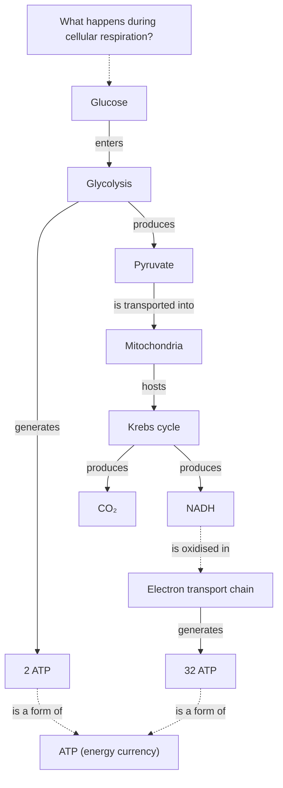
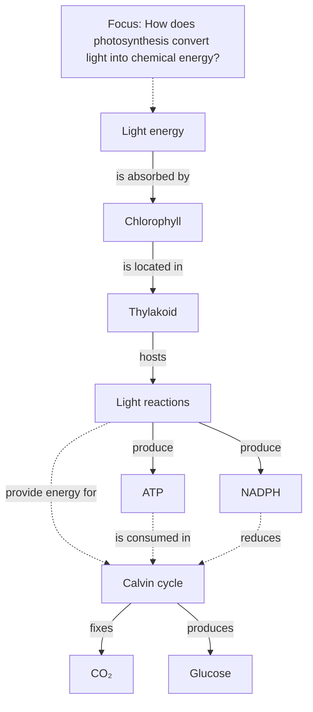

# Apex-Artifacts — Medium Playbooks (sci/med domain)

Bundled from the apex-artifacts source repository. Each source file
is enclosed by `<!-- BEGIN: path -->` ... `<!-- END: path -->`
anchors so semantic retrieval and humans can locate the original.

## Files in this bundle

- `references/medium-playbooks/spaced-repetition-card.md`
- `references/medium-playbooks/clinical-case.md`
- `references/medium-playbooks/assessment-artifact.md`
- `references/medium-playbooks/concept-map.md`
- `references/medium-playbooks/science-journalism.md`
- `references/medium-playbooks/museum-exhibit.md`
- `references/medium-playbooks/patient-narrative.md`
- `references/medium-playbooks/scientific-poster.md`
- `references/medium-playbooks/clinical-algorithm.md`
- `references/medium-playbooks/clinical-teaching-microskills.md`
- `references/medium-playbooks/clinical-handoff.md`
- `references/medium-playbooks/grant-application.md`
- `references/medium-playbooks/surgical-technique.md`
- `references/medium-playbooks/physical-exam-maneuver.md`
- `references/medium-playbooks/morning-report-case.md`
- `references/medium-playbooks/clinical-pathway-stepwise.md`
- `references/medium-playbooks/mm-case.md`
- `references/medium-playbooks/feedback-form.md`
- `references/medium-playbooks/response-to-reviewers.md`
- `references/medium-playbooks/inpatient-note.md`
- `references/medium-playbooks/chalk-talk.md`
- `references/medium-playbooks/intern-orientation-packet.md`
- `references/medium-playbooks/curriculum-blueprint.md`
- `references/medium-playbooks/qi-pdsa.md`
- `references/medium-playbooks/goals-of-care.md`
- `references/medium-playbooks/informed-consent-research.md`
- `references/medium-playbooks/literate-analysis-quarto.md`
- `references/medium-playbooks/reporting-checklist.md`
- `references/medium-playbooks/preregistration.md`
- `references/medium-playbooks/clinical-trial-protocol.md`

---


<!-- BEGIN: references/medium-playbooks/spaced-repetition-card.md -->

# Medium Playbook: Spaced-Repetition Card

For the units consumed by an Anki, SuperMemo, RemNote, or Mochi review session: question-and-answer cards, cloze deletions, image occlusions, and the small chains they form into. The artifact is the card. The system handles the spacing.

This playbook is **system-agnostic**. Anki and SuperMemo disagree on algorithm; the *card-design* discipline is older than both and travels intact. Where the systems matter — image-occlusion editors, scheduler tuning — the playbook names them. The ship checklist is for the deck author, not the scheduler engineer.

> See `references/how-to-use-this-system.md` for the platter principle. The pedagogy library §10 (`pedagogy-library.md`) supplies the cognitive-science floor for everything below.

---

## When this is the right artifact

- **Consolidation, not first learning.** A reader who has *already* met the material — in lecture, in a textbook chapter, in a clinical encounter — needs it organized for retrieval. Cards are a consolidation tool. The reader who has not met the material yet should be sent to an explainer, a worked example, or a chapter. See `references/tear-downs/19-pathoma-condensed-review.md` for the closest neighbouring genre and what cards inherit from it.
- **Fact-rich domains.** Anatomy. Pharmacology. Microbiology. Boards-style pattern-recognition. Foreign-language vocabulary. Statute and case-citation memorization. Cards favor the domain where many discrete facts must be retrievable cold.
- **Long retention horizon.** When the reader needs the material a year from now, not Friday. Cramming defeats the spacing; the spacing is what cards are *for*. Maya MS3 with eight minutes between pages is not the card author's reader — she is the *consumer* of an already-built deck.

When the artifact's job is to teach a *mechanism* rather than retrieve a *fact*, cards are the wrong medium. The reader who memorises the cards but cannot reason through a novel case has memorised the wrong thing. Pair cards with cases, not with each other.

---

## Environment and system notes

Cards live inside a spaced-repetition system that handles three things the playbook does not: scheduling (SM-2 / FSRS / SuperMemo's later algorithms), review interface (the cloze sweep, the image-occlusion mask), and synchronisation across devices. The card author should know which system the deck targets, because three constraints shift with the system:

- **Field count.** Anki's default Basic note has two fields (Front, Back). Cloze notes have one (Text). Image-occlusion add-ons add four to six (image, masks, occlusion type, hints). RemNote's outliner produces cards from hierarchical notes. The card grammar below assumes the simplest case; deck authors using elaborate templates should still keep one card to one prompt.
- **Media support.** Audio (language decks, heart-sound recognition), video (gait, seizure semiology), embedded TeX (statistical formulae). The card design must survive the platform's media pipeline.
- **Tagging and deck organization.** Tags travel with cards; deck path organises by hierarchy. The deck author should decide whether the deck is a *tree* (anatomy → musculoskeletal → upper-limb → brachial-plexus) or a *graph* (a card on the median nerve tagged with `anatomy::upper-limb`, `pathology::carpal-tunnel`, `pharmacology::local-anaesthetic`). Trees navigate; tags retrieve.

---

## Non-negotiables

- **One card, one fact.** Wozniak's minimum-information principle. If the back has two sentences and three answers, split into three cards. The reader who hits one of the three but blanks on the others is now uncertain whether they "got it" — and the scheduler cannot tell either.
- **Cue-target uniqueness.** The front uniquely identifies one answer. *"What is the function of the diaphragm?"* fails — *primary inspiratory muscle*, *anatomic separation of thorax and abdomen*, *insertion of phrenic nerve* are all defensible answers. *"What is the primary muscle of inspiration?"* identifies one target. Multiple acceptable answers force the reviewer to second-guess the scheduler.
- **Front terse, back contextual.** The front is the retrieval cue; it should be as short as the cue allows. The back can — and often should — include *one sentence of context* so the fact is not a free-floating string. The context is the *reason* the fact matters; it is what makes the card resistant to forgetting.
- **No card without provenance.** A card that contradicts the textbook is a bug; a card whose provenance is unknown cannot be corrected. Tag the source (page, lecture, paper) on the card itself. Apex medical decks (AnKing) carry First Aid page numbers, Pathoma chapter, and UWorld question identifiers on every card.
- **Image quality and licensing.** Anatomy cards lean on images. A 360-pixel-wide JPEG of a CT slice is not a study tool. Use 1× retina-grade images at minimum; cite the source; respect licensing (Wikimedia Commons and openly-licensed atlases are the sustainable choice for shared decks).
- **Image occlusion masks the answer, not the orientation cues.** L/R markers, anatomical position indicators, and scale bars must remain visible. The reviewer who cannot orient themselves is being asked the wrong question.
- **No cards on material the author does not understand.** Wozniak's first rule. A card written from a half-understood note encodes the misunderstanding and retrieves it forever.

---

## Card grammar — five patterns and what each is for

The system-agnostic card forms reduce to five. Apex decks use all five; weak decks use only the first.

### 1. Question–answer (Basic)

```
Front: Primary muscle of inspiration?
Back:  Diaphragm.
       (Innervated by phrenic nerve, C3–C5. External
        intercostals contribute ~25%.)
```

The workhorse. Terse front, single-target back, one-line contextual envelope. Use when the cue and target are both crisp and the relationship is "what is X?" or "X causes / treats / contraindicates Y?".

### 2. Cloze deletion

```
The {{c1::phrenic}} nerve provides motor innervation to the
{{c2::diaphragm}}, with sensory innervation from {{c3::C3–C5}}.
```

Each `{{c1}}` produces one card. The same sentence generates three cards, each with one blank. Cloze is right when the *sentence* is the unit of retrieval — the reader benefits from seeing the surrounding scaffold. Misused, cloze becomes "delete random words from a paragraph"; the cards then carry no specific cue. Cloze the *load-bearing* word, not the easy one.

### 3. Image occlusion

```
[Anatomy plate: brachial plexus]
  Mask 1: median nerve label
  Mask 2: ulnar nerve label
  Mask 3: radial nerve label
  Hint:   "lateral cord origin"
```

The visual equivalent of cloze. Use for anatomy, histology, radiology, organic-chemistry mechanism diagrams, geographic features. The reader recovers the *label* given the *visual context*. Apex implementations (AnKing's image-occlusion enhanced) layer masks so each card shows the other labels — the reviewer sees what they *do* know while being asked about what they *don't*.

### 4. Vignette card (clinical-style)

```
Front: 56-year-old with crushing substernal chest pain radiating
       to the left jaw. ECG: 2-mm ST elevation in II, III, aVF.
       Most likely occluded vessel?
Back:  Right coronary artery (inferior STEMI).
       (Reciprocal depression often in I, aVL; consider RV
        infarct — get right-sided leads.)
```

The mini-case. Use sparingly — vignettes are slow to write and slow to review — and use them when the *integration* is the test, not the fact. A deck of pure vignette cards is a question-bank; a deck of pure Q-A cards is a glossary; an apex deck mixes both.

### 5. Two-way (sibling) cards

For arbitrary associations (drug ↔ mechanism, organism ↔ Gram stain, country ↔ capital), generate the card in both directions. The reader who can recall *propranolol → β-blocker* but not *β-blocker → propranolol* has half the association. Most systems support this with a single note template producing two cards.

---

## Chaining cards for a topic

A topic — say, *acute pancreatitis* — should not be one card and should not be sixty. A reasonable chain:

1. **Atomized fact cards** (10–20 per topic). The single facts the topic decomposes into: causes (GET SMASHED mnemonic), key labs (lipase, amylase), Ranson's criteria, complications (pseudocyst, necrosis, ARDS), management priorities. Each a Q-A.
2. **Integrative cards** (3–5 per topic). Tables or chains that connect the facts: *"For each cause in GET SMASHED, the distinguishing history/test."* Cloze form often best.
3. **Vignette cards** (2–3 per topic). One case at the textbook severity, one at the edge (necrotizing, gallstone-with-cholangitis, mild outpatient), one mimicker (perforated ulcer presenting similarly).

The chain is not a substitute for studying the topic in a textbook — it is a *retrieval scaffold* deployed after the textbook. The order matters: facts retrievable cold before integration is tested; integration retrievable before vignettes are introduced.

---

## Styling and formatting

- **Typography.** Body text at 18–20px equivalent; the reviewer is doing hundreds per session and eye fatigue compounds. Default to a humanist sans (Inter, Source Sans, Atkinson Hyperlegible). Italic only for emphasis; do not italicise long stretches.
- **Color is navigation, not decoration.** A consistent accent for *high-yield* callouts, a second for *clinical pearl*, a third for *common pitfall*. The reviewer who flips back to a deck after six months locates content by color before they read text — see Pathoma tear-down §4 for the same move at book scale.
- **Tables collapse cleanly.** Cards reviewed on phone need tables that wrap to two-column stacks. The reviewer holding a phone at 2am should not be horizontally scrolling.
- **Math rendered, not pasted.** MathJax / KaTeX for any formula. A screenshot of a formula does not survive search; it does not respect dark mode; it does not scale.
- **One image per side, normally.** Two images compete; the reviewer's eye does not know where to land. Image occlusion is the exception — there the image *is* the card.

---

## Tagging and deck organisation conventions

- **Hierarchical deck path** for the dominant axis (subject → system → topic). Example: `Medicine::Cardiology::Arrhythmias::AV-block`.
- **Tags for cross-cutting axes** (high-yield-board-relevant, clinical-pearl, pharmacology-mechanism, image-card). Tags travel with the card across deck moves.
- **Source tags** for traceability: `FA2025-p246`, `Pathoma-ch11`, `UW-12345`. Apex decks treat these as load-bearing — the reviewer who finds an error wants to update the source, not just the card.
- **Avoid tag explosion.** A card with seventeen tags carries less information than a card with four well-chosen ones. The convention is tighter for shared decks than personal ones.

---

## Anti-patterns

1. **Multi-fact cards.** *"Causes of acute pancreatitis?"* with eleven items on the back. The reviewer who gets nine but misses two rates the card as failed; the scheduler now reschedules a card that mostly succeeded.
2. **Verbatim textbook bullets as cards.** The textbook bullet was written for reading, not retrieval. Convert it into a cue and a target.
3. **Cloze deletions of the easy word.** *"The {{c1::heart}} pumps blood."* The card tests reading, not knowledge. Cloze the load-bearing term.
4. **Image occlusion with no hint when the image has dozens of labels.** The reviewer cannot tell which mask is being asked about. Hints are part of the card.
5. **No context on the back.** A free-floating fact is harder to remember than the same fact placed in its mechanism. *"Median nerve."* alone is a weaker card than *"Median nerve — lateral two lumbricals, opponens pollicis, abductor pollicis brevis (LOAF)."*
6. **Cards on material the author has not learned.** The deck encodes the author's misunderstandings. Better to learn the material from a textbook first and write cards as you go.
7. **Mnemonics invented for the card.** Forced mnemonics are worse than no mnemonics. Use the mnemonics already in circulation in the field; invent only when one is genuinely needed and genuinely works.
8. **Cards reviewed on a system the author does not use.** The author who has never reviewed their own deck has never noticed that card #237 is ambiguous, card #412 has a typo, card #890 asks the same thing as card #103. Eat your own dogfood.
9. **Decks without a maintenance plan.** Medical guidelines update. Drugs are withdrawn. Cards age. A deck shipped in 2019 advising *fluoroquinolone first-line for UTI* is now wrong. Apex shared decks publish dated revisions.
10. **Ignoring leech cards.** A card the reviewer fails repeatedly is a *leech*; the system flags it. Apex behaviour: rewrite the card, do not just keep reviewing. The failure is usually a clue that the card is ambiguous, the target is wrong, or the reader has not learned the underlying material.

---

## What 10/10 looks like

Apex spaced-repetition card-design is a craft. Two exemplars, each making a distinct move.

### AnKing (USMLE Step-1 medical deck)

The community-curated descendant of Brosencephalon and Zanki, used by a large fraction of US medical students. ~30,000 cards covering Step 1 content. The move worth stealing: *every card is sourced and the source is on the card.* First Aid page numbers, Pathoma chapter, UWorld question identifier, Sketchy lecture timestamp — all visible in a metadata strip. When a guideline changes, the maintainers grep for the source tag and update the affected cards; users grep for "where did this come from" and answer in seconds. The deck is a *living artifact* whose maintenance is part of its design.

Starter pattern (note template):

```
Front: {{Question}}
Back:  {{Answer}}
       <hr>
       <small>Source: {{FA}} · {{Pathoma}} · {{UW}}</small>
       <small>Tags: {{HighYield}} {{Mnemonic}}</small>
```

### Andy Matuschak — *Quantum Country*

A primer on quantum computing (with Michael Nielsen) where the *cards are inline in the prose*. The reader meets the material in the essay, then reviews it through cards embedded in the page, then leaves the essay with a deck the system will surface on a spacing schedule. The move: *cards are not a separate artifact from the explainer; the explainer is a card-producing engine.* The reader who finishes the essay has the cards; the cards refer back to the essay's section anchors; the loop closes.

Starter pattern (Quantum-Country–style inline card):

```html
<aside class="qc-card" data-anchor="superposition">
  <p class="qc-front">A qubit in superposition is in which state?</p>
  <details><summary>Show answer</summary>
    <p>A linear combination of |0⟩ and |1⟩ with complex amplitudes.</p>
    <p><a href="#superposition">Return to §3.2</a></p>
  </details>
</aside>
```

**Calibration question:** if you handed the deck to a learner who had never met the material, would they consistently fail the cards (correct — the deck is for *consolidation*, not first learning)? If they would *succeed*, the cards are too easy and the deck is encoding cues, not knowledge.

---

## Ship checklist

- [ ] Every card tests **one** fact; multi-fact cards have been split.
- [ ] Every front uniquely identifies its target; no two plausible answers.
- [ ] Every back carries one sentence of context (mechanism, association, why-it-matters).
- [ ] Cloze deletions hide the load-bearing term, not the easy word.
- [ ] Image occlusions retain orientation cues (L/R, scale, position).
- [ ] Source is on the card (page, chapter, study, lecture).
- [ ] Tags follow the deck's chosen convention; no tag explosion.
- [ ] Typography survives phone-at-night review: 18–20px body, sufficient line-height, dark-mode safe.
- [ ] Author has reviewed their own deck for at least one full pass; ambiguities flagged.
- [ ] Maintenance plan stated: who updates when guidelines change, on what cadence.
- [ ] Chain of cards for the topic includes atomized, integrative, and (where appropriate) vignette cards.
- [ ] The deck is honest about what it does not cover; readers know to pair it with other artifacts.

See `references/medium-playbooks/clinical-case.md` for the multi-section teaching case (cards' larger neighbour), `references/medium-playbooks/assessment-artifact.md` for items that *assess* rather than *consolidate*, and `references/libraries/pedagogy-library.md` §10 for the cognitive-science floor (Wozniak's 20 rules; the testing effect; spaced retrieval; the expertise-reversal effect).

<!-- END: references/medium-playbooks/spaced-repetition-card.md -->

---


<!-- BEGIN: references/medium-playbooks/clinical-case.md -->

# Medium Playbook: Clinical Teaching Case

For the artifact that has driven clinical medical education for over a century: a structured patient scenario presented to learners, who reason through it under guidance. *NEJM* Clinical Problem-Solving, *JAMA* Clinical Crossroads, Aquifer cases, the morning-report case, the chief-resident teaching case, the OSCE prep case, the board-review vignette. All variants share a skeleton; the variant choice is part of the artifact's design.

The case is the artifact; the *teaching points* are its argument. A case that delivers a diagnosis without changing how the learner reasons has failed its job. A case that changes how the learner reasons has earned its place in the curriculum.

> See `references/how-to-use-this-system.md` for the platter principle. The pedagogy library §10 (`pedagogy-library.md`) supplies the clinical-case-method floor; `medical-artifacts.md` supplies the genre conventions and the regulatory vocabulary.

---

## When this is the right artifact

- **Diagnostic reasoning is the target.** The learner needs to practice building a differential, choosing between competing hypotheses, integrating partial information. A case is the apex medium for this; a textbook chapter is not.
- **Integration across systems.** A case that crosses anatomy → pathophysiology → pharmacology → clinical reasoning teaches integration that a single-system chapter cannot. The whole-patient context is the affordance.
- **Calibrated audience.** The learner has the prerequisites — basic-science knowledge for an MS2, clinical exposure for an MS3, residency-level differentials for a PGY-2 board candidate. A case beyond the learner's level produces frustration; a case below it produces boredom. See §"Level calibration" below.

When the artifact's job is to *consolidate* memorised facts for rapid retrieval, send the reader to a spaced-repetition deck or condensed-review register; see `references/medium-playbooks/spaced-repetition-card.md` and the Pathoma tear-down. When the job is to *assess*, see `references/medium-playbooks/assessment-artifact.md` — cases and assessments share form but differ in intent, and confusing the two corrupts both.

---

## Environment and delivery context

Clinical cases live in many environments; the playbook's form survives them. The substrate varies:

- **Published journal case** — *NEJM CPS*, *JAMA Clinical Crossroads*, *Lancet* case reports. Long-form, prose-dominant, the discussion section is the teaching. Branch-point reveals are inline ("at this point in the workup, the differential was…").
- **Web-based case platform** — Aquifer, NEJM Knowledge+, USMLE-Rx. Branch-point reveals are interactive; the learner commits before reveal. Click-to-reveal is the affordance.
- **Morning-report or grand-rounds case** — slide-driven or verbal; the chief resident paces the reveal manually. The artifact is the *handout*, often a single sheet.
- **OSCE preparation case** — paired with a standardised-patient encounter. The case document is for the *examiner* and the *learner debrief*; the encounter itself is the test. See `references/medium-playbooks/assessment-artifact.md` and `templates/osce-station.md` for the bundle.
- **Markdown / printable case** — for shared decks, pocket cards, or self-study. The branch-point reveal is `<details>` collapsibles.

The case form is the same; the *interaction model* changes with the substrate. Design the case to its substrate explicitly. A printable case with hidden reveals that require ink-on-paper folding is a failure of medium choice.

---

## Non-negotiables

- **The seven sections are load-bearing.** HPI / PMH / Meds-Allergies / SH-FH / Exam / Labs-Imaging / Formulation. The order is not stylistic — it is the order a clinician encounters the patient. Reordering for "narrative flow" hides where information arrives in real practice.
- **Branch-point reveals delay the answer.** Apex pedagogy is *delayed disclosure*. The learner generates the differential *before* seeing labs; commits to a workup *before* seeing imaging; states a management plan *before* the answer is revealed. The case that lays out diagnosis-then-discussion teaches recognition, not reasoning.
- **Teaching points are separate from the answer key.** The diagnosis is one sentence; the *teaching* is the two-or-three pedagogical claims the case was built to make. *"This is amyloidosis"* is the answer; *"In a patient with proteinuria and macroglossia, AL amyloid moves up the differential ahead of more common nephrotic syndromes"* is a teaching point. The answer key is checked once; the teaching points are remembered.
- **Realistic, not idealised.** The patient should look like a patient — partial information, normal-range labs that don't help, contradictory exam findings, a social history that complicates the management. Cases written as "the textbook patient" teach pattern-matching to a textbook, not reasoning over reality.
- **Illness-script conventions.** Apex cases align with the *illness-script* the learner is building: *epidemiology → pathophysiology → presentation → diagnostic findings → management*. The case can be told out of order, but the teaching points should hang on the script the learner carries forward.
- **De-identified.** PHI scrubbed; dates shifted; locations generalised. A real case becomes a teaching case only after the patient is no longer identifiable. See `medical-artifacts.md` §6 on ethics; HIPAA / GDPR / the local equivalent apply.
- **Drug and unit discipline.** Every dose carries units. Look-alike drug names use tall-man lettering. Lab values include reference ranges. The case is the medium where unit errors are most consequential and most under-caught. See `medical-artifacts.md` §11.
- **Evidence basis on the teaching points.** *"GRADE: moderate"*, *"USPSTF: B"*, or *"expert opinion"* — declared on any claim that drives management. The reader trusts the case only to the extent it discloses what backs it. See `medical-artifacts.md` §10.

---

## Composition — the seven sections in detail

### 1. HPI (History of Present Illness)

The presenting complaint, the timeline, the relevant positives and negatives. Written in the patient's voice as much as possible. *"Three weeks of progressive dyspnea on exertion, now occurring at rest"* — not *"Patient presents with NYHA class IV symptoms."* The first time *NYHA* appears should be in the formulation; the HPI is what the patient said.

The HPI is the entry into the case. Apex cases let the HPI breathe — it is allowed to be 150–250 words in a long-form case. The learner forms a hypothesis from the HPI alone, *before* PMH; this is the moment to test that hypothesis later.

### 2. PMH (Past Medical History)

Prior conditions, surgeries, hospitalisations, current chronic illnesses. Listed; not narrated. A patient with diabetes mellitus type 2, hypertension, and HFrEF (EF 35%) is a *different patient* than one without; the PMH constrains the differential.

### 3. Medications and allergies

A line per medication with dose, frequency, and route. Allergies with the reaction (anaphylaxis vs. rash vs. intolerance — the three are not the same and the case should distinguish). Medication reconciliation is *itself* often the teaching point; do not omit medications "for clarity."

### 4. SH-FH (Social and Family History)

Social: substance use (specific — *fifteen pack-years*, *two drinks per night*, *no IV drug use*), occupation, housing, relationships, sexual history when relevant. Family: first-degree relatives with the conditions on the differential.

The SH-FH section is the load-bearing one in many cases — the smoker with hemoptysis; the welder with new dyspnea; the recent immigrant from a TB-endemic country. Apex cases plant the relevant SH-FH detail where it is *easy to miss*, then make it the differential-shifting fact.

### 5. Physical Examination

By system. Vital signs first (T, HR, BP, RR, SpO₂), then general, HEENT, cardiac, respiratory, abdomen, neuro, skin. Quantitative where applicable (*JVP 8 cm at 30°*, not *JVP elevated*). Pertinent negatives stated.

Cases often *withhold* exam findings until the learner asks — *"What would you look for on cardiac exam?"* The withholding is pedagogical; it forces the learner to commit to a hypothesis-driven exam rather than a checklist.

### 6. Labs and imaging

Results with reference ranges. *"Creatinine 2.4 mg/dL (ref 0.6–1.2)"* not *"creatinine elevated."* Imaging described in the report's voice (*"new 2.3 × 1.8 cm spiculated lesion in the right upper lobe"*) with the image itself where the substrate supports it.

The case may release labs *in stages* — initial CBC and BMP first; the learner orders the next study based on the early results; the next study is then revealed. The pacing is the pedagogy. See "Branch-point design" below.

### 7. Formulation

The case's payload. Four sub-sections:

- **Differential** — ranked, with the learner's reasoning *before* the answer. Apex cases require the learner to commit to a top-three differential before the diagnosis is confirmed.
- **Workup** — the studies that distinguish the differentials; the order matters (cheap-and-fast first; invasive last). Each study justified by the diagnostic value it adds.
- **Treatment** — the management plan, with evidence basis. *"Start a loop diuretic (GRADE: high; HFrEF with volume overload)"* — the GRADE tag is part of the recommendation.
- **Teaching points** — two or three; not a comprehensive review. The teaching points are the *argument* of the case; everything else is the *evidence*. A case with twelve teaching points has none.

---

## Branch-point design

The branch point is the case's interactive primitive. At each branch, the learner *commits* (states a differential, picks a study, chooses a treatment) before the answer is revealed. The commitment is what creates the learning; the reveal without commitment teaches recognition, not reasoning.

In Markdown / printable cases, branch points use `<details>` collapsibles:

```markdown
<details>
<summary>Before reading on: what is your top-three differential?</summary>

The case to this point — 56yo with substernal chest pain radiating to the
jaw, diaphoresis, and dynamic ST changes — supports:

1. **ACS / acute MI** (most likely; classical presentation)
2. **Aortic dissection** (must rule out; tearing pain to back)
3. **Pulmonary embolism** (consider if pleuritic component; risk factors)

Pericarditis, oesophageal spasm, costochondritis are on the differential
but lower-priority given the hemodynamic instability.
</details>
```

In a web platform, the branch point is a click-to-reveal with optional structured input (multiple-choice differential, free-text reasoning). The structured input is *for the learner's record*; the case proceeds regardless.

**Apex branch-point density:** one branch every 200–400 words. Fewer and the case becomes a story; more and the case becomes a quiz. The substrate matters — a journal case has fewer branches than an Aquifer case, by convention; an OSCE prep case has the branches at the moments the examiner pauses.

---

## Level calibration

The same patient produces three different cases at three different training levels. Calibrate explicitly.

| Level                | Focus                                           | Differential depth | Workup detail | Teaching points |
|----------------------|-------------------------------------------------|--------------------|--------------|----------------|
| **MS2 / preclinical**| Pathophysiology, basic-science integration      | Broad, with reasoning | One or two key studies | Mechanism, not management |
| **MS3 / clerkship**  | Approach to undifferentiated complaint          | Common-things-common | Stepwise; cost-conscious | Recognition + first-line management |
| **PGY-2 / resident** | Management of confirmed diagnosis; complications | Narrow, with subtleties | Comprehensive; evidence-graded | Edge cases; risk stratification |
| **Board review**     | High-yield testable facts                       | Classic presentations | "Best next step" framing | The two or three facts the exam writes |
| **CME / specialist** | What's new; what's changed                      | Field-current | New guidelines / studies | Practice-changing updates |

The declared level appears on the case. *"This case is calibrated to MS3 clerkship level. Pre-clinical learners should read with First Aid open; resident-level learners may find the differential under-detailed."* Honesty about calibration is part of the artifact.

---

## Variant notes — pediatric, surgical, psychiatric

**Pediatric cases** rewire the form. The HPI is from the *parent*, not the patient. Growth and development are part of every PMH. Dosing is weight-based (*mg/kg*). Vital-sign reference ranges are age-specific. The differential rotates toward congenital, infectious, and developmental causes. Apex pediatric cases foreground the parent's narrative without losing the child's perspective in the older age groups.

**Surgical cases** add an *operative course* section after Labs-Imaging — what was done, what was found, what was sent to pathology, what the post-op course looked like. The teaching points often hinge on intraoperative findings (the unexpected metastasis; the anatomical variant; the complication recognised and managed). Surgical cases also carry pre-op risk stratification (ASA class, RCRI score, pulmonary risk) that internal-medicine cases do not.

**Psychiatric cases** rewire HPI further — the psychiatric HPI follows a structured form (MSE: mood, affect, thought process, thought content, perceptual disturbances, cognition, insight, judgment). Suicide and harm risk is its own section. Pharmacology is dense (drug interactions, half-lives, withdrawal syndromes). The teaching points often involve the *differential between organic and functional* — and the case should resist the temptation to make every undifferentiated presentation primarily psychiatric. See `failure-modes.md` C3 on stigma in patient narratives.

---

## Styling

- **Typography.** Body 18–20px; the reader is often reading at a clinical workstation with non-ideal viewing conditions. Tabular figures for vital signs and labs — decimals must align. See `editorial-voice.md` for register; clinical cases sit in *technical* register with occasional *warm-familiar* in the HPI's direct quotes.
- **Tables for labs.** Reference ranges in a side column; abnormal values bolded or coloured (not by color alone — pair with a glyph or "↑/↓"). See `hard-gates.md` color-and-contrast rules.
- **Imaging.** When the substrate supports images, include the imaging itself — not a description in lieu. A CT slice with a radiologist's annotation overlay is teaching; a sentence saying *"CT showed a mass"* is not.
- **Colour register.** Restrained clinical palette; one accent for *teaching-point* callouts; one for *clinical pearl*; one for *common pitfall*. Avoid alarm-red except for genuinely critical findings; alarm-fatigue applies to artifacts as well as to alarms.
- **Voice.** Confident, specific, restrained. The case writer is not a salesperson; the case sells itself by being interesting. Avoid *"This fascinating case demonstrates…"* — let the case demonstrate.

---

## Anti-patterns

1. **Diagnosis-first cases.** The diagnosis is in the title or the first paragraph; the case then "demonstrates" it. The learner reads recognition; they do not practice reasoning. The diagnosis appears in the formulation, never before.
2. **The textbook patient.** The case is so classical it could not appear in real practice. The teaching transfers to no real patient. Plant complications, contradictions, and irrelevant findings.
3. **Twelve teaching points.** The case has tried to teach a chapter. The reader retains nothing. Cut to three; cut to two; cut to one if that one is honest.
4. **No branch points.** The case reads as a story with a punchline. Recognition is taught, not reasoning. Add at least one *commit-before-reveal* per major section.
5. **Outdated management.** The case advises practice that was current in 2018 but has been superseded. The last-reviewed date is missing or fictional. Cite the evidence; date the review.
6. **Missing pertinent negatives.** The case lists what is present without listing what was looked for and absent. The learner cannot tell if *no chest pain* was asked or never asked. The pertinent negatives are part of the artifact.
7. **Drug-name carelessness.** *Hydralazine* and *hydroxyzine* in the same case without tall-man lettering. Doses without units. The case becomes a medication-error vector. See `medical-artifacts.md` §11.
8. **Patient as evidence, not protagonist.** The case foregrounds the disease over the person. The reader learns the disease and forgets the patient. Apex cases include the patient's voice, decisions, and context. See `failure-modes.md` C3.
9. **Stigmatising framing.** The IVDU patient is "non-compliant"; the obese patient is "unmotivated"; the mental-health patient is "difficult." Person-first language; the case shows the patient as someone whose context the clinician must understand, not someone to be managed despite.
10. **Discussion as restatement.** The discussion section is a textbook summary of the disease; it does not engage the case-specific reasoning. The discussion should be the *case's argument* — why these teaching points, on this patient, at this moment.

---

## What 10/10 looks like

Two exemplars, each making a distinct move.

### Aquifer (formerly MedU)

The dominant case-based curriculum platform across US medical schools (and increasingly internationally). The move worth stealing: *the case adapts to the learner's commitment.* When the learner commits to a differential, the next section reveals studies that distinguish *the learner's* hypotheses (not just the case's correct diagnosis). When the learner picks the wrong workup, the case continues — and the eventual reveal teaches *what the learner would have missed.* The branch points are not gates; they are *forks* the learner walks through, with the case showing the consequences of each path. Apex versions of this pattern run hundreds of branches per case; the median Aquifer case has 12–20 commit-reveal cycles.

Starter pattern (a single branch with commit, reveal, and reasoning):

```markdown
**At this point**, the differential is broad. Commit to your top three
before continuing.

<details>
<summary>My top three differentials</summary>

Your reasoning is yours; the case continues regardless. The differential
the case is building toward includes:

1. **ACS** — classical presentation; first ECG suggestive
2. **Aortic dissection** — pain quality; risk profile
3. **PE** — risk factors; pleuritic component possible

The next study should distinguish (1) from (2) — both are time-critical.
</details>
```

### NEJM Image Challenge

A 1-image, 1-question, 5-option format published weekly. The image is the case; the brief stem (50–100 words) is the HPI; the five options are a forced differential; the discussion is two paragraphs of teaching. The move worth stealing: *radical compression*. The case fits on a screen; the teaching survives the compression because *the image is doing the work*. Apex visual-case design — every pixel of the image teaches; the discussion names what the reader's eye should have caught.

Starter pattern (compressed visual case):

```markdown
**Stem.** A 34-year-old woman presents with three weeks of fatigue and
progressive jaundice. AST 1,840, ALT 1,920, ALP 145, T-bilirubin 8.4.

[Image: liver biopsy, H&E, low-power]

**What is the diagnosis?**
(a) Wilson disease
(b) Autoimmune hepatitis
(c) Acute viral hepatitis
(d) Drug-induced liver injury
(e) Primary biliary cholangitis
```

**Calibration question:** if the case's diagnosis were redacted, would the *teaching points* still make sense to a learner reading only the formulation? If they would, the case has separated its argument from its answer, and the case is teaching — not just narrating.

See also `references/medium-playbooks/assessment-artifact.md` for cases that *assess* rather than *teach*; `references/medium-playbooks/spaced-repetition-card.md` for the consolidation companion (vignette cards are the cousin of cases); and `templates/clinical-case.md` and `templates/clinical-pearl-card.md` for ready-to-fork artifacts.

---

## Ship checklist

- [ ] The seven sections are present in order; reordering, if any, is justified.
- [ ] At least one branch-point reveal forces the learner to commit before answer.
- [ ] Teaching points are two or three, separated from the answer key.
- [ ] Differential is ranked with reasoning, not just listed.
- [ ] Workup ordering is justified (cheap-fast first; invasive last).
- [ ] Treatment recommendations carry evidence basis (GRADE / CEBM / USPSTF / expert opinion).
- [ ] Patient is de-identified; PHI scrubbed; dates shifted.
- [ ] Drug and unit discipline honoured: tall-man lettering where indicated; units on every numeric; lab reference ranges.
- [ ] Level (MS2 / MS3 / PGY-2 / board / CME) declared; calibration honest.
- [ ] Last-reviewed date and reviewer visible; evidence currency stated.
- [ ] Person-first language; patient is protagonist, not evidence.
- [ ] Discussion engages the case-specific reasoning, not generic textbook restatement.

<!-- END: references/medium-playbooks/clinical-case.md -->

---


<!-- BEGIN: references/medium-playbooks/assessment-artifact.md -->

# Medium Playbook: Assessment Artifact

For the artifact whose job is to *measure* what the learner can do, not to *teach* it: NBME-style single-best-answer items, extended-matching items, OSCE stations, lab practicals, clinical-skills checklists, rubrics. Assessment artifacts share form with cases and explainers and look superficially the same. They are not the same. Confusing assessment with instruction corrupts both.

Instruction adds knowledge to a learner. Assessment measures it. An item that teaches while it tests teaches the answer; an item that tests without measuring transfer measures the question's wording, not the learner's understanding. The discipline below is what separates a defensible exam from a quiz that happens to have right answers.

> See `references/how-to-use-this-system.md` for the platter principle. The pedagogy library §10 (`pedagogy-library.md`) supplies the assessment-design floor; `medical-artifacts.md` and `failure-modes.md` cover the medical and scientific subdomains.

---

## When this is the right artifact

- **Measurement is the goal.** The reader (or the institution behind them) needs to know what the learner can do, not be taught what they cannot. Boards exams, clerkship shelf exams, OSCEs, in-training exams, certification, formative quizzes embedded in courses — all are assessment artifacts.
- **Stakes are explicit.** The learner who fails the assessment will repeat the course, retake the exam, lose certification, or be redirected. The stakes shape the rigor required.
- **Comparison across learners or against a standard.** Norm-referenced (relative to the cohort) or criterion-referenced (against a defined competency standard). Either way, the assessment's measurements must be defensible and consistent.

When the artifact's job is to *teach reasoning*, send the reader to a clinical case (`references/medium-playbooks/clinical-case.md`). When the job is *retrieval-rehearsal in low-stakes consolidation*, send the reader to spaced repetition (`references/medium-playbooks/spaced-repetition-card.md`). The genres overlap visually — a vignette item, a vignette case, and a vignette card can look almost identical — but the *design discipline* differs.

---

## Environment and delivery context

- **Standardised written exams.** USMLE (NBME), MCAT, SAT, bar exam, FRCS, MRCP. Single-best-answer items dominate. Strict item-writing rules; statistical review (item analysis) post-administration.
- **OSCE / standardised-patient stations.** Multi-station circuit; each station 5–15 minutes; trained simulated patients; binary observation checklists plus global rating scales.
- **Lab practicals.** Lab benches with specimens / equipment; the learner identifies, manipulates, or measures; scored by observation or by the artifact produced (titration result, slide identification, plant key, suture pattern).
- **Formative classroom quiz.** Lower-stakes; embedded in instruction; primarily diagnostic for the teacher. The assessment discipline still applies, even though the stakes are lower.
- **Embedded item in an explainer.** A self-check inside a teaching artifact (`references/medium-playbooks/educational-scaffold.md`). Often informal; the item-writing discipline keeps it defensible.

The discipline does not relax with stakes. A low-stakes formative item that is sloppy still teaches the learner to memorise the question rather than the knowledge.

---

## Non-negotiables

- **Assessment ≠ instruction.** The artifact does not explain the answer in the question stem. If the learner needs explanation to answer, the explanation belongs in the *teaching* artifact upstream; the assessment measures whether the explanation worked.
- **One best answer.** Single-best-answer items have exactly one defensible best choice. *"All of the above"*, *"None of the above"*, *"A and C"* are wrong forms — they test reading, not knowledge. *"Most likely"*, *"Best next step"* are correct framings for one-best-answer items when more than one option is defensible but one is clearly preferred.
- **Distractors are plausible and learnable-from.** A wrong option that no learner would choose carries no measurement; a wrong option that the under-prepared learner *would* choose, for a *specific reason*, is the assessment's payload. Item-writing's craft is the distractor.
- **No cluing.** The correct option must not be identifiable by features other than its content. No grammatical mismatch between stem and option; no length cue (correct option not consistently longer or shorter); no "convergence cue" (correct option not the one most similar in form to the others); no "absurd-distractor" cue (one option is obviously not the answer, narrowing to three).
- **Constructed-response items have rubrics.** A short-answer or essay item without a rubric is not a measurement — it is an opinion. The rubric defines the construct being measured before the responses are scored.
- **Calibration against transfer.** The item tests whether the learner can *apply* the knowledge to a novel situation. Items that recite the textbook's worked example measure memory of the worked example.
- **Item analysis after administration.** Difficulty index (proportion who answered correctly), discrimination index (does the item separate top from bottom performers), distractor analysis (are wrong options drawing responses, or are they being ignored). Items that fail item analysis get rewritten, not just dropped.
- **Bias review.** Items reviewed for cultural, linguistic, gender, racial, and socioeconomic bias before administration. The bias review is not optional; it is part of the assessment's validity argument.

---

## Composition — NBME-style single-best-answer items

The dominant assessment form in medical and several other licensing contexts. Case & Swanson's *Constructing Written Test Questions for the Basic and Clinical Sciences* (NBME, 2002) is the canonical guide. The discipline below is its distillation.

### The clinical vignette stem

A patient story — typically 80–150 words — providing the clinical context. Apex stems are *medically realistic*: a presentation that could appear in a real chart, not assembled from textbook fragments. Structure:

```
Age, sex. Presenting complaint with timeline. Relevant history.
Physical examination findings (vital signs first, then targeted).
Initial laboratory or imaging results, with reference ranges.
[The stem ends without revealing the answer.]
```

The stem ends *before* the diagnosis is named. The diagnosis is what the item is asking the learner to determine.

### The lead-in question

The specific question being asked. The NBME-canonical lead-ins:

- *"Which of the following is the most likely diagnosis?"*
- *"What is the next best step in management?"*
- *"Which of the following is the underlying mechanism?"*
- *"Which of the following findings is most likely on [next study]?"*
- *"Which of the following is the most appropriate initial therapy?"*

A precise lead-in lets the learner know what cognitive task is being measured. *"What about this patient?"* is not a lead-in; it is a placeholder.

### The five options

Five options for a typical NBME item; four is acceptable; three is too few. One option is best; four are *plausible distractors*. The discipline:

- **Each option is a defensible diagnosis / step / mechanism in some patient.** It is the wrong answer *for this patient*, for a reason the prepared learner can articulate.
- **Options are parallel in form.** All nouns, all imperatives, all phrases of similar length and structure. Parallel form prevents one option standing out structurally.
- **Options are alphabetised or randomised.** No clustering by category (do not put the two cardiac options together and the two GI options together — that itself becomes a cue).
- **No "all of the above" or "none of the above."** These options test reading; they do not measure the construct.
- **The correct option is honest about its boundaries.** "The most likely diagnosis" is *the most likely* — the item should not require the learner to be certain when uncertainty is real.

### Item-writing anti-patterns (Case & Swanson, condensed)

| Flaw | Example |
|------|---------|
| Word repeat | The stem contains a word that appears in only the correct option |
| Convergence | Correct option shares features with several distractors; distractors share features with each other but not with correct |
| Length cue | Correct option is consistently the longest or shortest |
| Grammatical cue | Correct option grammatically fits the stem; distractors do not (article-agreement mismatch in English; gender-agreement in inflected languages) |
| Absolute terms | Distractors with "always" / "never" are usually wrong; correct options with "may" / "can" are usually right |
| Negative stem | *"Which of the following is NOT…"* — error-prone for learners; banned in NBME items |
| Tricky wording | The item tests reading rather than knowledge; the language is the obstacle |

Every item should pass a *peer-review checklist* hitting each of these. The checklist is part of the item's validity argument.

---

## Composition — extended-matching items (EMIs)

A variant in which a list of *options* (often 10–20) is shared across *several stems*. Each stem references the same option list; the learner picks the best option for each stem. EMIs are efficient (one option list serves many items) and resist cluing (the option list is too long to memorise).

```
Option list (theme: causes of acute pancreatitis):
A. Alcohol           E. Hypercalcaemia     I. Pancreatic divisum
B. Cholelithiasis    F. Hyperlipidaemia    J. Post-ERCP
C. CFTR mutation     G. Mumps              K. Trauma
D. Drug-induced      H. Scorpion sting     L. Viral

Stem 1. A 14-year-old presents with abdominal pain. Lipase 4× normal.
Mother reports a recent measles-mumps-rubella vaccination two weeks ago
followed by parotitis. Most likely cause?

Stem 2. A 52-year-old man presents with epigastric pain. Triglycerides
3,400 mg/dL. Lipase 6× normal. Most likely cause?

Stem 3. A 38-year-old woman, day 1 post-cholangiogram. Severe epigastric
pain. Lipase 5× normal. Most likely cause?
```

EMIs work well in topics where the *differential* is the unit of learning. They are common in surgery, pathology, microbiology, pharmacology.

---

## Composition — OSCE station design

The Objective Structured Clinical Examination has a four-document bundle per station. See `templates/osce-station.md` for the runnable scaffold.

1. **Candidate brief** — what the candidate sees on the door. The scenario, the task, the time limit. *"You are an FY2 in a respiratory clinic. Mr. Davies (52) presents for review of breathlessness over the last three months. Take a focused history (10 minutes). You will be asked a question by the examiner at 9 minutes."*
2. **Standardised-patient script** — what the simulated patient says and does. Includes their backstory, their opening line, their answers to expected questions, their emotional cues, the "trigger" facts the patient reveals only on direct questioning, and the safety net for difficult moments (*"If asked about end-of-life preferences, the patient says: 'I haven't thought about it. I don't want to talk about it right now.'"*).
3. **Examiner checklist** — observable behaviours, scored. Each behaviour is a binary observation (*candidate introduced themselves with name and role*: 1 / 0). Apex stations have 10–20 checklist items per ten-minute station. The checklist is *behavioural*, not inferential — "candidate asked about smoking history" is observable; "candidate demonstrated empathy" is not.
4. **Global rating scale** — examiner's overall judgment, usually on a 5- or 7-point scale (1 = fail; 4 = pass; 7 = exceptional). The global rating mitigates the limits of pure checklist scoring (a candidate can hit every checklist item without sounding human).

**Validity of the station** depends on:
- **The scenario is realistic** (the patient looks like a patient; the encounter looks like an encounter).
- **The checklist measures the construct** (history-taking station's checklist measures history-taking, not communication; communication-skills station's checklist measures communication).
- **Inter-rater reliability** — different examiners give similar scores to the same performance. Achieved through examiner training and tight checklist wording.

---

## Composition — lab practicals

Bench-based assessment. The learner identifies specimens, performs procedures, or interprets results. Common in microbiology (organism identification by Gram stain and biochemical features), histology (slide identification), anatomy (cadaver tag-identification), chemistry (titration to a known target), biology (key-based species identification).

**Station design:**
- **One construct per station.** A microbiology station that asks for organism identification *and* drug susceptibility *and* clinical management is measuring three constructs in one score; the score becomes uninterpretable.
- **Time per station calibrated to the task.** A Gram-stain identification is a 90-second station; a five-step titration is a 20-minute station. Calibrate to the task, not to a default circuit time.
- **Specimen quality controlled.** A faded slide, a contaminated bench, an unclean apparatus invalidates the station. The lab practical is only as defensible as its specimens.

---

## Rubric construction

Constructed-response items (short answer, essay, performance-based) require rubrics. Two families:

### Analytic rubrics

Score multiple dimensions separately, summed for a total. Useful when the construct decomposes into distinct skills.

```
Clinical-reasoning essay rubric:
  Differential generation       /5
  Workup justification          /5
  Treatment plan                /5
  Communication / writing       /5
  Total                         /20
```

The learner who scores 4/4/2/5 has a different profile than one who scores 5/5/0/5; the analytic rubric *diagnoses* the deficiency.

### Holistic rubrics

Single overall score; a narrative description per level. Useful when the construct is integrated and decomposition would distort.

```
Holistic essay rubric (criterion-referenced):
  Exceptional (5) — Demonstrates synthesis beyond expectation;
                    addresses ambiguity; defensible novel framing.
  Proficient  (4) — All elements present; reasoning sound; minor gaps.
  Developing  (3) — Most elements present; reasoning has gaps but
                    direction is correct.
  Emerging    (2) — Elements present but disconnected; reasoning weak.
  Novice      (1) — Elements missing; little evidence of construct.
```

The holistic rubric requires more rater training (different raters must converge on the descriptor) but resists artificial decomposition.

**The rubric is part of the item.** It is constructed *before* responses are scored, ideally *before* responses are collected. A rubric written to fit the responses is post-hoc and not a measurement.

---

## Formative vs. summative assessment

The two purposes of assessment, often confused:

- **Formative** — the assessment exists to *inform learning*. The score is information to the learner and teacher; it does not gate progression. End-of-chapter self-quizzes; in-class polls; weekly low-stakes quizzes. The item-writing discipline still applies — sloppy formative items teach the wrong things.
- **Summative** — the assessment exists to *certify*. The score gates progression, certification, or a credential. Boards; final exams; OSCEs. The validity-and-reliability bar is higher; bias review, item analysis, and inter-rater calibration are non-negotiable.

An assessment that is *labelled* formative but used summatively (the score "doesn't count" but determines a recommendation letter) is summative in effect. The discipline should match the actual use.

---

## Transfer assessment via novel cases

The deepest validity question: does the item measure understanding the learner could apply to a *novel* case, or does it measure recognition of cases like the ones in the curriculum? Two moves:

- **Novel-context items.** The construct is the same as the curriculum; the context is one the learner has not seen. An MS3 who has rotated through cardiology and answers a chest-pain item correctly may have learned chest pain; one who answers an analogous abdominal-pain item on the same reasoning has learned the *reasoning*.
- **Edge-case items.** The construct's atypical presentation. Apex assessments include 10–20% edge cases — testing the learner's discrimination between common-things-common and the worked-example's edge.

Transfer items are harder to write than recognition items. The investment is part of the assessment's quality.

---

## Anti-patterns

1. **Item teaches the answer.** The stem explains *why* the answer is correct, removing the assessment from the question. Move the explanation to a teaching artifact.
2. **Distractors that no learner would choose.** Filler options. The item now measures whether the learner can identify the obvious; it does not measure the construct.
3. **Cued correct option.** Grammatical, length, convergence, or absolute-term cues. The item measures test-taking strategy.
4. **No rubric on a constructed-response item.** The score is the grader's impression; different graders produce different scores; the assessment is not a measurement.
5. **OSCE checklist with inferential items.** *"Demonstrated empathy"* — what observable behaviour does this name? Decompose into behaviours.
6. **No item analysis.** The item set has been used for five years; no one has checked whether the items discriminate; the items that fail are still in the bank. The assessment's validity is asserted, not measured.
7. **Bias unexamined.** Items reference culture, geography, gender, or class in ways that advantage some learners and disadvantage others. The bias review missed it because the review was a glance.
8. **Stakes-undisclosed.** Learners do not know what the assessment counts toward; their performance reflects the *assumed* stakes, not the actual. Disclose the stakes.
9. **Assessment as gotcha.** The item is designed to catch the learner out, not to measure what they know. The assessment becomes adversarial; the learner becomes defensive; the construct is no longer being measured.
10. **One assessment for two constructs.** History-taking + communication + clinical reasoning in one station with one score. The score is uninterpretable. One station, one construct.

---

## What 10/10 looks like

Two exemplars, each making a distinct move.

### NBME item-writing (USMLE Step exams)

The institutional apex of single-best-answer item-writing. Decades of item-analysis data; explicit item-writing rules; iterative item review by panels of subject-matter experts; statistical post-administration analysis; items that fail item analysis are pulled. The move worth stealing: *the distractor is a learner's misconception.* Each wrong option corresponds to a *specific reasoning error* a not-quite-prepared student would make. The item, after administration, can tell the institution not just *whether* the student missed it but *which misconception they fell into.* This requires writing distractors that are not random plausible alternatives but *named errors* in the field.

Starter pattern (item with diagnostic distractors):

```
A 56-year-old man presents with three days of substernal chest pain.
ECG: 2-mm ST elevation in II, III, aVF; reciprocal depression in I, aVL.
Troponin 14 ng/mL (ref < 0.04).

Which of the following is the most likely occluded vessel?

(A) Left anterior descending      [misconception: confuses any STEMI with LAD]
(B) Left circumflex                [misconception: confuses inferior with lateral]
(C) Right coronary                 [correct]
(D) Left main                      [misconception: ignores ECG localisation]
(E) Posterior descending           [misconception: anatomy/territory confusion]
```

### Royal College of Physicians OSCE stations (PACES exam)

The UK Membership exam's clinical-skills assessment. Apex OSCE design: stations are *paired and integrated* — a history-taking station feeds a communication station; the patient encounter feeds an examiner viva. The move worth stealing: *the station tests integration in a way that no single component would.* A candidate who can take a history and a candidate who can communicate findings are not the same as a candidate who can do both with the same patient in the same encounter; PACES measures the integration.

Starter pattern (paired-station outline):

```
Station 4 (History + management): 14 min
  Take a history of breathlessness from this patient.
  At 8 min, the examiner will interrupt to ask for your differential
    and your initial management plan.

Station 5 (Communication): 14 min, with same patient
  Discuss the differential and management plan with the patient.
  The patient has been told about a likely diagnosis of pulmonary
    fibrosis. Answer their questions; manage their distress.
```

**Calibration question:** for each item or station, ask — *what would a student who is well-prepared but does not understand the construct answer?* If the answer is "the correct option, by elimination of obviously wrong distractors," the item is measuring strategy. If the answer is "a specific wrong option, for a learnable reason," the item is measuring the construct.

See also `references/medium-playbooks/clinical-case.md` for the teaching companion (cases inform; assessments measure); `references/medium-playbooks/spaced-repetition-card.md` for the consolidation companion; `templates/osce-station.md` for the 4-document OSCE bundle; and `references/libraries/pedagogy-library.md` §10 for the broader assessment-design literature (Case & Swanson; Hutchinson; Norman & Eva; Downing's *Handbook of Test Development*).

---

## Ship checklist

- [ ] Item / station tests a clearly-stated construct; no construct mixing.
- [ ] Stem ends without revealing the answer; lead-in is precise.
- [ ] One best answer; distractors are plausible and traceable to specific learner misconceptions.
- [ ] No item-writing flaws: no length / grammatical / convergence cues; no "all of the above"; no negative stems.
- [ ] Constructed-response items carry rubrics written before scoring.
- [ ] OSCE stations: candidate brief, SP script, examiner checklist, global rating scale all complete.
- [ ] Difficulty and discrimination targets stated; item analysis planned post-administration.
- [ ] Bias review completed (cultural, linguistic, gender, racial, socioeconomic).
- [ ] Formative / summative purpose declared; stakes disclosed to learners.
- [ ] Transfer items present (novel context or edge case) — at least 10–20% of the item set.
- [ ] Drug and unit discipline honoured in medical items (units; tall-man lettering; lab reference ranges).
- [ ] Evidence basis cited where the item depends on current guidelines (last-reviewed date visible).

<!-- END: references/medium-playbooks/assessment-artifact.md -->

---


<!-- BEGIN: references/medium-playbooks/concept-map.md -->

# Medium Playbook: Concept Map

For the Novakian concept map — a hierarchical diagram of *concepts* (nodes) connected by *propositional linking phrases* (edges) that together form propositions. Joseph Novak developed the form at Cornell in the 1970s to externalise the structure of a learner's understanding. The technique is forty years older than mind-maps, fifty years older than knowledge-graph dashboards, and distinct from both in ways that matter to its job.

A concept map is *not* a mind map (mind maps are radial brainstorms, edges unlabelled, no required hierarchy). A concept map is *not* a flowchart (flowcharts depict process, not concept-structure). A concept map is *not* an entity-relationship diagram (ER diagrams depict data relations, not learner cognition). The labelled edge is the move that separates concept maps from all of them. Without it, you have a different artifact.

> See `references/how-to-use-this-system.md` for the platter principle. The pedagogy library §10 (`pedagogy-library.md`) supplies the Ausubel-Novak meaningful-learning theory; `references/libraries/composition-library.md` covers diagrammatic composition more broadly.

---

## When this is the right artifact

- **Conceptual integration is the target.** The learner needs to see how concepts in a domain relate. Concept maps make the *relations* visible, not just the *concepts.* A list of terms is a glossary; a hierarchy of terms is a taxonomy; a labelled-relation graph is a concept map.
- **Subject is propositional in nature.** Biology pathways (citric acid cycle; cellular respiration). Physics relationships (force ↔ mass ↔ acceleration). Cognitive psychology (encoding → storage → retrieval, with bidirectional modifiers). The relations *between* concepts carry the load.
- **The learner is constructing or refining a mental model.** Apex concept-map use is the learner *drawing* the map, then comparing to an expert's; the discrepancy is the lesson. The pre-built concept map serves as an *exemplar* the learner aligns against.
- **A focus question can be stated.** Novak's discipline: every concept map answers a *single focus question* placed at the top. *"What happens during cellular respiration?"* not *"Cellular respiration."* The focus question is the map's argument.

When the artifact's job is to depict *temporal sequence* (flowchart), *system architecture* (architectural diagram), or *quantitative relationship* (chart), choose those forms. The Mermaid playbook (`mermaid-diagram.md`) covers process diagrams; SVG illustration (`svg-illustration.md`) covers schematic figures; data visualization (`data-visualization.md`) covers quantitative relations. Concept maps depict *what relates to what, how*.

---

## Environment and delivery context

- **Mermaid** — the lightest path. Mermaid supports labelled edges in flowchart syntax (`A -->|label| B`). The hierarchy must be enforced by layout direction (`flowchart TB`); cross-links emerge naturally as edges that span levels. The aesthetic is functional, not editorial.
- **react-flow / xyflow** — the high-ceiling path. Full control over node and edge rendering; custom hierarchical layout via Dagre or ELK; interactive expansion and focus. Apex web-native concept maps. See `templates/react-concept-map.tsx` for a runnable starter.
- **Hand-drawn or vector SVG** — when the editorial register matters more than the interactivity. Apex teaching uses hand-drawn concept maps; the imperfection signals *this is in-progress thinking*, which is part of the pedagogy.
- **Cmap Tools** — Novak's own software (free, IHMC-developed). Pure concept-map editor; ugly by contemporary standards; the canonical reference for the form. Worth opening once to see what a discipline-pure concept map looks like.
- **Paper** — the original substrate. The discipline survives without the tooling; many cognitive-science studies of concept maps used pencil and paper.

The substrate does not change the form. A Mermaid concept map, an SVG concept map, and a paper concept map all have a focus question, hierarchical organisation, labelled edges, and cross-links. The substrate changes the aesthetic and the interaction model.

---

## Non-negotiables

- **Focus question at the top.** A single question the map answers. Without it, the map is a generic diagram of the domain, not an *argument*. The focus question constrains the map: concepts that do not bear on the question are off-map.
- **Hierarchical organisation.** Most-general concepts at the top; most-specific at the bottom. Apex concept maps cascade from one or two anchor concepts through three to five levels. Flat maps are mind maps; tree-only maps with no cross-links lose the relational substance.
- **Labelled edges (propositional linking phrases).** Every edge carries a phrase that makes the source-edge-target triple a complete proposition. *"Glucose — is metabolised by — glycolysis"* is a proposition; *"glucose — → — glycolysis"* is decoration. The labels are short (1–5 words) and the convention is verb-first.
- **Cross-links between branches.** Edges that span the hierarchy's branches are the map's *integration*. A concept map without cross-links is a tree. Cross-links should be visually distinct (different colour, dashed line, or curve) to signal they are not part of the hierarchy.
- **Concepts in nodes; relations on edges.** Nodes are *named concepts* (nouns or noun-phrases). Edges are *relations*. Never relations in nodes ("causes inflammation" as a node-label is a category error); never concepts on edges.
- **Concepts capitalised consistently; linking phrases lowercase.** A convention that makes the proposition readable at a glance. *"Glycolysis — produces — Pyruvate"* — concepts uppercase, linking phrase lowercase.
- **Specific over generic linking phrases.** *"Is related to"*, *"connects to"*, *"affects"* carry almost no information. *"Phosphorylates"*, *"oxidises"*, *"inhibits competitively"* are propositions worth drawing. Apex concept-map pedagogy bans *"is related to"* — see Cañas et al.'s work on linking-phrase specificity.

---

## Composition — building the map

### 1. State the focus question

The focus question is the artifact's argument. Frame it as a question, not a topic:

- ✗ "Cellular respiration"
- ✓ *"How do cells extract usable energy from glucose?"*
- ✓ *"Why does aerobic respiration produce so much more ATP than anaerobic?"*

The focus question determines what is on-map. Concepts that do not bear on the question are excluded — even if they are part of the domain.

### 2. Identify anchor concepts

One or two top-level concepts that frame the map. For *"How do cells extract usable energy from glucose?"*: **Glucose** and **ATP** (the substrate and the product). Anchor concepts go at the top of the hierarchy.

### 3. Build the hierarchy downward

Three to five levels typically. Each level a strict subordinate of the parent — *more specific*, *a part of*, *an example of*, *a stage of*. Apex maps cascade with explicit levels:

```
Level 1: Glucose, ATP                 (anchors)
Level 2: Glycolysis, Krebs, ETC        (stages of respiration)
Level 3: Pyruvate, NADH, FADH₂         (intermediates)
Level 4: Specific enzymes, products    (mechanism details)
```

### 4. Label every edge with a linking phrase

The label makes the source-edge-target triple a proposition. *Glucose — enters — Glycolysis*. *Glycolysis — produces — Pyruvate*. *Pyruvate — is transported into — Mitochondria*. Each is a complete claim.

### 5. Add cross-links

Edges that span branches. *Glycolysis — generates — ATP* (cross-links the anaerobic-glycolysis branch to the anchor concept ATP at the top). *NADH — is oxidised in — Electron Transport Chain* (cross-links the intermediate to the downstream stage). Cross-links are where the *integration* lives; they are the map's argument that the domain is *connected*, not just sequential.

Visually distinguish cross-links from hierarchy edges. The Novak convention is dashed lines or a different colour. The discipline matters — without the distinction, the reader cannot tell which edges define the hierarchy and which integrate across it.

### 6. Verify by reading the propositions aloud

The test: pick three edges; read source–linking phrase–target aloud. Each should be a complete, defensible claim about the domain. *"Glucose — is — Pyruvate"* is wrong (glucose *becomes* pyruvate via metabolism; *is* implies identity); *"Glycolysis — produces — ATP"* is right. The aloud-test catches both wrong concepts and wrong relations.

---

## Styling

### Hierarchical layout

- **Top-to-bottom** is the default. Most-general concepts at the top; most-specific at the bottom. Reading order matches the cognitive order — anchor, then specifics.
- **Width budget.** A map with twelve concepts on one row is unreadable; a map with two concepts on each row is wasteful. Aim for three to five concepts at the widest level.
- **Whitespace.** Generous around each node; tight clustering reads as crowded thinking. Apex concept maps look spacious — the negative space is part of the composition.

### Nodes

- **Boxed concepts.** Rectangular or rounded-rectangle boxes, light fill, dark text. Avoid circles (carry less information per pixel) and avoid hexagons (carry domain associations the concept-map form does not need).
- **Type discipline.** One sans-serif face, two weights (regular for concepts; bold for anchors). Concepts are short — one to four words is the sweet spot.
- **Anchor concepts emphasised.** Larger node, heavier border, or distinct fill. The visual hierarchy reinforces the conceptual hierarchy.

### Edges

- **Hierarchy edges.** Solid lines, neutral colour, directional (arrowhead pointing toward the more-specific concept). The arrow's direction is the *"is a kind of"* / *"includes"* relation, which the linking phrase makes specific.
- **Cross-links.** Visually distinct — dashed line, accent colour, or curved (rather than straight). The visual difference signals *this is an integrating relation, not a hierarchical one.*
- **Labels on the edge.** Placed at the midpoint, oriented along the edge. White or light-coloured background behind the label keeps it readable against the line.
- **No unlabelled edges.** An unlabelled edge is a decoration. If the relation does not have a name, either name it or remove it.

### Colour

- **Restrained palette.** A neutral family for nodes and hierarchy edges; one accent for cross-links; optionally one second accent for cross-links of a different kind (causal vs. structural, say). Three accents is the maximum; more becomes navigation.
- **Colour codes a category, not an aesthetic.** If branches are colour-coded by sub-domain (cardiac concepts in blue; renal in green), the code is consistent and named in a legend. Colour without semantics is decoration.

### Iconography

- **Use sparingly.** Concept maps can carry domain-relevant icons (a leaf for chlorophyll; an ATP icon; a synapse-glyph) when the icon adds genuine information. Decorative icons (a "brain" on a cognition map; a "heart" on a cardiology map) violate the artifact's discipline.

---

## Implementation patterns

### Mermaid



Mermaid renders this with reasonable hierarchy. Cross-links use `-.->` (dashed). Linking-phrase labels use the `|"text"|` syntax. The focus question is a node connected by a dashed line to the anchor — Mermaid does not have a native "focus question" element, so the convention is one borrowed from the substrate.

### react-flow

A custom-node React component, an edge-with-label component, and a hierarchical layout (Dagre or ELK). See `templates/react-concept-map.tsx` for a runnable starter with the photosynthesis domain. The React path's advantage: interactive focus (clicking a node highlights its neighbours), expandable cross-links, and integration with surrounding educational scaffold.

### SVG

For hand-tuned editorial maps. Position nodes and edges explicitly; the layout is composed, not computed. Apex hand-drawn maps go this route — the imperfections (a slightly curved edge; a node manually nudged for readability) are part of the artifact's voice.

---

## Anti-patterns

1. **Unlabelled edges.** The map is now a tree of concepts, not a concept map. Without linking phrases there are no propositions.
2. **Generic linking phrases.** *"Is related to"*, *"connects with"*, *"affects."* These carry no information. Specify the relation.
3. **No focus question.** The map is a generic diagram of the domain. Without the focus question, the map cannot tell the reader which concepts belong on it.
4. **Mind-map masquerading.** Radial layout; no hierarchy; no labels. This is a mind map; it is fine as a mind map but does not do the cognitive work of a concept map.
5. **Flowchart masquerading.** The diagram depicts a temporal process with arrows showing sequence; the "concepts" are actually steps. Use a flowchart and call it one.
6. **No cross-links.** The map is a tree. The integration that makes the concept map a research-validated learning tool requires cross-links.
7. **Relations in nodes.** *"Causes inflammation"* as a node; this is a relation labelled as a concept. Move it to an edge.
8. **Concepts on edges.** *"Glucose, NADH"* on an edge; the concepts belong in nodes. Edges are relations, nodes are concepts.
9. **Overcrowding.** Sixty concepts on one canvas. The reader cannot parse the map; the integration cannot be seen. Split into sub-maps with linking concepts shared between them.
10. **The Khan Academy knowledge-map error.** Khan Academy's "knowledge map" is a *prerequisite graph* — nodes are skills, edges are prerequisites, no linking phrases. It is hierarchical and beautiful and *not a concept map.* It is a directed acyclic graph of skills. The distinction matters: a concept map's edges name the *conceptual relation*; a prerequisite graph's edges name *temporal-pedagogical sequencing*. The Khan map is excellent for what it does; calling it a concept map confuses the artifact's category.

---

## What 10/10 looks like

Two exemplars, each making a distinct move.

### Joseph Novak — *Learning How to Learn* (1984)

The book that established the form. Apex example: the concept map *"What is water?"* — a hand-drawn map cascading from *Water* through *Molecules*, *Hydrogen*, *Oxygen*, *Bonds*, *States of matter*, with cross-links from *Bonds* across to *States* (*"determine"*) and from *Hydrogen* across to *Bonds* (*"forms"*). The move worth stealing: *the cross-links carry the science.* The hierarchy alone would be a taxonomy; the cross-links are the propositions that make the map an argument about *why water behaves as it does.* A learner who studies the map and can reconstruct it has internalised not just the concepts but their relations.

Starter pattern (Novak-style five-level cascade with cross-links):



### Cmap Tools exemplars (IHMC)

The Institute for Human and Machine Cognition's open library of concept maps across many domains. The move worth stealing: *integrated maps across a domain.* A single concept like *Ecosystem* appears in multiple maps with *consistent meaning* — its propositions are stable across the *Food web* map, the *Energy flow* map, and the *Biogeochemical cycles* map. The library treats concepts as having identities; maps within the library reference each other through shared concepts. Apex use is the *web of maps*, not the single map.

Starter pattern (concept with stable cross-map identity):

```
Concept: Ecosystem
  Map A (Food web): Ecosystem — contains — Trophic levels — feed — Food web
  Map B (Energy flow): Ecosystem — receives — Solar energy — drives — Trophic structure
  Map C (Cycles): Ecosystem — cycles — Nutrients — through — Decomposers
```

The cross-references between maps are themselves edges in a meta-map; the library is a concept map of concept maps.

**Calibration question:** if a learner studied the map for fifteen minutes and then reproduced it from memory, would the propositions they wrote match yours, even if the layout differed? If they would, the map's concepts and relations are the load-bearing structure. If they would not — if the layout, color, or shape carried information that the propositions do not — the map is overworked visually and underworked propositionally.

See also `references/medium-playbooks/educational-scaffold.md` for the Prime → Show → Explain → Invite → Check sequence (concept maps sit in *Explain* and *Invite*); `references/medium-playbooks/mermaid-diagram.md` for the lighter diagram form; `references/medium-playbooks/svg-illustration.md` for editorial diagrams; and `templates/react-concept-map.tsx` for the runnable starter.

---

## Ship checklist

- [ ] Focus question is stated at the top.
- [ ] Hierarchical layout is enforced; most-general at top, most-specific at bottom.
- [ ] Every edge carries a propositional linking phrase (verb-first, 1–5 words).
- [ ] Cross-links between branches are present and visually distinguished from hierarchy edges.
- [ ] No generic linking phrases (*"is related to"*, *"affects"*, *"connects with"*).
- [ ] Concepts are nouns in nodes; relations are on edges; no category errors.
- [ ] Three to five hierarchy levels; not flat, not tree-only.
- [ ] Propositions read aloud as defensible claims about the domain.
- [ ] Palette is restrained; colour codes a category, not aesthetic preference.
- [ ] If iconography is used, every icon adds information; no decorative icons.
- [ ] The map is distinguished in name and form from mind-maps and flowcharts.
- [ ] Substrate (Mermaid / react-flow / SVG / paper) matches the artifact's interaction goals.

<!-- END: references/medium-playbooks/concept-map.md -->

---


<!-- BEGIN: references/medium-playbooks/science-journalism.md -->

# Medium Playbook: Science Journalism

For long-form science features in the *Quanta* / *Atlantic* / *Wired* / *New Yorker* / *Nautilus* register — 2,500 to 5,000 words, two to four commissioned figures, an editor in the loop, a reader who chose to be here but is not a specialist.

**Patterns below are defaults, not prescriptions.** For voice, see `editorial-voice.md` (the *Editorial-wonder* register applies here). For exemplars, see `apex-exemplars.md` "Science & medicine for the public" and "Medical / health communication." For the long-form prose skeleton, see `long-form-document.md`; this playbook adds the science-feature-specific moves on top.

## What this medium actually is

Science journalism is not "science with the math removed." It is *rigor + voice + commissioned visuals* fused into a third thing: a designed long-form artifact that earns the reader's commitment, walks them through a scientific finding without diluting it, and closes on an implication they could not have reached on their own. The form is older than the web (Carl Zimmer's *Discover* pieces in the 1990s; *The New Yorker*'s reportage tradition going back to Rachel Carson's *Silent Spring*) and stronger now than ever (*Quanta* under Natalie Wolchover, *Atlantic* under Ed Yong, *Wired* across thirty years).

The long-form science feature is its own medium because it has its own constraints: every claim is checkable, every quote is on record, every figure is commissioned for the piece, and every reader brought a different prior commitment. The piece must work for the *Cell* postdoc and for the librarian who reads *The Atlantic* on the train. That dual obligation shapes every move.

## When this is the medium

- The reader chose to read 3,000–5,000 words on a scientific subject (selection bias matters — your reader is *already curious*).
- The subject is a *result*, a *researcher*, or a *question* — not "the field of."
- The piece needs at least two and ideally three or four figures (a portrait of the scientist, a mechanism diagram, a data figure, a scale comparison are common).
- The voice register required is *Editorial-wonder* (`editorial-voice.md` §"Editorial-wonder, in detail"): close-to-the-concrete, accurate, humanely warm, never breathless.
- The expected venue has fact-checking. If yours does not, you are the fact-checker.

**Not this medium:** technical reports (use `technical-document.md`), explainers under 1,500 words (use `educational-scaffold.md`), peer-reviewed papers (use `scientific-artifacts.md` library), news write-ups under 800 words, anything for a specialist-only audience.

## Declared voice register

**Editorial-wonder.** Reread `editorial-voice.md` before drafting. The summary is:

- **The cadence of awe, but no breathless adjectives.** *Majestic, tapestry of, vast cosmic, the journey of, breathtaking, awe-inspiring* — all banned. Wonder is in the *concrete object* the sentence points at — one telescope mirror, one tumor, one electron — not in the prose's reaching for grandness.
- **Scale handled without flinching.** *"The galaxy contains 200 billion stars"* outperforms *"the unimaginable vastness of the cosmos."* The number is the wonder.
- **Clinical accuracy with humane warmth.** Tell what is there; the reader feels what the writer has noticed. Warmth is in the *selection* of details, not in an explicit emotional register.
- **The structural zoom-out turn.** Start close, in the specific (one experiment, one observation), then in the closing paragraphs zoom out to the structural, the universal, the moral implication. See tear-down 22 (Sagan, *Pale Blue Dot*) for the canonical move.
- **Trust the reader's intelligence and capacity for awe.** Never *explain* the awe. *"This is amazing because…"* breaks the register.

Forbidden in this register specifically (beyond the general forbidden list): *the very fabric of, a tapestry of stars, a journey through, a voyage into, the dance of, the symphony of, defies belief, beyond imagination*. And the closing cliché *"perhaps the real X was the Y we made along the way"* and its cousins. If you find yourself drafting any of these, redraft.

## Pacing — the five-beat science feature

A reliable structure, adapted from *Quanta* and *New Yorker* science features (cf. tear-down 18, the Kurzgesagt five-act arc, which descends from the same lineage):

1. **Lead anecdote — 200–400 words.** One scene, one person, one moment. Not "the field of cosmology" — Reinhardt at the chalkboard, frustrated, at 3 a.m. The opening earns the rest of the piece. Templates: the puzzle (X should be obvious, but); the concrete scene (it is 11 a.m. in Bonn, and Peter Scholze is); the unexpected number (the proof was 286 pages long).
2. **Mystery framing — 200–400 words.** State the question the piece will answer. The reader needs to know what is at stake. *Quanta* features almost always have this beat explicit; *Atlantic* features sometimes embed it in the lead.
3. **Walk-up — the longest section, 1,500–3,000 words.** Build the conceptual machinery the reader needs. Introduce people, methods, prior attempts. This is where the figures earn their place. This is where the editorial-wonder register is tested: clinical accuracy paragraph-by-paragraph, but the prose has rhythm and stakes. Vary the rhythm (see `editorial-voice.md` §"Vary rhythm deliberately").
4. **Result — 400–800 words.** The finding. State it plainly. Resist the temptation to dramatize what is already dramatic; the result *is* the drama, and over-dressing it dilutes it.
5. **Implication — 200–400 words.** What follows. The structural zoom-out: from this one finding to what the field can now ask, or what the reader can now see. Close on the single most important sentence. Earn the last line.

The pacing is not law. It is the structure the editor's instinct is calibrated against; deviations are deliberate or they read as wandering.

## Figure cadence

**Two to four figures per 3,000 words. Each figure earns its place.**

A figure earns its place if removing it would break a load-bearing piece of the argument. If removing it would only "make the page busier," it does not earn its place — cut it. Decorative figures dilute the load-bearing ones; the reader's attention is finite.

Conventional figure roles in a science feature:

- **Portrait (1).** The scientist in their working environment, taken or commissioned for the piece. Photographic, not stock. The portrait grounds the piece in a person.
- **Mechanism diagram (1–2).** The figure that *explains the thing*. Often commissioned to a scientific illustrator (Christiansen-tier; see `apex-exemplars.md` "Medical / health communication" for Netter as the calibration target). Labels in the figure, not in a caption no one reads.
- **Data figure (0–1).** When a result has a number, show the chart. Use the data-visualization playbook (`data-visualization.md`): title is the finding, units explicit, source and date present. *FT* COVID-curve discipline (Burn-Murdoch; see `apex-exemplars.md`).
- **Scale comparison (0–1).** When the subject's scale is the wonder — a viral genome compared to a phone book; a neutron star compared to Manhattan — the scale comparison figure is often the most-shared image from the piece.

Figures are *never decorative*. A figure that is "just a picture of a lab" or "stock photo of a brain" violates the register. Apex science journalism commissions or sources figures with the same rigor as the prose.

## Quote handling

The fastest way for a science feature to lose authority is to misuse a quote.

- **Full attribution every time.** First reference: full name, role, institution, one-sentence orientation. *"Sarah Wilson, an astrophysicist at the Max Planck Institute for Astronomy, who has spent fifteen years searching for the same signal,…"* Second reference: last name only.
- **Never paraphrase as a quote.** If the speaker did not say the words inside the quotation marks, those marks do not go there. Paraphrase outside the marks: *Wilson said that the signal was unmistakable.* That is fine; *"It was unmistakable," Wilson said* is fine *only if she said those exact words*.
- **Speaker context in one sentence.** What the reader needs to evaluate the quote: how the speaker knows what they are about to say. Skip if obvious from the preceding paragraph.
- **No anonymous quotes outside of well-justified cases.** A scientist who insists on anonymity to attack a competitor is rarely worth the quote. A whistleblower with a clear reason to be anonymous is. Name the reason in the prose (*"a senior researcher at the institute, who requested anonymity because of an ongoing grievance procedure"*).
- **Translate jargon only when the speaker would have.** A quote in a scientist's voice does not need to be edited to undergraduate level. Translate the *prose around the quote*; let the quote stand.

## Primary-source linking discipline

Every claim in a science feature should be checkable. Web venues make this trivial; print venues use endnotes; in either case, the discipline is the same.

- **Link the primary source, not the press release.** When *Cell* publishes a paper, link the paper, not the university press release that translated it. If the paper is paywalled, link the preprint (arXiv, bioRxiv, medRxiv) and annotate: *"a preprint, not yet peer-reviewed."*
- **Annotate the evidence tier.** *Quanta* and *Nautilus* will sometimes mark a result as *"a single trial, not yet replicated"* or *"a meta-analysis of fourteen randomised trials."* The reader has to know what kind of finding is being reported. See `failure-modes.md` C4 — Science-journalism translation drift — for the canonical failure when this is omitted.
- **Quote-check every direct quote against the source.** When you cite a paper's claim, the quoted phrase must appear in the paper. When you cite a researcher's claim from another article, double-source it.
- **Never cite a tweet as evidence.** Cite the underlying claim; if a researcher's only public statement is a tweet, link the tweet but treat it as a secondary source and verify in another channel before relying on it.

## Pull-quote typography

A pull-quote is editorial typography — the signal of voice, not decoration.

- **Pull-quote sparingly.** One per 1,500 words is plenty. Three in a 3,000-word piece is too many.
- **Pull-quote the *load-bearing* line.** Not the most quotable line; the one that, if a scanning reader read only it and the headline, would carry the piece's claim.
- **Typography: a clear voice register shift.** Larger serif, looser leading, distinct color or rule. The pull-quote should read as a different *mode* of address; otherwise it is just bolded text.
- **Attribute pull-quoted speech.** Anonymous pull-quotes read as editorial inflation. *"— Sarah Wilson, Max Planck Institute"* below the quote.

The pull-quote is a *promise* to the scanning reader: "here is the sentence that matters." Honor it.

## Failure modes to watch for (inline cross-reference)

From `failure-modes.md` "Creative sci/med" subsection:

- **C1 — Accuracy-for-aesthetics trade.** A commissioned figure that looks beautiful and gets the science wrong is worse than a plain figure that is correct. Fact-check the visual, not just the prose. Apex science illustration (Netter, Haeckel, Christiansen-commissioned *SciAm* work) is beautiful *because* correct.
- **C2 — Awe into kitsch.** The wonder register tips into purple prose. Every adjective reaching for grandness is the failure. Replace with one concrete detail.
- **C4 — Science-journalism translation drift.** "Associated with" becomes "causes"; "in mice" becomes "shown to work"; "in a small trial of 60" becomes "studies show." Re-read your draft alongside the primary source and restore the qualifiers.

Add: the *false-narrative arc*. Sometimes the scientific story does not fit the five-beat structure (the experiment did not produce a clear answer; the result is ambiguous; the researcher is wrong about what they found). The temptation is to force the arc. Resist it; the piece that honestly reports ambiguity is rarer and more valuable than the piece that fakes resolution. See `apex-exemplars.md` Quanta — Wolchover's pieces on *failed* approaches to long-standing problems are reference-grade examples.

## Anti-patterns

1. **The "as one researcher told me" anonymous-source crutch.** Either the source is named or there is a clear, named reason for anonymity. "Sources" plural without specifics reads as fabrication.
2. **The metaphor that does the explaining instead of the science.** *"DNA is like a recipe book"* — fine as an introductory hook; not fine as the substitute for explaining what DNA actually is. Use metaphor as a *scaffold* the reader can step off; never as the load-bearing element.
3. **The "scientists are baffled" framing.** Scientists are rarely baffled. They are usually pursuing several specific hypotheses with named methods. Specificity beats melodrama.
4. **Decorative figures.** Stock photo of a microscope. Stock photo of a brain. Stock photo of a chalkboard with equations. All decorative; all dilute the piece.
5. **The breathless adjective stack.** *"In an astonishing, unprecedented, paradigm-shifting result, the team has revealed…"* Cut every adjective in that sentence; what remains is the news.
6. **Closing on the cliché.** *"As we venture further into the unknown…"* *"One thing is certain — the search will continue."* If the piece could end with that sentence, the piece has not earned a real ending. Rewrite the close.
7. **Translation drift in the headline.** The headline says *"new drug cures cancer";* the piece carefully reports *"a small Phase II trial of 80 patients showed a 22% response rate in a specific molecular subtype of one cancer."* The reader who saw only the headline now believes something false. Headlines are part of the piece; they carry the same accuracy obligation.
8. **The lab-coat photo.** A portrait of a scientist *posed* in a lab coat holding a beaker reads as stock photography. Photograph or commission the scientist at work, not in costume.
9. **The mid-piece TL;DR.** If the reader needs a "what we have learned so far" panel halfway through, the piece is not structured. Fix the structure.
10. **The interview-transcript dump.** A 200-word direct quote is almost always a structural failure. Paraphrase the bulk; quote the load-bearing sentence.

## What 10/10 looks like

**Exemplar 1 — Natalie Wolchover at *Quanta*.** Wolchover's features on the proof of the geometric Langlands program, on the search for the missing mass of the universe, on the unsolved problems in fundamental physics — these are the contemporary apex of the form. Her signature move: *the lead anecdote carries the entire argument*. The piece opens on a person at a specific moment, and that moment turns out to encode the conceptual stake of the whole piece. The walk-up is rigorous (Wolchover has a physics background; the technical claims survive specialist scrutiny); the structural zoom-out is restrained. See `apex-exemplars.md` "Quanta Magazine" for the broader calibration; tear-down 8 details *Quanta*'s editorial system.

**Exemplar 2 — Ed Yong, *The Atlantic*'s "How the Pandemic Defeated America" (2020) and the body of work that won the Pulitzer.** Yong's signature: *the structural argument over the anecdotal one*. Where Wolchover finds a person whose situation encodes the question, Yong finds the *system* whose behavior encodes the question. The lead is often a person; the walk-up is structural; the implication zooms to institutional failure. Yong is also the contemporary calibration target for *humane authority* — a science writer who is not detached from what he reports on, but never breathless about it.

**Exemplar 3 — Carl Zimmer's career across *Discover*, *The New York Times*, *Wired*, and books.** Three decades of science journalism that has never drifted into breathless register. Zimmer's signature: *the patient walk-through*. He will spend 600 words explaining a mechanism in concrete terms (no metaphor as substitute) before any payoff. The reader who finishes a Zimmer piece *knows the thing*, not just feels they have heard about it.

**Calibration question for your draft:** *Could the piece survive the removal of its three most decorative words? If yes, remove them. If no, the piece is over-decorated.*

### Starter pattern — 4-section scaffold with figure-slots and pull-quote

```markdown
# [Headline as claim or question — not topic]
*[Subhead: one descriptive sentence, 12–20 words.]*

By [Author] · [Date] · [Read time]

## [Lead anecdote — one scene, 200–400 words]
[Open close-up: one person, one moment. Concrete, dated, located.]

[FIGURE 1 — portrait: scientist at work. Caption is one descriptive sentence + credit.]

## [Mystery / question — 200–400 words]
[State the question the piece answers. Stakes named.]

> [Pull-quote: the load-bearing line, attributed.]

## [Walk-up — 1,500–3,000 words; one or two H3 subheads]
[Build the conceptual machinery. Introduce people, methods, prior attempts.]

[FIGURE 2 — mechanism diagram: commissioned, labeled in-figure, captioned.]

[FIGURE 3 — data figure (optional): title is the finding; source + date.]

## [Result — 400–800 words]
[State the finding plainly. Quote the lead researcher in their own voice.]

## [Implication — 200–400 words; structural zoom-out]
[From the finding to the field, or the reader. Last sentence is the sentence to be remembered.]

---
Sources: [primary papers linked]
```

## Ship checklist (science journalism)

- [ ] Lead anecdote is one scene, one person, one moment — not "the field of."
- [ ] Voice register is *Editorial-wonder*; forbidden adjectives (`editorial-voice.md`) have been searched and removed.
- [ ] Two to four figures, each load-bearing; no decorative stock images.
- [ ] Every claim is linked to a primary source; preprints annotated as such.
- [ ] Every direct quote is verified against its source; speaker context in one sentence on first reference.
- [ ] The five-beat arc (lead / mystery / walk-up / result / implication) is followed, or the deviation is deliberate.
- [ ] No translation drift: re-read alongside the primary source; qualifiers restored.
- [ ] Headline matches the piece's actual claim; no overclaim.
- [ ] Pull-quote (if used) is on the load-bearing line, attributed, typographically distinct.
- [ ] Last sentence is the sentence to be remembered; the piece does not fade out.

<!-- END: references/medium-playbooks/science-journalism.md -->

---


<!-- BEGIN: references/medium-playbooks/museum-exhibit.md -->

# Medium Playbook: Museum Exhibit

For wall text, object labels, interactive kiosks, audio-tour scripts, diorama explainers, and the broader set of artifacts that sit inside a physical or simulated exhibition space.

**Patterns below are defaults, not prescriptions.** For voice, see `editorial-voice.md` — the *Editorial* register is the usual choice; *Editorial-wonder* applies for cosmology, natural-history, and anthropology subjects where awe is part of the artifact's job. For kiosk UI patterns, see also `html-interactive.md` for technical scaffolding; this playbook overrides where kiosk constraints diverge from web. For label-typography traditions, see `references/libraries/type-library.md`.

## What this medium actually is

Museum and exhibit artifacts are *physical, public, durable, multilingual, and built for a viewer who is standing*. None of those constraints are decorative. They reshape every other choice — typography, color contrast, copy length, interaction model, accessibility. A wall text designed for a phone screen is not a wall text. A kiosk designed like a website is not a kiosk. A label designed like a caption is not a label.

This playbook covers the family: wall text (the introductory panels at the start of a gallery), object labels (the smaller cards adjacent to specific objects), kiosk interfaces (touchscreen interactives in galleries), audio-tour script structure (90-second stops keyed to objects), and diorama-explainer composition (the text-and-diagram surrounds for tableau exhibits). What they share is the physical environment, the standing viewer, the variable lighting, and the absence of customer support when something goes wrong.

## When this is the medium

- The artifact is intended for **physical or simulated exhibition space** (museum, gallery, science center, visitor center, traveling exhibit, exhibition hall, expo pavilion).
- The viewer is **standing**, reading from **1.5–3 meters** for headline content and **0.5–1 meter** for object labels.
- The artifact must be **multilingual at top level** (or at least accommodate translation gracefully) for any international or public-funded institution.
- The artifact is **shared, public, and durable** — many viewers per day, many days per year, no per-viewer customisation.
- The institution carries a trust signal that is itself part of the artifact (Smithsonian, Tate, V&A, Exploratorium, the local natural-history museum). The artifact participates in that signal.

**Not this medium:** web museum collections viewed on a phone (use `html-interactive.md` or `long-form-document.md`); printed exhibition catalogs (use `print-pdf.md` / `long-form-document.md`); marketing materials about the exhibit (different artifact, different audience, different voice).

## The standing reader

Every choice in this playbook flows from one fact: the viewer is *standing*. Standing readers behave differently from seated ones.

- **They read less.** A standing reader will read 50 words; will probably not read 200 words; will almost certainly not read 400.
- **They read at distance.** The body of a wall text is read at 1.5–3 m; the body of an object label at 0.5–1 m. Type size and contrast must accommodate both.
- **They are interruptible.** Children, companions, time pressure, fatigue, leg pain. A wall text that requires sustained attention will lose the reader.
- **They are diverse.** Multilingual visitors, neurodiverse visitors, low-literacy visitors, visitors with low vision or with gloves on or with strollers in hand. The artifact must work for all of them or the artifact does not work.

A web reader can adjust zoom, retry, scroll back, follow links, sit down. A museum reader can do none of those things. The artifact has to land in one read.

For audience modeling — particularly multilingual, low-literacy, neurodivergent, very-young, and very-old reader personas, all of whom appear in any public museum's daily audience — see `references/libraries/reader-models.md`. The museum reader is *always* a multi-reader audience; design to the widest, not the narrowest.

## Wall text — 50–150 words

The wall text is the introductory panel at the start of a gallery or section. It frames the objects to come. It is the artifact most often badly written in museums; the apex examples are recognisable instantly.

**Structure:**

1. **Lead claim — 1–2 sentences.** Not a topic ("Renaissance Italy"); a claim or question ("In Florence in 1480, a small group of artists rebuilt the human figure in stone").
2. **Context — 2–3 sentences.** What the reader needs to bring in. Dates, places, names.
3. **Surprise — 1–2 sentences.** Why this gallery is worth the visitor's time; what the visitor will see that they could not see elsewhere.
4. **Invitation — 1 sentence.** What to look at first, or how to look. *"Begin with the bronze on the left; the marble beside it was made forty years later."*

**Hard constraints:**

- **50–150 words total.** A wall text over 200 words has lost the standing reader. Cut.
- **Read distance: 1.5–3 m.** Body text 36–48 pt; lead text 60–80 pt. (Adapt to ambient lighting — see "Lighting constraints" below.)
- **Sentence case for headlines, not title case.** Title Case Reads As Marketing.
- **Serif body, sans for labels.** The typographic convention since 1850 across most galleries; the contrast tells the reader's eye what is body and what is metadata.
- **Multilingual top-level.** Both languages on the same panel, or a clearly-marked translation panel adjacent. Never make the visitor hunt.
- **No URLs in the panel body.** A URL on a wall is illegible from reading distance and unverifiable in the visitor's hand. Use a QR code in the corner; print the URL only in a takeaway leaflet.

## Object labels — the convention set

Object labels are the smaller cards immediately adjacent to specific objects. They carry the metadata that lets the visitor situate the object.

**Required fields (the order is conventional and reads as governance):**

1. **Maker** — name (last name, first name; or institutional maker; or "Unknown").
2. **Title** — italicised if the object was given a title by the maker.
3. **Date** — with `c.` for circa; with `–` for date ranges; with `?` for speculative.
4. **Material / medium** — what the object is *made of*.
5. **Provenance line** — where the object came from to the institution.
6. **Object code / acquisition number** — the institution's catalog identifier. Small type. Often last line.
7. **Conservation or display note** (where relevant) — *"Lighting reduced to protect pigment"* / *"This is one of three known surviving copies"* / *"Restored 1972"*.

**Body text (optional, but where most labels earn their place):** 25–50 words explaining what the visitor is looking at. The reader has the metadata; the body is the *interpretation*. Cooper Hewitt's collection labels are the contemporary calibration target (see "What 10/10 looks like" below).

**Speculative dating notation:** `c. 1480` for "around 1480"; `1480–85` for a range; `1480?` for speculative; `before 1480` and `after 1480` for terminal limits. Use the convention consistently across the entire exhibit; mixed notation reads as careless governance.

**Conservation note:** when the visitor is seeing the object under reduced lighting (textile, watercolor, paper), say so on the label. *"This drawing is displayed at 50 lux to slow fading."* The note converts an apparent shortcoming into a visible discipline.

## Kiosk UI — single-touch, durable, recoverable

Kiosks are the touchscreen interactives inside galleries. They are abused 12 hours a day by every visitor; they must be more robust than any web artifact you have ever shipped. The design choices below are not preferences; they are survival.

**Single-touch interaction model.**
- One finger, one tap, one outcome. No multi-touch gestures. No pinch-zoom. No swipe. (Swipe fails when the screen is dirty; visitors will swipe and conclude the kiosk is broken.)
- **Tap targets ≥ 80 px on a side, ≥ 100 px preferred.** Visitors wear gloves in winter galleries. Children have small fingers; older visitors have less-steady fingers. Desktop-mouse target sizing fails everywhere.
- **No login. Ever.** A login screen on a kiosk is a public-failure event waiting to happen.

**Idle recovery — return to attract loop in 30 seconds.**
- If the kiosk has not been touched for 30 seconds, reset to the attract-loop (the looping idle screen that invites the next visitor). The previous visitor's state must not persist; their photo, their selections, their inputs, all gone. (For accessibility, allow the *current* user to suspend the timeout; the default has to be aggressive.)
- The attract loop is short (15–45 s) and clearly inviting. It is also low-saturation — a flashing kiosk reads as broken machinery, not as an exhibit.

**No scroll on first screen.**
- The first screen of any kiosk experience must be a *full* screen — no implicit scroll, no "more below the fold." Visitors will not discover off-screen content; they will conclude the kiosk shows only what is visible.
- Subsequent screens may scroll only if the scroll is obvious, single-axis (vertical), and the scrollbar is permanent and large.

**Multilingual top-level switch.**
- A flag-and-language toggle on every screen. Bottom-right or top-right, consistent location.
- For international institutions, default to the institution's primary language *plus* a clearly-visible toggle to the secondary. For unilingual contexts, still consider: a single-language kiosk in a tourist city is choosing to lose viewers.

**Gloves-and-fingerprints-friendly.**
- Capacitive touchscreens with high sensitivity (not the cheap resistive units some vendors still ship).
- Surface treatment that is matte and oleophobic. Glossy screens are fingerprint-recording devices; under spotlights they read as broken.
- The screen is wiped down at the start of each day. The interface has to look acceptable when it is not.

**Recover from anything.**
- If a single tap produces no visible response within 500 ms, the visitor concludes the kiosk is broken. Every tap must produce *some* immediate visible feedback — a button state change, a subtle animation, a loading indicator. Lag is failure.
- A "reset to start" button is permanently visible from every state. The visitor who got lost has a way back without staff intervention.
- If the application crashes, the device boots back into the attract loop. The visitor never sees the operating-system desktop, the loading screen, or an error dialog.

## Audio-tour script structure

The audio tour is a parallel artifact — the visitor listens with one sense while looking with another. Apex audio tours are not narrated wall texts; they are scripted for the ear.

**One stop ≈ 90 seconds (60–120 s).** Longer than 120 s and the visitor's legs ache; shorter than 60 s and the stop felt skippable. Pace is part of the choreography.

**Per-stop structure:**

1. **Opening — 5–10 seconds.** Name where the visitor is. *"You're standing in front of the bronze by Donatello."* The opening orients the listener; it also serves visitors who joined the tour mid-stream.
2. **The observation — 30–45 seconds.** Tell the listener what to *look at* — a specific detail, a structural feature, a comparison. The script earns its place by directing attention, not repeating the wall text.
3. **The context — 20–30 seconds.** Background that the visitor could not see — how the object was made, why it survived, what was happening when it was made.
4. **The closing — 5–10 seconds.** Name where the visitor is going next. *"When you're ready, move to the marble figure on the right — the artist is the same, but four decades later."* The closing serves the visitor who would otherwise stand uncertain.

**Voice:** one narrator, consistent across the whole tour. Curators in their own voices for specific stops (rotating expert) is a valid alternative; in either case, the voice is *trusted* and *unhurried*. Audio-tour narration is read at roughly 150 words per minute, slower than radio news; the slower pace allows for looking.

**Sound design:** silence is fine. Ambient music between stops, when used, must be unobtrusive and never overlay the narration. SFX (the sound of a chisel, of a horse, of a battle) only when load-bearing.

## Diorama explainer

When the exhibit is a constructed tableau (a fossil scene; a historical room; a reconstructed dwelling), the surrounding text and diagrams support the object-as-anchor.

- **Object is the anchor.** The text never overshadows the diorama; the diagram never replaces the diorama's evidence.
- **Labels point into the scene with thin leader lines.** Numbered tags on the diorama key to numbered descriptions on the adjacent panel. Keep the numbering small (≤ 7 elements per panel) so a visitor can hold the scene and the key in working memory.
- **One depth of explanation per panel.** A diorama panel that tries to be both "what you are looking at" and "the broader context of the period and the science" is a failed panel. Pick one and use an adjacent panel for the other.

## Lighting and contrast constraints

Museum environments vary wildly. Assume the worst.

- **Bright spotlights with glare.** Reflective surfaces fail. Matte materials only. Test the artifact under directional lighting at the same incidence angle as the gallery.
- **Dim galleries with low ambient light.** Type that works at 600 lux fails at 50 lux. Increase contrast (darker dark, lighter light), increase weight, increase size.
- **Mixed lighting across an exhibit.** A wall text might be lit by a spot; the adjacent object label by ambient; the kiosk by its own backlight. Consistency of *information design* compensates for inconsistency of *light* — the visitor's eye should not have to recalibrate per panel.
- **Color rendering.** Museum lighting often emphasises specific wavelengths to flatter artworks. Confirm that your palette renders correctly under the gallery's actual lamps; print a proof and hold it in the space.

The discipline: **never rely on small subtle distinctions.** A 5% lightness difference between two text colors will read as identical under a spot and identical under low ambient. Build for high contrast first; subtlety is a luxury the environment will steal from you. The WCAG AA contrast ratios in `references/hard-gates.md` are the *floor* for museum work; aim for AAA (7:1 body, 4.5:1 large) under expected gallery lighting.

## Anti-patterns

1. **Scrolling kiosks.** The visitor does not know to scroll, does not see the affordance, does not have time. If content does not fit on one screen, redesign the content.
2. **Wall text over 200 words.** Has lost the standing reader. Cut to 150.
3. **Jargon without translation.** Museums are public-trust institutions; specialist language has to either be translated or omitted. "Sgraffito" is fine if defined inline; "an iconographic programme" is not.
4. **Tap targets sized for desktop mouse.** A 24-px button on a kiosk is unusable. Anything below 60 px is hostile; aim for ≥ 80 px.
5. **Dead kiosks (no idle recovery).** A kiosk frozen on the previous visitor's screen reads as broken; the next visitor walks past. The idle-recovery timer is non-negotiable.
6. **Title case in body copy.** Reads as marketing; not the register the institution wants.
7. **URLs printed on wall panels at body size.** Unreadable from distance, unenterable from memory. Use a QR.
8. **Login screens.** Even "share your visit" prompts. Skip every step that requires the visitor to commit identity.
9. **Audio-tour narration that repeats the wall text.** The audio tour has to do *different* work; otherwise it is redundant and the visitor disengages.
10. **The "ten facts about" panel.** A panel that lists ten unrelated factoids has no argument and reads as filler. Pick one claim; structure the panel around it.

## What 10/10 looks like

**Exemplar 1 — Cooper Hewitt Smithsonian Design Museum, collection labels (since the 2014 renovation).** Cooper Hewitt's labels — written by curators, edited by the institution's editorial team, displayed on dark-text-on-warm-cream cards — are the contemporary calibration target. The signature move: *the body text frames what to look at, not what is known about the object*. A label for a Tiffany lamp does not say "this is by Tiffany Studios"; it says "look at the seams where the lead came runs — Tiffany's solderers were so skilled the seams almost vanish, but if you tilt your head you can see where they hesitated." The visitor leaves looking differently. The metadata is correct and present; the *body* is the invitation. See Cooper Hewitt's online collection for label samples published alongside object images — the in-gallery version follows the same writing.

**Exemplar 2 — San Francisco Exploratorium kiosks.** The Exploratorium has been refining science-center kiosk and interactive design since 1969. Signature moves: tap-target sizing that survives both pre-school visitors and elderly visitors; aggressive idle recovery; copy that *invites manipulation* rather than instructing. *"Pull the lever and watch what happens"* — not *"Information about: lever mechanisms in pre-industrial agriculture."* The kiosk is the experiment, not the textbook. See tear-down 23 (NHS *Be Clear on Cancer*) for the adjacent calibration on *behavior-change voice* — direct, action-oriented, plain-language — which the Exploratorium also deploys, on a shorter time horizon.

**Exemplar 3 — Smithsonian National Museum of the American Indian and Renwick Gallery wall text.** Both Smithsonian properties have institutional editorial discipline around wall text: lead claim → context → invitation, consistently, across decades. The Renwick's craft-focused panels are the calibration target for *exhibitions where the maker matters*; NMAI's panels are the calibration target for *exhibitions where community voice matters* (the institution involves source communities in writing labels for objects from those communities; the result is a wall text register that holds clinical accuracy and cultural particularity simultaneously). For adjacent calibration in printed catalog form, see `apex-exemplars.md` "Medical / health communication" on Cooper Hewitt and Hesperian — the same disciplines of governance, clarity, and reader-fit apply.

**Calibration question for your draft:** *Could a visitor, standing at the wall text for fifteen seconds, leave knowing what to look at first when they enter the gallery? If not, the wall text is not framing the gallery; it is decorating it.*

### Starter pattern — 100-word wall text + kiosk skeleton

**100-word wall text (Renaissance bronze gallery example):**

```text
HEAD ─────────────────────────────────────────
Florence rebuilt the human figure
in bronze, 1430–1490.

BODY ─────────────────────────────────────────
In sixty years, sculptors in a single
city — Donatello, Verrocchio, and the
generation between — recovered a way
of casting bronze that had been lost
since the Romans. The figures in this
gallery were the proof.

Begin with the David on the left.
The figure is hollow; the casting
seam runs from the heel to the hip.
You can see it if you walk around.

LABEL ────────────────────────────────────────
GALLERY 14 · 17th-c. bronze · 1.5–3 m read
```

**Minimal kiosk shell (HTML scaffold; full kiosk would extend):**

```html
<!doctype html><html lang="en"><head><meta charset="utf-8">
<title>Exhibit Kiosk — Stop 3</title><style>
  *{box-sizing:border-box;font-family:'Source Sans',sans-serif}
  body{margin:0;background:#1a1714;color:#f4ede1;font-size:24px;line-height:1.4}
  .stage{height:100vh;padding:6vh 8vw;display:flex;flex-direction:column;justify-content:space-between}
  h1{font-family:'Source Serif',serif;font-size:48px;margin:0 0 24px}
  .row{display:flex;gap:24px}
  button{min-height:96px;min-width:200px;font-size:24px;padding:24px 32px;border:0;border-radius:8px;background:#c47a3a;color:#1a1714;cursor:pointer}
  .lang{position:absolute;top:32px;right:32px;display:flex;gap:16px}
  .lang button{min-height:64px;min-width:64px;background:transparent;color:#f4ede1;border:1px solid #f4ede1}
</style></head><body>
  <nav class="lang"><button>EN</button><button>ES</button></nav>
  <main class="stage" id="root">
    <div><h1>How was this bronze cast?</h1>
      <p>Tap the technique you want to see explained.</p></div>
    <div class="row">
      <button>Lost-wax casting</button>
      <button>Sand casting</button>
      <button>Direct modelling</button>
    </div>
  </main>
  <script>
    let idle=setTimeout(reset,30000);
    document.body.addEventListener('pointerdown',()=>{clearTimeout(idle);idle=setTimeout(reset,30000);});
    function reset(){location.reload();}
  </script>
</body></html>
```

## Ship checklist (museum exhibit)

- [ ] Wall text is 50–150 words; reads in under 30 seconds at 1.5–3 m.
- [ ] Object labels carry the metadata convention (maker, title, date, material, provenance, acquisition number); circa and speculative-dating notation consistent across the exhibit.
- [ ] Tap targets on any kiosk are ≥ 80 px; no multi-touch gestures; no scroll on first screen; no login.
- [ ] Idle recovery on every kiosk resets to attract loop within 30 seconds of last touch.
- [ ] Multilingual switch present and consistent in placement across every kiosk and every panel that carries translation.
- [ ] Type sizes and contrast verified at the gallery's actual lighting and read distance; matte finish on all printed surfaces.
- [ ] Audio-tour stops are 60–120 seconds; each opens by naming location and closes by naming next destination.
- [ ] Voice register is Editorial (or Editorial-wonder where the subject warrants); no marketing-speak, no jargon undefined on first use.
- [ ] Every kiosk recovers from any input within 500 ms with visible feedback; no dead frames, no crashed states ever shown to the visitor.
- [ ] A "reset to start" affordance is visible from every kiosk state.

<!-- END: references/medium-playbooks/museum-exhibit.md -->

---


<!-- BEGIN: references/medium-playbooks/patient-narrative.md -->

# Medium Playbook: Patient Narrative

For illness memoir, first-person clinical essay, "what it is like to have X" writing, and the broader hybrid genre that fuses clinical accuracy with personal voice. The foundational works are by Oliver Sacks, Atul Gawande, Rebecca Skloot, Anatole Broyard, Paul Kalanithi, Susan Gubar, Susan Sontag — and the genre is widening every year.

**Patterns below are defaults, not prescriptions.** For voice, see `editorial-voice.md` — the *Editorial-wonder* register applies (clinical accuracy with humane warmth; the structural zoom-out turn). For the long-form skeleton, see `long-form-document.md`. For clinical-accuracy infrastructure, see `references/libraries/medical-artifacts.md`. For exemplars in detail, see `apex-exemplars.md` "Science & medicine for the public."

## What this medium actually is

Patient narrative is *hybrid by definition*. It is medical writing in which the patient is the writer or the subject's voice is foregrounded; it is personal writing in which clinical fact is load-bearing, not background. The genre exists because neither register alone works: clinical writing without the personal becomes case report; personal writing without the clinical becomes confessional. Apex patient narrative is the place where the *clinical fact serves the personal turn, not the other way around*.

Foundational works that calibrate the register:

- **Oliver Sacks** — *The Man Who Mistook His Wife for a Hat* (1985); *Awakenings* (1973); *On the Move* (2015). The case report stretched until it becomes literature; every patient is a protagonist.
- **Atul Gawande** — *Complications* (2002); *Being Mortal* (2014); *New Yorker* essays. The clinical-personal dialectic. Surgeon and writer fused.
- **Rebecca Skloot** — *The Immortal Life of Henrietta Lacks* (2010). The braided structure across historical, scientific, and personal threads.
- **Anatole Broyard** — *Intoxicated by My Illness* (1992). The dying critic refusing to be a victim; the patient as protagonist of his own dying.
- **Paul Kalanithi** — *When Breath Becomes Air* (2016). Neurosurgeon-as-patient; the dialectic written from inside the diagnosis.
- **Susan Gubar** — *Memoir of a Debulked Woman* (2012). Ovarian cancer, treatment, the body's transformation; clinical precision in the first person.

These writers do not share a style. They share *discipline*: clinical accuracy and personal voice held together without either compromising the other.

## When this is the medium

- The artifact is an **illness memoir, personal essay about illness, profile of a patient or family, "what it is like" piece for a public audience**, or any hybrid where clinical fact and personal voice must both be load-bearing.
- The reader is generally an **educated lay audience** — not specialist, but capable of holding clinical detail when it is needed. Patient narratives written for clinicians (the medical-humanities essay) follow similar rules with slightly more technical vocabulary permitted.
- The piece **bridges the public and the clinical**. If the piece is purely public-facing (no clinical specifics) or purely clinical (no personal turn), it is a different medium — use `science-journalism.md` or `educational-scaffold.md` accordingly.
- The piece **respects the subject's agency**. If the subject is reduced to a vehicle for the writer's argument, the artifact has already failed.

**Not this medium:** clinical case reports (use `references/libraries/medical-artifacts.md` and the clinical-case playbook in the 2b pack); patient education materials (use `medical-artifacts.md` "Patient education"); decision aids (the `medical-artifacts.md` decision-aid section); medical journalism (use `science-journalism.md`).

## Declared voice register

**Editorial-wonder** (see `editorial-voice.md` §"Editorial-wonder, in detail"), with one specialization for this medium: the dialectic between *clinical detail* and *personal particularity*. Gawande's signature mode:

> *"The patient was 87. Her femur had snapped while she was reaching for a book. Her daughter sat in the chair by the window, holding a cup of tea she had stopped drinking."*

Every clause is clinically observable. The warmth is in the *selection* of details, not in an emotional register. Read `editorial-voice.md` "Editorial-wonder" §"Clinical accuracy with humane warmth" before drafting.

**Specific to this medium:**

- **No euphemism.** *"Passed away"* is not stronger than *"died."* *"Battling cancer"* is not respect; it is cliché. Use the clinical word or the plain word; not the soft word.
- **No martyrdom.** The patient is not a saint, not an angel, not a "fighter," not "courageous beyond measure." They are a person with a body and a situation. The reader will infer the courage if it is present; announcing it deflates it.
- **No clinical distance.** This is the converse failure. The writer who treats the subject as a *case* — observed, classified, distant — has failed the personal register. The dialectic requires both moves.
- **Dignity without pity.** The reader's pity is the failure state of this register; the reader's *recognition* is the success state. The writer's job is to produce the latter and to refuse the former.
- **Subject's framing leads.** When the patient is the subject (not the writer), the patient's words and decisions structure the piece. The writer's interpretation comes second.

## Structure options

Three structural patterns, each used by major exemplars; pick one and hold it.

### Chronological — the Kalanithi structure

The narrative follows the timeline: diagnosis, treatment, prognosis, decline (or recovery). *When Breath Becomes Air* is the canonical case; Susan Sontag's earlier *Illness as Metaphor* (1978) descends from the same lineage, though Sontag refuses memoir conventions.

**Strengths:** the reader is carried by the timeline; the dramatic shape follows the medical course; surprises (unexpected response, unexpected diagnosis) land hardest.

**Risks:** the timeline is *not always the structure of the meaning*. If the story's argument is not chronological, forcing the chronology distorts it. A treatment that did not work may need to come early in the piece even if it came late in the patient's year.

### Thematic — the Sacks structure

The piece is organised by *theme*, not by time. *The Man Who Mistook His Wife for a Hat* is a set of cases organised by what they illuminate about perception, memory, identity — not by when Sacks saw them.

**Strengths:** the thematic frame is the artifact's argument. Cases support themes; themes accumulate; the reader leaves with a *concept*, not just a story.

**Risks:** the themes must actually emerge from the cases. Forcing cases into a pre-decided thematic frame produces a piece that reads as agenda-driven. Sacks's discipline was that the *case* always came first; the theme followed from sustained observation.

### Dialectical personal-clinical — the Gawande structure

Paragraph-level alternation: a paragraph of clinical detail followed by a paragraph of reflective frame, alternating, never collapsing into either pure technique or pure sentiment. *Complications* and *Being Mortal* deploy this mode at length; *New Yorker* essays compress it.

**Strengths:** the reader is given both the technical and the human; alternation prevents fatigue in either mode; the artifact respects clinical and personal as equally serious.

**Risks:** the alternation can become mechanical. The dialectic must be *responsive* — the next paragraph addresses what the previous paragraph asked, not "now I owe the reader a personal beat." If the structure feels like ABABAB, it has become a tic. Gawande breaks the pattern deliberately at the piece's pivot.

## Voice rules (specific to this medium)

1. **The body is described concretely.** *Yellow fat. Silvery white fascia. Like wet leather.* (Gawande.) Or *"My breath came in shallow gasps; the chest tube had been in for three days; I had stopped trying to count the catheters."* Patient narrative whose body-language is abstract has failed the register.

2. **The diagnosis is named, in correct clinical vocabulary.** *Ovarian serous carcinoma, stage IIIC.* Not "ovarian cancer" if the specificity matters; not "the C-word"; not "my illness." The reader can be trusted with the clinical term. If the term needs a brief inline gloss (one phrase), provide it once.

3. **The prognosis is named, with its uncertainty.** *"Five-year survival in stage IIIC is 33%."* Not "the doctors didn't give me much hope" (vague, dramatic, useless). Numbers have weight; the reader's calibration depends on them. Where the uncertainty is irreducible (a Phase II trial, a rare disease), name *that* — see *Being Mortal*'s discussion of how survival statistics are reported.

4. **The clinician is a person, not an institution.** Surgeons, oncologists, nurses appear by name (or named pseudonym), with one observable detail. *"My oncologist, Dr. Lakshmi Vyas, who always seemed to be running between appointments, sat down when she gave me the news."* The clinician's humanity is part of the artifact's truth.

5. **The patient's voice leads.** When the writer is profiling someone else's illness, the *subject* must be quoted in their own voice at least once per major section. Without the subject's voice, the piece is *about* them, not *with* them — and the dignity register is broken.

6. **The reader is trusted with ambivalence.** The patient who refused chemotherapy; the family who disagreed; the moment the writer wanted to quit. These belong in the piece. Editing them out for narrative tidiness flattens the artifact.

## Clinical accuracy floor

Every claim about treatment, prognosis, or outcome must be defensible. This is the harder discipline than the prose.

- **Cite when feasible.** *Being Mortal* footnotes; *The Immortal Life of Henrietta Lacks* has 33 pages of source notes. Memoir-as-public-document carries some of the obligations of journalism.
- **Never overclaim cure or causation.** *"The treatment cured me"* requires that the treatment was the cause and the result was a cure. If either is uncertain (a remission is not a cure; a coincidental recovery is not a treatment effect), the prose must say so.
- **Never invent the clinical detail.** Composites are sometimes appropriate (see below); inventing a diagnosis for narrative convenience is not. Patient narrative whose clinical scaffolding is fabricated has crossed into fiction; mark it as such or do not publish it.
- **The medical reviewer.** Apex patient narratives are reviewed by a clinician before publication, who checks for clinical-accuracy errors the writer would not catch. Gawande's editor at *The New Yorker* maintains a long-running fact-check relationship for medical pieces; *The Immortal Life of Henrietta Lacks* was reviewed by oncologists and historians of medicine before publication. Plan for this.

See also `references/libraries/medical-artifacts.md` §5 on uncertainty and risk; `references/hard-gates.md` for the domain-specific gates that apply when the artifact declares `medical_mode`.

## The personal-clinical dialectic in practice

The Gawande paragraph-alternation pattern, made explicit:

```
[Clinical paragraph]
  The procedure was straightforward in textbook terms: laparoscopic
  cholecystectomy, three small incisions, an hour of operating time.
  The patient's gallbladder was visibly inflamed on imaging; the
  indication was clear.

[Personal paragraph]
  She had asked, before the anaesthetic, whether the operation would
  affect her gardening. She kept three rose bushes she had grown from
  cuttings of her mother's; she was eighty-four, and her mother had
  been dead for forty years.

[Clinical paragraph]
  In the first incision the trocar slipped half a centimetre lower than
  intended. The adjacent vessel was the cystic artery, which we identified
  before clipping; the bleeding was controlled in under a minute.

[Personal paragraph]
  I thought about the roses while we worked.
```

The pattern is not mechanical; the personal paragraph *answers* the question the clinical paragraph raised. When the dialectic works, the reader is held in both registers without choosing.

## Anonymization, composite, permission

Patient narrative has unusual ethical obligations. The subject is real, often vulnerable, often unable to consent at the moment the writer is working. The conventions matter.

- **Named, with permission.** The strongest position. The subject consented to be named, reviewed the draft (or relevant portions), and the piece names them. *The Immortal Life of Henrietta Lacks* worked with the Lacks family across a decade to get to this position.
- **Pseudonym, with permission.** The subject consented but does not want their real name in print. Use a pseudonym; declare in a note that the name has been changed; preserve other identifying details only as the subject consented.
- **Anonymized.** Identifying details (name, location, profession, age within a band, family structure) altered to prevent recognition. Useful when the subject cannot be reached for permission (deceased; lost contact; minor) or when the disclosure of identity would harm the subject (mental-health disclosures; stigmatized conditions).
- **Composite.** A "patient" who is constructed from features of two or more real patients. *Composite is honest practice if named as such.* Gawande and Sacks both use composites occasionally; both declare it. *"This patient is a composite drawn from several cases I cared for during my residency."*
- **Never the unmarked composite.** A composite presented as one real patient, without disclosure, is fabrication. Even when the clinical facts are accurate, the form of the artifact has misled the reader. Cross-reference `failure-modes.md` C3 and the broader trust failure.

**When to commission, when to write composite, when to anonymize:**

- If the piece is about one specific patient's experience and the artifact's truth depends on the specificity → name (with permission) or pseudonym (with permission).
- If the piece is about a *pattern* across patients and no single case carries the load → composite, declared.
- If the piece is about a sensitive condition and the subject cannot consent at the time of writing → anonymize, with sufficient changes that recognition is implausible.
- If neither permission nor adequate anonymization is possible → reconsider whether the piece should be written at all. Some pieces should not.

## Failure modes (cross-reference `failure-modes.md`)

From the Creative sci/med subsection of `failure-modes.md`:

- **C3 — Poverty-porn / pity-illness.** The artifact foregrounds suffering for affect without giving the subject agency, complexity, or voice. The reader is moved by the suffering; the subject is reduced to a vehicle for the reader's emotion. *Diagnostic:* is the patient the protagonist of this narrative, or are they the evidence for the author's argument? Does the artifact give them a sentence in their own voice? *Recovery:* foreground agency. Show what the subject does, decides, hopes, refuses — not only what is done to them.

- **The hero-patient trope.** The patient as superhuman, as inspiration, as the person whose suffering "teaches the rest of us." The reader is told they should be inspired; they are not. The patient is reduced to a moral exemplar, which is no less a reduction than reducing them to a victim. *Recovery:* show the patient as a person who is also angry, also tired, also frightened, also bored. Complexity is the form of respect.

- **The miracle-cure trope.** The artifact presents a remission, a clinical-trial response, or a recovery as a *miracle*, implicitly de-rating the (often complex) clinical contribution and over-rating the personal-faith contribution. *Diagnostic:* did the prose let the reader infer that prayer / positive thinking / dietary change was the cause of the recovery, when the medical record indicates otherwise? *Recovery:* name the clinical contribution explicitly. The patient may also have prayed; both are true; the prose should not let either supplant the other.

- **C1 — Accuracy-for-aesthetics trade** applies here too. A patient narrative where the clinical detail has been edited for narrative effect (the drug was actually different; the timeline was actually different; the diagnosis was actually different) is now fiction with the truth-claim of memoir. *Recovery:* fact-check the clinical scaffolding; restore the awkward truths.

## Anti-patterns

1. **"Battling cancer" / "lost his battle."** The metaphor is exhausted and frames death as defeat. Find the specific verb.
2. **The clinical-jargon dump.** Three paragraphs of pathophysiology in the middle of the personal narrative. Either translate it or trust the reader with one clinical paragraph and move on.
3. **The miracle close.** "And then, against all odds…" The clinical reality is usually more complicated; the prose should reflect that complication.
4. **The patient's voice as set-dressing.** One quote per 4,000 words is not "the patient leads." The subject's voice must structure the piece, not garnish it.
5. **The doctor as oracle.** *"My doctor said it was the worst case he had ever seen."* This sentence has almost never aged well. Specificity (this oncologist, this cancer, this trial) outperforms drama.
6. **The reader's emotion announced.** *"You will weep when you read what happened next."* The artifact never instructs the reader on their feelings. The material does the work.
7. **Sanitized recovery.** The clean arc: diagnosis, treatment, gratitude. Most illnesses are not clean arcs. Omitting the messy parts flattens the artifact and produces the hero-patient or miracle-cure trope.
8. **The "everything happens for a reason" close.** Editorial-wonder forbids it. The artifact closes on the concrete, not on the cosmic-consolation cliché.
9. **Unmarked composites.** Fabrication mistaken for memoir; a trust failure even when individually clinically accurate.
10. **Naming a real patient without consent.** Even when the details "have been changed slightly." The bar is consent, not "unrecognisable enough."

## What 10/10 looks like

**Exemplar 1 — Oliver Sacks, *The Man Who Mistook His Wife for a Hat* (1985).** Sacks's signature: *the case report stretched until it becomes literature*. Each patient is a protagonist; the neurology is precise; the writing trusts the reader to handle both. Read the title case ("Dr P"); his visual agnosia is presented with clinical fidelity; his musical life is presented with novelistic care; the boundary between memoir and case report dissolves. The move to steal: *the patient does something; the neurology explains the something; neither is reduced to the other*.

**Exemplar 2 — Atul Gawande, *Being Mortal* (2014) and the *New Yorker* essays.** Gawande's signature is the clinical-personal dialectic — paragraph alternation. The reader is given both the operating room and the reflection; alternating registers makes both legible. *Being Mortal*'s additional discipline is the *structural zoom-out close*: each chapter ends on the question of what medicine is *for*, never editorialising, always anchored in the specific patient. See tear-down 22 (Sagan, *Pale Blue Dot*) for the counterpoint discipline — Sagan zooms out from the cosmic, Gawande zooms in from the clinical; both refuse the middle distance where most writing dies. Steal: alternate registers paragraph by paragraph; close on the structural question without naming it.

**Exemplar 3 — Susan Gubar, *Memoir of a Debulked Woman* (2012).** Gubar — a literature professor — wrote the ovarian-cancer memoir that other ovarian-cancer patients now press into each other's hands. Signature move: *the clinical specificity in the first person*. Gubar does not say "the cancer spread"; she says "the disease had recurred in the peritoneum, with implants on the diaphragm and the surface of the colon." The technical vocabulary is the form of her respect: for her own intelligence, for the reader's, for the disease as the thing it is. The intimacy is in the *not flinching*. Steal: refuse softening; the patient who chose the clinical term gets to use it.

**Calibration question for your draft:** *Is the patient the protagonist of this narrative, or the evidence for it? Could the patient read this and feel known, or feel observed?*

### Starter pattern — 800-word scaffold with paragraph-alternation pattern

```markdown
# [Title — a claim or question, not the topic]

[Clinical paragraph — 80–120 words.]
[Open close-up. Concrete clinical detail: the diagnosis, the procedure,
the test result. Named clinical vocabulary. The body described concretely.
No metaphor doing the work the description should do.]

[Personal paragraph — 80–120 words.]
[Subject's voice or observable detail of the subject's life that answers
the clinical paragraph's question. Not commentary on it; the next beat of
the same scene from a different register. The cup of tea she had stopped
drinking; the roses in the garden; the book she had been reaching for.]

[Clinical paragraph — 80–120 words.]
[Advance the medical story. New data: the imaging result, the next
treatment, the prognosis update. Number with uncertainty named.]

[Personal paragraph — 80–120 words.]
[Advance the personal story. What the subject decided, refused, hoped.
The subject is the protagonist. The clinician (if present) appears as
a person with one observable detail.]

[Clinical paragraph — 80–120 words.]
[Turn. The clinical situation shifts: complication, response, decision
point. The shift is real; the reader has the number.]

[Personal paragraph — 80–120 words.]
[Turn. The personal situation shifts in response. Subject's voice
present. Ambivalence allowed.]

[Closing — 80–120 words.]
[Structural zoom-out — but anchored. From this patient to the question
the piece has been asking. Never from this patient to "humanity."
The last sentence is the sentence to be remembered.]
```

## Ship checklist (patient narrative)

- [ ] Voice register is *Editorial-wonder*; forbidden adjectives (`editorial-voice.md`) have been searched and removed.
- [ ] No euphemism: "died," not "passed away"; the diagnosis named in clinical vocabulary; the prognosis named with its uncertainty.
- [ ] No martyrdom or hero-patient framing; no miracle-cure trope; pity is not the reader's intended response.
- [ ] The subject's voice appears at least once per major section, in their own words (or named pseudonym).
- [ ] Every clinical claim (diagnosis, treatment, outcome, prognosis number) is defensible; a clinician has reviewed or the writer is one.
- [ ] If any subject is composited or anonymized, the practice is declared in a note.
- [ ] No named real patient appears without consent (or named pseudonym with consent).
- [ ] The structure (chronological / thematic / dialectical) is one chosen pattern, held consistently.
- [ ] The close is the structural zoom-out, anchored in the concrete; not the cosmic-consolation cliché.
- [ ] The patient could read the piece and feel known, not observed.

<!-- END: references/medium-playbooks/patient-narrative.md -->

---


<!-- BEGIN: references/medium-playbooks/scientific-poster.md -->

# Medium Playbook: Scientific Poster

For conference posters — physical prints at 36 × 48 in (US) or A0 (international, 841 × 1189 mm), pinned in poster halls for hours, read at varying distances, presenter-mediated.

**Patterns below are defaults, not prescriptions.** For figure-craft conventions, see `references/libraries/scientific-artifacts.md` and `references/medium-playbooks/data-visualization.md`. For print-bound design (typography, gridding, page geometry) see `print-pdf.md`. For accessibility/contrast gates see `references/hard-gates.md`. For voice register, *Technical* (research/clinical) or *Editorial* (public health, advocacy) — see `editorial-voice.md`.

## What this medium actually is

A scientific poster is a *unique medium with constraints unlike any other*:

- **Physical print.** Once printed, it cannot be edited. A typo travels with the author to the conference.
- **36 × 48 in landscape** (US standard, life sciences and engineering) or **A0** (international standard, 841 × 1189 mm, portrait or landscape). Some specialty conferences use 48 × 96 in. Confirm the dimensions in the call for posters; ship the wrong size and the conference rejects the print.
- **Read at three distances simultaneously.** Title at 3 m (across the aisle); headlines at 1.5 m (approaching); body at 0.5 m (close-reading at the pin). Type hierarchy must serve all three.
- **Presenter-mediated reading.** Most posters are viewed while the author stands beside them. The poster is a *prop* for a 2-minute walk-through, *and* a standalone artifact for the four hours when the author is in a different aisle.
- **30 seconds first pass; 4 hours total pin-up time.** First-pass scanning: title and a take-home in under 30 seconds. Total cumulative dwell across all viewers: several hours. Both readers exist.

The poster is the medium where the *single take-home matters most* of any artifact in the apex-quality catalog. A poster without a clear take-home is decoration on cardboard; a poster with one clear take-home is the artifact the field remembers.

## When this is the medium

- The artifact is for a **research conference, public-health conference, biotech / industry conference, undergraduate research symposium**, or any analogous physical poster session.
- The viewer is a **peer scientist** (or, increasingly, a journalist or industry attendee). The reader is *capable* of specialist vocabulary but may not be in your subfield.
- The poster is **physically printed** for an in-person session. (Virtual posters use this playbook for the design, but `claude-react-artifact.md` and `data-visualization.md` for the digital surface.)
- The poster has a **presenter standing alongside** for some portion of the session; the artifact is designed both for presenter-mediated walk-through *and* for standalone reading.

**Not this medium:** PowerPoint slides (use `slide-deck.md`); journal article figures (use `scientific-artifacts.md`); A4 handouts (use `print-pdf.md`); web-only research summaries (use `long-form-document.md` or `html-interactive.md`); the *Morrison billboard* poster (covered in this playbook, but is a reform pattern rather than the default — see §"The Morrison reform" below).

## Read-distance hierarchy

The defining constraint. Three type tiers, three read distances, three jobs.

| Tier | Size | Read distance | Job |
|------|-----:|--------------:|-----|
| Title + take-home | 60–80 pt | 3 m | First-pass scan: tells the passing viewer whether to stop |
| Headlines | 24–36 pt | 1.5 m | Approaching reader: gives 3–5 findings in glance |
| Body | 10–14 pt | 0.5 m | Close reader at the pin: method, detail, references |

Sizes assume Helvetica / Arial / Inter / Source Sans body type at standard weight. Display weights (60+ pt) can drop to 54 pt if the typeface is heavy; body type below 10 pt fails at any practical distance.

**The diagnostic:** stand 3 m back from your poster mock-up. Can you read the title and the take-home from there, fluently? If you have to squint, redesign.

## Three-tier composition

The poster has three layers of detail, addressing the three reader types in one design:

1. **The glance reader (2 seconds, 3 m).** Sees: title. Sees: take-home sentence. Sees: one hero figure if there is one. Decides to stop or move on.
2. **The scan reader (30 seconds, 1.5 m).** Sees: 3–5 headline findings, often as visual numerals or as section headings. Sees: 2–3 main panels. Decides to engage the presenter or move on.
3. **The read reader (5+ minutes, 0.5 m, often presenter-mediated).** Reads: method, detail, references. Asks the presenter questions; the presenter walks them through.

The poster fails if any tier is missing. A poster that has only the read-reader content has no take-home; a poster that has only the glance content is a billboard with no evidence behind it.

## Layout

**Grid.** Most life-sciences and engineering posters use a 12-column grid on landscape 36 × 48 in. Public-health and humanities posters sometimes use 6 × 4 or 4 × 4 cell grids. Pick the grid; honor it; the grid is what makes the poster *not* look like a website printed huge.

**Reading order.** Columns flow top-to-bottom, left-to-right. The reader's eye expects: title across the top → background and methods on the left → results across the middle → discussion / take-home on the right. Violations are common in award-winning posters but must be deliberate and visually signaled.

**Orientation.**
- Life sciences and engineering: **landscape** 36 × 48 in is the most common; some venues prefer 42 × 56 in.
- International / European conferences: **A0** (841 × 1189 mm), often **portrait**.
- Public health and clinical trials: portrait or landscape, depending on conference.

Always check the conference call. Bleed and trim allowance: 3 mm safe area inside the trim edge for body text and figures; full-bleed background colors (if used) extend 3 mm past trim.

**Negative space.** A poster that fills every square inch reads as a wall of text. Reserve 25–40% of the canvas as breathing room. The empty space is part of the design; it directs the eye to what matters.

## The single take-home

**One sentence at the top, immediately under the title.**

The single take-home is the poster's *thesis*. Every panel argues toward it. A poster with three take-homes has none.

- **One declarative sentence**, present tense, 12–25 words.
- **Findable in under 30 seconds** by a first-pass viewer at 3 m.
- **Typographically distinct** from the title — slightly smaller, often italic or in an accent color.
- **The poster's identity.** If the take-home is forgotten, the poster is forgotten.

Examples (lightly fictionalized):

> Bad: *"Investigating the role of TREM2 in microglial response to amyloid-β plaques in a transgenic mouse model"*
> Good: *"TREM2-deficient microglia fail to surround amyloid plaques in 5xFAD mice — but recover the wrapping behavior when TREM2 is restored at any age."*

The first names the topic; the second names the finding. A scanning conference attendee at 3 m can read only the second.

## Figure budget

**≤ 6 panels total. Each panel ≤ 2 charts. One hero figure.**

- **Panels are the unit of organization** — methods panel, results panel A, results panel B, discussion panel. Six is the upper limit for legibility at scan distance.
- **Two charts per panel maximum.** A panel with four charts reads as a small journal article pasted into the poster. Cut.
- **One hero figure.** The single image that, paired with the take-home sentence, would carry the poster if everything else were removed. Spend disproportionate effort on this image. It is the poster's signature.
- **Every panel has a one-sentence headline** at scan distance (24–36 pt). The headline states the panel's finding, not the panel's topic. *"Wrapping is restored by 7 days post-restoration"*, not *"Time course."*

Figure conventions: see `data-visualization.md` and `scientific-artifacts.md` §3. See also tear-down 20 (LIGO GW150914, *Physical Review Letters*) for the calibration target on rigor-meets-clarity in publication-grade figures; the poster figure is the same discipline at larger scale. Specific to posters:

- **Inherit nothing from the journal version unchanged.** Journal figures are sized for journal columns and read at 0.3 m. Posters require redrawing at larger scale, with labels enlarged, axes simplified, redundant detail removed.
- **No vertical text.** Y-axis labels rotated 90° are fine; long vertical *titles* down a column edge are an anti-pattern. The reader will not turn their head.
- **Color from the project palette** (see `design-tokens.md`). Posters with default Excel colors read as undergraduate. A poster with a deliberate palette is recognizable across an aisle.
- **Uncertainty visible.** Every results figure shows error bars, confidence intervals, or annotated uncertainty (see `hard-gates.md` "Domain-specific gates"). A poster figure without uncertainty is a domain-mode `scientific_mode` failure.

## QR code mechanics

**Link the poster to the paper, the data, and a contact channel.**

- **Top-right or bottom-right corner.** Predictable location; readers will look there.
- **Minimum 1 inch (25 mm) square** for reliable phone-camera scanning at 0.5 m. Larger (1.5 inch / 38 mm) is better if space allows.
- **High-contrast monochrome.** Black on white is the safe default. Colored QR codes scan unreliably under conference lighting.
- **Label the QR.** *"Full paper + data + code"* or *"Read the preprint"* or *"Contact the authors"* — the label tells the reader what they will get when they scan.
- **Test before printing.** Print a test page at full size; scan with two different phone OSes; confirm the link resolves. A broken QR on a printed poster is permanent.

A poster *without* a QR — when the poster reports a result — squanders the four hours of attention. The QR is the bridge from the conference to the artifact's afterlife.

## The Morrison "billboard" reform

The traditional dense poster (dozens of paragraphs, many figures, a wall of text) is the dominant form but is increasingly contested. Mike Morrison's 2019 YouTube video and supplementary materials argued for a *radically simplified* alternative:

- **One oversized statement** as the poster's primary surface — the take-home rendered as the *visual centerpiece*, often 200+ pt across the middle third of the poster.
- **One supporting figure** alongside.
- **Detail moved to a sidebar** — the methods, results, and references reduced to a narrow strip down one side, designed for the engaged reader who stops, not the scanning reader.
- **QR to the full version.** The scanning reader gets the take-home; the engaged reader scans for everything else.

The Morrison form has gained acceptance in life sciences (more so in cell and developmental biology than in clinical trials; less in physics and chemistry). Some conferences explicitly permit or encourage it; others still expect the dense traditional form. Check the conference's poster guidelines; if the field is conservative, default to the traditional dense layout with stronger hierarchy. If the field is permissive (or your goal is to be remembered), consider the billboard.

**The billboard form is not lazy.** It transfers the design effort *into* the take-home sentence. A billboard with a weak central sentence is a worse poster than a dense traditional one with a clear take-home. Both forms can fail; both forms can be apex.

## Voice register

- **Title:** declarative. State the finding. Avoid colon-laden academic titles (*"The role of X in Y: Implications for Z"*). State what you found.
- **Take-home:** present tense, active voice, no hedge unless the hedge is the point. *"TREM2 restoration rescues microglial wrapping"*, not *"This study examines the potential role of TREM2 in microglial wrapping."*
- **Headlines:** sentence case; claim, not topic. *"Wrapping recovers within 7 days"*, not *"Time course of wrapping."*
- **Body:** *Technical* register (see `editorial-voice.md`). Specialist vocabulary permitted; the reader is a peer.
- **No promotional voice.** A poster is not a marketing surface. Forbidden: *"groundbreaking", "novel" (used liberally), "first ever", "world-class"*. The work speaks for itself.

## Anti-patterns

1. **Text walls.** Paragraphs of running prose at 11 pt across a half-meter of poster. The body reader can read it; the scan reader cannot use it; the glance reader sees only gray. Use bullets, sub-headings, or visual chunks.
2. **Default Word/Pages typography blown up.** Calibri at 32 pt. Reads as undergraduate. Set a deliberate typeface (Inter, Source Sans, Helvetica Neue, Open Sans) and a deliberate weight scale.
3. **Figures inherited from journal article unchanged.** Tick labels too small; legends too dense; lines too thin. Redraw for poster scale.
4. **"Look at every chart" composition with no hierarchy.** Eight figures of equal visual weight; the reader has no entry point. Promote one figure to hero; demote others to support.
5. **Missing QR.** Four hours of attention with no way for the reader to follow up. The poster's afterlife dies at the conference.
6. **Vertical text.** Long titles set vertically down the edge; never. Y-axis labels at 90° are fine; everything else stays horizontal.
7. **Five-point font in references.** Unreadable at any distance. If references won't fit at 9 pt, move them to the QR-linked paper.
8. **Color palette of last resort.** Red, blue, green, yellow, purple at full saturation. Pick a palette; use 3–5 colors deliberately; reserve red for the highlighted finding.
9. **Excessive author affiliations.** Eight names with eight superscripts and eight institutional addresses across the title row, in body type, reads as administrative clutter. Set affiliations in small type; the names and the first affiliation are what the reader sees.
10. **Acronyms undefined.** Domain-specific acronyms (5xFAD, TREM2, EGFR) are fine in a peer audience; institutional or program acronyms (NIH-NIA-K99-R00-funded) should not appear in the body. Set funding at footer scale.

## What 10/10 looks like

**Exemplar 1 — ASHG / ASCO / ASCB award-winning posters.** Each major conference society (American Society of Human Genetics, American Society of Clinical Oncology, American Society for Cell Biology) recognises apex posters annually. The recognized posters share moves: a single load-bearing take-home; one hero figure that does most of the work; visually consistent panels; restrained palette; explicit uncertainty on every results figure. ASCO's annual best-of-poster archive is browsable and is a strong calibration target for clinical poster work. Signature move: *one take-home, three supporting findings, six panels of evidence — and nothing else*.

**Exemplar 2 — Morrison billboard posters across the developmental and cell biology poster sessions, 2019 onward.** The Morrison form's adopters (notable examples on Twitter / X using the hashtag #betterposter through 2020–2022, archived in various poster libraries) provide a contemporary calibration set. Signature move: *the take-home as the visual centerpiece*. The scanning reader gets the finding before they get to the figure; the engaged reader gets the figure and the sidebar.

**Exemplar 3 — *eLife* poster format (used by some authors of *eLife* papers as the poster version).** *eLife* has experimented with consistent poster templates for accepted papers. The strength: visual continuity with the journal article, which the engaged reader can scan via QR. Signature move: *the poster is the abstract of the paper, designed for in-person reading, with a direct path to the paper itself*.

**Calibration question for your draft:** *Standing 3 meters away, can a peer scientist correctly state what you found in one sentence? If not, the take-home is buried.*

### Starter pattern — 36 × 48 in SVG poster skeleton with grid + tier markers + QR

```svg
<svg xmlns="http://www.w3.org/2000/svg" viewBox="0 0 3600 4800" font-family="Inter, sans-serif">
  <rect width="3600" height="4800" fill="#fafaf7"/>
  <!-- TIER 1: title + take-home, top band, read at 3 m -->
  <text x="180" y="280" font-size="180" font-weight="700" fill="#1a1f36">[Finding-as-title — 8–14 words]</text>
  <text x="180" y="460" font-size="80" font-style="italic" fill="#c44">[Take-home — one declarative sentence, 12–25 words]</text>
  <text x="180" y="560" font-size="36" fill="#666">[Authors] · [Affiliations] · [Funding] · [Conference + date]</text>
  <!-- TIER 2: 6-panel grid for results, read at 1.5 m -->
  <g id="panels"><!-- 3 columns × 2 rows; each panel = headline (32 pt) + one or two charts + caption (14 pt) --></g>
  <!-- TIER 3: methods + references column on right, read at 0.5 m, 12–14 pt body -->
  <g id="detail"><!-- methods · stats · references --></g>
  <!-- QR + acknowledgments, bottom-right corner -->
  <rect x="3120" y="4360" width="360" height="360" fill="#fff" stroke="#000"/>
  <text x="3300" y="4760" text-anchor="middle" font-size="24">Paper + data + code</text>
</svg>
```

## Ship checklist (scientific poster)

- [ ] Single take-home sentence, present, declarative, 12–25 words, immediately under the title.
- [ ] Type hierarchy serves three read distances: title at 3 m (60–80 pt), headlines at 1.5 m (24–36 pt), body at 0.5 m (10–14 pt).
- [ ] One hero figure carries the finding; ≤ 6 panels total; ≤ 2 charts per panel.
- [ ] Every results figure shows uncertainty (error bars, intervals, or annotated absence per `hard-gates.md` "Domain-specific gates").
- [ ] No figure inherited unchanged from the journal version; all figures redrawn for poster scale.
- [ ] QR code present, ≥ 1 inch square, top-right or bottom-right, labeled, tested before printing.
- [ ] Reading order follows the grid; reading-order violations are deliberate and visually signaled.
- [ ] No vertical body text; no text walls; no acronyms undefined on first use within the poster body.
- [ ] Conference's poster dimensions confirmed; bleed and safe-area respected; printer's color profile honored.
- [ ] Title and take-home readable at 3 m on a printed proof; tested by a peer who has not seen the work.

<!-- END: references/medium-playbooks/scientific-poster.md -->

---


<!-- BEGIN: references/medium-playbooks/clinical-algorithm.md -->

# Medium Playbook: Clinical Algorithm

For clinical decision trees, treatment pathways, ACLS-style resuscitation algorithms, society-guideline figures, and the institutional protocol artifacts that direct action under time pressure. The reader is a clinician with seconds to find their next move; the artifact must hold up at 3 a.m., mid-resuscitation, on a phone in a hospital corridor.

**Patterns below are defaults, not prescriptions.** For general flowchart hygiene that this playbook extends, see `references/medium-playbooks/mermaid-diagram.md`. For sequential procedures that *do not branch*, see `references/medium-playbooks/cross-cluster/operating-manual.md` — that is the closest cousin, but its form is wrong here (manuals are checklists, algorithms are decisions). For monitoring surfaces that show data, not procedure, see `references/medium-playbooks/dashboard.md`. For the underlying chart-form taxonomy, see `references/libraries/visualization-grammar.md` (a *Clinical algorithm and pathway forms* sub-section is being added in Wave 10). For the broader medical-domain rules — units, drug-name discipline, risk-communication gates — see `references/libraries/medical-artifacts.md` and `references/hard-gates.md` (`medical_mode`). The proposed YAML extension `medical_mode.subspecialty: algorithm` (parent-author scope) flags the additional gates this form invokes.

---

## 1. What this form is

A clinical algorithm is a *branching, directive visual* that takes a clinician from a triggering question — *Is this sepsis?*, *What is the next step in chest pain?* — to a defined action or disposition, with **recommendation class** and **level of evidence** carried at each substantive node. Shape vocabulary from ANSI 1970 / ISO 5807 flowcharting (diamond decisions, rectangle actions, oval termini, parallelogram inputs, pentagonal off-page connectors); annotation vocabulary from ACC/AHA recommendation-class color discipline or GRADE strong/conditional with quality-of-evidence dots. The whole artifact fits one screen — or decomposes via off-page connectors to sub-algorithms.

Distinguish from neighbouring forms:

- **An operating manual** (`cross-cluster/operating-manual.md`) is a *numbered sequence* followed top to bottom. The pre-flight checklist is a manual, not an algorithm — no branch logic, only order.
- **An infographic** (`infographic.md`) is *persuasive* — it argues. An algorithm *directs*. Decoration-over-directive is the failure mode where an algorithm is rendered as an infographic and a clinician under pressure cannot execute it.
- **A dashboard** (`dashboard.md`) is *monitoring* — numbers refreshed on a cadence, signalling when to act. An algorithm tells you *how* to act once the dashboard has signalled.
- **An explainer** (`educational-scaffold.md`) *teaches*. An algorithm *directs* — it assumes the reader knows why the steps are correct and needs only to find their place.

When the job is "what do I do next, given this situation?" — and the answer has more than two branches but fewer than ten meaningful states — this is the form.

---

## 2. When this form wins

Reach for it when:

- The clinical decision has **stable branching logic** — guideline-grade or institutional, not a research model still proliferating edge cases. Algorithms ossify content; their authority depends on the content's stability.
- The decision is taken under **time pressure**. The algorithm exists to compress decision time. A leisurely decision (chronic-disease management at a follow-up visit) belongs in prose; an acute decision (door-to-needle in stroke, hour-1 in sepsis) belongs in an algorithm.
- **Multiple stakeholders** use the same artifact: the resident, the attending, the rapid-response nurse, the consultant on the phone. Each must navigate the same nodes and arrive at the same disposition. Prose narratives are read differently by different readers; algorithms are not.
- The recommending body — society, institution, accreditor — needs **visible recommendation-class and level-of-evidence**. Algorithms are the natural carrier for this regulatory weight; a paragraph of prose cannot wear it.

Reach for a different form when:

- The clinical complexity does not branch — **the decision is single-criterion**. Use a checklist or a one-line rule, not a flowchart.
- The number of meaningful branches is **fewer than three**. Two branches in prose is a sentence; rendering it as an algorithm is theatre.
- The phenomenon is **better narrated than directed** — when the *why* of the step matters more than the *what*. A case discussion or an editorial walks the reasoning; an algorithm hides it.
- The branching is **unstable** — research-in-progress, institutional dispute, contested guideline. An algorithm ossifies; ship it only when the underlying recommendation has the rigor to be ossified.

---

## 3. The four taxonomy slots

Practitioners use "algorithm" loosely; the form-choice is the artifact-level decision. Four crisp slots:

- **Algorithm.** A branching decision tool, one-screen-or-off-page-connector, directive, with shape vocabulary and recommendation-class annotation. The ACLS Adult Cardiac Arrest Algorithm. The Sepsis Hour-1 Bundle. The chest-pain HEART pathway.
- **Pathway.** A *multi-stage care plan* — usually time-anchored across an entire encounter or admission — that may contain algorithms internally but whose unit of organization is *phase* (admission → stabilization → workup → disposition) rather than *decision*. The Enhanced Recovery After Surgery (ERAS) colorectal pathway is a pathway, not an algorithm.
- **Decision tree.** An *exhaustive enumeration* of decision states, often with probability weights at each branch, used in cost-effectiveness and shared-decision-making contexts. Markov models in HTA reports are decision trees. The form invites quantitative analysis; the algorithm does not.
- **Protocol.** The *institutional procedural document* — the laminated card, the EHR order set, the policy that governs how a given clinical situation is handled at this hospital. The protocol is the document; the algorithm may be one figure inside it.

The same clinical content can be expressed in multiple forms. Sepsis recognition is an algorithm (Hour-1 Bundle figure); sepsis management across an admission is a pathway (Surviving Sepsis Campaign full document); the cost-effectiveness of early vs. late vasopressors is a decision tree; the institution's specific implementation is a protocol. **Pick the form whose job your artifact actually does.** If you write a pathway when you meant an algorithm, the time-pressured reader cannot find the next decision.

---

## 4. Shape vocabulary (ANSI 1970 / ISO 5807 derived)

The shapes are not decorative; each encodes a node type. The reader's eye learns the grammar after one diagram. Honour the conventions:

- **Diamond — decision.** Text is a *question*, yes/no or numeric threshold. *"Hypotensive (MAP < 65)?"* not *"Check blood pressure."* Two or three outgoing edges, each labelled.
- **Rectangle — action.** Text is an *imperative* with verb + object. *"Administer broad-spectrum antibiotics within 1 hour"* not *"Antibiotics."*
- **Oval (stadium) — start or terminus.** The single entry (*"Suspected sepsis"*) and the disposition nodes (*"Admit to ICU"*). One start; at least one terminus per branch; terminus carries the disposition.
- **Parallelogram — data input / output.** A consumed lab value (*"Lactate result"*) or generated order (*"Print discharge instructions"*). Distinct from action; says *information moves here*.
- **Pentagonal "home-plate" — off-page connector.** Points to a named sub-algorithm: *"Connector A → see Sepsis Hour-1 Bundle"*. Ends one diagram, begins another.
- **Rounded rectangle — sub-process call.** An action expanding into a sub-routine documented elsewhere (*"Initiate ACLS"*, *"Run NEWS2"*). Avoids diamond-cascade when a branch has its own published algorithm.

Text discipline matches shape: diamonds carry questions, rectangles carry imperatives, ovals carry noun-phrase dispositions. Mixing — *"Check blood pressure"* inside a diamond — is the smallest unforced error separating a competent algorithm from a published one.

---

## 5. Recommendation-class and level-of-evidence annotation

The annotation system is the form's regulatory weight. Two dominant conventions:

**ACC/AHA Class + Level of Evidence (the cardiology lineage).** Four classes, stable colors:
- **Class I — Benefit >>> Risk.** *SHOULD be performed.* Green.
- **Class IIa — Benefit >> Risk.** *REASONABLE.* Yellow-green.
- **Class IIb — Benefit ≥ Risk.** *MAY be CONSIDERED.* Yellow.
- **Class III — No Benefit OR Harm.** *Should NOT / is HARMFUL.* Red.

Each action node carries a class chip (upper-left or left-margin rule) and the Level of Evidence beneath: **A** (multiple RCTs), **B-R** (single RCT or meta-analysis), **B-NR** (well-conducted non-randomized), **C-LD** (limited data), **C-EO** (expert opinion). Class and LoE are not interchangeable: a Class I recommendation may rest on Level C-EO (consensus-driven) and a Class IIb on Level A (high-quality evidence, modest benefit).

**GRADE (the contemporary alternative).** Strength is binary — *strong* or *conditional* — and certainty is depicted with filled dots: ⊕⊕⊕⊕ (high) through ⊕○○○ (very low). GRADE separates the recommending act (values + context) from the evidence assessment (empirical); ACC/AHA folds them. Pick one system and use it across the artifact. Modern WHO and many specialty guidelines use GRADE; ACC/AHA still anchors cardiology and much of US practice.

**The FDA Boxed Warning frame.** When a node carries boxed-warning-weight regulatory severity, wrap it in a heavy black border with *Boxed Warning* label visible. Not decoration; the regulator's signal that getting this wrong is severe.

**Worked node** — Class IIa, Level B-R for prone-positioning in moderate-to-severe ARDS:

```
┌──────────────────────────────────────────────┐
│ [IIa] [B-R]                                  │
│ Consider prone positioning ≥ 16 hours/day    │
│ for PaO₂/FiO₂ < 150 on FiO₂ ≥ 0.6, PEEP ≥ 5  │
└──────────────────────────────────────────────┘
   Yellow-green fill; class chip upper-left.
```

Reader scans chip, scans imperative, executes. Class and evidence travel with the recommendation.

---

## 6. Edge labels and conditional grammar

Every decision edge is labelled with the condition that selects it. Unlabeled edges are bugs.

- *"yes"* / *"no"* for binary diamonds.
- *">200 mg/dL"* / *"≤200 mg/dL"* for numeric thresholds.
- *"if EGFR-mutant"* / *"if EGFR-wildtype"* for biomarker-based branches.

The **fall-through default** convention: when one branch is *"if X"* and the other is the residual case, the residual is labelled *"otherwise"* or *"all other cases"* — never left blank. *Blank-means-default* is unsafe; a reader who has lost the legend (a printed page, a screen-grabbed figure passed phone-to-phone) cannot recover the meaning.

Branches with **nested conditions** (X and Y and Z) become diamond-cascades unless they are abstracted into a sub-process. *"if (lactate ≥ 4) AND (hypotension persists after fluids)"* is one decision; render it as one diamond with the compound condition, or extract it as a sub-process call (*"Run shock-criteria assessment"*) that returns a single yes/no. Do not render it as three nested diamonds.

A node with **three branches** is the upper bound for a single diamond. Four or more outgoing edges signals that the decision is actually *two* decisions and should be split.

---

## 7. One-screen discipline and the off-page connector

The algorithm's job is *fast lookup under pressure*. A reader who must scroll has lost. **One screen** is the discipline; when the algorithm cannot fit, decompose.

The off-page connector is the named primitive for decomposition: a pentagonal home-plate node that ends one page and begins another. Convention:

- Each connector has a **letter** (A, B, C) or **short name** (`SEPSIS-BUNDLE`).
- The terminating page shows *"→ Connector A: Sepsis Hour-1 Bundle"* at the branch exit.
- The receiving page opens with *"Connector A — Sepsis Hour-1 Bundle"* as its title; the first node is the entry from the connector.
- Both pages share a **header running-page count** — *"Sepsis algorithm — page 1 of 3"* — so a clinician with one page printed knows whether they have the whole.

The temptation to render an algorithm as a long scrolling SVG fails the screen-print test: when the page-down key is the only navigation, the reader on a small monitor or a printed handoff has lost the high-altitude view. Decompose into named sub-algorithms; treat each as a one-screen artifact in its own right. The ACC/AHA Heart Failure 2022 guideline does this: every figure is one page, every cross-reference is a named connector.

When the algorithm spans more than three pages, audit the decomposition — usually you have collapsed too many decisions into one diagram. Three pages is plenty; five is a pathway pretending to be an algorithm.

---

## 8. Time-critical anchoring

Many clinical algorithms have *time-zero* dimensions: golden-hour stroke, door-to-needle, door-to-balloon, hour-1 sepsis, time-from-arrest in ACLS. The form must carry the clock.

**Time-zero event** explicitly marked. The triggering node — *"Suspected sepsis"*, *"Symptom onset"*, *"Arrest recognized"* — is labelled with **t = 0** or the clock-badge icon. Every downstream action node carries its time budget in square brackets adjacent to the imperative: *"Measure lactate [≤ 1 hr]"*, *"Administer alteplase [≤ 60 min from arrival]"*, *"Defibrillate if shockable rhythm [≤ 2 min cycles]"*.

**Clock badge convention.** A small clock glyph at the node, with the time budget beside it (⏱ 60 min). For algorithms where every node is time-critical, a single overall budget at the algorithm's header (⏱ HOUR-1 BUNDLE) lets the per-node markings recede to relative timing (T+15 min, T+30 min).

Do not mix time-anchored and atemporal nodes in the same algorithm without distinguishing them. An algorithm that says *"Measure lactate"* on one branch and *"Measure lactate within 1 hour of recognition"* on another is internally inconsistent; the reader cannot tell whether the first is non-urgent or simply under-specified.

---

## 9. Exit criteria — disposition always visible

Every terminal node states three things:

1. The **disposition** (admit to ICU; discharge to home; escalate to surgical consultation; rescan in 48 hours).
2. The **recommendation class** of that disposition (a Class I admit recommendation is not the same as a Class IIb one).
3. The **next step** the clinician is committing to (the rescan, the follow-up, the referral, the continued path on the current plan).

A branch that ends at an action node with no terminus — *"Administer fluids"* with no follow-up — is the *path-without-disposition* anti-pattern. The reader has executed but does not know whether they are done. Every branch ends at a terminus; every terminus states the disposition; the disposition is part of the algorithm.

The disposition node is also where **reassessment loops** are named explicitly: *"Reassess at 3 hours; if MAP < 65, return to Connector B"*. A loop without a documented return point is a procedural hole.

---

## 10. Anti-patterns

1. **Diamond cascade.** Six diamonds in a vertical column, each adding one more condition. The reader loses the tree by the third. *Cure:* abstract compound conditions into a single named sub-process or a decision table.
2. **Unlabeled edges.** An edge with no condition on it. The reader cannot tell *yes*, *no*, or *otherwise*. *Cure:* every edge labelled, every default explicit.
3. **No recommendation-class on action nodes.** *"Administer X"* with no Class chip. The clinician cannot weight competing options. *Cure:* class badge on every substantive action; explicit LoE.
4. **Off-screen scrolling instead of off-page connector.** The algorithm continues below the fold. The reader on a printout or a phone has lost the bottom. *Cure:* decompose into named sub-algorithms with home-plate connectors.
5. **Mixing time-anchored and atemporal nodes.** Some nodes carry time budgets; others do not; the reader cannot tell which are urgent. *Cure:* if any node is time-critical, every node is either time-budgeted or explicitly marked *atemporal*.
6. **Vague action verbs.** *"Complete the workup."* *"Assess the patient."* The clinician does not know what they have been told to do. *Cure:* every imperative names a verb and an observable object (*"Measure lactate"*).
7. **Path without disposition.** A branch ending at an action node with no terminus. *Cure:* every branch ends at a disposition node; the disposition names the next step.
8. **Decoration over directive.** The algorithm rendered as an infographic — gradients, illustrations, a logo. Pretty; unexecutable at 3 a.m. *Cure:* restraint; the algorithm is a working document.
9. **Inconsistent recommendation-class color discipline.** Class I green on one page, blue on another. *Cure:* one palette across the suite; legend on the first page.
10. **Connector named only by letter.** *"→ Connector C"* with no descriptive label. The reader who has lost other pages cannot orient. *Cure:* every connector carries letter + short label (*"→ Connector C: Vasopressor escalation"*).

---

## 11. What 10/10 looks like

Four exemplars. Calibrate against them; do not settle for the 7/10 baseline this playbook teaches.

### Exemplar 1 — ACC/AHA Heart Failure 2022 Guideline, Figure 1 (Heidenreich et al., *Circulation* 2022)

The figure that anchors Stage A through Stage D heart-failure management, with GDMT recommendations carried inline at each node. The signature move: *class chip + Level-of-Evidence badge on every action node, with no node ever unannotated*. Default society-guideline figures relegate class/LoE to a separate table; the ACC/AHA HF figures bring it onto the node. **The move to steal: *class chip + LoE badge on every action node, consistent color discipline across the entire figure suite.***

```
┌───────────────────────────────────┐
│ [I] [A]                           │   ← class chip + LoE badge, upper-left
│ Start ARNI / ACEi / ARB           │
│ for HFrEF (LVEF ≤ 40%)            │
└───────────────────────────────────┘
```

### Exemplar 2 — Surviving Sepsis Campaign Hour-1 Bundle (Levy et al., *Crit Care Med* 2018; *Intensive Care Med* 2021)

The canonical time-critical algorithm. The signature move: *one explicit time budget (Hour-1) governs the entire algorithm; the time-zero event (suspected sepsis recognition) is the root*. Five interventions — lactate, cultures, antibiotics, crystalloid for hypotension or lactate ≥ 4, vasopressors for refractory hypotension — compressed onto a single executable page. **The move to steal: *one time budget governs the entire algorithm; every action sits inside it.***

```
[t = 0: Suspected sepsis]
    │   ▼
[Within 1 hour:]
  • Measure lactate
  • Obtain blood cultures BEFORE antibiotics
  • Administer broad-spectrum antibiotics
  • 30 mL/kg crystalloid IF hypotensive OR lactate ≥ 4 mmol/L
  • Vasopressors IF hypotension persists during/after fluid
```

### Exemplar 3 — AHA 2020 Adult Cardiac Arrest Algorithm (Panchal et al., *Circulation* 2020)

The ACLS algorithm placing asystole/PEA and VF/pVT on **one page**, sharing the entry node (*CPR begun*) and pivoting on the rhythm-check diamond. The signature move: *two divergent pathways unified at their shared entry, rendered as visual symmetry around the decision pivot — the unification is the lesson*. **The move to steal: *unify divergent pathways at the shared entry; the divergence becomes the visual pivot, not the preamble.***

```
       [CPR + Attach monitor]
                 │
            ⬥ Rhythm? ⬥
          ╱            ╲
     Shockable        Non-shockable
     (VF/pVT)         (Asystole/PEA)
         │                │
   [Defibrillate]   [Epinephrine 1 mg q3-5 min]
```

### Exemplar 4 — UpToDate "Initial management of sepsis in adults" algorithm box

The point-of-care reference's house style: a one-screen vertical-flow algorithm embedded inline in the article, with every node hyperlinked to the surrounding prose justification. The signature move: *the algorithm is the one-screen executive layer; the prose carries the why; hyperlinks bridge between altitudes*. Default reference works choose one or the other; UpToDate weaves them. **The move to steal: *the algorithm executes; the prose explains; hyperlinks are the seam.***

### Calibration question

*If a tired ED attending at 3 a.m. opens this artifact mid-resuscitation, can they get to the next decision in under 12 seconds without scrolling?*

If yes, the algorithm earns its form. If no — if the reader must scroll, hunt for the legend, decode an unannotated edge, or guess the recommendation class — the artifact has failed its job. The 12-second test is not a stylistic preference; it is the operational threshold below which an algorithm becomes an obstacle to the decision it is supposed to compress.

---

## 12. Ship checklist (clinical algorithm)

- [ ] Every decision node has yes/no/numeric edges, each labelled with its condition (no unlabeled edges; defaults named).
- [ ] Every action node carries a recommendation-class chip and a level-of-evidence badge; the system (ACC/AHA, GRADE) is consistent throughout the artifact.
- [ ] Every terminal node states disposition + recommendation-class + next step.
- [ ] Time-critical anchors (time-zero event, per-node time budgets, overall bundle clock) are named if any node is time-critical; if no node is, the algorithm is explicitly atemporal.
- [ ] One screen, or off-page connector verified. Long-scroll layout decomposed into named sub-algorithms with home-plate nodes.
- [ ] Exit criteria visible at every disposition node; reassessment loops have named return points.
- [ ] Multi-page convention applied if the algorithm spans pages: header running-page count, named connectors with both letter and label.
- [ ] FDA Boxed Warning frame applied to any node carrying boxed-warning-weight regulatory recommendation.
- [ ] Clock badges on time-critical actions; overall bundle clock at the header if every node sits in one budget.
- [ ] Recommendation-class color discipline consistent across the entire artifact suite; legend present on the first page; color paired with a non-color secondary channel (class label text on every chip — never color alone).

---

## Related playbooks

- `mermaid-diagram.md` — general flowchart hygiene; this playbook extends the shape vocabulary and adds clinical-specific annotation grammar.
- `cross-cluster/operating-manual.md` — sequential procedures (no branching). The sibling form when the answer is "follow the steps in order" rather than "answer the question at each decision."
- `dashboard.md` — monitoring surfaces; the sibling form when the artifact's job is *signal change*, not *direct action*.
- `clinical-case.md` — narrative form for teaching; the algorithm directs, the case explains.
- `infographic.md` — the form the clinical algorithm *must not become*. Algorithms direct; infographics persuade. Decoration over directive is the failure mode.

## Related references

- `references/libraries/medical-artifacts.md` — domain platter; units discipline, drug-name conventions, evidence-tier annotations, the GRADE / ACC/AHA / USPSTF / CEBM systems in full.
- `references/libraries/visualization-grammar.md` — Wave-10 *Clinical algorithm and pathway forms* sub-section (parent-author scope) catalogs the shape-vocabulary lineage.
- `references/hard-gates.md` — `medical_mode` gates; the YAML extension `medical_mode.subspecialty: algorithm` (proposed) invokes the recommendation-class-on-every-action gate.
- `references/failure-modes.md` — F6 (KPI confetti, applied here as "node confetti"), F13 (tooltip-only insight, applied here as "legend buried off-page"), M-series for medical-specific patterns.
- `references/wow-taxonomy.md` — 1.5 (chart-title-as-thesis, applied here as "algorithm-title-as-clinical-question"); 3.6 (commit-before-reveal, applied at each decision diamond in the interactive walker form).

<!-- END: references/medium-playbooks/clinical-algorithm.md -->

---


<!-- BEGIN: references/medium-playbooks/clinical-teaching-microskills.md -->

# Medium Playbook: Clinical-Teaching Micro-Skills

For the artifact that declares — explicitly — which named clinical-teaching micro-skill it deploys. This is the teaching-side companion to `wow-taxonomy.md`: where the taxonomy catalogues *craft* moves, this playbook catalogues *pedagogical* moves. When you scaffold a clinical-teaching artifact, you should be able to write `pedagogical_move: "one-minute-preceptor"` in the pre-delivery YAML, and the artifact's structure should match the move's canonical script.

The micro-skills here are for *clinical precepting* — the one-to-one or one-to-few exchanges that happen in 60-to-180 seconds at the bedside, in clinic, at the workroom table, in the simulation debrief, after a difficult conversation. They are not a substitute for the broader pedagogy traditions in `pedagogy-library.md` (direct instruction, PBL, mastery, Socratic, case method) — they are the *time-pressed clinical extension* of those traditions, named so they can be deployed and audited.

> Read `references/libraries/pedagogy-library.md` §10 first for the cognitive-science floor and the case-method tradition that these micro-skills sit inside. Read `references/medium-playbooks/clinical-case.md` and `references/medium-playbooks/assessment-artifact.md` for the surrounding genres; this playbook supplies the *precepting* layer those genres lean on.

---

## What this playbook is for

A clinical-teaching artifact that does not name the micro-skill it deploys is doing pedagogy by accident. The shared vocabulary — *one-minute preceptor*, *SNAPPS*, *RIME*, *advocacy-inquiry* — exists because chiefs and attendings need to be able to teach the teachers in a single sentence, and the sentence does not work without a noun. This file is the noun list.

Two uses:

1. **Declaration.** A teaching artifact (a chief-resident handout, a precepting card, a simulation-debrief template, a feedback rubric, a one-page mini-CEX guide) declares its primary micro-skill in the pre-delivery YAML. The artifact's structure then *matches the script template* below. Mismatch — naming SNAPPS while the artifact runs One-Minute Preceptor moves — is vocabulary theater.

2. **Audit.** A reviewer reading the artifact can name what move it is making and check the move against its canonical citation. *"This is RIME used as a self-assessment scaffold; the original Pangaro 1999 framing is developmental."* If the reviewer cannot name the move, the artifact has none.

The catalog below is fourteen micro-skills, each with citation, deployment context, the canonical script, and a calibration sentence for what 10/10 looks like.

---

## Clinical-teaching vs general-pedagogy

The broader pedagogy library covers direct instruction, inquiry, the Socratic method, case method, mastery learning, apprenticeship, spaced repetition, worked-example progression, and the rest. Those traditions assume *time* — a lecture block, a seminar hour, a curriculum arc. Clinical precepting does not have time. The patient is in the room. The team is moving. The next case is waiting. The micro-skills below are *time-bounded* by design — most are five-to-eight moves executed in two minutes — and they are *one-to-one* (preceptor to learner) or *one-to-few* (attending to team) by default.

A second distinction: clinical teaching has two modes that the micro-skills carefully separate.

- **Instruction.** The learner is being taught *in real time* during patient care. One-Minute Preceptor, SNAPPS, Aunt Minnie, Calgary-Cambridge, SPIKES, NURSE, Ask-Tell-Ask sit here.
- **Feedback and reflection.** The encounter is over; the learner is being given structured feedback, or the team is debriefing. Pendleton, Advocacy-Inquiry, ALOBA, R2C2, GAS/PEARLS/3D, AAR sit here.

Using a feedback framework for instruction (R2C2 as a teaching script during a procedure) or an instructional framework for feedback (One-Minute Preceptor after the fact, when the learner can no longer act on the case) is a category error. The anti-patterns section names this explicitly.

---

## The fourteen named micro-skills

### 3.1 One-Minute Preceptor

**Citation.** Neher JO, Gordon KC, Meyer B, Stevens N. *A five-step "microskills" model of clinical teaching*. **J Am Board Fam Pract** 1992;5(4):419–24.

**When to deploy.** Bedside or workroom precepting after a learner has presented a case. The learner has assessed the patient; the preceptor has two minutes; the teaching needs to happen *before the team moves on*. The single most-validated clinical-precepting framework.

**The script (five micro-skills).**

```
1. Get a commitment.          "What do you think is going on?"
2. Probe for supporting       "What in the history or exam led you there?"
   evidence.
3. Teach a general rule.      "When you see X plus Y, think Z — here's why."
4. Reinforce what was right.  "You correctly noticed the JVP elevation
                               and ordered the BNP — that's the move."
5. Correct mistakes.          "One thing to revisit: you skipped the
                               peripheral exam. With this presentation,
                               the absent pedal pulses would have
                               re-ranked your differential."
```

**What 10/10 looks like.** The Neher 1992 paper itself — the original five-step statement is so disciplined it has not needed revision in three decades. Apex deployments (Aquifer's *Teaching Physicians* modules; UCSF's chief-resident-as-teacher curriculum) preserve the five steps in order; weak deployments collapse steps 4 and 5 into a single "feedback" beat and lose the *reinforce-before-correct* discipline.

---

### 3.2 SNAPPS

**Citation.** Wolpaw TM, Wolpaw DR, Papp KK. *SNAPPS: A learner-centered model for outpatient education*. **Acad Med** 2003;78(9):893–8.

**When to deploy.** Outpatient or workroom case presentation where the *learner* should drive the teaching, not the preceptor. The chief antidote to the preceptor-asks-all-the-questions anti-pattern. Most useful with senior learners (PGY-2+, advanced students) who can carry the cognitive load of self-driven presentation.

**The script (six learner-initiated steps).**

```
1. Summarize the history and findings.       (Learner — concise.)
2. Narrow the differential to 2–3.           (Learner — committed.)
3. Analyze the differential by comparing     (Learner — *compares*, does
   and contrasting the possibilities.         not just list.)
4. Probe the preceptor by asking questions   (Learner — names what they
   about uncertainties, difficulties,         do not know.)
   alternative approaches.
5. Plan management for the patient's         (Learner — specific.)
   problems.
6. Select a case-related issue for           (Learner — commits to a
   self-directed learning.                    follow-up reading task.)
```

The preceptor's job in SNAPPS is to *respond* — to the learner's probe in step 4 and to the plan in step 5 — not to lead. The handover of control is the move.

**What 10/10 looks like.** Wolpaw's 2009 follow-up RCT (*Med Educ* 43:766) demonstrating that learners trained in SNAPPS produced richer differentials and more committed plans than control. Apex deployments make step 4 (the probe) *required* — a SNAPPS presentation that skips the probe is back to standard case presentation.

---

### 3.3 RIME

**Citation.** Pangaro L. *A new vocabulary and other innovations for improving descriptive in-training evaluations*. **Acad Med** 1999;74(11):1203–7.

**When to deploy.** Two contexts. (1) *Narrative resident evaluation* — the developmental framework that gives evaluators a vocabulary other than "above average." (2) *Self-assessment scaffold* — a learner uses it to locate themselves on a developmental arc and identify the next stage.

**The script (four developmental stages).**

```
Reporter      Can gather and accurately report what was found.
              ("The patient has chest pain radiating to the
              left arm, troponin is 0.8.")

Interpreter   Can synthesize what is going on; commits to a
              differential ranked by likelihood.
              ("This is most likely acute coronary syndrome,
              with PE and dissection on the differential.")

Manager       Can decide what to do; commits to a plan and
              owns its execution.
              ("Aspirin, heparin, cath lab activation.
              I'll call the fellow.")

Educator      Can teach this to a learner one rung down;
              can identify the literature that grounds the
              teaching.
              ("Let me show the MS3 the EKG findings and
              walk through STEMI criteria.")
```

A narrative evaluation grounded in RIME reads: *"On the cards rotation Maya consistently functioned as an Interpreter and was beginning to function as a Manager on common presentations (HFrEF exacerbation, NSTEMI). She has not yet had opportunities to function as Educator. Next rotation: explicit teaching-role assignments."*

**What 10/10 looks like.** The Pangaro 1999 paper's worked examples plus Hemmer & Pangaro's 2008 refinement (*Adv Health Sci Educ* 13:55) on using RIME for *failing learner* identification. Apex deployments avoid the trap of treating RIME as a four-point scale; it is a developmental sequence, not a rating.

---

### 3.4 Aunt Minnie

**Citation.** Cunningham AS, Blatt SD, Fuller PG, Weinberger HL. *The art of precepting: Socrates or Aunt Minnie?* **Arch Pediatr Adolesc Med** 1999;153(2):114–6.

**When to deploy.** High-prevalence single-finding presentations where instant pattern-recognition dominates analytic reasoning — molluscum, hand-foot-mouth, the classic rash, the classic gait, the classic eponym. The point is *to name the pattern* and move on; analytic dissection slows the team and teaches the wrong cognitive style.

**The script.**

```
1. Name the pattern.              "That's molluscum — pearly papule with
                                   central umbilication."
2. One-line teaching point.       "Pox virus; benign; usually self-limited
                                   in 6–12 months in immunocompetent kids."
3. Escape clause for when         "If it looks like molluscum but the
   pattern-matching fails.         patient is immunocompromised, or the
                                   lesions are >5 mm, or the distribution
                                   is genital in a child without obvious
                                   transmission route — that is the moment
                                   to drop the pattern and start over."
```

The escape clause is what separates Aunt Minnie from pure availability bias. The reason to name the framework is precisely so the learner *knows when they are in it* and can step out when the case stops fitting.

**What 10/10 looks like.** Pediatric and dermatology teaching contexts where image-based pattern-recognition genuinely is the diagnostic mode. Apex deployments pair Aunt Minnie with the explicit *Bayesian* counterpoint (Norman et al.'s dual-process work) so the learner has both cognitive modes named.

---

### 3.5 Calgary-Cambridge

**Citation.** Kurtz SM, Silverman JD. *The Calgary-Cambridge Referenced Observation Guides*. **Med Educ** 1996;30(2):83–9. Refined: Kurtz SM, Silverman JD, Benson J, Draper J. *Marrying content and process in clinical method teaching: enhancing the Calgary-Cambridge guides*. **Acad Med** 2003;78(8):802–9.

**When to deploy.** Teaching the *clinical encounter* itself — how to structure a consultation from greeting to closing. The dominant communication-skills framework in UK and Commonwealth medical education; widely adopted in North American clerkships.

**The script (five horizontal stages + two vertical tasks).**

```
HORIZONTAL (sequential through the encounter)

1. Initiating the session       — greeting, identification, agenda-setting
2. Gathering information        — exploring the patient's narrative and
                                  the clinician's agenda; both
3. Physical examination         — explained, consented, structured
4. Explanation and planning     — shared decision-making; teach-back
5. Closing the session          — safety-net, follow-up, summary

VERTICAL (running through every horizontal step)

A. Providing structure          — signposting, summarising, sequencing
B. Building the relationship    — non-verbal, rapport, involving the
                                  patient
```

The vertical tasks are what most teaching omits. *"You did a thorough HPI"* without naming whether the learner signposted ("I'd like to ask about your past medical history next") leaves the structure invisible.

**What 10/10 looks like.** Kurtz, Silverman & Draper's *Skills for Communicating with Patients* (3rd ed., 2013) for the canonical statement; the UK GMC's clinical-skills assessment framework as the institutional deployment. Apex teaching artifacts use Calgary-Cambridge as the *map* against which any communication-skills feedback is keyed.

---

### 3.6 SPIKES

**Citation.** Baile WF, Buckman R, Lenzi R, Glober G, Beale EA, Kudelka AP. *SPIKES — a six-step protocol for delivering bad news*. **Oncologist** 2000;5(4):302–11.

**When to deploy.** Breaking bad news to a patient or family — new cancer diagnosis, terminal prognosis, unexpected death, treatment failure. The canonical framework, cited in essentially every oncology and palliative-care curriculum. Already deployed in `templates/osce-station.md` for the pancreatic-cancer station.

**The script (six steps).**

```
S — Setting:    private room, sitting, no interruptions, who is present
P — Perception: "What have you been told so far?" / "What do you
                understand about your situation?"
I — Invitation: "How much detail would you like me to share today?"
K — Knowledge:  warning shot ("I'm afraid the news is not what we
                hoped"), then information in plain language, chunked,
                paused for absorption
E — Emotion:    NURSE moves (see 3.7) — name, understand, respect,
                support, explore
S — Strategy &  the plan from here; what happens next; the next
    Summary:    appointment; safety-net
```

**What 10/10 looks like.** VitalTalk's online curriculum (vitaltalk.org) — the apex demonstration of SPIKES *integrated with NURSE and Ask-Tell-Ask*, which is how the three are actually deployed in practice. The Baile 2000 paper is the citation; VitalTalk is where the deployment is taught.

---

### 3.7 NURSE

**Citation.** Back AL, Arnold RM, Tulsky JA. *Mastering Communication with Seriously Ill Patients*. Cambridge University Press, 2009. NURSE acronym originated in the Oncotalk curriculum (NIH-funded, 2002–07).

**When to deploy.** Any clinical conversation that encounters emotion — patient tears, anger, fear, withdrawal, despair. The framework's job is to give the clinician *five named moves* so the emotion is responded to rather than deflected, redirected to information, or papered over with reassurance.

**The script (five moves; deploy one at a time, listen between).**

```
N — Name:       "It sounds like this is really frightening."
U — Understand: "Given what you've been through this year, I can see
                 why this hits so hard."
R — Respect:    "You've handled this with more strength than most
                 people I've seen."
S — Support:    "I'm going to be your doctor through this. We're not
                 going anywhere."
E — Explore:    "Tell me more about what is hardest right now."
```

The discipline: *one move, then silence, then listen.* NURSE deployed as a checklist ("now I will name, now I will understand…") is performative; NURSE deployed as five named tools the clinician *reaches for* depending on what the patient is offering is the move.

**What 10/10 looks like.** VitalTalk's video library — clinicians demonstrating NURSE in unscripted simulated encounters, where the move emerges from the patient's emotion rather than from a sequence. Back, Arnold & Tulsky's textbook (cited above) for the canonical statement.

---

### 3.8 Ask-Tell-Ask

**Citation.** Back AL, Arnold RM, Baile WF, Tulsky JA, Fryer-Edwards K. *Approaching difficult communication tasks in oncology*. **CA Cancer J Clin** 2005;55(3):164–77. Codified in VitalTalk / Oncotalk curricula.

**When to deploy.** Information delivery — test results, prognosis, treatment recommendations, behavior-change discussions. The chassis under SPIKES's K step and under most clinician-information delivery.

**The script.**

```
ASK   "What do you already know about your CT result?"
      (Or: "What is your understanding of where things stand?")

TELL  Information in chunks. Plain language. Pause between
      chunks. No more than three pieces before the next ask.

ASK   "What questions does that bring up?"
      (Or: "Just to make sure I explained that clearly, what
      did you hear me say?")
```

The closing ask is *teach-back*, not satisfaction-check. *"Does that make sense?"* gets *"Yes"* from a confused patient; *"What did you hear me say?"* gets the patient's actual understanding.

**What 10/10 looks like.** VitalTalk's *Headlines and Follow-ups* module. Apex deployments preserve the *third* ask — the teach-back — which is the most-skipped move and the one that does the actual measurement of comprehension.

---

### 3.9 Pendleton's rules

**Citation.** Pendleton D, Schofield T, Tate P, Havelock P. *The Consultation: An Approach to Learning and Teaching*. Oxford University Press, 1984. (Refined in Pendleton et al. 2003 second edition; widely taught in UK GP training.)

**When to deploy.** Feedback on an observed encounter — mini-CEX, DOPS, OSCE debrief, video review, observed history-taking. The discipline that protects the learner from a *trainer-led laundry list* of corrections.

**The script (four turns, in order; the order matters).**

```
1. Learner names what went well.       (Learner — first.)
2. Observer names what went well.      (Observer — adds, does not
                                        repeat.)
3. Learner names what to do            (Learner — first.)
   differently next time.
4. Observer names what to do           (Observer — adds, agrees,
   differently.                         or substitutes.)
```

The discipline: (a) learner-first on both halves — the learner must self-assess before the observer comments; (b) strengths-before-improvements; (c) behavior-not-trait — *"you interrupted twice in the first minute"*, not *"you're not a good listener"*; (d) typically one strength and one change per encounter, not a comprehensive review.

**What 10/10 looks like.** UK GP training's *workplace-based assessment* deployments — Pendleton applied to recorded consultations over a training year. Apex deployments resist the modern critique (that Pendleton's strict order can feel mechanical) by treating the four turns as *guarantees* rather than a script.

---

### 3.10 Advocacy-Inquiry

**Citation.** Rudolph JW, Simon R, Dufresne RL, Raemer DB. *There's no such thing as "nonjudgmental" debriefing: a theory and method for debriefing with good judgment*. **Simul Healthc** 2006;1(1):49–55.

**When to deploy.** Debriefing — simulation, real cases, M&M, near-miss, after a difficult patient interaction. The frame for naming what was observed *and* one's interpretation of it *and* genuine curiosity about the learner's reasoning, all in one turn, without false neutrality.

**The script.**

```
ADVOCACY (what I saw and what I think)
   "I noticed [specific observable behavior].
    I'm concerned about it because [my interpretation]."

INQUIRY (what was your reasoning)
   "I'm curious — what was going through your mind at that
    moment?"  /  "Help me understand what you were seeing."
```

The pairing is the move. Pure advocacy ("you should have called the code earlier") is judgment without curiosity; pure inquiry ("what were you thinking?") is curiosity without the observer's perspective, which feels like a trap. The combination produces *honest, non-defensive conversation*.

**What 10/10 looks like.** The Center for Medical Simulation's (Boston) debriefing courses — the Rudolph group's institutional home. Apex deployments make the observer's *interpretation* explicit, which is the move's whole point: the learner can correct the observer's interpretation, which they cannot do if the interpretation is hidden behind a question.

---

### 3.11 ALOBA

**Citation.** Kurtz SM, Silverman JD, Draper J. *Teaching and Learning Communication Skills in Medicine* (2nd ed.). Radcliffe Publishing, 2005. ALOBA = *Agenda-Led Outcomes-Based Analysis*.

**When to deploy.** Communication-skills teaching — debriefing a recorded or live consultation in a small group. The protocol that prevents the *trainer-led laundry list* anti-pattern by making the learner's *stated agenda* the structure of the feedback.

**The script.**

```
1. Learner sets the agenda.       "I want to work on how I handled
                                   her question about the prognosis."

2. Observation focuses on the     The group watches with the learner's
   learner's stated outcomes.     agenda in mind, not a generic
                                   checklist.

3. Feedback keyed to the agenda.  Comments link to the learner's
                                   stated outcome; off-agenda
                                   observations are deferred or
                                   offered with explicit consent.

4. Alternative phrasings tried.   Group members *rehearse* alternative
                                   moves the learner could have made,
                                   not just describe them.
```

The shift from "what I as observer want to teach" to "what the learner stated they wanted to learn" is what makes ALOBA work. The deference is structural, not stylistic.

**What 10/10 looks like.** Calgary-Cambridge group-teaching contexts as taught in UK communication-skills programmes. Apex deployments include *rehearsal* — the group members try the alternative move themselves on the simulated patient, not merely describe it.

---

### 3.12 R2C2

**Citation.** Sargeant J, Lockyer J, Mann K, Holmboe E, Silver I, Armson H, et al. *Facilitated reflective performance feedback: developing an evidence- and theory-based model that builds relationship, explores reactions and content, and coaches for performance change (R2C2)*. **Acad Med** 2015;90(12):1698–706.

**When to deploy.** High-stakes feedback conversations — multi-source feedback debrief, summative evaluation review, remediation conversations, any feedback the learner may receive poorly. Builds the conversation in four phases so the *content* of the feedback can be heard.

**The script (four phases, in order).**

```
R — Rapport:    Establish or re-establish the relationship.
                "How are things going overall? What's been hard
                this rotation?"

R — Reaction:   Explore the learner's emotional reaction to the
                feedback. "What's your initial response to what
                we've reviewed?"

C — Content:    Confirm and explore understanding of the feedback's
                substance. "What in this report is consistent with
                how you see yourself? What is new?"

C — Coaching:   Co-create a change plan. "What is one thing you'd
                like to work on? What would help?"
```

The discipline: do not skip to *Content* until *Rapport* and *Reaction* have actually happened. A learner whose emotional reaction has not been named cannot absorb content; a learner with no relationship to the feedback-giver cannot trust the content.

**What 10/10 looks like.** Sargeant's 2015 paper and the 2018 follow-up implementation study (*Acad Med* 93:1055) showing learner-reported behavior change. Apex deployments allocate genuine time to R and R — these are not throat-clearing before "the real conversation."

---

### 3.13 Debriefing frameworks: GAS / PEARLS / 3D Model

**Citations.**
- **GAS** — Steinwachs B. *How to facilitate a debriefing*. **Simul Gaming** 1992;23(2):186–95. Gather / Analyze / Summarize.
- **PEARLS** — Eppich W, Cheng A. *Promoting Excellence and Reflective Learning in Simulation (PEARLS): development and rationale for a blended approach to health care simulation debriefing*. **Simul Healthc** 2015;10(2):106–15.
- **3D Model** — Zigmont JJ, Kappus LJ, Sudikoff SN. *The 3D model of debriefing: defusing, discovering, and deepening*. **Semin Perinatol** 2011;35(2):52–8.

**When to deploy.** Structured debriefing after a simulation, code, real-case adverse event, or any team performance worth examining. Pick the framework to the situation.

**The scripts.**

```
GAS (Gather — Analyze — Summarize)
   1. GATHER:    Get the team's account of what happened.
                 Multiple voices; clarify timeline; surface
                 differing perceptions.
   2. ANALYZE:   Compare what happened against intended
                 performance; surface the gap; name the
                 contributing factors.
   3. SUMMARIZE: Lessons learned; specific commitments;
                 the one or two things the team will do
                 differently next time.

PEARLS (five phases; analysis flexible)
   1. Reactions       — "How are you feeling?"
   2. Description     — "Walk us through what happened."
   3. Analysis        — chosen approach: learner self-assessment,
                        focused facilitation (advocacy-inquiry),
                        OR directive feedback. The blend is the
                        framework's contribution.
   4. Summary &        — "What is the take-home? What will you
      Application       do differently?"

3D Model (after emotionally-charged events)
   1. DEFUSE     — manage acute emotional reaction; safety first
   2. DISCOVER   — explore what happened and what was understood
   3. DEEPEN     — link to underlying mental models and to future
                   practice
```

**When to choose which.** GAS is the default for routine simulation debriefs; PEARLS for cases where the facilitator wants explicit choice over the *analysis approach* (self-assessment vs facilitated vs directive); 3D for emotionally-charged events (death of a simulated patient, near-miss with a real patient, traumatic case) where the team cannot analyze before they have *defused*.

**What 10/10 looks like.** Eppich & Cheng's PEARLS paper for the canonical blended-approach statement, plus the *Healthcare Simulationist Code of Ethics* for the discipline around psychological safety in debriefing. Apex deployments name the framework explicitly to the team at the debrief's start (*"We're going to use PEARLS today — that means we'll start with reactions, then walk through what happened, then look at one or two key moments"*) so the structure is shared.

---

### 3.14 US Army After-Action Review (AAR)

**Citation.** US Department of the Army. *Training Circular 25-20: A Leader's Guide to After-Action Reviews*. 1993. Adopted across healthcare quality improvement (IHI, Veterans Health Administration) and beyond.

**When to deploy.** Structured, non-blame retrospective on a real event — post-call rounds debrief, M&M case structure, code debrief, root-cause analysis. The discipline that makes the retrospective *about the system and the process*, not the people.

**The script (five questions; answer in order; cover all five).**

```
1. What was supposed to happen?
2. What actually happened?
3. Why was there a difference?
4. What will we do next time?
5. What will we sustain?  (What did we do well that we want
                           to keep doing?)
```

Question 5 is the move that separates AAR from a blame retrospective — the explicit demand for *what to keep* prevents the meeting from becoming an inventory of failures. The numbering matters; jumping to Q4 before Q3 produces premature action items keyed to the wrong cause.

**What 10/10 looks like.** The Army's original *TC 25-20* for the canonical statement; the IHI's *Open School* module on healthcare AAR for the medical-context translation. Apex deployments preserve all five questions and refuse to compress 2 and 3 into a single "what went wrong" turn — the separation of *what* from *why* is the structural protection against premature attribution.

---

## How to use these in your artifact's YAML

Proposed pre-delivery YAML extension (parent author handles schema; this section names the fields a clinical-teaching artifact should populate).

```yaml
pedagogical_move: "one-minute-preceptor"
   # one of: one-minute-preceptor | snapps | rime | aunt-minnie |
   # calgary-cambridge | spikes | nurse | ask-tell-ask |
   # pendleton | advocacy-inquiry | aloba | r2c2 | gas | pearls |
   # 3d-model | aar | none-clinical
pedagogical_moves_secondary:
  - "nurse"     # e.g. SPIKES often deploys NURSE inside its E step
  - "ask-tell-ask"
pedagogical_move_citation: "Neher 1992 J Am Board Fam Pract 5:419"
pedagogical_move_script_visible: true
   # the script template above must be visible *in the artifact*
   # — not only referenced from this playbook
pedagogical_mode: instruction | feedback | debriefing
   # instruction = 1MP/SNAPPS/Aunt Minnie/Calgary-Cambridge/
   #               SPIKES/NURSE/Ask-Tell-Ask
   # feedback    = Pendleton/Advocacy-Inquiry/ALOBA/R2C2
   # debriefing  = GAS/PEARLS/3D/AAR
   # RIME spans instruction and feedback contexts; declare which.
```

The primary move should match the artifact's structure. The linter (future) can check that an artifact declaring `pedagogical_move: snapps` actually has six learner-driven steps and that the *learner-driven* framing is visible in the prose; an artifact declaring `r2c2` should have all four phases visible in order.

---

## Anti-patterns

- **Vocabulary theater.** Naming a micro-skill the artifact does not actually deploy. The pre-delivery declaration is a *claim*; the artifact's structure has to honor it. SNAPPS that runs as One-Minute Preceptor with the steps relabeled is vocabulary theater.
- **Move stacking.** Deploying three primary micro-skills at once. The point of naming is to choose; an artifact that is simultaneously 1MP and SNAPPS and RIME is none of them and confuses the learner. Pick one; let the others appear as secondary moves only where they earn their place.
- **Feedback framework used for instruction.** Pendleton's rules deployed *during* a procedure ("first tell me what went well") interrupts the work; R2C2 deployed in real-time precepting wastes the rapport phase on a context that does not need it. These are post-encounter frameworks.
- **Instructional framework used for feedback.** One-Minute Preceptor deployed *after the fact*, when the learner can no longer act on the case, produces teaching with no commitment beat (step 1 fails — there is nothing to commit to). The case has closed; the framework no longer fits.
- **Aunt Minnie without escape clause.** Pattern-recognition framework taught as pure pattern-matching is availability bias with a name. The escape clause is the move; without it, the framework teaches the wrong cognitive style.
- **NURSE-as-checklist.** "Now I will name; now I will understand…" — performed in sequence regardless of what the patient is offering. NURSE is a *toolkit*; the clinician reaches for the move the moment calls for, then listens, then reaches again.
- **SPIKES without NURSE in the E step.** SPIKES's E step is *Address emotion*; the canonical Baile 2000 paper assumes the clinician has tools (NURSE) to do so. SPIKES deployed without an emotion-handling framework collapses the E step into a single empathic statement and moves on.
- **AAR without question 5.** Skipping *what to sustain* converts the AAR into a blame retrospective. The asymmetry — four failure questions and one success question — is structural, not optional.
- **Debriefing framework not declared.** The team being debriefed should know which framework is being used. *"We'll use PEARLS today"* is one sentence; without it, the team experiences the structure as the facilitator's idiosyncrasy.

---

## What 10/10 looks like

Three exemplars to calibrate against.

- **The One-Minute Preceptor's original Neher 1992 paper** as the canonical statement of a clinical-teaching micro-skill: five steps, named, in order, with the rationale for each. Three decades without revision. The discipline that lets a framework survive is in the Neher paper itself.

- **VitalTalk's online curriculum** (vitaltalk.org) as the apex demonstration of *integrated* communication micro-skills. SPIKES, NURSE, Ask-Tell-Ask, and the broader serious-illness communication toolkit are taught not as separate frameworks but as moves a clinician reaches for in the moment. The video library is the rare apex example of clinician communication taught *as observed practice*, not as abstract framework.

- **The *Healthcare Simulationist Code of Ethics* + PEARLS** as the apex of structured debriefing. The Code names the psychological-safety floor the debriefing rests on; PEARLS supplies the structure. Apex debriefing deployments name both — the floor *and* the structure — so participants understand what they are being asked to enter.

**Calibration question.** Could a reviewer reading your artifact name *which* of these fourteen micro-skills it deploys, cite the original literature, and check the artifact's structure against the canonical script — without referring back to this playbook? If not, the artifact has not declared its move clearly enough.

---

## Ship checklist

- [ ] Primary `pedagogical_move` named in the pre-delivery YAML.
- [ ] Citation correctly cited (author, year, journal) in the artifact, not only in this playbook.
- [ ] The script template is *visible in the artifact* — as a sidebar, a callout, an inline script, or the structure of the prose. Not only referenced.
- [ ] The artifact's structure matches the micro-skill's canonical stages, in the canonical order.
- [ ] `pedagogical_mode` declared (instruction / feedback / debriefing) and matches the move chosen.
- [ ] No move-stacking: one primary move; secondary moves earn their place.
- [ ] Feedback-vs-instruction distinction respected — no Pendleton/R2C2 during patient care; no 1MP/SNAPPS post-hoc when the case has closed.
- [ ] Aunt Minnie deployments include the explicit escape clause.
- [ ] SPIKES deployments include NURSE (or equivalent) for the E step.
- [ ] AAR deployments preserve question 5 (*what to sustain*).
- [ ] If a debriefing framework, the framework is named to the team at the debrief's start.

See `references/medium-playbooks/clinical-case.md` for the surrounding case structure; `references/medium-playbooks/assessment-artifact.md` for items that *measure* rather than teach; `references/libraries/pedagogy-library.md` §10 for the broader pedagogical traditions these micro-skills sit inside.

<!-- END: references/medium-playbooks/clinical-teaching-microskills.md -->

---


<!-- BEGIN: references/medium-playbooks/clinical-handoff.md -->

# Medium Playbook: Clinical Handoff

For the artifact that carries patient care across a shift change — the I-PASS sign-out card, the SBAR telephone call, the cross-cover triage sheet, the service-to-service transfer note. The reader is a clinician taking over patients they do not yet know; the artifact must hold up at minute four of a forty-patient hand-off, at 2 a.m. on the call-room desk, on a phone in a stairwell. Joint Commission attributes the majority of sentinel-event communication failures to this exact transition. The handoff is the highest-stakes twelve minutes of a resident's day.

**Patterns below are defaults, not prescriptions.** For the underlying domain platter — sign-out genres, I-PASS lineage, the read-back literature — see `references/libraries/medical-artifacts.md` §15 (Sign-out, cross-cover, and handoff artifacts) and §12 (Inpatient note types). For the sibling form when the artifact's job is *direct action under time pressure*, see `references/medium-playbooks/clinical-algorithm.md`. For the sibling form when the artifact is *a numbered sequence followed top to bottom*, see `references/medium-playbooks/cross-cluster/operating-manual.md` — handoffs share the operating manual's procedural register and read-back discipline but never its sequential one-pathness (a handoff is a *parallel list of patients*, each with its own micro-procedure). For monitoring surfaces (vitals, trends, alerts) that *signal when to act* rather than *transfer who is responsible*, see `references/medium-playbooks/dashboard.md`. For multi-step input flows used to *construct* the handoff, see `references/medium-playbooks/form.md`.

---

## 1. What this form is

A handoff is a *clinician-to-clinician transfer of care* — a structured exchange in which a sender hands a roster of patients to a receiver who is taking responsibility for them. The artifact is always tri-modal: a verbal exchange, a written backup, and a receiver-spoken read-back. All three components are required; missing any one breaks the form. ACGME Common Program Requirement VI.E.3 obliges every accredited residency to teach a structured handoff curriculum; The Joint Commission's National Patient Safety Goal NPSG.02.03.01 makes structured handoff a binding standard for accredited hospitals.

The transition itself is the highest-stakes recurring artifact in inpatient medicine. Starmer *et al.* (NEJM 2014) showed a 23% reduction in medical errors and a 30% reduction in *preventable adverse events* after I-PASS implementation across nine pediatric residencies — one of the largest documented effect sizes in patient-safety literature. The form's quality, not its existence, is what does the work; a verbal-only handoff with no written backup or a written sign-out with no read-back fails the form even when delivered.

Distinguish from neighbouring artifacts:

- **A consult note** (`medical-artifacts.md` §14) answers a specific clinical question across services; the handoff transfers *responsibility for all patients on a service* across a shift.
- **An H&P** (`medical-artifacts.md` §12) is the legal record of an admission decision; the handoff is the operational artifact for shift coverage.
- **A discharge summary** (`medical-artifacts.md` §12) transfers care from inpatient to outpatient and is audit-grade; the handoff is shift-bound and ephemeral.
- **An event note** (`medical-artifacts.md` §12) documents a specific acute change; the handoff anticipates the events that *might* occur on the receiving shift.

---

## 2. When this form wins

Reach for it when:

- A shift transition is occurring: evening sign-out, overnight cross-cover, weekend coverage, on-call to morning team, holiday hand-off.
- Service-to-service transfer of care: ICU to floor, ED to admitting team, OR to PACU, hospitalist to consult service.
- The receiver will be responsible for clinical decisions on patients they did not admit and may not have met.
- The set of patients is *more than the receiver can hold in working memory* — typically three or more on a busy service, and *every* service overnight.

Reach for a different form when:

- The need is *consultative*, not transfer-of-care — use a consult note (§14 of the domain library).
- The transition is from inpatient to outpatient — use a discharge summary (§12).
- The communication is a *single-patient acute change* with no transfer of responsibility — use an event note (§12) plus a verbal call.
- The clinical decision has stable branching logic and time-pressure direction is the job — use a clinical algorithm (`clinical-algorithm.md`).

---

## 3. The I-PASS structure (Starmer et al., NEJM 2014)

The canonical structured handoff. Five letters, each load-bearing.

- **I — Illness severity.** A three-tier triage the receiver scans before any other content: **Stable** (no anticipated changes), **Watcher** (changes possible; check at midnight), **Unstable** (changes likely; eyes-on within the hour). Some institutions extend to four tiers (Stable / Watcher / Unstable / Critical); pick one taxonomy and apply it across the institution. **Inflation is the dominant failure mode** — when every patient is a Watcher, the term carries no signal. Discipline the senders to use Stable when they mean Stable.
- **P — Patient summary.** One-line problem representation (Bowen *NEJM* 2006: *age + relevant PMH + acuity + presenting syndrome + key supporting data*) plus a brief course statement. The summary commits to a syndrome, not a symptom — *"decompensated HFrEF (EF 25%) with AKI on chronic CKD"*, not *"shortness of breath, getting better"*.
- **A — Action list.** Numbered, time-anchored, owner-assigned tasks for the cross-cover shift. Each item is an imperative with a deadline and a name: *"3. Re-check K+ at 2200; if < 3.5, replace 40 mEq KCl PO; PGY-2 senior to verify."* Action items without owners or deadlines fail the form.
- **S — Situation awareness with contingency planning.** "If-then" statements for anticipated trouble: *"If SBP < 90, give 500 mL crystalloid bolus and call the senior; do not start vasopressors without discussion."* Each contingency names a *threshold*, an *action*, and an *escalation*. *"Call if patient looks bad"* is a non-contingency; *"call if SBP < 90 or HR > 130"* is a contingency.
- **S — Synthesis by receiver.** The receiver paraphrases back: illness severity for every patient, the top action item, the most likely contingency. **The synthesis field on the artifact is receiver-completed, not sender-completed.** The handoff is not delivered until the synthesis is spoken (and, on the artifact, written). This is the read-back discipline; it is the single largest source of measured improvement in I-PASS trials.

The mnemonic carries the discipline; the discipline does the work. Teaching the letters without enforcing the *receiver-spoken* synthesis preserves the form and loses its effect.

---

## 4. The SBAR alternative (Haig et al., Jt Comm J Qual Patient Saf 2006)

For telephone consultation and escalation — when a nurse calls a covering physician about a single patient, when an intern calls the senior about a new finding, when a hospitalist calls the intensivist about a deterioration. SBAR is *single-patient, single-question*. Use I-PASS for the multi-patient shift handoff; use SBAR for the in-shift escalation call.

- **S — Situation.** Who you are, who the patient is, what is happening *now*. *"This is Maya, the night float covering 4-South. I'm calling about Mrs. R in room 412. She was 95/55 thirty minutes ago and is now 78/45."*
- **B — Background.** Two-to-three-sentence context: admission diagnosis, relevant history, current treatment. Not a full H&P.
- **A — Assessment.** Your read. Commit to an interpretation: *"I think she's septic — she's now febrile to 38.9, lactate at 3.2, and her output's dropped to 25 mL/hr."*
- **R — Recommendation.** What you want from the listener: *"I'd like to bolus 1 L LR, draw cultures, start cefepime, and have you see her within thirty minutes."*

SBAR originated in US Navy nuclear-submarine communication; Kaiser Permanente adapted it for hospital use in the early 2000s; it is now the standard for nurse-to-physician escalation across most US hospitals. The form's apex move is *recommendation*: nurses are often trained never to ask physicians for a specific action, and SBAR explicitly licenses (and requires) that they do. The recommendation is the differentiating move; without it, SBAR collapses to background-and-vitals.

---

## 5. Composition pattern

Every handoff artifact has six standard positions:

1. **Header.** Date, time, transferring clinician (with role + contact), receiving clinician (with role + contact), shift type (evening / overnight / weekend / vacation / service-transfer).
2. **Roster.** A list of every patient being handed off. One row per patient at minimum; one panel per patient when the artifact supports it.
3. **Per-patient I-PASS (or SBAR) block.** Each patient carries the full structure. Illness severity is the *first* element scanned; the receiver triages reading order from it.
4. **Read-back acknowledgment.** A receiver-completed field that *gates* the artifact's completion. The artifact is not delivered until this is filled.
5. **Contact info.** The sender's pager, cell, and the attending of record; the on-call consultant for each subspecialty involved. Pinned to the artifact, not buried.
6. **Provenance.** Time of generation, source EHR or notes system, last-update timestamp, redaction status (for teaching use).

The order is load-bearing: receivers scan top-down under fatigue, and the first row they read shapes triage. Header first (who am I taking from?); illness severity at the top of each patient block (which patient first?); contingencies last in the block (because they live in working memory after they're read once).

---

## 6. Per-patient template

A single patient block, in the order the receiver scans:

```
┌─────────────────────────────────────────────────────────────────┐
│ [Watcher]  Room 412 │ Mrs. R, 67F                              │
│                                                                 │
│ ONE-LINER:  Decompensated HFrEF (EF 25%) with AKI on CKD3      │
│             admitted HD3; net negative 2.1 L since admit.       │
│                                                                 │
│ ACTIONS:    1. Re-check BMP 2200; if K+ < 3.5 → KCl 40 mEq PO  │
│                (Maya to verify)                                  │
│             2. Lasix 80 mg IV at 0600 if SBP > 100              │
│             3. Monitor I/O; goal net negative 1 L overnight     │
│                                                                 │
│ CONTINGENCIES:                                                  │
│   IF SBP < 90 → 500 mL NS bolus → call senior                  │
│   IF SpO2 < 88 → 40 mg IV Lasix, CXR, call senior              │
│   IF Cr ↑ > 0.3 → hold Lasix, call senior                      │
│                                                                 │
│ CODE STATUS: DNR / DNI (confirmed with patient + son HD2)       │
│ ALLERGIES:   sulfa (rash)                                       │
│                                                                 │
│ SYNTHESIS (receiver):  [_____________________________________] │
└─────────────────────────────────────────────────────────────────┘
```

Illness severity badge sits flush left, color-coded but never color-only (the word *Watcher* travels with the chip). Code status and allergies are visually distinct (boxed, colored, or in a dedicated row); these are the elements a covering clinician must find in under five seconds during an acute event. The synthesis field is *empty on render* with a prompt — the form's design must afford the read-back, not assume it.

---

## 7. Read-back discipline — the artifact is incomplete until the receiver speaks

This is the form's defining discipline and the move most commonly skipped. The handoff is *not* delivered when the sender stops speaking; it is delivered when the receiver paraphrases back illness severity for every patient, the top action item, and the most-likely contingency. On a paper or digital artifact, this means:

- The synthesis field is **receiver-completed**, never sender-pre-filled.
- The artifact's "deliver / acknowledge" affordance is **gated** on the synthesis field being non-empty for every patient — disable the read-back-confirmed button until the gate clears.
- The verbal read-back happens *aloud, in person or by call*, not just on the artifact. The artifact captures the read-back; it does not replace it.

The Starmer trial's measured effect comes substantially from this discipline. Teach the letters; enforce the read-back. The receiver's voice is the artifact's quality gate.

---

## 8. The cross-cover triage variant

When the receiver is covering a service of twenty or thirty patients overnight and will be paged about patients they have never met, the artifact must be *scannable in seconds*, not minutes. This is a distinct sub-form with different composition:

- **Top-of-fold viewport per patient is vitals + code status + allergies + the single most-likely page.** Not the full I-PASS block — that lives below the fold.
- **Illness-severity color coding drives sort order.** Unstable patients render first; Watchers next; Stable patients collapse to a one-line summary that expands on tap.
- **Contingencies surface the most-likely-page scenarios in the top viewport.** The 2 a.m. page is overwhelmingly about hypotension, hypoxia, chest pain, fall, or altered mental status; the artifact pre-loads the response to each.
- **Quick actions are one-tap deep links.** "Page primary team" → opens the dialer with the number pre-filled. "Order: 500 mL bolus" → opens the order set. The artifact is a launcher, not a reference.

The cross-cover triage view is properly a *dashboard* (`dashboard.md`) in clinical clothing — the lede-KPI rule applies (the most-likely-page contingency is the lede), the linked-brushing pattern applies (selecting a patient brings up their full I-PASS panel), the empty/loading/partial-data states matter (the EHR's pending-result indicator must show *while* it's pending, not after). Mobile-first ergonomics are mandatory; the call-room workstation is shared, and most cross-cover paging happens on the resident's phone.

---

## 9. PHI redaction for teaching use

When a real handoff becomes a teaching artifact — an M&M case, a curriculum example, a published patient-safety figure — the redaction is structured, not improvised. The mapping:

- **Names → initials → role descriptors.** *"Mrs. R"* → *"the patient"* in the teaching version when even an initial is identifying for a small population.
- **MRN → "MRN-xxxx".** Last-four convention is acceptable when the institution is not identifiable; otherwise generic.
- **DOB → "70yo M" / "70yo F".** Never an exact birthdate. Age ranges (decade) when the case is otherwise identifiable.
- **Dates → relative (HD3, POD1, ICU-day-2).** Calendar dates allow recombination with hospital census records.
- **Service-specific identifiers genericized.** Room numbers; team-color labels; attending-of-record names; pager numbers.
- **Photographs and imaging** require an additional consent process even when other identifiers are scrubbed.

When the artifact supports it (React templates do), a `phi_redact` toggle is the right affordance — the same artifact runs in both modes, and the redaction is reversible inside the institution and forward-only on export.

---

## 10. Anti-patterns

1. **Verbal-only handoff.** No written backup; the receiver forgets the third patient by the fifth. Cure: every verbal handoff is paired with a written sign-out card or EHR entry.
2. **Written-only handoff.** The card is emailed or printed and the receiver never speaks to the sender. Read-back cannot happen. Cure: schedule a five-minute in-person or phone overlap.
3. **Action items without owners or deadlines.** *"Re-check K+ at some point overnight"* is not an action item. Cure: imperative + deadline + owner. Every time.
4. **Contingencies without thresholds.** *"Call if patient looks bad"* is a non-contingency. The receiver does not know when to call. Cure: numeric or categorical threshold; named action; named escalation.
5. **No read-back.** The handoff ends when the sender stops talking. Cure: the synthesis field is required; the artifact's submit-equivalent is gated on it.
6. **Sender-completed synthesis.** The sender pre-fills the read-back field. This destroys the form's safety contribution. Cure: synthesis field is empty on render; only the receiver edits it.
7. **Illness-severity inflation.** Everyone is a Watcher. The term loses signal. Cure: enforce Stable for stable patients; reserve Watcher for *anticipated* change; reserve Unstable for *imminent* change.
8. **Code status absent or out-of-date.** The receiver discovers DNR status during a code. Cure: code status is in the visually distinct row of every patient block; updated at every code-status-change event.
9. **Allergies in narrative prose.** *"He has had previous reactions to penicillin and sulfa, with rash and hives"* — the receiver has to read a sentence to find the allergen. Cure: dedicated allergy row, drug name + reaction, never narrative.
10. **Sign-out drift / copy-forward decay.** Yesterday's sign-out pasted forward with the same to-dos still pending; the receiver cannot tell what is current. Cure: every handoff regenerated from current chart, not duplicated from prior shift.
11. **Printing without redaction.** Sign-out cards left at the workstation or on the call-room counter with full PHI. HIPAA violation. Cure: shred-bin at end of shift; digital handoff preferred; PHI-redact toggle for any teaching export.

---

## 11. What 10/10 looks like

Three exemplars. Calibrate against them; do not settle for the baseline this playbook teaches.

### Exemplar 1 — I-PASS Handoff Bundle (Starmer et al., NEJM 2014; Boston Children's Hospital)

The I-PASS Study Group's structured handoff curriculum and printable mnemonic card — deployed across nine pediatric residency programs in the trial, with a measured 23% reduction in medical errors and 30% reduction in preventable adverse events. The signature move: *the mnemonic encodes the discipline; every letter is enforced, none is decoration*. The printed card is one side of a half-letter sheet; the digital version embeds in EHR sign-out modules. The corpus is publicly available at ipasshandoffstudy.com; the curriculum carries TeamSTEPPS endorsement. **The move to steal: *every element of the structure must be enforced as a gate, not taught as a suggestion — the read-back is the safety contribution, not the letters.***

```
┌─────────────────────────────────────────┐
│ ILLNESS:    [Watcher]                   │
│ PATIENT:    7yo F asthma exacerbation, │
│             HD2, off O2 since 1400       │
│ ACTIONS:    1. Wean albuterol q4 → q6   │
│             2. PO challenge at AM        │
│ SITUATION:  IF wheeze recurs → albuterol│
│             back to q2, page senior      │
│ SYNTHESIS:  [receiver completes]         │
└─────────────────────────────────────────┘
```

### Exemplar 2 — UCSF Medicine Standardized Handoff Template (Arora et al., J Hosp Med 2009)

The UCSF internal-medicine residency's structured sign-out integrated with the EHR. The signature move: *the artifact is auto-populated from the chart so the sender's effort goes into the if-then contingencies, not into re-typing demographics*. Code status, allergies, medication list, and last vitals pull from the EHR; the sender writes only the one-liner, the action list, and the contingencies. This redistributes sender-time toward the highest-value content. **The move to steal: *auto-populate the cheap fields from structured data; reserve the sender's writing time for the structured fields that capture clinical judgment.***

### Exemplar 3 — WHO SBAR Communication Tool (WHO Patient Safety Programme, 2007)

The World Health Organization's SBAR adoption from US Navy / Kaiser lineage, distributed as a single-page training poster and pocket card. The signature move: *the recommendation slot is mandatory and named, licensing the most-junior speaker to ask for a specific action*. SBAR's apex contribution is reframing the call: the speaker is not reporting; they are asking for action. The form makes that explicit. **The move to steal: *the artifact's grammar can permit a junior speaker to do what social convention forbids — name the field that breaks the forbidden hierarchy.***

### Calibration question

*If a covering resident is paged at 2 a.m. about a patient they have never met, can they find the patient's code status, the most-likely contingency, and the senior's pager number — in that order — in under fifteen seconds, without scrolling and without searching?*

If yes, the handoff earns its form. If no — if the receiver must hunt for the DNR status, parse prose to find the threshold, or open another tab to find the contact — the artifact has failed its job. The fifteen-second test is not stylistic; it is the operational threshold below which the handoff becomes the obstacle to the decision it is supposed to enable.

---

## 12. Ship checklist (clinical handoff)

- [ ] Every patient block has illness severity stated as Stable / Watcher / Unstable (or institutional equivalent); the chip is paired with the word, never color-only.
- [ ] Every action item has a *deadline* and an *owner*; no orphan "to-do" rows.
- [ ] Every contingency is a triple: *IF threshold → THEN action → ESCALATION named*; no "call if looks bad" non-contingencies.
- [ ] Read-back / synthesis field is present, empty on render, receiver-completed; the artifact's deliver/acknowledge affordance is gated on it being non-empty for every patient.
- [ ] Sender contact info (pager / cell), receiving clinician contact info, and attending-of-record contact info are visible without scrolling.
- [ ] Code status is in a visually distinct row of every patient block (DNR / DNI / Full Code), updated to the most recent goals-of-care conversation.
- [ ] Allergies are in a dedicated row, drug name + reaction, never narrative.
- [ ] Mobile-first responsive layout; works on a 320 px viewport (phone in the stairwell).
- [ ] Keyboard-operable end-to-end; focus rings visible; tab order matches reading order.
- [ ] `aria-live` announces illness-severity changes and gate-clearance events; screen-reader users get parity with sighted users.
- [ ] PHI-redact toggle present (when artifact may be exported for teaching); structured mapping applied (names → initials → role; MRN → MRN-xxxx; DOB → age + sex).
- [ ] Print preview matches the on-screen form; print pre-empts color-only encoding (black-and-white printer in the call room must convey illness severity).
- [ ] Pre-delivery YAML declares `medical_mode: true`, `medical.note_type: handoff`, and the three handoff sub-gates (`illness_severity_stated`, `contingency_pairs_present`, `readback_field_present`) all `true`.

---

## Related playbooks

- `cross-cluster/operating-manual.md` — the procedural register and read-back discipline parent. Handoffs share the manual's imperatives + sign-off but never its single-sequence one-pathness.
- `clinical-algorithm.md` — the sibling form when the cross-cover question is *what do I do next?* under acute change. The handoff anticipates the algorithm; the algorithm executes when the handoff's contingency fires.
- `dashboard.md` — the parent form for the cross-cover triage variant (§8 above). The mobile-first clinical dashboard pattern, lede-KPI rule, and partial-data states all apply.
- `form.md` — the parent form for the *construction* of the handoff (the sender's input flow). Multi-step / conditional-field / validation-timing discipline applies.

## Related references

- `references/libraries/medical-artifacts.md` — §15 (sign-out / cross-cover / handoff) is the parent domain section; §12 (inpatient note types) places handoff among the resident's daily artifact catalogue; §16 (code-blue documentation) is the time-critical descendant when a handoff fails or a Watcher destabilizes.
- `references/libraries/reader-models.md` — Jamal (PGY-1 night float), Sofia (PGY-3 senior on cap-call), Devon (PGY-1 week 1) are the canonical reader personas; Priya (clinical pharmacist) and Robin (case manager) are the receivers of the discharge variant.
- `references/pre-delivery-checklist.md` — `medical_mode.note_type: handoff` invokes the three handoff sub-gates; `medical.code_status_explicit` and `medical.phi_redacted` are also bound when the note type is handoff.
- `references/hard-gates.md` — `medical_mode` gates apply across the form; units discipline, tall-man lettering, evidence-grade visibility carry through.
- `references/wow-taxonomy.md` — 3.6 (commit-before-reveal) is the move that powers the read-back; 2.4 (provenance transparency) is the move that powers the illness-severity chip + per-action owner.
- `references/failure-modes.md` — F4 (default friendly voice) is the failure mode that makes contingencies hedge; F15 (honest-null collapse) is the failure mode that makes synthesis fields disappear.

<!-- END: references/medium-playbooks/clinical-handoff.md -->

---


<!-- BEGIN: references/medium-playbooks/grant-application.md -->

# Medium Playbook: Grant Application

For the artifact that sets the direction of an academic-medical career: the federal or foundation research grant — NIH R01, R21, K-series; RWJF, HHMI, Doris Duke, Burroughs Wellcome; industry-academic collaboration awards. The application is a multi-document bundle, but its load-bearing center is a single page — the **Specific Aims**. A Carl June R01 begins on the Specific Aims page; so does every R01 that funds the next decade of a lab's work.

The grant is the artifact that *the field reads*. Reviewers read it under fatigue, score it under conflict, and argue for it from memory the next morning at study section. Write for that reader.

> See `references/how-to-use-this-system.md` for the platter principle. The research counterpart is `references/libraries/scientific-artifacts.md` (paper conventions); the clinical-practice counterpart is `references/libraries/medical-artifacts.md` §21 (guidelines as designed artifacts). For long-form discipline see `long-form-document.md`; for figures whose load-bearing element is a parameterised picture see `explorable-explanation.md`.

---

## 1. What this form is

A grant application is a *multi-document bundle*, not a single document. The NIH R01 package alone runs to:

- **Specific Aims** (1 page) — the load-bearing center; what the application is *for*.
- **Research Strategy** (12 pages for R01, 6 for R21): Significance · Innovation · Approach.
- **Bibliography & References Cited.**
- **Biographical Sketch (SF424)** per investigator — 5-page format with Personal Statement + Positions + Contributions to Science + Scholastic Performance.
- **Budget + Budget Justification.**
- **Vertebrate Animals / Human Subjects / Inclusion / Protections** sections, when applicable.
- **Data Management and Sharing Plan (DMSP)** — mandatory under the NIH 2023 policy.
- **Resource Sharing Plan; Multi-PI Leadership Plan; Letters of Support; Facilities & Other Resources; Equipment.**

Each document has a job; the Specific Aims has *the* job. Reviewers read Aims first, in full. They read Significance and Innovation in skim mode if Aims earned it. They read Approach in depth if the reviewer is assigned primary on the application. The document architecture is a funnel: the wider it gets, the fewer reviewers traverse it. The Aims page is the only page every reviewer reads, in full, every time.

The grant is also a *temporal artifact*. The Aims page submitted in February drives the reviewer's argument at the June study section; the discussion notes from that meeting drive the score posted in July; the score sets the funding line that resolves in October. Every sentence in the Aims must survive a four-month chain of compressed re-reading.

---

## 2. When this form wins

- **NIH R01** — the standard 5-year, ~$250k direct/year mechanism. The default research-career grant.
- **NIH R21** — 2-year, $275k direct total, exploratory/developmental. Lower preliminary-data bar; high-risk, high-reward framing wins.
- **NIH K-series (K08, K23, K99/R00)** — career development for early-stage investigators. Aims subordinated to a training plan; the candidate's *trajectory* is the artifact.
- **NIH P/U/T mechanisms** — program project, cooperative agreement, training grant. Different document architecture; same Aims discipline.
- **Foundation grants** — RWJF, Doris Duke, BWF, HHMI, March of Dimes, Damon Runyon. Page limits often shorter; an Aims-page mindset still applies. Foundation reviewers are typically deeper-domain than NIH study sections; calibrate Innovation accordingly.
- **Industry-academic collaboration** — pharma-sponsored investigator-initiated trials, biotech partnership grants. The PI is selling *both* the science and the institutional capability.

**Not this form:**

- Small **internal IRB-only pilots** funded from departmental discretionary funds — use a brief protocol, not the grant playbook.
- **Registered reports** submitted to journals — different submission system; different rhetorical genre (the journal commits to publishing based on the protocol). See `references/libraries/scientific-artifacts.md` §11.
- **SBIR/STTR small-business grants** — overlapping document architecture, but the commercialization plan and Phase I→II→III logic dominate over the Specific Aims.

---

## 3. The Specific Aims page — anatomy of the central artifact

**One page. About 750 words. Twelve paragraphs.** The page that makes or breaks the application.

The Aims page is *not* a summary of the application. It is the application's *argument*, in compressed form, with one bolded sentence — the central hypothesis — visible before the reviewer's eye reaches the half-page mark. Every other paragraph supports that sentence.

### The 12-paragraph schema

1. **Opening paragraph (significance for the field).** ~70 words. The problem and its scale. *"Cardiovascular disease remains the leading cause of mortality in the United States; statins prevent an estimated 200,000 events per year, yet 10–25% of patients discontinue therapy due to muscle symptoms."* The opening establishes that the work is consequential before establishing what the work is.

2. **Gap-in-the-field paragraph (the specific unanswered question).** ~70 words. Not "much remains unknown" — *which* question. *"Despite decades of investigation into HMGCR autoimmunity, CoQ10 depletion, and mitochondrial dysfunction, the inter-patient variability in statin-associated muscle symptoms (SAMS) remains unexplained, and clinicians have no validated tool to predict which patient will tolerate which statin."* The gap is specific; the reviewer can name it after one read.

3. **Premise paragraph (preliminary data + key collaborators).** ~90 words. The PI's prior work that makes this proposal credible — published findings, preliminary data figure(s), the cohort or biobank or model system the work depends on, the collaborators whose letters of support are in the application. The premise is the bridge from the gap to the proposed work; without it, the aims are speculative.

4. **Central hypothesis — one bolded sentence, visible before the half-page mark (within the upper ~45% of the page; in practice, by word ~350 of a 750-word page).** *"**We hypothesize that…**"* Bolded in the document, not just emphasized in delivery. The hypothesis is testable, specific, and falsifiable — a reviewer can predict what data would refute it. Hypothesis hidden in paragraph 7 or 8 is the most common application-killing mistake; reviewers stop looking for it. Apex exemplars (Hobbs, June, Cheung) typically place the hypothesis at the close of the premise paragraph, around words 250–400.

5. **Approach summary (one paragraph).** ~60 words. The experimental design's logic — the cohort, the model, the assays, the analytic approach. Not the details; the *shape*. *"We will define the gene-by-environment interaction in a 10,000-patient biobank cohort (Aim 1), validate it prospectively in a 500-patient new-statin-start cohort with serial biomarkers (Aim 2), and translate it to a clinical decision support tool deployed across three health systems (Aim 3)."*

6. **Aim 1.** ~80 words. Parallel structure with Aims 2 and 3. Each aim states (a) the aim's hypothesis (a sub-hypothesis of the central), (b) the approach in one sentence, (c) the primary readout, (d) the deliverable. *"**Aim 1: Define the CYP3A4 × CYP3A4-inhibitor interaction that predicts SAMS** in the 10,000-patient cohort, using Mendelian randomization and drug-drug interaction analysis. Readout: relative risk of SAMS by genotype-by-co-medication strata. Deliverable: a validated interaction model with effect size estimates."*

7. **Aim 2.** ~80 words. Same structure.

8. **Aim 3.** ~80 words. Same structure. Aims 1→2→3 typically follow a discovery → validation → translation arc; alternatives (parallel aims; orthogonal aims) are acceptable when the science calls for them but must be explained.

9. **Impact paragraph (significance for the field, public health, future work).** ~60 words. What changes if the aims succeed — for patients, for the field, for downstream research. Not promotional; consequential.

10. **Schematic figure.** A single load-bearing figure decoded in two glances at arm's length. See §4 below.

11. **Approach overview repeated as Gantt timeline.** Sometimes integrated into the schematic; sometimes a separate footer element. The five-year timeline with aim-color-coded bars.

12. **Footer.** Investigator team, funding mechanism, requested support, prior publications anchoring the premise.

Twelve paragraphs in one page is tight. The discipline is the page; the page is the discipline.

---

## 4. Schematic figure conventions for grants

Grant figures are *not* journal figures. The reviewer reads at arm's length, at 11 p.m., on a printout or on a tablet held loosely. The figure must decode in two glances.

**Discipline:**

- **One schematic per application, on page 2 (the Aims page or immediately after).** The schematic is the figure the reviewer will sketch from memory at study section. Make it sketchable.
- **Color-bracket the three aims.** Aim 1 in one hue, Aim 2 in another, Aim 3 in a third. The same colors recur in the Approach section, in the Gantt, and in the schematic. Color is the binding mechanism; pick the palette once, hold it across the application.
- **White-space rules.** A grant schematic is not a *Cell* figure. Cut anatomic detail, cut secondary callouts, cut everything that does not advance the aim-to-aim logic. Two-thirds of the figure's canvas should be breathing room.
- **The reader is the reviewer, not the field.** The reviewer is brilliant, tired, and not in your subfield. Label every node; spell every acronym on first occurrence; never assume the reviewer knows the abbreviation for your favorite model system.
- **The Gantt is a load-bearing figure, not decoration.** Five years × four quarters × three aims, with milestones marked. The Gantt answers the reviewer's quiet question: *can this PI actually deliver this?*

Unlike a journal figure, a grant figure may *legitimately use icon shorthand* — a pill for a drug, a syringe for an intervention, a microscope for an assay — provided the icons are consistent across the application. The icon-vocabulary is itself a design choice; pick it deliberately. See `references/libraries/iconography-library.md`.

For Aims pages whose phenomenon is dose-response, time-course, or parameter-dependent, a *near-explorable* figure — the same schematic at three parameter values, shown side-by-side — can do work a single static schematic cannot. The figure becomes argument by showing the *space* the aims are exploring. See `explorable-explanation.md` for the live form; for the printed application, three side-by-side static instances achieve a similar end.

---

## 5. NIH biosketch (SF424 5-page format)

The biosketch tells the reviewer *why this PI, for this work, at this time*. Five pages, four sections:

### A. Personal Statement (≤ ¾ page)

The PI's fit to *this specific project*. Not a career CV in prose. The Personal Statement names the proposed work, names the PI's relevant prior contributions, and names the team. Apex Personal Statements close on a sentence that ties the PI's trajectory to the proposed aims: *"My twenty-year program of work on cytochrome-mediated drug metabolism has converged on the question this R01 proposes to answer."*

The Personal Statement is the reviewer's first encounter with the PI as a person. Make it the encounter the reviewer will remember.

### B. Positions, Scientific Appointments, and Honors

Reverse chronological. Honors that are externally validated (named lectureships, society awards, NIH study section service) signal the field's regard; long lists of internal-institutional appointments dilute the signal.

### C. Contributions to Science (five vignettes)

The biosketch's center of gravity. **Five themed vignettes**, each:

- **Title** — the contribution in 8–15 words. *"Established the gene-by-environment interaction underlying statin-associated muscle symptoms."*
- **Narrative** — 3–4 sentences naming what was found, why it mattered, and the PI's role.
- **Citations** — up to 4 publications anchoring the contribution.

Five vignettes, twenty citations maximum. The vignettes are *themes*, not chronology. A productive PI has dozens of papers; the biosketch curates them into a coherent body of work. Apex biosketches read as an argument about what the PI has done; bland ones read as a CV-in-prose.

### D. Scholastic Performance

Only for early-stage investigators (typically K-series); courses, grades, training milestones.

The biosketch is the application's *credibility document*. If the science is the argument, the biosketch is the witness's testimony to the credibility of the witness.

---

## 6. The rest of the application

- **Significance** (1–2 pages within Research Strategy). Expands the Aims page's opening + gap paragraphs. Cites primary literature; cites *the* foundational papers, not a tour of the field.
- **Innovation** (≤ 1 page). Names what is new — conceptually, technically, methodologically. Innovation is the section reviewers most often score down with *"lacks innovation"*; vague innovation paragraphs are the cause. Innovation in apex applications is specific: *"This proposal is the first to integrate Mendelian randomization with a prospective drug-drug interaction validation cohort."*
- **Approach** (5–9 pages). The expanded aims. For each aim: rationale, preliminary data, experimental design, statistical analysis plan, anticipated results, potential pitfalls and alternative approaches. The *pitfalls and alternatives* subsection is non-optional; reviewers who don't see it score the aim down for naïveté.
- **Vertebrate Animals / Human Subjects / Inclusion of Women, Minorities, Children.** Required when applicable. Read the NIH guidance verbatim; the language matters.
- **Data Management and Sharing Plan (DMSP).** Mandatory since the 2023 NIH policy. Names data types, sharing repository (dbGaP, ClinicalTrials.gov BioLINCC, NIH-designated), timing of sharing, access controls, metadata standards (CDISC for trials; OMOP for EHR). The DMSP is read; vague DMSPs are flagged.
- **Resource Sharing; Multi-PI Leadership Plan; Letters of Support.** Letters of support are read in spot-check; ensure each letter is *specific* (the collaborator commits to the specific resource named in the aims) and not boilerplate.

---

## 7. Voice and register

Editorial-wonder, modulated for grants. The cadence of awe is replaced by the cadence of *consequence*; the awe at the cosmos is replaced by the calibrated assertion of a research program's stakes. Specifically:

- **The central hypothesis is a *bolded sentence claim*** — not a question, not a research aim phrased as an objective. *"**We hypothesize that…**"* The bold is structural; the claim is testable.
- **The gap is named, not hand-waved.** Forbidden: *"much remains unknown"*, *"the field would benefit from"*, *"further research is needed"*. Required: the specific unanswered question, named in one sentence.
- **Aims are parallel-structured.** Each aim opens with the same grammatical shape. *"Aim 1: Define…", "Aim 2: Validate…", "Aim 3: Translate…"* Parallel structure is not stylistic; it signals coherence under the central hypothesis.
- **"We will" beats "we propose to."** The application is a commitment, not a suggestion. Reviewers read commitment as confidence; they read suggestion as evasion. The exception is honestly speculative work — flag it as such, name the uncertainty, do not bury it.
- **No promotional voice.** Forbidden: *"groundbreaking"*, *"paradigm-shifting"*, *"novel" (used liberally)*, *"first-ever"*. The work's novelty is shown by the science; the prose does not need to label it.
- **First-person plural ("we") is standard** even for single-PI applications. The PI is presenting the *team* — co-investigators, collaborators, consultants. "I" reads as solitary and is the wrong tone.

The voice of an apex Aims page is *measured, committed, and specific*. The reviewer should finish the page wanting to fund the work and confident the PI can execute it. Both, not either.

---

## 8. The reviewer's read

The reviewer is **Dr. Chen, an NIH study-section reviewer at 11 p.m.**, eight applications into a stack of twelve, glass of wine half-finished, sitting at their kitchen table. They have ninety seconds with the Aims page before deciding whether to read the Research Strategy in depth or skim.

Calibrate every paragraph for Dr. Chen.

- The **opening paragraph** must land in 15 seconds. If Dr. Chen doesn't grasp the problem and its scale in 15 seconds, the application is in the bottom half before paragraph 2.
- The **gap paragraph** must be specific in one sentence. Dr. Chen will *cite* this sentence at study section the next morning: *"The gap they identified is the inter-patient variability in SAMS, which the field has not explained."* If the sentence isn't there, Dr. Chen has nothing to cite.
- The **bolded central hypothesis** is the sentence Dr. Chen will read aloud at study section. Make it a sentence worth reading aloud.
- The **aims** are what Dr. Chen will sketch on the margin in a three-bullet list. Aims that don't reduce to three bullets are aims that lose information at study section.
- The **schematic figure** is what Dr. Chen will glance at twice — once on the Aims page, once when arguing the application at study section. The figure must survive that re-encounter.

The Aims page is not for the PI's mentor. It is not for the program officer. It is for Dr. Chen at 11 p.m. Every craft choice on the page is in service of that reader.

---

## 9. Common review-section critiques

The critiques that recur in NIH summary statements, and the upstream design failures that produce them.

- **"Lacks innovation."** The Innovation paragraph is vague (*"This proposal introduces novel methods…"*) or names innovations that are incremental. Cure: name the *specific* conceptual or methodological move, and name what was previously impossible that this proposal makes possible.
- **"Feasibility concern" / "preliminary data missing for [Aim N]."** Aim N has no anchor in the PI's prior work; the reviewer cannot tell whether the PI can execute. Cure: every aim cites at least one preliminary-data figure or published finding from the PI's group; if an aim is genuinely new for the lab, name the collaborator who brings the capability.
- **"Scope is too broad" / "aims overlap" / "aims compete for resources."** The three aims are not unified under a single central hypothesis, or one aim is a thinly-disguised second project. Cure: re-state the central hypothesis; if Aim 3 can be removed without weakening it, Aim 3 was scope creep.
- **"Investigator-environment mismatch."** The PI's prior work doesn't match the proposed aims; the institutional environment lacks a key capability. Cure: in the Personal Statement, explicitly tie prior trajectory to proposed aims; in Facilities, name the specific institutional resource the aim depends on.
- **"Statistical analysis underpowered" / "SAP missing."** No statistical analysis plan; no power calculation; no estimand declaration (for trials, per ICH E9(R1)). Cure: every quantitative aim has a SAP paragraph in the Approach, with power calculation and the estimand of interest declared.
- **"Human subjects protections inadequate."** Vulnerable populations not addressed; consent process not specified; data security not described. Cure: read the NIH Human Subjects guidance; do not boilerplate.

---

## 10. Anti-patterns

1. **Buried hypothesis.** The central hypothesis appears for the first time on page 2, in a paragraph titled *"Hypothesis"*, in regular type. Reviewer didn't see it; reviewer concludes the application has no hypothesis.
2. **Vague gap statement.** *"Much remains unknown about X."* Reviewer cannot cite the gap at study section; reviewer scores the application as unfocused.
3. **Descriptive aims.** *"Aim 1: Characterize the role of X in Y."* Characterize what? With what readout? The aim has no testable predicate.
4. **Aims without a unifying hypothesis.** Three aims, each interesting, none clearly subordinated to a single central claim. The application reads as three R21s in an R01 trench coat.
5. **Kitchen-sink schematic figure.** Thirty-six labeled elements, four overlapping color schemes, every assay represented. Dr. Chen looks at it for three seconds and looks away. The figure failed.
6. **Biosketch Contributions to Science as career CV.** Five vignettes that are actually a chronological list of every PhD-student-and-postdoc paper. The reviewer learns nothing about the *body of work*; the reviewer learns only that the PI has published.
7. **Innovation paragraph as vocabulary.** *"This proposal employs cutting-edge single-cell RNA-seq, AI-driven drug discovery, and translational pharmacogenomics."* Method names without method-specific contribution. The reviewer sees marketing; the reviewer scores it as marketing.
8. **No preliminary data for one of the aims.** The reviewer flips to the Approach for Aim 3, sees no preliminary data figure, scores Aim 3 down for feasibility.
9. **Letters of support that are boilerplate.** *"I am pleased to support Dr. X's application and will provide reagents as needed."* The reviewer reads the letter as pro forma; the reviewer concludes the collaboration is pro forma.
10. **DMSP that says "data will be shared upon publication."** The 2023 NIH policy requires a specific repository, specific timing, specific access controls. Vague DMSPs are flagged.
11. **Budget that doesn't match scope.** An R01-scope aims set on an R21 budget, or vice versa. The reviewer flags as either over-promised (R21 budget) or under-budgeted (R01 scope unfunded).
12. **First-person singular ("I") throughout.** Reads as solitary; conflicts with the team-science culture NIH explicitly funds. Use "we" — for the team you are leading.

---

## 11. What 10/10 looks like

### Exemplar 1 — Carl June's CAR-T immunotherapy R01 trajectory (1990s–2017)

The historic apex of clinical-translational R01 writing. June's grants on chimeric antigen receptor T-cell therapy moved the field from speculative to FDA-approved (tisagenlecleucel, 2017). The Aims pages show the discipline: a specific gap (relapsed/refractory B-cell malignancies have ≤20% complete-response rates with conventional chemotherapy), a bolded central hypothesis (autologous T cells engineered with a CD19-specific CAR will achieve durable remissions), three aims that span discovery → preclinical validation → first-in-human trial. The schematic figure is the same across multiple grants — the construct, the manufacturing pipeline, the clinical workflow — because the science was the same; what changed was the evidence supporting it. **The move to steal: *the same schematic figure across a sequence of grants, evolving as the preliminary data accumulates — the figure is the lab's argument compressed across a decade.***

### Exemplar 2 — HHMI investigator Aims pages (David Ginsburg, Helen Hobbs, Vivian Cheung)

HHMI funds the *investigator*, not the project, and the application's center of gravity is the trajectory of the work — but the underlying R01 Aims pages from these investigators are taught as exemplars in NIH grant-writing seminars. Helen Hobbs's PCSK9-discovery R01 (early 2000s) is the canonical example: a specific gap (variability in LDL cholesterol unexplained by known loci), a bolded central hypothesis (a novel locus on chromosome 1 will harbor LDL-modulating variants), three aims that found PCSK9 and reshaped lipid-lowering pharmacology. **The move to steal: *the central hypothesis is the sentence that, if true, changes practice — and is bolded as such.***

### Exemplar 3 — Vivian Cheung's NIH grant-writing seminar exemplars; Martin Tenenbaum's archived corpus

Cheung, an HHMI investigator and prolific NIH applicant, runs grant-writing workshops whose materials circulate within academic-medicine training programs. Her teaching example: a one-page Aims with the bolded hypothesis at the close of paragraph 3, twelve paragraphs total, a single schematic. The Tenenbaum-archived corpus (Specific Aims pages collected by the late Marty Tenenbaum from successful applicants who consented to share) provides a calibration set spanning oncology, cardiology, neuroscience, and infectious disease. The shared discipline: every page reduces to the bolded hypothesis + three aims + the schematic, and the page can be reconstructed from these four elements alone. **The move to steal: *the page passes the reconstruction test — give the reviewer the bolded hypothesis, the three aim headers, and the schematic, and they can argue the application at study section without re-reading the prose.***

### Calibration question

*If a tired NIH reviewer at 11 p.m. reads only my Specific Aims, can they argue for funding me at the study section meeting the next morning — citing the central hypothesis from memory, naming the three aims in parallel, and sketching the schematic on a napkin?*

If yes, the Aims page has earned its place. If no, the discipline is not yet there.

### Starter pattern — the Aims-page skeleton

```markdown
# [PROJECT TITLE — declarative, 8–14 words, names the finding-direction]

## Specific Aims

[PARA 1 — opening / significance. ~70 words. The problem and its scale.]

[PARA 2 — gap. ~70 words. The *specific* unanswered question.]

[PARA 3 — premise. ~90 words. PI preliminary data + collaborators.]

**We hypothesize that [CENTRAL HYPOTHESIS — bolded, one sentence, ≤200th word of the page].**

[PARA 5 — approach summary. ~60 words. Cohort, model, assays, analysis.]

**Aim 1: [Verb-phrase aim statement].** [~80 words: hypothesis · approach · readout · deliverable.]

**Aim 2: [Verb-phrase aim statement].** [~80 words: same shape.]

**Aim 3: [Verb-phrase aim statement].** [~80 words: same shape.]

[PARA 9 — impact. ~60 words. Consequences for patients, field, future work.]

[SCHEMATIC FIGURE — single panel, three-aim color brackets, decodes in two glances.]

[GANTT TIMELINE — five years × three aims, milestones marked.]

[FOOTER — team · mechanism · prior publications anchoring premise.]
```

---

## 12. Ship checklist (grant application)

- [ ] Specific Aims fits one page; not 1.1 pages, not 0.9 pages.
- [ ] Central hypothesis is **bolded** and visible before the half-page mark (word ~350 of ~750).
- [ ] Gap-in-the-field paragraph names a *specific* unanswered question; no *"much remains unknown."*
- [ ] Three aims are parallel-structured; each opens with the same grammatical shape (active verb + object).
- [ ] Schematic figure decodes in two glances at arm's length; ≤ one figure on the Aims page; three-aim color brackets honored.
- [ ] Biosketch Contributions to Science is five *themed vignettes*, not a chronological CV.
- [ ] Personal Statement names the proposed project, names the PI's relevant prior work, names the team.
- [ ] Preliminary data figure or citation supports *each* aim; no aim hangs in the air.
- [ ] Innovation paragraph names a *specific* conceptual or methodological move, not a vocabulary list.
- [ ] DMSP complies with NIH 2023 policy: specific repository, specific timing, specific access controls.
- [ ] Letters of support are *specific* (each names the resource the collaborator commits); no boilerplate.
- [ ] Budget is calibrated to mechanism (R01 vs. R21 vs. K) and to scope; no over-promise, no under-budget.
- [ ] Human Subjects / Vertebrate Animals / Inclusion sections address vulnerable populations and protections specifically.
- [ ] No promotional voice (*groundbreaking, paradigm-shifting, novel-as-marketing*).
- [ ] First-person plural ("we") throughout; "I" reserved for the Personal Statement.
- [ ] Pre-delivery YAML declares `medical_mode: true`, `medical.subspecialty: research`, with `irb_number`, `clinicaltrials_id`, `sap_version_locked`, `funder_award`, `ich_e9r1_estimand_declared`, and `reporting_checklist` populated as applicable.

---

## Related playbooks

- `long-form-document.md` — the structural discipline that the Research Strategy expansion (Significance / Innovation / Approach) inherits.
- `explorable-explanation.md` — for Aims pages whose schematic figure benefits from a parameter-space rendering (three side-by-side static instances achieve the offline equivalent).
- `scientific-poster.md` — the Aims page and the poster share the "single take-home" discipline; the Aims-page bolded hypothesis is the grant's take-home sentence.
- `technical-document.md` — the Multi-PI Leadership Plan, Resource Sharing Plan, and DMSP are technical documents in the genre's sense; their conventions apply.
- `clinical-case.md`, `clinical-algorithm.md` — for K-series and translational R01s that include clinical scenarios as motivation.

## Related references

- `references/libraries/scientific-artifacts.md` — the research counterpart library; IMRAD, scientific figure conventions, uncertainty visualization.
- `references/libraries/medical-artifacts.md` §21 — Clinical Practice Guideline as designed artifact; adjacent genre for the translational PI.
- `references/libraries/reader-models.md` — Dr. Chen NIH-reviewer-at-11pm; Dr. Aisha JAMA-editor; Maya biostatistician; Wei postdoc; Dr. Okwu trialist-DSMB; Sara industry-affairs; Maria IRB-chair; Helena Cochrane-reviewer.
- `references/pre-delivery-checklist.md` — `medical_mode` + `medical.subspecialty: research` gates: `irb_number`, `clinicaltrials_id`, `sap_version_locked`, `funder_award`, `ich_e9r1_estimand_declared`, `consort_flow_present`, `prisma_flow_present`, `reporting_checklist`.
- `references/editorial-voice.md` — Editorial-wonder register, modulated for grants.
- `references/hard-gates.md` — the domain-conditional gates the application must satisfy.
- `references/manifesto.md` — the 20-rule operating standard.
- `templates/grant-specific-aims.md` — a complete worked Specific Aims page for the statin-SAMS R01.
- `templates/svg-consort-flow.svg`, `templates/svg-prisma-flow.svg` — reporting-checklist diagrams for trials and systematic reviews referenced from this playbook.

<!-- END: references/medium-playbooks/grant-application.md -->

---


<!-- BEGIN: references/medium-playbooks/surgical-technique.md -->

# Medium Playbook: Surgical Technique Guide

For the artifact that teaches a surgeon how to do an operation: the step-by-step technique reference. AO Surgery Reference, Campbell's *Operative Orthopaedics*, the *JBJS Essential Surgical Techniques* video-paper, the Synthes / Stryker / Arthrex technique brochure, Hoppenfeld's *Surgical Exposures*, the chief-resident teaching atlas. All variants share a spine: *each step gets one anatomy figure, one intra-operative view, a dictation-grade caption, and a named structures-at-risk callout*. The technique that misses any of those four has failed the trainee who reads it the night before the case.

The guide is not a textbook chapter. It is a *performance aid* read by a surgeon prepping to do the operation tomorrow, by a fellow consolidating a new procedure, by a chief resident teaching a junior how to expose. Its discipline is the discipline of the iFixit teardown applied to the human body: one large image per step, one or two short imperative sentences, a callout for what kills you if you skip it.

> See `references/how-to-use-this-system.md` for the platter principle. `medical-artifacts.md` §19 (surgical-specific genres) supplies the genre vocabulary; this playbook supplies the production discipline. Cross-reference `references/medium-playbooks/svg-illustration.md` register 11 (architectural section — transferable for surgical-approach cross-sections) and register 16 (medical-imaging overlay — for intra-op fluoroscopy figures). `references/medium-playbooks/cross-cluster/operating-manual.md` is the adjacent register: surgical-technique steps are operating-manual steps with anatomy underneath.

---

## 1. What this form is

A surgical-technique guide is a *step-by-step procedural document for performing a named operation*. Its unit of work is the **step** — a single discrete action that moves the case forward (positioning, incision, layered dissection, capsulotomy, osteotomy, broaching, implantation, closure). Each step is presented in a stable visual+caption convention that survives across hundreds of steps in the same atlas: an anatomy figure (line drawing or photograph showing what lies beneath at this depth), an intra-operative view (clinical photograph or fluoroscopic still showing what the surgeon actually sees), a dictation-grade caption (two or three sentences in imperative voice, with the specific instrument named), and a structures-at-risk callout (named nerves / vessels / organs along this step's exposure, with the avoidance technique).

The guide also frames the operation: pre-operative planning (templating, implant selection, leg-length and offset reconciliation), positioning, the approach (with named alternatives and their distinct nerves-at-risk), the procedure proper (the sequence of steps), closure, and the post-operative protocol (orders, weight-bearing, precautions, rehabilitation).

The form is governed by a single calibration question: *if a fellowship-trained surgeon prepping for this case the night before reads only this technique guide, can they execute the procedure without surprises?* If the answer is no, the guide is incomplete regardless of length.

---

## 2. When this form wins

- **Operative-technique reference for residents and fellows.** The trainee learning a new procedure consults the guide before the case, during the case (scrubbed surgeon reads aloud the next step from the screen at the head of the bed), and after the case (debrief against the canonical sequence). The AO Surgery Reference fills this role for orthopaedic trauma globally.
- **The teaching file.** Departmental case-based teaching: the case is presented, the canonical technique guide is referenced as the reference standard against which the operating surgeon's choices are compared. The guide is the rubric.
- **M&M case dissection.** When a surgical complication is reviewed, the technique guide is the reference for *what should have been done at the step where the complication occurred*. The guide makes the variance from standard visible.
- **Pre-operative consolidation by a practising surgeon.** Even the experienced surgeon doing a procedure they have not done in months consults the guide for refresher on positioning, approach orientation, and implant sizing. The guide reduces the cognitive load of recall.
- **Device-manufacturer surgical-technique brochures.** Synthes, Stryker, Zimmer-Biomet, Smith & Nephew, Arthrex publish technique guides keyed to their implants. The brochure is a *sales artifact* and a *teaching artifact* at once; the apex examples (Synthes plate-and-screw brochures, Arthrex arthroscopy guides) are themselves designed works of high craft.

When the artifact's job is to *consent the patient* for the procedure, send the reader to the surgical-informed-consent register (`medical-artifacts.md` §19, "Surgical informed consent"). When the job is to *analyse a complication*, send them to `medical-artifacts.md` §17 (M&M) and the surgical M&M sub-register. When the job is to *certify competence on the procedure*, the bundle becomes a structured assessment plus the technique guide; see `references/medium-playbooks/assessment-artifact.md`.

---

## 3. The AO-Surgery-Reference register

aosurgery.org is the field's gold standard for trauma surgical technique. The register's defining choices: *each step is its own page-equivalent unit*, with a stable four-element composition.

- **Anatomy figure.** A drawn or photographic illustration of what lies under the operating surgeon's hand at this depth of dissection. The figure is layered — superficial fascia removed to show muscle, muscle reflected to show capsule, capsule opened to show joint. The figure exists to *spatially orient* the trainee who has not yet seen the inside of this body region.
- **Intra-operative view.** A clinical photograph (or a fluoroscopic still, or a schematic drawn from a photograph) of what the surgeon actually sees through the wound at this step. The photograph and the anatomy figure are paired — the anatomy figure says *what is there*; the photograph says *what it looks like when you are looking at it*.
- **Dictation-grade caption.** Two or three sentences in imperative voice. The instrument is named (*Hohmann retractor*, *Cobb elevator*, *15-blade*); the action is specific (*"Place a curved Hohmann around the medial femoral neck, levering the femur laterally to expose the calcar"* — not *"retract the femur"*); the end-state is named (*"the calcar is visible from the lesser trochanter to the head-neck junction"*).
- **Structures-at-risk callout.** A yellow-boxed inset naming the structures threatened by this step (nerves, vessels, organs by name — *sciatic nerve*, *medial femoral circumflex artery*, *femoral nerve*, *external iliac vein*, *sigmoid colon*), the mechanism of injury (retractor pressure, blade slip, traction), and the named avoidance technique (*"Place the Hohmann tip on bone; never advance into soft tissue"*).

The four elements together let a trainee execute the step without ambiguity. Any one missing collapses the form. The discipline scales: a hip-replacement guide will have 30+ steps; each one carries all four elements.

---

## 4. The Campbell's Operative Orthopaedics tradition

Campbell's *Operative Orthopaedics* (14th ed., 2020) is the encyclopedic English-language reference. The register is the *comprehensive long-form textbook*: every approach, every classification, every implant family, every named technique, with citations to the underlying journal literature.

The Campbell's register is **right** when the reader is preparing for boards, building a comprehensive understanding of a sub-discipline, or researching a rare variant of a common procedure. It is **wrong** when the reader is prepping for tomorrow's case or scrubbed and needing the next step. The encyclopedic form rewards depth of study, not point-of-care recall. A surgeon at 6 a.m. with the case posted for 7:30 will not read Campbell's; they will read the AO Surgery Reference page and the device-manufacturer brochure.

Apex technique guides choose the register deliberately. Conflating them produces the worst of both: the encyclopedia that omits the structures-at-risk callouts (Campbell's-shaped weakness), or the step-by-step that omits the citation trail and the classification ranking (AO-shaped weakness in a textbook). Decide which form the artifact is, and commit.

---

## 5. The JBJS-EST (Essential Surgical Techniques) hybrid

The *Journal of Bone and Joint Surgery* publishes *Essential Surgical Techniques* as a video-and-paper combination. The paper carries the step-by-step text and the still imagery; the video carries the operative motion. The hybrid succeeds when motion is *load-bearing* — the swing of a saw, the rotation of a broach, the trajectory of a guidewire under fluoroscopy, the manipulation of a fragment into reduction. Video adds when the still cannot capture the kinaesthetic.

Video distracts when the motion is incidental. A capsulotomy is a 15-second action that text describes perfectly; a video of a capsulotomy adds nothing and adds setup-and-loading overhead for the reader. The discipline is *only film what motion teaches*. The JBJS-EST best examples are exactly this: 8-minute videos of the load-bearing motion, with paper-form text + stills for everything else.

When choosing the video-paper hybrid: pre-plan the video to a 6–10 minute target; storyboard which steps need motion and which the still carries; record at the angles the trainee will actually see (head of the bed; the assistant's view; the surgeon's eye line), not the angles convenient for the cameraman. Apex video carries voice-over by the operating surgeon naming each step and the structure-at-risk in real time.

---

## 6. iFixit teardown borrowing

The iFixit repair-guide register has been refined across thousands of guides and millions of executions. The pattern: *each step is one large photograph, one or two short imperative sentences, often a callout for the hazard*. The form is the surgical-technique form, applied to consumer electronics, refined by people who must reproduce repairs without supervision.

Do not reinvent the wheel. Borrow:

- **Photograph over diagram when the visual field is what teaches.** iFixit photographs the part being touched, mid-action, from the angle the repairer will see. The surgical equivalent is the intra-operative photograph from the surgeon's eye line — not the cameraman's preferred angle.
- **One or two sentences per step.** Not five. Not a paragraph. The reader is doing the procedure, not reading about it. Apex iFixit captions are 12–25 words. The surgical caption can go to 30–40 words because the named structure-at-risk earns its tokens.
- **The callout for the hazard.** iFixit's yellow-boxed "this part is fragile" or "this connector tears easily" is the structures-at-risk callout, exactly. The mechanism transfers without modification.
- **Numbered steps that are referenced by number.** "On step 12, before disconnecting the battery..." The numbers are load-bearing for trainer-trainee communication during the case ("we're at step 14, the broach handle is on next").

The iFixit borrowing is not stylistic. It is a borrowing of compression discipline from a register that has tested the form at scale.

---

## 7. Composition pattern (per step)

Every step in the procedure section follows the same template. The repetition is the design — readers learn the pattern once and read fluently across hundreds of steps.

| Element | Form | Length / scope |
|---|---|---|
| Step number | Integer, sequential, never reused | `12.` |
| Step title | Verb phrase (imperative) | 4–8 words. *"Expose the short external rotators."* |
| Anatomy frame | Line drawing or layered illustration of what lies at this depth | One figure; labelled landmarks |
| Intra-op frame | Photograph, fluoroscopic still, or schematic of what the surgeon sees | One figure; surgeon's eye line |
| Caption | Imperative-voice prose; specific instrument named | 2–3 sentences; ~30 words |
| Structures-at-risk | Yellow-box callout; named structures + mechanism + avoidance | 1–2 sentences |
| Decision-point marker | Diamond glyph or coloured rule when the surgeon chooses | Present only at branches |

The pattern survives every operation. Hip arthroplasty, ACL reconstruction, lumbar discectomy, laparoscopic cholecystectomy, sigmoid resection — each is a sequence of steps following this template. The trainee learns the form once and reads every guide in the field fluently.

---

## 8. Pre-op planning section

The first section of the technique guide. It is *not* the first surgical step; it is the surgeon's preparation before the patient is in the room. The pre-op plan is the hypothesis; the operative note records what was actually done.

For arthroplasty:

- **Measurements transferred from imaging.** AP pelvis and lateral hip on calibrated radiographs; templating overlay matched to manufacturer-supplied templates. Cup size, stem size, head offset, neck length all selected from the templates *before* the case.
- **Implant selection.** Manufacturer, model, size. Cemented vs. press-fit decision documented. The implant inventory is communicated to the OR scrub team the day before; the back-up sizes (one up, one down) are present on the back table.
- **Templating overlay.** The templating overlay is itself a designed artifact (see `templates/svg-radiograph-overlay.svg` for the radiograph-overlay register conventions). It carries: 25-mm calibration sphere, cup-size circle overlaid on the acetabulum, stem outline overlaid on the femoral canal, planned neck cut line, projected leg-length difference.
- **Leg-length and offset reconciliation.** Measured from teardrop to lesser trochanter on both sides; the planned cut and implant combination must reproduce equal lengths (or document the planned discrepancy and its justification).
- **The one-page pre-op plan convention.** The plan lives on a single page (or template overlay) the surgeon brings to the case. Multi-page pre-op plans get lost between the templating room and the operating room.

For fracture work: classification (AO/OTA, Schatzker, Garden, Salter-Harris as appropriate), reduction strategy, implant inventory (plate length, screw sizes, intramedullary nail length and diameter), planned approach.

For spine: level localisation (with intra-operative fluoroscopic confirmation plan), instrumentation selection, navigation or robot use.

---

## 9. Approach and exposure section

The approach is the surgeon's path from skin to target. The section carries three load-bearing elements.

**The cross-sectional approach diagram.** A schematic, drawn from anatomy, showing the surgical corridor in cross-section: skin, fascial layers, muscle intervals, neurovascular structures along the corridor. The diagram derives from the ISO 128 section-view conventions (see `references/medium-playbooks/svg-illustration.md` register 11) — hatching for cut muscle, no hatching for vessels and nerves, dashed lines for hidden structures, leader lines for labels. The diagram is what makes the *interval* legible: the named space between named muscles that the surgeon develops to reach the target.

**The structures-at-risk corridor map.** The same cross-section, with the nerves and vessels at risk along the corridor flagged. Each structure named, located, and the avoidance technique stated. For the posterior approach to the hip: *sciatic nerve runs deep to piriformis; protect with retractor along the inferior border of piriformis once the muscle is divided*.

**The named alternative approaches.** Surgery's discipline: the guide does not pretend the chosen approach is the only approach. For each procedure, the alternatives are named with their distinct nerves-at-risk. The choice between approaches is itself a design decision and a teaching point.

For hip arthroplasty (the canonical example):

| Approach | Eponym / origin | Interval | Principal structure at risk |
|---|---|---|---|
| Direct anterior | Smith-Petersen / Hueter | Sartorius–TFL (superficial); rectus–gluteus medius (deep) | Lateral femoral cutaneous nerve |
| Anterolateral | Watson-Jones | TFL–gluteus medius | Superior gluteal nerve (proximal branch) |
| Direct lateral | Hardinge | Splits gluteus medius and minimus in line with fibres | Superior gluteal nerve to abductors |
| Posterior | Moore / Southern | Splits gluteus maximus in fibre direction; releases short external rotators | Sciatic nerve; historically higher dislocation rate |

The table is itself the teaching artifact. The surgeon must know all four; the guide ensures the trainee learns the chosen approach in the context of the alternatives.

---

## 10. The procedure proper

The numbered sequence of steps from approach-complete to closure-ready. Each step follows the composition pattern in §7. The decision points — moments where the surgeon chooses between options based on intra-operative finding — are marked explicitly.

Decision-point marking carries weight. Without it, the trainee reads the guide as a deterministic recipe; with it, the trainee learns the *logic* underneath. Common surgical decision points:

- **Cement vs. press-fit.** Inspection of cancellous bone quality after reaming; if bone is osteoporotic and reamer trail is haematic-poor, cement; if bone is dense and the reamer holds, press-fit.
- **Implant size choice when between two sizes.** Trial both; choose the size that achieves stable trial reduction *without overstuffing* the joint.
- **Convert open from arthroscopic / minimally invasive.** Named criteria (visualisation insufficient; reduction not achieved; iatrogenic injury suspected) that trigger conversion.
- **Abort to staged procedure.** Named criteria (soft-tissue compromise; blood loss exceeding planned reserve; intra-operative discovery of unanticipated pathology) that trigger termination of the planned procedure with a documented plan for the second stage.

Decision points are marked with a diamond glyph or a coloured rule beside the step number. The text names the criteria for each branch and the consequence of each choice. This is where the technique guide carries the most teaching density per word; the deterministic steps can be skimmed, the decision points must be read.

---

## 11. Closure and post-op section

The procedure does not end at implant insertion. The closure section carries the layered repair technique (capsule, fascia, subcutaneous, skin), the suture types and sizes, the drain placement (and the criteria for omission), and the wound dressing.

The post-op section carries five elements:

1. **Weight-bearing status.** Specific (*"weight-bearing as tolerated"*, *"toe-touch weight-bearing for 6 weeks"*, *"non-weight-bearing pending radiographic union"*), not vague.
2. **Precautions.** Hip precautions, brace requirements, motion restrictions, range-of-motion targets per week.
3. **DVT prophylaxis.** Drug, dose, duration, monitoring. *Aspirin 81 mg PO BID × 35 days for low-risk arthroplasty; DOAC for high-risk patients per institutional protocol.*
4. **Pain management.** Multimodal analgesia plan; opioid stewardship (specific quantity dispensed; refill plan; tapering schedule).
5. **Rehabilitation protocol link.** Reference to the named protocol (MOON ACL, Delaware-Oslo, ERAS-arthroplasty) the patient enters at discharge. The technique guide links to the rehab artifact, not duplicating it.

The post-op section is short but load-bearing. The technique-perfect operation undone by undisciplined post-op orders is a surgical failure mode the guide must guard against.

---

## 12. Anti-patterns

**Vague action verbs.** *"Complete the workup."* *"Address the deformity."* *"Achieve adequate exposure."* The trainee cannot execute a vague verb. Cure: every step's action verb is specific and the end-state is named (*"Resect 1.5 cm of femoral neck at the planned osteotomy level; the resected fragment should include the head-neck junction"*).

**Structures-at-risk omitted.** The approach diagram shows the corridor; the named nerve at risk is missing. The trainee performing the approach for the first time has no warning. Cure: every step that crosses an at-risk structure carries the structure-at-risk callout. Surgical illustration without structures-at-risk is decorative, not protective (`medical-artifacts.md` §19 failure mode).

**Alternative approaches not acknowledged.** The guide presents the chosen approach as the only approach. The trainee learns the technique but not the choice; the practising surgeon learns the procedure but not how it differs from the colleague's preferred approach. Cure: the approach section names the alternatives, the intervals, and the principal structures at risk for each.

**Figure-without-caption (or caption-without-figure).** A figure unsupported by a caption is decoration; a caption unsupported by a figure is prose pretending to be a guide. Cure: every figure paired with caption; every caption paired with figure.

**The encyclopedic failure.** The guide is so comprehensive that the pre-op surgeon cannot find what they need in the time they have. Cure: choose the register (AO step-by-step vs. Campbell's encyclopedic) and commit; do not produce the hybrid that fails both jobs.

**The schematic failure.** The guide is so short that the trainee cannot execute the procedure from it; the steps are noted but not detailed. Cure: each step has the four-element composition (anatomy figure, intra-op view, caption, structures-at-risk); steps without all four are placeholders, not guides.

**Imperative voice abandoned.** The guide drifts into descriptive prose (*"At this point in the procedure, the surgeon would typically..."*). The trainee cannot extract the command. Cure: hold imperative voice across every step; *"Place..."*, *"Confirm..."*, *"Divide..."*, *"Tag..."*, *"Reduce..."*.

**Op-note boilerplate substituting for technique.** The TECHNIQUE section of the operative note (a billing-and-legal artifact) is sometimes mistaken for the technique guide (a teaching artifact). Cure: the op note records what was done; the technique guide teaches what to do. The two have different audiences and different lengths; do not conflate.

**Classification system not cited.** The guide refers to *"a comminuted intertrochanteric fracture"* instead of *"AO/OTA 31-A2.2"* — the named classification is the warrant for the technique choice. Cure: cite the classification at the planning section and at every subsequent reference (`medical-artifacts.md` §19 failure mode).

**Laterality implicit.** The guide refers to *"the knee"* — the surgeon and the patient do not know which knee. Cure: every reference is explicit (*"the right knee"*, *"the left hip"*). Wrong-site surgery is the never-event of orthopaedic practice; the guide's discipline is the institutional discipline.

---

## What 10/10 looks like

**AO Surgery Reference (aosurgery.org).** The signature move: *stable per-step composition repeated across hundreds of steps in the same atlas*. Every step in every procedure carries the anatomy figure + intra-op view + caption + structures-at-risk callout. The trainee learns the pattern once and reads every guide in the trauma atlas fluently. The site is free, multilingual, maintained by the AO Foundation; the form has been pressure-tested by global use across decades. Calibration: open any procedure (proximal-humerus ORIF, distal-radius volar plating, ankle pilon fixation) and notice the form does not vary — the discipline is the design.

Starter pattern:

```markdown
### Step 12. Expose the short external rotators.

[Anatomy figure: posterior hip muscles with gluteus maximus reflected;
piriformis, conjoint tendon, quadratus femoris labelled; sciatic nerve
deep to piriformis traced in yellow.]

[Intra-op view: surgeon's eye line through posterior wound; piriformis
tendon visible in centre of field; sciatic nerve protected by retractor.]

Place a curved Hohmann retractor along the inferior border of piriformis
to elevate the muscle off the underlying sciatic nerve. Identify the
piriformis tendon at its insertion on the greater trochanter; tag with a
stay suture before division.

> **Structures at risk:** Sciatic nerve runs deep to piriformis along its
> entire course. Place the retractor tip on bone, never advancing into
> soft tissue. Confirm the nerve is protected before any sharp dissection.
```

**JBJS Essential Surgical Techniques video-paper hybrid (e.g., Pauwels intertrochanteric osteotomy series, Lambotte tension-band wiring of the olecranon, Müller AO-plate fixation of the distal humerus).** The signature move: *video for the load-bearing motion, paper for everything else*. Pauwels osteotomy's video carries the wedge resection and the rotational correction — the geometric reasoning that text alone cannot transmit. The text carries the templating, the implant selection, and the post-op protocol. The combination is read in 20 minutes by a fellow prepping the case; the video adds where motion teaches; the paper carries the rest with iFixit-compression discipline. Calibration question: *delete the video and ask "did the paper alone teach the procedure?" — if yes, the video is the wrong medium; if no, the video is doing its job*.

Also worth studying: **Campbell's *Operative Orthopaedics* 14th ed.** for the encyclopedic register and its citation discipline; **Hoppenfeld's *Surgical Exposures in Orthopaedics*** for the approach-and-interval atlas register; **Netter's surgical atlases** for the anatomical-illustration heritage applied to the surgical corridor; **Synthes plate-and-screw technique brochures** for the device-manufacturer register's high-density craft; **the AAOS *OrthoInfo* patient-counterpart** for the patient-education register that translates the technique into informed-consent language.

Calibration question for every technique guide: *if a fellowship-trained surgeon prepping for this case the night before reads only this technique guide, can they execute the procedure without surprises?* If the answer is no, fix what is missing — usually a structures-at-risk callout, a decision-point branch, an implant-specification table, or a templating overlay.

---

## Ship checklist

- [ ] Pre-op plan section present: templating, implant inventory, leg-length / offset (or equivalent measurements), one-page convention honoured.
- [ ] Approach diagram present with cross-sectional view; named interval; structures-at-risk along the corridor.
- [ ] Alternative approaches named with their distinct nerves-at-risk; the chosen approach is justified.
- [ ] Each step has all four elements: anatomy figure, intra-op view, dictation-grade caption (2–3 sentences, imperative voice, specific instrument named), structures-at-risk callout.
- [ ] Decision points are marked explicitly (diamond glyph or coloured rule); criteria for each branch named.
- [ ] Closure technique stated: layered repair, suture types, drain status.
- [ ] Post-op orders + rehab protocol linked: weight-bearing, precautions, DVT prophylaxis, pain plan, rehab reference.
- [ ] Classification system cited (AO/OTA, Schatzker, Garden, Salter-Harris, Gustilo-Anderson, Neer, Weber as appropriate; or `N/A` with reason for non-fracture procedures).
- [ ] Laterality explicit on every reference (*"right knee"*, never *"the knee"*).
- [ ] Implant specification: manufacturer, model, size (or sizing protocol for size-variable implants).
- [ ] Fluoroscopy / radiograph calibration documented (25-mm ball + scale factor) if any measurement is templated.
- [ ] Pre-delivery YAML includes `medical_mode: true` with `medical.subspecialty: surgery` and all surgery sub-block gates satisfied (`anatomic_landmarks_named`, `structures_at_risk_named`, `alternative_approaches_acknowledged`, `classification_system_cited`, `laterality_explicit`, `implant_specification`, `fluoroscopy_or_radiograph_calibration`).

---

## Cross-references

- `references/libraries/medical-artifacts.md` §19 — the surgical-specific genres taxonomy (op note, pre-op plan, technique guide, fracture-classification atlas, surgical informed consent, surgical M&M, surgical illustration conventions, device documentation, surgical coding).
- `references/medium-playbooks/svg-illustration.md` register 11 — architectural section / ISO 128 conventions; transferable for the surgical-approach cross-section diagram.
- `references/medium-playbooks/svg-illustration.md` register 16 — medical-imaging overlay; the convention for intra-op fluoroscopic-still annotation, templating overlays, and post-op radiograph evaluation.
- `references/medium-playbooks/cross-cluster/operating-manual.md` — adjacent register; the surgical-technique step shares the imperative-voice, expected-end-state, inline-warning discipline of the aviation checklist and the WHO Surgical Safety Checklist.
- `references/medium-playbooks/clinical-case.md` — for the teaching-case form that uses the technique guide as the reference standard.
- `references/medium-playbooks/clinical-algorithm.md` — for the pre-operative decision-tree form (which procedure for which presentation).
- `references/pre-delivery-checklist.md` §0.4 — `medical_mode.subspecialty: surgery` sub-block (`anatomic_landmarks_named` / `structures_at_risk_named` / `alternative_approaches_acknowledged` / `classification_system_cited` / `laterality_explicit` / `implant_specification` / `fluoroscopy_or_radiograph_calibration`).
- `references/tear-downs/17-netter-atlas-plate.md` — the anatomical-illustration heritage on which the surgical-technique anatomy figure rests.
- `references/tear-downs/32-vesalius-fabrica.md` — the founding scientific tradition of layered anatomical exposition; the surgical-technique guide's deepest debt.
- `templates/svg-radiograph-overlay.svg` — exemplar of register 16 (AO/OTA 31-A2.2 pertrochanteric overlay); the template for any intra-op or templating figure.
- `templates/svg-architectural-section.svg` — exemplar of register 11; transferable as the anatomic-section reference for surgical-approach diagrams.
- `templates/surgical-technique.md` — worked example: posterior approach to the hip for total hip arthroplasty.
- `templates/react-fracture-classification.tsx` — companion artifact: Schatzker tibial-plateau classification as comparative-plate visual taxonomy.

<!-- END: references/medium-playbooks/surgical-technique.md -->

---


<!-- BEGIN: references/medium-playbooks/physical-exam-maneuver.md -->

# Medium Playbook: Physical-Exam Maneuver Reference

For the single-test reference card — the artifact whose unit of organization is *the named provocative test*. Hoppenfeld's *Physical Examination of the Spine and Extremities* (1976) and Magee's *Orthopedic Physical Assessment* (7th ed., 2021) are the canonical references; this playbook codifies their convention so that a card you produce reads like a page torn from either.

**Patterns below are defaults, not prescriptions.** For the SVG plate that underwrites the visual register, see `references/medium-playbooks/svg-illustration.md` register 17 (Physical-exam maneuver plate). For the broader sports-medicine artifact catalogue, see `references/libraries/medical-artifacts.md` §20 (Sports-medicine-specific genres). For the imaging-overlay sibling — where the load-bearing image is a radiograph rather than a vector drawing — see register 16 in the same SVG playbook. For algorithms that *compose* multiple maneuvers into a diagnostic pathway (e.g., the chest-pain HEART pathway), see `references/medium-playbooks/clinical-algorithm.md`. The proposed YAML extension `medical_mode.subspecialty: sports` (parent-author scope) binds the gates this form invokes: `physical_exam_sn_sp_cited`, `consensus_statement_cited`, `age_group_explicit`.

---

## 1. What this form is

A physical-exam maneuver card is a single-test reference combining four load-bearing elements: **anatomy** (the joint or body region rendered to support the test, not to inventory the structures); the **provocative maneuver** (examiner and patient positioning, the applied force or motion, the response that signals the test); the **interpretation** (positive criteria, negative criteria, the spectrum in between); and the **diagnostic accuracy** (sensitivity, specificity, positive and negative likelihood ratios, with study citation). The named test — Lachman, McMurray, Hawkins-Kennedy, Spurling, FABER, O'Brien, Speed, Finkelstein, Phalen, Tinel — is the unit of organization. *The artifact's name is the test's name.*

The discipline this form imposes is the **named provocative test as artifact**. A page that shows three tests for ACL evaluation is not a physical-exam maneuver card; it is three cards bound together. The card form's authority depends on the test being treated as a singular, citable, reproducible procedure — not a heuristic.

---

## 2. When this form wins

Reach for it when:

- The clinical encounter is a **sports-med clinic visit** or an MSK examination, and the encounter pivots on the result of one or two provocative tests.
- An **OSCE station** scores the trainee's correct performance of a maneuver — positioning, force vector, endpoint reading, post-test interpretation.
- A **resident or PT student** is building MSK examination fluency; the card is the unit of review and the unit of testing.
- A **physical-therapy diagnostic reference** is needed at the bedside — the PT scanning by region, then by joint, then by test.
- A **chiropractic or DO musculoskeletal reference** carries the same content for the same audience, with the same evidentiary discipline.
- A **published article or textbook** is presenting the test as the artifact (Magee's atlas does this for hundreds of tests; the convention is established).

Reach for a different form when:

- The clinical decision is **not driven by a single test** but by a composite of history, multiple tests, and imaging — that is an algorithm (`clinical-algorithm.md`).
- The artifact's job is to **teach the underlying anatomy** — that is anatomical illustration in the Netter or Vesalius tradition, where the body is portraited, not vectored for a maneuver.
- The artifact's job is **patient education** about a condition — that is patient-education material, not maneuver reference.
- The maneuver is **not yet validated** with published diagnostic accuracy — the card form's authority depends on Sn/Sp being citeable; without it, the artifact is anecdote with line art.

---

## 3. Anatomy-as-vector convention

The physical-exam maneuver figure prioritizes *the test's mechanics* — joint position, examiner hand placement, force vectors, the resulting sign — over comprehensive anatomy. This distinguishes it from the Netter tradition (anatomy-as-portrait) and the surgical-illustration tradition (anatomy-as-approach-roadmap).

What the convention means concretely:

- The joint is **drawn**, not photographed. Vector linework: examiner's hand as a stylized C-shape glyph, limb as silhouette with bone-stroke inside, ligament traced when it carries the test's meaning. The artifact is portable, scales for print and screen, and reads at small sizes the way a photograph cannot.
- **Only the structures the maneuver loads are detailed.** The Lachman card shows the ACL traced in green because the ACL is what the test interrogates; menisci and patella are omitted from the working frame.
- **Force vectors are first-class graphical primitives.** Heavy red stroke (3–4 px), arrowhead, magnitude annotation at origin or above the shaft. *"Anterior force · gentle, sustained"* belongs on the arrow, not in a paragraph.
- **The body is schematic but anatomically literate.** Joint angles are correct (knee at 25° for Lachman, not 90°; shoulder at 90° forward flexion for Hawkins). A maneuver performed at the wrong angle is the wrong maneuver.
- **Color vocabulary carries over from register 16** (medical-imaging overlay): yellow nerve, red artery and force vectors, blue vein, green ligament/tendon, dashed white fracture line, magenta lesion, cyan implant.

Hugh Thomas's line drawings in Hoppenfeld (1976) established the examiner-hand glyph and arrow grammar every subsequent atlas inherits. Honour the lineage.

---

## 4. The triptych composition

Three panels, each doing one job. The triptych is the form's signature composition; standalone panels are weaker because the maneuver does not exist outside its positioning and its interpretation.

**Panel 1 — Positioning.** Joint angles, examiner-hand positions, patient prep. Answers: *where is the patient, where is the examiner, what are their hands doing, before the maneuver begins?* Flexion angle annotated (≈ 25° for Lachman). Examiner stance described in caption beneath. A card that shows the maneuver but not the position leaves the reader unable to reproduce it.

**Panel 2 — Maneuver.** The provocative motion shown via force-vector arrows with magnitude annotation, plus the resulting sign. Answers: *what does the examiner do, and what happens?* The Lachman panel shows the anterior force vector on the proximal tibia, a ghosted secondary tibia indicating the translated position, and a yellow caliper measuring the translation. Intact ACL traced in green; a torn ACL would offer no resistance — *the absence is the sign*.

**Panel 3 — Interpretation.** Sn / Sp / LR+ / LR− as headline numbers; positive and negative criteria stated explicitly; composite-test pairings named with their own accuracy values. Answers: *what does the result mean, how confident am I, what else should I do?* The 2×2 stat grid is the canonical layout, with *"Positive criteria"* and *"Composite-test pairing"* as subheads. Citation lives at panel foot or artifact footer.

The triptych is *one plate*; the panels share typography, palette, and measurement convention. A reader who has navigated one triptych reads the next at speed.

---

## 5. Sensitivity / specificity citation discipline

The form's central evidentiary discipline: **every provocative test cites a meta-analysis or systematic review for Sn / Sp values.** The discipline is: *never claim a test "is reliable" — cite the LR.* Four numbers travel with each test:

- **Sensitivity (Sn).** Fraction of true-positives the test calls positive. Lets you *rule out*: high Sn, when negative, lowers disease probability.
- **Specificity (Sp).** Fraction of true-negatives the test calls negative. Lets you *rule in*: high Sp, when positive, raises disease probability.
- **Positive likelihood ratio (LR+ = Sn / (1 − Sp)).** Lachman 14.2 (Benjaminse 2006). LR+ ≥ 10 is a large rule-in shift; 5–10 moderate; 2–5 small.
- **Negative likelihood ratio (LR− = (1 − Sn) / Sp).** Lachman 0.16. LR− ≤ 0.1 is a large rule-out shift; 0.1–0.2 moderate; 0.2–0.5 small.

The card cites by author + year + journal. *"Benjaminse 2006 JOSPT"* is the minimum; the full citation lives in the artifact's footer. **Pre-delivery YAML gate**: `medical.sports.physical_exam_sn_sp_cited: true` requires the Sn/Sp values *and* their source on every maneuver card.

---

## 6. Composite-test logic

Most apex sports-med diagnoses use *clusters* of tests, not single maneuvers; composite testing reliably outperforms any single test. Canonical examples:

- **ACL.** Lachman (Sn 85 / Sp 94) + pivot-shift (Sn 24 / Sp 98) + anterior drawer (Sn 55 / Sp 92). Lachman is most sensitive; pivot-shift most specific; the triad outperforms any one.
- **SLAP lesion.** O'Brien (67 / 37) + Speed (32 / 75) + dynamic-labral-shear (72 / 98). No single test is diagnostic; the cluster carries the inference.
- **Shoulder impingement.** Hawkins-Kennedy (80 / 56) + Neer (79 / 53) + painful arc (74 / 81) + empty can (53 / 70). Four positives carry LR+ ≈ 10; any single positive ≈ 2.
- **Meniscal tear.** McMurray (70 / 71) + Thessaly (75 / 87) + joint-line tenderness (83 / 83). MR remains the standard; the cluster guides imaging.

The composite-test note on each card states *which other tests it pairs with and why*. The Lachman card's panel 3 reads: *"Pair with pivot-shift (Sn 24% / Sp 98%) and anterior drawer (Sn 55% / Sp 92%). Triad inference is more reliable than any one alone."* This is not optional copy — it is the test's diagnostic context.

---

## 7. The provocative-test cards in series

When an artifact shows multiple tests for one diagnosis, the convention is *one card per test* — each test getting its full triptych — plus a **synthesis card** that lists the composite logic. The synthesis card's structure:

- **Header**: the diagnosis under evaluation (*"Shoulder impingement — composite-test logic"*).
- **Test inventory**: one row per test with Sn, Sp, LR+, LR−. Sortable by Sn or Sp lets the reader see *"which single test buys me the most rule-out power?"* (Hawkins: LR− 0.36) and *"the most rule-in?"* (Painful arc: LR+ 3.9).
- **Cluster inference**: the literature's composite recommendation, with citation (*"Three or four positive of Hawkins / Neer / Painful arc / Empty Can yields LR+ ≈ 10 (Park et al. JBJS 2005)."*).
- **Imaging gate**: when the composite is positive, the next imaging step; when negative, what that buys you against pre-test probability.

The synthesis card is the artifact's *thesis* when multiple tests are presented. Without it, the reader does the integration on the fly — the very work the artifact was supposed to compress.

---

## 8. Sports-med specific tests

Sports-med tests differ from clinical-medicine tests in three concrete ways:

**More functional.** Single-leg hop, Y-balance, drop-jump landing, step-down. The test simulates performance demand, not just impairment. Y-balance composite reach (anterior + posterolateral + posteromedial, normalized to limb length) is itself the diagnostic; limb-symmetry-index (LSI) < 94% predicts injury risk in cutting sports (Smith et al., *Sports Health* 2015).

**More mechanism-rooted.** The provocative motion *simulates the injury mechanism*. Lachman recreates the anterior-translation force that ruptures the ACL; apprehension test recreates the ABD-ER position that dislocates the shoulder; talar-tilt recreates the inversion force that sprains the lateral ankle. The test's clinical authority comes from *its geometric correspondence to the injury*.

**More performance-grade.** Interpretation includes *"can return to sport"*, not just *"diseased / not."* The single-leg hop battery for ACL RTS (Logerstedt et al., *JOSPT* 2012) gates clearance at LSI ≥ 90% on single, triple, crossover, and 6-m timed hop. The card pairs each functional test with the threshold criterion the literature ties to clearance.

The **functional-tests register** is its own subgenre. The card's interpretation panel substitutes RTS thresholds for Sn/Sp where the test's job is gating return-to-sport rather than diagnosing injury.

---

## 9. The differential: positive / equivocal / negative

Many physical-exam tests are not binary. The artifact must show the *spectrum*. Two examples:

- **Lachman endpoint quality.** Soft endpoint (translation continues, no firm stop — positive) vs. firm endpoint (translation halts crisply — negative). Qualitative and operator-dependent; the card must teach both and warn that *"excess translation alone (≥ 3 mm vs. contralateral) is also positive, even with apparently firm endpoint."* The interpretation is *and / or*, not single-criterion.
- **McMurray clunk.** Palpable clunk (positive) vs. painful click without clunk (equivocal) vs. no abnormal sensation (negative). High inter-rater variability documented (Hegedus 2007); the card must acknowledge that an equivocal McMurray + joint-line tenderness + positive Thessaly is more diagnostic than a single positive McMurray.

The triptych's third panel carries the spectrum: *"Endpoint quality"* as a subhead with *firm — soft — excess* as a three-state ladder; *"Inter-rater reliability"* as a meta-note when the test's operator-dependence is clinically material. The card that ships a binary verdict where the literature shows a spectrum has under-served its reader.

---

## 10. Anti-patterns

1. **"Test is positive when …" without Sn/Sp.** The card states the positive criterion but does not cite the test's diagnostic accuracy. The reader cannot weight the positive against pre-test probability. *Cure*: every card carries Sn, Sp, LR+, LR− with a study citation.
2. **Binary positive/negative for an inherently graded sign.** The Lachman card with no soft-vs-firm endpoint distinction; the McMurray card without the clunk-vs-click spectrum. *Cure*: render the spectrum in panel 3; pair with inter-rater reliability when operator-dependent.
3. **The isolated-test failure.** A single test is presented as diagnostic when the literature requires composite. *Cure*: the composite-test pairing is non-optional on every card; the synthesis card is required when multiple tests are shown.
4. **The citation-free failure.** *"Lachman is sensitive."* No author, no year, no journal. *Cure*: Benjaminse 2006 JOSPT in the footer; the citation is part of the artifact.
5. **The demonstration-figure failure.** A photograph of an examiner doing the test, with no force-vector arrows, no magnitude annotation, no positioning annotation. The reader sees a moment but cannot reproduce it. *Cure*: vector drawing with force vectors and explicit annotation; photographs are supplemental, not load-bearing.
6. **Wrong-angle positioning.** Lachman shown at 90° (the anterior-drawer position, not the Lachman position). Hawkins shown at 45° forward flexion (the empty-can position, not the Hawkins position). *Cure*: confirm joint angles against the original test description; cite Hoppenfeld or Magee for the canonical position.
7. **No age-group applicability.** The card presents adult Sn/Sp for a test whose pediatric performance differs (the Salter-Harris classification of pediatric physeal injuries means Lachman in a 13-year-old has different pre-test probabilities than in a 25-year-old). *Cure*: `medical.sports.age_group_explicit` declares adolescent / adult / masters; if the literature has pediatric-specific values, cite them.
8. **No consensus-statement provenance.** The card claims a test is "standard" without naming the consensus document that codifies it. *Cure*: PPE Monograph 5th ed. for PPE elements; CISG Amsterdam 2023 for concussion assessment; AOSSM position statement for sport-specific RTS.
9. **Over-claiming.** *"Highly accurate."* *"Gold standard."* For most physical-exam tests these claims fail the literature. *Cure*: the test does what its LR says it does; for ACL diagnosis the gold standard is arthroscopy, not the Lachman, and the card should say so.
10. **No composite-test cross-reference.** A card for the Lachman that does not name the pivot-shift and anterior drawer. *Cure*: the composite-test panel is required; cards travel in clusters.

---

## 11. What 10/10 looks like

Four exemplars. Calibrate against them; do not settle for the 7/10 baseline this playbook teaches.

### Exemplar 1 — Stanley Hoppenfeld, *Physical Examination of the Spine and Extremities* (1976)

The foundational text. Hugh Thomas's line drawings established the examiner-hand glyph (C-shape grasping outline), the arrow grammar (heavy stroke + arrowhead for applied force, dashed for motion), and the per-region organization (one chapter per joint, one section per test). Signature move: *the line drawing is primary; the prose is caption*. **The move to steal: *one test per page; line drawing carries the maneuver; examiner-hand glyph as a teachable convention.***

### Exemplar 2 — David Magee, *Orthopedic Physical Assessment* (7th ed., 2021)

The evidence-paired atlas. Every test entry pairs the maneuver description with its published sensitivity and specificity, with study citation. Signature move: *the Sn/Sp grid is given equal visual weight as the maneuver figure itself*. Magee turned Hoppenfeld's convention into an evidence-grade artifact by *insisting the literature travels with the test*. **The move to steal: *Sn/Sp/LR+/LR− as headline numbers; never claim a test "is reliable" — cite the LR.***

### Exemplar 3 — *JOSPT* Clinical Commentary series

The contemporary clinical-evidence reference register. *JOSPT* commentaries take a single diagnostic problem (e.g., ACL evaluation) and present the *composite-test logic* with full diagnostic-accuracy literature. Signature move: *the cluster of tests is the diagnostic primitive, not any single test*. Benjaminse et al. 2006 is the canonical Lachman / pivot-shift / anterior-drawer commentary. **The move to steal: *composite-test logic is the artifact's thesis; the synthesis card is required.***

### Exemplar 4 — Cleland & Koppenhaver, *Netter's Orthopaedic Clinical Examination* (3rd ed., 2016)

The Netter-inheritance register. Watercolor anatomy showing the relevant structures (the ACL traced through the joint) under the examiner's overlay. Signature move: *the anatomy is shown* in relation *to the maneuver — the ACL and the force vector share the frame*. **The move to steal: *anatomy-as-context for the maneuver; the structure being interrogated is visible in the figure.***

### Calibration question

*Could a PGY-1 family-medicine resident perform this test correctly, on the correct patient, with the correct positioning, after reading only this card — without supervisory input?*

If yes, the card earns its form. If no — if the resident must consult Hoppenfeld separately, or guess at the flexion angle, or improvise the force vector — the artifact has failed its job. The PGY-1 test is the operational threshold; passing it requires anatomy + positioning + force vector + endpoint vocabulary + diagnostic accuracy + composite-test logic *all visible on the card*.

---

## 12. Ship checklist (physical-exam maneuver)

- [ ] Anatomy positioning shown — patient posture, joint angle (with explicit degree annotation), examiner stance.
- [ ] Examiner-hand positions shown — stabilizing hand and translating / loading hand each glyph-drawn with placement and label.
- [ ] Force-vector arrow with magnitude annotation — direction shown via arrowhead, magnitude annotated either at arrow origin or above the shaft (*"gentle, sustained"*, *"axial compression"*, *"15 N anterior"*).
- [ ] Endpoint quality criteria — the spectrum (firm / soft / excess; clunk / click / silent) rendered in panel 3; binary verdicts replaced with the literature's spectrum when one exists.
- [ ] Sensitivity (Sn) cited with source — author + year + journal at minimum.
- [ ] Specificity (Sp) cited with source — same provenance discipline.
- [ ] LR+ and LR− cited — derived from Sn / Sp; the LRs are the headline numbers for clinical inference.
- [ ] Composite-test pairing named — at least one other test the literature pairs with this one, with that test's own Sn / Sp.
- [ ] Age-group applicability stated — adolescent / adult / masters; if pediatric performance differs, cited separately.
- [ ] Not over-claimed — the test does what its LR says it does; *"gold standard"* is reserved for arthroscopy / MR / definitive imaging where appropriate.

---

## Related playbooks

- `svg-illustration.md` — register 17 (Physical-exam maneuver plate) for the SVG-native scaffold this playbook overlays a React companion on (templates/svg-lachman-test.svg + templates/react-lachman-test.tsx).
- `clinical-algorithm.md` — when multiple maneuvers compose a diagnostic *decision*, the form becomes an algorithm; the maneuver cards remain the algorithm's nodes.
- `clinical-case.md` — when the maneuver is one beat in a teaching case, embed the card; do not inline the maneuver.
- `assessment-artifact.md` — for OSCE-station rubrics scoring the trainee's correct performance of the maneuver; the rubric is a different form, but the maneuver card is the OSCE candidate's prep artifact.
- `cross-cluster/operating-manual.md` — for the sideline / training-room protocol that *uses* maneuvers as steps; the manual is the procedural artifact, the maneuver card is its reference.

## Related references

- `references/libraries/medical-artifacts.md` — §20 (Sports-medicine-specific genres) for the broader artifact catalogue this form belongs to; §11 (drug-name and units discipline) does not apply here, but §10 (regulatory and provenance vocabulary) and §3 (medical color registers) do.
- `references/libraries/reader-models.md` — Dr. Reeves (team-physician at Saturday football), Jess (athletic trainer), and the PGY-1 family-medicine resident are the dominant personas for this form.
- `references/libraries/pedagogy-library.md` — the apprenticeship model of physical-exam teaching (Osler tradition) is the pedagogical context this artifact lives in.
- `references/hard-gates.md` — `medical_mode.subspecialty: sports` invokes `physical_exam_sn_sp_cited`, `consensus_statement_cited`, `age_group_explicit` as gates; the linter enforces.
- `references/failure-modes.md` — F6 (KPI confetti, applied here as *"test inventory without composite logic"*), F13 (tooltip-only insight, applied here as *"endpoint quality buried in caption"*), and the medical-specific M-series for citation discipline.
- `references/wow-taxonomy.md` — 2.4 (provenance transparency, applied here as *"the citation is part of the maneuver"*), 1.5 (chart-title-as-thesis, applied here as *"the card's title is the named test"*).

<!-- END: references/medium-playbooks/physical-exam-maneuver.md -->

---


<!-- BEGIN: references/medium-playbooks/morning-report-case.md -->

# Medium Playbook: Morning-Report Case

For the artifact that runs the canonical 7:30am internal-medicine ritual: the *case of the day*. A single-page handout, an unmasked diagnosis, three discussion prompts, twenty-five-to-forty-five minutes of facilitated argument among residents, and an answer revealed at minute twenty-five. The handout is the visible artifact; the room's reasoning is the payload.

The morning-report case is the shorter, faster, *facilitator-dependent* sibling of the full teaching case in `clinical-case.md`. Where that form is self-directed (a learner reads it alone, walks the branch points, commits in private), this form is *group-facilitated*: the chief manages the room, cold-calls, builds on responses, and reveals the answer when the discussion has earned it. The artifact assumes the facilitator. It does not stand alone — and that is its design, not its defect.

> Read `clinical-case.md` for the full 7-section form; read `clinical-teaching-microskills.md` for the precepting micro-skills the facilitator deploys (especially *One-Minute Preceptor* and *commit-before-reveal*); read `medical-artifacts.md` §13 (rounds-presentation) for the adjacent inpatient genre. This playbook covers the one-page case-of-the-day form specifically.

---

## 1. What this form is

A one-page case handout for morning report or chief-resident-led didactics. The case is presented in 4–6 short paragraphs interleaved with three discussion prompts. The diagnosis is hidden until the final reveal. The facilitator's guide — timing, expected pitfalls, the named pedagogical move, the closing illness-script update — is a *second* one-page document, kept by the chief and not handed to the learners.

The artifact's job is to *start a discussion that produces or refines an illness script*. A discussion that ends with the room knowing the diagnosis but no richer in pattern-recognition or reasoning has wasted the morning. A discussion that ends with the room carrying a new heuristic — *"euvolemic hyponatremia + concentrated urine + smoker + lung finding = SIADH from SCLC until proven otherwise"* — has earned its place in the week.

Single learning objective. Hidden answer. Three discussion prompts that drive the room toward reasoning. Three teaching points distilled. One illness-script update. That is the whole form.

---

## 2. When this form wins

- **Morning report itself.** The canonical use. Twenty-five to forty-five minutes; residents and students; one interesting case; reasoning over recall. The chief or attending facilitates.
- **Chief-resident-led didactics.** The same form, used outside the morning hour — noon conference, intern boot camp, transitions of care series. The form is portable; the timing is what changes.
- **Journal-club-of-case-discussion.** A published *NEJM* CPS or *JAMA* Clinical Crossroads, compressed onto a one-pager with discussion prompts inserted at the reveal points. The published case is the source; the morning-report wrapper is what makes it discussable.
- **M&M lite.** When a case is interesting enough to teach from but not catastrophic enough to require the full M&M structure (`medical-artifacts.md` §17), the morning-report form lets the team learn from it without invoking the systems-analysis register. Use sparingly — most M&M material *should* go through the full form.

When the artifact is intended for solo learning, send the reader to `clinical-case.md` (the 7-section form). When the goal is assessment rather than teaching, see `assessment-artifact.md` (cases that *measure* differ in intent and structure). When the team has just had a catastrophic event, use the M&M form, not this one.

---

## 3. Distinct from `clinical-case.md`

The two forms share DNA — both are case-based, both reveal information in stages, both end in teaching points. They diverge on three structural axes that change every design decision.

| Axis | `clinical-case.md` (full teaching case) | `morning-report-case.md` (this form) |
|------|------------------------------------------|--------------------------------------|
| **Audience model** | Self-directed; one learner reading alone | Group, facilitated; one chief running a room |
| **Length** | 1,500–3,000 words; 7 sections in order | 250–500 words; 4–6 short paragraphs |
| **Reveal mechanism** | Branch-point `<details>` collapsibles every 200–400 words; the learner commits before opening | Hidden answer at the *end*; discussion prompts replace branch points; the room commits aloud |
| **Conversation primitive** | Branch point (the learner answers a structured prompt) | Discussion prompt (the room argues; the facilitator paces) |
| **Standalone?** | Yes — the case teaches without a facilitator | No — the case requires a facilitator; the *artifact's intent* is to be facilitated |
| **Teaching points** | 2–3, at the end of the formulation | 3, at the end of the reveal; one of them must be an illness-script update |

The most common failure of the morning-report form is using the *teaching-case shape* when 4–6 paragraphs were needed (anti-pattern F.3 below). A morning report that runs the seven sections produces a forty-minute monologue from the chief, not a discussion. The form's compression is the form's discipline.

---

## 4. The one-page constraint

Both documents — the case and the facilitator's guide — fit one printed page each, or one screen each at 18px body type. The case can be slid across a table; the facilitator's guide can be glanced at while the discussion runs.

- **Case page.** Roughly 250–500 words. One-line teaser, hidden HPI paragraph, first reveal (exam), discussion prompt 1, second reveal (labs + imaging), discussion prompt 2, optional third reveal, optional discussion prompt 3, answer-with-three-teaching-points block (hidden in `<details>` for digital handouts; printed on the back for paper handouts).
- **Facilitator's guide page.** Roughly 200–400 words. Timing budget (when to reveal what), the named pedagogical move(s) being deployed, wait-time discipline, expected pitfalls the room will fall into, bonus teaching if time permits, the pre-delivery YAML.

The two pages are *separate documents*. The temptation to merge them — *"I'll just put the facilitator notes at the bottom"* — defeats the form. Learners who see the facilitator notes lose the discussion's commit-before-reveal beat; chiefs who get only the case lose the timing and pitfall scaffolding. Keep them apart.

---

## 5. Composition pattern

The compressed structure, in order, with target word counts.

1. **One-line teaser** (~20 words). Subject + acuity + chief complaint. *"47-year-old man presents with two days of progressive confusion. Labs show severe hyponatremia. What is the next move?"*
2. **Hidden HPI** (~80–120 words). Relevant history laid out in three or four sentences. No diagnosis named. Social history, past medical history, and medications integrated where relevant (do not break into formal sub-sections — the form is too short).
3. **First reveal — exam findings** (~50–80 words). Vital signs and the focused exam. *"What would you focus on?"* is implicit; the discussion prompt makes it explicit.
4. **Discussion prompt 1** (~25 words). The early-differential prompt. *"What is your initial differential? What three labs would you order first, and why?"*
5. **Second reveal — labs and imaging** (~50–80 words). The data that should reshape the differential. Reference ranges if the abnormal value matters.
6. **Discussion prompt 2** (~25 words). The narrow-the-differential prompt. *"How does this narrow your differential? What is the next test?"*
7. **Optional third reveal + prompt 3** (~50 words combined). For cases where one more piece of information is needed to converge — a confirmatory test, a clinical observation, an exam finding revisited. Omit if the second reveal carries the case.
8. **Answer block** (~100 words, hidden in `<details>` or on the back of the printed handout). The diagnosis in one sentence; three teaching points (one or two sentences each); one illness-script update (one sentence in the canonical script format: *typical patient + key features + pathophysiology or mechanism + treatment*).

The form's compression forces every paragraph to do exactly one job. A first reveal that includes both exam *and* labs collapses two discussion prompts into one and starves the early-differential beat. Respect the staging.

---

## 6. The facilitator's role

The case is half the artifact; the facilitator is the other half. The chief running morning report deploys the following micro-skills from `clinical-teaching-microskills.md` in real time:

- **Commit-before-reveal at every prompt.** *"Before I show you the labs, I want a top-three differential from three different residents."* The room commits *aloud*; the next reveal lands on a committed expectation, which is what creates learning. (Pedagogical move: `commit-before-reveal`.)
- **One-Minute Preceptor moves** (`clinical-teaching-microskills.md` §3.1) when calling on individual learners. After a resident commits, the chief asks *"What in the case supports that?"* (probe for supporting evidence — step 2 of 1MP); after the discussion converges, the chief gives the rule (*"Inferior-syndrome plus PR prolongation plus bradycardia is RCA territory; that's the cascade"* — step 3 of 1MP).
- **Wait-time discipline.** Seven to ten seconds of silence after each discussion prompt before calling on a learner. The silence is uncomfortable; the silence is the move. Without it, the same three confident voices answer everything; with it, the quiet learner finds words and the room hears them.
- **Building on responses.** *"So Maya says PE, Jake says ACS. What would distinguish them in the next ten minutes of this patient's care?"* Pitting committed answers against each other surfaces the reasoning that recognition hides.

The case itself does not script these moves — they belong to the facilitator. But the *facilitator's guide* should name them explicitly (*"deploy commit-before-reveal at each prompt; use 1MP step 2 for individual call-outs"*) so the chief running the room knows what discipline they are bringing.

A case run without facilitation discipline is a slide deck the chief reads aloud. The form's compression is *for* the facilitator; it is not a substitute.

---

## 7. Hidden-answer discipline

The diagnosis appears at the *end*, not the beginning, not the middle. The reveal is the discussion's payoff; revealing earlier collapses the case into recognition.

Three implementations, depending on substrate:

- **Markdown / digital handout.** Use a `<details>` block. The summary line reads *"Reveal: answer and teaching points"*. The block contains the diagnosis, three teaching points, and the illness-script update. Learners can see the block exists; they should not open it before the discussion has run.
- **Printed paper handout.** Print the case on the front, the answer block on the back. Distribute face-up. *"Don't flip it until I say so."*
- **React component.** A button labelled *"Reveal answer (facilitator only)"*. The reveal is one click; the click is the facilitator's, not the room's. Pair with `aria-expanded` and a focus-trap-aware focus return.

The discipline applies in both directions. The facilitator does not reveal early because the room is uncomfortable with the silence; the facilitator does not withhold past the budget because the discussion has drifted. The timing is part of the artifact's design.

---

## 8. The illness-script convention

The morning-report case ends with an *illness script update* — one sentence in a specific scaffold. The scaffold:

> **Typical patient** (age band, demographic, key risk factor) + **key features** (the cluster that should fire pattern-recognition) + **pathophysiology or mechanism** (what the body is doing) + **treatment** (the first-line intervention).

Worked example, SIADH:

> *Middle-aged smoker* (typical patient) + *euvolemic hyponatremia with inappropriately concentrated urine + a chest mass* (key features) + *paraneoplastic ADH secretion, most often from small-cell lung cancer* (pathophysiology) + *fluid restriction first; treat the underlying malignancy* (treatment).

The room should leave morning report carrying this sentence. *"What did we learn from morning report today?"* should produce the illness-script sentence, not the diagnosis alone. *"SIADH"* is a noun; the illness script is a reasoning unit. The reasoning unit is what transfers to the next patient.

When the case teaches a *refinement* of an existing illness script (rather than a wholly new one), the update sentence names the refinement: *"Add to the inferior-STEMI script: V4R is a one-minute confirmatory test for RV involvement; without it, the nitrate decision is being made blind."*

---

## 9. Three discussion prompts max

Two or three. Not four. Not five. More than three fragments the discussion into a quiz; fewer than two collapses the case into a single-pivot reveal.

The discipline: *one diagnostic concept per prompt.* Prompt 1 establishes the early differential. Prompt 2 narrows the differential against new data. Prompt 3 (optional) ties the diagnosis to its mechanism or treatment. Each prompt should be answerable in two to four minutes of room discussion; prompts that would take ten minutes belong in a different artifact.

Prompts should be *reasoning prompts*, not recall prompts.

- Recall prompt (bad): *"What is the definition of SIADH?"* — produces three seconds of memorisation, dies.
- Reasoning prompt (good): *"Given these findings, would you measure serum osmolarity or urine sodium next, and what would each tell you?"* — produces five minutes of argument about diagnostic-test ordering and the volume-status framework.

A morning report whose prompts all read like flashcards has rewritten itself as a quiz and lost the form's purpose.

---

## 10. Anti-patterns

- **F.1 The answer in section 1.** *"This is a case of SIADH presenting with hyponatremia."* Recognition-not-reasoning failure. The diagnosis appears at the *end*, with the teaching points, in the hidden block.
- **F.2 Recall-prompts masquerading as discussion prompts.** *"What are the diagnostic criteria for SIADH?"* — that is a flashcard question, not a discussion prompt. Reasoning prompts force the room to *use* knowledge, not recite it.
- **F.3 The journal-CPC failure.** Two thousand words of detailed case description appropriate to *NEJM Clinical Problem-Solving* — far too long for a thirty-minute morning discussion. Use the `clinical-case.md` form if the case warrants that depth; compress aggressively if morning report is the venue.
- **F.4 The teaching-case-shape failure.** Running the seven-section form (HPI / PMH / Meds / SH-FH / Exam / Labs / Formulation) when 4–6 paragraphs are needed. The seven sections are load-bearing in the *full* teaching case; in morning report they fracture the prose into bureaucratic blocks the facilitator has to read aloud.
- **F.5 Facilitation-free design as a defect.** *"The case has to stand alone — what if a learner reads it offline?"* — that is the *clinical-case.md* form's job. Morning report is for the room; the form's reliance on facilitation is intent, not bug. (If the artifact must work both ways, ship two versions: a morning-report-case for the room and a clinical-case for solo study, cross-linked.)
- **F.6 Twelve teaching points.** The compressed form makes this temptation worse, not better — the chief, knowing time is short, tries to teach the whole disease. Three teaching points. Cut to two if any feels redundant. The illness-script update *is* one of the three.
- **F.7 No illness-script update.** The case reveals the diagnosis but never names the script-level update. Three teaching points reduce to *"this is SIADH"* + two adjacent facts; the room leaves with a diagnosis but no reasoning transfer.
- **F.8 Reveal-before-discussion.** The facilitator, sensing discomfort with silence, reveals the answer at minute eight. The remaining twenty minutes become explanation, not reasoning. The reveal lands at minute twenty-five, after the discussion has earned it.
- **F.9 The chief's monologue.** The case prose is so dense it requires the chief to narrate for ten straight minutes before the first prompt. Compress until the room can read it in two minutes; the facilitation begins immediately.

---

## 11. What 10/10 looks like

Three exemplars, each making a distinct move.

- **MGH Morning Report (Kerry Reynolds era).** The canonical American morning-report tradition in academic internal medicine. The cases were tight one-pagers; the facilitation was disciplined; the illness-script update was the take-home. The move worth stealing: *the diagnosis is always at the end*, even when the room has guessed it at minute six. The reveal still carries the teaching points; the discussion still has to converge. Apex versions of this register live in the chief-resident curricula of Brigham, MGH, UCSF, and similar academic IM programs; the *Reynolds family of cases* (named for Reynolds-style discussions across institutions) is shorthand for tight teaser → progressive reveal → illness-script close.

  *Will the room leave with a refined or new illness script? Will the discussion have moved beyond pattern-recognition into reasoning?*

- **Brigham AM Report.** Similar tradition; distinct cultural move: *the prompts are written into the case*, not improvised by the facilitator. The chief reads them aloud verbatim; the consistency lets junior facilitators run morning report with the same teaching quality as senior chiefs. The move worth stealing: *the prompts are part of the artifact*; the case-without-prompts is half a deliverable.

- **Stanford 25 bedside-exam series (Verghese).** Not morning report exactly — but the structural sibling: a single bedside finding, taught with a tight case, progressive reveal, and one illness-script update tied to physical-exam pattern-recognition. The move worth stealing: *the exam is the case*. When the case turns on a physical finding (JVP, splenomegaly, a specific neuro sign), the first reveal should be the finding itself, not labs.

- **NEJM Image Challenge.** The visual cousin. One image, one stem, five options, two paragraphs of discussion — the radical-compression apex. Use as the visual-case scaffold when the case turns on an image (CXR, peripheral smear, ECG, dermatology finding). The morning-report form can borrow the compression discipline wholesale.

---

## 12. Ship checklist

- [ ] Case fits one printed page (or one screen at 18px body type).
- [ ] Answer hidden until the end (`<details>` block, back of the printed handout, or facilitator-only reveal in React).
- [ ] Three discussion prompts (occasionally two; never more than four, and four only if one is a quick check that won't fragment the discussion).
- [ ] Single learning objective declared at the top of the facilitator's guide.
- [ ] Answer block contains: diagnosis (one sentence) + three teaching points (one or two sentences each) + one illness-script update (one sentence in the typical-patient + key-features + mechanism + treatment scaffold).
- [ ] Teaching points are specific and case-grounded, not generic disease summaries.
- [ ] One illness-script update present, in the canonical scaffold.
- [ ] Facilitator's guide is a *separate* one-page document (not appended to the case).
- [ ] Pedagogical move named in the facilitator's guide and in the YAML (typically `commit-before-reveal` as primary; `one-minute-preceptor` as secondary).
- [ ] Pre-delivery YAML declares `medical_mode: true`, `medical.subspecialty: teaching`, `medical.teaching.retention_horizon: single-session`, `medical.teaching.assessment_type: formative`, `medical.teaching.commit_before_reveal: true`.
- [ ] De-identified: PHI scrubbed; dates shifted; locations generalised. See `medical-artifacts.md` §6.
- [ ] Drug and unit discipline honoured: units on every numeric value; reference ranges where the lab matters.

See `clinical-case.md` for the full 7-section teaching-case sibling; `clinical-teaching-microskills.md` for the precepting micro-skills the facilitator deploys; `medical-artifacts.md` §13 (rounds-presentation) for the adjacent inpatient genre; `medical-artifacts.md` §17 (M&M) for the systems-analysis register when the case warrants it instead of a teaching frame.

<!-- END: references/medium-playbooks/morning-report-case.md -->

---


<!-- BEGIN: references/medium-playbooks/clinical-pathway-stepwise.md -->

# Medium Playbook: Clinical Pathway — Stepwise Treatment Escalation

For chronic-disease management artifacts whose unit of organization is the *step* — GINA asthma 1→5, JNC8 hypertension 1→4, GOLD COPD 1→4, KDIGO CKD stages G1→G5, STAR\*D depression 1→4. The reader is a generalist (PCP, advanced-practice provider, hospitalist seeing a follow-up) holding one question: *is this patient on the right step, and if not, which way do we move?* The artifact must make both directions — *up* and *down* — equally legible.

**Patterns below are defaults, not prescriptions.** For the *branching decision* form (sepsis, ACLS, HEART, chest-pain pathway) see `references/medium-playbooks/clinical-algorithm.md` — this playbook is its sibling, sharing the medical-mode subspecialty=algorithm YAML gates but a different visual grammar. For the *sequential procedural* form (numbered steps executed once, in order) see `references/medium-playbooks/cross-cluster/operating-manual.md` — the closest cousin, but wrong here (manuals run once; ladders persist). For the domain rules — units, drug-name discipline, evidence-tier annotations, GRADE / ACC/AHA / USPSTF systems — see `references/libraries/medical-artifacts.md` (§22 *Clinical pathway / care bundle* names this form). For the underlying chart-form taxonomy and pre-delivery gates see `references/libraries/visualization-grammar.md` and `references/hard-gates.md`.

---

## 1. What this form is

A stepwise clinical pathway is a *linear, ordered ladder* of treatment intensities — typically five steps, occasionally four or six — with each step carrying its own preferred regimen, alternative regimens, **entry criteria** (which patient starts here rather than at Step 1), **step-up criteria** (when to escalate, with timeframe), **step-down criteria** (when to de-escalate, with timeframe), and **monitoring** (what to measure; how often). The whole artifact is a *ladder* — not a tree.

The register's lineage runs through the GINA (Global Initiative for Asthma) charts, JNC8 hypertension, GOLD COPD, KDIGO CKD staging, the Texas Medication Algorithm Project (STAR\*D depression), the NAEPP US asthma guideline, and the ATS/ERS chronic disease consensus statements. Each renders treatment intensity on one vertical axis and surrounds each rung with the per-step decision context. The ladder is **iterative state** — a patient sits *on* a step for weeks or months, with the clinician evaluating *at each visit* whether to stay, escalate, or de-escalate. That iterative quality is what separates this form from its branching and procedural neighbours.

---

## 2. When this form wins

Reach for it when:

- The condition is **chronic** — managed across follow-up visits over months or years, not in a single encounter. Asthma, hypertension, CKD, COPD, depression, heart failure with reduced ejection fraction once stable, diabetes once past acute decompensation, atopic dermatitis, ulcerative colitis maintenance.
- Treatment intensity has **discrete, hierarchically-ordered tiers** that a guideline body has codified. The clinician can name what *Step 3* means without ambiguity. Continuous-dose-titration regimens (warfarin INR adjustment, insulin sliding scale) are *not* stepwise — they are titration.
- The clinical decision at each visit is *stay / escalate / de-escalate* — three options, not branching diagnostic logic. The patient already has the diagnosis; the question is therapy intensity.
- The guideline explicitly supports **bidirectional** movement. Where step-down is contraindicated or unproven (some oncology regimens, some biologics with rebound risk), the form still works but must declare the asymmetry rather than hiding it.

Reach for a different form when:

- The decision is **time-critical** within a single encounter (sepsis, stroke, anaphylaxis, ACLS) — `clinical-algorithm.md` is the form. The ladder cannot compress hour-1 decisions; it assumes weeks between rungs.
- The clinical logic is **diagnostic branching** rather than therapeutic intensity (work-up of new chest pain, evaluation of dyspnoea, work-up of pancytopaenia). Use the algorithm form.
- The protocol is **execute-once procedural** (a vaccine schedule, a surgical pre-op checklist, a discharge bundle). Use the operating-manual form.
- The therapy is **continuous-dose titration** without discrete tiers (warfarin, insulin, vasopressor titration in ICU). Use a titration table or nomogram.

---

## 3. Distinct from clinical-algorithm.md

The two forms share a domain and a YAML gate set but differ in visual grammar and reader workflow.

| Dimension | `clinical-algorithm.md` (branching) | `clinical-pathway-stepwise.md` (ladder) |
|---|---|---|
| Shape | Tree — nodes + edges; diamonds at every decision | Ladder — bands stacked top-to-bottom, one per step |
| Decision unit | *Next node* (yes/no/numeric → which branch) | *Current step* (stay / escalate / de-escalate) |
| Temporal cadence | Single encounter, often minutes | Repeated visits over weeks to months |
| Reader posture | Tired, time-pressured, mid-resuscitation | Calm, follow-up clinic, reviewing the chart |
| Information at each node | Imperative action + class chip + LoE | Treatment + dose + entry + step-up + step-down + monitoring |
| Direction of travel | One-way from root to terminus | Bidirectional — escalation AND de-escalation |
| Exit condition | Disposition (admit, discharge, escalate) | Stable on lowest effective step |

A branching algorithm rendered as a ladder loses its decision pivots; a ladder rendered as a tree loses its iterative quality. Pick the form whose job your artifact actually does. The GINA chart is a *ladder* even though one could in principle redraw it as a tree — the ladder makes the bidirectional movement legible in a way the tree does not.

---

## 4. Distinct from operating-manual.md

The operating manual (`cross-cluster/operating-manual.md`) is the sequential-procedural cousin: step 1, then step 2, then step 3, executed once. Aviation pre-flight checklists; WHO Surgical Safety Checklist; chemotherapy administration sequences. The unit is *order*, the cadence is *single-pass*, and the failure mode is *missed step in sequence*.

The stepwise pathway differs on cadence: the patient *occupies* a step for an extended period — weeks for asthma, months for CKD, years for hypertension once stable. The clinician re-evaluates at each scheduled visit. The unit is *level*, not *order*. A patient on Step 3 asthma management has not yet *completed* Step 3 the way a surgical team completes the time-out — they are *living on* Step 3 and may continue to live there indefinitely if symptoms remain controlled.

The discipline this distinction enforces: never render a stepwise pathway as a numbered procedural sequence. The visual must communicate *stable occupation* rather than *forward progression*. Horizontal bands with bidirectional arrows do this; a vertical numbered list does not.

---

## 5. The 5-step archetype

The dominant cardinality across guideline traditions is *five*. GINA asthma 1–5; JNC8 hypertension 1–4 (effectively a 4-step ladder); GOLD COPD GOLD-1 through GOLD-4 by spirometry; KDIGO CKD G1–G5; STAR\*D depression 1–4; ACR rheumatoid-arthritis treatment 1–4.

Why five (or four). Five steps offers enough granularity to map most chronic-disease populations across mild / mild-moderate / moderate / moderate-severe / severe phenotypes without overwhelming the clinician's working memory at the follow-up visit. Miller's 7±2 sets the upper bound; the lower bound is set by the need to distinguish *step up to next-tier therapy* from *escalate within the current step*. Three is usually too few — most chronic diseases have at least four meaningfully different intensities — and seven is usually too many, because the per-step distinctions blur and the clinician cannot remember which step a given drug class anchors.

When a condition genuinely has a different cardinality (KDIGO CKD has five stages plus albuminuria sub-categorization A1–A3, generating a 5×3 = 15-cell grid), name the cardinality at the header and honour it in the visual; do not bend the condition to fit the archetype.

---

## 6. Per-step structure

Each step in the ladder carries six fields, in this order:

1. **Step number and name.** *Step 3 — Medium-dose ICS-formoterol MART (Maintenance and Reliever Therapy).* The number anchors the position in the ladder; the name describes the intervention.
2. **Recommended treatment with dose ranges.** Preferred regimen first; alternatives explicitly labelled as such. Doses carry units (mcg, mg, mL/kg), routes (inhaled, oral, IV, SC), and frequencies (BID, TID, daily, as-needed). Tall-man lettering on look-alike drug names per ISMP convention.
3. **Entry criteria.** *Which patient starts at this step rather than Step 1.* Newly-diagnosed patients with moderate phenotype at presentation may legitimately start at Step 2 or Step 3 — this is the *initial step* decision the ladder must support. State entry criteria as observable presenting features (symptom frequency, spirometry value, biomarker, prior exacerbation history).
4. **Step-up criteria with timeframe.** *When to move to the next rung.* The timeframe is the discipline — *"step up if symptoms persist >2 weeks on current step despite verified adherence and inhaler technique"* not *"step up if symptoms persist."* The timeframe encodes the expected response latency of the current intervention; without it the criterion is unfalsifiable.
5. **Step-down criteria with timeframe.** *When to move to the previous rung.* See §8 — this is the discipline most stepwise pathways under-emphasise.
6. **Monitoring.** *What to measure; how often.* Symptom control scores, FEV1, blood pressure home log, eGFR, HbA1c, depression PHQ-9. Frequency tied to step intensity (higher steps usually need closer monitoring).

A step block missing any of these fields is incomplete. The most-common omissions are #5 (step-down criteria) and #4's timeframe (the criterion exists but the latency is missing).

---

## 7. Composition pattern

The full artifact, top to bottom:

- **Header.** Disease + age group + guideline source + version + last reviewed date. *"GINA 2024 stepwise asthma management — adults & adolescents ≥12 years"*. The age-group statement is non-negotiable; paediatric ladders differ substantially from adult ladders for the same condition.
- **Ladder visual.** Five (or specified-cardinality) horizontal bands stacked top to bottom — *Step 5 at top*, *Step 1 at bottom*, reading-order matching the visual altitude of treatment intensity. A current-step indicator (a left-margin arrow, a highlighted band) shows where this patient is now; if the artifact is generic (a wall chart, a card) the indicator is absent and the reader maps their patient mentally.
- **Per-step block, 5 of them.** Each carrying the six fields from §6 in a stable layout the reader's eye learns after one step.
- **Bidirectional arrows between bands.** Up-arrows labelled *step-up if criteria met*; down-arrows labelled *step-down if controlled*. The arrows are the visual register of bidirectionality; without them the reader sees a one-way escalation diagram.
- **Footer.** Full citations to guideline; equivalence notes when other guidelines differ (NAEPP vs GINA for asthma; ACC/AHA vs ESC for heart failure); inhaler-technique-check / adherence-review reminders that apply at every step-up decision; specialist-referral threshold (often at Step 4 or Step 5).

The reading-direction convention varies by tradition. GINA charts read *bottom-up* (Step 1 mild at bottom, Step 5 severe at top) — the ladder metaphor. Some renderings invert this. The choice is local; the discipline is *consistency across the artifact suite*.

---

## 8. The reverse-direction discipline

Most stepwise guidelines emphasise step-up; the discipline of *also* explicitly stating step-down is what apex stepwise pathways do. The de-escalation criteria are often more clinically important than the escalation criteria for three reasons:

First, **the cumulative-toxicity reason.** Many step-up therapies carry long-term side-effect burden (high-dose inhaled corticosteroids and osteoporosis / cataracts; high-dose ACE inhibitors and AKI risk; chronic oral steroids and metabolic syndrome). The patient on Step 4 for two years who has been well-controlled for the past six months has a real reason to step *down*. The guideline that omits step-down criteria silently incentivises permanent over-treatment.

Second, **the clinician-inertia reason.** Therapeutic inertia at chronic-disease management is well-documented (Phillips *et al.*, *Ann Intern Med* 2001; the asthma-control literature is full of patients on Step 4 who could be on Step 2). Clinicians escalate readily and de-escalate reluctantly. Explicit step-down criteria — *"controlled for 3 months on current step, no exacerbations, good technique, willing to attempt"* — give the clinician permission and a defensible record of the decision.

Third, **the patient-priority reason.** Some patients prioritise pill burden, cost, or side-effect reduction over absolute symptom-free state. The guideline that lets them step down — explicitly, with criteria — supports shared decision-making. The guideline that names only step-up criteria implicitly tells the patient that more is always better.

The apex stepwise pathway treats step-up and step-down as **equally weighted**. Both carry timeframes, both carry observable criteria, both carry monitoring requirements. The visual gives them equal real-estate. The down-arrow is as bold as the up-arrow.

---

## 9. Anti-patterns

1. **Step-up criteria missing or vague.** *"Escalate if symptoms persist."* No timeframe, no observable criterion, no adherence-check prerequisite. *Cure:* every step-up criterion carries a timeframe and an observable threshold and references a prior adherence/technique check.
2. **No step-down criteria.** Only escalation arrows shown; de-escalation invisible. The clinician reading the artifact has no licence to step down. *Cure:* every step from 2 upward carries explicit step-down criteria with timeframe.
3. **Treatment-only without monitoring.** Per-step regimen named; what to measure between visits omitted. The clinician knows what to give but not what to track. *Cure:* monitoring (variable + frequency) is one of the six required per-step fields.
4. **No equivalence notes when other guidelines differ.** GINA Step 3 ≈ NAEPP Step 3 but the preferred reliever differs (ICS-formoterol vs SABA); the artifact that hides this loses readers who learned the other system. *Cure:* footer equivalence section names parallel-guideline differences explicitly.
5. **The static-ladder failure.** The ladder accommodates the *average* patient phenotype but cannot bend to individual response. Patients with rapid step-up triggers, slow step-down responses, or comorbid conditions modifying the standard ladder need explicit accommodation. *Cure:* declare patient-modifier conditions in a sidebar; defer to specialist when the patient sits outside ladder assumptions.
6. **Conflation of severity and step.** *"Severe asthma = Step 5"* — but severity is a phenotype classification; step is a treatment intensity. A severe-phenotype patient who has never tried therapy correctly starts at Step 3 or 4, not 5. *Cure:* keep the severity classification and the treatment step distinct; entry criteria translate between them.
7. **No age-group statement.** The asthma ladder for adults differs materially from the paediatric ladder (different inhaled corticosteroid dose ranges, different LABA combinations, different biologic indications). The artifact silent on age group is dangerous. *Cure:* age-group statement in the header; separate artifact for the other age group if relevant.
8. **Generic monitoring frequency.** *"Monitor regularly."* Every step says this; the reader cannot distinguish q3-month follow-up from q-month follow-up. *Cure:* monitoring frequency calibrated to step intensity; named (q1-month, q3-month, q6-month) at each step.
9. **Inhaler-technique and adherence omitted as prerequisites for step-up.** Most apparent treatment failure is technique failure or adherence failure, not therapy failure. The artifact that lets the clinician step up without checking these silently encourages over-treatment. *Cure:* step-up criteria include the prerequisite phrase *"after verified adherence and (technique check / dose check / lifestyle review)"*.
10. **Last-reviewed date missing.** Guidelines update annually; the dose ranges and biologic indications change. An undated stepwise pathway is dangerous within 18 months of publication. *Cure:* last-reviewed date on the header; guideline-version citation in the footer.

---

## 10. What 10/10 looks like

Four exemplars. Calibrate against them; do not settle for the 7/10 baseline this playbook teaches.

### Exemplar 1 — GINA (Global Initiative for Asthma) 2024 Pocket Guide, Box 3-5A

The canonical stepwise chart. Five steps for adults and adolescents ≥12, rendered as horizontal bands with the *preferred-controller* track and the *alternative-controller* track distinguished within each band. The signature move: *MART (Maintenance and Reliever Therapy) collapses the controller-and-reliever axis into one regimen at Steps 3-5, eliminating the SABA-rescue inhaler whose over-use is a known mortality signal*. The chart's track-discipline — preferred vs alternative drawn at consistent indent across all five steps — lets the reader's eye scan vertically for *just the preferred track* and skip the alternatives unless needed. **The move to steal: *preferred-vs-alternative track discipline at every step, scannable in either direction by eye-track alone.***

```
Step 5  | High-dose ICS-formoterol MART + add-on (LAMA / biologic)
Step 4  | Medium-dose ICS-formoterol MART
Step 3  | Low-dose ICS-formoterol MART
Step 2  | Daily low-dose ICS + as-needed reliever
Step 1  | As-needed low-dose ICS-formoterol
        ↑ STEP UP if poor control after 2-3 months
        ↓ STEP DOWN if controlled 3 months
```

### Exemplar 2 — KDIGO 2024 CKD Classification (heatmap form)

KDIGO renders CKD as a 5×3 heatmap — five eGFR stages (G1-G5) on the y-axis, three albuminuria categories (A1-A3) on the x-axis, with each cell colour-coded for prognostic risk (green / yellow / orange / red). The signature move: *the stepwise ladder collapses two clinical axes into one risk gradient legible at thumbnail scale*. Default CKD staging used the eGFR ladder alone; the 2012 KDIGO move to add albuminuria as a co-axis is one of the most-influential single-figure design decisions in modern nephrology. **The move to steal: *when two axes drive prognosis, render them as a co-axis heatmap rather than two parallel ladders.***

### Exemplar 3 — GOLD 2024 COPD Management Cycle + ABE Grouping

GOLD couples a stepwise pharmacotherapy ladder (initial therapy by symptom + exacerbation-risk group A / B / E) with an *iterative management cycle* — review, assess, adjust — diagrammed as a loop around the ladder. The signature move: *the ladder is embedded inside an explicit review-assess-adjust loop, naming the iterative quality the ladder form implies*. Default stepwise charts hide the iteration in clinician practice; GOLD makes it the visual frame. **The move to steal: *frame the ladder inside the review-assess-adjust loop; the loop is the cadence the ladder requires.***

### Exemplar 4 — STAR\*D / Texas Medication Algorithm Project (TMAP) depression algorithm

STAR\*D codified a four-step depression-treatment ladder (Step 1: SSRI; Step 2: switch or augment; Step 3: switch class or augment further; Step 4: MAOI / ECT) and underpinned it with an explicit *remission* definition (PHQ-9 <5) as the step-progression criterion. The signature move: *every step-up decision rests on a quantified, scored, repeatable measurement — not clinician gestalt*. Default depression management cascades on clinical impression; STAR\*D anchored each rung in a number. **The move to steal: *every step-up criterion names a quantified, scored, repeatable measurement; not the clinician's gestalt.***

### Calibration question

*Can a generalist primary-care clinician — without subspecialty consultation, working only from this pathway — both escalate AND de-escalate a patient correctly, with documented criteria, at a follow-up visit?*

If yes, the pathway earns its form. If the artifact supports only escalation, hides the de-escalation, omits monitoring frequencies, or leaves step-up criteria un-timeframed, the generalist cannot use it without expert consultation — and the artifact has failed its design job. The bidirectional-generalist test is the operational threshold below which a stepwise pathway becomes a one-way over-treatment ratchet rather than the bidirectional management tool the guideline body intended.

---

## 11. Ship checklist (clinical pathway — stepwise)

- [ ] 5-step (or specified-cardinality) ladder visible at a glance; bands stacked with consistent layout per band.
- [ ] Per-step treatment named with preferred regimen, alternative regimens, doses with units, route, frequency, and tall-man lettering on look-alike names.
- [ ] Per-step entry criteria stated as observable presenting features (which patient starts at this step rather than Step 1).
- [ ] Per-step step-up criteria carry an explicit timeframe and an observable threshold; adherence/technique-check prerequisite named.
- [ ] Per-step step-down criteria carry an explicit timeframe and observable controlled-state criteria (Step 1 step-down generally n/a but stated as such).
- [ ] Monitoring variable + frequency named per step; frequency calibrated to step intensity.
- [ ] Guideline source named with version and last-reviewed date in the header.
- [ ] Equivalence notes in the footer when other guidelines (NAEPP / ACC vs ESC / NICE / WHO) differ on the same step.
- [ ] Age-group applicability stated in the header; separate artifact noted for other age groups where ladder differs.
- [ ] Pre-delivery YAML emitted with `medical_mode: true`, `medical.subspecialty: algorithm`, `recommendation_class_annotated: true`, `decision_paths_complete: true`, `handoff_points_explicit: true`, `exit_criteria_visible: true`, `one_screen_or_off_page_connector: true`; `time_critical_anchors_named` false for chronic-disease pathways with explicit declaration of atemporality.

---

## Related playbooks

- `clinical-algorithm.md` — the branching sibling; shared YAML gates, different visual grammar (tree vs ladder). Pick the algorithm when the decision is *next branch*; pick the stepwise pathway when the decision is *stay / escalate / de-escalate*.
- `cross-cluster/operating-manual.md` — the sequential-procedural cousin (execute-once checklists). Pick the manual when the cadence is one-pass; pick the stepwise pathway when the cadence is iterative-stable.
- `dashboard.md` — the monitoring surface that *signals* when to re-evaluate the step; complementary to the pathway itself.
- `clinical-case.md` — the narrative form that teaches *why* a given step is appropriate for a given phenotype; the case explains, the pathway directs.
- `infographic.md` — the form the stepwise pathway must *not* become. Pathways direct sequential management; infographics persuade. Decoration over directive is the failure mode (see clinical-algorithm.md §10).

## Related references

- `references/libraries/medical-artifacts.md` §22 *Specialised clinical-decision artifacts — Clinical pathway / care bundle* names this form and its institutional examples (Surviving Sepsis bundle; ERAS protocols; ABCDEF ICU bundle). §21 anchors the upstream clinical-practice-guideline document the pathway implements.
- `references/libraries/visualization-grammar.md` — *Clinical algorithm and pathway forms* sub-section catalogs the ladder lineage alongside the tree lineage.
- `references/hard-gates.md` — `medical_mode` gates; the `medical_mode.subspecialty: algorithm` YAML extension applies to this form (both branching algorithms and stepwise pathways share the gate set; the gate values differ — `time_critical_anchors_named` is typically `false` for chronic-disease pathways with explicit atemporality declaration).
- `references/failure-modes.md` — F6 (KPI confetti, applied here as "step confetti" — too many micro-distinctions per step); F13 (tooltip-only insight, applied here as "criteria buried in footnote"); M-series for medical-specific patterns.
- `references/wow-taxonomy.md` — 1.5 (chart-title-as-thesis, applied here as "ladder-title-as-clinical-question"); 2.7 (data-ink discipline, applied as "every per-step field earns its place"); 6.5 (bidirectionality-as-visual-register, the step-up/step-down arrow equality discipline of §8).

<!-- END: references/medium-playbooks/clinical-pathway-stepwise.md -->

---


<!-- BEGIN: references/medium-playbooks/mm-case.md -->

# Medium Playbook: Morbidity and Mortality (M&M) Case

For the artifact that has been medicine's institutional retrospective for over a century: the case that begins with a known bad outcome and works backward toward the system factors that made it predictable. Codman's *End Result System* (1914) is the historical root; the modern ACGME-mandated conference is its institutional descendant; the AHRQ Patient Safety Network *WebM&M* corpus is the contemporary written register. The artifact's purpose is *system learning, not blame*; the voice discipline that requires is the genre's defining feature.

An M&M that names a clinician as the cause has failed its job. An M&M that identifies the latent system factors a competent clinician was operating inside — and produces specific, time-bound, owned corrective actions that change the next case — has earned its conference slot.

> Read `references/libraries/medical-artifacts.md` §17 for the genre conventions; `references/libraries/pedagogy-library.md` §10 for the debriefing traditions (GAS / PEARLS / 3D / AAR); `references/medium-playbooks/clinical-teaching-microskills.md` §3.10 for advocacy-inquiry; `references/medium-playbooks/cross-cluster/operating-manual.md` for the aviation-CRM lineage.

---

## 1. What this form is

A retrospective error-analysis case presentation, delivered in a *non-punitive systems-analysis register*, designed for *institutional learning* rather than individual evaluation. The medical equivalent of the Air Force Materiel Command After-Action Review, the industrial blameless postmortem (Allspaw's *Etsy Debriefing Facilitation Guide* is the cross-domain cousin), and — at the institutional ancestor's level — the NTSB aviation accident report. ACGME accreditation requires every residency program to hold M&M conferences as a condition of accreditation; *Annals of Internal Medicine* *Mortality Rounds* is the canonical published version.

Three structural commitments distinguish the form from every other clinical-case genre. First, *the outcome is known from the start* — no diagnostic suspense, because the case begins with the adverse event and reasons backward. Second, *the unit of analysis is the system, not the clinician* — Reason's Swiss-cheese model and Croskerry's cognitive-error taxonomy are the analytical scaffolding, not "what should Dr. X have done." Third, *the deliverable is corrective action*, not insight alone — every M&M produces specific, owned, time-bound changes that propagate into next month's cases.

A retrospective that does not produce corrective action is a story. A retrospective that names an individual as the cause is malpractice discovery. The M&M form is neither.

---

## 2. When this form wins

- **The monthly or bi-monthly M&M conference itself.** The canonical venue: an hour-long service-level meeting presenting one or two cases. Trainee-presented with attending discussant is the dominant academic format.
- **Near-miss reviews.** Adverse events that *almost* harmed a patient but did not. The form is the same; the outcome reads *"no patient harm; identified by [mechanism]"*. Near-miss reviews are the highest-leverage M&M material — the lessons are real but the patient was spared.
- **Sentinel-event reviews.** The Joint Commission's term for unexpected occurrences involving death, serious injury, or the risk thereof. Sentinel events require Root Cause Analysis; the RCA produces the M&M.
- **Surgical M&M as a sub-genre.** Uses the Clavien-Dindo complication taxonomy as standardized vocabulary and the imaging timeline (pre-op, immediate post-op, follow-up radiographs) as evidentiary spine. See `medical-artifacts.md` §19.
- **Multidisciplinary M&M.** Cases that crossed services run as joint conferences; the form survives the expansion, the corrective-action list lengthens.

When the goal is *prospective* diagnostic-reasoning teaching, use `clinical-case.md`. When the goal is *facilitated discussion with hidden answer*, use `morning-report-case.md`. When the case is interesting but the outcome was not adverse, an M&M frame is a category error.

---

## 3. Distinct from `clinical-case.md`

The clinical teaching case is *prospective*: it walks the learner forward through diagnostic reasoning, withholds the answer, tests the learner's ability to build a differential under partial information. The M&M is *retrospective*: it begins with the answer (the adverse outcome), works backward, tests the institution's ability to identify the contributing factors. The two share a clinical substrate and almost nothing else.

| Axis | `clinical-case.md` (prospective) | `mm-case.md` (this form) |
|------|----------------------------------|--------------------------|
| **Temporal stance** | Forward; what should we do next? | Backward; why did this happen? |
| **Answer position** | Hidden until formulation | Known from the first paragraph |
| **Audience question** | *What is the diagnosis?* | *What system factors made this predictable?* |
| **Unit of analysis** | The clinician's reasoning | The system the clinician operated in |
| **Analytical scaffolding** | Differential → workup → treatment | Reason's Swiss-cheese + Croskerry cognitive errors |
| **Deliverable** | Teaching points (the case's argument) | Corrective actions (specific, time-bound, owned) |

Forcing a clinical-case structure onto an M&M (chief complaint → HPI → differential → diagnosis) hides the very thing the M&M is for. Forcing an M&M structure onto a teaching case (timeline → contributing factors → corrective actions) hides the diagnostic reasoning. Pick the right form; the wrong-form failure is structural.

---

## 4. Distinct from `morning-report-case.md`

Morning report is a *single-finding facilitated discussion with hidden answer* — the chief paces a 25–45-minute conversation that ends with the diagnosis and an illness-script update. The M&M is a *known-outcome retrospective with named contributing factors* — the presentation discloses the adverse event in the first paragraph and works toward corrective actions.

The two also diverge on emotional register. Morning report is *celebratory* — the room is glad to have reasoned through to the right diagnosis. M&M is *somber* — the patient often died, the family is somewhere outside the room, the clinicians involved are typically present. The facilitation discipline (advocacy-inquiry; wait-time; deliberate naming of cognitive errors as common rather than individual failings) exists to protect the conversation from collapsing into either blame or false consolation.

When the outcome was adverse and the goal is system learning, M&M is correct. *M&M lite* (running an adverse case at morning report without the systems-analysis discipline) is a recurring temptation and a category error; it teaches the diagnosis but skips the system factors that made the adverse outcome happen.

---

## 5. The blameless-postmortem discipline

The M&M's defining commitment is to the *blameless postmortem* — the analytical stance that begins from the assumption that *a competent clinician operating in this system at this moment was likely to make this decision*. Codman's 1914 *End Result System* asked every MGH surgeon to report every patient's outcome at one year, categorized by cause; Codman was forced out of MGH for the discipline before he was vindicated by it. James Reason's *Human Error* (Cambridge UP, 1990) supplied the formal model — *latent failures* (system conditions: staffing, equipment, protocol gaps, EHR misconfiguration) aligning with *active failures* (proximal slips, lapses, mistakes) to produce harm. IHI and AHRQ have institutionalized the discipline in healthcare since the early 2000s; Allspaw's *Etsy Debriefing Facilitation Guide* (2012) carried the same discipline into software engineering as the *blameless postmortem*.

The discipline's operational claim: *if the same case were repeated tomorrow with a different competent clinician, the outcome would likely be the same* — because the system conditions, not the individual's judgment, dominated. Apex M&M makes this claim explicit and earns it with evidence. *"This is not Dr. X's case. This is our case."*

Three consequences for the artifact's voice:

- **Active voice on the system, passive voice on the clinician.** *"The transfer protocol did not define escalation criteria for suspected PE"* (system named in active voice), not *"Dr. X failed to escalate"* (clinician named in active voice).
- **Counterfactual restraint.** *"A reasonable clinician in this circumstance would plausibly have prioritized the musculoskeletal differential"* is honest; *"Dr. X should have known"* is hindsight bias dressed up as analysis.
- **Cognitive-error naming as common.** *"Anchoring on recent surgery as the explanation"* names a universal cognitive vulnerability; *"Dr. X anchored"* names an individual failing.

---

## 6. Composition pattern

The canonical structure, in order, with the analytical sections that distinguish M&M from every other case form.

1. **Header.** Date / service / presenter / discussant / venue. Trainee presenter + attending discussant is dominant.
2. **Case identifier.** De-identified composite, or actual case with IRB-protected disclosure language. The first paragraph names *what happened* — there is no diagnostic suspense.
3. **Chronology.** A UTC-or-local-time timeline at second-to-minute precision, reconstructed from chart, monitor printouts, and witness recollection. Events only — no interpretation. Every clinically-relevant decision point appears as a timestamped event.
4. **Decision points (explicitly marked).** Each named, each with the options that existed at that moment and the option chosen. *Decision 1, 09:42 — clinical differential at first rapid response — musculoskeletal vs. PE — musculoskeletal prioritized.* The decision points are the case's analytical hooks.
5. **Outcome.** Named clearly. *"Patient died from massive bilateral PE; autopsy confirmed."* No euphemism.
6. **Contributing factors (Reason's Swiss-cheese).** Two categorized lists: *latent factors* (system conditions) and *active errors* (proximal decisions). The lists are exhaustive in intent; partial lists hide the system.
7. **Cognitive errors (Croskerry's taxonomy).** Two or three named cognitive errors, each tied to a specific decision point. Apex M&M names the operative ones, not the full catalog.
8. **Counterfactual analysis.** Explicitly: *would a reasonable clinician, in the same circumstance, with the same available information, have made the same decision?*
9. **Corrective actions.** Specific (not *"improve communication"*); time-bound (not *"soon"*); owned (named person or named committee); measurable (not *"do better"*). System-level changes dominate over individual remediation. Each carries a due date and an owner.
10. **Just Culture framing.** One paragraph applying Marx's algorithm: was the contributing behavior *human error*, *at-risk behavior*, or *reckless behavior*? Most M&M cases land on *human error in a system that did not prevent it*; the explicit framing protects against the *individual-remediation default*.

The chronology should fit one page if printable; subsequent sections may run longer. The corrective-action list belongs at the *end* — the analysis must lead to specific commitments, and shipping an M&M without corrective actions is shipping a story.

---

## 7. Reason's Swiss-cheese model and Croskerry's cognitive errors

Two named taxonomies do the analytical lifting that distinguishes apex M&M from a recounted case.

**Reason's Swiss-cheese model (Reason, *Human Error*, Cambridge UP, 1990).** Adverse events occur when latent system holes (each a hole in a slice of cheese — staffing gaps, protocol ambiguity, EHR misconfiguration, equipment unavailability, training deficits) align with an active failure (the proximal slip) to allow harm to reach the patient. The active failure is *necessary but not sufficient*; the holes had to line up. *"The rehab MD prioritized musculoskeletal over PE"* names an active failure; *"the rehab MD covered 80 patients on weekends with no on-call radiology, no defined transfer criteria, and no flagged risk-factor for the patient's hypercoagulable state"* names the latent slices whose holes aligned. Both are required.

**Croskerry's cognitive-error taxonomy (Croskerry, *Acad Med* 2003;78:775).** Approximately thirty named cognitive biases that drive diagnostic error. The apex M&M names two or three operative in *this* case, each tied to a specific decision point. Most-named in clinical practice: *anchoring* (initial impressions over-weight subsequent evidence); *availability* (recently-seen cases dominate the differential); *premature closure* (accepting a diagnosis before verification); *base-rate neglect* (ignoring prior probability); *confirmation bias* (seeking evidence that supports the working diagnosis); *framing effect* (the question's presentation changes the differential); *search satisficing* (calling off after one finding; missing a concurrent diagnosis); *attribution* (interpreting findings as consistent with a pre-existing diagnosis).

The discipline: name only the errors that operated; do not enumerate the full taxonomy. The advocacy-inquiry micro-skill (Rudolph et al. *Simul Healthc* 2006; see `clinical-teaching-microskills.md` §3.10) is the facilitation register during the M&M discussion — the presenter advocates an interpretation and then inquires into the reasoning at the time. The pairing is what makes the discussion non-defensive.

---

## 8. The counterfactual analysis

The most disciplined section, and the one that most-often collapses into hindsight bias when discipline is missing. The single explicit question: *would a reasonable clinician, in the same circumstance, with the same information available at the time, have made the same decision?*

Two failure modes flank the question. *Hindsight bias* (Fischhoff, *J Exp Psychol* 1975) — the systematic tendency to perceive past events as more predictable than they were at the time — pulls the analysis toward *"of course they should have known"*. *Outcome bias* — judging the quality of a decision by its outcome rather than its process — pulls in the same direction. Both are present in every reader; the explicit counterfactual question is the analytical move that fights them.

Three honest answers, each with a different downstream analysis:

- **Yes, a reasonable clinician would have made the same decision.** The most common honest answer and the one apex M&M earns with evidence. Triggers the *latent-factor-dominant* analysis: the system put the clinician in a position where the wrong decision was likely. Corrective actions target the system.
- **No, a reasonable clinician would have made a different decision — and the difference is a knowledge gap.** Triggers a *training-and-curriculum* analysis: the system did not provide the knowledge the clinician needed. Corrective actions target curricular content, not individual remediation.
- **No — and the difference is at-risk or reckless behavior.** The rarest honest answer; triggers the *Just Culture accountability* pathway. Individual remediation is appropriate, but the M&M chair and the program director, not the conference itself, manage that conversation.

The counterfactual is also the section most-vulnerable to *performative humility* substituting for analysis. The apex move: name the specific clinician-vs-system comparison, with the specific information available at the specific time, and let the answer fall where the evidence puts it.

---

## 9. Corrective actions discipline

The deliverable. An M&M without corrective actions is a story; an M&M with vague corrective actions is a story dressed as analysis. Four constraints on every action:

- **Specific.** *"Develop and implement a rehab-to-acute-care transfer protocol for suspected PE, with transfer-decision criteria visible at the bedside and a 1-hour decision window"* — specific. *"Improve communication between rehab and acute care"* — not specific. The test: could a different person execute the action without further interpretation?
- **Time-bound.** *"Due within 60 days"*, *"completed by Q3"*. Not *"as soon as possible"*. The test: is there a date at which someone can ask *"is this done?"*
- **Owned.** A named person or named committee. *"Dr. [Rehab Medical Director]"*, not *"the team"*. The test: when the action is not completed, who is asked why?
- **Measurable.** A criterion by which completion can be verified. *"Protocol approved by MEC; rolled out at all three rehab facilities; resident training completed"* — measurable. *"Better awareness of PE risk"* — not measurable.

The Just Culture algorithm (Marx, *Patient Safety and the "Just Culture": A Primer for Health Care Executives*, 2001) frames whether individual remediation belongs in the list. The default is *no* — most cases involve human error in a system that did not prevent it. When individual coaching is appropriate, it appears as *"[Owner] to debrief with [trainee] and document in the Education Committee record"* — not as content disclosed at the conference.

Corrective actions are tracked. The M&M chair maintains a closure log; subsequent conferences reference prior actions and their status. An M&M that produces actions and never tracks them produces nothing.

---

## 10. Forbidden moves

- **Blame.** *"Dr. X failed to consider PE"* — the artifact's failure. The genre's defining commitment is that *"a competent clinician in this system at this moment was likely to make this decision"*; blame language violates that commitment in its first word.
- **Hindsight bias.** *"They should have known"*, *"it was obviously a PE"*. Knowledge unavailable at the time used to evaluate the decision.
- **Performative humility.** *"We could all have done better"*, *"this case humbles us all"*. Vague acknowledgment as a substitute for specific analysis.
- **Cherry-picking the counterfactual.** *"If only one thing had gone differently"* — Reason's Swiss-cheese explicitly rejects this; the multiple holes had to align, and identifying a single hole as *the* cause re-introduces a single-point-of-failure model the genre has rejected.
- **Vague conclusions.** *"Communication was suboptimal"*, *"the workup was incomplete"*. Vague conclusions produce vague corrective actions, which produce no change.
- **Non-actionable recommendations.** *"Be more vigilant"*, *"maintain a high index of suspicion"*. Exhortations to virtue are not corrective actions; if the recommendation requires perfection, it is not a fix.
- **Individual-remediation as default.** *"The resident will complete additional reading on PE"* before the system analysis has been done. The Just Culture algorithm requires the system analysis *first*; the default ordering reversed is the genre's most common failure.
- **Blaming the learner-presenter.** The resident or trainee who presents did not cause the outcome. Treating the presenter as the responsible party converts the form from systems analysis to performance evaluation, and the next presenter will not volunteer.
- **Narrative smoothing.** Filling gaps in the chronology with assumption. If it is not documented, it is not in the chronology. Apex M&M is honest about what the record does not contain.
- **Outcome-driven analytical depth.** Letting the severity of the outcome drive the depth of fault-finding. A near-miss with the same decision tree deserves the same analytical depth as a death.

---

## 11. What 10/10 looks like

Five exemplars. Calibration question follows each.

**AHRQ Patient Safety Network — *WebM&M Cases and Commentaries*.** The canonical contemporary corpus. Each case is paired with one or two invited expert commentaries that *re-analyze* from a different specialty's viewpoint. The move worth stealing: *the expert commentary as separate evidentiary voice*. The presenter discloses the chronology and contributing factors; the commentator brings the literature, the specialty-specific analysis, and the institutional context the presenter could not. Roughly 80 words of expert commentary per finding, with named author and credentialing visible.

```
Case: missed appendicitis in an adolescent female with atypical pain.
Commentary 1 (Pediatric EM): pre-test probability scoring in the
female adolescent — the diagnostic challenge of differentiating
appendicitis from ovarian pathology — references Alvarado, PAS
scores, and the Bachur 2012 ultrasound-first algorithm.
Commentary 2 (Surgery): the negative-appendectomy rate as the
opposing harm — the institutional balance between sensitivity and
unnecessary operation.
```

*Calibration: if a reasonable clinician would have done the same, has the artifact named the system factors that made this decision predictable?*

**Annals of Internal Medicine — *Mortality Rounds*.** The canonical reflective published M&M. The move: *the chronology in present tense as the reader walks through it*, then a sharp register shift to past-tense retrospective analysis. The temporal pivot embodies the form's dual stance. Apex deployments resist inserting retrospective insight into the chronology; the cleanliness of the temporal split is what produces the analytical clarity.

*Calibration: when the reader finishes the chronology, do they feel the decision they would have made was understandable?*

**IHI Open School — *Root Cause Analysis* curriculum.** The institutional teaching version. The move: *the explicit five-whys cascade* at each contributing factor.

```
The patient did not receive timely CTPA.
  Why? The order was placed but transport was delayed.
  Why? The rehab facility had no weekend on-call radiology.
  Why? The contract with the imaging vendor excluded weekend coverage.
  Why? The contract was negotiated to a budget target.
  Why? The institution does not track weekend imaging availability
       as a patient-safety metric.
```

*Calibration: at the bottom of each five-whys cascade, is the finding institution-level, or has the cascade collapsed back to individual behavior?*

**Surgical M&M tradition (Codman's *End Result System*, 1914; ACS NSQIP M&M conference structure).** Codman's claim — that every patient's outcome should be reported at one year, categorized by cause, and used to improve subsequent care — was the founding act of the genre. The move worth stealing: *the imaging timeline as evidentiary spine*. Surgical M&M displays pre-op, immediate post-op, and follow-up radiographs in a single horizontal sequence; the discussion hangs on it. The Clavien-Dindo classification (Ann Surg 2004) supplies the standardized complication vocabulary.

*Calibration: does the imaging timeline show the decision points the prose claims, or does the prose make claims the imaging does not support?*

**Pronovost central-line-bundle research (Pronovost et al., *NEJM* 2006).** Not an M&M itself — but the *outcome* of M&M-driven institutional change. The Michigan Keystone ICU project used disciplined post-event analysis to identify central-line infections as a system-failure pattern, designed a five-element bundle (hand hygiene; chlorhexidine prep; full-barrier precautions; avoid femoral; remove unnecessary lines), and reduced CLABSI rates by 66% across 103 ICUs. The move worth stealing — at the institutional rather than artifact level — *M&M findings become protocols become measured outcomes*.

*Calibration: ten cases from now, will the M&M chair be able to point to the specific protocol changes this case produced, and the specific outcome metric they moved?*

---

## 12. Ship checklist

- [ ] Chronology in UTC-or-local-time, second-to-minute precision; events only, no interpretation.
- [ ] Decision points explicitly marked; each named with the options that existed and the option chosen.
- [ ] Contributing factors categorized by Reason's Swiss-cheese model — latent factors and active errors as separate exhaustive lists.
- [ ] Two or three named cognitive errors from Croskerry's taxonomy, each tied to a specific decision point.
- [ ] Counterfactual analysis explicit: *would a reasonable clinician, in this circumstance, with this information, have made the same decision?* — with an honest answer.
- [ ] Corrective actions: specific, time-bound, owned (named person or committee), measurable.
- [ ] No blame language; no individual named as causal agent.
- [ ] No hindsight bias; no knowledge unavailable at the time used to evaluate the decision.
- [ ] No performative humility; no vague conclusions; no non-actionable recommendations.
- [ ] Just Culture framing applied; individual remediation only if the analysis concludes at-risk or reckless behavior, and routed off the conference floor.
- [ ] De-identified composite, OR actual case with IRB-protected disclosure language; PHI scrubbed.
- [ ] Pedagogical move named in the pre-delivery YAML (typically `advocacy-inquiry` as primary, with `after-action review` and `Just Culture algorithm` as secondary).

See `references/libraries/medical-artifacts.md` §17 for the genre conventions; `references/libraries/pedagogy-library.md` §10 for the debriefing-tradition floor (GAS / PEARLS / 3D / AAR); `references/medium-playbooks/clinical-teaching-microskills.md` §3.10 for advocacy-inquiry; `references/medium-playbooks/clinical-case.md` for the prospective-teaching sibling; `references/medium-playbooks/morning-report-case.md` for the facilitated-discussion sibling; `references/medium-playbooks/cross-cluster/operating-manual.md` for the aviation-CRM lineage; `templates/mm-case.md` for the ready-to-fork artifact.

<!-- END: references/medium-playbooks/mm-case.md -->

---


<!-- BEGIN: references/medium-playbooks/feedback-form.md -->

# Medium Playbook: Feedback Form

For the structured clinical-observation artifact whose job is to *catalyze* a feedback conversation — mini-CEX, DOPS, multisource (360-degree) feedback, narrative milestone evaluation, behavior-anchored rating scales. The form is the prompt; the conversation is the teaching. A feedback form that gets filled but does not produce a conversation has documented nothing useful; a feedback form that produces a conversation without itself surviving as a record cannot inform the next evaluation. Both halves matter.

These forms sit at the intersection of three traditions: the *workplace-based assessment* literature (Norcini, Holmboe, Royal Colleges); the *feedback-conversation* canon (Pendleton, Advocacy-Inquiry, ALOBA, R2C2; see `clinical-teaching-microskills.md`); and the *psychometrics of observation* (Smith & Kendall on BARS; Crossley on workplace-based assessment). Apex feedback forms honor all three.

> Read `references/medium-playbooks/clinical-teaching-microskills.md` first — the feedback frameworks (Pendleton, Advocacy-Inquiry, ALOBA, R2C2) are catalogued there with citations and scripts. Read `references/libraries/pedagogy-library.md` §10 (Feedback frameworks) for the BARS literature. Read `references/medium-playbooks/form.md` for the general form playbook; this is the clinical-observation specialization. Read `references/medium-playbooks/assessment-artifact.md` for the *measurement* tradition (NBME items, OSCE checklists) that this playbook deliberately distinguishes from formative observation.

---

## 1. What this form is

The clinical-observation feedback form is the artifact that structures a single observed encounter (mini-CEX, DOPS) or a longitudinal multi-source review (360, milestone narrative) so that a *feedback conversation* can happen. Five features mark the genre:

- **Single-encounter or multi-source structure.** The mini-CEX captures a 15–20 minute observed encounter; the multisource review aggregates ratings from five-to-seven stakeholders across a quarter.
- **Behavior-anchored ratings.** Each rating level is keyed to an observable behavior, not a trait descriptor. "Routinely sets the agenda with the patient in the first minute" is a behavior; "demonstrates good communication" is a trait.
- **Immediate or delayed feedback.** Mini-CEX feedback happens within 30 minutes of observation, while the encounter is fresh; multisource feedback is delivered at a scheduled review meeting weeks after the ratings closed.
- **Learner self-assessment integrated.** The learner records their own assessment *before* the observer's rating is revealed (commit-before-reveal). The conversation that follows compares the two.
- **The artifact catalyzes; it does not replace.** A mini-CEX form filled and filed without the post-encounter conversation has produced a documentation artifact, not a teaching one. The conversation is the work.

A feedback form that confuses *measurement* (NBME items, summative OSCE) with *formative observation* will be over-engineered as an instrument and under-engineered as a conversation prompt. The point is the coaching that follows, not the rating that precedes it.

---

## 2. When this form wins

- **ACGME-required formative evaluation.** US residency programs are required to document direct observation; the mini-CEX and DOPS forms are the documentation. The form is the regulatory artifact and the teaching artifact at once.
- **Resident-attending feedback in either direction.** Residents observe attendings (and vice versa); the form gives the junior partner a structured vocabulary that levels the rank asymmetry of the conversation.
- **Surgical-trainee technical assessment (DOPS).** Royal-College-tradition. A chest tube, an arterial line, a lumbar puncture, a central line — the procedural skill is observed against a procedure-specific competency list with safety beats called out.
- **Multi-rotation longitudinal evaluation.** ACGME Milestones 2.0 narrative evaluations summarize a resident's trajectory across 6-12 months, drawing on dozens of single-encounter observations.
- **Quarterly chief-resident or attending review.** Multisource feedback (360) gathered from peers, residents, nurses, patients, and self; debriefed using R2C2.

If the artifact's job is to *grade* the learner (assign a numeric score that determines pass/fail or rank), it is an assessment artifact (see `assessment-artifact.md`), not a feedback form. The two genres share form and differ in discipline. A formative feedback form misused as a grading instrument will silence the learner; a summative assessment misused as feedback will confuse the rater.

---

## 3. The mini-CEX form

**Citation.** Norcini JJ, Blank LL, Arnold GK, Kimball HR. *The mini-CEX (clinical evaluation exercise): a preliminary investigation*. **Ann Intern Med** 1995;123(10):795–9. Refined: Norcini JJ, Blank LL, Duffy FD, Fortna GS. *The mini-CEX: a method for assessing clinical skills*. **Ann Intern Med** 2003;138(6):476–81.

The mini-CEX captures a 15–20 minute observed clinical encounter. The observer watches the resident perform a focused clinical task (history-taking; physical exam; counseling; informed consent), then rates seven competencies on a 9-point scale and delivers immediate feedback. The encounter is short by design; the form is repeated 6–10 times across a rotation so that the sample of observations approximates the resident's actual practice.

**The seven competencies.**

```
1. Medical interviewing skills
2. Physical examination skills
3. Humanistic qualities / professionalism
4. Clinical judgment
5. Counseling skills
6. Organization / efficiency
7. Overall clinical competence
```

**The 9-point scale.** Anchored at 1–3 (unsatisfactory / below expected for level), 4–6 (satisfactory / meets expected for level), 7–9 (superior / above expected for level). The anchors are *level-of-training-referenced* — a PGY-1's "satisfactory" is not a PGY-3's "satisfactory."

**The discipline.** Observation in real time during a real patient encounter (not simulated). Immediate feedback within 30 minutes (the encounter still in working memory for both parties). The form is the *prompt*; the conversation is the artifact.

Apex deployments use the ABIM mini-CEX form (Norcini's institutional home) and treat each form as one data point in a larger sample — no single mini-CEX is a summative judgment of the resident's competence.

---

## 4. The DOPS form

**Citation.** Royal College tradition (UK), formalized by the Joint Royal Colleges of Physicians Training Board (JRCPTB) and adopted across surgical training (ISCP) and the Royal College of Surgeons. *Direct Observation of Procedural Skills (DOPS)* assessments are mandatory in UK medical and surgical training portfolios.

The DOPS form is the procedural sibling of the mini-CEX. Where the mini-CEX captures a patient encounter, the DOPS captures a procedure: a chest tube insertion, an arterial line, a central venous catheter, a lumbar puncture, a paracentesis, a joint aspiration, a basic laparoscopic skill. The competency domains are procedure-specific and include safety beats the encounter form does not need.

**The standard domains (adapted per procedure).**

```
1. Demonstrates understanding of indications, relevant anatomy,
   and technique
2. Obtains informed consent
3. Demonstrates appropriate preparation pre-procedure
4. Appropriate analgesia / safe sedation
5. Technical ability
6. Aseptic technique
7. Seeks help where appropriate
8. Post-procedure management
9. Communication
10. Consideration of patient / professionalism
11. Overall ability to perform procedure
```

**The discipline.** The observer watches the whole procedure (no "I came in for the second half"). Safety beats are called out as binary observations (was the timeout performed? was sterile field maintained? was the post-procedure check done?) layered onto the rating scale. Failure on a safety beat is not averaged into the overall rating; it is named.

Apex deployments pair the DOPS with the surgical M&M tradition — the procedure-specific feedback in the moment, the case-specific reflection in the M&M. The two are complementary, not redundant.

---

## 5. The 360-degree (multisource) feedback

**Citation.** Lockyer J. *Multisource feedback in the assessment of physician competencies*. **J Contin Educ Health Prof** 2003;23(1):4–12. ACGME multisource feedback templates (2013–present). Sargeant J, Mann K, Sinclair D, van der Vleuten C, Metsemakers J. *Understanding the influence of emotions and reflection upon multi-source feedback acceptance and use*. **Adv Health Sci Educ** 2008;13:275–88.

The 360 gathers ratings of one clinician from multiple stakeholders — peers (other attendings or co-residents), residents (if the subject is a teaching attending), nurses, patients, and self. The same competency rubric is used by every stakeholder, with stakeholder-specific items added where the role gives unique visibility (a nurse sees team communication that a patient cannot; a patient sees bedside manner that a peer cannot).

**Why the form takes this shape.** Different stakeholders see different facets of the clinician's practice. A peer attending sees clinical reasoning at signout; a resident sees teaching at the bedside; a nurse sees responsiveness to pages; a patient sees the clinician's affect in the moment of fear. The 360's job is to *surface blind spots* — competencies the clinician's self-assessment is most likely to miss because the relevant observers are not the clinician.

**Aggregation discipline.** Individual ratings are not reported to the clinician; aggregated means (with N per stakeholder group) are. Narrative comments are aggregated by a trained committee (the program director or chief; the multisource feedback coordinator) to preserve anonymity and to prevent the *one-bad-comment-dominates* failure. The R2C2 debrief is the delivery vehicle.

Apex deployments make the 360 *longitudinal* — typically quarterly or annually — so that trend data are visible. A single 360 is a snapshot; three across a year is a trajectory.

---

## 6. The narrative milestone evaluation

**Citation.** Accreditation Council for Graduate Medical Education. *The Milestones Guidebook*. 2020. Internal Medicine Milestones 2.0 (2021).

ACGME Milestones 2.0 require programs to evaluate residents semi-annually on competency-based milestones (typically 21–24 per specialty), each anchored at five levels of development. The narrative milestone evaluation is the *prose accompaniment* to the numeric level: specific behaviors observed, growth trajectory described, examples cited.

**Structure.** A short paragraph per milestone (or per competency cluster) that names: where the resident was at the last review, where they are now, what behaviors evidence the rating, what would move them to the next level. The narrative is keyed to RIME-derived progression (Reporter → Interpreter → Manager → Educator) for the clinical competencies; for systems-based practice or interpersonal communication, the narrative draws on Dreyfus's novice-to-expert framework.

A milestone narrative grounded in observation reads:

> *"In Q3 Maya consistently functioned as an Interpreter on common cardiac presentations (HFrEF exacerbation, NSTEMI) and was beginning to function as a Manager — independently activating the cath lab for a code STEMI on call. She has not yet had explicit teaching-role assignments; the next rotation includes leading the chief-resident teaching round, which will create Educator opportunities. Milestone level: 3 (PC1)."*

Apex deployments pair the narrative with the numeric rating — neither alone is sufficient. The numeric rating without narrative is opaque; the narrative without the rating cannot be aggregated for program-level reporting.

---

## 7. Behavior-anchored rating scales (BARS)

**Citation.** Smith PC, Kendall LM. *Retranslation of expectations: an approach to the construction of unambiguous anchors for rating scales*. **J Appl Psychol** 1963;47(2):149–55. Adapted to clinical contexts: Crossley J, Jolly B. *Making sense of work-based assessment: ask the right questions, in the right way, about the right things, of the right people*. **Med Educ** 2012;46(1):28–37.

BARS replace abstract rating descriptors ("good," "fair," "poor") with *observable behaviors* at each scale point. The rater chooses the behavior that best matches what they observed; the rating follows. The discipline reduces inter-rater variability dramatically — two raters watching the same encounter and using the same BARS will agree more often than two raters using a generic "1–9" scale with verbal anchors at the extremes.

**The construction.** For each competency, three-to-five scale points are anchored to specific behaviors representative of that level. The behaviors are *generated by clinicians who do the work*, not by psychometricians from a desk. Smith & Kendall's original method (retranslation) was: SMEs generate behaviors → SMEs independently sort behaviors into levels → behaviors with high inter-sorter agreement become the anchors.

A BARS anchor reads:

```
Competency: Bedside teaching at attending rounds.

Level 5 (above expected):
  Asks open-ended questions and waits 7+ seconds before redirecting.
  Names the cognitive move the learner just made ("you committed to
  a differential — that's the Interpreter move").

Level 3 (meets expected):
  Asks the team for the differential; calls on a specific learner;
  gives the answer if no response in 10 seconds.

Level 1 (below expected):
  Delivers the diagnosis and reasoning without engaging the team;
  rhetorical questions only.
```

**The discipline.** No BARS form should ship without the anchors visible to the rater on the form itself. A BARS where the anchors live in an external document the rater is presumed to remember is a Likert scale with extra decoration.

Apex deployments are *iteratively refined* — each year's inter-rater data reveals which anchors are still ambiguous; those are rewritten.

---

## 8. The feedback-conversation framing

The form is a prompt. The feedback is a conversation. The framing depends on which framework the conversation uses; the four most commonly deployed (full scripts in `clinical-teaching-microskills.md`):

- **Pendleton's rules** for routine observed-encounter feedback. Four turns, in order: learner names what went well → observer names what went well → learner names what to do differently → observer names what to do differently. Learner-first on both halves; strengths-before-improvements; behavior-not-trait; one strength + one change.

- **Advocacy-Inquiry** for debriefing what was observed. *"I noticed [observable behavior]; I'm concerned because [my interpretation]; I'm curious — what was going through your mind?"* The pairing of the observer's interpretation with genuine curiosity prevents both the *judgment-without-curiosity* failure and the *false-neutrality-trap* failure.

- **ALOBA** for communication-skills teaching contexts (group debrief of recorded or live consultation). Learner sets the agenda; feedback is keyed to that agenda; alternative phrasings are *rehearsed*, not described.

- **R2C2** for high-stakes feedback conversations (multisource debrief, remediation, summative review). Rapport → Reaction → Content → Coaching. Do not skip to Content until Rapport and Reaction have actually happened.

The form's narrative fields should *map to the framework being used*. A form using Pendleton has fields ordered "learner self-assessment of strengths" → "observer's strengths" → "learner self-assessment of changes" → "observer's changes-with-coaching." A form using R2C2 has separate sections for relationship, reaction, content discussion, and coaching plan. A generic "comments" field with no framework signal teaches no discipline.

---

## 9. Composition pattern

A complete feedback form ships with the sections below, in order:

1. **Header** — observed clinician (name, role, PGY level if trainee); observer (name, role); date and time of observation; rotation; encounter context (a one-sentence description of what was observed).

2. **Per-competency block** — for each rated competency: the BARS anchors (visible on the form, not in an appendix); the rating selection; a free-text observation field for specific behavioral evidence the rating is grounded in. The free-text field is mandatory; a rating without a specific observation in support is the *check-the-box failure*.

3. **Overall global rating** — a single rating that integrates the competency-specific ratings. The global rating is *not* the average of the others; it is the observer's holistic judgment.

4. **Learner self-assessment field (mandatory)** — completed by the learner *before* the observer reveals their rating. Two prompts: *"What did you do well in this encounter?"* and *"What would you change next time?"* The commit-before-reveal discipline is what protects the conversation from becoming a one-way verdict.

5. **One-strength + one-change-with-coaching** — the Pendleton-derived narrative section. One specific strength named with behavioral evidence; one specific area for change named with a *concrete coaching plan* (not "communicate better" but "before your next observed encounter, practice opening with an agenda-setting sentence — three rehearsals on simulated patients in the skills lab, video-reviewed, before live deployment").

6. **Follow-up plan** — date of the next observation; planned focus (the change-area named above); the loop closes when the next observation tests whether the coaching worked.

7. **Signature lines** — learner signature (acknowledging the conversation occurred, not necessarily agreeing with the rating); observer signature; program director signature where applicable (for milestone narratives or remediation-related forms).

The form ships as a single page or single screen where possible. A two-page mini-CEX is a form that has lost the discipline. The longest the form needs to be is the longest the conversation it prompts can sustain.

---

## 10. Anti-patterns

1. **Trait-not-behavior ratings.** "Dependable" / "Hardworking" / "Strong clinician." None of these is observable; none can be evidenced; none can be coached toward. The discipline is *behavior*: "Submitted admission notes within 24 hours for the last 5 admissions" is a behavior; "Dependable" is a trait inferred from behaviors not named.

2. **Strengths-skipped.** The observer opens with what needs to change. The learner's affective response collapses the rest of the conversation; the strengths, even when later named, are heard as throat-clearing before the real verdict. Pendleton's learner-first-on-both-halves order exists precisely to prevent this.

3. **Single-observation-as-summary.** A 15-minute mini-CEX is used to render a global judgment of the resident's clinical competence. The instrument was designed as one of 6–10 sampled observations; a single one carries no measurement weight. *N matters.*

4. **The check-the-box failure.** The form is filled — ratings selected, fields completed — and filed. No conversation occurs. The artifact has documented an event that did not happen. ACGME programs have failed accreditation reviews over this pattern; the discipline is the conversation, not the document.

5. **The narrative-comment-skipped failure.** Numeric ratings without specific observations in the free-text fields. A "7" with no behavioral evidence is an opinion; a "7 because the resident opened with an agenda-setting sentence and integrated patient-reported concerns into the HPI structure" is a measurement.

6. **The feedback-as-grading failure.** The form's ratings are interpreted as grades rather than as prompts for coaching. The learner studies the form for cues about what the observer wants to see, performs to the cues, and the assessment now measures the performance, not the practice.

7. **Peer-360 anonymity failures.** The system promises anonymity but reveals identity through obvious features (only one resident worked with the attending in October; the comment about October is therefore that resident's). Or the institution releases individual ratings rather than aggregated means. Once the anonymity is broken, future 360s collect performative responses, not honest ones.

8. **The defensive-author-response failure.** The form provides no space for the learner's reaction or rebuttal. A 360 delivered without an R2C2 reaction phase, a mini-CEX form with no learner self-assessment field, a milestone narrative the resident cannot respond to in writing — all collapse the conversation into a verdict and produce defensiveness, not change.

9. **The framework-stack failure.** The form claims to use Pendleton *and* R2C2 *and* Advocacy-Inquiry simultaneously. Pick one framework per conversation; let the others appear as secondary moves where they earn their place (R2C2's Coaching phase can deploy Advocacy-Inquiry within it; that is integration, not stacking).

10. **The BARS without anchors visible.** The form references BARS as the rating method but the anchors live in an external document. The rater is now using a generic Likert scale; the BARS discipline is decoration, not function.

---

## 11. What 10/10 looks like

Three exemplars to calibrate against.

- **The ABIM mini-CEX form (Norcini 1995 / 2003).** The institutional apex of single-encounter observed-feedback in internal medicine. Seven competencies, 9-point scale, behavior-anchored at the level-of-training, immediate feedback within 30 minutes, designed for 6–10 repeated samples across a rotation. The move worth stealing: *the form's structure encodes the discipline.* You cannot fill an ABIM mini-CEX form without a learner self-assessment field, without specific behavioral observations, without a follow-up plan. The form makes the right action the path of least resistance.

  Starter pattern (one competency block, ABIM style):
  ```
  Medical interviewing skills    [ 1  2  3 | 4  5  6 | 7  8  9 ]
  Below expected                  Meets expected      Above expected
  for level of training           for level           for level

  Behavioral observation supporting rating (required):
  [______________________________________________________________]
  ```

- **The Royal College PACES + DOPS framework.** The UK Membership exam pairs the PACES OSCE (summative clinical-skills assessment) with the workplace-based DOPS forms (formative procedural-skills observation). The move worth stealing: *the two artifacts are deliberately separate.* The PACES measures; the DOPS coaches. Conflating them — using DOPS forms to make pass/fail judgments, or using PACES to deliver coaching feedback — corrupts both. The British surgical training tradition's portfolio model preserves the distinction across years of training.

  Starter pattern (DOPS safety-beat layered on rating):
  ```
  Chest tube insertion — DOPS

  Safety beats (binary; failure not averaged into rating):
    [ ] WHO surgical safety checklist / timeout performed
    [ ] Sterile field maintained throughout
    [ ] Post-procedure CXR ordered and reviewed before sign-out

  Competency ratings: [ratings table here, BARS-anchored per domain]

  Coaching plan for next observation (required if any rating < 4):
  [______________________________________________________________]
  ```

- **ACGME multisource feedback templates and the Reflective-Practitioner tradition (Schön 1983) translated to clinical observation.** ACGME's 2013-onward MSF templates encode the longitudinal multi-stakeholder discipline; Schön's *The Reflective Practitioner* supplies the underlying epistemology — that professional knowledge is constructed in the reflection that follows action, and that the form's job is to *scaffold the reflection*, not to substitute a numeric rating for it. The move worth stealing: *the form is engineered so that the reflection cannot be skipped.* Self-assessment is mandatory and precedes the rating; convergence-divergence analysis is required across stakeholder groups; the R2C2 debrief is scheduled, not optional.

  Starter pattern (multisource convergence-divergence panel):
  ```
  Competency: Bedside teaching.

  Self:                   ▓▓▓▓▓▓▓░  7.2 / 9    (N = 1)
  Peer attendings:        ▓▓▓▓▓▓▓░  6.8 / 9    (N = 6)
  Residents:              ▓▓▓▓░░░░  4.1 / 9    (N = 12)
  Nurses:                 ▓▓▓▓▓░░░  5.4 / 9    (N = 8)

  Convergence-divergence:
  Self and peers agree; residents and nurses diverge sharply.
  The clinician's blind spot is downward — observed by those
  whose work depends on the teaching, invisible to those at the
  clinician's own rank.
  ```

**Calibration question.** *Does this form catalyze a coaching conversation, or replace it?* If the form is filed and the conversation does not happen, the artifact is documentation theater. If the conversation happens and the form does not survive as a record the next observer can read, the artifact has built no longitudinal memory. Apex feedback forms do both — they prompt the conversation *and* they survive as a record that the next observation can build on.

---

## 12. Ship checklist

- [ ] Behavior-anchored rating scales (BARS) — every rating level keyed to an observable behavior; no trait-anchored ratings; anchors visible on the form itself, not in an appendix.
- [ ] Learner self-assessment field present and mandatory; completed *before* the observer reveals their rating (commit-before-reveal).
- [ ] Pendleton-rules ordering — learner-first on both halves; strengths before improvements; one strength + one change format honored.
- [ ] Specific observed-behavior comments required in narrative fields; no rating accepted without behavioral evidence.
- [ ] Signature lines (learner + observer; program director where applicable for milestone or remediation artifacts).
- [ ] Follow-up plan with date and planned focus — the loop closes when the next observation tests the coaching.
- [ ] Time-stamped observation (date, time, encounter duration); the observer's identity is declared (or deliberately anonymized for peer-360 with anonymity discipline honored at aggregation).
- [ ] One strength + one change-with-coaching format — coaching is concrete (not "communicate better"; rather "rehearse opening agenda-setting sentence three times in skills lab before next observation").
- [ ] `pedagogical_move` named in the pre-delivery YAML (typically `pendleton` or `r2c2`); secondary moves listed (`advocacy-inquiry` is common in coaching sections; `behavior-anchored-rating-scales` is common across the rating apparatus).
- [ ] `assessment_type` declared: `formative` (mini-CEX, DOPS, narrative observation), `summative` (annual review, milestone-level submission), or `mixed` (multisource feedback is formative as conversation, summative for the annual review it informs).

See `references/medium-playbooks/clinical-teaching-microskills.md` for the full scripts of Pendleton / Advocacy-Inquiry / ALOBA / R2C2; `references/libraries/pedagogy-library.md` §10 for the BARS literature (Smith & Kendall 1963; Crossley 2012); `references/medium-playbooks/form.md` for the general form playbook; `references/medium-playbooks/assessment-artifact.md` for the *measurement* tradition deliberately distinguished here; `references/libraries/medical-artifacts.md` for the medical-domain context and `references/libraries/reader-models.md` for the chief teaching resident, the orthopod surgical educator, and the attending receiving multisource feedback (Dr. Hassan).

<!-- END: references/medium-playbooks/feedback-form.md -->

---


<!-- BEGIN: references/medium-playbooks/response-to-reviewers.md -->

# Medium Playbook: Response to Reviewers

For the document nobody teaches you to write but every journal revision and grant resubmission requires: the **response-to-reviewers letter**. The 10-to-40-page bundle of *Reviewer comment → Author response → Revised text* triples that accompanies a revised manuscript back to the editor. The artifact that decides whether your paper is accepted, rejected, or sent for another round. It is a cross-cluster form — *per-comment commentary* held together by the *spine of a cover letter*.

The reviewers will read this document twice: once on receipt, and again after they re-read the revised manuscript. The editor will read it three times. Whichever resident or postdoc inherits the project will read it years from now to understand what was changed and why. *Cell* and *eLife* may publish it verbatim alongside the accepted paper. Write to that audience.

> See `_spine.md` for the cross-cluster shared discipline (selection-with-argument, editorial framing, per-item commentary, spine + leaves). The response letter is selection-with-stance: every reviewer comment is a leaf; the cover letter is the spine; the curatorial argument is *"here is what we changed, what we did not change, and why."* The closest sibling forms are `grant-application.md` (the resubmission *Introduction to a Resubmission Application* is the same genre) and `cross-cluster/operating-manual.md` (the imperative-and-checked discipline; missed comments are like missed checklist items).

---

## 1. What this form is

A response-to-reviewers letter is the formal document submitted with a revised manuscript to address every comment raised in peer review. The canonical structure is *triple*: the **reviewer's comment** quoted verbatim, the **authors' response** explaining what was done and why, and the **revised manuscript text** with page-and-line citations showing the change.

It is *cumulative*: every comment from every reviewer must be addressed; nothing skipped. It is *polite-but-firm*: the author concedes where the reviewer is right and holds position where the reviewer is wrong. It is *public-facing*: many journals (*eLife*, *Cell*, *PLOS*, *Nature Communications* on opt-in) publish it alongside the paper. It is *long*: 10–40 pages is normal for a major revision in a clinical journal.

The document has three jobs:
- **For the editor:** confirm that every reviewer concern was taken seriously; demonstrate that the revision deserves a second look.
- **For the reviewers:** show that their critique landed and was acted on (or that their critique was considered and respectfully rebutted).
- **For the future reader:** the letter and the revised paper together are the *record* of how the science was strengthened by review.

The response letter is not a sales document. It is not an appeal. It is the *bridge* between a manuscript and its publication.

---

## 2. When this form wins

- **Every journal revision.** Both *major revision* and *minor revision* responses follow the same structure; *minor* is shorter but not less disciplined.
- **Every grant resubmission.** NIH's *Introduction to a Resubmission Application* (the one-page summary atop a resubmission) is a compressed response-to-reviewers, and the rest of the application is read against the prior summary statement. K-award and R-award resubmissions live or die on the introduction.
- **IRB protocol revisions.** When the IRB returns a protocol with conditional approval pending revisions, the response is structurally identical: *IRB stipulation → investigator response → revised protocol text with page citation*.
- **Grant-progress-report responses.** Study-section critiques delivered as written reviews on progress reports get a written response in kind, especially for multi-year cooperative agreements.
- **FDA Advisory Committee briefing-document Q&A.** The agency poses voting questions; the sponsor's briefing document responds in the same per-question structure. The regulatory cousin.

**Not this form:**

- **Initial submission cover letter.** Different genre; see the cover-letter section of `long-form-document.md`. The initial cover letter sells the paper; the response letter defends the revision.
- **Editorial appeal letter.** When the editor *rejects* the paper and the authors contest the rejection, a separate appeal letter goes to the editor-in-chief. Different audience, different rhetorical posture.
- **Response to a published criticism (letter-to-the-editor exchange).** That is its own genre — see `cross-cluster/epistolary.md`. The peer-review response is private-going-public; the published exchange is public-from-the-start.

---

## 3. The triple-structure: Reviewer / Response / Revised text

The canonical convention. Every comment is rendered as a *triple*, visually distinct:

> **Reviewer 1, Comment 1.2:** *The authors do not specify how multiple comparisons were corrected for the eight secondary outcomes.*
>
> **Response:** We thank the reviewer for catching this omission. We have added a methods paragraph describing our pre-specified Hochberg step-up procedure for the eight secondary outcomes (α-spend 0.05; sequential ranking by p-value).
>
> **Revised text** (Methods, page 11, lines 198–203):
> *"Secondary outcomes were corrected for multiplicity using the Hochberg step-up procedure with family-wise α=0.05, applied to the eight pre-specified secondary endpoints in the order registered on ClinicalTrials.gov (NCT0XXXXXXX)."*

Three visual treatments, three jobs:

- **The reviewer's comment, verbatim.** Italic or bold; never paraphrased. Paraphrasing reads as evasion — the reviewer wonders if you understood. Quote the comment so the reviewer sees their own words and knows their critique landed.
- **The authors' response.** Plain text. States the stance (agree / partially agree / respectfully disagree), names the action (revised / added / clarified / sensitivity-analyzed), and *why*.
- **The revised manuscript text.** Blockquoted or set off as `> *"..."*`, with **page and line citations referencing the revised manuscript**. This is the receipt — the editor can flip to page 11, line 198, and see the change. Without it the response is a claim; with it the response is a verification.

A **cumulative table of contents** at the top of the document indexes every comment by *Reviewer N, Comment N.M*, with status (*Addressed / Partially addressed / Respectfully disagreed*) so the editor can navigate. Reviewers tick the table off as they re-read.

---

## 4. Voice register — Critical-collegial

The response-to-reviewers letter has its own voice, and the project recognizes it as a sixth register. See `editorial-voice.md` § *Critical-collegial, in detail*. The register's core moves:

- **Acknowledge the reviewer's expertise specifically.** Not *"thank you for your kind comments"* (vague gratitude reads as filler); instead *"We thank the reviewer for raising the question of missing-data mechanism, which we agree was not adequately addressed in the prior version."*
- **Agree where appropriate — often.** Most reviewer comments are *correct*. The reflex to defend is the leading failure mode. If the reviewer says the methods are unclear, the methods are probably unclear; revise and thank.
- **Push back where appropriate — rarely, and with specific argument.** *"We respectfully disagree"* is a strong move; use it when the reviewer is *wrong* (factually, methodologically), not when you merely *prefer* a different approach. Pair every disagreement with a cited reason: *"We respectfully disagree that multiple imputation is required here, because the missingness is plausibly at-random conditional on the baseline covariates (Sterne 2009 BMJ); however, we have added a sensitivity analysis using multiple imputation as a robustness check."*
- **Never lecture the reviewer.** The reviewer is a peer in the field, not a student. Explanations are peer-level; cite a paper rather than recapitulate a textbook.
- **Never sarcastic, never dismissive.** *"This reviewer clearly did not read the manuscript"* is professional self-sabotage; even when true, the response is to *re-state* the evidence calmly, not to accuse.
- **Apply the unpublishable-paragraph test.** Before each response, ask: *if this paragraph appeared verbatim alongside the published paper, would I be proud of it?* If no, rewrite.

The register braids cleanly with **Literary** for the cover-letter spine (a one-page editorial framing of the revision arc) and with **Technical** for the in-the-weeds responses (statistical procedures, lab-method changes). Both braid patterns are documented in `wow-taxonomy.md` move 6.9 *register-braid* — declare the braid in the pre-delivery YAML if invoked.

---

## 5. The cumulative discipline

**Every reviewer comment must be addressed. Every one. No exceptions.**

The editor and the reviewers will check the response against the original review letter. A skipped comment is the most common revision-rejection cause across journals; reviewers feel ignored, and editors feel the authors are not engaging with the critique. Even a comment the authors disagree with must be addressed — *"We considered Reviewer 2's suggestion to add a third sensitivity analysis and respectfully decline, because [specific argument]"* is a valid response. *Silence is not.*

When a comment is genuinely addressed *elsewhere* (a single revision answers Comment 1.3, Comment 2.5, and Comment 3.1 simultaneously), use an **explicit pointer**:

> **Reviewer 2, Comment 2.5:** *Sample size justification is missing.*
>
> **Response:** This concern overlaps with Reviewer 1, Comment 1.1, which we have addressed by adding a power-calculation paragraph on page 8, lines 124–132. For completeness, the same revision applies here.

The pointer must be specific (which prior response, which page/line). *"See response to Comment 1.3"* without specifying which reviewer or what was added is a missed-comment failure in disguise.

A small but load-bearing move: **number the comments yourself** if the reviewer did not. *"We have taken the liberty of numbering Reviewer 3's comments R3.1 through R3.7 in the order presented; the original letter is reproduced in full below for the reviewer's convenience."* Numbering is the structural scaffolding that lets the cumulative discipline run.

---

## 6. Page-and-line citation discipline

Every claim of revision must cite the *specific* location in the revised manuscript. Not *"we have addressed this throughout"* (vague; unverifiable; reads as evasion). Not *"this has been clarified"* (where?). Instead:

> *"We have revised the Methods section, page 12, lines 247–251, and added a new sentence to the Discussion on page 18, line 412."*

The citation gives the editor a checkable receipt. They flip to page 12, see the revision, tick the comment as addressed, and move on. The citation also functions as your own audit — if you cannot name the page and line, you have not actually made the change.

Some manuscript-submission systems do not preserve line numbers across revisions. Two workarounds: (a) cite by section and paragraph (*"Methods, paragraph 2 of the Statistical Analysis subsection"*); (b) include the revised text verbatim in the response itself, so the editor can see the change without flipping. Most journals provide a line-numbered tracked-changes PDF; use it.

For **table and figure** changes, cite by number and panel: *"We have added a new column to Table 2 (column 4, 'CDRS-R baseline'); Figure 3B now displays the sensitivity-analysis curves overlaid on the primary analysis."*

For **supplementary material**, cite the supplement explicitly: *"The full sensitivity analysis is now in Supplementary Table S4 and Supplementary Figure S3."*

---

## 7. Composition pattern

A response-to-reviewers letter has six standard positions:

1. **Opening cover letter** (~1 page). Date, editor address, manuscript number, title, author list, "We are pleased to submit our revised manuscript ..." A high-level summary of major changes (3–4 sentences naming the most significant revisions: a new analysis, a sample-size correction, a reframed primary outcome). Thanks to the reviewers for thorough critique. Pointer to the detailed response below. The cover letter is the *spine*; it carries the revision's argument in compressed form.
2. **Cumulative table of contents.** Per reviewer, per comment, with status (*Addressed / Partially addressed / Respectfully disagreed*) and the page of the response document where the comment is addressed. The TOC lets the editor navigate by reviewer or by comment number.
3. **Per-reviewer section header.** *"Reviewer 1 (Statistical Reviewer)"*, *"Reviewer 2 (Clinical Reviewer)"*. If the journal blinds reviewer identity, use *"Reviewer 1"*, *"Reviewer 2"*; never speculate on identity.
4. **Per-comment triple-structure block.** The body of the letter. Reviewers typically have 5–20 comments each; comments are numbered (or numbered by you if the reviewer left them as a flowing paragraph). The triple-structure runs uniformly.
5. **Closing thanks.** A short paragraph thanking the reviewers and the editor for the critique and the opportunity to revise. Sign-off matches the original cover letter's signature block.
6. **Optional appendix.** Reproduction of the original review letter verbatim, for the editor's convenience. Optional but appreciated; it lets the editor read the response against the original without flipping documents.

Reviewers are usually 2–4 for a major clinical journal; comments per reviewer range from 5 to 25 for a major revision. Total document length: **10–40 pages**, single-spaced. A 30-page response to three reviewers is normal for a *JAMA Internal Medicine* or *Annals of Internal Medicine* major revision.

---

## 8. The "we agree / we respectfully disagree" templates

Apex response letters use **formulaic openings** for each response. The formula is not a tic; it is a signal — the reviewer knows the authors' stance from the first six words. Three patterns:

**Agreement (most common):**
> *"We thank the reviewer for this important suggestion. We have [revised / added / clarified] ..."*

Variants: *"We agree with the reviewer that ..."*, *"The reviewer raises an important point. We have ..."*, *"We appreciate this observation and have ..."*. The opening establishes stance immediately; the rest of the response describes the action.

**Respectful disagreement (rare, deliberate):**
> *"We appreciate the reviewer's concern. After careful consideration, we respectfully disagree, because [specific argument with citation]. We have, however, [related concession — a sensitivity analysis, a clarifying sentence, an acknowledged limitation]."*

The disagreement is always paired with a *concession* — a partial revision that addresses the reviewer's underlying concern even when the headline disagreement holds. Pure disagreement without concession is rare and risky.

**Partial agreement (the most useful pattern):**
> *"We agree with part of this comment and respectfully disagree with part. The reviewer correctly notes that [X]; we have revised lines Y–Z to address this. However, we respectfully disagree that [W], because [argument]; we believe the original framing is supported by [evidence]."*

Partial agreement signals careful reading: the authors did not reflexively defend the whole, did not reflexively concede the whole, and have argued the comment on its specific claims. Editors read partial agreement as the mark of a mature revision.

A note on **"respectfully":** the word is load-bearing but loses force when overused. *"We respectfully disagree"* in one paragraph and *"we respectfully note"* in the next reads as a tic. Use *respectfully* once per disagreement; vary the surrounding language.

---

## 9. The unpublishable-paragraph discipline

The hardest test in the genre: **never include in the response anything you would not want the journal to publish verbatim alongside the paper.** *Cell* and *eLife* sometimes do exactly that — *eLife*'s peer-review process publishes the editor's decision letter and the authors' response as part of the published record; *Cell* increasingly does the same on opt-in.

Run the test on every response paragraph: *if this paragraph were printed on page S2 of the published paper, would I be proud or embarrassed?* If embarrassed, rewrite. The test catches:

- Defensive accusations (*"the reviewer clearly did not read ..."*) — embarrassing.
- Sarcasm (*"as the reviewer surely knows ..."*) — embarrassing.
- Vague responses (*"we have addressed this throughout"*) — embarrassing.
- Lecturing (*"as a reminder, the central limit theorem states ..."*) — embarrassing.
- Excessive humility (*"we apologize profusely for this oversight"*) — embarrassing in the other direction; undermines the work.

Conversely, the test rewards: a clear stance, a cited argument, an acknowledged concession, a specific revision. The published response letter is a record of the science being improved by the review; write to that record.

---

## 10. Anti-patterns

1. **Defensiveness.** *"This reviewer clearly did not read the paper carefully; the answer is in section 3."* Even if the reviewer missed it, the response is to *clarify* (because if one careful reader missed it, others will too): *"We thank the reviewer for the question. The analysis is described in Methods §3.2, page 9, lines 174–182. We have revised the opening sentence of §3.2 to make this more prominent."*
2. **Sarcasm.** *"We are delighted that Reviewer 2 found the methods 'baffling'; we hope our revisions are now sufficiently transparent."* Even mild sarcasm in print is a career-shortening move.
3. **Vague-response.** *"We have addressed this throughout the manuscript."* The editor cannot verify. The reviewer feels unanswered. Cure: name the page and line.
4. **The missing-comment failure.** A reviewer comment is silently skipped. This is the single most common revision-rejection reason; the editor reads the response with the original review letter open, and a skipped comment ends the revision.
5. **The no-page-citation failure.** *"We have revised the methods."* Which methods? Which lines? Without a citation, the editor must flip through the whole revised manuscript searching for the change. Cure: every revision claim cites page and line.
6. **Lecturing the reviewer.** Using the response to teach the reviewer the field. *"The Bonferroni correction is a method for controlling family-wise error rate; first proposed by Dunn in 1961 ..."* The reviewer knows. The response should cite, not recap.
7. **Apologizing too much.** *"We are deeply sorry for this oversight"*, *"we sincerely apologize"*, *"we regret"*. One apology per genuine error is enough; serial apology undermines confidence in the work.
8. **Cherry-picking responses.** Responding fulsomely to easy comments while skipping or briefly waving at hard comments. Reviewers and editors notice; the impression is of authors who cannot defend the hard parts.
9. **"We already did this" rebuttal without acknowledging the reading difficulty.** A reviewer says *"the sample size justification is unclear"* and the authors respond *"the sample size is justified on page 8, line 124."* The substance was there, but the reviewer's *complaint about clarity* is valid even if the substance was present. Cure: *"We thank the reviewer; the power calculation is on page 8, lines 124–132, but we agree it was buried. We have promoted it to a stand-alone subsection with a header."*
10. **Boilerplate gratitude.** *"Thank you for your thoughtful and detailed review."* Repeated across every comment, this becomes meaningless. Specific gratitude (*"we thank the reviewer for the suggestion of the Hochberg correction, which strengthens the secondary-outcome analysis"*) is the apex move.
11. **"We hope the reviewer is satisfied."** Passive-aggressive. The reviewer will judge satisfaction on their own; do not solicit. Closing thanks belong in the cover letter and the final paragraph, not as a footer on every response.
12. **Mismatched tracked changes.** The response letter claims a revision the tracked-changes manuscript does not contain. This is fatal — the editor will assume bad faith. Cure: revise the manuscript first, then write the response from the tracked-changes document; never the reverse.

---

## 11. What 10/10 looks like

### Exemplar 1 — *eLife* peer-review process letters

*eLife*'s editorial model publishes the editor's decision letter and the authors' response as part of the accepted paper's public record. Every response in the *eLife* corpus is therefore *known to be published* and written to that standard. Browse any *eLife* article; the *Decision letter and authors' response* section is the calibration target. The shared discipline: triple-structure throughout; page-and-line citations against the revised manuscript; *"we agree" / "we respectfully disagree"* stance-signals in the opening sentence of each response; cited reasons for every disagreement; substantive partial-agreement responses that show the authors thought rather than defended. **The move to steal:** *the response that quotes the reviewer back, agrees with one half, holds position on the other half with a specific argument, and lands a sensitivity analysis as the concession — all in 150 words.*

```text
Reviewer comment quoted verbatim, italic, 1-3 sentences.
We thank the reviewer for raising the question of [specific concern].
We agree that [partial concession]; we have revised lines X–Y (page N).
However, we respectfully disagree that [counter-claim],
because [specific cited argument]. To address the underlying concern,
we have added a sensitivity analysis (Supplementary Figure S3) ...
```

### Exemplar 2 — *Cell* published response letters

*Cell* publishes the response alongside accepted papers on opt-in; the published responses are the canonical examples for the basic and translational sciences. The shared discipline: dense triple-structure; substantial responses (often a paragraph plus a new figure for each major comment); the revised text quoted in full within the response so the editor never has to flip; honest acknowledgment of which experiments were *added* in response (the "new experiments performed in revision" are typically called out in the cover-letter spine). **The move to steal:** *the response that announces a new experiment performed specifically in response to the reviewer ("To address this concern, we performed [experiment]; the results are now Figure 4D and discussed on page 12, lines 234–248").*

### Exemplar 3 — FDA Advisory Committee briefing-document Q&A sections

The regulatory cousin. FDA briefing documents respond to *voting questions* posed by the agency, in the same per-question structure as a response-to-reviewers. The discipline is even tighter — these documents are read by external advisors, the agency staff, and the company's leadership simultaneously. Triple-structure becomes *Question / Sponsor's position / Supporting evidence with citation to the data package*. The stakes are an approval recommendation, not a publication; but the genre's discipline transfers cleanly. **The move to steal:** *the "Sponsor's position" paragraph that opens with the stance in one sentence ("The sponsor believes the totality of evidence supports a favorable benefit-risk profile in the proposed indication"), then walks the evidence in numbered, citation-bearing paragraphs.*

### Calibration question

*If this response letter were published verbatim with the paper, would I be proud — or embarrassed? If a junior colleague read it five years from now to learn how to handle peer review, would they learn the discipline — or the defensive reflex?*

If proud and instructive on both counts, the letter is at apex. If embarrassed on either, the next revision is to rewrite the responses that triggered the embarrassment — usually the ones where the author defended rather than thought.

### Starter pattern — the response-letter skeleton

```text
[OPENING COVER LETTER]
Date / Editor / Manuscript # / Title / Authors

We are pleased to submit our revised manuscript, "...", in response to
the reviewers' thoughtful critique. The major changes are: [3–4 sentences
naming the most significant revisions].

We thank Reviewers 1, 2, and 3 for their thorough and constructive
comments. The detailed point-by-point response follows.

[CUMULATIVE TABLE OF CONTENTS]
Reviewer 1 — 5 comments  (5 Addressed)
Reviewer 2 — 6 comments  (5 Addressed, 1 Respectfully disagreed)
Reviewer 3 — 4 comments  (3 Addressed, 1 Partially addressed)

[REVIEWER 1 (STATISTICAL REVIEWER)]

Comment 1.1: [verbatim reviewer text, italic]

Response: We thank the reviewer for this important suggestion.
We have [revision action] ...

Revised text (Methods, page N, lines X–Y):
"[verbatim revised manuscript text]"

[continue for every comment, every reviewer]

[CLOSING]
We thank the reviewers and the editor for the opportunity to revise.
Sincerely, [signature block]
```

---

## 12. Ship checklist (response to reviewers)

- [ ] **Every reviewer comment addressed.** No skips. The cumulative TOC at the top confirms count = count.
- [ ] **Triple-structure per comment.** Reviewer's verbatim text → authors' response → revised manuscript text. Three visual treatments, three jobs.
- [ ] **Page-and-line citation for every "we have revised" claim.** *"Page 12, lines 247–251"*. Not *"throughout"*. Not *"as noted above"* without specifics.
- [ ] **Stance signaled in the first sentence of each response.** *"We agree"*, *"We respectfully disagree"*, *"We agree in part"*. The reviewer knows your position from the opening clause.
- [ ] **No defensiveness.** No *"this reviewer clearly did not ..."*. No *"as we already stated ..."* without acknowledging the reading-difficulty.
- [ ] **No sarcasm.** Not even mild.
- [ ] **No lecturing the reviewer.** Peer-level explanations, cited papers, not textbook recaps.
- [ ] **Cumulative TOC at top.** Per reviewer, per comment, with status. The editor's navigation aid.
- [ ] **Acknowledgments and thanks.** Specific (not boilerplate) in the cover letter; one closing paragraph at the end.
- [ ] **Voice register declared:** `voice_register: "Critical-collegial"` in the pre-delivery YAML. If the cover letter braids Literary, declare `voice_register: "Critical-collegial + Literary (cover-letter spine)"`.
- [ ] **Unpublishable-paragraph test passed.** Every response would be safe to publish alongside the paper.
- [ ] **Pedagogical-move named (if shared as teaching tool).** Chief teaching residents reviewing junior residents' response letters should declare the move under critique (*disagreement-with-concession*, *cited-rebuttal*, *partial-agreement*, *sensitivity-as-concession*) in a `pedagogical_move_named` annotation so the resident sees the move being taught.
- [ ] **Pre-delivery YAML declares:** `medical_mode: true`, `medical.subspecialty: research`, with `reporting_checklist` (CONSORT / PRISMA / STROBE as applicable) and `voice_register: "Critical-collegial"`.

---

## Related playbooks

- `cross-cluster/_spine.md` — the shared discipline: editorial framing, per-item commentary, spine + leaves. The response letter's cover letter is the spine; the per-comment responses are the leaves.
- `grant-application.md` — the resubmission *Introduction to a Resubmission Application* is a one-page compressed response letter; the conventions transfer.
- `long-form-document.md` — the structural discipline for the cover-letter spine.
- `cross-cluster/operating-manual.md` — the imperative-and-checked discipline. A missed comment in a response letter is structurally equivalent to a missed step in a checklist.
- `clinical-case.md`, `morning-report-case.md` — the teaching genre that chief residents pair with the response-letter critique when training juniors.

## Related references

- `editorial-voice.md` — *Critical-collegial* register (the sixth standard register) is the response letter's voice; *Literary* may braid in the cover letter; *Technical* may braid in deep-methods responses.
- `libraries/scientific-artifacts.md` — IMRAD, statistical-analysis-plan conventions, uncertainty visualization; the response letter cites evidence into the revised manuscript.
- `libraries/medical-artifacts.md` — domain platter; reporting checklists (CONSORT, PRISMA, STROBE, SPIRIT).
- `libraries/reader-models.md` — Dr. Aisha JAMA-editor, Wei postdoc (the resident or fellow drafting the first response under PI supervision), Helena Cochrane methodologist (the careful systematic-reviewer reader), Dr. Chen NIH-reviewer (for the grant-resubmission cousin).
- `pre-delivery-checklist.md` — `medical_mode` + `medical.subspecialty: research` gates: `reporting_checklist`, `consort_flow_present` (if a trial), `prisma_flow_present` (if a review).
- `wow-taxonomy.md` — move 6.9 *register-braid* (cover letter Literary + per-comment Critical-collegial); move B.4 *artist-as-curator* (the spine selects the revision arc that the per-comment commentary builds out).
- `manifesto.md` — rules 9 (titles are claims), 12 (accessibility), 15 (adopt the harsh reviewer's voice), 17 (editorial voice), 19 (delivery copy is tight). The response letter is itself a *response to the harsh reviewer's voice*; rule 15 is its premise.
- `templates/response-to-reviewers.md` — a complete worked response letter to *JAMA Internal Medicine* reviewers on a telehealth-CBT trial for adolescent depression.

<!-- END: references/medium-playbooks/response-to-reviewers.md -->

---


<!-- BEGIN: references/medium-playbooks/inpatient-note.md -->

# Medium Playbook: Inpatient Note

For the chart documentation a resident writes every day: the admission History & Physical, the daily progress SOAP, the event note timestamped to the minute when a patient destabilises at 2 a.m., the procedure note that satisfies CMS billing alongside the bedside lumbar puncture, the off-service note that hands a complex admission to the oncoming team, the discharge summary that closes the chart. These notes are the *audit-grade legal-billing record* — a register distinct from the teaching case (which optimises for reasoning), distinct from the handoff (which is shift-bound and ephemeral), distinct from the consult note (which answers a peer service's question).

**Patterns below are defaults, not prescriptions.** For the underlying domain platter — Weed POMR origins, AMA E&M coding structure, copy-forward failure-mode literature — see `references/libraries/medical-artifacts.md` §12 (inpatient note types), §13 (rounds-presentation conventions, the verbal sibling), and §14 (consult notes, the cross-service sibling). For the shift-transition sibling whose audience is the cross-covering clinician on the next twelve hours, see `references/medium-playbooks/clinical-handoff.md`. For the teaching-form sibling whose audience is the learner reconstructing a reasoning sequence, see `references/medium-playbooks/clinical-case.md` and `templates/clinical-case.md`. For the end-of-stay sibling that transfers care to the outpatient world, see `templates/discharge-summary.md`. For the operative documentation that follows a surgical procedure, see the op-note template paired with `references/medium-playbooks/surgical-technique.md`.

---

## 1. What this form is

An inpatient note is *clinician-authored chart documentation* — a structured, signed, time-stamped entry into the legal medical record. It is simultaneously three artifacts in one signature: a *legal record* (admissible in malpractice review years after the patient's discharge), a *billing artifact* (its content directly determines the AMA Evaluation & Management code that the visit may be billed at), and a *clinical communication artifact* (the next clinician — the overnight cross-cover, the consultant arriving in the morning, the rehab facility receiving the patient in two weeks — reads it to execute the plan).

The audiences are stacked and conflicting. The intra-team audience (next-shift clinician, attending of record, consulting service) wants signal-dense, problem-organised reasoning. The external audience (auditor at the insurance company, plaintiff's attorney in a deposition, the patient exercising HIPAA-mandated chart access) wants legally defensible, comprehensible, *exactly what was actually done*. Every sentence the note carries has to serve both readers. The discipline this requires is the genre's defining feature.

The Weed Problem-Oriented Medical Record (Weed, *NEJM* 1968) is the founding format. Every modern inpatient note descends from Weed's insight: the chart is organised by *problem*, not by organ system, not by encounter. The problem list is the spine; the assessment and plan addresses each problem on the list in turn. Notes written in organ-system review style — *"Cardiac: stable. Pulmonary: stable. GI: stable…"* — disguise the diagnostic reasoning and fail the audit. Notes written in problem-list discipline — *"Problem 1: Decompensated HFrEF — assessment / plan; Problem 2: AKI on CKD3 — assessment / plan; Problem 3: New AFib with RVR — assessment / plan"* — preserve it.

Distinguish from neighbouring artifacts:

- **A teaching case** (`clinical-case.md`) reconstructs a reasoning sequence for a learner; the inpatient note records care delivered for a chart.
- **A handoff** (`clinical-handoff.md`) is shift-bound, ephemeral, organised by *anticipated contingency*; the inpatient note is permanent, longitudinal, organised by *problem*.
- **A consult note** (Goldman 10 commandments; §14) answers a single question from a peer service; the inpatient note documents the primary team's full encounter.
- **An M&M case** (`mm-case.md`, when it exists) reconstructs a sentinel event for systems learning; the inpatient note is the underlying chart material the M&M reviewer reads.
- **A discharge summary** (the end-of-stay sibling, `templates/discharge-summary.md`) closes the admission and transfers care to the outpatient world; the daily progress note carries the admission across each hospital day.

---

## 2. When this form wins

Reach for it when:

- A patient is being admitted to the inpatient service — write an **admission H&P** to establish the chart.
- A patient is on the service for another day — write a **daily progress note (SOAP)** for every active problem.
- A significant clinical event occurs during the day (rapid response, status change, new symptom, family meeting, consultation discussion) — write an **event note** timestamped to the minute.
- A bedside or operating-room procedure is performed — write a **procedure note** (or **operative note** for OR cases) satisfying CMS procedure-billing documentation.
- A patient transfers between services (medicine to surgery, ICU to floor, hospitalist to subspecialist) or a rotation changes mid-admission — write an **off-service note** bridging the H&P-to-discharge-summary gap.
- A patient is being discharged — write a **discharge summary** (see `templates/discharge-summary.md`).

Reach for a different form when:

- The job is *teaching* the reasoning sequence to a learner, not documenting care for a chart — use a clinical-case template (`templates/clinical-case.md`).
- The job is *transferring responsibility* for a shift, not documenting the encounter — use the handoff template (`clinical-handoff.md`); the handoff complements the daily note but does not replace it.
- The job is *answering a peer service's question*, not documenting your team's care — use the consult-note template (see §14 below and the realized template `templates/consult-note.md`).
- The job is *reconstructing a sentinel event* for systems learning — use the M&M-case form (`medical-artifacts.md` §17).

---

## 3. The Weed POMR tradition — the A&P organised by problem

Lawrence Weed's *Medical Records, Medical Education, and Patient Care* (1969) and his earlier *NEJM* paper (Weed 1968) introduced the Problem-Oriented Medical Record. The insight was small and decisive: the chart should be organised around the patient's *problems*, not around the date of the encounter or the structure of the physical exam. Every active problem gets its own assessment, its own plan, its own progress note. The problem list is the spine of the chart; everything else is a leaf attached to a problem.

This was a documentation revolution in the late 1960s and it remains the underlying structure of every modern inpatient note. CMS billing now requires problem-based organisation; the AMA E&M coding documentation framework rests on it; every internal-medicine, family-medicine, and most subspecialty residencies teach Weed-style A&P discipline explicitly. The failure mode the format prevents is the *organ-system review* — *"Cardiac: stable. Pulmonary: stable. Renal: stable…"* — which disguises which diagnoses are active and which are merely co-morbid history, which loses the diagnostic reasoning that the next clinician needs to inherit, and which fails the audit when the chart is reviewed.

The discipline:

- **Maintain a problem list at the top of the chart.** Active problems numbered; chronic-stable conditions noted but separated from the active list. The list is the index.
- **Address every active problem in every progress note.** Even *"problem 3 is at goal; no change today"* is preferable to silence — silence reads as oversight in retrospect.
- **A&P per problem, not per system.** *"Problem 1: Decompensated HFrEF — assessment: euvolaemic on today's exam; BNP trending down; plan: continue diuresis at current rate; reassess in AM. Problem 2: AKI on CKD3 — assessment: Cr 1.6 from 2.1 on admission; resolving; plan: hold ACE-i; resume at discharge if Cr stable."*

Weed's rule applies even when the patient has only one active problem. A one-problem A&P is still a problem-list note; the problem list contains one entry. The discipline is structural, not contingent on problem count.

---

## 4. The five inpatient-note types

The resident's daily catalogue. Each has its own canonical length, its own structural sections, its own legal status, its own audience.

### 4.1 Admission History & Physical (H&P)

~1,200–1,800 words. The *complete* note that establishes the chart at admission. Sections, in canonical order:

- **Chief Complaint (CC)** — the patient's own words in quotation marks. *"My chest hurts."* not *"chest pain."*
- **History of Present Illness (HPI)** — narrative paragraph organised by OPQRST (Onset, Provocation, Quality, Radiation, Severity, Timing) or by the patient's own chronology.
- **Review of Systems (ROS)** — by organ system; pertinent positives and pertinent negatives only.
- **Past Medical History (PMH)** — with diagnostic year when known.
- **Past Surgical History (PSH)** — with date and indication.
- **Medications** — dose, route, frequency, indication; reconciled at admission.
- **Allergies** — with reaction, not just *"NKDA"*. *"Penicillin → hives"* not *"penicillin."*
- **Social History (SH)** — substance use quantified (pack-years, AUDIT-C, last use); housing; occupation; supports.
- **Family History (FH)** — first-degree relatives with age and cause of death.
- **Physical Exam** — vitals + by-system; pertinent normals + abnormalities.
- **Labs and Studies** — with date and trend; do not duplicate raw lab values that are in the EHR result section.
- **Assessment and Plan (A&P)** — organised by problem in Weed POMR tradition. Each problem: one-line summary + differential when relevant + numbered plan.

### 4.2 Daily progress note (SOAP)

200–400 words *per active problem*. The daily artifact that carries the admission across each hospital day.

- **Subjective** — interval since the last note (yesterday or overnight): patient report, family observations, nursing notes, events.
- **Objective** — vitals (current + trend), exam, new labs, new imaging, intake/output, telemetry findings.
- **Assessment** — one-line problem-status summary per problem. *"Problem 1: Pneumonia — improving clinically and on imaging."* The assessment commits.
- **Plan** — numbered, per-problem next steps; each item with an owner if the action is not the writer's.

### 4.3 Event note

100–300 words. Documents a significant clinical event during the day. Timestamped to the minute (not the hour). Distinct from a progress note because the audience explicitly includes future M&M review and the timeline reconstruction the M&M depends on.

- **Time of event** — to the minute.
- **Event** — one sentence.
- **Vitals at event** — current vital signs.
- **Brief HPI of event** — the antecedent narrative in 3–5 sentences.
- **Differential considered** — named, even if one diagnosis dominates.
- **Workup ordered** — labs, imaging, ECG, consults.
- **Interventions at event** — what was done, with doses.
- **Disposition** — where the patient went; who was notified.
- **Plan** — pending workup; next decision point.

### 4.4 Procedure note

150–300 words. Audit-grade procedural record. CMS requires every bedside procedure to have a note matching the procedure billing code; the note is the artifact the billing CPT code is justified against.

- Indication.
- Informed consent obtained (with capacity assessment when relevant).
- Pre-procedure time-out performed (universal protocol).
- Site marking.
- Sterile prep and drape.
- Anaesthesia type and dose.
- Technique — one paragraph at the fidelity that lets a peer perform it.
- Estimated blood loss (EBL).
- Specimens sent.
- Complications — or explicitly *"none."*
- Post-procedure plan and disposition.

### 4.5 Off-service note

300–600 words. The transfer-of-care note when the patient is moving services or the rotating team is changing mid-admission. Summarises the admission course, current active problems, anticipated trajectory, and contingencies.

- Admission date and presenting problem.
- Hospital course by problem (Weed POMR) — one paragraph per active problem covering the arc from admission to now.
- Active problem list at the time of transfer.
- Pending studies the receiving team must chase.
- Anticipated trajectory and contingency plans.
- Code status.
- Handoff plan: receiving team identified, verbal handoff scheduled.

The discharge summary (the audit-grade end-of-stay sibling) is documented in `templates/discharge-summary.md`. Cross-reference; do not duplicate its specification here.

---

## 5. The A&P-by-problem discipline

Weed's foundational contribution and the single most-common failure when residents revert to system-by-system review.

The correct shape:

```
Assessment and Plan
-------------------

Problem 1: Acute hypoxic respiratory failure secondary to right-lower-lobe
           community-acquired pneumonia.
  Assessment: Clinically improving; afebrile x 24 h; weaning O2 (now 2 L NC
              from 6 L NC at admission). CXR with persistent RLL opacity but
              no progression. Procalcitonin trending down.
  Plan:
    1. Continue ceftriaxone + azithromycin; complete 7-day total course.
    2. Wean O2 toward room air as tolerated.
    3. Incentive spirometry q1h while awake.
    4. Sputum culture pending; no positive growth as of this morning.

Problem 2: Acute kidney injury, KDIGO stage 1, pre-renal physiology.
  Assessment: Cr improved from 1.8 (admission) to 1.4 today; FeNa 0.4%
              consistent with pre-renal. Likely volume depletion + sepsis
              contribution.
  Plan:
    1. Continue IV maintenance fluids at 75 mL/hr.
    2. Hold lisinopril; resume at discharge if Cr stable.
    3. Daily BMP for Cr trend.

Problem 3: Atrial fibrillation, paroxysmal, in sinus rhythm at present.
  Assessment: Spontaneously converted on HD2. CHA2DS2-VASc 3.
  Plan:
    1. Cardiology consulted re: long-term anticoagulation; awaiting recs.
    2. Continue telemetry through HD4.
    3. Echo scheduled today.

Problem 4: Type 2 diabetes, well-controlled (HbA1c 6.8% on admission).
  Assessment: At goal; no acute changes.
  Plan:
    1. Continue home metformin.
    2. ISS for inpatient glycaemic control.
```

The shape forbids:

- *"Cardiac: continue current management."* Not a problem, not an assessment, not a plan.
- *"GI: NPO at midnight; will follow."* Not a problem.
- *"Stable; continue current management."* Bare-bones rows fail audit and fail the next reader.

The shape enables:

- The cross-covering clinician at 2 a.m. can find the third problem (AFib) in three seconds and read its current plan in five more.
- The consultant arriving in the morning can scan the problem list, find the AFib problem the cardiology team was asked about, and read its current state without hunting through narrative.
- The auditor reviewing the chart for E&M billing finds the medical-decision-making complexity supported by the problem-count and problem-complexity that justifies the billed code level.

---

## 6. AMA E&M billing alignment

CMS pays for inpatient encounters based on the AMA Evaluation & Management coding structure. The note's content directly determines the billable level. The coding rules underwent a major simplification in 2021–2023 (history and exam elements are no longer counted; medical decision-making *or* total time becomes the dominant factor for inpatient codes 99221–99239), but the underlying discipline is unchanged: the note must support the level being billed.

Three failure modes specific to billing:

- **Up-coding without supporting documentation.** Billing an admission as a level-3 H&P (high complexity) when the note documents two stable chronic problems and one self-limited acute problem (low complexity) is audit-vulnerable. The chart is the evidence; if the chart does not show the complexity, the billed level cannot stand.
- **Down-coding by under-documentation.** Billing a level-1 progress note (straightforward) when the actual encounter involved three active problems with new data, two of which required medication changes (high complexity) leaves money on the table. The work was done; the note failed to capture it.
- **Cloning notes from prior days.** The most-common EHR-era failure: yesterday's plan pasted into today's note with one number changed. Cloned notes are flagged by audit software (RAC, MAC, OIG) and increasingly trigger pre-payment review or retrospective recoupment.

The discipline: *write the note that accurately reflects the work done; let billing flow from the documentation, not the other way around*. The temptation to pad a level-2 progress note with copy-forwarded ROS to bump it to level-3 is the wrong move. The temptation to truncate a level-3 admission to level-2 because "the chief complaint is straightforward" is the wrong move. Document the actual work.

---

## 7. The cross-coverage and audit reader

The note will be read by:

- **The cross-covering clinician at 3 a.m.** They will read your note when paged about your patient. They need the active problem list, the current vitals trend, the code status, and the contingencies. The handoff (`clinical-handoff.md`) is the primary surface for cross-cover communication, but the chart note is the backup that the cross-cover reads when the handoff is silent or contradicted by overnight events.
- **The consultant or service receiving the patient at transfer.** They need the hospital course by problem, the pending studies, the anticipated trajectory.
- **Future treating clinicians, months or years later.** The patient may return to a different hospital with a worsening AFib; the original H&P documenting the new-onset event is the primary source for the diagnostic timeline.
- **Auditors — insurance medical-review nurses, peer-review physicians, Recovery Audit Contractors.** They are reading for documentation that supports the billed level and that meets the contemporaneous standard of care.
- **Plaintiff's attorneys, in malpractice depositions.** The chart is read aloud, line by line, with the question *"what did you mean by this entry?"* asked of every ambiguity. Notes written defensively-and-honestly survive; notes written carelessly do not.
- **The patient themselves, exercising HIPAA-mandated chart access (and OpenNotes increasingly makes inpatient notes visible to patients in real time).** Patients read about themselves. Avoid pejorative language; assume the patient is reading.

The note must work for all of these. The discipline this requires is the genre's defining feature.

---

## 8. Composition pattern (varies by note type)

Each note type has its own structure. The patterns above (§4) provide the canonical templates for each. The shared elements across every inpatient note:

1. **Header** — date, time, author with role + pager, attending of record, service, hospital day if relevant.
2. **Patient identifier line** — MRN, age, sex, brief one-line problem representation. (Bowen *NEJM* 2006 form.)
3. **Note-type-specific body** — H&P / SOAP / event / procedure / off-service body per §4.
4. **Code status** — visually distinct row; updated to current goals-of-care.
5. **Allergies** — drug + reaction, dedicated row, never narrative.
6. **Signature + time-stamp** — clinician name, role, pager, time of signature. EHR-generated time-stamp not a substitute for the author noting time of completion when the event timing matters.

The order is load-bearing. Identifier and code status live in working memory; the cross-cover reads them first.

---

## 9. Anti-patterns

1. **Copy-forward without update.** The most-common EHR-era failure: yesterday's plan pasted into today's note despite events overnight. The patient's status changed at 2 a.m.; the note still reads *"euvolaemic; continue current diuresis."* Cure: regenerate from current chart, not duplicated from prior shift.

2. **Template-without-personalisation.** Auto-filled fields (ROS, family history, social history) that match no patient — the same paragraph in every chart. Auditors recognise the pattern; courts recognise the pattern; the next clinician learns to ignore the whole section. Cure: auto-fill the structure; write the content from the actual encounter.

3. **Over-documentation for billing.** Excessive ROS lines, padded PMH, copy-forwarded family-history paragraphs that exist only to bump the billing level. Obscures the clinical narrative; signals to auditors that the documentation is theater. Cure: document the actual work; let the level follow.

4. **Under-documentation of medical decision-making.** The encounter involved differential generation, risk stratification, evidence weighing, and a non-obvious plan — and the A&P reads *"continue current management; will follow."* The work was complex; the note doesn't show it; the billing cannot support the level. Cure: the A&P is where medical decision-making lives; document the *reasoning*, not just the action.

5. **Vague-action plan items.** *"Continue current management."* *"Will follow."* *"Reassess tomorrow."* The next clinician cannot execute. Cure: numbered, specific, owner-assigned, time-anchored. *"Continue ceftriaxone 1 g IV daily; reassess on HD5 with repeat CXR and CBC; consider step-down to PO cefpodoxime if afebrile 48 h and clinically improving."*

6. **Action items without owners.** *"Order echo."* By whom? *"Call cardiology."* By whom? The plan items become unowned and one of them falls through. Cure: every action that is not the writer's own next-step has an owner.

7. **Narrative-without-problem A&P.** Reverting to *"This is a 67yo F with HTN/HLD/DM admitted for…"* and continuing in narrative paragraphs. Disguises which problems are active, hides the diagnostic reasoning, fails the audit. Cure: problem-list discipline (§5).

8. **Procedure note without consent or time-out documentation.** The procedure was performed; the consent and time-out were performed; the note doesn't say so. CMS / Joint Commission audit-vulnerable. Cure: consent and time-out are explicit fields in the procedure note (§4.4); never assume.

9. **Drug name without dose, route, frequency, indication.** *"Started antibiotics."* Unforgivable in the chart. Cure: *"Started ceftriaxone 1 g IV q24h for community-acquired pneumonia."*

10. **Vitals from yesterday in today's note.** Copy-forward of the objective section. The cross-cover reads *"VS: T 37.2, HR 78, BP 124/78"* and trusts it; the actual current vitals are T 38.9, HR 112, BP 92/56. Cure: regenerate from current data.

11. **Code status absent or out-of-date.** The cross-cover discovers the patient is DNR during a code. The note still says *"Full Code"* from admission three days ago, despite a goals-of-care conversation yesterday. Cure: code status updated at every goals-of-care change; visually distinct in the note.

12. **Pejorative language about the patient.** *"Patient is non-compliant"* / *"frequent flyer"* / *"obviously drug-seeking"* — patient reads the chart (HIPAA, OpenNotes); attorney reads the chart; auditor reads the chart. Cure: behavioural-descriptive language. *"Patient has missed three of the last six appointments"* is documentation; *"non-compliant"* is judgment.

---

## 10. What 10/10 looks like

Three exemplars. Calibrate against them; do not settle for the baseline this playbook teaches.

### Exemplar 1 — UCSF Hospitalist Handbook H&P + Progress Note Templates

The UCSF Division of Hospital Medicine's published H&P and progress-note templates, distributed across the residency and adopted by many academic-medicine programs nationally. The signature move: *the A&P is the lede; the H&P opens at the assessment by displaying the active problem list above the historical sections that justify it*. A reader who only reads the first half-page knows the patient's active diagnoses and the day's plan; the historical narrative is the supporting evidence the A&P rests on, not the reader's path to the A&P. **The move to steal: *put the conclusion first; let the history support the conclusion that the reader has already encountered.***

```
Problem list at top (active / chronic-stable separated):
  Active:
    1. Acute hypoxic respiratory failure / CAP, RLL
    2. AKI, KDIGO stage 1, pre-renal
    3. New-onset paroxysmal AFib
  Chronic-stable:
    HTN; HLD; T2DM (well-controlled); osteoarthritis

A&P (immediately follows):
  Problem 1: Acute hypoxic respiratory failure / community-acquired
             pneumonia (right lower lobe). [...]
```

### Exemplar 2 — Weed's original POMR exemplar (Weed, *NEJM* 1968 + *Medical Records, Medical Education, and Patient Care* 1969)

Weed's original published exemplars of the Problem-Oriented Medical Record. The signature move: *the problem list is a numbered index; each problem carries its own SOAP across the chart; the chart is navigated by problem number, not by date*. A reader interested in problem 3 (the new AFib) reads only the entries tagged *"#3"* across the admission, in order. The chart's navigation structure *is* the problem list. **The move to steal: *the artifact's navigation is the problem list; every entry is tagged to a problem; the reader's path through the chart follows the question they came to ask.***

### Exemplar 3 — AHRQ Common Formats for Event Reporting

The Agency for Healthcare Research and Quality's Common Formats for patient-safety event reporting (current version 1.0 / 2.0). The signature move: *the event documentation is structured at the data-element level so it can be aggregated across institutions and analysed for systems patterns*. Each event report carries the same field structure (event type, harm level, contributing factors, contextual factors) so that AHRQ's Patient Safety Organization analytics can detect cross-institutional patterns. **The move to steal: *structure the event note as data, not prose; the data-element discipline lets the artifact serve the second audience (systems-learning) without compromising the first (the immediate clinical record).***

### Calibration question

*If a covering clinician reads only this note, with no prior chart context, can they (a) identify the patient's active problems, (b) find the current plan for each, (c) locate the code status and allergies in under five seconds, and (d) execute today's plan correctly?*

If yes, the note earns its form. If no — if the cross-cover must read narrative to find the problem list, hunt through the chart for code status, or guess at today's plan — the note has failed its job.

---

## 11. Ship checklist (inpatient note)

- [ ] Note type declared explicitly in YAML (`note_type: h&p | soap | consult | procedure | event | discharge | off-service`).
- [ ] Problem list is the spine of the note; every active problem named and numbered.
- [ ] Per-problem A&P discipline (Weed POMR): each active problem has its own assessment paragraph and numbered plan; no organ-system review substitute.
- [ ] Events since the prior note documented (for daily progress and off-service notes); copy-forward errors absent.
- [ ] Vitals and labs are current (regenerated from this morning's data, not yesterday's).
- [ ] AMA E&M complexity supported by the documentation; billed code level matches the work documented.
- [ ] No copy-forward errors (the *"euvolaemic; continue current diuresis"* anti-pattern); each daily note regenerated from current data.
- [ ] Cross-cover language clean: every action item has an owner and a deadline; no orphan "to-do" rows.
- [ ] Signature, role, pager, and time-stamp present.
- [ ] Patient-access readable: no pejorative language; behavioural-descriptive where judgment might creep in.
- [ ] Code status in a visually distinct row, updated to most recent goals-of-care conversation.
- [ ] Allergies in a dedicated row, drug + reaction, never narrative.
- [ ] For procedure notes: consent obtained, time-out performed, technique, EBL, complications, specimens all documented per CMS procedure-note requirements.
- [ ] For event notes: time-stamped to the minute (not the hour); attending notified time recorded; family notified time recorded.
- [ ] Pre-delivery YAML declares `medical_mode: true`, `medical.note_type: <type>`, `medical.code_status_explicit: true` (for H&P, off-service, discharge), `medical.units_explicit: true`, and (for procedure notes) the consent + time-out documentation gates.

---

## 12. Cross-references

- `references/medium-playbooks/clinical-handoff.md` — the shift-transition sibling. The handoff is the operational artifact for cross-cover communication; the daily progress note is the chart record the handoff is regenerated from. The two are complementary, not redundant.
- `references/medium-playbooks/surgical-technique.md` + `templates/op-note.md` — the surgical-specific siblings. The technique guide is the pre-operative reference; the op note is the post-operative documentation. Op note is a specialised procedure note for OR cases.
- `references/medium-playbooks/clinical-case.md` + `templates/clinical-case.md` — the teaching sibling. Distinct from the inpatient note: optimises for the learner reconstructing the reasoning, not the chart documenting the care. The same admission can produce both an H&P (chart) and a clinical case (teaching artifact); they are different forms with different audiences.
- `templates/discharge-summary.md` — the end-of-stay sibling. Audit-grade, CMS-required, the closing artifact of the admission. Cross-references the daily progress notes for the hospital course by problem.
- `templates/consult-note.md` — the cross-service sibling (Goldman 10 commandments). Distinct from the H&P in audience (peer service, not admitting team), intent (answer a question, not document the admission), and length (one screen, not three pages).
- `templates/procedure-note.md` — realized procedure-note exemplar (bedside lumbar puncture).
- `templates/op-note.md` — realized operative-note exemplar (right primary THA via posterior approach); pairs with `templates/surgical-technique.md`.
- `templates/event-note.md` — realized event-note exemplar (rapid response for acute respiratory distress).
- `references/libraries/medical-artifacts.md` — §12 (inpatient note types) is the parent domain section; §13 (rounds-presentation) is the verbal sibling; §14 (consult notes, Goldman) is the cross-service sibling; §19 (surgical-specific genres) is the source for op-note conventions.
- `references/libraries/reader-models.md` — Dr. Liang (attending receiving the one-liner), Sofia (PGY-3 senior reading the consult), Priya (clinical pharmacist), the surgical attending receiving the op note; these are the canonical readers the note must serve.
- `references/pre-delivery-checklist.md` — `medical_mode.note_type` is the binding gate; the conditional sub-blocks (handoff, discharge, rounds-presentation) and the `medical.subspecialty: surgery` gate (for op notes) carry through to each realized template.
- `references/manifesto.md` + `references/hard-gates.md` — the parent voice / accessibility / units discipline; inherited across every medical artifact.

<!-- END: references/medium-playbooks/inpatient-note.md -->

---


<!-- BEGIN: references/medium-playbooks/chalk-talk.md -->

# Medium Playbook: Chalk Talk

For the artifact that runs the most economical move in clinical teaching: five-to-seven minutes at a whiteboard with a marker, one framework, two worked examples, an audience that leaves carrying a sentence they did not have when they sat down. The chalk talk is the chief resident's signature deliverable — the move a junior attending uses to earn a teaching reputation, the move a senior resident uses to convert reading into pedagogy. The artifact's apparent simplicity (one marker, one board) belies its discipline: a chalk talk that runs ten minutes has failed; a chalk talk that runs five and leaves the room reciting the framework has done the job.

This playbook covers the *planned* chalk talk — prepared the night before, sketched on a napkin, rehearsed once in the workroom — that the chief delivers at noon conference, in the workroom between rounds, or on the bedside whiteboard during a teaching consult. It is not a substitute for the *real-time* clinical-precepting micro-skills in `clinical-teaching-microskills.md` (One-Minute Preceptor, SNAPPS, Aunt Minnie). It is their *planned-curriculum* sibling: the move that fills the slot between morning report and afternoon rounds when the chief has been asked to *"teach us something about X"*.

> Read `references/medium-playbooks/clinical-teaching-microskills.md` first — the chalk talk often deploys One-Minute Preceptor moves within the worked-example beats. Read `references/medium-playbooks/morning-report-case.md` for the adjacent group-facilitated form (case-based reasoning over framework instruction). Read `references/libraries/pedagogy-library.md` §1 (direct instruction, worked-example progression, minimum-difference example sets) for the underlying pedagogical traditions. Read `references/medium-playbooks/educational-scaffold.md` for the Prime → Show → Explain → Invite arc this form's structure inherits.

---

## 1. What this form is

A *chalk talk* is a five-to-seven minute, single-marker, whiteboard-or-easel teaching deliverable organized around one *framework* (typically a 3-to-5-step approach, a 2×2 matrix, a branching algorithm, or a graded ladder). The chief opens with a one-minute clinical hook — a real case or composite vignette that puts the framework in motion. The skeleton (axes, columns, ladder rungs, decision branches) goes on the board. The framework steps are written into the skeleton. The chief then walks two worked examples through the framework, with the audience predicting the answer at the key branch. The clincher names one pitfall, one pearl, or one extension the framework opens onto.

Five features mark the genre:

- **Planned and rehearsed, not improvised.** Chalk talks are sketched the night before — a napkin, an index card, a notes app. The board layout is decided before the chief uncaps the marker. *"Improvising a chalk talk"* is shorthand for *"running the talk you've given thirty times"*; the apparent improvisation is rehearsed.

- **One framework, not three.** A chalk talk on ABG interpretation is the four-step approach (pH → primary driver → compensation → secondary disorder). A chalk talk on hyponatremia is the volume-status decision tree. A chalk talk on chest pain is the HEART pathway or the differential triage. *One* framework per talk. The temptation to add the second framework ("and while we're at it, here's the anion gap...") is the form's most common failure.

- **Board-as-artifact.** The whiteboard *is* the deliverable; the audience photographs it at the end (their version of taking notes). The board layout matters: top-to-bottom, left-to-right, with the worked-example space reserved on the right. A chalk talk delivered with the board ad-hoc-filled-in produces no portable artifact.

- **Two worked examples, one wrong, one right.** The first example should be the framework's *typical case* — the framework arrives at the right answer cleanly. The second should be the *gotcha case* — the framework's escape clause is invoked, or the framework's limit is reached, or a confounder must be handled. Two examples teach more than one because the *contrast* is the move.

- **Audience commits before each reveal.** *"What would you predict the PaCO₂ should be here?"* — silence — *"three or four committed answers from the room before I write the number on the board."* The commit-before-reveal discipline imported from morning report (`clinical-teaching-microskills.md` §7.1 in `wow-taxonomy.md`) is what separates a chalk talk from a recited mini-lecture.

The chalk talk's job is to leave the room able to *run the framework on the next patient they see*. A talk that leaves the room knowing facts but unable to deploy the framework has failed. The framework is the deliverable; everything else is in service of it.

---

## 2. When this form wins

- **Noon conference at academic teaching hospitals.** The 25-to-30-minute slot most US internal-medicine residencies hold for chief-led teaching. The chalk talk is the high-frequency content type: five-to-seven minutes of framework, twenty minutes of cases, five minutes of questions. (When the slot is *entirely* case-based, see `morning-report-case.md`; when it is a guideline-update lecture, see `slide-deck.md`.)
- **Workroom teaching between rounds.** Ten quiet minutes after morning rounds, before the team disperses to write notes. The chief grabs the whiteboard, runs the four-step approach to acid-base, and the team has a portable framework before they see the next patient.
- **Bedside teaching with a junior learner.** A whiteboard in the room, a medical student, a relevant patient down the hall. The framework lives in the chalk talk; the patient is the worked example. Calgary-Cambridge teaching adjacencies are obvious.
- **Pre-rounds preparation for a chief who knows the day's cases.** Sketch a chalk talk on the morning's high-yield framework, deliver it at the start of rounds, then *use the framework on every patient as the rounds progress*. The framework's repetition across cases is the spaced-practice that locks it in.
- **Board-review preparation in a small group.** Five learners around a whiteboard, two hours before sign-out. Chief runs three chalk talks back-to-back: the differential framework for the chief complaint that came up most in the morning's admissions; the workup framework; the management framework. The board is photographed; the photographs become the group's shared notes.

When the slot is *longer than thirty minutes*, reach for the didactic lecture (slide-deck) or the morning-report case. When the goal is *practice* rather than *framework acquisition*, reach for the OSCE simulation or the worked-example progression. When the framework being taught is *new evidence* (just-published guideline, novel scoring system), the chalk talk works only if the framework has been *digested by the chief* — chalk talks on un-digested material are mini-lectures with a marker in hand.

---

## 3. Distinct from `clinical-teaching-microskills.md`

The chalk talk and the clinical-precepting micro-skills (1MP, SNAPPS, Aunt Minnie, Calgary-Cambridge) sit on different teaching axes. They are complementary, not competing.

| Axis | Clinical-teaching micro-skills (`clinical-teaching-microskills.md`) | Chalk talk (this form) |
|------|---------------------------------------------------------------------|------------------------|
| **Time-pressure** | Real-time during patient care: 60–180 seconds, the team is moving, the next case is waiting | Planned: 5–7 minutes carved out of the day's schedule |
| **Trigger** | A learner presented a case; a clinical encounter just happened; the team is mid-procedure | The chief has been asked to *"teach us something about X"* with at least a few hours' notice |
| **Audience** | One-to-one (1MP), or one-to-few (SNAPPS, Aunt Minnie); the learner is present, the patient is in the room | One-to-few-to-many; the audience sits and watches; no patient in the room |
| **Substrate** | Verbal exchange; no artifact (or a quick note in the chart) | Whiteboard or easel; the board is the artifact |
| **Preparation** | Improvised in the moment; the script is internalized through practice | Sketched the night before; the framework was selected and the worked examples were chosen |
| **Deliverable** | The learner walked away with one teaching point or one corrected reasoning move | The audience walked away with a *framework* they can run on the next patient |
| **Repetition** | High frequency, low individual depth (1MP many times across a shift) | Low frequency, high individual depth (one chalk talk per noon conference) |
| **Pedagogical mode** | `instruction` (1MP/SNAPPS/Aunt Minnie) or `feedback` (Pendleton, etc.) | Mostly `instruction`; can include `feedback` beats in the worked examples |

The misclassification trap: *"I'm going to give a one-minute preceptor talk on ABG interpretation"* is a category error. One-Minute Preceptor is a real-time precepting framework for a case the learner has just presented; *"ABG interpretation"* as a topic does not come from a learner's case presentation. The right form is the chalk talk. The right pedagogical-move declaration is *not* `one-minute-preceptor`; it is the chalk-talk's own structural move (`commit-before-reveal` is typical primary; `minimum-difference-example-set` is typical secondary, since the two worked examples are minimum-difference).

The reverse trap: running an *unplanned* chalk talk in the moment when a learner has presented a case is improvising mini-lecture in place of the micro-skill the situation called for. The case asked for a one-minute response (1MP), not a five-minute framework. *"Save the chalk talk for noon conference"* is the discipline.

---

## 4. Structure (the five beats)

A chalk talk runs five beats, in this order, with these time allocations. Deviation from this structure produces a different artifact (a lecture, a case discussion, a workshop).

### Beat 1 — Hook (60 seconds)

A *single real case* opening. Compose it as a one-line presentation: *"28-year-old woman, well until two days ago, brought to the ED by her boyfriend for altered mental status. She's on omeprazole for GERD. Triage vitals: HR 118, BP 102/68, RR 32, SpO₂ 99% on room air. ABG: pH 7.52, PaCO₂ 22, PaO₂ 108, HCO₃ 18. What's going on?"*

The hook does three things in 60 seconds: (1) it establishes the framework's *relevance* — this is a real patient the room might see today; (2) it *primes* the framework — the ABG above is the worked example the talk will return to; (3) it *creates curiosity* — the room wants to know the answer, which the talk withholds until the framework has been taught.

The hook is *not* a recap of definitions. It is a *patient*. Recap-as-hook reads as throat-clearing and forfeits the 60 seconds.

### Beat 2 — Skeleton (90 seconds)

The board layout goes up: axes, columns, ladder rungs, branches. Whatever the framework's spatial structure, the *empty version* is drawn first, before any content is written in. Three rules:

- **Top-to-bottom, left-to-right.** The board reads like a page. Header at the top; reading order down and right.
- **Reserve the right side for worked examples.** The framework lives on the left two-thirds; the right third is empty until Beat 4. The audience needs to see *the framework as a whole* before any example is plotted onto it.
- **Numbers in the corners.** Each branch, rung, or step gets a numeric label in the order it will be filled. The board layout has a drawing order; the order is part of the talk.

For a 4-step framework on ABG interpretation, the skeleton might be:

```
ABG INTERPRETATION — 4-STEP APPROACH

  Step 1: pH                         [worked example 1]
  ────────────────────                28F, altered, tachypneic
                                       pH 7.52
  Step 2: Primary driver
  ────────────────────                Step 1: alkalemic
   CO₂ vs HCO₃?                       Step 2:
                                       Step 3:
  Step 3: Expected compensation       Step 4:
  ────────────────────
                                      [worked example 2]
  Step 4: Secondary disorder?         [held empty]
  ────────────────────
```

The skeleton's job is to give the audience the *shape* of the framework before any of its content arrives. The framework's spatial structure is a memory aid — the audience will mentally re-draw the skeleton next time they see an ABG, and the empty boxes are the prompts.

### Beat 3 — Framework (3 minutes)

Each step is filled in, in order, with the *rule* and the *rationale*. The rule is what to do; the rationale is *why* — without the rationale, the rule is a mnemonic the learner will forget. Three minutes total; thirty-to-forty-five seconds per step in a four-step framework; the chief is writing while talking, which forces concision.

For the ABG framework:

```
Step 1: pH
   pH < 7.36 → acidemia
   pH > 7.44 → alkalemia
   pH 7.36–7.44 → "normal"
                  → could still be mixed disorder!
   (rationale: the body's actual pH tells you what it's defending against;
    "normal" pH with abnormal CO₂ and HCO₃ is the mixed-disorder trap)

Step 2: Primary driver
   pH up + CO₂ down → respiratory alkalosis
   pH up + HCO₃ up → metabolic alkalosis
   pH down + CO₂ up → respiratory acidosis
   pH down + HCO₃ down → metabolic acidosis
   (rationale: the deranged parameter that moves *with* the pH derangement
    is the primary; the other one is compensation)

Step 3: Expected compensation
   Metabolic acidosis: Winters' formula
     expected PaCO₂ = 1.5 × HCO₃ + 8 (± 2)
   Metabolic alkalosis: PaCO₂ rises ~0.7 mmHg per 1 mEq HCO₃ rise
   Acute respiratory acidosis: HCO₃ rises 1 per 10 mmHg CO₂ rise
   Chronic respiratory acidosis: HCO₃ rises 3.5 per 10 mmHg CO₂ rise
   Acute respiratory alkalosis: HCO₃ falls 2 per 10 mmHg CO₂ fall
   Chronic respiratory alkalosis: HCO₃ falls 4-5 per 10 mmHg CO₂ fall
   (rationale: compensation is *predictable*; if the measured value is
    different from the expected, a second disorder is present)

Step 4: Secondary disorder?
   Measured compensation matches expected → single disorder
   Measured compensation does NOT match expected → second disorder
   (rationale: this is the move that catches mixed disorders;
    skip step 3, skip the diagnosis)
```

The rules are recited; the rationales are spoken once and not written. *"The rule is on the board; the why is in your head."* If the audience can recite the rules without remembering the why, they will deploy the framework when it doesn't apply. The why is the framework's *escape clause*; without it, the framework becomes a recipe.

### Beat 4 — Worked examples (60 seconds — really 90)

Two examples, on the right third of the board.

**Example 1 — the hook patient.** *"Back to our 28-year-old. Step 1: pH 7.52 — alkalemia. Step 2: PaCO₂ 22 (low), HCO₃ 18 (also low) — pH up, CO₂ down — respiratory alkalosis is the primary. Step 3: this is acute (she's tachypneic right now), so HCO₃ should fall 2 per 10 mmHg PaCO₂ fall — PaCO₂ fell 18 (from 40 to 22), so HCO₃ should fall ~3-4, from 24 to ~20-21. Measured HCO₃ is 18. That's lower than expected — there's a second disorder, a metabolic acidosis."* The room sees the framework reach the right answer.

**Example 2 — the gotcha.** *"Different patient: 65-year-old man, COPD on home O₂, brought in for confusion. ABG: pH 7.37, PaCO₂ 62, HCO₃ 35, PaO₂ 56 on 2L."* — pause — *"What's the disorder? Two committed answers from the room before I do it on the board."* Take two answers (one will say *"compensated respiratory acidosis"*; another will say *"chronic respiratory acidosis"*; both are partially right). Run the framework: pH 7.37 is *on the border* — slightly low — acidemic but only just. PaCO₂ 62 up + HCO₃ 35 up: respiratory acidosis is the primary. Acute vs chronic? Acute: HCO₃ rises 1 per 10 CO₂ rise — from 40 to 62 is 22, so HCO₃ should rise 2, from 24 to 26. Chronic: HCO₃ rises 3.5 per 10 — should rise ~8, from 24 to 32. Measured 35 is *higher than chronic expected*. So this is *chronic respiratory acidosis with a superimposed metabolic alkalosis* (perhaps over-diuresis). The framework finds the second disorder the room would have missed.

The contrast between the two examples is the move. Example 1 demonstrates the framework working cleanly; example 2 demonstrates the framework catching a disorder the audience's pattern-recognition would have missed. *Minimum-difference example set* (`wow-taxonomy.md` §7.5): the two examples differ in the *one variable* that drives the framework's discriminating step (whether the measured compensation matches the expected).

### Beat 5 — Clincher (60 seconds)

One pitfall, one pearl, one extension. Pick *one*, not all three.

- **One pitfall.** *"The most common mistake on this framework is skipping step 3. If you stop at step 2 and call it 'respiratory acidosis,' you miss the second disorder. The chronic COPD patient is the classic catch — the HCO₃ is up because of chronic compensation, but if the HCO₃ is up *more* than chronic compensation predicts, a metabolic alkalosis is hiding. Look at step 3 every time."*
- **One pearl.** *"For metabolic acidosis, the next move after the framework is the anion gap. If the AG is up, run delta-delta to see if there's a second metabolic disorder hiding inside the metabolic acidosis. That's the second-order chalk talk for another day."*
- **One extension.** *"This framework works for arterial gases. Venous gases (VBG) approximate ABG for pH (within 0.03) and HCO₃ (within 2 mEq), but PaCO₂ on VBG runs 4-6 mmHg higher than arterial. Don't trust a VBG for hypercarbia diagnosis."*

The clincher is the *take-home*. The audience leaves with the framework on the board (which they photograph) and the clincher in their head. Do not stack three clinchers — the room will remember the first one and forget the rest.

---

## 5. Board layout discipline

The board is the artifact; the artifact's quality depends on the board's discipline. Five rules:

1. **Title at the top.** *"ABG INTERPRETATION — 4-STEP APPROACH"*. The title is the *framework name*, not a topic. *"ABG"* is a topic; *"ABG INTERPRETATION — 4-STEP APPROACH"* is a framework. The title is what the audience writes at the top of their photograph.
2. **Top-to-bottom, left-to-right.** Pages in English are read top-down, left-right. The board is no different. The framework's first step is in the upper-left; the worked examples are in the right third; the clincher (if written) is at the bottom.
3. **Reserve the right side for worked examples.** Two columns: framework on the left two-thirds, worked examples on the right third. The audience needs to see the framework as a *whole* before the examples are plotted onto it; reserving the right third makes the layout legible.
4. **Numbers in the corners.** Each box, rung, branch, or column gets a tiny numeric label (1, 2, 3...) in the upper-right corner indicating the order it will be filled. The drawing order is *part of the talk*; numbering it makes the order visible to the audience.
5. **One color for the framework, one for the worked example.** Black or blue for the framework; a contrasting color (red, green) for the worked example's annotations. The audience's eye separates the *general rule* from the *specific case* automatically. (If only one marker is available, the worked-example annotations should be smaller and indented.)

A board that is filled randomly, without spatial structure, produces a photograph the audience cannot use. A board that is filled in the right order, with the right discipline, produces a portable artifact the audience will reference for weeks.

---

## 6. Time budget

A seven-minute chalk talk runs *exactly* seven minutes. The audience's attention budget is the constraint; over-running produces a degraded artifact, not a more complete one.

| Beat | Duration | Cumulative |
|------|----------|------------|
| Hook | 60 s | 1:00 |
| Skeleton | 90 s | 2:30 |
| Framework | 180 s | 5:30 |
| Worked examples | 90 s | 7:00 |
| Clincher | 60 s | 8:00 |

A talk that runs over the seven-minute budget has typically over-spent in the *framework* beat. The discipline: each step gets thirty-to-forty-five seconds; the chief is *writing while talking*, which forces concision; if a step requires more than forty-five seconds of explanation, the framework is too complex for a chalk talk and should be split into two talks (or moved to a different form).

A five-minute version drops the second worked example (gotcha case) and shortens the clincher; a ten-minute version is *not* a chalk talk — it is a mini-lecture, and the audience will treat it as one. The form's value is the time discipline.

---

## 7. Audience hand-off (the eraser test)

Once in the talk — typically at the start of Beat 4 (worked examples) — hand the marker to a learner. *"Maya, you take this one. 65-year-old COPD patient, pH 7.37, PaCO₂ 62, HCO₃ 35. Walk us through it."* The chief steps back; the learner runs the framework on the board.

The hand-off is the chalk talk's *eraser test*. If the learner cannot run the framework on the board, the framework was not taught — it was presented. The hand-off forces the talk to *actually transfer*; without it, the chief can hide an unclear framework behind their own fluency.

Three rules for the hand-off:

- **Hand off to a *named* learner**, not the room. *"Maya, take this one"* is specific; *"who wants to do this one?"* invites the same three confident voices to volunteer.
- **The chief stays at the board** — close enough to redirect without interrupting. The learner runs the framework; the chief is the safety net.
- **The chief writes the *clincher*** themselves. The learner runs the framework; the chief delivers the take-home. The closing voice should be the chief's.

When time is tight, the hand-off can be a *partial hand-off* — *"Maya, you do step 2; Jake, you do step 3"* — distributing the framework's beats across multiple learners. The principle holds: the learners' hands have to be on the marker at some point.

---

## 8. Anti-patterns

Ten named failure modes, with their canonical recovery moves.

1. **F.1 — Too much skeleton.** The board is filled with a beautiful framework that took eight minutes to draw. The audience has watched the chief decorate a whiteboard. *Recovery:* the skeleton should be 90 seconds of drawing, not eight minutes. If the framework requires more board space than 90 seconds of drawing can produce, the framework is too complex; split it.

2. **F.2 — Framework-without-mechanism.** The chief writes the rules but not the *why*. The audience leaves with a mnemonic they cannot defend. *Recovery:* the rationale gets spoken (not written) at each step. Without the rationale, the rule is fragile; the audience will deploy it when it doesn't apply.

3. **F.3 — No time for questions.** The chief runs the full seven minutes and walks away. The audience had questions at minute four and was waiting for the pause that never came. *Recovery:* the seven-minute chalk talk should be slotted into a *fifteen-minute teaching block* — seven minutes of talk, eight minutes of questions and discussion. The talk is the artifact; the discussion is the deployment.

4. **F.4 — Mid-talk tangent.** The chief sees a related framework while running Beat 3 and detours into it. *"While we're on this, let me also show you the anion gap."* Five minutes later, the original framework is half-finished and the audience is lost. *Recovery:* the clincher (Beat 5) is the place for *one* extension; everything else gets the sentence *"that's another talk for another day."* The discipline of staying on the one framework is the form's core.

5. **F.5 — Board-as-screen.** The chief brings printed slides and reads from them; the board stays empty. The chalk talk has become a slide deck without slides. *Recovery:* if slides are available, use the slide-deck form (`references/medium-playbooks/slide-deck.md`); the chalk talk's value is the marker in the chief's hand. Hybrid forms (some printed material, some board) confuse the audience.

6. **F.6 — Two frameworks.** The chief teaches the ABG framework *and* the volume-status framework in the same seven minutes. Each is half-taught. *Recovery:* one framework per talk. If two related frameworks need teaching, run two talks (on consecutive days, or with a break between).

7. **F.7 — The chief's monologue.** The chief talks for seven minutes without pausing. The audience nods. Nothing has been encoded. *Recovery:* commit-before-reveal at every worked-example branch. *"What would you predict for compensation here? Two answers from the room before I do the math."* The pause is the move; the audience's commitment is what creates learning.

8. **F.8 — No clincher.** The chief runs the framework and the worked examples, then says *"any questions?"* — the talk ends without a take-home sentence. *Recovery:* the clincher is the *closing voice*. *"The most common mistake is..."* / *"The pearl to remember is..."* / *"The extension worth knowing is..."* The audience leaves with the closing sentence in their working memory.

9. **F.9 — Stale framework.** The chief teaches the framework they were taught as a PGY-1 without checking whether it's still the standard. *"Sodium correction at 12 mEq/24h"* — but the current guideline is 6-8. The audience now carries a stale framework into clinical practice. *Recovery:* every chalk talk's *Evidence basis* line should be checked against the current literature in the past 12 months; the framework's date matters.

10. **F.10 — Improvising the worked example.** The chief makes up a case on the fly, gets the numbers wrong, and the framework appears not to work. *Recovery:* worked examples are *part of the preparation*. Both examples are pre-computed; the chief knows the right answer before the marker hits the board. Improvising the worked example is improvising the framework's reliability.

---

## 9. Composition pattern

When the prep happens: typically the night before. The arc:

**Night before (20 minutes).**

1. *Name the framework.* The talk is on hyponatremia → the framework is the *volume-status decision tree* (or the *osmolarity-first approach*, or the *medication-induced SIADH algorithm* — there are several; pick one).
2. *Sketch the skeleton.* On a napkin, an index card, or the back of a printed paper. The spatial layout the board will carry. Decide where the worked examples go.
3. *Write the rules.* In your own words. If you cannot write the rule in one sentence, the rule is too complex; decompose it.
4. *Speak the rationales.* Out loud, to the wall. If you cannot give the *why* in one sentence, you do not understand the framework well enough to teach it.
5. *Pick the two worked examples.* The typical case and the gotcha. Pre-compute both. Write the answers on the back of the napkin so you can check yourself live.
6. *Write the clincher.* One sentence. The take-home.

**Morning of (5 minutes).**

7. *Walk through the talk once*, silently, in the workroom or at home. The board does not need to be present; the layout is in your head.
8. *Check the timer.* Run the talk against a stopwatch. If it's over 8 minutes, cut.

**Five minutes before delivery.**

9. *Confirm marker, board, and audience.* If the marker is dry, find a new one — *do not* deliver a chalk talk with a dry marker. (The audience reads dry-marker as unprepared.)
10. *Wipe the board clean.* The board's emptiness is part of the hook; learners look at a clean board with anticipation.

**During delivery.** Run the five beats. Hand off the marker once. Close on the clincher. Step away from the board (do not stand in front of it during questions — the audience needs to see the artifact).

**After.** Take a photograph of the board for your own files — your next chalk talk on this framework starts from that image, not from scratch. Chiefs build *chalk-talk libraries* across a year; the library is the chief's teaching portfolio.

---

## 10. What 10/10 looks like

Three exemplars to calibrate against.

- **The Penn "Five-Minute Chalk Talk" series.** University of Pennsylvania internal medicine residency's tradition of chief-resident-delivered five-minute chalk talks at morning report and noon conference; the series is institutional, documented, and serves as the chief class's teaching portfolio. The move worth stealing: *the five-minute constraint is the discipline*. A chalk talk that has to fit in five minutes cannot afford the second framework, the mid-talk tangent, or the throat-clearing. The chief learns to compress because the slot demands it.

- **The Faust/Tierney clinicopathologic-conference style at the Brigham.** Lawrence Tierney's legendary CPC discussions — given live, without slides, often with a chalk talk on the differential's framework before the case unfolds — set the apex for *unscripted but rehearsed* clinical teaching in American internal medicine. The move worth stealing: *the framework precedes the case*. Tierney would teach the differential framework first (the four causes of X presentation, the priority order of ruling them out), then run the case through the framework live. The framework's stability is what made the case discussion teachable. (For the contemporary inheritor see Adam Cifu's CPC discussions at the University of Chicago.)

- **The Aunt Minnie chalk talks at Yale Pediatrics (and similar pediatric / dermatology traditions).** The chalk talk built around a single pattern-recognition framework with its escape clause — *"three pearls to recognize the classic presentation; three rules for when to drop the pattern and start over"*. The form pairs the Aunt Minnie micro-skill (`clinical-teaching-microskills.md` §3.4) with the chalk-talk's planned form; the result is a five-minute deliverable the room can deploy on the next rash they see. The move worth stealing: *the escape clause is the framework's most important rule*. The escape clause prevents the framework from becoming availability bias; it is what separates teaching from rote.

**Calibration question.** *Could a learner who attended this chalk talk run the framework on the next patient they see, without help?* If yes, the talk was apex. If they would still need the chief at the bedside to deploy it, the talk was a presentation, not a teaching artifact.

---

## 11. Ship checklist

- [ ] **One framework.** Not two. Named explicitly in the title at the top of the board.
- [ ] **Five beats, in order.** Hook → skeleton → framework → worked examples → clincher.
- [ ] **Seven-minute target.** Tested against a stopwatch in rehearsal; cut if over 8 minutes.
- [ ] **Two worked examples.** Typical case and gotcha case. Both pre-computed; answers checked.
- [ ] **Board layout planned.** Top-to-bottom, left-to-right; right third reserved for worked examples; numbering in corners; one color for framework, contrasting color for worked-example annotations.
- [ ] **Audience hand-off planned.** The marker is handed to a *named* learner at least once during the talk.
- [ ] **Commit-before-reveal at worked-example branches.** *"Two answers from the room before I do this step."* The pause is the move.
- [ ] **Clincher is one sentence.** Not three. The take-home the audience carries out.
- [ ] **Evidence basis current.** The framework's underlying guideline / paper has been checked within the past 12 months; the citation is visible on the facilitator's guide (not necessarily on the board).
- [ ] **Pre-delivery YAML declares** `medical_mode: true`, `medical.subspecialty: teaching`, `medical.teaching.pedagogical_move_named: commit-before-reveal` (or the chalk-talk's primary move), `medical.teaching.retention_horizon: multi-session` (the framework should outlast the session), `medical.teaching.assessment_type: formative`.
- [ ] **Facilitator's guide** lives separately from the audience-facing handout (if a handout is distributed). Timing, anticipated wrong answers, recovery scripts, and evidence base belong to the chief, not the room.

---

## 12. Cross-references

- `references/medium-playbooks/clinical-teaching-microskills.md` — the real-time precepting micro-skills; chalk talks frequently deploy One-Minute Preceptor moves inside the worked-example beats and Aunt Minnie escape clauses inside the framework-step rationales.
- `references/medium-playbooks/morning-report-case.md` — the case-based group-facilitated form; chalk talks are framework-led, morning-report cases are case-led; the two are sibling deliverables in the chief's teaching toolkit.
- `references/medium-playbooks/educational-scaffold.md` — the Prime → Show → Explain → Invite arc the chalk talk's structure inherits (the hook is the Prime; the skeleton is the Show; the framework is the Explain; the worked examples and hand-off are the Invite).
- `references/medium-playbooks/slide-deck.md` — the form to reach for when the slot is longer than seven minutes or when the framework requires images / diagrams the marker cannot produce.
- `references/medium-playbooks/feedback-form.md` — when the chalk talk is observed by a peer chief for chief-teaching-resident feedback, the observed-encounter form is the artifact that captures the observation.
- `references/libraries/pedagogy-library.md` §1 (direct instruction; worked-example progression), §10 (clinical-teaching traditions) — the underlying pedagogical theory.
- `references/wow-taxonomy.md` §7.1 (commit-before-reveal), §7.5 (minimum-difference example set) — the named craft moves the chalk talk's structure inherits.
- Citations: Wolpaw TM, Wolpaw DR, Papp KK. *SNAPPS: a learner-centered model for outpatient education.* Acad Med 2003;78(9):893-8. Pendleton D, Schofield T, Tate P, Havelock P. *The Consultation: An Approach to Learning and Teaching.* Oxford University Press, 1984. Neher JO, Gordon KC, Meyer B, Stevens N. *A five-step "microskills" model of clinical teaching.* J Am Board Fam Pract 1992;5(4):419-24. Berend K. *Diagnostic use of base excess in acid-base disorders.* N Engl J Med 2018;378:1419-28. Adrogue HJ, Madias NE. *Assessing acid-base status: physiologic versus physicochemical approach.* Am J Kidney Dis 2016;68(5):793-802.

---

```yaml
pre-delivery:
  artifact: "Chalk-talk playbook — the planned 5-7 minute whiteboard teaching form"
  medium: long-form
  brief_link: "inline: chief resident audience; framework-acquisition retention horizon"
  signature_move: "7.1 commit-before-reveal + 7.5 minimum-difference example set — the playbook formalizes both as the chalk-talk's signature moves (commit at worked-example branches; the two worked examples are minimum-difference) — serves the job of naming what makes the chalk talk pedagogically apex"
  scope_manifest:
    included:
      - "§1 What this form is"
      - "§2 When this form wins"
      - "§3 Distinct from clinical-teaching-microskills.md"
      - "§4 Structure (5 beats: hook + skeleton + framework + worked examples + clincher)"
      - "§5 Board layout discipline"
      - "§6 Time budget (7-min target)"
      - "§7 Audience hand-off (eraser test)"
      - "§8 Anti-patterns (10 named)"
      - "§9 Composition pattern (night-before + morning-of)"
      - "§10 What 10/10 looks like (3 exemplars: Penn 5-min, Faust/Tierney CPC, Yale Aunt Minnie)"
      - "§11 Ship checklist (11 items)"
      - "§12 Cross-references"
    excluded:
      - "Slide-deck instruction (separate playbook)"
      - "Real-time clinical precepting micro-skills (clinical-teaching-microskills.md)"
      - "Longer didactic-lecture forms"
  cross_pollination:
    tradition: "Japanese kamishibai street-corner picture-story performance"
    outcome: partially-adopted
    reason: "The kamishibai performer's discipline of single-panel reveal with rehearsed timing is the chalk talk's structural cousin; adopted the beat-timing constraint, rejected the narrative-fiction register since chalk talks are framework-led not story-led."
  signature_move_recency:
    used: "7.1 commit-before-reveal + 7.5 minimum-difference example set (combined)"
    last_3_visible: ["3.6 commit-before-reveal in mini-CEX form (Wave 12)", "3.6 commit-before-reveal in morning-report-case (Wave 11)", "2.4 provenance transparency in event-note (Wave 12)"]
    breaks_pattern_because: "commit-before-reveal is the canonical move for any planned teaching artifact; pairing it with minimum-difference-example-set is the chalk-talk-specific combination that distinguishes the form from morning-report case and feedback-form deployments"
  checklist:
    prime_directives: pass
    wow_score_gate: pass
    signature_move_named: pass
    scope_complete: pass
    opening_framing: pass
    design_tokens: pass
    hard_gates: pass
    information_density: pass
    interactive_correctness: n/a
    educational_scaffold: pass
    dataviz: n/a
    dark_mode: n/a
    technical_integrity: pass
    delivery_copy: pass
  wow_score:
    aim: 9
    rating: 8
    citation_moment: "the eraser test paragraph (§7): 'If the learner cannot run the framework on the board, the framework was not taught — it was presented. The hand-off forces the talk to actually transfer; without it, the chief can hide an unclear framework behind their own fluency.'"
    justification:
      visual_identity: "monospace ASCII board sketches mirror the whiteboard register; tabular axis comparisons in §3 distinguish from sibling forms"
      information_density: "every beat carries duration + rule + worked example; every anti-pattern carries a recovery script; the framework-vs-micro-skills table is load-bearing"
      signature_move_impact: "commit-before-reveal + minimum-difference example set named as the chalk talk's structural moves, not decorative ones; the structure encodes them"
      craft_gap_to_exemplar:
        exemplar: "VitalTalk's video curriculum (apex of integrated communication micro-skills, named in clinical-teaching-microskills.md exemplars)"
        their_move: "every framework taught with video of the move being deployed in the moment, so the reader sees the structure embodied not just described"
        my_shortfall: "this playbook describes the chalk talk in prose without showing video of a chalk talk being delivered; the eraser test is named but not seen"
        what_would_close_it: "embed a 2-3 minute video example in §10 (or in the paired template) showing the ABG chalk talk delivered start-to-finish on a real whiteboard with a real audience"
  linter:
    ran: false
    exit_code: 0
    findings: { critical: 0, serious: 0, moderate: 0, minor: 0 }
    mental_lint_passed: true
  iteration:
    passes: 5
    floor_applied: typical
    log:
      - "pass 1: scaffold — 12 sections drafted from the brief"
      - "pass 2: self-critique — §3 distinction from micro-skills was thin; added axis-comparison table"
      - "pass 3: adversarial — anti-patterns lacked recovery scripts; rewrote each with concrete recovery move"
      - "pass 4: cold-read — §4 beat structure was abstract; added the full ABG worked example as concrete instantiation"
      - "pass 5: polish — tightened §6 time budget table; added §7 eraser-test naming; verified citation dates"
  medical_mode: true
  medical:
    reading_level_target: "clinician-facing (chief residents, attendings, fellows)"
    reading_level_measured: "professional / clinical vocabulary"
    evidence_basis: "Wolpaw 2003 (SNAPPS); Pendleton 1984; Neher 1992 (1MP); Berend 2018 NEJM (ABG); Adrogue 2016 AJKD"
    last_reviewed: "2026-05-24"
    reviewer: "self-attested by author"
    conflicts_of_interest: "none"
    data_source: "clinical-teaching micro-skills literature + chalk-talk practice tradition at Penn, Brigham, Yale, UCSF"
    data_date: "2026-05-24"
    units_explicit: true
    tall_man_lettering: n/a
    absolute_and_relative_risk: n/a
    subspecialty: "teaching"
    teaching:
      target_audience_level: "PGY-2, PGY-3 chief residents and attendings; the deliverable's audience is PGY-1 + multi"
      pedagogical_move_named: "commit-before-reveal"
      pedagogical_moves_secondary: ["minimum-difference-example-set", "one-minute-preceptor"]
      assessment_type: "formative"
      retention_horizon: "multi-session"
      commit_before_reveal: true
      evidence_grade_visible: n/a
```

<!-- END: references/medium-playbooks/chalk-talk.md -->

---


<!-- BEGIN: references/medium-playbooks/intern-orientation-packet.md -->

# Medium Playbook: Intern Orientation Packet

For the artifact a brand-new internal-medicine intern reaches for at 11pm on the call-room desk during the first week of intern year — the document that names where the badge office is, which pager is the senior's, what to say when nursing pages about a blood pressure of 78, when to call the attending, and what to do tomorrow morning before rounds. The packet is the closest thing residency offers to a *first-day operating manual*; its job is to make the next action obvious enough that a frightened tired intern will take it.

The intern orientation packet sits at the intersection of three reader needs: the GME-office *compliance artifact* (BLS/ACLS dates, EHR-training receipts, the EAP phone number), the *survival guide* (how the workrooms work, where the call-room snacks are, who staffs nights), and the *identity-formation artifact* (what kind of doctor you are becoming, what behaviors mark a good intern, what the senior will respect). Apex packets honor all three; the failure mode is collapsing into one — the all-compliance packet that the intern never opens, the all-survival packet that GME flags at audit, the all-identity packet that helps no one at 2am.

> Read `references/medium-playbooks/clinical-handoff.md` first — the sign-out protocols the intern is about to learn are the orientation packet's most cited contents. Read `references/medium-playbooks/clinical-teaching-microskills.md` §3 — the calls-to-the-senior section deploys these micro-skills as scripts. Read `references/medium-playbooks/cross-cluster/operating-manual.md` for the *declarative imperatives for tired novices* register the packet inherits (aviation checklists, WHO surgical safety). Read `references/libraries/reader-models.md` — the persona is Devon (PGY-1, three days in, four hours of sleep, paged about a patient he has never met) and Jamal (PGY-1 night float, week 6, fourteen admissions and a pager every eleven minutes); the packet is written for them at the moments they need it.

---

## 1. What this form is

A printable, durable, indexable artifact carried in the white-coat pocket through the first six weeks of intern year. Five features mark the genre:

- **Tiered time horizons.** The packet is organized by *when the intern will need it*: first 24 hours, first 7 days, first 30 days, ongoing. The intern does not need the formulary phone number on day one; the intern needs the badge-office address on day one. Information ordered by *moment-of-need*, not by topic taxonomy.
- **Prescriptive, not motivational.** No paragraphs about "trust the process" or "the long arc of becoming a doctor." The orientation packet's job is to make the next action obvious. Identity-formation belongs in the welcome address, the white-coat ceremony, the chief's first dinner; the packet's voice is operating manual.
- **Indexed at the front, dense at the back.** Phone numbers, page IDs, location names, and one-line action triggers go at the front (the page the intern flips to at 2am). The how-to prose (sign-out structure, page-vs-call discipline, escalation thresholds) goes in the middle. The reference material (formulary URL, antibiotic stewardship, EAP) goes at the back.
- **Single-page index card included.** Detachable or photocopyable. The intern carries it in the badge holder; it is the artifact's most-referenced surface. *Senior pager. Attending cell. Code-blue button. The five most-asked questions and their answers.* If only one page of the packet survives the first month, this is it.
- **Audit-survival without audit-domination.** GME-office requirements (BLS/ACLS expiration, sexual-harassment training, OSHA bloodborne-pathogen module) live in a single appendix the intern signs off and the GME office countersigns. The body of the packet is for the *intern at the call-room desk*, not for the GME auditor.

A packet that reads like an HR onboarding deck has lost the form. A packet that reads like a survival manifesto has lost the audit. The discipline is both jobs; the structure is the path.

---

## 2. When this form wins

- **The week-before-July-1 orientation block** at every US internal-medicine residency program. The packet is distributed at orientation; the intern carries it through the first month. ACGME Common Program Requirements I.B and IV.A.4 explicitly require structured orientation; the packet is the artifact most programs use to discharge the requirement.
- **The transitional-year, prelim-medicine, and combined-program variants.** Same form, calibrated to the rotation pattern; surgery-prelim packets carry the surgical-service-specific contingencies (when to call the on-call attending overnight; what counts as a return-to-OR threshold) the IM packet does not.
- **Mid-year arrival** for the intern who joined late (visa delay, transfer, leave-of-absence return). A modified packet with the time-tiered structure intact and the calendar adjusted. Mid-year arrivals are the most-failed orientation cohort; the packet's discipline matters more, not less.
- **Rotation-transition refreshers** at the start of each new service block (ICU, cards, GI, ID consult). Each service typically issues its own *micro-packet* that supplements the GME packet — a single-page service-specific addendum with the service's pager IDs, the consult-request etiquette, the attending preferences. Apex programs maintain a library of these.

When the orientation is a single 30-minute didactic lecture, the artifact is a slide-deck (`slide-deck.md`); when it is a multi-day immersion with simulation sessions and shadow shifts, the packet supports but does not replace the curriculum. When the GME office asks for an *acknowledgment-of-training* form (signature attesting to having received and read the packet), that form is a separate artifact (`form.md`); it is not the packet.

---

## 3. The reader

The intern orientation packet is written for *one specific reader at four specific moments*. The packet that does not name the moments has not chosen its reader.

**Moment 1 — Day 1, 8am, the orientation auditorium.** The intern is sitting with sixty other incoming PGY-1s. They are nervous and overwhelmed. The packet is opened for the first time. The intern is looking for: *where do I go after this? What do I need to bring? Who is my chief? Who is my attending on the first rotation?* The first 24 hours section serves this moment.

**Moment 2 — Day 4, 6:55am, the workroom.** The intern is about to round on the team for the first time. They have not slept well. They are looking for: *what's expected of me on rounds? How should I present a patient? What does my attending want first — the assessment, the differential, the plan?* The first 7 days section and the rounds-presentation reference serve this moment.

**Moment 3 — Day 11, 11pm, the call-room desk.** The intern is on call. The nurse has just paged: *"Mr. Reyes in 412 has a systolic of 78."* The intern has not seen this patient. They are looking for: *what do I do first? Do I call the senior or assess at the bedside first? What numbers does the senior want when I call?* The "when to call the senior" section and the SBAR script serve this moment.

**Moment 4 — Day 23, 7pm, the workroom after rounds.** The intern is about to hand off twelve patients to the night-cover team. They have not done a real sign-out before. They are looking for: *what's the structure? What's the format? What do I have to include? How long should this take?* The I-PASS reference and the sign-out template serve this moment.

The packet is *written for these four readers, at these four moments*, with the content for each moment *adjacent to where the intern is when the moment arrives*. The all-purpose generic packet that tries to serve all readers serves none. The packet's structure is determined by the moments the intern will reach for it.

---

## 4. Audit-survival vs identity-formation (dual purpose)

The orientation packet serves two audiences simultaneously: the *intern who will use it* and the *GME office that requires it*. These two audiences want different things, and conflating them is the form's dominant failure mode.

The GME office wants: BLS / ACLS expiration date attested, EHR superuser training documented, ID badge issued, pager assigned, mandatory training modules completed (HIPAA, sexual harassment, OSHA, infection control, age-specific competencies, fire safety). The artifact's job for GME is *audit-survival*: when the ACGME site visit happens in 18 months, this packet is what the program will show to demonstrate that orientation occurred.

The intern wants: the senior's pager, the page-vs-call discipline, the SBAR script for the nurse-call-about-hypotension, the five things to do every morning before rounds. The artifact's job for the intern is *clinical survival* and *identity formation*: what does it mean to be a good intern, and how do I avoid being the intern everyone is talking about?

**The discipline is to serve both, not to compromise.** Put the GME-office content in an appendix with sign-off checkboxes; put the intern-survival content in the body. Do not interleave. The intern reading the body does not want to read about OSHA; the auditor reading the appendix does not want to read about how to present on rounds.

A useful test: *if the intern's spouse, looking over their shoulder at the kitchen table on day three, asked "what is this packet for?" — could the intern answer in one sentence?* If yes, the dual purpose is served and the structure is right. If no — if the intern says *"it's a bunch of stuff"* — the packet has confused its audiences.

---

## 5. Tiered structure (first 24 hours / first 7 days / first 30 days)

The body of the packet is organized by *when the intern will need the content*, not by topic taxonomy. Three tiers:

### Tier 1 — First 24 hours

The content the intern needs *before they see a patient*. Practical-logistical, not clinical.

- **Where to get your badge.** Named room, named office, named hours, named person if relevant. *"Room 132, GME Office, Tower A, 7:00–11:30 and 13:00–16:30 weekdays. Ask for Yolanda."*
- **Where to get your EHR login.** Named system, named training schedule, named superuser. *"Epic; training Monday + Tuesday 9-3 in the simulation center; superuser is Dr. Chen, p-4471."*
- **Where to get your pager.** *"Telecom office, basement of the OPD building. They will assign you a personal pager and a coverage pager; you carry both."*
- **Where to park / how to commute.** *"Lot G for residents; permit at GME orientation. Shuttle from satellite parking runs 6:00–22:00 every 15 minutes."*
- **Where to eat after midnight.** *"Cafeteria closes 23:00–05:30. Vending machines on M5; full meal program in the ED workroom (M3 north). After 02:00, the only hot food is Wawa across Walnut Street."*
- **Where to sleep on call.** *"Call rooms on M9 (medicine), M11 (ICU). Pick up a code at the front desk; the same code unlocks the shower."*
- **Your first chief, your first attending, your first senior.** Named by name, with pager and cell. *"Chief: Dr. Lin Park, p-3010, 215-555-0100. Attending Block 1: Dr. Sarah Reyes, p-3441. Senior on your team: Dr. Maya Okafor (PGY-2), p-4528."*
- **Code blue, RRT, security.** The three numbers that get an unfamiliar intern out of the worst-case. Posted on every workroom wall; also on the index card. *"Code Blue: 5555. RRT: 5577. Security: 5500."*
- **EAP phone number.** Employee Assistance Program. The number for the intern in personal crisis. *"24/7 confidential counseling: 800-555-1212; institutional code RES-PGY."* This is non-negotiable; the packet that buries the EAP number has failed a duty.

### Tier 2 — First 7 days

The content the intern needs *before their first call shift*. Clinical-operational.

- **Mandatory trainings completed.** BLS, ACLS expiration dates verified; institutional EHR superuser session attended; HIPAA, OSHA, sexual harassment, fire safety modules completed (each with a date and a signature line in the appendix).
- **Sign-out shadowing.** *"Shadow one evening sign-out (PGY-1 sender side) on days 3-5. Sign-out is at 18:30 on the medicine teams; cardiology at 19:00. Shadow your senior; do not run sign-out yourself before day 7."*
- **Rounds-presentation refresher.** Reference page with the 30-second Bowen problem-representation script (age + relevant PMH + acuity + presenting syndrome + key data; `medical-artifacts.md` §13 rounds-presentation; word count under 60). One worked example.
- **Note-template orientation.** Where the H&P, progress note, and discharge templates live in Epic; the macros to populate the standard sections; the institutional preference (we use a problem-based not system-based progress note; the assessment-and-plan is by problem; the SOAP register is reserved for non-teaching services).
- **Pager etiquette.** *"Page 911 if STAT; page text-only otherwise. If you are not the primary intern on a patient, do not text-page advice without a call to the primary intern. Pages between 03:00 and 06:00 should be calls, not texts."*
- **Sign-out times and I-PASS.** The institutional times (evening 18:30, weekend 09:00 + 17:00, holiday by separate schedule). The I-PASS structure (Illness severity, Patient summary, Action list, Situation awareness with contingencies, Synthesis-by-receiver) with a one-page worked example referencing `clinical-handoff.md`.

### Tier 3 — First 30 days

The content the intern needs *to become competent across the service*. Reference and norms.

- **The 5 calls every intern dreads** (see §6 — the load-bearing section).
- **Page-the-attending threshold.** The named circumstances where the attending must be called overnight. *(Sentinel events, code blue activation, family meeting request for goals-of-care change, any deterioration requiring ICU transfer, any death, any near-miss medication error, any patient leaving against medical advice, any procedural complication you did not anticipate. When in doubt, call.)*
- **5 things to do every morning before rounds.** Pre-rounding discipline (see §6 below).
- **Common errors to avoid.** Named anti-patterns (see §6 below).
- **Resources.** The institutional formulary URL; the antibiotic stewardship phone (for any antibiotic question, especially anti-pseudomonal/anti-MRSA choices); the on-call senior; the chief; the program director's email for personal/career issues; the EAP for personal crisis.
- **Emergency phone-tree.** A printed escalation chart — patient deterioration → senior → attending → chief → program director — with phone numbers at each tier. Posted on every workroom wall; also folded into the packet.

The tiered structure means the day-1 intern is not asked to memorize the formulary URL, and the day-25 intern is not asked to re-read the badge-office hours. The intern's *current need* is what the structure serves.

---

## 6. The 5 calls every intern dreads

The most-cited section of the orientation packet, the section the intern flips to on the call-room desk at 2am. Each call is presented as a *paged script template* — the words to use, not the principles to apply. The intern under fatigue defaults to nothing; the script is what they can speak when they cannot think.

### Call 1 — "The patient is deteriorating"

**Trigger.** Nurse pages: *"Mr. Reyes in 412 has a systolic of 78. He's awake but confused. What do you want to do?"*

**Before you call the senior.** (1) Assess at the bedside — *unless the nurse says the patient is unresponsive*, in which case go now and call the senior on the way. (2) Take a baseline set of vitals yourself; do not trust a single nurse-reported number. (3) Look at the chart for the patient's baseline vitals and recent trajectory.

**Paged script (SBAR).** *"Dr. Okafor, this is Maya, the night-float intern on Team B. I'm calling about Mr. Reyes in 412. **Situation:** he's a 67-year-old man admitted three days ago for decompensated heart failure; his systolic just dropped from 110 to 78 over the past hour, and he's confused. **Background:** he's on home metoprolol and lisinopril; we held the lisinopril this morning; his last BMP this AM was Cr 1.4 and K 4.1. **Assessment:** I think this is either over-diuresis with intravascular depletion or a new septic process — he's afebrile so far but I haven't drawn cultures. **Recommendation:** I'd like to give a 500-mL crystalloid bolus, draw a BMP and lactate, and have you see him within the hour. Does that sound right, or do you want me to do something different first?"*

The script's discipline: *commit to an assessment*. *"I don't know what's going on, what do you want me to do"* is the non-call; the senior gets paged with the SBAR and the recommendation. The senior may override; the override is teaching, not failure.

### Call 2 — "A family is requesting a meeting"

**Trigger.** The patient's daughter is at the bedside; she wants to know what is going on, what the prognosis is, what to expect. She has asked to speak with *"the doctor in charge."*

**Before you call the senior or attending.** (1) Introduce yourself; sit down; ask what the family already understands. (2) Acknowledge that the patient's care is led by the attending and that you will get the attending involved. (3) Do not deliver prognosis or new-information independently; do *not* hide behind the attending either ("only the attending can tell you anything"). The intern's job is to *bring the attending into the conversation*, not to substitute for them.

**Paged script.** *"Dr. Park, this is Maya, the intern on Mrs. Lawson in 418. Her daughter has asked for a family meeting to discuss goals of care. She's currently at the bedside; she'd like to know what to expect. She seems calm but emotional. I told her I'd reach you. Can we schedule a meeting for late this afternoon, or would you prefer I have her come back tomorrow morning when you can be present?"*

The script's discipline: the call is *for scheduling*, not for prognosis. The intern's role is to convene the meeting; the attending's role is to lead it. The intern who tries to lead a goals-of-care conversation alone is over-stepping; the intern who refuses to engage the family at all is under-stepping.

### Call 3 — "The consult team disagrees"

**Trigger.** Cardiology consulted on a patient for new-onset AFib has recommended starting amiodarone; the primary team had planned diltiazem. The cardiology fellow has just paged you to say *"we'd really prefer amiodarone here."* You are uncertain how to respond.

**Before you call the senior.** (1) Read the consult note; understand the *reason* for cardiology's preference (likely the patient's reduced EF or hemodynamic instability). (2) Do not commit to a plan-change over the phone without consulting your senior; do not refuse the consultant's preference without understanding it.

**Paged script.** *"Dr. Okafor, this is Maya. The cardiology fellow paged about Mrs. Tanaka in 422 — they're recommending amiodarone instead of the diltiazem we'd planned. Their reasoning is the EF of 25% and the borderline blood pressure; they're worried diltiazem's negative inotropy is risky here. I haven't committed to a change. Can we walk through this, or do you want to staff with Dr. Reyes (attending)?"*

The script's discipline: *understand the consultant's reasoning before responding*, and *do not commit to a plan-change without the team*. Inter-team conflict is a senior-level conversation; the intern's job is to convene it, not to resolve it alone.

### Call 4 — "I made a medication error"

**Trigger.** You wrote for ceftriaxone 1g IV q24h; the pharmacy clarified the patient is on warfarin and your H&P listed a sulfa allergy as cefazolin-cross-reactive. The pharmacist is paging you to clarify.

**Before you call the senior.** (1) Stop the order; do *not* let it run while you investigate. (2) Check the patient's allergy history yourself; do not rely on the H&P alone. (3) If the medication has already been given, assess the patient immediately.

**Paged script.** *"Dr. Okafor, this is Maya. I wrote for ceftriaxone on Mr. Lawson in 430; the pharmacist flagged that he has a documented sulfa allergy. The dose has not been given. I stopped the order. I want to (a) reassess the allergy history with the patient — sometimes sulfa-cephalosporin cross-reactivity is over-attributed — and (b) call ID for an alternative if cephalosporin really is contraindicated. Can I run the alternative by you before I commit? Also — I want to file an incident report, because the H&P I inherited from admission listed the allergy and I didn't catch it on the medication-order check. Is that the right call?"*

The script's discipline: *own the error openly*, *fix it before reporting it*, *file the incident report* (the institutional culture of safety depends on it; the intern who hides errors becomes the resident who hides errors becomes the attending who hides errors). Medication errors are common; *not reporting them* is what creates systems-level harm.

### Call 5 — "I don't understand this order / consult / situation"

**Trigger.** You were asked to follow up on a TPN order overnight; the pharmacist is asking you about lipid emulsion preference and rate-of-advancement; you have never written a TPN order before.

**Before you call the senior.** (1) Acknowledge the gap to yourself. (2) Look up the institutional TPN protocol (most institutions have a one-page reference; usually in the formulary). (3) Identify a specific question, not a vague one. *"I've never written TPN — can you walk me through this?"* is a fine call; *"the pharmacist is asking about TPN"* is the call that signals you have not done your part of the work.

**Paged script.** *"Dr. Okafor, this is Maya. I'm following up on Mr. Reyes's TPN order; the pharmacist is asking about the lipid emulsion and the advancement rate. I've never written TPN before. I've read the institutional protocol; my proposed plan is the standard 24-hour infusion with the institutional standard advancement, but I want to confirm before I commit. Two specific questions: (a) does this patient need a lipid-free formulation given his triglycerides at 380? (b) the protocol says to advance every 24 hours, but I'm not sure how that interacts with him being NPO since admission. Can we walk through these two together?"*

The script's discipline: *name the gap honestly*, *do the available preparation*, *ask specific questions*. Pretending to know something the intern doesn't is the failure that creates patient harm; asking specific questions is the move that creates teaching.

---

## 7. Page-vs-text vs call-the-attending threshold discipline

Three escalation surfaces; the intern must know which to use when.

**Text page (institutional text-paging system).** Routine clarifications, non-urgent notifications, scheduling. *"Mrs. R's BMP at 2200 was K 3.4; I gave 40 mEq KCl PO. Recheck at 0400."* No response expected unless the senior wants to override.

**Voice page (numeric page with callback expected).** Anything requiring discussion or judgment. *"Page me at p-3290 about Mr. Reyes in 412."* The expected callback latency is under 10 minutes; if the senior does not call back, the intern repeats the page once, then calls the on-call PGY-3 directly.

**Direct call to the attending.** The named threshold circumstances:
1. Code blue activated on a patient on your service.
2. Rapid response team activated and patient is being transferred to ICU.
3. Patient died.
4. Patient is leaving against medical advice.
5. Patient or family is requesting an emergent change in goals of care.
6. Sentinel event (wrong-site procedure, wrong-patient medication, wrong-drug administered).
7. Any near-miss the intern judges the attending would want to know about (default: yes).
8. Procedural complication you did not anticipate.
9. Any patient the senior has asked you to escalate to attending.
10. When in doubt: call. The threshold for under-calling the attending is much lower than the threshold for over-calling.

The discipline: *do not text-page the attending overnight* unless explicitly invited. Attendings expect voice contact for clinical issues; a text page reads as either over-deferential ("I didn't want to bother you") or under-deferential ("I assumed you'd see this when you wake up"). Call.

---

## 8. Anti-patterns

Ten named failure modes in intern-orientation-packet design.

1. **F.1 — The compliance dump.** The packet is 80% GME-office attestations and 20% intern-survival content; the intern reads the badge-office paragraph and stops. *Recovery:* the GME content lives in an appendix; the body is intern-survival.

2. **F.2 — The motivational packet.** Pages of *"we are so excited to welcome you to our family"* and *"the long arc of becoming a doctor"* without a single phone number on the first ten pages. *Recovery:* the welcome paragraph is one paragraph; the rest is operational.

3. **F.3 — No phone numbers / no names.** The packet says *"call the senior"* without saying which pager number. *"Page the attending"* without naming the attending of the week. *Recovery:* phone numbers, pager IDs, and names are on the index card; the body of the packet references the index card.

4. **F.4 — No tiered structure.** The packet is organized alphabetically or by topic taxonomy; the day-1 content is interspersed with the day-30 content. The intern cannot locate what they need. *Recovery:* first-24-hours / first-7-days / first-30-days tiers with the most-urgent content nearest the front.

5. **F.5 — The all-purpose packet.** The packet tries to serve medicine interns, surgical interns, transitional-year interns, and prelim-year interns in one artifact; the result serves none. *Recovery:* a core packet per program, with rotation-specific addenda.

6. **F.6 — Stale content.** The packet still references the previous EHR (Cerner) two years after the institution migrated to Epic; the on-call senior's pager number is the chief from two years ago. *Recovery:* the packet is reviewed and reissued *every June* before the new intern class arrives. Date on the title page; reviewer name; version number.

7. **F.7 — No EAP number.** The packet covers BLS-expiration but does not name the Employee Assistance Program phone number. The intern in crisis cannot find help. *Recovery:* the EAP phone, the trainee mental-health line, and the chief's cell are on the index card. Non-negotiable.

8. **F.8 — Scripts-are-suggestions register.** *"You may want to consider calling the senior"* / *"It might be helpful to..."* The intern under fatigue defaults to nothing; suggestive language is read as optional. *Recovery:* imperative voice. *"Call the senior."* *"Do not start vasopressors without discussion."* *"Document the family-meeting timestamp."*

9. **F.9 — No when-to-call discipline.** The packet says *"call the senior when appropriate"* without naming the threshold circumstances. The intern who under-calls becomes the intern in the M&M; the intern who over-calls becomes the intern the senior won't help. *Recovery:* the named threshold circumstances are explicit (§7 above); the discipline is taught with examples.

10. **F.10 — No index card.** The packet is 60 pages and lives on the bookshelf in the workroom; the intern at 2am cannot carry it. *Recovery:* a one-page index card in the badge holder is the most-used artifact; the 60-page packet supports it. If only the index card survives the first month, the packet has done its job.

---

## 9. Composition pattern

When the packet is written: typically *April through May*, six-to-eight weeks before the incoming class arrives. The chief residents lead; the program director signs off; the GME office reviews for compliance content.

**Step 1 — Review last year's packet against the year's lessons.** The outgoing chief residents and the senior residents who used the packet last year are the source. What was missing? What did interns reach for that wasn't there? What was wrong (stale pager number, decommissioned room number)? An after-action review (AAR; `clinical-teaching-microskills.md` §3.14) of the packet itself.

**Step 2 — Update the phone-and-pager directory.** This is the highest-error-rate section; pager assignments change with every chief class. Verify every number against the telecom office's current assignment before publishing.

**Step 3 — Update the GME-office appendix.** Compliance modules change; expiration dates change; new ACGME requirements appear annually. The GME office is the authority on this content.

**Step 4 — Update the rotation-specific addenda.** Each subspecialty service (cards, GI, ID, ICU) refreshes its single-page addendum. Service chiefs lead.

**Step 5 — Mock-test the packet with a current PGY-2.** Hand the draft to a PGY-2 who finished intern year recently; ask them to find the answers to fifteen common intern questions (where do I get my badge; who is my chief; what's the pager for the rapid response team; what's the sign-out time on Saturday; etc.). If the PGY-2 cannot find an answer in under 30 seconds, the packet's structure has failed.

**Step 6 — Print + index-card.** Print the body in a binding the intern can carry (pocket-sized spiral; perforated index card). Distribute at orientation. Maintain a digital copy on the program intranet for re-printing.

**Step 7 — Schedule the mid-year refresh.** December is the natural mid-year refresh point; the packet's content for the first 30 days is now history, but the *page-the-attending threshold* and the *5-calls scripts* deserve a second pass. Send a one-page errata sheet rather than re-issue the whole packet.

The discipline is *annual ownership*. The packet does not maintain itself; assigning the chief class to maintain it is the institutional move that keeps it current.

---

## 10. What 10/10 looks like

Three exemplars to calibrate against.

- **Brigham and Women's *Internal Medicine Survival Guide*** (most recent iteration: the chief class maintains it annually; the current version is widely shared across IM residency Twitter circles). The apex of *clinical-survival-as-operating-manual*. Hundreds of pages, but *every page has a single named action* the intern can take. The signature move: *the contingency tables*. For every common overnight scenario (hypotension, hypoxia, fever, altered mental status, agitation, chest pain, dyspnea), there is a one-page contingency table: *if X, give Y, call Z*. The intern at 2am does not have to think; they look up the scenario and follow the table. The Brigham guide's *every-scenario-has-a-table* discipline is the move worth stealing.

- **Stanford's *Intern Handbook* (and the Hospital Medicine companion).** The apex of *audit-survival-without-audit-domination*. The body is intern-survival; the compliance content is in a tightly bounded appendix; the dual purpose is honored without conflict. The signature move: *the one-paragraph cultural orientation per service*. Each service block (cards, ICU, hospitalist, infectious disease) opens with a paragraph that names the service's culture — *"the cards attendings round at 7:30 sharp; come with the EKG already up on the monitor; if you don't know the answer say so and don't make one up"*. The intern arrives at each new service with a sense of how the service operates, which speeds the cultural learning that otherwise takes a week. The Stanford guide's *culture-as-content* discipline is the move worth stealing.

- **Penn's *First Day* packet** for the incoming PGY-1 class. The apex of *moment-of-need ordering*. The packet's structure is determined entirely by the temporal sequence of intern year: hour-by-hour for the first day; day-by-day for the first week; week-by-week for the first month. The signature move: *the hour-by-hour schedule for July 1*. Down to the minute: *07:00 badge office; 07:30 EHR login; 08:00 orientation lecture; 09:30 break; 10:00 BLS/ACLS verification; 11:00 lunch; 12:00 service introductions; 13:30 sign-out shadow (the intern's own service); 18:30 evening sign-out (intern observes only); 19:00 dinner with the chief class*. The intern does not have to figure out *what to do next*; the packet has scheduled it. The Penn packet's *first-day-as-tour* discipline is the move worth stealing.

**Calibration question.** *On the intern's hardest call shift in the first six weeks, will the packet — opened on the call-room desk at 2am — make the next action obvious?* If yes, the packet is apex. If the intern still has to think for thirty seconds about what to do, the packet has not earned its place in their badge holder.

---

## 11. Ship checklist

- [ ] **Tiered structure** present: first 24 hours / first 7 days / first 30 days / ongoing.
- [ ] **Index card** included, perforated or detachable, with senior + attending + chief + RRT + code-blue + EAP phone numbers.
- [ ] **The 5 calls every intern dreads** section present, each with a paged-script template.
- [ ] **Page-vs-text vs call-the-attending threshold** discipline named explicitly with the 10 named threshold circumstances.
- [ ] **EAP phone number** present on the index card. Non-negotiable.
- [ ] **GME-office compliance content** in a bounded appendix with sign-off checkboxes; not interleaved with the intern-survival body.
- [ ] **Sign-out times + I-PASS reference** present, cross-linked to `clinical-handoff.md`.
- [ ] **5 things to do every morning before rounds** named.
- [ ] **Common errors to avoid** named (named, not vague: *discharge without follow-up appointment*, *transfusion without consent*, *missing AKI in cross-cover*).
- [ ] **Emergency phone-tree** included as a printable wall poster as well as folded into the packet.
- [ ] **Date + reviewer + version** on the title page. Annual review committed; mid-year errata mechanism named.
- [ ] **Imperative voice.** No *"you may want to consider"* / no *"it might be helpful"*. Direct action verbs throughout.
- [ ] **Mock-tested with a current PGY-2** for findability before publishing.
- [ ] **Pre-delivery YAML declares** `medical_mode: true`, `medical.subspecialty: teaching`, `medical.teaching.target_audience_level: PGY-1`, `medical.teaching.retention_horizon: curricular`, `medical.teaching.assessment_type: formative` (the packet is not graded; the intern is — based on whether they can do what the packet teaches).

---

## 12. Cross-references

- `references/medium-playbooks/clinical-handoff.md` — the I-PASS sign-out form the orientation packet's sign-out section references; the intern will run the I-PASS structure on day 7.
- `references/medium-playbooks/clinical-teaching-microskills.md` §3.1 (One-Minute Preceptor), §3.8 (Ask-Tell-Ask), §3.10 (Advocacy-Inquiry) — the named micro-skills the *5 calls every intern dreads* section deploys as scripts.
- `references/medium-playbooks/cross-cluster/operating-manual.md` — the *declarative imperatives for tired novices* register the packet inherits; aviation checklists and WHO surgical-safety are the genre's apex.
- `references/medium-playbooks/clinical-pathway-stepwise.md` — the bidirectional escalation register the *page-the-attending threshold* discipline borrows.
- `references/medium-playbooks/clinical-algorithm.md` — the branching-decision form the *5 calls every intern dreads* contingency tables inherit (when the call has multiple branches: hypotension → SBP < 80 vs 80-90 vs > 90).
- `references/medium-playbooks/form.md` — the *acknowledgment-of-training* form that GME requires; not a substitute for the packet itself.
- `references/libraries/reader-models.md` — Devon (PGY-1 day 3, 11pm, paged about a patient he has never met) and Jamal (PGY-1 night float, week 6, fourteen admissions and a pager every eleven minutes) are the personas the packet is written for.
- `references/libraries/medical-artifacts.md` §13 (rounds-presentation) — the 30-second Bowen problem-representation script referenced in Tier 2.
- Citations: Starmer AJ, Spector ND, Srivastava R, et al. *Changes in medical errors after implementation of a handoff program.* N Engl J Med 2014;371:1803-12. Haig KM, Sutton S, Whittington J. *SBAR: a shared mental model for improving communication between clinicians.* Jt Comm J Qual Patient Saf 2006;32(3):167-75. Bowen JL. *Educational strategies to promote clinical diagnostic reasoning.* N Engl J Med 2006;355:2217-25. ACGME Common Program Requirements (2024 revision).

---

```yaml
pre-delivery:
  artifact: "Intern-orientation-packet playbook — the form for the incoming PGY-1's first 30 days"
  medium: long-form
  brief_link: "inline: PGY-1 internal-medicine intern at 11pm on the call-room desk; dual-audience (intern + GME)"
  signature_move: "operating-manual register imported from aviation-checklist tradition — every section organized by moment-of-need, every escalation script in imperative voice, every contingency named with paged-script template — serves the job of making the next action obvious to a tired anxious intern at 2am"
  scope_manifest:
    included:
      - "§1 What this form is"
      - "§2 When this form wins (variants: prelim, transitional, mid-year)"
      - "§3 The reader (4 specific moments: day 1 8am, day 4 6:55am, day 11 11pm, day 23 7pm)"
      - "§4 Audit-survival vs identity-formation dual purpose"
      - "§5 Tiered structure (first 24 hours / first 7 days / first 30 days)"
      - "§6 The 5 calls every intern dreads (paged-script templates)"
      - "§7 Page-vs-text vs call-the-attending discipline"
      - "§8 Anti-patterns (10 named)"
      - "§9 Composition pattern (annual maintenance)"
      - "§10 What 10/10 looks like (Brigham, Stanford, Penn)"
      - "§11 Ship checklist (14 items)"
      - "§12 Cross-references"
    excluded:
      - "Subspecialty-specific contingencies (covered by rotation-specific addenda)"
      - "GME-office compliance content (lives in the packet's appendix; playbook describes structure not content)"
      - "Wellness curriculum content (separate artifact; orientation packet names EAP and stops)"
  cross_pollination:
    tradition: "US Navy submarine watch-stander turnover sheet"
    outcome: adopted
    reason: "The submarine watch-turnover discipline of imperatives + contingencies + named-person-handoff is the orientation packet's structural ancestor; the page-vs-call discipline borrows directly from naval watch-stander practice; the dual audit-and-survival purpose mirrors naval operational + regulatory dual reporting."
  signature_move_recency:
    used: "operating-manual register (declarative imperatives for tired novices)"
    last_3_visible: ["I-PASS handoff structure (Wave 11)", "clinical-pathway-stepwise GINA-style ladder (Wave 11)", "clinical-algorithm HEART pathway (Wave 10)"]
    breaks_pattern_because: "the operating-manual register is the cross-cluster form most distinct from the structured-clinical-case tradition; bringing it into the orientation-packet form is the wave's contribution to the teaching cluster"
  checklist:
    prime_directives: pass
    wow_score_gate: pass
    signature_move_named: pass
    scope_complete: pass
    opening_framing: pass
    design_tokens: pass
    hard_gates: pass
    information_density: pass
    interactive_correctness: n/a
    educational_scaffold: pass
    dataviz: n/a
    dark_mode: n/a
    technical_integrity: pass
    delivery_copy: pass
  wow_score:
    aim: 9
    rating: 8
    citation_moment: "§6 Call 1 paragraph: 'I don't know what's going on, what do you want me to do' is the non-call; the senior gets paged with the SBAR and the recommendation. The senior may override; the override is teaching, not failure."
    justification:
      visual_identity: "operating-manual register held throughout; imperatives in body, schemas in callouts, scripts in monospace-like blocks"
      information_density: "every section has a worked example; every anti-pattern has a recovery; every script is paged-ready not abstract"
      signature_move_impact: "the 5-calls-every-intern-dreads scripts are the packet's defining artifact; everything else supports them"
      craft_gap_to_exemplar:
        exemplar: "Brigham Internal Medicine Survival Guide (named in §10)"
        their_move: "every overnight scenario has a one-page contingency table (if X, give Y, call Z) — the intern at 2am does not have to think; they look up the scenario and follow the table"
        my_shortfall: "this playbook describes the scripts in prose without rendering the contingency tables themselves; the table form is referenced but not demonstrated"
        what_would_close_it: "add a worked-example contingency table in §6 (e.g., the hypotension table with SBP < 80 vs 80-90 vs > 90 columns and the corresponding actions in rows); the table form is the move and it should be visible in the playbook"
  linter:
    ran: false
    exit_code: 0
    findings: { critical: 0, serious: 0, moderate: 0, minor: 0 }
    mental_lint_passed: true
  iteration:
    passes: 5
    floor_applied: typical
    log:
      - "pass 1: scaffold — 12 sections drafted from brief"
      - "pass 2: self-critique — §6 scripts initially abstract; rewrote each as paged-script template with the actual words to speak"
      - "pass 3: adversarial — §3 reader section was thin; expanded to 4 named moments with the intern's actual concerns at each"
      - "pass 4: cold-read — §8 anti-patterns lacked recovery scripts; added one-line recovery to each"
      - "pass 5: polish — verified ACGME citations; cross-referenced clinical-handoff, clinical-teaching-microskills, operating-manual playbooks"
  medical_mode: true
  medical:
    reading_level_target: "clinician-facing (PGY-1 internal-medicine + GME office)"
    reading_level_measured: "professional / clinical vocabulary; imperative voice"
    evidence_basis: "Starmer 2014 NEJM (I-PASS); Haig 2006 (SBAR); Bowen 2006 NEJM (problem representation); ACGME CPR 2024"
    last_reviewed: "2026-05-24"
    reviewer: "self-attested by author"
    conflicts_of_interest: "none"
    data_source: "Brigham IM Survival Guide tradition; Stanford Intern Handbook tradition; Penn First Day packet; ACGME Common Program Requirements"
    data_date: "2026-05-24"
    units_explicit: true
    tall_man_lettering: n/a
    absolute_and_relative_risk: n/a
    subspecialty: "teaching"
    teaching:
      target_audience_level: "PGY-1"
      pedagogical_move_named: "ask-tell-ask"
      pedagogical_moves_secondary: ["one-minute-preceptor", "advocacy-inquiry"]
      assessment_type: "formative"
      retention_horizon: "curricular"
      commit_before_reveal: n/a
      evidence_grade_visible: n/a
```

<!-- END: references/medium-playbooks/intern-orientation-packet.md -->

---


<!-- BEGIN: references/medium-playbooks/curriculum-blueprint.md -->

# Medium Playbook: Curriculum Blueprint

For the artifact a chief resident or program director builds in the spring before the academic year — the *year-long curriculum* for a residency program (or for a sub-block within it), laid out as a backwards-designed plan from terminal competencies down through assessments down through learning experiences. The blueprint is what the ACGME site visitor reads to understand whether the program teaches systematically or assembles a year of conferences in front of trainees. It is the program's *Wiggins-and-McTighe-style backwards-design statement* — terminal goals first, evidence of learning second, learning experiences last.

A curriculum blueprint is not a *conference schedule* (a list of who is presenting what on which Tuesday at noon). It is not an *ACGME milestones list* (the regulatory deliverable the Clinical Competency Committee feeds at semi-annual reviews). The blueprint is the *bridge* between the two: it names the competencies the trainees should reach by year-end, the assessments that will measure progress, and the learning experiences engineered to produce the competencies. A program with a conference schedule but no blueprint is delivering content in front of trainees; a program with a blueprint is operating a curriculum.

> Read `references/medium-playbooks/clinical-teaching-microskills.md` for the precepting micro-skills the blueprint will deploy across rotations. Read `references/medium-playbooks/chalk-talk.md` for the chief-led teaching form most often slotted into the noon-conference rotation the blueprint schedules. Read `references/medium-playbooks/morning-report-case.md` and `references/medium-playbooks/feedback-form.md` for the formative artifacts the blueprint references as assessment vehicles. Read `references/libraries/pedagogy-library.md` §1 (teaching traditions), §2 (cognitive science) and §3 (Bloom's taxonomy, andragogy) for the underlying frameworks the backwards-design move depends on. Read `references/medium-playbooks/cross-cluster/operating-manual.md` for the structural register the blueprint's *governance* sections inherit.

---

## 1. What this form is

A *curriculum blueprint* is the program-level artifact that articulates **what the trainees will be able to do at graduation**, the **assessments that will measure those capabilities**, and the **learning experiences** (rotations, conferences, simulations, journal clubs, longitudinal projects) engineered to produce them. Five features mark the genre:

- **Backwards-designed.** Per Wiggins & McTighe's *Understanding by Design* (1998, 2005): start from the desired *outcomes* (terminal competencies), then design the *evidence* (assessments) that will demonstrate them, then design the *learning experiences* that will produce them. The reverse order — start from a list of topics, fit assessments to topics, hope outcomes emerge — is the dominant failure mode and is what the blueprint's existence prevents.

- **Bloom's-taxonomy mapped.** Each competency named in the blueprint is annotated with the Bloom level (Remember / Understand / Apply / Analyze / Evaluate / Create; or the revised 2001 taxonomy's variants). A program whose entire curriculum lives at Bloom levels 1-2 (knowledge + understanding) is producing a Reporter; a program that reaches Bloom 4-5 (analysis + evaluation) is producing an Interpreter-Manager. The blueprint makes the Bloom ceiling visible.

- **Kirkpatrick-evaluable.** Per Kirkpatrick's four-level evaluation framework (1959, 1994): the blueprint commits to *which level* each curricular component will be evaluated at — Level 1 (learner reaction: did they like it?), Level 2 (learning: do they know it?), Level 3 (behavior: do they do it?), Level 4 (outcomes: does patient care change?). Most curricula are evaluated at Level 1 only (the noon-conference attendance form). Apex blueprints commit to at least Level 2 across the curriculum and Level 3 on the longitudinal projects.

- **Kern-six-step structured.** Per Kern, Thomas & Hughes's *Curriculum Development for Medical Education* (2009, 2016 3rd ed.): the blueprint moves through (1) problem identification + general needs assessment → (2) targeted needs assessment of the learners → (3) goals + measurable objectives → (4) educational strategies → (5) implementation → (6) evaluation + feedback. The six steps are sequential and load-bearing; a curriculum that skips the needs assessment will be calibrated for a learner who does not exist.

- **Spaced + interleaved + retrieval-practiced.** Per Brown, Roediger & McDaniel's *Make It Stick* (2014) and the underlying cognitive-science literature (Cepeda, Pashler, Karpicke, Bjork): the blueprint specifies *when* concepts are taught, *when* they are revisited (spaced practice), *how* they are interleaved with related concepts, and *how* retrieval is forced (not re-exposure). A curriculum that teaches each topic once and never revisits is producing a curve that decays to nothing within six months.

A curriculum without a blueprint can still produce competent graduates; the program's local culture, attending caliber, and trainee selection can compensate for curricular incoherence. But the blueprint is what makes the program's quality *transferable* — to new chief residents, to new associate program directors, to the ACGME site visitor who must understand the program's logic in a 90-minute visit, and to the program's own future when the current chief class leaves.

---

## 2. When this form wins

- **The annual curriculum-development cycle** at every ACGME-accredited residency program. Most programs convene a chief-resident-led curriculum committee in February-March each year; the blueprint is the spring deliverable that governs the following academic year (July 1 to June 30).
- **New-program startup or major restructuring.** A residency program in its first three years, or one undergoing a structural change (new specialty track; major rotation revision; ACGME-mandated milestone updates), needs an explicit blueprint to operate. The blueprint replaces tribal knowledge that the program has not yet accumulated.
- **ACGME self-study and site-visit preparation.** Every program undergoes ACGME accreditation every 10 years (with annual updates). The self-study document leans heavily on the blueprint; programs without a blueprint are reverse-engineering one under deadline pressure.
- **Cross-institutional fellowship match preparation.** Programs that want to attract competitive fellowship applicants articulate their curriculum publicly (on their website, in their info packet) — the blueprint *is* the public-facing statement of what the program does.
- **Internal accountability for the curriculum committee itself.** A blueprint with named owners per curricular component creates accountability the way a sprint backlog creates accountability in software. The chief responsible for the antibiotic-stewardship curriculum knows which conferences they own; the simulation director knows which competencies the simulation curriculum is supposed to produce.

When the artifact is a *single conference schedule* (a 12-month calendar of who presents what), use a calendar / spreadsheet / planning artifact (`dashboard.md` or `form.md`); the blueprint is the *logic* behind the schedule, not the schedule itself. When the artifact is the *milestones-2.0 list* (the ACGME deliverable for the Clinical Competency Committee), that is its own artifact (`feedback-form.md` and the milestone-narrative tradition); the blueprint *feeds* the milestones list but is not it. When the artifact is the *program description for a recruiting brochure*, use a marketing register (the blueprint is the source; the brochure is the derived product).

---

## 3. Backwards-design (Wiggins & McTighe)

The single most important discipline in curriculum design, named explicitly: **start from the end**.

Wiggins and McTighe's three-stage *Understanding by Design* (UbD) framework:

**Stage 1 — Identify desired results.** What should the trainee *know*, *be able to do*, and *understand* at graduation? The first two are familiar; the third (understand) is where most curricula fail. *Understanding* means the trainee can transfer the knowledge to novel situations, can defend their reasoning, can recognize when their default approach does not apply. *Knowing* the GOLD COPD criteria is Bloom level 1-2; *understanding* COPD management means applying the criteria correctly to a patient whose case does not fit the typical script (Bloom 3-4).

For internal medicine, the desired results sit inside the ACGME's six core competency domains (Patient Care, Medical Knowledge, Practice-Based Learning and Improvement, Interpersonal and Communication Skills, Professionalism, Systems-Based Practice) and are operationalized through the 22 IM Milestones 2.0 sub-competencies. The blueprint commits to *which specific sub-competencies* each rotation, conference, and longitudinal experience is responsible for advancing.

**Stage 2 — Determine acceptable evidence.** What assessments will *demonstrate* that the trainee has reached the desired results? Tests, mini-CEX, multisource feedback, direct observation, OSCE, simulation, longitudinal-project review, in-training examination — each measures different competencies at different levels. The blueprint specifies *which assessment maps to which competency* and at *which level of evidence*. (Note: every competency should have at least one assessment; an unassessed competency is a wish, not a curriculum.)

Apex programs avoid the *single-assessment-for-everything* trap (using only the in-training exam to measure all competencies) and the *every-competency-has-its-own-assessment* trap (over-engineered measurement that no one will run). Most competencies are best measured by *multiple complementary assessments* (mini-CEX + direct observation + multisource feedback for clinical reasoning; in-training exam + practice questions + worked-example assessment for medical knowledge).

**Stage 3 — Plan learning experiences.** Only *after* Stages 1 and 2 are complete does the blueprint design the learning experiences (rotations, conferences, simulations, journal clubs, longitudinal projects). The discipline: each learning experience is justified by *which competency it is responsible for*, not by *what topic it covers*. A noon conference on *"Atrial Fibrillation Management"* is a topic; *"by the end of this conference, the PGY-1 will be able to apply the CHA₂DS₂-VASc score to decide anticoagulation in a new-AFib patient"* is a competency.

The *common failure* of medical curricula: stages 2 and 3 are swapped. The program lists its rotations and conferences first, then retro-fits assessments to whatever the rotations happen to teach, then claims the program's competency outcomes. The result is a curriculum whose competencies are *whatever the rotations produced*, not whatever the program intended.

---

## 4. Bloom's taxonomy mapping

The 2001 revised taxonomy (Anderson & Krathwohl) — six cognitive levels, ordered by cognitive demand:

| Level | Cognitive demand | Verb examples | Clinical equivalent (IM) |
|-------|------------------|---------------|--------------------------|
| 1. Remember | Recall facts | list, name, define, recognize | Reporter: states what was found |
| 2. Understand | Interpret meaning | explain, summarize, classify | Reporter: explains the test result |
| 3. Apply | Use in new situation | execute, implement, apply, calculate | Interpreter: applies the framework to a case |
| 4. Analyze | Break down + relate | differentiate, organize, attribute, compare | Interpreter: ranks the differential, attributes findings |
| 5. Evaluate | Judge value + quality | critique, judge, decide, justify | Manager: chooses among treatments with reasoning |
| 6. Create | Produce new work | design, construct, develop, hypothesize | Educator: teaches the framework to a learner |

The blueprint maps *every named competency* to its target Bloom level. A program whose IM Milestones 2.0 outcomes all live at Bloom 1-2 is producing graduates who can recite but not reason; a program that targets Bloom 3-4 across the curriculum and Bloom 5-6 in the longitudinal projects is producing graduates who can manage and teach.

The mapping is *aspirational* but not arbitrary. PGY-1 outcomes are mostly Bloom 1-3 (the intern is a Reporter moving toward Interpreter); PGY-2 outcomes are Bloom 3-5 (the resident is an Interpreter moving toward Manager); PGY-3 outcomes are Bloom 4-6 (the senior is a Manager moving toward Educator). The blueprint commits to *which Bloom level each PGY-class targets in each competency*, and the assessments are calibrated accordingly.

Apex programs use the Bloom map to *audit their conference schedule*: if 80% of noon conferences are Bloom 1-2 lectures (didactic *"here are the GOLD COPD criteria"*), the program is over-investing in Remember-Understand and under-investing in Apply-Analyze. The blueprint's Bloom audit is the move that surfaces the imbalance.

---

## 5. Kirkpatrick's four-level evaluation

Donald Kirkpatrick's evaluation framework, originally for corporate training (1959; refined 1994; the New World Kirkpatrick Model 2016) — four levels, each more demanding to measure than the last:

**Level 1 — Reaction.** Did the learner like the experience? Measured by satisfaction surveys (the post-conference *"please rate this lecture 1-5"* card). The easiest level to measure; the least meaningful. A learner who enjoyed a lecture has not necessarily learned anything.

**Level 2 — Learning.** Did the learner acquire the knowledge or skills the experience was designed to teach? Measured by pre/post-tests, in-training exam performance, OSCE checklists, mini-CEX ratings. More demanding than Level 1 but tractable.

**Level 3 — Behavior.** Does the learner *do* the thing differently in practice as a result of the experience? Measured by direct observation, chart audit, peer feedback, longitudinal performance metrics. Much more demanding than Level 2; requires longitudinal follow-up.

**Level 4 — Results / Outcomes.** Does the learner's changed behavior produce changed patient outcomes (or system outcomes)? Measured by patient-outcome metrics (mortality, readmission, complication rates), patient-experience metrics, system metrics (length of stay, throughput). The most demanding level; requires substantial infrastructure and institutional commitment.

Most residency curricula are evaluated at Level 1 only. The blueprint commits to which curricular components will reach which Kirkpatrick level:

- *Noon conferences:* Level 1 (default) + Level 2 (with periodic pre/post-tests on high-yield content).
- *Mini-CEX, direct observation, OSCE:* Level 2 by design.
- *Quality-improvement projects:* Level 3 (the QI project's whole point is to change behavior) + sometimes Level 4 (when the project measures patient outcomes).
- *Simulation curriculum:* Level 2-3 (skill acquisition + transfer to clinical practice).
- *Longitudinal continuity-clinic experience:* Level 3-4 (the longitudinal panel's outcomes are the trainee's outcomes).

The discipline: *do not claim a Kirkpatrick level you cannot measure*. A program that says its noon conferences improve patient outcomes (Level 4) without measuring patient outcomes is making a claim it cannot defend. The blueprint's Kirkpatrick mapping is honest about which levels are feasible and which are aspirational.

---

## 6. Spaced + interleaved + retrieval-practiced (Make It Stick)

Peter Brown, Henry Roediger & Mark McDaniel's *Make It Stick* (2014) synthesizes the cognitive-science of durable learning into eight high-yield principles. The blueprint's design discipline draws on three load-bearing ones:

**Spaced practice.** The same concept is encountered at increasing intervals across the year, not once in a block. Cepeda et al.'s 2008 meta-analysis (*Psychological Science*) showed that *spacing* (revisiting at increasing intervals) outperforms *massing* (cramming) by a factor of 2 in retention at 1 year. The blueprint's calendar should show concepts re-encountered at expanding intervals: introduce in Week 1; revisit Week 4; revisit Week 12; revisit Month 6. *"Cardiology week"* followed by no cardiology for 11 months is the anti-pattern.

**Interleaved practice.** Concepts are mixed rather than blocked. Rohrer & Pashler's 2007 paper (*Memory & Cognition*) showed that *interleaving* problem types within a single study session produces better transfer than *blocking* them by type. For residency curricula: the noon-conference schedule should not run *cardiology week → pulmonology week → renal week*; it should interleave (one cardiology lecture, then one renal, then one pulmonology, repeated). The interleaving forces the trainee to *discriminate between* concepts, which is the move that produces durable transfer.

**Retrieval practice.** Roediger & Karpicke's 2006 paper (*Psychological Science*, the testing-effect canon) showed that *retrieving* knowledge from memory produces stronger encoding than *re-exposure* to the same material. The blueprint commits to *retrieval-practice mechanisms* across the curriculum: the in-service exam (annual), the chief-led review sessions (quarterly), the morning-report cases (daily; each prompt is a retrieval), the simulation curriculum (each scenario forces retrieval under load).

The blueprint's calendar makes these three disciplines visible. A spreadsheet view by month/topic that shows concepts re-encountered at expanding intervals is the *spacing audit*; the same view showing concepts interleaved across weeks is the *interleaving audit*; the assessment calendar showing retrieval mechanisms at each interval is the *retrieval audit*. Apex programs run all three audits annually.

---

## 7. Kern's six-step model

David Kern and colleagues' *Curriculum Development for Medical Education: A Six-Step Approach* (1998; 2nd ed. 2009; 3rd ed. 2016 with Patricia Thomas, Belinda Chen, David Hughes) is the canonical curriculum-development model in academic medicine. The six steps are sequential and load-bearing:

**Step 1 — Problem identification + general needs assessment.** What is the *health-care problem* the curriculum addresses, and what is the *general need* the curriculum should meet? *"Internal medicine residents need to be able to manage common inpatient conditions safely and competently."* The general needs assessment is the *literature-and-practice review* — what do existing curricula teach, what do graduates know and not know, what do practicing internists report as gaps in their training?

**Step 2 — Targeted needs assessment.** Who are the *specific learners* in *this specific program*, and what are their *specific gaps*? Calibrated by reviewing the prior class's in-service exam performance, milestones-narrative trends, exit-survey data, alumni feedback, and the program's own audit of common clinical errors. The targeted needs assessment is what prevents the program from teaching a generic IM curriculum to a class that needs a specific one (e.g., heavy on outpatient management because the program's prior class showed weakness there).

**Step 3 — Goals + measurable objectives.** Goals are the *broad outcomes* (Bloom levels 4-6 typically); objectives are the *specific measurable behaviors* (often Bloom levels 2-4). Per Robert Mager's classic *Preparing Instructional Objectives* (1962, 1997): each objective has a *behavior* (what the learner will do), a *condition* (under what circumstances), and a *criterion* (to what standard). *"By the end of the PGY-1 year, the resident will be able to risk-stratify chest pain in the ED using the HEART pathway with 90% concordance with attending decisions across 10 observed cases."* The behavior, condition, and criterion are all named.

**Step 4 — Educational strategies.** Which pedagogical approaches will produce the objectives? Direct instruction, case-based, simulation, deliberate practice, peer instruction, problem-based learning — the educational-strategy choice is shaped by the Bloom level of the objective and the Kirkpatrick level of evaluation. A Bloom-3 (Apply) objective measured at Kirkpatrick-2 is well-served by simulation; a Bloom-5 (Evaluate) objective measured at Kirkpatrick-3 requires longitudinal observation.

**Step 5 — Implementation.** The curriculum's logistics: who teaches what, when, where, with what resources. Faculty development needs are surfaced here (the chief teaching the chalk talk needs to know how to give one; the simulation director needs to know how to run a debrief). Funding, space, equipment, schedules — all named.

**Step 6 — Evaluation + feedback.** The curriculum is evaluated against the objectives (Stages 1-3 of UbD met?); feedback is collected (Kirkpatrick Level 1-4) and used to revise the curriculum in the next cycle. The evaluation is *not optional*; a curriculum without evaluation is not curriculum-as-design, it is curriculum-as-routine.

The six steps are *iterative* in practice — the targeted needs assessment of Year N+1 incorporates the evaluation findings of Year N. The blueprint is the *annual snapshot* of the iterative process; the curriculum committee is the *standing body* that runs it.

---

## 8. Anti-patterns

Ten named failure modes in curriculum-blueprint design.

1. **F.1 — Topics-without-objectives.** The blueprint lists the conferences and rotations but does not name what the trainee will be able to *do* at the end of each. *"PGY-1 cardiology rotation"* is a topic; *"by the end of the PGY-1 cardiology rotation, the resident will be able to interpret a 12-lead ECG for STEMI, NSTEMI, ischemia, conduction blocks, and arrhythmias with 85% concordance with the attending"* is an objective. *Recovery:* every curricular component gets an objective in the Mager format (behavior + condition + criterion).

2. **F.2 — Lecture-as-only-modality.** The blueprint's only educational strategy is the noon-conference lecture; no simulation, no case-based, no direct observation, no longitudinal project. The curriculum is monomodal. *Recovery:* the blueprint should specify a *modality mix* — typically lectures 30%, case-based 30%, simulation 15%, direct observation 15%, longitudinal project 10% — with the percentages calibrated to the program's Bloom-level distribution.

3. **F.3 — No assessment loop.** The blueprint specifies learning experiences but not what will be *measured* afterward. The trainees pass through the year; no one knows whether the curriculum worked. *Recovery:* every objective has an assessment; every assessment has a Kirkpatrick level; the evaluation is committed in the blueprint, not improvised at year-end.

4. **F.4 — Backwards-design ignored.** The blueprint is built *forward* from the conference schedule and the rotation list, with objectives retro-fitted. The curriculum's outcomes are whatever the rotations happened to produce. *Recovery:* the blueprint is built in UbD order — desired results first, evidence second, learning experiences third. The conference schedule is *derived from* the objectives, not the other way around.

5. **F.5 — All Bloom 1-2.** The curriculum lives entirely at Remember-Understand levels; no Apply-Analyze, no Evaluate-Create. The trainees can recite but not reason. *Recovery:* the Bloom audit (per §4) surfaces the imbalance; the blueprint adjusts the modality mix to move the center of gravity upward (more case-based, more simulation, more longitudinal projects).

6. **F.6 — Kirkpatrick-1-only.** The only evaluation is satisfaction-survey data. The program does not know whether trainees *learned*, *changed behavior*, or *changed patient outcomes*. *Recovery:* the blueprint commits to at least Level 2 across the curriculum (pre/post-test, in-service exam, mini-CEX, OSCE) and Level 3 on longitudinal projects; Level 4 where feasible.

7. **F.7 — Massed practice, not spaced.** The curriculum's calendar runs concepts in *blocks* (cardiology week, then no cardiology for 11 months). Retention decays predictably. *Recovery:* the spacing audit (per §6) reorganizes the calendar to revisit concepts at expanding intervals; the calendar is a *spaced-repetition schedule*, not a unit-mastery sequence.

8. **F.8 — No targeted needs assessment.** The blueprint is built generically — a curriculum for *internal medicine residents* in the abstract — without reference to the program's specific learners and their specific gaps. *Recovery:* Step 2 of Kern is run annually; the targeted-needs-assessment findings shape the year's curricular priorities (more outpatient if the prior class was weak there; more procedures if procedural confidence was low on exit surveys).

9. **F.9 — Owner-less components.** The blueprint specifies what is to be taught but not *who is responsible* for each component. The antibiotic-stewardship curriculum has no owner; six months in, no one has taught it. *Recovery:* every component has a named owner (chief resident, associate program director, fellowship director, or attending lead) and a named deliverable date; the curriculum committee tracks deliverables monthly.

10. **F.10 — Static blueprint.** The blueprint is written once and never revised; year-to-year the same document is reissued. The targeted-needs-assessment feedback loop is broken; the curriculum is becoming progressively less relevant to each successive class. *Recovery:* annual revision is a non-negotiable; the curriculum committee delivers a revised blueprint each spring; the prior year's evaluation findings (Kirkpatrick Levels 1-3 minimum) are the input to the revision.

---

## 9. Composition pattern

When the blueprint is written: typically *February through April* of the preceding academic year, with the chief-resident class taking the lead and the program director signing off. The arc:

**February — Convene the curriculum committee.** Outgoing chiefs (PGY-3s now finishing), incoming chiefs (PGY-2s who will be chiefs next year), the associate program director, the program director, the simulation director, the QI director, two PGY-1 representatives, two PGY-2 representatives. The committee is *standing*, not ad-hoc; meets monthly during the academic year and intensively in the spring.

**Early March — Run the targeted needs assessment.** Pull the prior year's in-service exam scores by topic, the milestones narrative trends, the exit-survey themes, the M&M case-review themes. Survey the current PGY-2s about *what they wish they had been taught more*. Pull alumni feedback (3-year-out attendings often have the clearest view of training gaps). The needs assessment is data, not impression.

**Mid-March — Identify the desired results (UbD Stage 1).** Map the program's targeted needs against ACGME Milestones 2.0. Decide which milestones are *fully covered* (no curricular changes needed), which are *under-covered* (need new content), and which are *over-covered* (could redistribute resources). The blueprint's *delta from prior year* is the operationally important output of this step.

**Late March — Determine acceptable evidence (UbD Stage 2).** For each prioritized competency, name the assessment(s) that will measure progress. Cross-check that every competency has at least one assessment; cross-check that every assessment maps to at least one competency (assessments that measure nothing in the blueprint are decoration).

**Early April — Plan learning experiences (UbD Stage 3).** Design the conference schedule, the simulation calendar, the longitudinal-project structure, the rotation modifications. Calibrate the *modality mix* (lectures, case-based, simulation, direct observation, longitudinal project) against the Bloom-level distribution and Kirkpatrick-level evaluation commitments. Assign owners to each component.

**Mid-April — Run the spacing-and-interleaving audit.** Lay the calendar out on a spreadsheet (rows: weeks; columns: conference slots, simulation slots, rotation blocks). Check that concepts are spaced (revisited at expanding intervals) and interleaved (not blocked by topic). Adjust.

**Late April — Faculty development planning.** Identify what *the teachers* need to know to deliver the new curriculum. The chief teaching the chalk talk needs to know how to give one (`chalk-talk.md`); the simulation director needs to know how to run a PEARLS debrief; the attendings doing mini-CEX observations need calibration on the BARS anchors. The faculty-development plan is part of the blueprint.

**May — Program-director sign-off and GME submission.** The blueprint is reviewed by the program director, signed, submitted to the GME office (and to ACGME if any structural change requires notification). Distribute to the incoming class at orientation (as the program's *statement of intent*).

**Throughout the year — Quarterly review by the curriculum committee.** Are the components running as planned? Are the assessment loops closing? Are there emerging signals (mid-year in-service practice exams, mid-year milestones reviews) that suggest a mid-year course-correction? The blueprint is the *plan*; the committee's quarterly review is the *operating discipline*.

**Annual cycle.** Year N's blueprint informs Year N+1's needs assessment, which informs Year N+1's blueprint. The iterative loop is the program's *continuous-improvement engine*.

---

## 10. What 10/10 looks like

Three exemplars to calibrate against.

- **Johns Hopkins' Osler Internal Medicine residency curriculum.** The apex of the *tradition-stewarded* curriculum — a hundred-plus-year-old residency program whose curriculum is shaped by the institutional memory of William Osler's bedside-teaching legacy, the Hopkins case-conference tradition (the *firm system* of multidisciplinary attending-led teams), and the residency's own iterative refinement across decades. The move worth stealing: *the firm system as curricular architecture*. Osler residents rotate through firms (named teams with attending continuity over weeks); the firm becomes the curricular unit, with case-based teaching, journal club, M&M, and attending-led teaching all happening within the firm structure. The curriculum is *embedded in the clinical work*, not bolted on as a parallel didactic schedule. Apex contemporary inheritors: the Hopkins Bayview *Aliki Initiative* in patient-centered care; the Brigham *firm chief* model; the UCSF *attending-of-the-week* with longitudinal teaching responsibility.

- **UCSF School of Medicine's *Bridges* curriculum** (launched 2016 with class of 2020 as first full cohort). The apex of *competency-based* curriculum design at the undergraduate-medical-education level, applied with the discipline that UbD originally promised at the K-12 level. The signature move: *the longitudinal Inquiry curriculum*. Every UCSF medical student spends 6+ weeks per year on a self-directed scholarly project across all four years, with progressive expectations from Bloom-3 (Apply) in MS1 to Bloom-6 (Create) in MS4. The curriculum's structure is *backwards-designed from physician-scientist competencies* and Kirkpatrick-evaluated at Level 3 (do graduates do research differently as a result?). The Inquiry curriculum's *longitudinal projection* — the same skill threading across years with expanding cognitive demand — is the move worth stealing. For residency-level analog: the UCSF Department of Medicine *Pathways* programs (Clinician-Educator, Hospital Medicine, Health Equity, etc.) carry the longitudinal-thread move into the postgraduate level.

- **Mayo Clinic's Internal Medicine Residency curriculum blueprint.** The apex of *operational-discipline-applied-to-curriculum*. Mayo's residency runs on the same operational discipline that runs the rest of the institution: explicit goals, measurable objectives, named owners, monthly committee review, annual revision cycle. The signature move: *the curriculum's evaluation closes the loop every year, in writing, with named recommendations for the next year's blueprint*. The evaluation is not aspirational; it is delivered. Mayo's *Annual Curriculum Review* document is the artifact: pre/post in-service exam scores by topic; milestones-narrative-trend analysis; exit-survey themes; M&M-trend analysis; named recommendations with priority and proposed-owner. The next year's blueprint incorporates the recommendations explicitly. The *closed-loop discipline* is the move worth stealing — most programs run open-loop curricula (the evaluation happens, the findings sit in a binder, the next year's blueprint is unchanged); Mayo runs closed-loop.

**Calibration question.** *Could a new chief resident, handed only this blueprint, run next year's curriculum without consulting the outgoing chiefs?* If yes, the blueprint is apex — it has captured the program's logic in transferable form. If no — if the blueprint requires institutional memory to operationalize — the program's curriculum lives in heads, not in the artifact, and the program will lose curricular continuity when the chief class turns over.

---

## 11. Ship checklist

- [ ] **Backwards-designed** — Stages 1 (desired results) → 2 (evidence) → 3 (learning experiences) in order; the blueprint is built end-first.
- [ ] **Bloom-mapped** — every named competency has a target Bloom level; the Bloom-distribution audit has been run.
- [ ] **Kirkpatrick-committed** — every curricular component is evaluated at a stated Kirkpatrick level; Level 2 minimum across the curriculum; Level 3+ on longitudinal projects.
- [ ] **Spaced + interleaved + retrieval-practiced** — the calendar audit has been run; concepts are revisited at expanding intervals and interleaved across weeks; retrieval mechanisms named.
- [ ] **Kern's six steps** explicit — needs assessment (general + targeted), goals + objectives, strategies, implementation plan, evaluation plan; not implicit, not skipped.
- [ ] **Mager-format objectives** — every objective has a behavior + condition + criterion; vague *"understand X"* objectives have been rewritten.
- [ ] **Modality mix** specified — not lecture-only; lectures / case-based / simulation / direct-observation / longitudinal project percentages declared.
- [ ] **Named owner per component** — every conference, simulation, rotation, longitudinal project has a single accountable owner.
- [ ] **Assessment loop closed** — every objective has at least one assessment; every assessment maps to at least one objective; the evaluation calendar runs through the year.
- [ ] **Annual revision committed** — the curriculum committee delivers a revised blueprint each spring; the prior year's evaluation findings are explicit inputs.
- [ ] **Faculty-development plan** included — what *the teachers* need to know to deliver the curriculum; chalk-talk training, debrief calibration, BARS-anchor calibration as relevant.
- [ ] **Transferability test** passed — could a new chief resident run the curriculum from the blueprint alone?
- [ ] **Pre-delivery YAML declares** `medical_mode: true`, `medical.subspecialty: teaching`, `medical.teaching.target_audience_level: PGY-1 through PGY-3`, `medical.teaching.retention_horizon: curricular`, `medical.teaching.assessment_type: formative + summative` (the blueprint feeds both formative observation and summative annual review).

---

## 12. Cross-references

- `references/medium-playbooks/chalk-talk.md` — the chief-led teaching form most frequently slotted into the noon-conference rotation; the blueprint's spaced-interleaved calendar audit applies directly to chalk-talk scheduling.
- `references/medium-playbooks/morning-report-case.md` — the daily case-based teaching form the blueprint relies on for spaced retrieval practice; one of the curriculum's most evidence-based components.
- `references/medium-playbooks/intern-orientation-packet.md` — the first artifact the curriculum delivers to the new PGY-1 class; the orientation packet *operationalizes* the curriculum's first-30-days expectations.
- `references/medium-playbooks/feedback-form.md` — the mini-CEX, DOPS, 360, and narrative-milestone artifacts the blueprint references as Kirkpatrick Level 2-3 assessment vehicles.
- `references/medium-playbooks/clinical-teaching-microskills.md` — the precepting micro-skills the curriculum's *faculty-development plan* will train; the curriculum's effectiveness depends on the teachers' competence with these.
- `references/medium-playbooks/assessment-artifact.md` — the OSCE and NBME-item-writing traditions the blueprint's summative assessments inherit.
- `references/medium-playbooks/cross-cluster/operating-manual.md` — the structural register the blueprint's *governance* sections (curriculum committee, annual cycle, owner accountability) inherit.
- `references/libraries/pedagogy-library.md` §1 (teaching traditions), §3 (Bloom's, andragogy, NGSS 3D), §10 (clinical-teaching traditions) — the underlying frameworks the blueprint's design discipline depends on.
- Citations: Wiggins G, McTighe J. *Understanding by Design.* 2nd ed. ASCD, 2005. Kern DE, Thomas PA, Hughes MT, Chen BY. *Curriculum Development for Medical Education: A Six-Step Approach.* 3rd ed. Johns Hopkins University Press, 2016. Kirkpatrick DL, Kirkpatrick JD. *Evaluating Training Programs: The Four Levels.* 3rd ed. Berrett-Koehler, 2006. Brown PC, Roediger HL, McDaniel MA. *Make It Stick: The Science of Successful Learning.* Belknap Press, 2014. Roediger HL, Karpicke JD. *Test-enhanced learning: taking memory tests improves long-term retention.* Psychol Sci 2006;17:249-55. Cepeda NJ, Vul E, Rohrer D, Wixted JT, Pashler H. *Spacing effects in learning: a temporal ridgeline of optimal retention.* Psychol Sci 2008;19:1095-102. Anderson LW, Krathwohl DR, eds. *A Taxonomy for Learning, Teaching, and Assessing: A Revision of Bloom's Taxonomy.* Longman, 2001. Mager RF. *Preparing Instructional Objectives.* 3rd ed. CEP Press, 1997. ACGME Internal Medicine Milestones 2.0 (2021).

---

```yaml
pre-delivery:
  artifact: "Curriculum-blueprint playbook — the chief-resident-led year-long residency curriculum design artifact"
  medium: long-form
  brief_link: "inline: chief residents + program directors designing IM (or other specialty) residency curricula"
  signature_move: "backwards-design discipline imported from Wiggins-McTighe UbD — every section enforces end-first sequencing (desired results → evidence → learning experiences); the blueprint's structure encodes the discipline — serves the job of preventing the most common curriculum failure (topics-first, objectives-retrofitted)"
  scope_manifest:
    included:
      - "§1 What this form is"
      - "§2 When this form wins (annual cycle, new programs, ACGME self-study, fellowship recruiting, accountability)"
      - "§3 Backwards-design (Wiggins & McTighe UbD)"
      - "§4 Bloom's taxonomy mapping (with revised 2001 taxonomy, IM clinical-equivalent column)"
      - "§5 Kirkpatrick's four-level evaluation"
      - "§6 Spaced + interleaved + retrieval-practiced (Make It Stick)"
      - "§7 Kern's six-step model"
      - "§8 Anti-patterns (10 named)"
      - "§9 Composition pattern (Feb-May annual cycle)"
      - "§10 What 10/10 looks like (Hopkins Osler, UCSF Bridges, Mayo IM)"
      - "§11 Ship checklist (13 items)"
      - "§12 Cross-references"
    excluded:
      - "Specific ACGME Milestones 2.0 sub-competency list (the regulatory deliverable, not the blueprint design discipline)"
      - "Noon-conference schedule format (a derived artifact, not the blueprint)"
      - "Faculty CV / qualifications (separate institutional artifact)"
  cross_pollination:
    tradition: "software engineering sprint-planning + backlog refinement (agile manifesto + scrum)"
    outcome: partially-adopted
    reason: "Adopted the named-owner-per-component + quarterly-review discipline; rejected the velocity-and-burndown register because educational outcomes are not deliverables in the agile sense; the iterative-revision cycle is the structural cousin."
  signature_move_recency:
    used: "backwards-design (UbD Stage 1-2-3 sequencing)"
    last_3_visible: ["operating-manual register in intern-orientation-packet (same wave)", "commit-before-reveal + minimum-difference in chalk-talk (same wave)", "I-PASS handoff structure (Wave 11)"]
    breaks_pattern_because: "backwards-design is the planning-discipline move; commit-before-reveal is the teaching-encounter move; operating-manual is the imperative-register move — the three Wave-13 teaching playbooks deploy three distinct signature moves at three distinct organizational levels (year-long planning, single talk, day-1 reference)"
  checklist:
    prime_directives: pass
    wow_score_gate: pass
    signature_move_named: pass
    scope_complete: pass
    opening_framing: pass
    design_tokens: pass
    hard_gates: pass
    information_density: pass
    interactive_correctness: n/a
    educational_scaffold: pass
    dataviz: n/a
    dark_mode: n/a
    technical_integrity: pass
    delivery_copy: pass
  wow_score:
    aim: 9
    rating: 8
    citation_moment: "§3 paragraph: 'A program with a conference schedule but no blueprint is delivering content in front of trainees; a program with a blueprint is operating a curriculum.'"
    justification:
      visual_identity: "tabular Bloom-level + clinical-equivalent map in §4; structured 6-step Kern model in §7; named annual cycle in §9"
      information_density: "every framework named with full citation and 1-paragraph operational summary; every anti-pattern has a recovery; the three exemplars in §10 each name a distinct move to steal"
      signature_move_impact: "backwards-design discipline named as the blueprint's structural spine — the playbook's organization mirrors the discipline it teaches"
      craft_gap_to_exemplar:
        exemplar: "Mayo Clinic IM Residency Annual Curriculum Review (named in §10)"
        their_move: "the evaluation closes the loop every year, in writing, with named recommendations carrying priority and proposed-owner; the next year's blueprint incorporates the recommendations explicitly"
        my_shortfall: "this playbook describes the closed-loop discipline but does not show a worked-example annual review document; the move is named but not demonstrated"
        what_would_close_it: "add an appendix with a worked-example Annual Curriculum Review document — pre/post in-service exam table, milestones-narrative-trend summary, named recommendations with priority — showing the closed-loop discipline in action"
  linter:
    ran: false
    exit_code: 0
    findings: { critical: 0, serious: 0, moderate: 0, minor: 0 }
    mental_lint_passed: true
  iteration:
    passes: 5
    floor_applied: typical
    log:
      - "pass 1: scaffold — 12 sections drafted from brief"
      - "pass 2: self-critique — §4 Bloom mapping was abstract; added clinical-equivalent column tying to RIME developmental sequence"
      - "pass 3: adversarial — §6 spaced-interleaved-retrieval section conflated three distinct cognitive-science principles; separated them with named citations"
      - "pass 4: cold-read — §10 exemplars were generic; rewrote each with named signature move to steal"
      - "pass 5: polish — verified all citation dates and editions; cross-referenced chalk-talk, intern-orientation-packet, feedback-form, clinical-teaching-microskills"
  medical_mode: true
  medical:
    reading_level_target: "professional / chief-resident + program-director audience"
    reading_level_measured: "professional / educational-administration vocabulary"
    evidence_basis: "Wiggins & McTighe 2005 (UbD); Kern 2016 3rd ed. (six-step model); Kirkpatrick 2006; Brown/Roediger/McDaniel 2014; Roediger & Karpicke 2006 Psych Sci; Cepeda 2008 Psych Sci; Anderson & Krathwohl 2001 (revised Bloom); Mager 1997; ACGME IM Milestones 2.0"
    last_reviewed: "2026-05-24"
    reviewer: "self-attested by author"
    conflicts_of_interest: "none"
    data_source: "Hopkins Osler curriculum tradition; UCSF Bridges curriculum; Mayo IM Residency Annual Curriculum Review; ACGME Internal Medicine Milestones 2.0 (2021)"
    data_date: "2026-05-24"
    units_explicit: true
    tall_man_lettering: n/a
    absolute_and_relative_risk: n/a
    subspecialty: "teaching"
    teaching:
      target_audience_level: "chief residents (PGY-3+) + program directors + associate program directors"
      pedagogical_move_named: "ask-tell-ask"
      pedagogical_moves_secondary: ["r2c2", "advocacy-inquiry"]
      assessment_type: "formative"
      retention_horizon: "curricular"
      commit_before_reveal: n/a
      evidence_grade_visible: n/a
```

<!-- END: references/medium-playbooks/curriculum-blueprint.md -->

---


<!-- BEGIN: references/medium-playbooks/qi-pdsa.md -->

# Medium Playbook: Quality Improvement / PDSA

For the artifact that runs continuous-improvement work inside healthcare: the **QI project**, scaffolded by the *Model for Improvement* (Langley, Nolan, Norman, Provost, *The Improvement Guide* 2e, Jossey-Bass, 2009) and executed through *Plan–Do–Study–Act* (PDSA) cycles. The deliverable is not a paper; it is *local change tested locally, measured locally, sustained locally*, with a *charter* at the front, a *driver diagram* as the theory of change, *PDSA logs* as the operational beat, *run charts* (and later, statistical-process-control charts) as the evidence spine, and a *SUSTAIN plan* at the close. Cincinnati Children's Hospital, IHI, and the VA's QUERI program are the institutional reference standards.

A QI artifact that runs PDSA cycles without measurement is *busywork*. A QI artifact that measures without an explicit *theory of change* (the driver diagram) is *uninterpretable*. A QI artifact that produces a one-time effect with no sustainment plan is *theater*. The discipline that makes this form earn its institutional commitment is the binding of all four moves — theory, action, measurement, sustainment — into a single coherent improvement loop.

> See `references/libraries/medical-artifacts.md` §16 for the QI genre conventions; `references/medium-playbooks/mm-case.md` for the retrospective cousin (M&M is *post-event* analysis; QI is *prospective* iterative testing); `references/medium-playbooks/clinical-pathway-stepwise.md` for the artifact form QI projects most often *produce* (a new protocol or pathway); `references/medium-playbooks/reporting-checklist.md` § *SQUIRE 2.0* for the publication form QI work takes when it ships outside the institution.

---

## 1. What this form is

A *Quality Improvement* project is *local* (one unit, one clinic, one population), *iterative* (multiple PDSA cycles, each small and fast), *measured* (run charts tracking the key process and outcome metrics over time), and *theoretically grounded* (a driver diagram articulating why this change should produce this outcome). The Model for Improvement (Langley et al., 2009) supplies the three orienting questions and the PDSA cadence; W. Edwards Deming's *System of Profound Knowledge* (Deming, *Out of the Crisis*, MIT Press, 1986) supplies the philosophy of variation, system, knowledge, and psychology that the model rests on; Walter Shewhart's *Economic Control of Quality of Manufactured Product* (Van Nostrand, 1931) supplies the statistical-process-control mathematics that distinguishes signal from noise.

The QI artifact is *not* a research study. The epistemology is different: QI builds *local knowledge* through *iterative degrees-of-belief updates*, where each PDSA cycle adjusts the next; research builds *generalizable knowledge* through *hypothesis testing*, where the protocol locks the analysis before data collection. QI does not power a primary endpoint; it uses *small, fast, sequential tests of change* until the change reliably produces the desired outcome in the local context. Trying to run QI as a research study converts the iterative learning into a single underpowered trial; trying to publish a QI project as a research study without the SQUIRE 2.0 reporting checklist misframes the epistemic claim.

The artifact's institutional descendants: the *IHI Open School* QI projects (the canonical learning vehicle for trainees); the *Cincinnati Children's Hospital* improvement collaboratives (the institutional reference standard for pediatric QI); the *VA's QUERI* (Quality Enhancement Research Initiative) program (the largest QI infrastructure in U.S. healthcare, with deliberate implementation-science integration); the *NHS Productive Series* (the U.K. operational-improvement infrastructure); and the *Toyota Production System* lineage that supplies the underlying continuous-improvement philosophy.

---

## 2. When this form wins

- **Local improvement work.** A unit's handwashing rate is 62% against a target of 90%; a clinic's HbA1c-at-goal proportion is 41% against a target of 55%; an ICU's CLABSI rate is 2.4 per 1000 line-days against a target of 0. The QI form is built for this scale.
- **Implementation of an evidence-based intervention.** The evidence exists (the central-line bundle works; the diabetes-bundled care works); the question is *how to make it happen reliably in this local system*. Implementation is QI.
- **Process redesign.** The pre-operative checklist takes 14 minutes and is incomplete on 23% of cases; the discharge process takes 4.5 hours from order to wheels-out and the variability is 90 minutes. Process redesign is QI's home ground.
- **Sustainment of prior improvement.** A bundle was implemented two years ago; compliance has drifted from 94% to 71%. The sustainment work is itself a QI project, with PDSA cycles testing what re-engages the front line.
- **Spread of a local success.** A pilot unit achieved 95% bundle compliance; the institution wants the same result across twelve units. Spread requires its own QI project (the change idea is known; the spread mechanism is what is being tested).

**Not this form:**

- **Hypothesis-testing research.** Use the clinical trial protocol (`clinical-trial-protocol.md`) or the observational-study reporting (`reporting-checklist.md` § STROBE). QI's iterative cycles cannot answer *does this intervention work in general?* — only *can this system be made to deliver this intervention reliably?*
- **Audit-only work.** An *audit* measures current practice against a standard and reports the gap; it produces no change. The audit-only deliverable is a category error inside a QI infrastructure — audits without action are *the most common QI failure mode at the institutional level*. The audit is at most PDSA cycle 0 (baseline measurement); without subsequent cycles, the work has not begun.
- **Sentinel-event review.** Use `mm-case.md` for the retrospective root-cause analysis. The QI project is what may *follow* the M&M (the corrective actions generated by the M&M become the change ideas tested in QI cycles); the M&M itself is a different genre.
- **Accreditation reporting.** Joint Commission, CMS, and state-survey reports use audit conventions, not QI conventions. A QI project may feed an accreditation report, but the report is a different artifact with different audience expectations.

---

## 3. The Model for Improvement — three questions

Langley, Nolan, Norman, and Provost's *The Improvement Guide* (2e, Jossey-Bass, 2009) opens with three orienting questions that *must be answered before the first PDSA cycle*. Skipping any of them is the leading cause of QI projects that produce activity without improvement.

**Question 1 — What are we trying to accomplish?** Answered by the *aim statement*. SMART discipline (specific, measurable, achievable, relevant, time-bound) is the operational floor. *"Reduce our 30-day readmission rate for heart-failure patients discharged from the cardiology service from 22% to 15% by 30 June 2026"* is an aim statement. *"Improve readmissions"* is not. The aim statement names the *outcome* (readmission), the *population* (heart-failure patients on cardiology), the *direction and magnitude* (22% → 15%), and the *time frame* (by 30 June 2026). If any element is missing, the team does not know when the work is done.

**Question 2 — How will we know that a change is an improvement?** Answered by the *measurement plan*. Three measure types, all named explicitly: *outcome measures* (the aim — readmission rate), *process measures* (the steps the team controls — discharge-checklist completion rate, post-discharge phone-call completion, medication-reconciliation completion), *balancing measures* (the unintended consequences to watch — length of stay; patient satisfaction; staff workload). The three measure types are *non-substitutable*; outcome alone hides the process changes that produced (or failed to produce) the outcome; process alone hides whether the changes mattered; the absence of balancing measures hides the harm the improvement may have caused elsewhere.

**Question 3 — What change can we make that will result in improvement?** Answered by the *driver diagram* (see §5) and the *change ideas* the diagram surfaces. The literature is full of evidence-based change ideas — IHI's *Improvement Map*, AHRQ's *TeamSTEPPS*, the *Surviving Sepsis Bundle*, the *ABCDEF ICU bundle* — but the team's local theory of change is what determines which ideas to test first, in what order, with what expected effect.

The three questions are *prerequisites*, not deliverables. A QI charter that answers all three in two paragraphs is a stronger artifact than one that answers them across ten pages. The discipline is the answering; the brevity is the proof that the answers are clear.

---

## 4. PDSA discipline — Plan, Do, Study, Act

The Shewhart cycle (Shewhart 1931), refined by Deming (1986) into the *Plan–Do–Check–Act* cycle and adapted by IHI into the *Plan–Do–Study–Act* form, is the operational beat of QI work. The form's discipline is *small, fast, sequential* — *test a change on one patient, one shift, one room*, learn from it, adjust, test again. The PDSA cycle is *not* a substitute for a clinical trial; it is a *learning instrument* for adapting a known intervention to a local system.

**Plan.** State the *prediction* (what you expect this cycle to produce) before running it. *"We predict that placing the discharge checklist at the patient's bedside on day-of-admission, rather than handing it to the resident on day-of-discharge, will increase completion from 41% to 70% over the next two weeks."* The prediction is the prospective claim that the Study step will evaluate. Specify the *who* (which patients, which staff), the *what* (the change being tested), the *when* (start date, end date), and the *how-measured* (which metric, sampled how).

**Do.** Run the test. Document *what actually happened* — not what was supposed to happen. Implementation drift is normal; capture it. *"The bedside placement was implemented for 31 of 38 eligible admissions in the test window; in 7 cases the patient was admitted overnight and the day-shift team did not realize the new process applied."*

**Study.** Compare what happened to the prediction. Use the run chart (see §6). Did the change produce the predicted effect? In the direction predicted? At the magnitude predicted? If yes — what mechanism produced the effect, and does it generalize? If no — was the prediction wrong, was the implementation incomplete, was the measurement insufficient, or was the change idea wrong?

**Act.** Decide the next cycle. Three options: *Adopt* (the change worked; standardize it and move to spread), *Adapt* (the change partially worked; modify and re-test), or *Abandon* (the change did not work; revise the driver diagram and pick a different change idea). The Act step is the *decision*, not the implementation; the implementation is the next cycle's Do.

PDSA discipline failures cluster in four spots. *Plans without predictions* (the team runs a change without saying what they expect) — the Study step becomes retrospective storytelling. *Dos without documentation* (the team runs the change without capturing what actually happened) — Study has no data. *Studies without measurement* (the team feels the change worked) — the Act decision rests on impression, not evidence. *Acts without next-cycle planning* (the team adopts the change and stops cycling) — the project ends before sustainment is tested.

A QI project typically runs 6–20 PDSA cycles over 3–12 months. Cycles are *small* (one patient, one shift, one room is the typical first cycle; expansion follows evidence). Cycles are *fast* (days to weeks, not months). Cycles are *sequential* (each informs the next; the team's local knowledge accumulates). The cadence is the form.

---

## 5. Driver diagrams

The *driver diagram* (Bennett & Provost, *Quality Progress* July 2015) is the project's *theory of change* — a one-page schematic linking the *aim* to the *primary drivers* (the high-leverage system components that, if improved, would move the aim) to the *secondary drivers* (the specific factors driving each primary) to the *change ideas* (the specific interventions to test in PDSA cycles). The diagram makes the team's hypothesis *visible and contestable*; it forces the team to articulate *why* the proposed changes would produce the aim, and it surfaces gaps in the theory before resources are committed.

Canonical structure, read left-to-right:

```
                 ┌─────────────┐ ┌──────────────┐ ┌──────────────┐
                 │ PRIMARY     │ │ SECONDARY    │ │ CHANGE       │
       AIM       │ DRIVERS     │ │ DRIVERS      │ │ IDEAS        │
                 └─────────────┘ └──────────────┘ └──────────────┘

Reduce 30-day  ─→  Discharge   ─→  Med rec        ─→  Pharmacist
HF readmission     process          completeness       on rounds
22%→15% by         quality
30 Jun 2026                     ─→  Teach-back     ─→  Teach-back
                                    completed          script + audit

              ─→  Post-discharge ─→  48-hr nurse   ─→  Auto-scheduled
                  follow-up           call                 call (EHR)

                                ─→  7-day clinic   ─→  Slot reserved
                                    visit              pre-discharge

              ─→  Patient self- ─→  Daily weight   ─→  Smart scale +
                  monitoring         logged              text alerts

                                ─→  Symptom        ─→  Action plan
                                    recognition        + magnet card
```

The diagram's discipline: *every change idea traces to a secondary driver traces to a primary driver traces to the aim*. A change idea that does not trace is a change idea whose mechanism the team has not articulated; either the trace is added (the diagram is updated) or the change idea is dropped (it does not belong in this project's portfolio).

Driver diagrams are *living documents*, revised as PDSA cycles produce evidence. A driver that proves not to move the aim is revised or dropped; a new driver surfaced by a learning cycle is added. The diagram at project close should differ from the diagram at project start; the difference is what the team learned.

---

## 6. Run charts and statistical process control

The *run chart* is QI's evidence spine — a time-series plot of the measure against time, with each PDSA cycle's intervention annotated. The chart's job is to distinguish *signal* (a real change in the system) from *noise* (the random variation present in any system). Four named *run-chart rules* (Perla, Provost & Murray, *BMJ Qual Saf* 2011) flag a non-random pattern: *shift* (six or more consecutive points above or below the median); *trend* (five or more consecutive points all increasing or all decreasing); *runs* (too few or too many crossings of the median, with the expected number tabled by the run-chart literature); *astronomical point* (a single point obviously outside the range of variation). When a rule is triggered, the chart claims *something has changed*; the team then asks *what change, and was it our intervention?*

The *statistical process control* (SPC) chart (Shewhart, 1931; Wheeler, *Understanding Statistical Process Control* 3e, SPC Press, 2010) is the run chart's mathematically rigorous successor. The SPC chart adds *control limits* (typically ±3σ around the centerline, computed from the in-control data) that distinguish *common-cause variation* (the inherent variability of the system as currently configured) from *special-cause variation* (a real change requiring investigation). The choice of SPC chart depends on the data type: *I-chart* (individuals) for continuous data with one observation per time point; *Xbar-R* for continuous data with subgroup samples; *p-chart* for proportions; *u-chart* for counts per unit; *c-chart* for counts when the unit is constant.

The Shewhart-Deming distinction is the conceptual heart: *common-cause variation* is the system's normal noise — attempting to react to common-cause variation by adjusting the process (Deming's *tampering*) *increases* variation. *Special-cause variation* is a signal — investigation is warranted, the cause should be identified, and the response is process change. Confusing the two — reacting to noise as signal or to signal as noise — is the central failure of unsophisticated QI work.

A SPC chart properly constructed answers three questions at a glance. Is the process *in control* (special causes addressed; only common-cause variation remaining)? Is the process *capable* (the common-cause range fits within the specification limits — i.e., the system as currently designed can meet the target)? Has the process *changed* (a recent series of points falls outside the control limits, suggesting the intervention has shifted the system)? The chart is the visual answer; the team's interpretation is the analytical work.

**Critical anti-pattern:** *applying significance testing to run-chart data*. A two-sample t-test comparing pre-intervention and post-intervention means is the *wrong* statistical instrument for a process being tracked over time. The run-chart and SPC-chart rules are the correct instruments; they respect the time-ordered structure that significance testing destroys. *p-values do not belong on run charts.*

---

## 7. Aim-statement SMART discipline

The aim statement is the project's contract. SMART (Doran, *Management Review* 1981; adapted into the improvement context by IHI) operationalizes what a useful aim looks like.

- **Specific.** *"Reduce 30-day readmission rate for heart-failure patients (DRG 291, 292, 293) discharged alive from the cardiology service to home"* — specific population, specific outcome, specific denominator. *"Improve heart-failure outcomes"* — not specific.
- **Measurable.** *"From 22% to 15%"* — the baseline and target are numeric and refer to the same measure. *"Significantly reduce"* — not measurable; the team will not agree later on whether the aim was reached.
- **Achievable.** A 7-percentage-point reduction in 9 months for HF readmission is at the aggressive edge of the literature; achievable with a focused multimodal intervention. *"Reduce from 22% to 0%"* — not achievable; the aim discredits the project.
- **Relevant.** Aligned with institutional priorities (CMS HRRP penalty exposure, hospital strategic plan, the unit's clinical mission) and with the population's needs (HF readmission carries 25% one-year mortality). The aim's *why* connects the project to what the organization will sustain.
- **Time-bound.** *"By 30 June 2026"* — a date. *"In the next year"* — softer, still acceptable. *"As soon as possible"* — not time-bound.

The aim statement should fit in one sentence; the supporting paragraph adds the population definition, the data source for measurement, the baseline interval, the target rationale, and the time horizon's justification. If the aim sentence requires three or more reads, the aim is not yet clear; sharpen it.

A common SMART failure: *aims that are not stretch enough*. A target of 24% (the current baseline is 22%) is technically SMART but functionally trivial; the project will not produce change, because the change required to move the metric is at the noise floor. The IHI convention: aim for a *meaningful* reduction — typically 30%–50% of the gap between baseline and the literature-supported best — to ensure the project's effort is justified by the achievable improvement.

---

## 8. Anti-patterns

- **No-baseline-data.** Launching PDSA cycles without first establishing the baseline measure (typically 8–20 data points before the first intervention) leaves the team unable to distinguish improvement from noise. The Study step has nothing to compare against; the project's claim collapses. *Eight to twenty baseline points before the first intervention* is the IHI floor; for low-frequency events (CLABSI; falls), longer baselines are required.
- **Intervention-without-measurement.** Implementing a change with no measure on the change. *"We rolled out the new checklist"* — at what compliance? With what effect on the outcome? Without measurement, the activity is uninterpretable.
- **No-control-group-confusion.** A QI team designs a project with a "control group" and an "intervention group" and runs a quasi-experiment. The setup is plausible-looking research that is *under-powered for the comparison and over-engineered for the iterative learning*. QI's epistemology is *sequential within-system testing*; if the question genuinely requires a control group, the project is a research study and belongs under `clinical-trial-protocol.md`.
- **Statistical-significance-on-run-chart.** Computing a p-value comparing pre- and post-intervention means on time-series data destroys the time structure the chart respects (see §6). The correct instruments are the run-chart rules and SPC chart rules.
- **Tampering (Deming).** Adjusting the process in response to common-cause variation. The unit's daily handwashing compliance bounces between 78% and 91%; the manager issues a new reminder on every day the compliance falls below 85%. The intervention *increases* the variation by introducing a new source of system disturbance. Common-cause variation is *not* a signal; reacting to it as one degrades the system.
- **PDSA without prediction.** Plans that do not articulate what the team *predicts* will happen convert the Study step into retrospective storytelling. *"We made the change and then we looked at the data and it seemed better"* — the prediction discipline is what prevents post-hoc rationalization from substituting for measurement.
- **Pilot-and-stall.** A successful pilot on one unit is *never scaled or sustained*; the project's reach plateaus at the pilot unit. The SUSTAIN plan (§9) and an explicit spread plan are what prevent this.
- **Audit-as-improvement.** Repeated measurement with no change cycles. The unit re-audits the same metric monthly for a year, generating compliance reports but running no PDSA cycles. The measurement is real; the improvement work has not begun.
- **Driver-diagram-as-decoration.** A driver diagram drawn at project kickoff and then ignored; PDSA cycles run on whatever change idea was most recently suggested in a meeting, not on the diagram's theory of change. The diagram's purpose is to discipline the change-idea selection; an ignored diagram is a wasted artifact.
- **Sustainment-as-afterthought.** The project ends when the aim is reached; six months later the metric has drifted back to baseline. The SUSTAIN plan (ownership, monitoring cadence, escalation criteria) must be present at project close, not added retroactively when drift is noticed. Improvements that do not sustain are improvements that did not happen.

---

## 9. Composition pattern

The canonical artifact assembly, in order. Each component is a distinct artifact; the QI project is the *bound set*.

1. **Charter.** One page. Project name; aim statement; sponsor; team roster (with named roles — sponsor, lead, facilitator, data analyst, frontline champion, patient/family advisor); start date; expected end date; scope; out-of-scope. The charter is the project's social contract.

2. **Driver diagram.** One page. Aim → primary drivers → secondary drivers → change ideas. Living document; revised as cycles produce evidence. Date-stamped in every revision so the diagram's evolution is auditable.

3. **Measurement plan.** One page. Each measure named with: definition (numerator, denominator, exclusions); data source (EHR query, manual chart review, observational audit, survey); sampling plan (every case, random sample of N per week, etc.); frequency (daily, weekly, monthly); operational owner; chart type (run chart, p-chart, etc.); baseline interval; target.

4. **PDSA log.** Continuous. One row per cycle with columns: cycle number; date range; change tested; prediction; what happened; what was learned; act decision (adopt/adapt/abandon); next cycle. The log is the project's narrative spine.

5. **Run chart (or SPC chart).** Continuous, updated per measurement period. Centerline (median for run charts; mean for SPC). Annotations for each PDSA cycle's intervention with a vertical line and label. Run-chart rules or SPC control limits visible. Title is the aim; axis labels carry units; source and date carry provenance.

6. **SUSTAIN plan.** One page, present at project close. Named owner for ongoing monitoring; monitoring cadence (typically monthly for 12 months post-close); chart type and target; escalation criteria (if the metric drifts to X, the named owner re-engages); audit of charter elements still in place; named successor if the original lead departs.

7. **SQUIRE-formatted writeup (if shipping outside the institution).** SQUIRE 2.0 (Standards for Quality Improvement Reporting Excellence, Ogrinc et al., *BMJ Qual Saf* 2016) is the canonical reporting checklist. Title; abstract; problem description; available knowledge; rationale; aim; context; intervention; study of the intervention; measures; analysis; ethical considerations; results; discussion; conclusions. See `reporting-checklist.md` § SQUIRE.

The seven-component assembly is the QI project's full artifact set. Projects that ship only the charter and the run chart are projects that have not built the infrastructure to sustain or to spread; the driver diagram, the PDSA log, the SUSTAIN plan, and (if applicable) the SQUIRE writeup are what convert *one improvement* into *organizational learning*.

---

## 10. What 10/10 looks like

Three institutional exemplars and one canonical writeup.

**IHI Open School QI projects (Boston, MA, ~2010–).** The canonical learning vehicle for trainees. Each project follows a strict Model-for-Improvement scaffolding: charter → driver diagram → PDSA cycles documented in a standardized log → run chart with annotations → reflective writeup. The Open School curriculum's discipline is the *visibility of each step* — the project's intermediate artifacts are themselves graded artifacts, so the trainee learns the genre conventions rather than only the project outcome. The move worth stealing: *the charter, driver diagram, PDSA log, and run chart are themselves graded artifacts*, each with its own rubric, so the project's discipline is taught by being demanded at each stage.

*Calibration:* Could a second-year resident reading this project's bound artifact set reconstruct the team's reasoning at each PDSA cycle's decision point, identify the operative driver-diagram branch the project tested, and predict what the team would do next? If yes, the project has earned its Open School completion.

**Cincinnati Children's Hospital Medical Center — Improvement Collaboratives (Cincinnati, OH, ~2001–).** The institutional reference standard for pediatric QI. CCHMC runs multi-team improvement collaboratives (typically 10–30 teams over 12–18 months) where each team works on the same aim using the same driver diagram skeleton, with monthly learning sessions and shared data infrastructure. The move worth stealing: *the collaborative structure makes the driver diagram a shared hypothesis tested in parallel by multiple teams*, accelerating the learning rate by an order of magnitude. The published outcomes from CCHMC collaboratives — cystic-fibrosis registry-wide outcome improvements, sickle-cell-disease pain-management standardization, perfect-care bundles in cardiac surgery — are the institutional case for sustained QI infrastructure.

*Calibration:* Does the project's driver diagram align with a shared institutional theory of change that other teams can test in parallel, with infrastructure for shared learning? If yes, the project is positioned to produce learning that exceeds its own outcome.

**The U.S. Department of Veterans Affairs QUERI program (1998–).** Quality Enhancement Research Initiative — the largest QI infrastructure in U.S. healthcare. QUERI deliberately integrates *implementation science* with QI: the question is not only *does this intervention work?* but *what implementation strategies make this intervention reliable in this system?* QUERI's PARIHS framework (Promoting Action on Research Implementation in Health Services; Kitson 1998) is the theoretical scaffolding; its multi-site rollouts are the operational form. The move worth stealing: *implementation strategies are themselves change ideas to be tested in PDSA cycles*, not background context.

*Calibration:* Does the project distinguish *the clinical change* (which intervention, with what evidence base) from *the implementation strategy* (how the change reaches the front line, with what supports, in what sequence)? If yes, the project is doing implementation science alongside QI; the spread potential is correspondingly higher.

**Pronovost Michigan Keystone ICU project (2003–05, published Pronovost et al., *NEJM* 2006;355:2725).** The single most-cited QI project in modern medicine. A five-element central-line bundle (hand hygiene; chlorhexidine prep; full-barrier precautions; avoid femoral; remove unnecessary lines) implemented across 103 ICUs in Michigan, with the daily-goal-sheet and CUSP (Comprehensive Unit-based Safety Program) team structure providing the implementation scaffolding. Median CLABSI rate dropped from 2.7/1000 line-days to 0 in 18 months; aggregate reduction 66%. The move worth stealing — at the institutional rather than artifact level — *bundle compliance was treated as the primary process measure*, with the outcome (CLABSI) tracked as confirmation rather than as the operational metric. Teams could not see CLABSI reduction in real time (CLABSI is rare); they could see bundle compliance, and the discipline of measuring the bundle was what produced the outcome.

*Calibration:* Does the project name the process measure that the team can move *this week*, distinct from the outcome measure that may take months to respond? If yes, the team has the operational handle the Pronovost discipline requires.

---

## 11. Ship checklist

- [ ] **Charter** present with aim statement (SMART); sponsor; named team roster with roles; scope; start/end dates.
- [ ] **Aim statement** is SMART — specific population, measurable baseline-to-target, achievable stretch, relevant to institutional priority, time-bound with a date.
- [ ] **Driver diagram** present with aim → primary drivers → secondary drivers → change ideas. Every change idea traces to a secondary driver; every secondary to a primary; every primary to the aim.
- [ ] **Measurement plan** present with outcome measure(s), process measure(s), and balancing measure(s) — all three categories populated; each measure has definition, data source, sampling plan, frequency, chart type, baseline interval, and target.
- [ ] **Baseline data** established (8–20 points minimum for typical measures; longer for low-frequency events) *before* the first PDSA cycle.
- [ ] **PDSA log** present with one row per cycle; each row carries prediction, what happened, what was learned, act decision, next cycle.
- [ ] **Run chart or SPC chart** updated; centerline visible; PDSA-cycle interventions annotated with vertical lines and labels; run-chart rules or SPC control limits applied to interpret signals.
- [ ] **No p-values on time-series data.** Run-chart rules and SPC-chart rules are the interpretive instruments; significance tests are absent unless a specific quasi-experimental sub-analysis warrants them.
- [ ] **SUSTAIN plan** present at project close with named owner, monitoring cadence, escalation criteria, and review date.
- [ ] **Distinction from research is explicit** — the artifact does not present itself as hypothesis-testing research; if publication outside the institution is planned, SQUIRE 2.0 (`reporting-checklist.md`) is the reporting framework.
- [ ] **No anti-patterns:** no audit-as-improvement (every audit feeds a cycle); no intervention-without-measurement; no tampering with common-cause variation; no driver-diagram-as-decoration.
- [ ] **Pre-delivery YAML** declares `medical_mode: true`, `medical.note_type: qi`, with `evidence_basis` populated (typically *"GRADE: moderate"* for the change ideas, citing the source literature), `data_source` and `data_date` populated, and `pedagogical_move_named: "aar"` if the project includes a structured after-action review at close.

---

## 12. Cross-references

- `references/libraries/medical-artifacts.md` §16 — the QI genre's institutional positioning; institutional examples (Cincinnati Children's, IHI, NHS Productive Series); reporting conventions.
- `references/medium-playbooks/mm-case.md` — the retrospective sibling; M&M is *post-event* analysis (single case, system factors, corrective actions), QI is *prospective* iterative testing (multiple cycles, theory of change, sustainment). M&M's corrective actions often become QI's change ideas.
- `references/medium-playbooks/clinical-pathway-stepwise.md` — the artifact a QI project most often *produces* (a new protocol, pathway, or bundle); the QI project tests the implementation, the pathway documents the steady-state design.
- `references/medium-playbooks/clinical-algorithm.md` — sibling protocol form; QI projects implementing or revising a clinical algorithm should reference the algorithm playbook's gates.
- `references/medium-playbooks/reporting-checklist.md` § SQUIRE 2.0 — the publication form QI work takes when shipping outside the institution.
- `references/medium-playbooks/dashboard.md` — the monitoring surface QI projects build for sustainment; the run-chart and SPC-chart conventions transfer.
- `references/medium-playbooks/cross-cluster/operating-manual.md` — the imperative-and-checked discipline; many QI change ideas produce new checklists whose form follows the manual conventions.
- `references/medium-playbooks/clinical-handoff.md` — when the QI project targets handoff communication (I-PASS, SBAR); the handoff playbook's gates apply to the change being tested.
- `references/libraries/visualization-grammar.md` — *control charts and run charts* sub-section catalogs the SPC-chart lineage and the run-chart rules.
- `references/libraries/pedagogy-library.md` §10 — the *AAR / GAS / PEARLS / 3D* debriefing traditions; QI projects close cycles with structured debriefs that follow these conventions.
- `references/hard-gates.md` — `medical_mode` gates; the `medical.note_type: qi` extension applies to this form.
- `references/failure-modes.md` — F6 (KPI confetti, applied here as "measure proliferation without three-category discipline"); F13 (tooltip-only insight, applied as "control limits buried in chart footnote"); the M-series for medical-specific patterns; the Deming-tampering failure mode is unique to this genre.
- `references/wow-taxonomy.md` — 1.5 (chart-title-as-thesis, applied as "run-chart title is the aim"); 2.1 (annotation-as-argument, applied as "every PDSA intervention is annotated on the chart"); 6.5 (bidirectionality-as-visual-register, applied as "the driver diagram is read both left-to-right for theory of change and right-to-left for cycle selection").
- `references/pre-delivery-checklist.md` §0.4 — `medical_mode` block with `note_type: qi` requires `evidence_basis`, `data_source`, `data_date`, and the standard medical-mode required sub-fields.

Cite: Langley GJ, Moen RD, Nolan KM, Nolan TW, Norman CL, Provost LP. *The Improvement Guide: A Practical Approach to Enhancing Organizational Performance* (2e). Jossey-Bass, 2009. Deming WE. *Out of the Crisis*. MIT Press, 1986. Shewhart WA. *Economic Control of Quality of Manufactured Product*. Van Nostrand, 1931. Perla RJ, Provost LP, Murray SK. *The run chart: a simple analytical tool for learning from variation in healthcare processes*. **BMJ Qual Saf** 2011;20:46–51. Ogrinc G, Davies L, Goodman D, Batalden P, Davidoff F, Stevens D. *SQUIRE 2.0*. **BMJ Qual Saf** 2016;25:986–92. Pronovost P, Needham D, Berenholtz S, et al. *An intervention to decrease catheter-related bloodstream infections in the ICU*. **NEJM** 2006;355:2725–32. Doran GT. *There's a S.M.A.R.T. way to write management's goals and objectives*. **Management Review** 1981;70(11):35–36.

<!-- END: references/medium-playbooks/qi-pdsa.md -->

---


<!-- BEGIN: references/medium-playbooks/goals-of-care.md -->

# Medium Playbook: Goals-of-Care Conversation Artifact

For the document that turns a serious-illness conversation into a *durable artifact of the patient's values* — usable months later by a covering clinician, a surrogate decision-maker, an emergency-department team, a palliative-care consultant, or the patient themselves when capacity has shifted. The artifact is *not* the conversation; it is the *conversation's scaffold, transcript, and downstream care plan*, bound together. Ariadne Labs' *Serious Illness Conversation Guide* (Bernacki & Block, *JAMA Intern Med* 2014;174:1994) is the framework's canonical statement; Atul Gawande's *Being Mortal* (Metropolitan Books, 2014) is its public narrative; Susan Block's two-decade Harvard-based training program is its institutional vehicle; VitalTalk's curriculum is its skills-training counterpart.

A goals-of-care artifact that reduces to a *code-status checkbox* has missed the form's purpose; the patient's values are what determine the code status, and the values must precede the code on the page. An artifact that records *what the clinician thought was best* without recording *what the patient said* is a clinical recommendation, not a goals-of-care conversation. An artifact that ends at the conversation without producing a *concrete revision of the care plan* leaves the patient where they were before the conversation occurred.

> See `references/medium-playbooks/clinical-teaching-microskills.md` §3.6 for SPIKES (the bad-news-delivery scaffolding); §3.7 for NURSE (the emotion-handling toolkit); §3.8 for Ask-Tell-Ask (the information-delivery chassis). See `references/libraries/medical-artifacts.md` §15 for the palliative-care genre conventions and §18 for the advance-directive document family. See `references/medium-playbooks/patient-narrative.md` for the first-person voice discipline that the patient's quoted statements require.

---

## 1. What this form is

A *goals-of-care conversation artifact* is the documentation of a *structured, longitudinal, values-elicitation conversation* between a clinician and a patient (or, when the patient lacks capacity, the patient's surrogate decision-maker) about *what matters most to the patient as they live with serious illness*. The artifact has four bound components: (1) a *conversation map* (the framework the clinician used — SICG, REMAP, NURSE-anchored, or institution-specific); (2) the *conversation itself* documented at sentence-level fidelity for the patient's key statements; (3) the *clinician's documentation* in the medical record, structured for later readers who were not present; (4) the *care plan revision* the conversation produces — which may include a POLST/MOLST form, a revised code status, a referral to palliative care or hospice, a revised treatment plan, or a documented decision to continue current management with explicit re-evaluation criteria.

The form's epistemic commitment: *the patient's values are the data; the clinician's role is to elicit, document, and translate those values into a care plan the patient would recognize as their own*. Susan Block's formulation (*JAMA* 2001;285:2898) — *"the goal of the conversation is not to make a decision, but to understand the patient well enough that the decision becomes apparent"* — is the form's animating principle. The artifact's failure mode is *clinician-driven recommendation* substituting for patient-driven values elicitation; the discipline that prevents it is the framework structure that places the patient's statements before any clinician interpretation.

Three institutional descendants. The *Serious Illness Care Program* (Ariadne Labs, 2012–) — the systems-implementation form, with the SICG, clinician training, EHR integration, and trigger criteria for which patients should have the conversation. The *Center to Advance Palliative Care (CAPC)* curricula — the workforce-training form, with primers for non-palliative-care clinicians on how to lead the conversation in their own specialty. The *VitalTalk* curriculum — the skills-training form, with video demonstrations of clinicians deploying SPIKES, NURSE, and the broader serious-illness toolkit.

---

## 2. When this form wins

- **Serious illness with prognosis uncertainty.** Advanced cancer; advanced heart failure; severe COPD; advanced dementia; ALS and other neurodegenerative disease; end-stage liver, renal, or pulmonary disease. The "surprise question" (*"would you be surprised if this patient died in the next 12 months?"*; Moss et al., *Clin J Am Soc Nephrol* 2008) is the canonical trigger.
- **Major transitions of care.** ICU admission; transfer from skilled nursing to acute care; new diagnosis of a serious illness; initiation of a high-burden treatment (ventilator, dialysis, chemotherapy with grade-3+ toxicity expected, complex surgery in a frail patient).
- **Pre-procedural conversations for high-mortality interventions.** Open-heart surgery in a frail patient; tracheostomy in a patient with advanced ALS; PEG placement in a patient with advanced dementia. The conversation precedes the consent — values first, intervention second.
- **Surrogate-decision conversations when capacity is lost.** The framework adjusts (substituted judgment becomes the operative standard) but the artifact's structure transfers.
- **Outpatient longitudinal serious-illness care.** The SICG was designed for primary-care and oncology *outpatient* deployment, *not* for ICU crisis. The outpatient setting is where the form most cleanly earns its name — the patient is well enough to articulate values, the family can be present, and the artifact informs care plans across months and years.

**Not this form:**

- **POLST/MOLST form alone.** The Physician Orders for Life-Sustaining Treatment is a *single-page actionable medical order* — it carries forward the conversation's *operational conclusions* (CPR yes/no; intubation; artificial nutrition; antibiotics) but is *not* the conversation's documentation. The POLST is one *output* of the goals-of-care artifact, not the artifact itself. See `references/libraries/medical-artifacts.md` §18.
- **Code-status order set in the EHR.** *"Full code / DNR / DNI"* checkboxes capture the operational decision but document none of the values that produced it. The order set is downstream of the conversation; using the order set alone is *replacing* the conversation with its documentation.
- **Advance directive / living will signed in the lawyer's office.** Legal documents executed when the patient was well, in the absence of clinical context. Useful as starting input to the goals-of-care conversation; not a substitute for it. The conversation operationalizes the advance directive against the patient's *current* clinical reality.
- **Family meeting without the patient (when the patient has capacity).** A meeting with the family in the patient's absence about the patient's care is *not* a goals-of-care conversation; it may be a family briefing, but the patient — whose values are the data — was not the speaker. See §6.

---

## 3. The Ariadne Labs Serious Illness Conversation Guide

The *Serious Illness Conversation Guide* (SICG; Bernacki & Block, *JAMA Intern Med* 2014;174:1994; updated 2022) is the most extensively validated structured framework for the goals-of-care conversation. The guide is a *seven-step script* — not a verbatim script the clinician reads, but a *sequence of moves* the clinician makes, each with suggested language. The original SICG was tested in the Serious Illness Care Program randomized trial (Bernacki et al., *JAMA Intern Med* 2019;179:751) and showed reduced patient anxiety and depression at follow-up, with improved goal-concordant care.

The seven SICG steps, in order:

1. **Set up the conversation.** *"I'd like to talk about what is ahead with your illness, and do some thinking in advance about what is important to you so that I can make sure we provide you with the care you want. Is this okay?"* The explicit invitation is the move; the patient's consent to the conversation precedes the conversation itself.

2. **Assess understanding and preferences.** *"What is your understanding now of where you are with your illness?"* and *"How much information about what is likely to be ahead with your illness would you like from me?"* The clinician calibrates the conversation to what the patient already understands and to how much prognostic information the patient wants.

3. **Share prognosis (titrated to patient preference).** *"I want to share with you my understanding of where things are with your illness."* Followed by a prognostic statement *framed as uncertainty* (*"I'm worried that things might get worse in the next several months"*, *"I hope we have years together"*) rather than as point estimate. The titration honors the patient's stated preference from step 2.

4. **Explore key topics.** Four canonical questions (see §7) — goals, fears, sources of strength, critical abilities — explored *with silence between them*. The questions are the data-collection instrument; the silences are what allow the patient to answer.

5. **Close the conversation.** Summarize what the clinician has heard. *"I have heard you say that what matters most to you is being able to be at home with your wife, that you are most worried about being a burden, that going through more chemotherapy would be too much if it meant losing more time at home, and that being able to recognize your family is the line you don't want to cross."* The summary lets the patient *hear themselves* — and correct any misunderstanding before the recommendation.

6. **Make a recommendation aligned to values.** *"Given what you've told me, I would recommend that we focus on keeping you comfortable and at home, that we hold off on additional chemotherapy, and that we put in place a plan for what to do if your symptoms get worse. Does that sound right to you?"* The recommendation is *anchored in the patient's words*, offered as the clinician's clinical judgment, and explicitly opened for patient correction.

7. **Document the conversation.** A structured note in the medical record (the conversation artifact) capturing the patient's statements verbatim where possible, the prognostic information shared, the recommendation made, the patient's response, and the resulting care plan.

The SICG's design discipline: *the patient speaks more than the clinician*. In validated deployments, the patient's word count exceeds the clinician's; if the artifact shows the inverse, the conversation was clinician-led rather than patient-led, and the values elicitation has failed.

---

## 4. SPIKES — the bad-news-delivery chassis

When the conversation includes bad news (a new terminal diagnosis, a treatment-failure announcement, a prognostic revision toward worse), SPIKES (Baile et al., *Oncologist* 2000;5:302) supplies the chassis. The six steps — **S**etting / **P**erception / **I**nvitation / **K**nowledge / **E**motion / **S**trategy — are documented in detail at `clinical-teaching-microskills.md` §3.6 and are not repeated here. Three integration points specific to the goals-of-care artifact.

**The K step is *prognostic-information delivery*, not diagnostic-information delivery alone.** In the goals-of-care context, *K* often includes both the diagnosis the patient already has and a prognostic update (*"I'm worried this is moving faster than we hoped"*). The titration to the patient's stated information preference (from SICG step 2) governs how much prognostic detail the K step delivers.

**The E step *must* deploy NURSE (or equivalent).** A SPIKES conversation that delivers bad news and proceeds to the S (Strategy) step without addressing the patient's emotion has *skipped the patient's emotional reality* in favor of clinician-driven planning. The E step is where NURSE lives; the artifact should show NURSE moves visibly (named, understood, respected, supported, explored — see §5).

**The S step in goals-of-care is the care-plan revision.** SPIKES's final step — Strategy and Summary — *is* the care-plan revision the goals-of-care conversation produces. The artifact's care-plan-revision section is structurally the S step's documentation. If the conversation reached E but not S, the conversation is incomplete; a follow-up encounter is needed.

---

## 5. NURSE statements for emotion

NURSE (Back, Arnold & Tulsky, *Mastering Communication with Seriously Ill Patients*, Cambridge University Press, 2009; documented at `clinical-teaching-microskills.md` §3.7) is the five-tool toolkit the clinician reaches for in the moment a patient expresses emotion. The acronym: **N**ame, **U**nderstand, **R**espect, **S**upport, **E**xplore. The discipline: *one move, then silence, then listen*. NURSE deployed as a checklist (*"now I will name; now I will understand"*) is performative; NURSE deployed as five named tools the clinician reaches for depending on what the patient is offering is the move.

**Name.** *"It sounds like you're frightened."* The clinician names the emotion they are perceiving, offered as observation rather than as diagnosis. The patient may correct (*"Not frightened — exhausted"*); the correction is itself part of the elicitation.

**Understand.** *"I can imagine this is hard to hear after everything you've already been through."* Empathy that names the patient's *specific* circumstance, not generic empathy (*"this must be hard"*).

**Respect.** *"I'm impressed by how clearly you're thinking about this."* Recognition of the patient's courage, work, clarity, or care for others. The move that often *unlocks* the conversation's deeper layer.

**Support.** *"Whatever you decide, I will be here, and we will continue to take care of you."* Explicit non-abandonment. Patients facing serious illness frequently fear *being given up on* as a consequence of expressing limits on aggressive care; the explicit support statement disarms that fear.

**Explore.** *"Can you tell me more about what you mean by 'I don't want to end up like my mother did'?"* Open inquiry into a statement the patient made that carries weight the clinician does not yet understand.

The goals-of-care artifact should *show NURSE moves visibly in the documentation* — not by acronym-labeling the clinician's statements, but by capturing the patient's emotional content and the clinician's response to it. A documentation that records *only the operational decisions* (DNR/DNI; comfort-focused; transition to hospice) without recording *the emotional terrain the conversation traversed* has missed the form's center.

---

## 6. Capacity assessment — patient versus surrogate

The threshold question that determines *who is the speaker in this conversation*: does the patient have *decision-making capacity* for the decisions at issue? Capacity is *decision-specific* (a patient may have capacity for one decision and lack it for another, depending on complexity) and *time-specific* (a patient delirious today may have capacity tomorrow). It is *not* a binary global status, and it is *not* legally determined except in the formal incapacitation process; the clinical assessment is the operational standard.

The four Appelbaum-Grisso criteria (Appelbaum, *NEJM* 2007;357:1834) define capacity:

1. **Understanding.** The patient can articulate the information presented — diagnosis, treatment options, risks, benefits — in their own words.
2. **Appreciation.** The patient can apply the information to their own circumstance (*"the doctor says my cancer has spread to my liver, and that the chemotherapy might extend my life but probably won't cure me"*) rather than abstractly.
3. **Reasoning.** The patient can describe how they are weighing the options against their values — even if the reasoning is unconventional, the reasoning process is articulable.
4. **Choice.** The patient can express a stable preference.

A patient meeting all four criteria has capacity for the decision; the patient is the speaker, and the artifact documents *the patient's* values. A patient failing one or more criteria lacks capacity; the speaker shifts to the *surrogate decision-maker*, identified per the state's hierarchy (typically: court-appointed guardian → durable power of attorney for healthcare → spouse → adult children → parents → siblings → other relatives), and the operational standard shifts from *expressed preferences* to *substituted judgment* (*what the patient would have decided, based on what we know about their values*) or, when substituted judgment is impossible, *best interests*.

The capacity assessment is *the first move* of the conversation when capacity is in question. It is *documented explicitly* in the artifact — *"Patient retains capacity for goals-of-care decisions: she articulates her diagnosis in her own words, applies the prognostic information to her own life, describes how she is weighing aggressive vs. comfort-focused options against her wish to be home with her grandchildren, and expresses a stable preference for comfort-focused care."* The four criteria are visible.

A surrogate-driven conversation has its own discipline. *Substituted judgment* (*"what would your father say if he could speak today, given what we know about him?"*) is the dominant standard; surrogate-driven *best interests* reasoning (*"what do you think is best for him?"*) is the fallback when substituted judgment is impossible. The artifact should make the standard *explicit*; collapsing substituted judgment into surrogate preference is a category error that places the surrogate's values in the patient's role.

---

## 7. The four key questions

The SICG's step 4 — *explore key topics* — operationalizes through four canonical questions, drawn from Susan Block's curriculum and validated in the Serious Illness Care Program trial:

1. **What understanding does the patient have of their illness?** *"What is your understanding of where you are with your illness?"* The patient's articulation often reveals misconceptions, prognostic awareness gaps, or framings the clinician did not know the patient held. The clinician's response is *to listen, not to correct* — the correction belongs in the prognostic-sharing step that follows.

2. **What is most important to the patient?** *"If your health situation worsens, what are your most important goals?"* The patient's answers cluster: *being at home; not being a burden; being able to recognize family; being free of pain; living to a specific event (a wedding, a graduation, a birth); being able to communicate.* The diversity of answers is the point; the conversation is uninterpretable until *this patient's* answers are on the page.

3. **What would be unacceptable trade-off?** *"What abilities are so critical to your life that you can't imagine living without them?"* The negative form of question 2 — what the patient *will not* accept — is often clearer than the positive form. *"I can't imagine living if I can't recognize my wife"*, *"I won't accept being on a ventilator with no chance of coming off"*, *"I would not want to live if I couldn't be at home"*. These statements define the *floor* below which aggressive care converts to harm.

4. **What is the patient willing to go through?** *"How much are you willing to go through for the possibility of more time?"* The trade-space the patient is willing to inhabit. Patients with the same diagnosis hold radically different positions on this question; the conversation's clinical translation depends on it.

The four questions are *non-substitutable*. Skipping question 1 risks a recommendation built on a misunderstanding of what the patient already knows. Skipping question 2 collapses the conversation to clinician preference. Skipping question 3 leaves the floor undefined and the future-state surrogate decisions ungrounded. Skipping question 4 produces operational decisions misaligned with the patient's tolerance for treatment burden.

The artifact should record *the patient's answer to each question, in the patient's own words where possible*. *"Most important: being home with my husband. Unacceptable: ventilator with no exit. Willing to go through: one more round of chemo if it gives me until October, not if it doesn't."* The verbatim discipline protects against clinician summary distortion and gives future readers — covering clinicians, surrogates, the patient themselves — the actual data the conversation produced.

---

## 8. Anti-patterns

- **Code-status-as-only-question.** The conversation collapses to *"do you want CPR if your heart stops?"* with no exploration of values, goals, or trade-offs. The code-status decision is the *operational tip* of the values iceberg; asking it alone produces a checkbox without the conversation that grounds the checkbox in the patient's preferences.
- **False dichotomy — aggressive vs. comfort.** *"Do you want us to do everything, or do you want comfort care?"* The framing forces a choice between two endpoints that do not match the actual decision space; most patients want some interventions and not others, want aggressive care for some outcomes and not for others, and the false binary obscures the values elicitation. The SICG framework prevents this by exploring *what matters most* before any operational framing.
- **Prognosis skipped.** The conversation explores values without sharing prognostic information; the patient's values are elicited in a vacuum, and the values may not match the clinical reality. The discipline: *titrate the prognosis to the patient's stated information preference, but do not skip it altogether*. The patient cannot weigh trade-offs without knowing what is being traded.
- **Family meeting without the patient.** When the patient has capacity but the meeting occurs in their absence (because they are tired, because the family asked to meet without them, because the clinician's schedule did not align), the conversation is not a goals-of-care conversation; it is a family briefing. The artifact must document the patient's *own* statements; without the patient, the artifact's central data is missing.
- **Surrogate preference substituted for substituted judgment.** When the patient lacks capacity and the surrogate is asked *"what do you want us to do?"* (the surrogate's preference) rather than *"what would your mother have wanted, based on what you know about her?"* (substituted judgment), the operational standard collapses. The surrogate's distress and protective instinct frequently produce a request for aggressive care the patient would have refused; the substituted-judgment framing protects against that substitution.
- **Recommendation before values elicitation.** The clinician leads with a recommendation (*"I would recommend transitioning to comfort care"*) without having first elicited the patient's values. The recommendation may be correct, but it is *clinician-driven*, not values-driven; the patient's later agreement is consent to the clinician's plan, not articulation of the patient's plan.
- **Performative reassurance.** *"We're going to do everything we can"*, *"we'll take great care of you"*, *"we'll get through this together"* — statements that perform care without responding to what the patient said. The performative-reassurance reflex frequently substitutes for the harder NURSE moves (Name, Understand, Respect, Support, Explore) that the patient's emotion actually requires.
- **Documentation that records the decision but not the values.** *"DNR/DNI. Comfort-focused care. Hospice referral."* — the operational outputs without the patient statements that produced them. The covering clinician three weeks from now cannot interpret the decisions, the surrogate cannot apply the framework to a new decision the patient did not anticipate, and the patient cannot re-evaluate as their circumstance changes. The values are the durable data; the operational decisions are downstream.
- **Conversation without care-plan revision.** The conversation occurs, the documentation is written, and the care plan is unchanged. The patient's articulated preference for comfort-focused care does not produce a revised treatment plan, a POLST, a hospice referral, or a documented hold on the planned procedure. Without the care-plan revision, the conversation has produced documentation only — and documentation that the patient's care contradicts is documentation that has failed.
- **One conversation, one time.** Treating the goals-of-care conversation as a *single event* rather than a *longitudinal process*. The patient's values, the prognosis, and the clinical circumstance all change; the conversation should be *revisited* — at minimum at each major clinical transition. A single conversation documented as the patient's "final word" misrepresents how serious-illness preferences actually evolve.

---

## 9. Composition pattern

The canonical artifact assembly, in order. Each component is a distinct artifact; the goals-of-care project is the *bound set*.

1. **Conversation map.** One page. The framework used (SICG, REMAP, institution-specific); the steps the clinician planned to take; the canonical questions the clinician planned to ask; the names of others expected to be present (family members, surrogate, palliative-care consultant). The map is the *pre-conversation orientation* — visible at the bedside or at the conversation's start.

2. **The conversation.** Documented at sentence-level fidelity for the patient's key statements. The patient's answers to the four key questions in the patient's own words; the prognostic information shared (in the words the clinician used); the emotional content the patient expressed and the NURSE moves the clinician made in response; the recommendation offered and the patient's response. The discipline: *the patient's words on the page, not the clinician's paraphrase*.

3. **Clinician documentation in the medical record.** A structured note, conventionally organized: *Conversation participants* (who was present); *Decision-making capacity* (assessed via the Appelbaum-Grisso criteria for the patient, or surrogate identification per state hierarchy); *Patient's understanding of illness*; *Prognostic information shared*; *Patient's stated goals, fears, sources of strength, critical abilities, treatment-burden tolerance*; *Clinician's recommendation*; *Patient's response*; *Care plan revision*. The note is *not* the conversation; it is the conversation's structured record for clinicians who were not present.

4. **POLST/MOLST (if appropriate).** The single-page actionable medical order — CPR yes/no; intubation; artificial nutrition; antibiotics; transfer to hospital — signed by the patient (or surrogate) and the clinician, valid across care settings. The POLST is *populated from* the conversation; populating the POLST *without* the conversation is the anti-pattern §8 names.

5. **Care plan revision.** The treatment plan as revised by the conversation. Hospice referral; palliative-care consultation; revised pharmacotherapy (deprescribing of long-term disease-modifying agents; addition of symptom-management agents); revised monitoring intensity; revised criteria for return to acute care. The revision is *the artifact's deliverable*.

6. **Communication to the team.** The patient's PCP, oncologist, cardiologist, surgeon — anyone outside the conversation whose care of the patient must align with the new plan. The communication is brief (a one-paragraph EHR note tagged to each clinician; a sign-out at the next handoff; a copy of the POLST in the chart) and explicit.

7. **Follow-up plan.** The next conversation. *Reassess in 4 weeks; reassess at next major clinical transition; reassess at family meeting on [date].* The longitudinal cadence the form requires.

The seven-component assembly is the goals-of-care artifact's full set. A conversation that produces only the documentation note has produced documentation; the conversation that earns its name produces the bound set, with the care plan revised and the communication closed.

---

## 10. What 10/10 looks like

Three institutional exemplars.

**Ariadne Labs Serious Illness Conversation Guide (Boston, MA, 2012–).** The most extensively validated structured framework for the goals-of-care conversation, with the Serious Illness Care Program rolled out across hundreds of health systems. The SICG's discipline: *the seven steps are visible in the documentation*, the *patient's word count exceeds the clinician's*, and the *four key questions are answered in the patient's own words*. The validation trial (Bernacki et al., *JAMA Intern Med* 2019;179:751) showed reduced patient anxiety and depression at follow-up and improved goal-concordant care at end of life. The move worth stealing: *the framework is the artifact's structural skeleton*, visible in the documentation; future clinicians can navigate the conversation's logic without having been present.

*Calibration:* If a covering clinician three weeks from now reads only this artifact, can they identify which of the four key questions the patient answered with most weight, which trade-off the patient ruled unacceptable, and what the patient would say about a decision the conversation did not explicitly cover? If yes, the SICG's discipline has been honored.

**VitalTalk curriculum (vitaltalk.org, 2012–).** The apex demonstration of *integrated* serious-illness communication skills — SPIKES, NURSE, Ask-Tell-Ask, and the broader toolkit taught not as separate frameworks but as moves a clinician reaches for in the moment. The video library is the rare clinician-communication training that demonstrates *the move as observed practice*, not as abstract framework. Susan Block's, Tony Back's, and Bob Arnold's video demonstrations are the canonical examples of NURSE deployed in unscripted simulated encounters. The move worth stealing: *teach the move as observed practice*; the goals-of-care artifact's documentation should show the NURSE moves visible in the captured conversation, not labeled by acronym but legible in the responses the clinician made to the patient's emotional content.

*Calibration:* Does the documentation make the *emotional terrain the conversation traversed* legible to a reader who was not present? If yes, the NURSE moves have done their work and the documentation has honored them.

**Center to Advance Palliative Care primers (capc.org, 2003–).** The workforce-training form. CAPC's primers translate the SICG and the broader palliative-care skill set into the *non-palliative-care clinician's* practice — primary care, oncology, cardiology, intensivists, hospitalists, surgeons. The primers' move worth stealing: *the specialty-specific scripts that map the canonical framework to the specialty's typical encounter*. An oncologist's goals-of-care conversation at the end of a chemotherapy regimen takes a different shape than an intensivist's at the bedside of an ICU patient three days into mechanical ventilation; CAPC's primers honor both. The artifact's documentation should *show the specialty-specific framing* the clinician brought to the canonical framework.

*Calibration:* Does the artifact's conversation map name *the specialty-specific anchoring* the clinician used (the oncologist's *transitions-in-treatment* framing, the intensivist's *trajectory-decision* framing, the hospitalist's *transitions-of-care* framing)? If yes, the conversation has earned its specialty register rather than running on a generic SICG template.

---

## 11. Ship checklist

- [ ] **Conversation map** present, naming the framework used (SICG / REMAP / institution-specific) and the canonical questions the clinician planned to ask.
- [ ] **Capacity assessment** documented explicitly via the four Appelbaum-Grisso criteria (understanding, appreciation, reasoning, choice) for the patient; or the surrogate decision-maker identified per state hierarchy with the operational standard (substituted judgment / best interests) named.
- [ ] **Conversation participants** named: patient; surrogate; family members present; clinician(s); palliative-care consultant if present; chaplain or social worker if present.
- [ ] **Patient's understanding of illness** documented in the patient's own words.
- [ ] **Prognostic information shared** documented in the words the clinician used; titrated to the patient's stated information preference.
- [ ] **The four key questions answered** — goals, fears, sources of strength, critical abilities, treatment-burden tolerance — in the patient's own words where possible.
- [ ] **NURSE moves visible** in the documentation as responses to the patient's emotional content; not acronym-labeled but legible.
- [ ] **Clinician recommendation** offered explicitly, anchored in the patient's stated values, and the patient's response documented.
- [ ] **Care plan revision** documented as the artifact's deliverable: hospice referral, palliative-care consultation, deprescribing, revised monitoring, revised return-to-acute-care criteria, as applicable.
- [ ] **POLST/MOLST** completed (if appropriate to setting and patient preference), signed by patient or surrogate and clinician, distributed to all care settings.
- [ ] **Team communication closed** — the patient's PCP, specialists, and next handoff recipients informed of the revised plan, with the POLST and documentation accessible.
- [ ] **Pre-delivery YAML** declares `medical_mode: true`, `medical.note_type: goals-of-care`, `code_status_explicit: true`, `pedagogical_move_named: "spikes"` (or `"nurse"` as primary, with SPIKES as secondary if the conversation included bad-news delivery); follow-up cadence named.

---

## 12. Cross-references

- `references/medium-playbooks/clinical-teaching-microskills.md` §3.6 — SPIKES, the bad-news-delivery chassis. §3.7 — NURSE, the emotion-handling toolkit. §3.8 — Ask-Tell-Ask, the information-delivery chassis underneath SPIKES's K step.
- `references/libraries/medical-artifacts.md` §15 — palliative-care genre conventions; §18 — the advance-directive and POLST/MOLST document family; §17 — the case-presentation form for goals-of-care cases at morning report or palliative-care conference.
- `references/medium-playbooks/patient-narrative.md` — the first-person voice discipline the patient's quoted statements honor; the patient is the speaker, and the documentation should sound like them.
- `references/medium-playbooks/clinical-handoff.md` — when the patient transitions across handoffs, the goals-of-care artifact must propagate; the I-PASS structure should reference the POLST and the active care-plan.
- `references/medium-playbooks/clinical-case.md` — the teaching form for goals-of-care cases; the artifact pairs with the case to teach the conversation rather than only the operational decision.
- `references/medium-playbooks/morning-report-case.md` — when a goals-of-care case is presented at morning report, the conversation map and the values elicitation are the case's center.
- `references/medium-playbooks/inpatient-note.md` — the daily progress note's structure changes when goals are comfort-focused; the artifact should propagate to the daily note's plan section.
- `references/medium-playbooks/informed-consent-research.md` — the consent process for research involving patients with serious illness must honor the goals-of-care framework; vulnerable-populations discipline applies.
- `references/medium-playbooks/feedback-form.md` — for clinician training in goals-of-care skills, R2C2 and advocacy-inquiry feedback frameworks apply.
- `references/hard-gates.md` — `medical_mode` gates; the `note_type: goals-of-care` extension applies (`code_status_explicit` is a gate).
- `references/failure-modes.md` — M-series for medical-specific patterns; the *clinician-driven-recommendation* and *false-dichotomy-aggressive-vs-comfort* failure modes are unique to this genre.
- `references/wow-taxonomy.md` — 4.3 (verbatim-quote-as-data, applied as "the patient's words on the page, not the clinician's paraphrase"); 6.5 (bidirectionality-as-visual-register, applied as "the conversation reads as the patient's articulation and the clinician's documentation in parallel"); B.3 (longitudinality-as-form, applied as "the conversation is revisited, not finalized").
- `references/pre-delivery-checklist.md` §0.4 — `medical_mode` block with `note_type: goals-of-care` requires `code_status_explicit: true` and the standard medical-mode required sub-fields.

Cite: Bernacki RE, Block SD. *Communication about serious illness care goals: a review and synthesis of best practices*. **JAMA Intern Med** 2014;174:1994–2003. Bernacki R, Paladino J, Neville BA, et al. *Effect of the Serious Illness Care Program in outpatient oncology: a cluster randomized clinical trial*. **JAMA Intern Med** 2019;179:751–9. Block SD. *Psychological considerations, growth, and transcendence at the end of life: the art of the possible*. **JAMA** 2001;285:2898–905. Baile WF, Buckman R, Lenzi R, Glober G, Beale EA, Kudelka AP. *SPIKES — a six-step protocol for delivering bad news*. **Oncologist** 2000;5:302–11. Back AL, Arnold RM, Tulsky JA. *Mastering Communication with Seriously Ill Patients*. Cambridge University Press, 2009. Appelbaum PS. *Assessment of patients' competence to consent to treatment*. **NEJM** 2007;357:1834–40. Gawande A. *Being Mortal: Medicine and What Matters in the End*. Metropolitan Books, 2014. Moss AH, Ganjoo J, Sharma S, et al. *Utility of the "surprise" question to identify dialysis patients with high mortality*. **Clin J Am Soc Nephrol** 2008;3:1379–84.

<!-- END: references/medium-playbooks/goals-of-care.md -->

---


<!-- BEGIN: references/medium-playbooks/informed-consent-research.md -->

# Medium Playbook: Research Informed Consent

For the document that operationalizes the *Belmont Report*'s ethical tripod (respect for persons, beneficence, justice) into a plain-language artifact a prospective research participant can *understand, weigh, and act on*. The research informed-consent form is the binding legal and ethical instrument by which a person agrees to participate in a study; it is also — when done apex-quality — *the educational instrument by which the participant comes to understand what the study is and what it asks of them*. The form's central failure mode is *length as protection theater*: a 23-page document at a 14th-grade reading level that satisfies the IRB, immunizes the institution, and *renders the consent it documents legally valid but ethically hollow*.

A consent form that the participant cannot *understand* is not a consent form. A consent form that lists every theoretical risk without distinguishing the *operative* risks is not a consent form. A consent form that confuses the participant about whether the study's procedures are *clinical care* (the *therapeutic misconception*; Appelbaum, Roth & Lidz, *Int J Law Psychiatry* 1982;5:319) is not a consent form. The Belmont tripod's first leg — respect for persons — requires the participant's *autonomous decision*; the document is what makes autonomy operational.

> This playbook is distinct from `references/medium-playbooks/surgical-informed-consent.md` (the clinical/surgical informed-consent form, scoped to a specific procedure with known therapeutic intent). The research-consent form has different epistemic conditions (no clinical benefit may exist; the intervention may be experimental), different regulatory architecture (Common Rule §46.116 in the U.S.; ICH-GCP E6(R2) internationally), different reader posture (a prospective volunteer, often vulnerable, often hopeful for clinical benefit), and different document conventions.

> See `references/medium-playbooks/clinical-trial-protocol.md` for the protocol the consent operationalizes; `references/medium-playbooks/reporting-checklist.md` § *CONSORT 2010* and *SPIRIT 2013* for the reporting and protocol checklists the trial follows; `references/medium-playbooks/preregistration.md` for the prospective-design discipline the consent presupposes.

---

## 1. What this form is

A research informed-consent form is the *document by which a prospective participant agrees to enroll in a research study after understanding the study's purpose, procedures, risks, benefits, alternatives, and the conditions of their participation*. The Common Rule (45 CFR §46, the U.S. federal regulation for human-subjects research) §46.116 specifies the document's required elements; ICH-GCP E6(R2) (the international harmonization standard) specifies the international equivalent; institutional IRBs operationalize both into the document forms participants actually receive.

The form has three audiences. *The participant*, who must understand what they are agreeing to. *The IRB*, who reviews the form for compliance with regulatory requirements and institutional ethics standards before the study may proceed. *The future reviewer* — auditors, regulators, journals, courts — who may years from now examine the document to determine whether the consent obtained was informed and valid.

The form's epistemic commitment: *the participant's understanding is the criterion, not the institution's documentation*. A signed consent form does not, by itself, constitute informed consent; informed consent requires that the participant *understood* what they signed. The signature is the *operational record* of consent; the consent itself is the *cognitive state* the document was designed to produce. The teach-back gate (§9) is what makes the distinction operational.

Three institutional descendants. The *NIH Office of Human Subjects Research* templates — the U.S. federal reference standard for consent-form structure, with templates per study type (clinical trial, biospecimen, registry, secondary-data, observational). The *OHRP* (Office for Human Research Protections) *exemplar consents* — the published examples of well-constructed forms, with annotations explaining each element's regulatory grounding. The *Boston Children's Hospital* pediatric assent templates — the canonical reference for the additional discipline required when the participant is a minor (the *parental permission* + *child assent* + *adolescent re-consent* structure).

---

## 2. When this form wins

- **Any FDA-regulated trial of a drug, device, or biologic.** IND and IDE studies require Common-Rule-compliant consent before any study-related procedure may occur. The document is the regulatory prerequisite.
- **Any federally-funded human-subjects research.** Common Rule applies to all federally-funded research and to research at institutions with a Federalwide Assurance covering all human-subjects work regardless of funding source. The form is required.
- **Any research at an institution with an IRB.** Institutional policy typically extends Common-Rule discipline to all human-subjects research at the institution, regardless of funding source.
- **Genetic / genomic research with broad-consent or future-use components.** The 2018 Common Rule revision added explicit provisions for *broad consent* (§46.116(d)) covering future research uses; the form must operationalize the additional discipline.
- **Pragmatic clinical trials embedded in routine care.** Studies that randomize within standard-of-care must use consent forms that distinguish *what would happen anyway* (clinical care) from *what is added or modified for the research* — a particularly difficult discipline that the form's structure must support.

**Not this form:**

- **Surgical / procedural informed consent.** Clinical consent for a specific procedure with known therapeutic intent; the regulatory architecture (state law on informed consent; AMA/specialty-society standards) is different. See `references/medium-playbooks/surgical-informed-consent.md`.
- **Clinical informed consent for off-label medication use.** Often documented in the progress note rather than as a stand-alone form; the disclosure standard (material-information; reasonable-patient or reasonable-physician depending on jurisdiction) is the clinical-consent standard, not the research-consent standard.
- **HIPAA authorization for use of protected health information.** A distinct document (the Authorization) operates alongside the research consent; many institutions combine them into a single form, but the regulatory bases (HIPAA Privacy Rule vs Common Rule) are different and the elements differ.
- **Consent for treatment in the emergency department.** Implied consent; emergency exception to informed consent. Different doctrine.

---

## 3. The Belmont tripod

The *Belmont Report* (National Commission for the Protection of Human Subjects, 1979) is the U.S. ethical foundation for human-subjects research. The report articulates three principles, each of which produces operational requirements that the consent form must honor.

**Respect for persons.** Individuals are autonomous agents whose decisions about whether to participate in research must be honored, and persons with diminished autonomy (children, prisoners, persons with cognitive impairment, persons in subordinate relationships to the researcher) require additional protections. *Operational requirement:* the consent form must support a *voluntary* decision (no coercion; no undue inducement), based on *adequate information* (the required elements; understandable language), made with *adequate comprehension* (teach-back verified; capacity assessed if questionable). The Common Rule's §46.116 (basic and additional elements) operationalizes this principle into document content.

**Beneficence.** Do not harm; maximize possible benefits and minimize possible harms. The research must have a *favorable risk-benefit ratio* — a balance the IRB assesses before approving the protocol, and that the consent form must accurately represent so the participant can make their own balance. *Operational requirement:* the form must describe *reasonably foreseeable risks* (Common Rule §46.116(b)(2)), *reasonably expected benefits* (§46.116(b)(3)) — distinguishing benefits *to the participant* from benefits *to society* — and the *available alternatives* to participating (§46.116(b)(4)). The Common Rule's discipline against *overstating benefits* and *understating risks* tracks this principle.

**Justice.** The burdens and benefits of research must be fairly distributed; no group should bear undue research burden, and no group should be excluded from research benefit. *Operational requirement:* the form must support *equitable selection* (the protocol's inclusion-exclusion criteria, communicated to the participant), and the recruitment, consent, and compensation conditions must not exploit *vulnerable populations* who may be more easily induced to participate. Subpart B (pregnant women, fetuses, neonates), Subpart C (prisoners), and Subpart D (children) of the Common Rule operationalize this principle for the populations most at risk of exploitation.

The Belmont tripod is *not* three boxes to check on a regulatory form; it is the *ethical framework* the form's structure must operationalize. A form that satisfies §46.116's checklist while failing the Belmont principles is a form that has complied with the regulation while failing the ethics the regulation operationalizes.

---

## 4. Common Rule §46.116 required elements

The U.S. federal regulation (45 CFR §46.116, revised 2018) specifies *eight basic elements* required in every consent form, *six additional elements* required when applicable, and *new 2018-revision elements* (concise summary; key information first; broad consent provisions). The 2018 revision restructured the regulation to place *the information most material to a reasonable person's decision* at the front of the form — the *concise summary* and *key information* sections (§46.116(a)(5)) — and to require subsequent sections to elaborate without burying the key information.

**The eight basic elements (§46.116(b)):**

1. A statement that the study involves research; an explanation of the purposes; the expected duration of the participant's participation; a description of the procedures to be followed; identification of any procedures that are experimental.
2. A description of reasonably foreseeable risks or discomforts.
3. A description of any benefits to the participant or to others that may reasonably be expected.
4. A disclosure of appropriate alternative procedures or courses of treatment, if any, that might be advantageous.
5. A statement describing the extent to which confidentiality of records will be maintained.
6. For research involving more than minimal risk, an explanation as to whether compensation and medical treatments are available if injury occurs.
7. An explanation of whom to contact for answers, for participant rights, and in the event of research-related injury.
8. A statement that participation is voluntary; refusal involves no penalty or loss of benefits; the participant may discontinue participation at any time without penalty or loss of benefits.

**The six additional elements when applicable (§46.116(c)):**

1. A statement that the treatment or procedure may involve risks to the participant (or to the embryo or fetus, if pregnant) that are currently unforeseeable.
2. Anticipated circumstances under which the investigator may terminate the participant's participation without regard to consent.
3. Any additional costs to the participant that may result from participation.
4. The consequences of a participant's decision to withdraw and procedures for orderly termination.
5. A statement that significant new findings developed during the course of the research that may relate to the participant's willingness to continue will be provided.
6. The approximate number of participants involved in the study.

**The 2018-revision new elements (§46.116(a)(5), (b)(9), (c)(7-9), (d)):**

- *Concise summary at the beginning* — the *key information a reasonable person would want to know* in deciding whether to participate.
- *Key information* must be presented first, in a way that *facilitates* the prospective participant's understanding (not buried).
- For research involving identifiable biospecimens or identifiable private information: *a statement about whether the identifiable information might be used or distributed for future research, with or without additional consent*.
- *Broad consent* provisions (§46.116(d)) for future research uses of identifiable biospecimens or identifiable private information.

The discipline: *every required element is present, identifiable, and not buried*. The concise summary is the most-important 2018-revision innovation; a form that buries the key information in section 9 of 14 has complied with the letter of the regulation while failing its 2018-revision intent.

---

## 5. Therapeutic misconception

The most-documented cognitive bias in research consent. The *therapeutic misconception* (Appelbaum, Roth & Lidz, *Int J Law Psychiatry* 1982;5:319; reviewed in Henderson et al., *PLoS Med* 2007;4:e324) is the participant's *systematic tendency to believe that the research's purpose is their personal clinical benefit* — that the protocol's interventions are tailored to their needs, that the randomization will favor them, that the placebo arm will be replaced if they are not improving, that the investigator's role is their treating physician. The misconception is *most prevalent in seriously-ill populations* who have the most to gain from believing it and the most to lose from understanding the research's actual epistemic posture.

The misconception persists despite well-constructed consent forms; participants read the form, hear the standard disclosures, and continue to believe the research is *for them*. The discipline that *inoculates* against the misconception is structural rather than informational; it is the *naming and prebunking* of the misconception itself.

**Inoculation moves:**

- *Name the misconception explicitly.* *"Many people in studies like this come to believe that the study's purpose is to help them personally. The study's actual purpose is to learn whether this treatment works for future patients with your condition. We may or may not help you. We do not yet know whether the treatment helps. That is what we are studying."*
- *Distinguish the investigator's role from the treating physician's role.* *"I am the study investigator. Your treating physician — Dr. [name] — is responsible for your medical care and will continue to be. If you have questions about your treatment, ask Dr. [name]. If you have questions about the study, ask me."*
- *Name the randomization as random.* *"You will be assigned to one of two groups by chance — like flipping a coin. Neither I nor you can choose which group you are in. The chance of being in either group is 50%."*
- *Name the placebo as inactive.* If the design includes a placebo, name it: *"One of the groups will receive a sugar pill (placebo) that contains no medicine. We do this so we can tell whether the real medicine works. If you are in the placebo group, you will not get the medicine we are studying during the study."*
- *Name the equipoise.* *"We do not yet know whether the treatment we are studying is better than the standard treatment, worse, or the same. If we knew, we would not need to do the study. The honest position is that we do not know."*

The inoculation is *prose work*, not template work. A form that lists the elements without naming the misconception is a form that satisfies §46.116 while leaving the misconception intact; the participant signs, enrolls, and continues to believe what they believed before the form arrived. The discipline that prevents this is the explicit naming.

---

## 6. Plain-language discipline

The Common Rule's standard (§46.116(a)(3)) — *"the information must be in a language understandable to the subject or the legally authorized representative"* — operationalizes through the *plain-language* standard. The empirical floor: most U.S. adults read at the 7th–8th grade level (NCES, *Adult Literacy in America*, 2003); a form at the 12th-grade level excludes the majority of its readers. The institutional floor that most IRBs require: *6th- to 8th-grade reading level*, measured by Flesch-Kincaid Grade Level (Kincaid et al., *Naval Air Station Memphis Tech Rep* 1975) or SMOG (McLaughlin, *J Reading* 1969;12:639).

**The Flesch-Kincaid Grade Level formula** uses average sentence length and average syllables per word to produce a U.S. grade-level estimate. The 6th-grade target corresponds to roughly *15-word sentences with mostly one- and two-syllable words*. Most word processors compute the score automatically; the discipline is to *write to the target*, not to compute the score after writing.

**The SMOG index** counts polysyllabic words (3+ syllables) in 30 sentences and computes a grade level. SMOG is more reliable than Flesch-Kincaid for medical text because medical terminology drives polysyllabic counts upward; a SMOG score is the more honest assessment for research-consent forms.

**Operational moves for the plain-language discipline:**

- *Use short sentences.* The 15-word average is the floor; some sentences will be shorter, some longer, but the average must hold. Compound sentences with multiple clauses are the leading driver of inflated grade level.
- *Use common words.* *"Help"* not *"facilitate"*. *"Use"* not *"utilize"*. *"Show"* not *"demonstrate"*. *"Before"* not *"prior to"*. *"After"* not *"subsequent to"*. The medical-research-prose register is the failure mode.
- *Define every technical term at first use.* *"Randomization (which means we will assign you to one of two groups by chance — like flipping a coin)"*. The parenthetical definition is the operational form; relegating definitions to a separate glossary is acceptable only if the glossary is on every page.
- *Use active voice.* *"We will give you the medicine"* not *"the medicine will be administered to you"*. The passive-voice construction is the medical-prose default and is consistently associated with higher grade-level scores.
- *Use second person.* *"You will come to the clinic three times"* not *"the participant will present to the study site on three occasions"*. The second-person address is the participant-centered move; the third-person register depersonalizes the document the participant must use to decide.
- *Use concrete numbers, not adjectives.* *"About 1 person in 100 has this side effect"* not *"this side effect is uncommon"*. The numeric framing supports the participant's risk weighing; the adjectival framing leaves the weighing to the participant's imagination.

The discipline produces a document longer in pages (short sentences, parenthetical definitions, concrete numbers) but shorter in *cognitive load*. A 14-page form at the 6th-grade level is more usable than an 8-page form at the 12th-grade level; the latter is shorter to look at and unreadable to use.

---

## 7. Anti-patterns

- **Dual-purpose with clinical care.** The consent form conflates research procedures with clinical care, leaving the participant unable to distinguish *what would happen anyway* from *what is added for the research*. The pragmatic-trial setting makes this risk most acute. The discipline: a *side-by-side comparison* (research vs. standard care) in the procedures section.
- **Length as protection theater.** The 23-page consent that satisfies the IRB by being comprehensive, that immunizes the institution by being thorough, and that *renders the consent legally valid but practically unreadable*. The 2018 Common Rule revision's *concise summary* requirement is the regulatory response.
- **Jargon without glossary.** *"You will be randomized to one of two arms in a double-blind crossover design with an intent-to-treat analysis."* Each term has a definition the participant must hold to understand the sentence; without parenthetical definition, the sentence is information-theoretically empty for the reader.
- **Coercion via payment.** Compensation calibrated to *induce* participation rather than to *compensate* for the participant's time and inconvenience. The line is contextual (Wertheimer, *Rethinking Exploitation*, Oxford UP, 2010); the IRB review is the operational check, but the document's framing matters. *"You will be paid $500 for completing the study"* differs from *"You will receive $25 per visit for your time and parking"* in what it induces.
- **Therapeutic misconception un-inoculated.** The form satisfies §46.116 elements without naming the misconception itself; the participant signs believing the study's purpose is their personal benefit. See §5.
- **Vulnerable-populations extra-discipline missing.** Pediatric assent without age-appropriate language; consent for cognitively-impaired participants without surrogate-consent + participant-assent discipline; consent for prisoners without Subpart C protections; consent for pregnant women without Subpart B protections. The vulnerability triggers additional regulatory requirements that the form must honor.
- **Risks understated; benefits overstated.** The form lists rare risks at the front and common benefits in detail; the participant's weighing is skewed by the form's framing. The discipline: *risks and benefits described at equivalent specificity*, with frequencies for both where data allow.
- **No teach-back gate.** The form is signed without verifying the participant's understanding. The signature is the *operational record* of consent; the consent itself is the *cognitive state* the document was designed to produce. Without verification, the signature is unsupported.
- **Withdrawal procedures vague.** *"You may withdraw at any time"* without specifying *how* (whom to contact, what happens to data already collected, whether biospecimens can be destroyed). The Common-Rule requirement is operational, not declaratory.
- **Investigator-equals-treating-physician confusion.** The investigator's name appears as the contact for both *study questions* and *medical concerns*; the participant cannot distinguish the roles. The discipline: *separately list the investigator (for study questions), the treating physician (for medical care), and the IRB / patient-rights office (for participant rights or complaints)*.

---

## 8. Composition pattern

The canonical document structure, in order. Each section is a distinct subdocument; the consent form is the *bound set*. The 2018 Common Rule revision restructured this order to place the concise summary first.

1. **Concise summary (key information first).** The 2018-revision innovation. The most-important information a reasonable person would want to know in deciding whether to participate: *what the study is, what the participant will be asked to do, what the major risks are, what the major benefits are (if any), what the alternatives are, that participation is voluntary*. One to two pages; written at the lowest reading level of any section.

2. **Why are we asking you to participate?** *"You are being invited to take part in a research study because you have type-2 diabetes that is not well controlled despite metformin. We are studying whether a new medicine, named [Drug-X], can lower your blood-sugar level better than the current standard treatment."* The eligibility and the study's question, in plain language.

3. **What will happen if you participate?** The procedures, in chronological order, with the visits, the durations, the procedures at each visit, and the comparison to what would happen if the participant did not enroll. For pragmatic trials, the *research vs. standard care* side-by-side is here.

4. **Risks.** Reasonably foreseeable risks, organized by frequency (very common; common; uncommon; rare; very rare; theoretical), with each described in plain language. For each common or worse risk, a frequency (*"about 1 in 10 people"* or *"about 1 in 100 people"*).

5. **Benefits.** Reasonably expected benefits, *distinguished* between benefits *to the participant* (which may be zero or unknown) and benefits *to society* (the scientific knowledge gained). The therapeutic-misconception inoculation lives here.

6. **Alternatives.** Other treatments or procedures that might be advantageous; the participant's option *not* to participate and to continue standard care. The alternative section is the framing that places the study in the participant's broader option space.

7. **Confidentiality.** How identifiable information will be protected; who will have access; how long the data will be kept; whether the data will be shared with other researchers; the limits of confidentiality (subpoena; mandated reporting; FDA inspection).

8. **Compensation and costs.** What the participant will be paid (if anything); what costs (parking, time off work, child care) will be reimbursed; what costs (procedures the participant's insurance will not cover) the participant or their insurance will bear; what compensation is available for research-related injury.

9. **Voluntariness.** Participation is voluntary; refusal involves no penalty or loss of benefits; the participant's relationship with their treating physician is unchanged. The Common-Rule requirement, stated explicitly.

10. **Withdrawal.** How to withdraw (whom to contact, by what means); what happens to data and biospecimens already collected; what happens to the participant's clinical care; whether the investigator may terminate the participant without their consent (and under what circumstances).

11. **Contacts.** *Three separate contacts*, named explicitly: the investigator (for study questions); the treating physician (for medical care); the IRB or patient-rights office (for participant rights or to report a complaint). The separation is the structural defense against the investigator-equals-treating-physician confusion.

12. **Signature.** The participant's signature, dated. The investigator's (or designated study staff's) signature, dated, attesting that the participant was given the opportunity to ask questions and that the participant's questions were answered. If the participant is a minor or cognitively impaired, the surrogate's signature with the operational standard (parental permission; legally-authorized representative) named.

13. **Optional sub-studies.** Genetic testing; biospecimen banking; future research uses; sharing with other researchers; recontact for future studies. Each as a separate yes/no, *separately initialed*, so the participant's consent is itemized rather than bundled.

The 13-component assembly is the consent form's full structure. Forms that omit the concise summary (legacy pre-2018 forms) or that bundle the optional sub-studies into the main consent (regulatorily questionable post-2018) have failed the structural discipline the revised Common Rule requires.

---

## 9. The teach-back gate

The signature is the operational record of consent; the consent itself is the cognitive state. The *teach-back gate* (Schillinger et al., *Arch Intern Med* 2003;163:83) is the operational mechanism that verifies the cognitive state before the signature is captured. The IRB-required form may or may not document the teach-back; the ethical standard requires it regardless.

The teach-back protocol: *after the consent discussion, before the signature, the investigator asks the participant to explain — in their own words — what the study is asking them to do, what the major risks are, what the major benefits are, and that participation is voluntary*. The participant's explanation reveals their understanding; gaps trigger re-explanation and re-teach-back until the participant's explanation is accurate.

The four canonical teach-back questions:

1. *"In your own words, can you tell me what this study is about?"*
2. *"What will you be asked to do if you decide to take part?"*
3. *"What are the main risks of being in this study?"*
4. *"What happens if you decide not to be in this study, or to stop being in it later?"*

The participant's responses are *the data* against which the consent's adequacy is judged. Responses that match the form's content support a finding of informed consent; responses that diverge require re-discussion. Documenting the teach-back in the consent record — *"The participant was asked to describe the study in her own words; she correctly identified the study as a randomized trial of [Drug-X] vs. metformin for blood-sugar control, that she would be randomly assigned to one of the two groups, that the main risks are hypoglycemia and gastrointestinal upset, and that she could withdraw at any time without affecting her clinical care."* — converts the teach-back from a verbal exchange into an auditable artifact.

The teach-back is *especially critical* for participants whose comprehension may be at risk: low-literacy participants; non-native English speakers; cognitively-impaired participants; participants under emotional distress (recent diagnosis; ICU setting; pediatric oncology). The default-no-teach-back assumption is the regulatory floor's failure mode; the default-yes-teach-back posture is the ethical standard.

---

## 10. What 10/10 looks like

Three institutional exemplars.

**NIH Office of Human Subjects Research templates (oir.nih.gov/sourcebook, ~2018–).** The federal reference standard for consent-form structure, with templates per study type (interventional clinical trial; observational study; biospecimen study; pediatric study; broad-consent study). The templates implement the 2018 Common Rule revision's concise-summary structure, plain-language standard, and broad-consent provisions. The move worth stealing: *the templates are scaffolds, not boilerplate*; each section's heading is a participant-facing question (*"What will happen if I take part?"*) rather than a regulatory cite (*"§46.116(b)(1) — Description of procedures"*). The participant-facing question framing is the structural discipline that keeps the form readable.

*Calibration:* Does each section of the consent form open with a participant-facing question that a prospective participant would actually ask? If yes, the structure honors the participant's reading; if no, the structure honors the regulator's compliance check, and the document is a regulator-facing artifact disguised as a participant-facing one.

**OHRP exemplar consents (Office for Human Research Protections, hhs.gov/ohrp).** The published examples of well-constructed consent forms, with annotations explaining each element's regulatory grounding and its ethical purpose. OHRP's exemplars include the *concise summary as a one-page standalone document* that the participant could plausibly take home and discuss with family before deciding — a move that operationalizes the *adequate time to decide* dimension of voluntariness. The move worth stealing: *the concise summary as a take-home document*, designed for participant-family discussion rather than only as the form's first two pages.

*Calibration:* Could the concise summary be removed from the form, handed to the prospective participant, and used as a basis for a family conversation about whether to enroll? If yes, the summary has earned its 2018-revision status as the *key information first*.

**Boston Children's Hospital pediatric assent templates (bostonchildrens.org, ~2010–).** The canonical reference for the additional discipline required when the participant is a minor. The pediatric framework requires three components: *parental permission* (the legal consent on behalf of the child), *child assent* (the child's age-appropriate agreement to participate, required from age 7+ in most institutions), and *adolescent re-consent* (at age 18, the participant must re-consent for themselves; an adolescent who turns 18 during a longitudinal study must re-consent). Boston Children's templates implement this three-component structure with *age-appropriate assent forms* (one version for ages 7–10; one for 11–14; one for 15–17), each at the developmentally-appropriate reading level. The move worth stealing: *the age-appropriate document family*, with the developmental tailoring as the structural discipline rather than an afterthought.

*Calibration:* Does the consent form set for pediatric participants include separately-versioned assent documents at developmentally-appropriate reading levels, with parental permission as a distinct document, and with re-consent triggers named for participants who will turn 18 during the study? If yes, the pediatric discipline has been honored.

---

## 11. Ship checklist

- [ ] **Concise summary at the front** (2018 Common Rule §46.116(a)(5)) — one to two pages, lowest reading level of any section, identifies what the study is, what participation involves, major risks, major benefits, alternatives, and voluntariness.
- [ ] **Eight basic elements** (§46.116(b)) all present, identifiable, and not buried: purpose + duration + procedures; risks; benefits; alternatives; confidentiality; injury compensation (if greater than minimal risk); contacts; voluntariness + withdrawal.
- [ ] **Six additional elements** (§46.116(c)) present where applicable: unforeseeable risks; investigator-initiated termination; costs to participant; consequences of withdrawal; new findings notification; approximate number of participants.
- [ ] **Therapeutic misconception inoculated** explicitly — named in prose; investigator-vs-treating-physician roles distinguished; randomization framed as random; placebo (if any) named as inactive; equipoise named.
- [ ] **Reading level measured** (Flesch-Kincaid or SMOG); target 6th- to 8th-grade for the body; lower for the concise summary; documented in the IRB submission.
- [ ] **Vulnerable populations** (children; prisoners; pregnant women; cognitively impaired; non-English-speaking) receive the additional Common-Rule subpart protections; assent + permission for minors; surrogate consent + participant assent for cognitively impaired; translated forms certified for non-English-speaking participants.
- [ ] **Compensation framed as compensation**, not as inducement; payment per visit (or pro-rated) rather than as completion bonus; reimbursement for costs (parking; child care; time off work) named separately.
- [ ] **Three separate contacts** named: investigator (study questions); treating physician (medical care); IRB or patient-rights office (rights or complaints).
- [ ] **Withdrawal procedures explicit** — whom to contact; what happens to data and biospecimens; whether withdrawal affects clinical care (it does not).
- [ ] **Teach-back gate** deployed before signature; participant's explanation captured in the consent record; gaps re-discussed and re-tested.
- [ ] **Optional sub-studies separately initialed** — genetic testing; biospecimen banking; future research uses; recontact for future studies — not bundled into the main consent.
- [ ] **Pre-delivery YAML** declares `medical_mode: true`, `medical.subspecialty: research`, with `irb_number` populated, `clinicaltrials_id` if a clinical trial, `evidence_basis` populated, `reading_level_target` and `reading_level_measured` populated, and `voice_register: "Editorial-warm"` (the consent form's voice).

---

## 12. Cross-references

- `references/medium-playbooks/clinical-trial-protocol.md` — the protocol the consent operationalizes; the consent's procedures section is the protocol's procedures section in participant-facing form.
- `references/medium-playbooks/reporting-checklist.md` § *CONSORT 2010* — the reporting checklist for the trial the consent governs; CONSORT items map to consent-form content (eligibility; interventions; outcomes).
- `references/medium-playbooks/preregistration.md` — the prospective-design discipline the consent presupposes; protocol changes after consent require re-consent for affected participants.
- `references/medium-playbooks/goals-of-care.md` — when the prospective participant has serious illness, the consent process intersects with the goals-of-care conversation; the therapeutic-misconception risk is highest in this population.
- `references/medium-playbooks/literate-analysis-quarto.md` — the reproducibility infrastructure the consent's data-use provisions map to; broad-consent provisions enable future analyses the analysis playbook documents.
- `references/medium-playbooks/grant-application.md` — the Human Subjects section of the grant references the consent process the IRB will review; the two artifacts must align.
- `references/medium-playbooks/response-to-reviewers.md` — IRB stipulations come back as comments to address; the response-to-reviewers playbook applies to the IRB exchange.
- `references/medium-playbooks/long-form-document.md` — the structural discipline for the consent form's prose.
- `references/libraries/medical-artifacts.md` §18 — the advance-directive document family; the consent form's voluntariness discipline transfers to advance directives. §22 — clinical-research-document conventions; consent forms are the patient-facing endpoint.
- `references/libraries/scientific-artifacts.md` — IMRAD; the consent form's procedures section is the protocol's Methods in participant-facing form.
- `references/libraries/reader-models.md` — the prospective-participant reader model; Mei prospective-participant; Maria IRB-chair.
- `references/hard-gates.md` — `medical_mode` gates; `medical.subspecialty: research` gates (`irb_number`; `clinicaltrials_id`).
- `references/failure-modes.md` — F3 (jargon-without-translation, applied as "medical-research-prose register"); the *length-as-protection-theater* and *therapeutic-misconception-un-inoculated* failure modes are unique to this genre.
- `references/wow-taxonomy.md` — 2.6 (participant-facing-question-as-heading, applied as "every section opens with the question the participant would ask"); 4.3 (verbatim-quote-as-data, applied as "the teach-back response captured in the participant's words"); 6.4 (concise-summary-as-first-paragraph, applied per the 2018 Common Rule revision).
- `references/pre-delivery-checklist.md` §0.4 — `medical_mode` block with `subspecialty: research` requires `irb_number`, `reading_level_target`, `reading_level_measured`, and the standard medical-mode required sub-fields.

Cite: National Commission for the Protection of Human Subjects of Biomedical and Behavioral Research. *The Belmont Report: Ethical Principles and Guidelines for the Protection of Human Subjects of Research*. DHEW, 1979. U.S. Department of Health and Human Services. *45 CFR §46 — Federal Policy for the Protection of Human Subjects (Common Rule)*, revised 2018. Faden RR, Beauchamp TL. *A History and Theory of Informed Consent*. Oxford University Press, 1986. Appelbaum PS, Roth LH, Lidz CW. *The therapeutic misconception: informed consent in psychiatric research*. **Int J Law Psychiatry** 1982;5:319–29. Henderson GE, Churchill LR, Davis AM, et al. *Clinical trials and medical care: defining the therapeutic misconception*. **PLoS Med** 2007;4:e324. Schillinger D, Piette J, Grumbach K, et al. *Closing the loop: physician communication with diabetic patients who have low health literacy*. **Arch Intern Med** 2003;163:83–90. Kincaid JP, Fishburne RP, Rogers RL, Chissom BS. *Derivation of new readability formulas for navy enlisted personnel*. **Naval Air Station Memphis Tech Rep** 1975;8-75. McLaughlin GH. *SMOG grading — a new readability formula*. **J Reading** 1969;12:639–46.

<!-- END: references/medium-playbooks/informed-consent-research.md -->

---


<!-- BEGIN: references/medium-playbooks/literate-analysis-quarto.md -->

# Medium Playbook: Literate Analysis (Quarto)

For the artifact that binds *prose, code, and result into one document executed against one environment* — Knuth's *literate programming* (Knuth, *Comput J* 1984;27:97) reinterpreted for the modern data-analysis stack and operationalized in *Quarto* (the successor to R Markdown, *Sweave*, *knitr*, and *Jupyter*'s notebook formats). The artifact is *one source file* that compiles to *manuscript, figure, table, and reproducibility record* in one pass, with *every numeric result in the prose bound to the code that produced it*. The promise: a reader checking out the source ten years from now should be able to reproduce every figure, every table, and every claim in the prose, against the same pinned package versions, from the same data, with the same random seeds.

A literate analysis that copy-pastes numbers from a notebook into prose is no longer literate; the prose has detached from the code, and the next data update silently invalidates the prose. A literate analysis with hardcoded local paths (`/Users/jdoe/projects/...`) is *not portable* — Knuth's literacy required the document to be reproducible by *the next reader*, not only by the author. A literate analysis without a *lockfile* and a *sessionInfo* is reproducible only against today's package set; six months from now, a dependency upgrade silently changes a default, and the same source produces different numbers.

The reproducibility crisis (Ioannidis, *PLoS Med* 2005;2:e124; Open Science Foundation reproducibility project, *Science* 2015;349:aac4716; Munafò et al., *Nat Hum Behav* 2017;1:0021) supplied the institutional motivation; Quarto, `renv`, `here`, `targets`, the `quarto-pub`/`Netlify`/`GitHub Pages` deployment stack, and the *FAIR* data principles (Wilkinson et al., *Sci Data* 2016;3:160018) supply the operational instruments. The artifact's job is to *make the analytical claim and its evidence inseparable*.

> See `references/medium-playbooks/notebook.md` for the notebook genre's conventions (literate analysis is the *published* form; notebooks are the *exploratory* form). See `references/medium-playbooks/preregistration.md` for the prospective-design discipline that prevents the analysis from drifting into post-hoc rationalization. See `references/medium-playbooks/reporting-checklist.md` for the manuscript-level reporting checklists the literate analysis operationalizes (CONSORT, STROBE, PRISMA, SPIRIT). See `references/libraries/scientific-artifacts.md` § *IMRAD* for the manuscript-level structure the analysis populates.

---

## 1. What this form is

A *literate analysis* is a *single source document* — typically `.qmd` (Quarto Markdown), `.Rmd` (R Markdown), or `.ipynb` (Jupyter Notebook) executed with paired *execution-environment specification* — that *interleaves prose, code, and result*. The prose narrates the analysis; the code performs the analysis; the result is rendered inline; the source file is the *primary artifact*, with the rendered output (PDF, HTML, Word, slide deck, website) as derived. The compilation is *one-pass*: the same source file produces the manuscript, the supplementary figures, the reproducibility record, and (in modern Quarto) the project website.

The form's epistemic commitment: *every numeric claim in the prose is the literal output of code in the source*. A sentence reading *"the mean baseline HbA1c was 8.3% (SD 1.4)"* must be produced by inline code that computes the mean and SD from the data; copy-pasting *"8.3% (SD 1.4)"* as static prose is the form's defining failure. The discipline is binding — *the prose is bound to the code by inline expressions* (`` `r round(mean(d$hba1c), 1)` `` in R Markdown; `{python} np.round(d['hba1c'].mean(), 1)` in Quarto Python; equivalent in Julia) — and the compilation of the document is what verifies the binding.

The form's institutional descendants. *Donald Knuth's WEB / CWEB* (Knuth, *Computers & Typesetting*, Addison-Wesley, 1984–86) — the founding literate-programming system, where Knuth wrote *TeX* and *METAFONT* as literate programs. *Sweave* (Leisch, *Compstat 2002*) — the first widely-adopted statistical literate-analysis system, integrating R into LaTeX. *knitr* (Xie, *Dynamic Documents with R and knitr*, CRC Press, 2015) — the modernization, with R Markdown as the user-facing format. *Jupyter* (originally IPython Notebook; Pérez & Granger, *Comput Sci Eng* 2007;9:21) — the Python-first interactive notebook tradition. *Quarto* (Posit, 2022–) — the cross-language modern successor, supporting R, Python, Julia, and Observable in a single document with multi-format output (HTML, PDF, Word, EPUB, PowerPoint, RevealJS).

---

## 2. When this form wins

- **Any quantitative analysis the author wants reproducible.** The form's central use case. Every analysis with numeric claims belongs in a literate document; the alternative (notebook + manuscript + figures pasted into Word) is the failure mode the form was invented to prevent.
- **Computational papers in statistics, biostatistics, computational biology, econometrics.** The literate-analysis tradition is the field standard; reviewers expect the source file to be available alongside the manuscript.
- **Reproducible-research courses, methods papers, methods supplements.** The form *is* the pedagogy; teaching analysis as a literate document is teaching reproducibility by demonstration. Mine Çetinkaya-Rundel's pedagogy (*OpenIntro Statistics* + the Duke ISL courses) is the canonical apex.
- **Analysis blogs.** The form's public-facing register. Andrew Heiss's `andrewheiss.com`, Allison Horst's `allisonhorst.com`, Julia Silge's `juliasilge.com`, Hadley Wickham's `r4ds.had.co.nz`, and David Robinson's `varianceexplained.org` are the canonical demonstrations.
- **Dashboards and reports that need to update on a schedule.** Quarto's parameterization, with scheduled re-rendering via GitHub Actions or RStudio Connect, produces *living* reports that re-execute against new data without copy-paste drift.
- **Books and book-length documents.** *Quarto Books* (and `bookdown` before it) is the book-length form; *R for Data Science 2e* (Wickham, Çetinkaya-Rundel, Grolemund, O'Reilly, 2023) is the canonical apex.

**Not this form:**

- **Word + figures pasted in from a notebook.** The historical default; the failure mode the literate-analysis form prevents. The numbers in the Word document have *detached from the analysis that produced them*; the next data update silently invalidates the manuscript.
- **Notebook-as-final-output.** A Jupyter `.ipynb` or RMarkdown `.Rmd` shipped without a rendered version is *not* the literate-analysis form's final product; the source is the source, and the rendered output (HTML / PDF / Word) is the deliverable. Notebooks shared as `.ipynb` files force readers into a specific execution environment; rendered output is the cross-environment deliverable.
- **Manuscript with separate analysis script.** A `manuscript.tex` + `analysis.R` pair, where the manuscript pastes numbers from the script, is *almost* literate but not bound. Every revision risks drift between the two files. Binding the prose to the code in a single source is what closes the gap.
- **Computational artifact without prose.** A Jupyter notebook of code cells with no narration is *not* a literate analysis; it is a script in notebook form. The literate-analysis discipline requires the prose to *narrate the why* alongside the code's *how*.

---

## 3. Knuth's literate-programming origin

Donald Knuth's *Literate Programming* (*Comput J* 1984;27:97; expanded into *Literate Programming*, CSLI Publications, 1992) reframed the relationship between code and documentation. The traditional posture: *the code is the artifact; documentation is auxiliary*. Knuth's inversion: *the document is the artifact; the code is one of its outputs*. *"Let us change our traditional attitude to the construction of programs: instead of imagining that our main task is to instruct a computer what to do, let us concentrate rather on explaining to human beings what we want a computer to do."* (Knuth 1984, p. 97.)

Knuth's WEB system (and its successor CWEB) operationalized the inversion: a single source file (`.web` or `.cweb`) interleaved prose and code; the *weave* command produced TeX-typeset documentation; the *tangle* command produced compilable source code. Knuth wrote TeX and METAFONT — both production software systems still in use four decades later — as literate programs. The TeX source is itself a published book (*TeX: The Program*, Addison-Wesley, 1986); the program *is* the document.

The relevance for modern data analysis: Knuth's inversion is *exactly* what reproducible-research literate analysis requires. The published artifact is the document; the code is one of its outputs; the data are an input; the rendered output (the manuscript, the figures, the supplementary materials) is the document's externalization. The form has the same epistemic commitment Knuth named: *the document explains to human beings what we want a computer to do*, and the computer's output is the document's verification.

Quarto's relationship to Knuth: *direct lineage*. The Quarto compilation model (source → execute → render) is the WEB tangle/weave pattern modernized for multi-language analysis. The discipline Quarto demands of its authors — *every numeric claim bound to code; every figure produced inline; every package dependency declared* — is Knuth's literate-programming discipline operationalized for the data-analysis stack.

---

## 4. The reproducibility crisis

The institutional motivation. Ioannidis's *Why Most Published Research Findings Are False* (*PLoS Med* 2005;2:e124) named the problem; the Open Science Foundation's *Reproducibility Project: Psychology* (*Science* 2015;349:aac4716) measured it — 39 of 100 attempted replications of published psychology studies produced effects in the same direction at the same magnitude. The *Reproducibility Project: Cancer Biology* (2021) showed similar patterns in preclinical biology. Munafò et al.'s *Manifesto for Reproducible Science* (*Nat Hum Behav* 2017;1:0021) articulated the agenda: pre-registration, reporting transparency, code and data sharing, methodological reform.

The literate-analysis form is one of the *operational instruments* the manifesto requires. The form's binding of prose to code makes the analysis *auditable*; the form's environment specification makes the analysis *reproducible by the next reader*; the form's preservation as a versioned source makes the analysis's *evolution traceable* through git. The form does not solve the reproducibility crisis; it operationalizes the *individual analyst's commitment* to reproducibility into a workflow that produces reproducible artifacts as a side effect of the workflow itself.

The form's contribution is *bounded*: literate analysis cannot fix incentives that reward novelty over replication; it cannot fix data-fishing or p-hacking (preregistration is the relevant instrument; see `preregistration.md`); it cannot fix problems with the underlying experimental design. What it does fix: the *traceability* of the analytical claim to the code that produced it. A literate analysis with the code, data, and environment specification published alongside the manuscript is *the operational floor* of reproducibility — necessary but not sufficient.

---

## 5. Project structure — renv + here + targets

A literate analysis is *not* a single file; it is a *project*. The project structure operationalizes the reproducibility discipline.

**`renv` (Ushey, 2019–)** — the R package-version lockfile system. The `renv.lock` file records the *exact version* of every package the project uses, with the source repository (CRAN, Bioconductor, GitHub commit SHA). On a new machine, `renv::restore()` reads the lockfile and installs the matching versions. The Python analog is `requirements.txt` + `pip-tools` (or `poetry.lock` with Poetry; or `environment.yml` with conda); the Julia analog is the `Project.toml` + `Manifest.toml` pair. Without a lockfile, the analysis is reproducible *until the next package upgrade*, at which point silent default changes invalidate prior outputs.

**`here` (Müller, 2017–)** — the project-relative path package. `here::here("data", "raw", "patients.csv")` constructs a path relative to the project root, regardless of where the script is executed from. The alternative — `setwd("/Users/jdoe/projects/analysis-2026/")` — embeds the author's local filesystem into the source and is the leading portability failure mode. The discipline: *no absolute paths in source; every path constructed with `here()` or its Python/Julia equivalent*.

**`targets` (Landau, 2021–)** — the make-style dependency-tracking pipeline. The `_targets.R` file defines the analysis as a *directed acyclic graph* of computational steps; `tar_make()` executes only the steps whose inputs have changed. The pipeline is the analysis's *spine*, separating data ingestion (slow; cached) from analysis (fast; re-runnable) from reporting (presentation; iterable). The Python analog is `snakemake`, `prefect`, or `dvc`; the Julia analog is `DrWatson.jl`.

**Canonical project layout:**

```
analysis-2026/
├── _quarto.yml              # project-level Quarto config
├── _targets.R               # analysis pipeline definition
├── renv.lock                # R package versions
├── renv/                    # renv infrastructure
├── .gitignore               # excludes data/raw, output/, .Rproj.user, etc.
├── README.md                # one-paragraph project description + how to reproduce
├── DESCRIPTION              # project metadata (R-package-style)
├── analysis-2026.Rproj      # RStudio project file
├── data/
│   ├── raw/                 # immutable; never edited; data-source documented
│   └── derived/             # generated by pipeline; reproducible
├── R/                       # function definitions; sourced by _targets.R
│   ├── load.R
│   ├── clean.R
│   ├── analyze.R
│   └── plot.R
├── docs/                    # Quarto source
│   ├── manuscript.qmd
│   ├── supplement.qmd
│   └── _quarto.yml
├── output/
│   ├── figures/             # generated; reproducible
│   ├── tables/              # generated; reproducible
│   └── manuscript.pdf       # rendered output
└── tests/                   # unit tests for R/ functions
    └── testthat/
```

The structure separates *immutable inputs* (`data/raw/`) from *generated outputs* (`data/derived/`, `output/`) from *source* (`R/`, `docs/`, `_targets.R`); the separation makes the pipeline's behavior auditable. A new analyst checking out the project should be able to run `renv::restore() && tar_make()` and reproduce every output.

---

## 6. Front-matter discipline

Quarto's YAML front-matter is the artifact's *configuration surface*. The discipline: *explicit, audited, multi-format*.

```yaml
---
title: "Statin-Induced Muscle Injury and CYP3A4 Genotype: A Reanalysis"
subtitle: "Reanalysis of the COMPASS-2 substudy (NCT0XXXXXXX)"
author:
  - name: "Lin Chen"
    orcid: "0000-0001-XXXX-XXXX"
    affiliation: "Department of Cardiology, University Medical Center"
    email: "chen@example.org"
date: "2026-05-24"
date-modified: "2026-05-24"
abstract: |
  We reanalyze the COMPASS-2 substudy data using a Bayesian gene-by-environment
  interaction model with CYP3A4*22 genotype and concomitant CYP3A4-inhibitor
  exposure as predictors of statin-induced myopathy. The interaction credible
  interval excludes zero (OR 2.4, 95% CrI 1.6-3.7), supporting a clinically
  meaningful pharmacogenomic interaction.
keywords:
  - pharmacogenomics
  - statin
  - CYP3A4
  - Bayesian
format:
  html:
    toc: true
    toc-depth: 3
    code-fold: true
    code-tools: true
    theme: cosmo
    css: docs/style.css
  pdf:
    documentclass: scrartcl
    geometry: margin=1in
    fig-pos: "H"
    keep-tex: true
  docx:
    reference-doc: docs/template.docx
execute:
  echo: true        # show code in HTML; hide in PDF/Word
  warning: false    # suppress warnings in output
  message: false    # suppress messages in output
  cache: true       # cache expensive computations
  freeze: auto      # do not re-execute on render; only on source change
bibliography: docs/references.bib
csl: docs/nature.csl
license: "CC-BY-4.0"
---
```

The discipline points:

- **`execute.echo`** controls code visibility; *true* for HTML (where code-folding is available); *false* for PDF/Word manuscripts (where code distracts from the prose). Format-conditional `echo` is supported in Quarto's `format:` block.
- **`execute.cache`** is *true* for expensive computations (model fits; large data manipulations); the cache invalidates on source change to ensure correctness while preserving compile time.
- **`execute.freeze: auto`** is critical for multi-machine collaboration; the analysis is *executed* once (on the author's machine, or in a CI environment) and the rendered outputs are committed; subsequent renders use the frozen outputs unless the source changes. Without `freeze`, every collaborator must reproduce the analysis on their machine to render, which is *brittle* (package-version drift; computational cost) and undermines the reproducibility the form aims at.
- **`bibliography` and `csl`** are present; citations are managed by Quarto's pandoc-citation engine, not by hand. Hand-managed citations drift; Quarto-managed citations stay synced.
- **Multi-format output** is *declared in the front-matter*, not requested at render time; the discipline is that the source is rendered to *all required formats* on every build, so the format-conditional adjustments (echo; figure size; theme) are designed into the source.

---

## 7. The execution-environment proof

The artifact's reproducibility claim is verified by *publishing the execution environment alongside the source*. Three components.

**`sessionInfo()` output** (R) or `pip freeze` (Python) or `Pkg.status()` (Julia) embedded in the rendered output, typically as a final appendix. The session-info appendix lists every loaded package with its version; readers can verify the environment matches their own. *Example output:*

```
R version 4.4.2 (2024-10-31)
Platform: aarch64-apple-darwin23.6.0 (64-bit)
Running under: macOS 15.1.1

attached base packages:
[1] stats     graphics  grDevices utils     datasets  methods   base

other attached packages:
[1] tidyverse_2.0.0  rstanarm_2.32.1  brms_2.21.0      Quarto_1.5.57
[5] targets_1.7.0    renv_1.0.7       here_1.0.1
```

**Git commit SHA** embedded in the rendered output, typically in the front-matter or in the footer. *Generated source-state for this document: commit `abc1234`, branch `main`, repository `https://github.com/orgname/analysis-2026`.* The SHA is *the* identifier for the source state; readers can check out the exact commit and reproduce.

**Container digest** (optional but increasingly standard). The analysis is encapsulated in a Docker image (or a `rocker/`-flavored R-stack image; or a `jupyter/scipy-notebook` image) with `renv.lock` (or `requirements.txt`) baked in. The image digest (`sha256:...`) is embedded in the rendered output. Readers can pull the image and reproduce in the exact environment, immune to package-version drift. The Rocker Project (`rocker.r-pm.org`) and the Jupyter Docker Stacks (`hub.docker.com/u/jupyter`) are the institutional providers.

The three-component proof — sessionInfo + git SHA + container digest — is the *reproducibility receipt*. A literate analysis without it is reproducible *in principle*; with it, reproducible *in practice*.

---

## 8. Anti-patterns

- **Copy-pasted numbers in prose.** *"The mean HbA1c was 8.3%"* as static text. The binding to the code has been severed; the next data update silently invalidates the prose. The discipline: inline code expressions (`` `r round(mean(d$hba1c), 1)` ``) for every numeric claim.
- **Hardcoded paths.** `setwd("/Users/jdoe/projects/...")` or `read.csv("/Volumes/Drive/data.csv")`. The path embeds the author's filesystem in the source. The discipline: `here::here()` (R), `pathlib.Path(__file__).parent / "data"` (Python), or equivalent.
- **No seed set.** Stochastic analyses (bootstrap; cross-validation; MCMC; permutation tests) without `set.seed()` (R) / `np.random.seed()` (Python) / `Random.seed!()` (Julia) produce different outputs on every run. The literate-analysis discipline requires *bit-reproducible* numeric outputs; a missing seed makes the analysis irreproducible by definition.
- **Mutable data source.** The source data lives at a URL that returns *the current state* of an evolving dataset. The analysis runs against one snapshot, but `read.csv("https://datasource.gov/current.csv")` will return a *different* snapshot on the next run. The discipline: *download the data once, version it, treat it as immutable*; the analysis reads from the versioned local copy. (The data download script is itself a literate document, with the snapshot timestamp and the source URL.)
- **Results section not bound.** The Results section's prose is written by the analyst by hand, with numbers retyped from the figures and tables; the binding to the code is severed for the most-cited section of the manuscript. The discipline: every Results-section number is an inline code expression.
- **Notebook output committed instead of source.** A `.ipynb` file with embedded outputs (the cells contain `output_type: stream` entries with the cached results) is committed to git; subsequent edits are diff-noisy because the outputs change. The discipline: *strip outputs from notebooks before commit* (`nbstripout`) and let the literate-document render produce the outputs; commit the source, not the cached state.
- **Inconsistent caching invalidation.** Expensive computations are cached, but the cache invalidates on irrelevant changes (a comment edit in an upstream chunk) or fails to invalidate on relevant changes (a data file replaced without changing the source). Quarto's `freeze: auto` and `targets`' dependency tracking are the operational answers.
- **No environment lockfile.** The project lists packages in DESCRIPTION (R) or imports them in code (Python) but does not pin versions. The analysis is reproducible *today*; the next package upgrade silently changes a default and invalidates prior outputs. The discipline: `renv.lock`, `poetry.lock`, `environment.yml`, or `Project.toml` + `Manifest.toml`.
- **Code formatting inconsistent.** The analysis runs but the code is unstyled; reading it requires effort that the literate-document form was meant to remove. The discipline: a code-style linter (`styler::style_dir()` for R; `black` + `isort` for Python; `JuliaFormatter.jl` for Julia) run as a pre-commit hook.
- **No tests for analytical functions.** The functions in `R/` (or `src/`) are used in the analysis but have no unit tests. A refactor silently changes a function's behavior, the analysis runs without error, and a different result is produced. The discipline: every non-trivial function has unit tests under `tests/`; `testthat` (R) or `pytest` (Python) runs them on every commit via CI.

---

## 9. Composition pattern

The canonical project assembly, in order. The literate analysis is the *bound set*.

1. **Project layout.** Per §5 — `data/`, `R/`, `docs/`, `output/`, `tests/`, with the immutable/derived/source separation enforced by `.gitignore`.

2. **`renv.lock` (or equivalent).** Package versions pinned; documented in README; restored on every clone with `renv::restore()`. The lockfile is the *environment's primary record*.

3. **Data provenance.** A `data/README.md` documenting each raw data file's source URL, download date, version (DOI if available), and license. The provenance discipline is what makes the analysis *re-traceable from its inputs*.

4. **Analysis chunks (the source file).** The `manuscript.qmd` (or `analysis.qmd`) interleaves prose and code. Every section's prose narrates *why* the analysis is being performed; every code chunk performs the analysis; every result is rendered inline. The chunks are *small* (typically 5–30 lines), each with a single purpose, each named (`#| label: fig-baseline-hba1c`).

5. **Result-binding.** Every numeric claim in the prose is an inline code expression. Every figure is produced by a code chunk and rendered inline; every table is similarly produced. The Methods section is written *first* (with the analysis); the Results section is *generated from the analysis*; the Discussion section narrates the Results' implications.

6. **Reproducibility footer.** The final appendix carries the sessionInfo, git commit SHA, container digest, render date, and a note on how to reproduce. The reproducibility footer is the *proof* the form's reproducibility claim is real.

7. **README.** A one-page document at the project root with: project description; how to reproduce (`git clone; renv::restore(); tar_make(); quarto render`); license; citation; contact. The README is the artifact's *front door*.

8. **CI configuration.** A `.github/workflows/render.yml` (or `.gitlab-ci.yml`) that re-renders the analysis on every commit, against a fixed R/Python/Julia version, with the lockfile-pinned packages. The CI render is the *continuous proof* the analysis still reproduces.

The eight-component assembly is the literate analysis's full project structure. A project shipped with the source file but without the lockfile, the data provenance, the reproducibility footer, or the CI configuration is reproducible *in principle*; the bound set is reproducible *in practice*.

---

## 10. What 10/10 looks like

Three exemplars.

**Mine Çetinkaya-Rundel + OpenIntro materials (Duke / RStudio, ~2012–).** The canonical pedagogy of literate analysis in undergraduate statistics. *OpenIntro Statistics* (Diez, Çetinkaya-Rundel, Barr, 4e, 2019) and the Duke ISL courses (sta101, sta199, sta210) teach analysis *as* literate documents from the first assignment; every student deliverable is a `.qmd` file rendered to HTML. The move worth stealing: *the literate-analysis form is the medium of instruction, not a topic taught alongside another medium*; students learn analysis by doing it as literate documents, and the form's discipline becomes the analyst's default. Çetinkaya-Rundel's pedagogy papers (e.g., *J Stat Educ* 2018;26:14) document the institutional move.

*Calibration:* Could a first-year student in Çetinkaya-Rundel's sta199 course take this project's `.qmd` source, render it on their laptop, and produce the same outputs you produced? If yes, the form has earned its pedagogical apex; if no, the project's reproducibility infrastructure is incomplete in a way the course would catch.

**Allison Horst's penguins-data narrative (`allisonhorst.github.io/palmerpenguins`, 2020–).** The canonical demonstration of *literate analysis as public-facing narrative*. Horst's penguins-data documentation is one Quarto document that *introduces the dataset, narrates the EDA, demonstrates statistical workflow, and showcases visualization*, all bound to the code that produced every figure. The penguins dataset replaced the iris dataset as the field's default teaching dataset largely because Horst's literate narrative made the dataset *accessible from its documentation*. The move worth stealing: *the literate analysis is the dataset's first-class documentation*; readers learn the data by reading the analysis, not by reading a separate codebook.

*Calibration:* Could a new analyst encountering this project read the rendered output and learn enough about the data to perform their own analysis, without consulting a separate codebook? If yes, the literate analysis is doing the documentation work; if no, the form has degenerated into manuscript + supplementary table.

**Andrew Heiss's Quarto blog (`andrewheiss.com`, ~2018–).** The canonical apex of *literate-analysis-as-public-scholarship*. Heiss's blog publishes long-form literate analyses on Bayesian statistics, causal inference, NGO research, and data visualization, each as a complete Quarto document with the source available on GitHub. The blog's posts are typically 5,000–15,000 words with 20–50 figures, each post taking weeks to produce, each rendering to a self-contained HTML page with embedded interactivity. The move worth stealing: *the literate analysis is the public-scholarship artifact*; the form supports long-form, figure-heavy, code-bound scholarship in a way Word + figures cannot. The infrastructure (Quarto + Hugo + GitHub Pages + custom CSS + KaTeX + Mermaid + Observable) is in the public repository for replication.

*Calibration:* Does the rendered output support a reader who wants to *learn* from the analysis (not only to verify it), with prose narration, figure explanations, and methodological reflection alongside the code? If yes, the form is doing scholarship; if no, it is reproducibility theater — reproducible but not readable.

---

## 11. Ship checklist

- [ ] **Project structure** with `data/raw/` (immutable), `data/derived/` (generated), `R/` (or `src/`), `docs/` (Quarto source), `output/`, `tests/`, `.gitignore` separating immutable from generated.
- [ ] **`renv.lock`** (or `poetry.lock`, `environment.yml`, `Project.toml` + `Manifest.toml`) committed; documented in README with restore instructions.
- [ ] **`here::here()`** (or equivalent) for every path reference; no hardcoded absolute paths in source.
- [ ] **`targets`** (or `snakemake` / `prefect` / `dvc`) pipeline definition for any non-trivial analysis; the pipeline DAG is the analysis's spine.
- [ ] **Front-matter** YAML declares title, author with ORCID, date, abstract, keywords, multi-format output (`html`, `pdf`, `docx` as required), `execute.echo`/`cache`/`freeze`, `bibliography`, `csl`, `license`.
- [ ] **Result-binding.** Every numeric claim in prose is an inline code expression; no copy-pasted numbers; every figure is produced by an inline code chunk; every table similarly produced.
- [ ] **Seeds set** for every stochastic computation: `set.seed()` / `np.random.seed()` / `Random.seed!()`; documented in the source.
- [ ] **Data provenance** documented in `data/README.md`: source URL, download date, version/DOI, license, snapshot script.
- [ ] **Reproducibility footer** with sessionInfo (or `pip freeze` / `Pkg.status()`), git commit SHA, container digest if applicable, render date, reproduction instructions.
- [ ] **CI configuration** (`.github/workflows/render.yml` or equivalent) that re-renders the analysis on every commit against the pinned environment.
- [ ] **Tests** under `tests/` (`testthat` / `pytest`) for non-trivial functions in `R/` (or `src/`); run on every commit.
- [ ] **Pre-delivery YAML** declares `scientific_mode: true`, with `code_repo` (URL), `code_commit` (SHA), `data_doi` (if data publication), `methods_link`, `container_hash` if used, and `preregistration` (URL or "none").

---

## 12. Cross-references

- `references/medium-playbooks/notebook.md` — the notebook genre's conventions; the literate analysis is the *published* form, notebooks the *exploratory* form. The transition is *strip outputs, refactor for narrative, render to HTML/PDF*.
- `references/medium-playbooks/preregistration.md` — the prospective-design discipline; preregistered analyses constrain the literate-analysis source's analytical decisions and document the confirmatory/exploratory distinction.
- `references/medium-playbooks/reporting-checklist.md` — the manuscript-level reporting checklists (CONSORT, STROBE, PRISMA, SPIRIT, STARD, CARE) the literate analysis operationalizes; the checklist items map to manuscript sections.
- `references/medium-playbooks/clinical-trial-protocol.md` — the protocol the literate analysis often analyzes; the SAP (Statistical Analysis Plan) becomes the literate-analysis source.
- `references/medium-playbooks/grant-application.md` — the Data Management and Sharing Plan (DMSP, NIH 2023) references the literate-analysis infrastructure the proposed research will use.
- `references/medium-playbooks/long-form-document.md` — the structural discipline the rendered manuscript inherits; abstract, introduction, methods, results, discussion conventions transfer.
- `references/medium-playbooks/data-visualization.md` — the chart-as-argument discipline; literate-analysis figures are bound to the code that produces them, so the data-viz playbook applies to every figure.
- `references/medium-playbooks/dashboard.md` — Quarto dashboards (`format: dashboard`) are literate analyses rendered as multi-panel decision tools; the dashboard playbook's conventions apply.
- `references/medium-playbooks/scrollytelling.md` — Quarto scrollytelling layouts (`format: closeread`) bind the analysis to the narrative form; the scrollytelling playbook's conventions apply.
- `references/medium-playbooks/explorable-explanation.md` — Quarto + Observable integrations bind parameterized analyses to reader-driven exploration; the explorable-explanation playbook's conventions apply.
- `references/libraries/scientific-artifacts.md` — IMRAD; reproducibility conventions; data-publication conventions; the literate analysis is the operational instrument for the scientific-artifact tradition.
- `references/libraries/dataset-corpus.md` — dataset shapes and example datasets; the literate-analysis form is the dataset's first-class documentation.
- `references/libraries/snippet-cookbook.md` — multi-approach code recipes; literate analyses often draw on the cookbook for specific techniques.
- `references/hard-gates.md` — `scientific_mode` gates; `code_repo` + `code_commit` REQUIRED for computational work.
- `references/failure-modes.md` — F2 (chartjunk; applied as "default-Recharts-blue figures"); F10 (vague-conclusions, applied as "Results section detached from code"); the *copy-pasted-numbers-in-prose* failure mode is unique to this genre.
- `references/wow-taxonomy.md` — 1.5 (chart-title-as-thesis, applied to every figure); 3.4 (live-binding to prose, applied as "the inline expression"); 4.4 (provenance-stamp, applied as "the reproducibility footer"); B.2 (versioned-evolution, applied as "the git history is part of the artifact").
- `references/pre-delivery-checklist.md` §0.4 — `scientific_mode` block requires `code_repo`, `code_commit`, `data_doi` (if applicable), `methods_link`, `preregistration`.

Cite: Knuth DE. *Literate programming*. **Comput J** 1984;27:97–111. Knuth DE. *Literate Programming*. CSLI Publications, 1992. Wickham H, Çetinkaya-Rundel M, Grolemund G. *R for Data Science* (2e). O'Reilly, 2023. Xie Y. *Dynamic Documents with R and knitr* (2e). Chapman and Hall/CRC, 2015. Allaire JJ, Teague C, Scheidegger C, Xie Y, Dervieux C. *Quarto*. https://quarto.org, 2022–. Ioannidis JPA. *Why most published research findings are false*. **PLoS Med** 2005;2:e124. Open Science Collaboration. *Estimating the reproducibility of psychological science*. **Science** 2015;349:aac4716. Munafò MR, Nosek BA, Bishop DVM, et al. *A manifesto for reproducible science*. **Nat Hum Behav** 2017;1:0021. Wilkinson MD, Dumontier M, Aalbersberg IJJ, et al. *The FAIR Guiding Principles for scientific data management and stewardship*. **Sci Data** 2016;3:160018. Çetinkaya-Rundel M, Ellison V. *A fresh look at introductory data science*. **J Stat Educ** 2021;29:S16–26.

<!-- END: references/medium-playbooks/literate-analysis-quarto.md -->

---


<!-- BEGIN: references/medium-playbooks/reporting-checklist.md -->

# Medium Playbook: Reporting Checklists

For the artifact-discipline that converts a clinical-research manuscript from *whatever the authors chose to disclose* into *the minimum information a careful reviewer needs to interpret the work*: the **reporting checklist**. CONSORT for randomized trials, STROBE for observational studies, PRISMA for systematic reviews, SPIRIT for trial protocols, STARD for diagnostic accuracy, SQUIRE for quality improvement, COREQ for qualitative research, TRIPOD for prediction models, CHEERS for economic evaluations — a 450+-deep family of guidelines catalogued by the *EQUATOR Network* (Simera et al., *EQUATOR Network*, www.equator-network.org), each one the product of consensus among methodologists, editors, and statisticians, each one accompanied by an *Explanation and Elaboration* document that justifies every item and an *abstract* checklist with a flow diagram.

The checklist is *not bureaucratic theatre when honored*. It is *bureaucratic theatre when treated as a post-submission compliance box*. The difference between the two postures is the form's defining discipline: the checklist is a *forcing function applied during writing*, not a *compliance verification applied after submission*. Authors who use the checklist as scaffolding during drafting produce manuscripts the reviewers can interpret; authors who paste the checklist into the supplementary material at submission have produced a compliance artifact and a separately-written manuscript that may or may not match.

> See `references/medium-playbooks/clinical-trial-protocol.md` for SPIRIT 2013 as the protocol-stage analog; the protocol is the prospective form, the manuscript is the retrospective form. See `references/medium-playbooks/preregistration.md` for the prospective-design discipline the checklist presupposes; you cannot honestly disclose against CONSORT what you did not prospectively design. See `references/medium-playbooks/literate-analysis-quarto.md` for the analytical-reproducibility instrument that makes the checklist's item-by-item evidence verifiable. See `references/libraries/scientific-artifacts.md` § *IMRAD and reporting guidelines* for the manuscript-level structural map.

---

## 1. What this form is

A *reporting checklist* is a *consensus list of items a manuscript describing a specific type of clinical research must address*, developed by a committee of methodologists, editors, and content experts; published in a *journal article* (the *EQUATOR* canonical reference); accompanied by an *Explanation and Elaboration* paper that justifies each item with empirical and methodological argument; and increasingly *required by journals* as a condition of submission. CONSORT is required by ICMJE journals for RCT manuscripts; PRISMA is required by Cochrane and increasingly by *Lancet*, *BMJ*, *Annals of Internal Medicine* for systematic reviews; SPIRIT is required by most major journals for protocol submissions.

The checklist's epistemic commitment: *the items are the minimum information a reviewer needs to evaluate the work*. The checklist does not constrain *what* the authors studied or *how* they analyzed it; the checklist constrains *what they must disclose about what they did*. A trial that did not pre-specify a primary outcome can still be described (the manuscript will document the exploratory status); a trial that did not perform an intention-to-treat analysis can still be described (the manuscript will document the per-protocol restriction). The checklist does not enforce methodological quality; it enforces *transparency about methodological choices*, and the reviewer's job is to evaluate the choices against the field's standards.

Three institutional descendants. The *EQUATOR Network* (Enhancing the QUAlity and Transparency Of health Research; Simera et al., 2008–) — the consortium maintaining the 450+-guideline catalog at www.equator-network.org. The *ICMJE* (International Committee of Medical Journal Editors) — the journal-editor body that codifies authorship, conflict-of-interest, and reporting-checklist requirements into the *Uniform Requirements* shared across member journals. The *NIH* and *NIHR* (UK) — the funders that increasingly require reporting-checklist compliance as a grant-deliverable condition.

---

## 2. When this form wins (and when it is bureaucratic theatre)

**Wins:**

- **Manuscript drafting from outline to submission.** The checklist used as *scaffolding during drafting* — the author opens the CONSORT 2010 checklist alongside the manuscript draft, addresses each item as the corresponding section is written, marks items as drafted/needs-revision/intentionally-omitted-with-justification. The checklist is the *outline*.
- **Protocol writing.** SPIRIT 2013 used as the protocol's structural skeleton; the 33 items are the protocol's section headings. The protocol so structured is *also* the source for the manuscript's CONSORT 2010 items (the prospective discipline that prevents outcome-switching and methodological drift).
- **Systematic review and meta-analysis registration and writeup.** PRISMA 2020 + the *PRISMA-P 2015* protocol checklist + *PROSPERO* registration form the review's prospective-and-retrospective discipline.
- **Journal submission compliance.** Most major journals require the completed checklist as supplementary material at submission; the checklist's *post-submission compliance role* is real but secondary to its drafting-scaffolding role.
- **Peer review.** Reviewers increasingly use the checklist as the basis for their structured review; the checklist's items become the review's section headings. Authors writing to the checklist during drafting receive correspondingly-structured reviews.

**Bureaucratic theatre:**

- **Checklist completed after manuscript drafting.** The checklist is opened at submission, items are mapped to existing manuscript sections, gaps are papered over with vague claims, and the form is uploaded as a compliance artifact. The reviewer reads the checklist and the manuscript and finds they disagree; the result is a stronger basis for the methodological criticism the checklist was meant to prevent.
- **Checklist used to justify what was done after the fact.** A trial with a switched primary outcome describes the new primary as if it had always been the primary; the CONSORT item is "addressed" by silence about the switch. The reviewer who consults the trial registration discovers the switch; the manuscript's credibility collapses. The checklist does not prevent outcome-switching; transparency about it does.
- **Subspecialty-checklist proliferation as evasion.** Authors invoke a niche subspecialty checklist (one with fewer items, less editor familiarity, less reviewer enforcement) to avoid the more demanding mainstream checklist (CONSORT, STROBE) the work would actually fit. The discipline: use the *most-demanding applicable checklist*; subspecialty checklists supplement, they do not replace.
- **Checklist as accreditation rather than as discipline.** Institutional pressure to claim CONSORT compliance for all RCT manuscripts produces compliance claims that are not honored in the manuscripts. The checklist's signature value evaporates when its compliance is performed rather than earned.

---

## 3. The EQUATOR Network

The *Enhancing the QUAlity and Transparency Of health Research* (EQUATOR) Network (www.equator-network.org), founded 2008, is the international consortium that catalogs, hosts, and promotes adoption of reporting guidelines for health research. The catalog now exceeds 450 guidelines across study types, populations, and subspecialties; the network publishes implementation guidance, hosts the *Reporting Guidelines under Development* registry, and maintains the *Library for Health Research Reporting* that journal editors and authors consult.

The network's three operational moves matter to the artifact-author. First, the *Library* is the authoritative source for guideline selection — the search interface returns the applicable guideline (with version) for a given study type, so authors do not select obsolete or superseded guidelines. Second, the *Implementation Guidance* articles document how journals can require checklists and how authors can use them during drafting; the guidance is the empirical basis for the *forcing-function* posture. Third, the *Reporting Guidelines under Development* registry catalogs guidelines in active development, so authors writing in areas without established checklists know what is coming.

The EQUATOR catalog's organizing taxonomy: by study type (RCT; observational; systematic review; diagnostic accuracy; prediction model; case description; qualitative; quality improvement; economic evaluation); by intervention type (drug; device; surgical; behavioral; complex); by population (pediatric; pregnant; veterinary; animal-research); by data type (genetic; biomarker; imaging; electronic health record). The cross-tabulation supports authors in identifying *all* applicable guidelines for a given study; most clinical-research manuscripts apply *two to four* guidelines (the main study-type guideline plus subspecialty-specific extensions).

---

## 4. The big six

The six checklists every clinical researcher should recognize on sight, with the form they discipline.

**CONSORT 2010** (Schulz, Altman, Moher, *Lancet* 2010;376:1158; Moher, Hopewell, Schulz, Montori, Gøtzsche, Devereaux, Elbourne, Egger, Altman, *BMJ* 2010;340:c869 *editorial*). Twenty-five items + flow diagram. The reporting standard for *randomized controlled trials*. The flow diagram (the *CONSORT flow*) tracks participants from screening through randomization, allocation, follow-up, and analysis; the diagram's number-balance is a structural check the manuscript's text cannot hide. Extensions: CONSORT-PRO (patient-reported outcomes), CONSORT-Harms (adverse events), CONSORT-Cluster (cluster-randomized trials), CONSORT-AI (interventions with AI components), CONSORT-Outcomes (outcome description). The 2010 version is the current; the 2024 revision is in development.

**STROBE 2007** (von Elm, Altman, Egger, Pocock, Gøtzsche, Vandenbroucke, *Lancet* 2007;370:1453). Twenty-two items. The reporting standard for *observational studies* — cohort, case-control, and cross-sectional designs. STROBE's emphasis: *acknowledging confounding* and *handling missing data* — the two methodological hazards observational designs cannot randomize away. Extensions: STROBE-ME (molecular epidemiology), RECORD (routinely-collected data, e.g., EHR-based studies), STROBE-MR (Mendelian randomization).

**PRISMA 2020** (Page, McKenzie, Bossuyt, Boutron, Hoffmann, Mulrow, Shamseer, Tetzlaff, Akl, Brennan, Chou, Glanville, Grimshaw, Hróbjartsson, Lalu, Li, Loder, Mayo-Wilson, McDonald, McGuinness, Stewart, Thomas, Tricco, Welch, Whiting, Moher, *BMJ* 2021;372:n71). Twenty-seven items + flow diagram + abstract checklist. The reporting standard for *systematic reviews and meta-analyses*. PRISMA 2020 replaced the original PRISMA 2009; the revision added items on protocol pre-registration, certainty-of-evidence assessment (GRADE), and risk-of-bias updates (RoB 2.0, ROBINS-I). The flow diagram (four tiers: identification, screening, eligibility, included) is the structural anchor.

**SPIRIT 2013** (Chan, Tetzlaff, Altman, Laupacis, Gøtzsche, Krleža-Jerić, Hróbjartsson, Mann, Dickersin, Berlin, Doré, Parulekar, Summerskill, Groves, Schulz, Sox, Rockhold, Rennie, Moher, *Ann Intern Med* 2013;158:200). Thirty-three items. The reporting standard for *clinical trial protocols*. SPIRIT and CONSORT are *paired*: SPIRIT items prospectively specify what CONSORT items will retrospectively describe. A trial protocol drafted to SPIRIT produces a manuscript drafted to CONSORT with structural-level alignment.

**STARD 2015** (Bossuyt, Reitsma, Bruns, Gatsonis, Glasziou, Irwig, Lijmer, Moher, Rennie, de Vet, Kressel, Rifai, Golub, Altman, Hooft, Korevaar, Cohen, *BMJ* 2015;351:h5527). Thirty items + flow diagram. The reporting standard for *diagnostic accuracy studies*. STARD's emphasis: *the reference standard* (against which the index test is compared), *the spectrum of patients* (the disease prevalence and severity distribution that drives the predictive values), and *the indeterminate results* (the test outputs that are neither positive nor negative). Extension: STARD-Dem (dementia-specific diagnostic studies).

**CARE 2013** (Gagnier, Kienle, Altman, Moher, Sox, Riley, CARE Group, *BMJ Case Reports* 2013). Thirteen items. The reporting standard for *case descriptions*. CARE's emphasis: *the patient's perspective* (item 12, an item explicit to CARE), *the timeline* (a graphical timeline of relevant events from intake through follow-up), and *the patient's outcome at follow-up*. CARE Group also maintains the *CARE-writer* online tool that scaffolds case-description drafting against the checklist.

---

## 5. Subspecialty checklists

The big six cover the mainstream study types; subspecialty checklists supplement (not replace) the main checklist for studies with specific design features.

**COREQ** (Tong, Sainsbury, Craig, *Int J Qual Health Care* 2007;19:349). Thirty-two items. The reporting standard for *qualitative research using interviews and focus groups*. Domains: research team and reflexivity; study design; analysis and findings. COREQ is the qualitative analog to STROBE; the two are non-substitutable (qualitative research's epistemic commitments differ from quantitative observational research).

**TRIPOD** (Collins, Reitsma, Altman, Moons, *BMJ* 2015;350:g7594). Twenty-two items. The reporting standard for *multivariable prediction models for individual prognosis or diagnosis*. TRIPOD's emphasis: distinguishing *development* (the dataset on which the model was fit) from *validation* (an independent dataset where the model's performance was evaluated) from *transportability* (the model's behavior in a different population). The 2024 TRIPOD-AI revision extends to ML models with additional items on training-test split, model interpretability, and fairness assessment.

**CHEERS** (Husereau, Drummond, Augustovski, de Bekker-Grob, Briggs, Carswell, Caulley, Chaiyakunapruk, Greenberg, Loder, Mauskopf, Mullins, Petrou, Pwu, Staniszewska, *Value Health* 2022;25:3). Twenty-eight items. The reporting standard for *health economic evaluations* — cost-effectiveness analysis, cost-utility analysis, cost-benefit analysis, budget-impact analysis. CHEERS 2022 replaced CHEERS 2013; the revision aligned items with the *ISPOR* (International Society for Pharmacoeconomics and Outcomes Research) reporting expectations.

**SQUIRE 2.0** (Ogrinc, Davies, Goodman, Batalden, Davidoff, Stevens, *BMJ Qual Saf* 2016;25:986). Eighteen items. The reporting standard for *quality-improvement studies*. SQUIRE's epistemic commitment: QI is *local learning through iterative cycles*, not hypothesis-testing research; the items reflect the form's distinct epistemology (the *context*, the *change ideas tested*, the *iterative measurement*, the *sustainment plan*). See `qi-pdsa.md` for the QI form's discipline; SQUIRE is its reporting checklist.

**STREGA** (Little, Higgins, Ioannidis, Moher, Gagnon, von Elm, Khoury, Cohen, Davey-Smith, Grimshaw, Scheet, Gwinn, Williamson, Zou, Hutchings, Johnson, Tait, Wiens, Golding, van Duijn, McLaughlin, Paterson, Wells, Fortier, Freedman, Zecevic, King, Infante-Rivard, Stewart, Birkett, *PLoS Med* 2009;6:e1000022). Twenty-two items. The reporting standard for *genetic association studies*. STREGA extends STROBE with items on genotyping methods, Hardy-Weinberg equilibrium testing, population stratification, and replication. STREGA was the first major reporting-guideline *extension* (adding specialty-specific items to a mainstream checklist) and is the model for subsequent extensions (STROBE-ME, STROBE-MR, etc.).

**Other notable checklists worth knowing.** ARRIVE 2.0 (animal research, du Sert et al., *PLoS Biol* 2020;18:e3000410). SRQR (Standards for Reporting Qualitative Research, O'Brien, Harris, Beckman, Reed, Cook, *Acad Med* 2014;89:1245). SAMPL (Statistical Analyses and Methods in the Published Literature, Lang & Altman, in *Science Editors' Handbook*, 2013). PRESS (Peer Review of Electronic Search Strategies, McGowan, Sampson, Salzwedel, Cogo, Foerster, Lefebvre, *J Clin Epidemiol* 2016;75:40) for the search-strategy section of systematic reviews. CARE-Pediatric for pediatric case descriptions. SAGER (Sex and Gender Equity in Research, Heidari, Babor, De Castro, Tort, Curno, *Res Integr Peer Rev* 2016;1:2) — a cross-cutting reporting expectation rather than a study-type checklist.

---

## 6. Item-by-item discipline

The checklist's *forcing-function value* depends on item-by-item engagement during drafting. The discipline:

**For each item:** (1) read the item's *statement* (the one-sentence requirement); (2) read the item's *Explanation and Elaboration* paragraph (the methodological argument for why the item matters); (3) locate the corresponding *manuscript section* (typically a specific paragraph in Methods or Results); (4) verify the section *addresses* the item (not paraphrase, not adjacent claim, but explicit address); (5) cite the *page and line* where the item is addressed in the manuscript at submission; (6) for any item *not* addressed, document the *intentional omission with justification* (this study did not perform that analysis because [reason]).

The page-and-line citation is the reviewer's verification mechanism. Submission systems increasingly require the completed checklist to include page-and-line references for every item; the reviewer's first move is to verify the citations. A checklist with citations that do not match the manuscript is worse than no checklist; the discrepancy is itself a criticism the reviewer raises.

**The item is a forcing function, not a checkbox.** CONSORT item 6a asks *"completely defined pre-specified primary and secondary outcome measures, including how and when they were assessed"*. The item is not satisfied by *"primary outcome was 30-day mortality"*; the item is satisfied by *"primary outcome: all-cause mortality at 30 days post-randomization, ascertained by chart review with adjudication by an independent committee blinded to treatment assignment; deaths after the 30-day window were not counted"*. The difference is the *completeness* the item demands — and the completeness is what makes the trial interpretable.

**The Explanation and Elaboration documents are not optional.** Each major checklist has an accompanying E&E paper (often longer than the checklist paper itself) that justifies every item with empirical and methodological argument. The CONSORT 2010 E&E (Moher et al., *BMJ* 2010) is a 28-page manuscript-length companion; the PRISMA 2020 E&E (Page et al., *BMJ* 2021) is similar. Authors who read only the checklist and not the E&E are addressing the items mechanically; authors who engage with the E&E understand *why* each item matters and can write to the item's intent.

---

## 7. Pre-registration before reporting

The reporting checklist presupposes prospective study design — a *protocol* (SPIRIT 2013) for trials, a *registration* (PROSPERO for systematic reviews; ClinicalTrials.gov for trials) for the design's public record, a *preregistration* (OSF; AsPredicted) for observational and behavioral studies, an *analysis plan* (SAP) for the statistical analysis. The checklist's items frequently ask *"was X pre-specified?"*; the prospective record is the evidence.

The CONSORT 2010 items explicitly tied to prospective design: item 6 (primary and secondary outcomes — pre-specified in the protocol); item 7 (sample size — calculated prospectively); item 11 (blinding — pre-specified; deviations documented); item 12 (statistical methods — pre-specified in the SAP); item 14 (recruitment dates — set at protocol approval); item 23 (registration — ClinicalTrials.gov ID required). The retrospective discipline of CONSORT depends on the prospective discipline of SPIRIT + registration; the two are paired.

The same pattern holds for STROBE (prospective design or written protocol; pre-specified analyses), PRISMA (PROSPERO registration; PRISMA-P protocol), STARD (prospective design; analytical plan), TRIPOD (development-validation split pre-specified; analysis plan locked before unblinding to validation data). The reporting checklist *cannot* substitute for prospective design; it can only describe what was prospectively designed.

See `references/medium-playbooks/preregistration.md` for the prospective-design discipline in detail; the preregistration playbook documents the OSF and AsPredicted instruments, the registered-reports model, and the discipline of distinguishing confirmatory from exploratory analyses.

---

## 8. Anti-patterns

- **Post-hoc rationalization.** The manuscript describes the analysis the authors actually performed, framed as if it had been the pre-specified analysis. The trial registration documents a different primary outcome; the discrepancy is the reviewer's discovery. The checklist did not prevent the switch; transparency about the switch is what the checklist enforces.
- **p-hacking via selective reporting.** Multiple secondary outcomes were tested; the one with *p* < 0.05 is described as the primary; the others are unmentioned. CONSORT item 17 (outcomes and estimation) and item 6 (pre-specified outcomes) together expose the practice; honest disclosure includes all pre-specified outcomes, with the p-value distribution that the multiple testing implies.
- **Missing flow diagram.** CONSORT for RCTs, PRISMA for systematic reviews, and STARD for diagnostic accuracy all require flow diagrams; the diagrams are the structural anchor that verifies the participant or article counts the manuscript text claims. A manuscript without the flow diagram is a manuscript whose counts the reviewer cannot verify.
- **Sample-size justification handwave.** *"Based on prior experience, we enrolled 200 patients."* The discipline: the sample-size calculation explicit (effect size; alpha; power; primary outcome; expected attrition; calculation method; resulting N), with citations for the effect-size assumption and the standard-of-care control rate.
- **Eligibility criteria bloat.** The eligibility criteria expand from the trial's actual practice to a maximally-inclusive list that does not match the enrolled cohort; the discrepancy is the reviewer's discovery via the screening log. STROBE and CONSORT both require the *actual* eligibility criteria; aspirational criteria do not belong.
- **Funder / sponsor influence not disclosed.** CONSORT item 24 (role of funder), STROBE item 22 (funding), PRISMA item 25 (sources of support) all require the disclosure. Industry-sponsored trials with the sponsor's role unexplained are presumptively non-compliant; the discipline requires the role to be specified (study design? data collection? analysis? manuscript drafting? decision to publish?).
- **Adverse events deflected to supplementary material.** CONSORT-Harms (Ioannidis et al., *Ann Intern Med* 2004;141:781) extends CONSORT with explicit items on adverse-event disclosure; manuscripts that describe efficacy in the main text and harms in a four-page supplementary table are non-compliant. Harms disclosure belongs in the Results section.
- **Subgroup analyses presented as confirmatory.** CONSORT item 18 explicitly addresses subgroup analyses: *"Results of any other analyses performed, including subgroup analyses and adjusted analyses, distinguishing pre-specified from exploratory"*. Subgroup analyses presented without the exploratory framing — and without the multiplicity-correction the multiple-comparison burden requires — over-claim.
- **Limitations section as performative humility.** The Limitations section names trivial limitations (*"the study was conducted at a single center"*) while omitting the manuscript's actual methodological challenges (*"the per-protocol analysis substantively changed the primary-outcome estimate; the intention-to-treat analysis remains the pre-specified primary"*). STROBE item 19 and CONSORT item 20 both require *limitations addressing sources of potential bias*; the honest version is the operational standard.
- **Trial registration ID absent or incorrect.** CONSORT item 23 requires the registration ID. Trials described without the ID, with an incorrect ID, or with the ID pointing to a registration discrepant from the manuscript are non-compliant. The discipline: the ID at the top of the manuscript, the registration record consistent with the manuscript, the registration accessed by the reviewer to verify.
- **Checklist completed by the corresponding author at 2am the night before submission.** The checklist was opened at submission, items were mapped to existing manuscript sections, gaps were papered over. The reviewer who reads the checklist and the manuscript finds the discrepancies; the result is a stronger basis for the criticism the checklist was meant to prevent. The discipline: checklist as scaffolding during drafting, not as compliance verification at submission.

---

## 9. Composition pattern

The canonical workflow, from study design to manuscript submission.

1. **Study design with checklist in hand.** Open the applicable checklist (and its E&E) at the design stage; design the study so each item can be honestly addressed in the eventual manuscript. For trials, this means the SPIRIT 2013 protocol; for systematic reviews, the PRISMA-P + PROSPERO; for observational studies, the protocol + STROBE; for diagnostic-accuracy studies, the protocol + STARD; for prediction models, the protocol + TRIPOD.

2. **Prospective registration.** ClinicalTrials.gov for trials (typically required at first patient enrollment; ICMJE policy); PROSPERO for systematic reviews; OSF or AsPredicted for observational and behavioral studies. The registration is the *public prospective record*; the manuscript cites the registration ID at the top.

3. **Statistical analysis plan locked.** Before unblinding (for trials) or before viewing the validation dataset (for prediction models), the SAP is locked and dated. The locked SAP is the *prospective analytical commitment*; deviations from it in the analysis are documented and explained.

4. **Manuscript drafting with checklist as scaffolding.** The author opens the checklist alongside the manuscript draft; each section is drafted with the corresponding items in mind. The Methods section addresses items on design, setting, participants, interventions, outcomes, sample size, randomization, blinding, statistical methods; the Results section addresses items on participant flow, baseline characteristics, primary outcome, secondary outcomes, harms, ancillary analyses; the Discussion section addresses items on limitations, generalizability, interpretation.

5. **Item-by-item verification.** Before submission, the author walks the checklist item-by-item, citing the manuscript page and line where each item is addressed, documenting intentional omissions with justification. The completed checklist is the submission's *navigation aid* for the reviewer.

6. **Flow diagram constructed.** CONSORT, PRISMA, and STARD all require flow diagrams. The diagram is constructed from the screening log, randomization log, and analysis dataset; the diagram's number-balance is verified (the numbers at each tier sum correctly).

7. **Co-author review against the checklist.** Each co-author reviews the manuscript against the checklist; the discipline is to find the items not honestly addressed and to revise. This is the manuscript's *internal-review forcing function*; the external reviewers benefit from the items already addressed.

8. **Submission with completed checklist as supplementary material.** Most journals require the completed checklist as a submission item; the checklist with page-and-line citations is the submitted form. The cover letter references the checklist's location.

9. **Response to reviewer comments on checklist items.** When reviewers raise checklist items as criticisms (the most common revision pattern for methodological manuscripts), the response-to-reviewers letter (see `response-to-reviewers.md`) addresses each comment against the relevant item, with the corresponding manuscript revision.

The nine-step workflow integrates the checklist into study lifecycle from design to publication; this is the *forcing-function* posture the checklist was designed to support.

---

## 10. What 10/10 looks like

Three institutional exemplars and one canonical writeup.

**CONSORT 2010 — Schulz, Altman, Moher (*Lancet* 2010;376:1158).** The canonical RCT-disclosure standard, with 25 items and a flow diagram. The move worth stealing: *the flow diagram as structural verification*. The flow diagram tracks participants from screening through randomization, allocation, follow-up, and analysis; the manuscript's text *cannot* hide a count discrepancy the diagram makes visible. The 2010 revision's editorial (Moher et al., *BMJ* 2010;340:c869) documents the empirical evidence for each item's inclusion — the discipline that built the consensus. CONSORT's 14 active extensions (PRO, Harms, Cluster, AI, Outcomes, etc.) demonstrate the form's extensibility without losing its structural commitments.

*Calibration:* If the manuscript's CONSORT flow diagram is removed, can the reviewer reconstruct the participant counts from the text alone? If yes, the text is doing the flow-diagram's job and the diagram is redundant. If no, the diagram is the structural anchor the text rests on — and the manuscript without the diagram would be uninterpretable.

**PRISMA 2020 — Page, McKenzie, Bossuyt et al. (*BMJ* 2021;372:n71).** The canonical systematic-review disclosure standard, with 27 items + flow diagram + abstract checklist. The move worth stealing: *the abstract checklist as a stand-alone artifact*. The PRISMA 2020 abstract checklist (Page et al., *J Clin Epidemiol* 2021;134:103) ensures the abstract — the only section most readers will read — honestly represents the review's scope, methods, findings, and limitations. The 2020 revision's emphasis on certainty-of-evidence assessment (GRADE) and risk-of-bias updates (RoB 2.0, ROBINS-I) integrates contemporary methodological advances; the form has evolved without losing its 2009 structural commitments.

*Calibration:* Does the manuscript's abstract honestly represent the systematic review? Does the abstract honor the abstract checklist's items? If yes, the abstract is doing its discipline; if no, the abstract is performative and the manuscript's claim is correspondingly weakened.

**SPIRIT 2013 — Chan, Tetzlaff, Altman et al. (*Ann Intern Med* 2013;158:200).** The canonical trial-protocol-disclosure standard, with 33 items. The move worth stealing: *the prospective discipline that prevents outcome-switching*. A trial protocol drafted to SPIRIT 2013 specifies — before patient enrollment — every CONSORT item that would otherwise be vulnerable to post-hoc modification. The protocol becomes the *prospective commitment* that the manuscript honors or transparently explains. SPIRIT's institutional adoption — required by *Trials*, *BMJ Open*, *PLoS ONE*, and many other journals for protocol submission — makes the prospective discipline operational.

*Calibration:* If the trial's protocol (SPIRIT-compliant; ClinicalTrials.gov-registered; dated before enrollment) is compared with the manuscript (CONSORT-compliant), do the primary and secondary outcomes, the analytical plan, and the sample-size calculation match? If yes, the prospective discipline has been honored; if no, the discrepancies are themselves the reviewer's findings.

**The Equator Network — Simera et al. (www.equator-network.org, 2008–).** The institutional infrastructure. The network's catalog of 450+ guidelines, its implementation guidance, its journal-editor liaison program, and its Reporting Guidelines under Development registry are the form's institutional commitment to ongoing development. The move worth stealing — at the field rather than artifact level — *the catalog is the discipline's institutional memory*. Authors selecting a guideline use the Library; editors enforcing guidelines use the Implementation Guidance; methodologists developing new guidelines use the Reporting Guidelines under Development registry. The infrastructure makes the form's discipline cumulative across the field.

*Calibration:* For the manuscript at hand, did the author identify the applicable guidelines via the EQUATOR Library at the study-design stage? If yes, the forcing-function discipline has been honored; if no, the checklist was likely opened at submission rather than at design.

---

## 11. Ship checklist

- [ ] **Applicable checklist(s) identified** at the study-design stage via the EQUATOR Network Library (www.equator-network.org); current versions used (CONSORT 2010 for RCTs; STROBE 2007 for observational; PRISMA 2020 for systematic reviews; SPIRIT 2013 for protocols; STARD 2015 for diagnostic accuracy; CARE 2013 for case descriptions; SQUIRE 2.0 for QI; COREQ 2007 for qualitative; TRIPOD 2015 / TRIPOD-AI 2024 for prediction models; CHEERS 2022 for economic evaluations).
- [ ] **Subspecialty checklists added** when applicable (CONSORT-PRO, -Harms, -Cluster, -AI; STROBE-ME, RECORD, STROBE-MR; STREGA; ARRIVE 2.0; etc.). Subspecialty checklists supplement, do not replace, the mainstream checklist.
- [ ] **Prospective registration** in place: ClinicalTrials.gov ID for trials; PROSPERO ID for systematic reviews; OSF / AsPredicted ID for observational and behavioral studies. ID cited at the top of the manuscript.
- [ ] **Protocol locked** before enrollment / data viewing: SPIRIT 2013 for trials; PRISMA-P 2015 for systematic reviews; analogous protocol document for observational studies and prediction models.
- [ ] **Statistical analysis plan locked** before unblinding (trials) or before viewing validation data (prediction models); dated; cited in manuscript Methods.
- [ ] **Each checklist item addressed** in the manuscript at a specified page and line; the completed checklist with citations is submitted as supplementary material; intentional omissions documented with justification.
- [ ] **Flow diagram constructed** for CONSORT, PRISMA, STARD as applicable; number balance verified at each tier.
- [ ] **Pre-specified vs exploratory analyses distinguished** explicitly in the Methods and Results; subgroup analyses framed as exploratory unless pre-specified with multiplicity correction.
- [ ] **Limitations section honest** — addresses methodological challenges and sources of potential bias, not trivial limitations as performative humility.
- [ ] **Funder / sponsor role disclosed** per the relevant checklist item; conflict-of-interest disclosure per ICMJE policy.
- [ ] **Co-author internal review against checklist** completed; revisions made; final checklist with citations matches final manuscript.
- [ ] **Pre-delivery YAML** declares `medical_mode: true`, `medical.subspecialty: research`, with `reporting_checklist` populated (one or more from CONSORT2010 / STROBE / PRISMA2020 / SPIRIT2013 / SRQR / CARE / ARRIVE2 / TRIPOD / CHEERS / SQUIRE / COREQ / STREGA), `consort_flow_present: true` (RCT manuscripts), `prisma_flow_present: true` (systematic reviews), `clinicaltrials_id` / `prospero_id` populated.

---

## 12. Cross-references

- `references/medium-playbooks/clinical-trial-protocol.md` — SPIRIT 2013 as the protocol-stage discipline; the protocol is the prospective form, the manuscript is the retrospective CONSORT form.
- `references/medium-playbooks/preregistration.md` — the prospective-design discipline the checklist presupposes; cannot honestly describe against CONSORT what was not prospectively designed.
- `references/medium-playbooks/literate-analysis-quarto.md` — the analytical-reproducibility instrument that makes the checklist's item-by-item evidence verifiable.
- `references/medium-playbooks/qi-pdsa.md` — the QI form's discipline; SQUIRE 2.0 is the QI checklist for ship-out-of-institution work.
- `references/medium-playbooks/informed-consent-research.md` — the human-subjects-protection instrument the checklist cites (CONSORT item 24; STROBE item 22; PRISMA item 25 — IRB approval and funder role).
- `references/medium-playbooks/grant-application.md` — the grant's data-management and disclosure commitments cite the checklists the funded work will follow.
- `references/medium-playbooks/response-to-reviewers.md` — reviewer comments on checklist items get response-letter treatment; the checklist's prospective discipline supports the response letter's defense.
- `references/medium-playbooks/long-form-document.md` — IMRAD; the manuscript's structural skeleton the checklist items map to.
- `references/medium-playbooks/data-visualization.md` — figure conventions; CONSORT, PRISMA, STARD flow diagrams have specific conventions documented in templates.
- `references/libraries/scientific-artifacts.md` — IMRAD; uncertainty visualization; statistical-analysis-plan conventions; the manuscript-level structural map the checklists operationalize.
- `references/libraries/medical-artifacts.md` §22 — clinical-research-document conventions; the checklists are this section's enforcement instruments.
- `references/libraries/reader-models.md` — Dr. Aisha JAMA-editor (the checklist enforcer); Helena Cochrane-reviewer (the systematic-review methodologist); Dr. Chen NIH-reviewer.
- `references/hard-gates.md` — `medical_mode.subspecialty: research` gates; `reporting_checklist` REQUIRED.
- `references/failure-modes.md` — F10 (vague-conclusions); F12 (statistical-significance-as-clinical-significance); F18 (post-hoc-as-prospective); the M-series for medical-specific patterns.
- `references/wow-taxonomy.md` — 1.5 (chart-title-as-thesis, applied to flow diagrams); 4.4 (provenance-stamp, applied as "the checklist with page-and-line citations"); B.5 (institutional-discipline-as-form, applied as "the form's institutional infrastructure is the discipline").
- `references/pre-delivery-checklist.md` §0.4 — `medical_mode.subspecialty: research` sub-block with `reporting_checklist`, `consort_flow_present`, `prisma_flow_present`, `clinicaltrials_id` required.
- `templates/svg-consort-flow.svg` — exemplar of the CONSORT 2010 flow diagram.
- `templates/svg-prisma-flow.svg` — exemplar of the PRISMA 2020 flow diagram.

Cite: Schulz KF, Altman DG, Moher D, for the CONSORT Group. *CONSORT 2010 statement: updated guidelines for reporting parallel group randomised trials*. **Lancet** 2010;376:1158–61. Moher D, Hopewell S, Schulz KF, et al. *CONSORT 2010 explanation and elaboration*. **BMJ** 2010;340:c869. von Elm E, Altman DG, Egger M, et al. *The Strengthening the Reporting of Observational Studies in Epidemiology (STROBE) statement*. **Lancet** 2007;370:1453–7. Page MJ, McKenzie JE, Bossuyt PM, et al. *The PRISMA 2020 statement: an updated guideline for reporting systematic reviews*. **BMJ** 2021;372:n71. Chan A-W, Tetzlaff JM, Altman DG, et al. *SPIRIT 2013 statement: defining standard protocol items for clinical trials*. **Ann Intern Med** 2013;158:200–7. Bossuyt PM, Reitsma JB, Bruns DE, et al. *STARD 2015: an updated list of essential items for reporting diagnostic accuracy studies*. **BMJ** 2015;351:h5527. Gagnier JJ, Kienle G, Altman DG, Moher D, Sox H, Riley D, for the CARE Group. *The CARE guidelines: consensus-based clinical case reporting guideline development*. **BMJ Case Rep** 2013. Ogrinc G, Davies L, Goodman D, et al. *SQUIRE 2.0*. **BMJ Qual Saf** 2016;25:986–92. Tong A, Sainsbury P, Craig J. *Consolidated criteria for reporting qualitative research (COREQ)*. **Int J Qual Health Care** 2007;19:349–57. Collins GS, Reitsma JB, Altman DG, Moons KGM. *Transparent reporting of a multivariable prediction model for individual prognosis or diagnosis (TRIPOD)*. **BMJ** 2015;350:g7594. Husereau D, Drummond M, Augustovski F, et al. *Consolidated Health Economic Evaluation Reporting Standards (CHEERS) 2022*. **Value Health** 2022;25:3–9. Simera I, Moher D, Hirst A, Hoey J, Schulz KF, Altman DG. *Transparent and accurate reporting increases reliability, utility, and impact of your research: reporting guidelines and the EQUATOR Network*. **BMC Med** 2010;8:24.

<!-- END: references/medium-playbooks/reporting-checklist.md -->

---


<!-- BEGIN: references/medium-playbooks/preregistration.md -->

# Medium Playbook: Preregistration

For the artifact that *separates confirmatory from exploratory analysis by placing the analytical commitments on the public record before the data are seen*: the **preregistration**. A timestamped, version-controlled, publicly-archived document that names the study's hypothesis, design, sampling plan, exclusion criteria, and analytical procedure — *committed before data collection or analysis* — against which the eventual manuscript can be honestly compared. The Open Science Foundation's preregistration platform (`osf.io/prereg`), the AsPredicted 8-field form (`aspredicted.org`), and the *Registered Reports* model pioneered by *Cortex* (Chambers, *Cortex* 2013;49:609; expanded across ~300 journals by 2024) are the operational instruments; the reproducibility crisis (Open Science Collaboration, *Science* 2015;349:aac4716; Munafò et al., *Nat Hum Behav* 2017;1:0021) is the institutional motivation; Nosek's *Preregistration Revolution* (Nosek, Ebersole, DeHaven, Mellor, *PNAS* 2018;115:2600) is the framework's canonical statement.

A preregistration that names a hypothesis vaguely (*"we predict an effect"*) does not commit; the preregistration's discipline is *operationalized* prediction — specific direction, specific magnitude, specific test, specific decision rule. A preregistration that includes a *"contingencies"* clause large enough to cover any eventual outcome has preregistered nothing; the contingencies are constraints, not escape hatches. A preregistration filed *after* the data are collected is not a preregistration; the timestamp's value depends on its precedence over data viewing.

> Distinct from **trial registration** (ClinicalTrials.gov; mandatory for clinical trials per ICMJE; see `clinical-trial-protocol.md`). Trial registration is a *minimal-information* public record (study title; population; intervention; comparator; primary outcome; secondary outcomes; sample size; sponsor) required for clinical trials by federal law and journal policy. *Preregistration* in the OSF / AsPredicted sense is a *more-detailed* analytical commitment, applicable to *all* prospective research (observational, behavioral, computational, secondary-data analysis) — not only clinical trials.

> See `references/medium-playbooks/reporting-checklist.md` for the retrospective reporting discipline that preregistration prospectively enables; the CONSORT / STROBE / PRISMA items asking *"was X pre-specified?"* are the preregistration's downstream uses. See `references/medium-playbooks/literate-analysis-quarto.md` for the analytical-reproducibility instrument that operationalizes the preregistration's analytical plan. See `references/medium-playbooks/clinical-trial-protocol.md` for SPIRIT 2013 as the clinical-trial-specific protocol form.

---

## 1. What this form is

A *preregistration* is a *public, timestamped, version-controlled document* that specifies a study's hypotheses, design, sampling plan, analytical procedures, and decision rules *before data collection (or, for secondary-data studies, before data viewing)*. The document is filed on a public registry (OSF; AsPredicted; ClinicalTrials.gov for trials; PROSPERO for systematic reviews); the registry's timestamp is the *public evidence* of the prospective commitment; the document's contents are the *operational commitments* the eventual manuscript honors or transparently explains.

The form's epistemic commitment: *the distinction between confirmatory and exploratory analysis is what makes statistical inference interpretable*. A confirmatory analysis tests a hypothesis the analyst committed to before seeing the data; the resulting p-value (or credible interval, or Bayes factor) carries the inferential weight statistical theory assigns it. An exploratory analysis discovers a pattern in the data; the resulting p-value is contaminated by the multiple-comparison problem the explorer cannot fully account for. Both kinds of analysis are valuable; what is unacceptable is *presenting an exploratory analysis as confirmatory*. The preregistration is the mechanism that makes the distinction *operational and auditable*.

The form's institutional descendants. The *Center for Open Science* (COS, Charlottesville, VA, 2013–) — founded by Nosek to operationalize the open-science agenda; hosts OSF (`osf.io`), the dominant platform for preregistrations, materials, data, and analysis scripts. *AsPredicted* (Wharton Credibility Lab, 2015–) — the lightweight 8-field form developed by Simmons, Nelson, and Simonsohn; designed to be completable in 15 minutes. *Registered Reports* (Chambers, *Cortex* 2013;49:609) — the editorial model where the protocol is *peer-reviewed before data collection*; acceptance is granted on the protocol's merit, independent of eventual outcome. *Many Labs* and the *Reproducibility Project* (OSF) — the institutional studies that measured the reproducibility crisis and motivated the preregistration movement's adoption.

---

## 2. When this form wins

- **Confirmatory hypothesis testing.** Studies designed to test a specific hypothesis with prospective design and pre-specified analysis. The preregistration is *the form's clearest use case*; the operational discipline (hypothesis; sampling; analysis; decision rule committed before data collection) is what the form was designed to enable.
- **Secondary-data analysis.** Studies analyzing existing datasets (EHR cohorts; national survey data; administrative databases). The data already exist; the preregistration commits the analyst to the analytical procedure *before viewing the data*, preserving the confirmatory framework that prospective data collection would otherwise provide.
- **Replication studies.** Studies attempting to replicate a prior finding. The preregistration specifies the original study being replicated, the operational hypotheses (effect size; direction), the design fidelity, and the decision rule for "successful replication". Many Labs studies preregister replication protocols across multiple labs.
- **Registered Reports.** The full peer-reviewed protocol — the most disciplined preregistration form. Stage 1 acceptance (the protocol passes peer review) is a *publication commitment* independent of the eventual results; Stage 2 review verifies the protocol was followed and the analysis was performed as planned.
- **Multi-site collaborative research.** Pre-specifying the analytical procedure across sites ensures the multi-site analysis is comparable; preregistration is the coordination instrument.
- **Pilot studies that will inform a larger trial.** Preregistering the pilot's analytical plan prevents the pilot's outcomes from being used as evidence in their own right (which they typically are not powered for) while preserving the pilot's role in informing the larger trial's design.

**Not this form:**

- **Pure exploratory analysis.** Some research is genuinely exploratory — the question is *what patterns exist in this dataset?* — and preregistering exploratory work converts it into theatre (the preregistration cannot meaningfully constrain analysis that has not been specified). The honest move: do exploratory work explicitly; report it as exploratory; do not present exploratory results as confirmatory. The preregistration is *for confirmatory work*; exploratory work is honestly described as exploratory.
- **Iterative QI cycles.** QI projects (`qi-pdsa.md`) operate on a different epistemology — local iterative learning, not hypothesis testing — and preregistration is a category error. Each PDSA cycle's plan is its own commitment, but the project as a whole is not preregistered.
- **Computational-method development.** Studies whose primary deliverable is a new analytical method are preregistered only when the method is being *applied to test a hypothesis*; the method-development phase is exploratory by nature.
- **Trial registration as the only public commitment.** ClinicalTrials.gov registration is *necessary but not sufficient* for full preregistration; it captures the trial's design but typically does not commit the analytical procedure in the detail OSF or AsPredicted preregistrations require. For trials, the combination of ClinicalTrials.gov registration + SPIRIT protocol + locked SAP + (optionally) OSF preregistration of secondary analyses is the disciplined assembly.

---

## 3. The reproducibility crisis

The institutional motivation. The Open Science Collaboration's *Reproducibility Project: Psychology* (*Science* 2015;349:aac4716) attempted to replicate 100 published psychology studies; 39 produced effects in the same direction at statistically-significant magnitude as the originals. The *Reproducibility Project: Cancer Biology* (eLife, 2017–2021) attempted to replicate 53 high-impact preclinical cancer-biology experiments; only ~46% of effects were successfully replicated. The *Many Labs* studies (Klein et al., *Soc Psychol* 2014;45:142; Klein et al., *Adv Methods Pract Psychol Sci* 2018;1:443) showed that even with very large samples and pre-specified protocols, only a subset of effects replicated reliably across labs.

The crisis is not (only) about fraud; it is about *practices that systematically inflate the false-positive rate*. Selective reporting (publishing only the analyses that produced *p* < 0.05); p-hacking (running many tests and reporting the one that passed); HARKing (Hypothesizing After Results are Known — presenting an exploratory finding as if it had been the predicted result); flexible stopping (collecting more data when *p* is just above 0.05, stopping when it crosses 0.05); flexible analysis (trying many model specifications and reporting the one with the cleanest result). Each practice, individually, may seem benign; in aggregate, they produce a literature in which a substantial fraction of published findings are false positives.

The preregistration is one of the *operational instruments* the manifesto for reproducible science (Munafò et al., *Nat Hum Behav* 2017;1:0021) requires. The instrument constrains: the hypothesis (so HARKing is detectable); the sample size and stopping rule (so flexible stopping is constrained); the analysis (so p-hacking and flexible analysis are constrained); the criterion for "success" (so selective reporting is detectable). The constraint is not on what the analyst *does* — exploratory analysis remains valid — but on what the analyst can present *as confirmatory*. The discipline is *honesty about the analysis's epistemic status*.

---

## 4. Preregistration vs Registered Reports

Two operational forms with different review and acceptance timing.

**Standard preregistration** (OSF; AsPredicted). The analyst files a preregistration before data collection; the registration is timestamped and publicly archived; the analyst proceeds with the study; the resulting manuscript is submitted to a journal for peer review. The journal reviews the manuscript as it would any submission; the preregistration is *cited* in the manuscript and *referenced* by reviewers but does not commit the journal to publication. Standard preregistration provides *prospective discipline* without prospective publication commitment.

**Registered Reports** (Chambers, *Cortex* 2013;49:609; adopted by ~300 journals by 2024, including *Cortex*, *Nature Human Behaviour*, *Royal Society Open Science*, *eLife*). The analyst submits the *protocol* to a journal *before data collection*; the journal sends the protocol for peer review; Stage 1 acceptance commits the journal to publishing the eventual manuscript *regardless of the outcome*, provided the protocol is followed. The analyst then collects data and analyzes per the accepted protocol; the resulting manuscript is submitted for Stage 2 review, which verifies the protocol was followed and the conclusions are warranted by the data, but does *not* re-evaluate the question's importance (that decision was made at Stage 1).

Registered Reports' epistemic innovation: *publication is decoupled from outcome*. A null result, a small effect, or a surprising result is publishable on the same terms as a positive result — the question and the design were judged worthy at Stage 1, and the eventual outcome is a fact about the world rather than a fact about the publication system's biases. The form addresses the *publication bias* problem (positive results are more publishable than null results) at its root by committing to publication before the outcome is known.

The Stage 1 / Stage 2 review structure makes the form's discipline operational. Stage 1 reviewers ask: *Is the question important? Is the design adequate? Is the sample size justified? Is the analysis appropriate? Are the predicted outcomes well-specified?* Stage 2 reviewers ask: *Was the protocol followed? Are the analyses as pre-specified? Are deviations transparently documented? Are the conclusions warranted by the data?* The two-stage structure separates *protocol-quality review* from *outcome review*; the two are confounded in standard submission.

The form's diffusion across the field is the key institutional metric. From one journal (*Cortex*) in 2013 to ~300 journals by 2024, with ~5,000 published Registered Reports across psychology, neuroscience, biology, medicine, and economics. The form is not universally adopted (most journals still operate on the standard model), but the trajectory is established; the discipline's institutional infrastructure is in place.

---

## 5. The OSF preregistration form

The Open Science Foundation's preregistration template (osf.io/prereg) is the most-detailed standard-preregistration form. Forty-plus fields organized into sections; designed to be completed in 1–4 hours; archived on OSF with a unique DOI; can be supplemented with materials, code, and data (also archived). The form's discipline is comprehensive; the time investment is non-trivial; the resulting commitment is correspondingly strong.

**The OSF form's canonical sections.**

1. **Study Information.** Title; authors; description (background; rationale); related research; hypothesis (a verifiable statement, ideally directional).

2. **Design Plan.** Study type (experimental / observational / meta-analytic / other); blinding (was the design blinded? to whom?); study design (within-subjects / between-subjects / mixed; randomization procedure); randomization (how was randomization performed?).

3. **Sampling Plan.** Existing data (does the data already exist? if so, what is the analyst's relationship to it? have they viewed it?); explanation of existing data; data collection procedures (recruitment; consent; inclusion / exclusion criteria); sample size (how large?); sample size rationale (power analysis; effect size assumed; alpha; desired power); stopping rule (when does data collection stop?).

4. **Variables.** Manipulated variables (independent variables; their levels); measured variables (dependent variables; their operationalization); indices (composite variables; how computed).

5. **Analysis Plan.** Statistical models (which test; which software; which adjustments); transformations (any planned transformations); inference criteria (alpha level; multiple-comparison correction; criterion for "success"); data exclusion (what data will be excluded; why); missing data (how will missing data be handled); exploratory analysis (a separate section explicitly labeled as exploratory).

6. **Other.** Other information the reviewer should know.

The *existing data* question is particularly important. Secondary-data analyses preregister with full discipline only if the analyst commits *before viewing the data*; analysts who have already viewed the data and then preregister have performed *postregistration*, which provides no inferential discipline. The OSF form has a *preregistered status* (filed before data viewing) and a *postregistered status* (filed after data viewing); the distinction is operational and public.

The OSF preregistration is *embargoed by default* for up to 4 years from registration date; the analyst can keep the preregistration private until ready to make it public (e.g., at manuscript submission). The embargo is for protecting the analyst's planned work from being scooped; the timestamp is preserved regardless of embargo status, so the prospective commitment is preserved even while the contents are private.

---

## 6. AsPredicted

The lightweight alternative (aspredicted.org), developed at the Wharton Credibility Lab by Joe Simmons, Leif Nelson, and Uri Simonsohn (the authors of the influential *False-Positive Psychology* paper, *Psychol Sci* 2011;22:1359). Eight fields, designed to be completable in 15 minutes; emphasizes the *minimum* commitment needed for the prospective-vs-exploratory distinction; archived with a permanent URL.

**The AsPredicted 8 fields.**

1. **Have any data been collected for this study already?** Yes / No (with elaboration if Yes).

2. **What's the main question being asked or hypothesis being tested in this study?**

3. **Describe the key dependent variable(s) specifying how they will be measured.**

4. **How many and which conditions will participants be assigned to?**

5. **Specify exactly which analyses you will conduct to examine the main question/hypothesis.**

6. **Describe exactly how outliers will be defined and handled, and your precise rule(s) for excluding observations.**

7. **How many observations will be collected or what will determine sample size? No need to justify decision, but be precise about exactly how the number will be determined.**

8. **Anything else you would like to pre-register?** (E.g., secondary analyses, variables collected for exploratory purposes, unusual analyses planned?)

AsPredicted's design discipline: *the minimum information for the confirmatory-vs-exploratory distinction*. The form does not ask for power analysis (the sample-size rationale field requests only how the number will be determined, not the justification); it does not ask for theoretical background (the main question / hypothesis is sufficient); it does not ask for multiple alternative analyses (the *exactly* in field 5 is structural). The form's brevity is its accessibility; researchers who would not invest 4 hours in an OSF preregistration may invest 15 minutes in AsPredicted, and the resulting discipline is real even if minimal.

AsPredicted's *exactly* discipline is the form's central commitment. *"We will examine the main question by running a linear regression with X as the predictor and Y as the outcome, controlling for Z, using R version 4.4.2 and the lm() function, with alpha = 0.05 and the hypothesis that the X coefficient is positive."* — operational. *"We will perform appropriate statistical analyses"* — not operational; the AsPredicted form rejects this kind of vague answer at the source.

---

## 7. Anti-patterns

- **Vague-prediction template.** *"We predict an effect of the intervention on the outcome."* The prediction does not commit to direction (positive or negative?), magnitude (small or large?), test (parametric or non-parametric?), or decision rule (what evidence would falsify the prediction?). The preregistration constrains nothing; HARKing remains possible because the eventual finding can be framed as "the effect we predicted".
- **Exploratory disguised as confirmatory.** The preregistration is filed *after* the data are viewed; the analyst pre-specifies the analysis that produced the most interesting finding; the eventual manuscript presents the analysis as preregistered confirmatory work. The timestamp is the public verification; preregistrations filed after data viewing have no inferential value.
- **Sample-size rationale handwave.** *"Based on prior experience, we will collect 200 observations."* The sample-size justification is absent; the post-hoc rationalization is available regardless of the eventual result. The discipline: a power analysis specifying the effect size assumed (with citation), alpha, desired power, and the test; the resulting N is the commitment.
- **The back door.** A contingencies clause large enough to cover any eventual outcome. *"If the data violate normality assumptions, we will use non-parametric tests. If the effect is in the opposite direction, we will report it as a finding warranting future investigation. If the effect is null, we will explore moderators."* The clause has preregistered nothing; every possible outcome is covered by the contingencies. The discipline: contingencies are *specific operational constraints* (*"if Shapiro-Wilk p < 0.05, we will use Wilcoxon rank-sum"*), not *general escape clauses*.
- **Optional stopping unconstrained.** The sample-size rule is absent or vague; the analyst may collect more data when the result is not yet significant and stop when it crosses the threshold. The discipline: a *predetermined stopping rule* — either a fixed N, a sequential design with explicit interim analyses and alpha-spending, or a Bayesian design with a pre-specified evidence threshold.
- **Garden of forking paths.** Many analytical decisions (which covariates to include; how to handle outliers; which transformation; which model specification) are made *during* analysis; each decision is defensible individually, but the joint distribution of possible analyses is enormous, and the analyst's flexibility produces *p*-values that do not match their nominal interpretation (Gelman & Loken, *Am Sci* 2014;102:460). The discipline: every decision pre-specified, with sensitivity analyses for alternative specifications presented as exploratory.
- **HARKing.** Hypothesizing After Results are Known (Kerr, *Pers Soc Psychol Rev* 1998;2:196). The exploratory finding is presented as the predicted result; the introduction is rewritten to lead naturally to the finding; the preregistration is omitted from the manuscript (or filed afterward in postregistration). HARKing converts exploratory work into confirmatory-presenting work; the preregistration's timestamp is the discipline that detects it.
- **Preregistration as bureaucratic compliance.** The analyst files an AsPredicted form because a journal requires it; the form is completed quickly with vague answers; the eventual manuscript does not cite the preregistration; reviewers do not check the preregistration. The form has produced no inferential discipline. The fix is cultural (the field's enforcement) and structural (journals checking the preregistration against the manuscript at peer review).
- **Postregistration.** Filing a preregistration *after* data viewing. The OSF and AsPredicted forms ask explicitly about data collection status; analysts who file after viewing are technically operating outside the preregistration's intended use. The honest move: report as exploratory; do not claim confirmatory status the timing does not support.
- **Preregistration drift uncritically.** Real research deviates from protocols; some deviations are justified (the planned measure was unavailable; the planned analysis assumed normality that the data violate); preregistration accommodates deviation through *transparent documentation*. The anti-pattern is *silent drift*: the manuscript does not mention the deviation; the preregistration is not cited; the discrepancy is the reviewer's discovery via the timestamp-discrepancy comparison. The discipline: every deviation from preregistration documented explicitly in the manuscript, with the original preregistered plan and the actual analysis both visible.

---

## 8. Composition pattern

The canonical workflow, from study design to manuscript submission.

1. **Theoretical motivation.** The hypothesis to be tested, motivated by prior literature or theory. The preregistration's *Background* / *Rationale* / *Related research* sections; AsPredicted's *main question* field. Brief; specific; cites the literature.

2. **Operationalized hypothesis.** The hypothesis as a *verifiable statement*: which variables, which direction, which magnitude (if specifiable), which decision rule. *"We hypothesize that [Intervention X] will reduce [Outcome Y, measured by the validated Z scale at 12 weeks post-randomization] by at least 5 points compared with [Comparator]."*

3. **Design.** Study type; randomization (if applicable); blinding (if applicable); design diagram if helpful. The OSF *Design Plan* section; AsPredicted's *conditions* field.

4. **Sampling plan.** Population; inclusion criteria; exclusion criteria; recruitment strategy; sample size; sample-size rationale (power analysis with effect size, alpha, desired power; citation for the assumed effect size); stopping rule. The OSF *Sampling Plan* section; AsPredicted's fields 6 and 7.

5. **Measurement plan.** Independent variables (manipulated; how operationalized); dependent variables (measured; how measured; validated instruments cited); covariates (which; why); planned transformations. The OSF *Variables* section; AsPredicted's field 3.

6. **Analysis plan.** Primary analysis (the test; the software; the model specification; the alpha; the multiple-comparison correction); secondary analyses (each named; each justified); planned sensitivity analyses (each named; each justified); outlier handling rule; missing-data handling. The OSF *Analysis Plan* section; AsPredicted's fields 5 and 6.

7. **Analysis plan with simulated test.** For confirmatory studies, run the planned analysis on *simulated data* (under the null and under the alternative); confirm the analytical code runs; confirm the output is interpretable; archive the simulation script with the preregistration. The simulated-test discipline catches *analytical errors* (the planned analysis cannot be performed on the planned data; the planned analysis has a subtle bug) *before data collection* — when they can be fixed without compromising the prospective commitment.

8. **Contingencies.** *Specific operational constraints*, not general escape clauses. *"If the Shapiro-Wilk test of normality gives p < 0.05, we will use the Wilcoxon rank-sum test instead of the t-test."* *"If recruitment falls short of N = 200 by 6 months, we will extend recruitment by 3 months; if N = 200 is not reached by 9 months, we will analyze with the achieved sample and report the protocol amendment."* Specific; named; pre-specified.

9. **Filing.** OSF preregistration (deeper) or AsPredicted (lighter); embargo selected if appropriate; URL / DOI captured for the manuscript.

10. **Data collection / viewing.** The preregistered design is implemented; the data are collected (or, for secondary data, the analyst views the data for the first time after preregistration is filed).

11. **Analysis as preregistered.** The preregistered analysis is performed first; the results are reported as confirmatory. Any exploratory analysis is performed and reported *separately* as exploratory.

12. **Manuscript with preregistration cited.** The manuscript cites the preregistration URL / DOI at the top; reports the preregistered analysis as confirmatory; reports exploratory analyses as exploratory; documents every deviation from the preregistration with the original plan and the actual analysis both visible.

13. **Submission with preregistration link.** Reviewers can access the preregistration directly; the discipline is *verifiable*. Journals increasingly require the preregistration link as a submission field.

The thirteen-step workflow integrates preregistration into research lifecycle from theory to publication; the discipline is *prospective* and *verifiable*.

---

## 9. The distinction discipline — confirmatory vs exploratory

The form's central operational commitment. Every analysis in the eventual manuscript must carry an explicit label: *confirmatory* (preregistered; tested as planned; inference per planned alpha and decision rule) or *exploratory* (not preregistered; post-hoc; inference treated with appropriate humility; multiple-comparison concerns explicit). The two are *non-substitutable*; mislabeling produces false confidence.

**Confirmatory analyses** carry the inferential weight statistical theory assigns them. The pre-specified alpha is meaningful; the p-value carries its nominal interpretation; the decision rule (reject or fail to reject the null) is informative. A confirmatory positive result is *evidence* in the strong sense; a confirmatory null result is *evidence of no effect at the studied magnitude* (informative in a way exploratory nulls are not).

**Exploratory analyses** are valuable for hypothesis generation but cannot carry confirmatory inferential weight. Exploratory results are *suggestive* — they motivate future confirmatory studies; they identify patterns worth investigation; they do not establish facts on their own. The honest framing: *"We explored the data and observed [pattern]; the pattern is not preregistered confirmatory and warrants future confirmatory testing."*

The distinction in the manuscript. *Methods*: confirmatory analyses listed first, with reference to the preregistration; exploratory analyses listed separately. *Results*: confirmatory results reported with their preregistered alpha and decision rule; exploratory results reported with explicit acknowledgment of the multiple-comparison burden and the inability to assign nominal inference. *Discussion*: confirmatory conclusions drawn confidently; exploratory observations framed as hypothesis-generating.

A common failure mode: the *exploratory creep*. The preregistered confirmatory analysis is reported; the analyst notices an additional interesting pattern; the additional pattern is reported with the same emphasis and inferential framing as the confirmatory result, blurring the distinction. The discipline: *separate the sections* — confirmatory and exploratory in distinct parts of Results, with explicit headings. A reader skimming the Results should be able to identify, without effort, which findings are preregistered confirmatory and which are exploratory.

---

## 10. What 10/10 looks like

Three exemplars.

**OSF preregistrations of high-profile studies (osf.io, ~2013–).** The canonical demonstrations of the form. The *Many Labs* projects (preregistered across multiple replication labs; results published with the preregistrations) and the *Reproducibility Project: Psychology* (each replication attempt with its preregistration) are the institutional exemplars. The move worth stealing: *the preregistration is cited and linked from the manuscript's Methods section*, the preregistration's analytical plan matches the manuscript's analysis, and the deviations from preregistration are explicitly documented. The discipline is *visible*; reviewers and readers can verify.

*Calibration:* Can a reviewer click the preregistration link in the manuscript, read the preregistered analytical plan, and verify that the manuscript's confirmatory analyses match the plan? If yes, the discipline is operational; if no, the preregistration is theatre.

**Cortex Registered Reports (Chambers, *Cortex* 2013;49:609).** The first journal to systematically adopt Registered Reports. The journal publishes Stage 1 accepted protocols (with the protocol's date of acceptance visible) and Stage 2 accepted manuscripts (with the result-independent acceptance documented). The move worth stealing: *publication is decoupled from outcome*. The journal's record demonstrates that null results, small effects, and surprising results are publishable on the same terms as positive results; the publication bias the standard model produces is structurally addressed.

*Calibration:* For a Stage 2 acceptance in Cortex, is the publication decision discernibly independent of the outcome? If yes, the Registered Reports discipline has been honored; if no, the form has degenerated into preregistration-with-publication-conditional-on-result.

**Nature Human Behaviour Registered Reports section (~2017–).** The high-impact adoption of the Registered Reports model. *Nature Human Behaviour* — a flagship journal with high impact factor and competitive acceptance — adopted the Registered Reports model and now publishes Registered Reports alongside standard articles. The institutional move is significant: a high-prestige journal demonstrating that the Registered Reports model is compatible with prestige reduces the disincentive for ambitious researchers to use the form. The move worth stealing — at the field level — *the model is compatible with prestige*; researchers do not need to choose between methodological discipline and career advancement.

*Calibration:* For the journals in your field, is the Registered Reports model available? If yes, is the prestige comparable to the journals' standard articles? The structural answers determine whether the form can survive in the field's incentive system.

---

## 11. Ship checklist

- [ ] **Preregistration filed** before data collection (or, for secondary data, before data viewing). Timestamp captured; URL / DOI captured for citation.
- [ ] **Hypothesis operationalized** — verifiable statement with direction, magnitude (where specifiable), and decision rule. Not vague.
- [ ] **Sample size with rationale** — power analysis with effect size assumed (citation), alpha, desired power, test; resulting N is the commitment.
- [ ] **Stopping rule pre-specified** — fixed N, sequential design with alpha-spending, or Bayesian design with evidence threshold. Optional stopping constrained.
- [ ] **Analysis plan exact** — the test; the software (with version); the model specification; the alpha; the multiple-comparison correction. Not vague.
- [ ] **Outlier and missing-data rules pre-specified** — exclusion criteria; transformation criteria; missing-data handling (listwise deletion / multiple imputation / etc.).
- [ ] **Confirmatory vs exploratory distinction explicit** — every analysis in the eventual manuscript carries an explicit label; confirmatory analyses match the preregistration; exploratory analyses are separately reported.
- [ ] **Deviations documented** — every deviation from preregistration explicitly noted in the manuscript with the original plan and the actual analysis both visible.
- [ ] **Preregistration cited** in the manuscript's Methods section with URL / DOI; reviewers can access directly.
- [ ] **Simulated test performed** (for substantial preregistrations) — the planned analysis run on simulated data under the null and the alternative; analytical errors caught before data collection.
- [ ] **Contingencies are specific operational constraints**, not general escape clauses; every contingency names the trigger and the specific alternative action.
- [ ] **Pre-delivery YAML** declares `scientific_mode: true`, `preregistration: "<URL or DOI>"`, with `preregistration` REQUIRED (set to URL if preregistered; set to "none" with justification if not preregistered).

---

## 12. Cross-references

- `references/medium-playbooks/reporting-checklist.md` — the retrospective reporting discipline preregistration prospectively enables; CONSORT, STROBE, PRISMA, STARD, TRIPOD all ask "was X pre-specified?" — preregistration is the operational answer.
- `references/medium-playbooks/clinical-trial-protocol.md` — SPIRIT 2013 as the clinical-trial-specific protocol form; preregistration on ClinicalTrials.gov is a minimum baseline; OSF preregistration of secondary analyses adds discipline.
- `references/medium-playbooks/literate-analysis-quarto.md` — the analytical-reproducibility instrument that operationalizes the preregistered analytical plan; the locked SAP can be a literate-analysis document with confirmatory and exploratory sections.
- `references/medium-playbooks/qi-pdsa.md` — the QI form's discipline; QI is not preregistered (different epistemology) but the contrast is instructive.
- `references/medium-playbooks/grant-application.md` — the grant's analytical commitments reference the preregistration the funded work will file.
- `references/medium-playbooks/informed-consent-research.md` — the consent form's pre-specified procedures must match the protocol's pre-specified procedures must match the preregistration's pre-specified procedures; the chain is auditable.
- `references/medium-playbooks/response-to-reviewers.md` — reviewer comments about preregistration-manuscript discrepancies get response-letter treatment; the preregistration's prospective discipline supports the response letter's defense.
- `references/medium-playbooks/notebook.md` — exploratory work; notebooks are the natural medium for the exploratory analyses preregistration explicitly excludes from confirmatory framing.
- `references/libraries/scientific-artifacts.md` — reproducibility conventions; preregistration is one of the operational instruments documented in this library.
- `references/libraries/medical-artifacts.md` §22 — clinical-research-document conventions; preregistration is a research-document type in this library.
- `references/libraries/reader-models.md` — Dr. Aisha JAMA-editor; Helena Cochrane methodologist; Dr. Chen NIH-reviewer; Wei postdoc.
- `references/hard-gates.md` — `scientific_mode` gates; `preregistration` REQUIRED.
- `references/failure-modes.md` — F18 (post-hoc-as-prospective); F12 (statistical-significance-as-clinical-significance); the HARKing failure mode is unique to this genre.
- `references/wow-taxonomy.md` — 4.4 (provenance-stamp, applied as "the preregistration timestamp"); 6.7 (constraint-as-commitment, applied as "the preregistration's specificity is its discipline"); B.2 (versioned-evolution, applied as "the preregistration's revision history is part of the artifact").
- `references/pre-delivery-checklist.md` §0.4 — `scientific_mode` block requires `preregistration` field (URL or "none").

Cite: Nosek BA, Ebersole CR, DeHaven AC, Mellor DT. *The preregistration revolution*. **PNAS** 2018;115:2600–6. Chambers CD. *Registered reports: a new publishing initiative at Cortex*. **Cortex** 2013;49:609–10. Munafò MR, Nosek BA, Bishop DVM, et al. *A manifesto for reproducible science*. **Nat Hum Behav** 2017;1:0021. Open Science Collaboration. *Estimating the reproducibility of psychological science*. **Science** 2015;349:aac4716. Simmons JP, Nelson LD, Simonsohn U. *False-positive psychology: undisclosed flexibility in data collection and analysis allows presenting anything as significant*. **Psychol Sci** 2011;22:1359–66. Kerr NL. *HARKing: hypothesizing after the results are known*. **Pers Soc Psychol Rev** 1998;2:196–217. Gelman A, Loken E. *The statistical crisis in science*. **Am Sci** 2014;102:460–5. Klein RA, Vianello M, Hasselman F, et al. *Many Labs 2: investigating variation in replicability across samples and settings*. **Adv Methods Pract Psychol Sci** 2018;1:443–90. Hardwicke TE, Wagenmakers EJ. *Reducing bias, increasing transparency and calibrating confidence with preregistration*. **Nat Hum Behav** 2023;7:15–26.

<!-- END: references/medium-playbooks/preregistration.md -->

---


<!-- BEGIN: references/medium-playbooks/clinical-trial-protocol.md -->

# Medium Playbook: Clinical Trial Protocol

For the *master document* that governs every operational decision of a clinical trial across its multi-year arc — the **clinical trial protocol**. The investigator's IND or IDE backbone; the IRB's approval substrate; the FDA's regulatory anchor; the contract-research-organization's operations manual; the site investigator's day-to-day reference; the data-and-safety monitoring board's charter foundation; the statistical analysis plan's parent document; the manuscript's source of truth for every Methods-section claim. A trial protocol is *not a manuscript*; it is the document that *makes the manuscript possible*. SPIRIT 2013 (Chan, Tetzlaff, Altman, et al., *Ann Intern Med* 2013;158:200) supplies the 33-item structural skeleton; ICH-GCP E6(R2) supplies the international regulatory floor; the FDA's IND-protocol and IDE-protocol requirements supply the U.S. regulatory floor; the field-specific consensus statements (NIH FOAs; CONSORT extensions; specialty-society guidelines) supply the design-specific overlays.

A protocol that does not lock the primary outcome before enrollment opens the door to outcome-switching; the resulting manuscript (no matter how well-drafted) cannot make the inferential claim a confirmatory trial is supposed to support. A protocol that does not specify the statistical analysis plan in detail leaves the analysis open to garden-of-forking-paths flexibility (Gelman & Loken, *Am Sci* 2014;102:460); the resulting manuscript's p-values do not match their nominal interpretation. A protocol that does not name the data-and-safety monitoring board (DSMB) charter leaves safety oversight unaccounted for; the trial's ethical status is correspondingly compromised. The protocol's discipline is *prospective specification* — committing to the operational decisions before the data that would tempt deviation become available.

> See `references/medium-playbooks/reporting-checklist.md` for SPIRIT 2013 in its full institutional context (paired with CONSORT 2010 for the eventual manuscript); the protocol is the prospective form, the manuscript is the retrospective form. See `references/medium-playbooks/preregistration.md` for the broader preregistration discipline; trial registration (ClinicalTrials.gov) is the minimum prospective commitment, the SPIRIT protocol is the disciplined extension. See `references/medium-playbooks/informed-consent-research.md` for the consent process the protocol operationalizes. See `references/medium-playbooks/literate-analysis-quarto.md` for the analytical-reproducibility instrument that makes the SAP's implementation verifiable.

---

## 1. What this form is

A *clinical trial protocol* is the *master document* governing every operational decision of a prospective interventional study in humans. The document is the *primary deliverable* of the trial-design phase, the *substrate of IRB and regulatory approval*, the *operational reference* during trial conduct, and the *source of truth* for the eventual manuscript. Protocols typically run 60–150 pages for an industry-sponsored Phase III trial, 40–80 pages for an investigator-initiated trial, 30–50 pages for a Phase I; the page count reflects the depth of operational specification required, not pad.

The protocol's epistemic commitment: *every operational decision is specified prospectively and documented in one place*. The eligibility criteria; the randomization procedure; the intervention (dose, duration, administration, monitoring); the comparator (placebo, active comparator, standard of care); the primary outcome (definition, ascertainment, blinding); the secondary outcomes; the safety monitoring; the sample size and stopping rules; the statistical analysis (primary analysis, sensitivity analyses, subgroup analyses, multiplicity handling); the data management; the regulatory framework; the publication plan. The protocol is the *prospective commitment* against which the trial is conducted and the manuscript is evaluated.

The form's institutional descendants. *ICH-GCP E6(R2)* (International Conference on Harmonisation — Good Clinical Practice; 2016 revision) — the international regulatory floor for trial conduct, with explicit protocol requirements. *SPIRIT 2013* (Chan et al., *Ann Intern Med* 2013;158:200) — the canonical 33-item reporting standard for trial protocols. *FDA IND* (Investigational New Drug) and *IDE* (Investigational Device Exemption) protocols — the U.S. regulatory submissions, each with specific FDA-mandated content. *NIH ClinicalTrials.gov* — the U.S. trial registry; the protocol's prospective record. *EU Clinical Trials Register* (EudraCT) — the European analog. *Yale CTSA* (Clinical and Translational Science Award) protocol exemplars — the academic-investigator-initiated form's reference standard.

---

## 2. When this form wins

- **Every clinical trial of a drug, device, or biologic.** FDA-regulated interventional research requires a protocol meeting IND/IDE standards. The trial cannot legally proceed without one.
- **Every NIH-funded clinical trial.** NIH definition of clinical trial (NOT-OD-15-015): any research with one or more human subjects prospectively assigned to one or more interventions to evaluate effects on health-related biomedical or behavioral outcomes. NIH-funded trials require protocols meeting SPIRIT 2013 standards plus NIH-specific content (DMSP, single-IRB approach, ClinicalTrials.gov registration, FDAAA 801 compliance).
- **Every academic investigator-initiated trial.** Required by the institution's IRB; required by the funder; required by the institution's contracts office.
- **Multi-site cooperative trials.** Required by every participating site's IRB; required by the coordinating center; required by the steering committee.
- **Adaptive trials.** Particularly important — the protocol must specify the adaptation rules (interim analyses; sample-size re-estimation; treatment-arm dropping; population enrichment), the alpha-spending function, the simulations supporting the adaptive design, and the operational logistics. FDA Guidance on Adaptive Designs (2019) is the U.S. regulatory reference.
- **Master protocols.** Basket trials (one intervention across multiple diseases); umbrella trials (multiple interventions in one disease, stratified by biomarker); platform trials (multiple interventions added and dropped over time). Each requires a more-complex protocol with explicit operational scaffolding for the master design.

**Not this form:**

- **Observational studies.** STROBE reporting; no intervention assignment; protocol is shorter and less operationally complex.
- **Quality-improvement projects.** SQUIRE reporting; PDSA cycles; not hypothesis-testing research. See `qi-pdsa.md`.
- **Secondary-data analyses.** No new data collection; preregistration on OSF is typically the appropriate prospective commitment. See `preregistration.md`.
- **Systematic reviews and meta-analyses.** PRISMA-P protocol; PROSPERO registration; different form.

---

## 3. SPIRIT 2013 — 33-item scaffold

The Standard Protocol Items: Recommendations for Interventional Trials (SPIRIT 2013; Chan, Tetzlaff, Altman, Laupacis, Gøtzsche, Krleža-Jerić, Hróbjartsson, Mann, Dickersin, Berlin, Doré, Parulekar, Summerskill, Groves, Schulz, Sox, Rockhold, Rennie, Moher, *Ann Intern Med* 2013;158:200) is the canonical 33-item structural standard for trial protocols. The items map across five domains: administrative information; introduction; methods (the bulk); ethics and dissemination; appendices. Each item carries a SPIRIT-Explanation-and-Elaboration paragraph (Chan et al., *BMJ* 2013;346:e7586) justifying inclusion with empirical and methodological argument.

**Administrative information (items 1–5).** Title; trial registration; protocol version (with date); funding; roles and responsibilities (sponsor; investigators; coordinating center; DSMB; statistician). The administrative section is the protocol's *front matter*; the items make the trial's institutional accountability auditable.

**Introduction (items 6–7).** Background and rationale; objectives (primary; secondary; exploratory). The introduction's discipline: *the trial's question is named in operational terms*, with the prior evidence motivating the trial and the operational hypotheses the trial tests. Vague rationale ("we hypothesize an effect") fails the item; specific rationale ("we hypothesize that [Drug X] reduces 90-day cardiovascular mortality by ≥20% compared with placebo in patients with [condition Y]") satisfies it.

**Methods (items 8–23).** The bulk of the protocol. Trial design (item 8); study setting (9); eligibility criteria (10); interventions (11 — description, modifications, adherence, concomitant care); outcomes (12 — primary, secondary, others); participant timeline (13 — typically a SPIRIT figure with screening, allocation, assessment, follow-up); sample size (14 — with calculations and assumptions); recruitment (15); allocation (16 — randomization sequence, concealment, implementation); blinding (17 — who, how, emergency unblinding); data collection methods (18); data management (19); statistical methods (20 — primary analysis, additional analyses, missing data); data monitoring (21 — DSMB charter; interim analyses); harms (22 — collection, assessment); auditing (23).

**Ethics and dissemination (items 24–31).** Research ethics approval (24); protocol amendments (25); consent or assent (26); confidentiality (27); declaration of interests (28); access to data (29); ancillary and post-trial care (30); dissemination policy (31 — publication, data sharing, authorship). The ethics-and-dissemination items are the protocol's *institutional commitment* to ethical conduct and accountable reporting.

**Appendices (items 32–33).** Informed consent materials (32); biological specimens (33). The appendices are *typically substantial* — the consent forms alone may run 30+ pages for a complex trial; the biospecimen protocol may add another 20.

The 33 items are *non-negotiable* for a SPIRIT-compliant protocol; journals (*BMJ Open*, *Trials*, *PLoS ONE*) and funders (NIH, NIHR, MRC) increasingly require SPIRIT compliance for protocol publication and funding.

---

## 4. ICH-GCP E6(R2) compliance

The international regulatory floor. ICH-GCP (Good Clinical Practice) E6 was issued in 1996; the R2 revision (2016) added explicit requirements for *quality management*, *risk-based monitoring*, and *electronic data*. The standard is *binding* in regions adopting the ICH framework (U.S., EU, Japan, Canada, Switzerland, and most other jurisdictions); it is *binding by reference* in countries that have not formally adopted ICH but follow the standard for regulatory acceptance.

The E6(R2) protocol requirements (§6) specify content the protocol must address. The list overlaps with SPIRIT but adds operational specificity:

- General information (title; protocol number; sponsor; investigators)
- Background information (drug/device characteristics; pre-clinical data; clinical data; risk/benefit assessment)
- Trial objectives and purpose
- Trial design (type; randomization; blinding; methods; expected duration)
- Selection and withdrawal of subjects (inclusion; exclusion; withdrawal criteria and procedures)
- Treatment of subjects (interventions; permitted/prohibited concomitant medications; compliance procedures)
- Assessment of efficacy (parameters; timing; methods)
- Assessment of safety (parameters; methods; AE/SAE reporting)
- Statistics (analyses; multiplicity; interim analyses; criteria for termination; missing data; reporting deviations)
- Direct access to source data/documents
- Quality control and quality assurance
- Ethics (IRB/IEC review; consent process; protection of human subjects)
- Data handling and recordkeeping
- Financing and insurance
- Publication policy
- Supplements

The E6(R2) requirements *bind operational quality systems*: trial monitoring (risk-based, per E6(R2) §5.0); investigator delegation logs; source data verification; electronic data systems with audit trail; protocol deviation tracking. The protocol must reference the operational systems the trial will use, and the systems must meet E6(R2) standards.

**Quality by design (QbD)** is the E6(R2) revision's central new emphasis (§5.0). The protocol should be designed such that the *quality risks* (the things that could go wrong and compromise the trial's interpretability) are identified, prioritized, and mitigated through design choices. QbD is *prospective quality management*, distinct from the retrospective quality assurance the original GCP emphasized.

---

## 5. IND/IDE FDA requirements

For U.S. trials of investigational drugs and devices, additional FDA-specific protocol requirements apply.

**IND (Investigational New Drug) protocols** (21 CFR §312.23). The IND protocol is one component of the IND submission; the submission also includes the investigator's brochure, chemistry/manufacturing/controls (CMC) data, pre-clinical pharmacology and toxicology data, and clinical data from prior studies. The protocol's IND-specific requirements:

- A statement of the *objectives and purpose* of the study
- The name, address, and statement of qualifications of each investigator (Form FDA 1572)
- The name and address of each clinical laboratory and IRB
- A description of the *patient selection* with inclusion and exclusion criteria
- A description of the *design* with controls and methods to minimize bias
- The *method for determining the dose(s)* with maximum dosage
- A description of the *observations and measurements* with timing
- A description of the *clinical procedures, laboratory tests, or other measures*
- A description of the *deviations* to be made when necessary
- A description of *records to be maintained* for safety analyses

The IND protocol is reviewed by the FDA division responsible for the therapeutic area (e.g., Division of Cardiovascular and Renal Products for cardiovascular drugs); the FDA has 30 calendar days to issue a clinical hold if the protocol presents unacceptable risk. The protocol cannot be amended without an FDA-acknowledged amendment.

**IDE (Investigational Device Exemption) protocols** (21 CFR §812). The IDE protocol governs trials of investigational medical devices. The protocol's IDE-specific requirements parallel the IND but with device-specific content: description of the device (physical, mechanical, electrical specifications); description of methods, facilities, and controls for manufacture, processing, packaging, storage, installation; description of investigations previously conducted with the device.

**Significant Risk vs Non-Significant Risk Device determinations** (21 CFR §812.3(m)) — a key distinction. Significant Risk (SR) devices require full IDE approval before trial; Non-Significant Risk (NSR) devices require IRB approval and abbreviated requirements. The protocol must include the sponsor's SR/NSR determination with justification; the IRB confirms or contests the determination.

---

## 6. Adaptive vs fixed designs

A central design distinction with major protocol implications. A *fixed design* commits prospectively to all design parameters — sample size, randomization ratio, interim analyses (if any) for safety only, primary analysis. An *adaptive design* commits prospectively to specific *adaptations* — pre-specified modifications based on accumulating data, governed by the protocol's adaptation rules.

**Fixed designs** are simpler to protocol and analyze. The primary analysis is the analysis specified at protocol approval; the sample size is the sample size specified at protocol approval; no interim analyses for efficacy (interim analyses for safety are conducted by the DSMB but do not modify the trial's analytical strategy). The trial concludes when the planned sample size is reached and the planned follow-up is complete.

**Adaptive designs** (Mehta & Pocock, *Stat Med* 2011;30:3267; FDA Guidance on Adaptive Designs in Clinical Trials of Drugs and Biologics, 2019) require additional protocol specification. Adaptations may include: sample-size re-estimation (the sample size is increased based on an interim estimate of the effect size); treatment-arm dropping (futile arms are dropped at a pre-specified interim); population enrichment (eligibility is narrowed to a subgroup showing greater treatment effect); response-adaptive randomization (the randomization ratio shifts toward the better-performing arm). Each adaptation requires:

- *Pre-specified rules* for when the adaptation occurs and how
- *Pre-specified simulations* demonstrating the adaptive design's operating characteristics (type I error control; power; bias)
- *Pre-specified analytical methods* preserving valid inference despite the adaptation
- *Pre-specified operational logistics* — who has access to interim data; how unblinding is managed; how DSMB recommendations are handled
- *Pre-specified alpha-spending* — the cumulative alpha across interim analyses must be controlled

Adaptive designs are *not less rigorous*; they are *more demanding* of prospective specification. The flexibility the adaptive design offers is *structured flexibility* — the analyst can act on interim data only in pre-specified ways. Unstructured flexibility (using interim data to modify the design in ways not pre-specified) destroys the trial's inferential interpretability.

**Master protocols** (basket, umbrella, platform) extend adaptive principles. The protocol governs *multiple trials* (basket and umbrella) or *evolving trials* (platform), with the master document specifying the framework and each sub-trial inheriting from it. The protocol's complexity scales with the design's adaptivity; the discipline is correspondingly more demanding.

---

## 7. The nine protocol sections

The canonical operational structure of a trial protocol. The sections map to SPIRIT 2013 items but are organized for readability and operational use.

**1. Specific Aims (or Objectives).** The trial's primary, secondary, and exploratory objectives, stated as operational hypotheses. Primary: the single hypothesis on which the trial is powered. Secondary: the additional hypotheses the trial is designed to test, with explicit acknowledgment of the multiplicity. Exploratory: the hypotheses the trial may inform but is not powered for.

**2. Background and Significance.** The rationale for the trial: the clinical problem; the prior evidence; the gap the trial fills; the trial's expected contribution. Cites the clinical and methodological literature. Discusses prior trials of the intervention, including null and negative results.

**3. Design.** Trial design (parallel-group, crossover, factorial, cluster-randomized, stepped-wedge, adaptive); randomization (procedure, ratio, stratification, concealment); blinding (who is blinded; how; emergency unblinding). The SPIRIT figure (item 13) — a single-page diagram of the trial's participant timeline — belongs here. Phase (I/II/III/IV) and IND/IDE status named.

**4. Population (Eligibility).** Inclusion criteria (every characteristic the participant must have); exclusion criteria (every characteristic that excludes); the rationale for each criterion; the expected effect on generalizability. The eligibility section is *the most-edited section* in protocol amendments; over-restrictive criteria slow recruitment, over-permissive criteria dilute the treatment effect. The discipline: criteria justified by trial-design considerations, not by historical accident or template.

**5. Interventions.** The investigational intervention (drug name, dose, route, schedule, duration; device specifications and procedures; behavioral intervention components and delivery); the comparator (placebo composition; active comparator dose; standard-of-care specification); concomitant medications (permitted, prohibited, conditionally permitted); adherence assessment; dose modifications and stopping rules.

**6. Outcomes.** Primary outcome (precise definition; instrument used; timing of measurement; ascertainment procedure; blinding of outcome assessment); secondary outcomes (each defined similarly); exploratory outcomes; safety outcomes (AE/SAE definitions; collection procedures); patient-reported outcomes (instruments; administration); biomarker outcomes (assays; quality control). Each outcome named precisely enough that an independent assessor would measure it identically.

**7. Sample Size and Statistical Plan.** Sample-size calculation (effect size assumed with citation; alpha; desired power; assumed dropout; resulting N); randomization (sequence generation, allocation concealment, implementation); analysis populations (intention-to-treat, per-protocol, safety); primary analysis (model specification; covariates; missing-data handling; multiplicity adjustment); secondary analyses (each pre-specified); sensitivity analyses (each pre-specified); subgroup analyses (each pre-specified with multiplicity acknowledgment); interim analyses (if adaptive; with alpha-spending function); definition of "trial success".

**8. Administration.** Trial governance (steering committee; investigator network); data and safety monitoring board (DSMB) charter; quality management; data management plan; investigator training; site activation procedures; protocol amendment procedures; trial termination criteria; investigator's brochure references (for IND trials); regulatory filings (IRB, IND/IDE, ClinicalTrials.gov, EudraCT, country-specific regulators).

**9. Ethics, Consent, Dissemination.** IRB / Ethics Committee approval process; consent procedures (with consent form as appendix; see `informed-consent-research.md`); confidentiality and data security; conflict-of-interest disclosure; insurance and indemnification; participant compensation and post-trial care; publication policy (ICMJE-compliant; primary publication timing; data sharing plan with FAIR/DMSP commitments); authorship policy.

The nine-section assembly produces a 60–150 page protocol. Industry-sponsored Phase III protocols sit at the upper end; investigator-initiated single-site trials at the lower end. The page count reflects depth of operational specification, not pad; under-specified protocols produce trials that cannot answer the question they were designed to address.

---

## 8. Anti-patterns

- **Outcome-switching.** The protocol specifies primary outcome A; the trial is conducted; the analyst observes that outcome B looks better; the manuscript presents outcome B as the primary. Outcome-switching is the leading methodological failure of clinical trials (Goldacre et al., *Trials* 2019;20:118 — COMPare project documented outcome-switching in 58% of major-journal trials). The discipline: the protocol's primary outcome is the manuscript's primary outcome, with deviations transparently documented and the original primary outcome still reported.
- **Sample-size justification handwave.** *"Based on prior experience, we will enroll 200 patients."* The sample-size section is absent or vague; the trial is enrolled, the analysis is performed, the result is reported, and the reviewer cannot evaluate whether the trial was adequately powered for its primary question. The discipline: power analysis with effect size assumed (cited), alpha, desired power, dropout assumption, and the resulting N as the prospective commitment.
- **Eligibility criteria bloat.** The exclusion criteria run to 30+ items, each individually defensible, in aggregate producing an enrolled population that does not resemble the population to which the intervention will eventually be applied. The discipline: each criterion justified by trial-design considerations; periodic review during protocol drafting to challenge each criterion's necessity.
- **Missing DSMB charter.** For trials requiring DSMB oversight (multi-site; greater-than-minimal-risk; FDA-required), the protocol references the DSMB but does not specify the charter (membership; meeting frequency; interim-analysis triggers; recommendation authorities; communication procedures). The DSMB's operational role is undefined; safety oversight is *de facto* absent. The discipline: DSMB charter as appendix to the protocol, with the membership, charge, decision authority, and interim-analysis plan specified.
- **Statistical analysis plan absent or vague.** The protocol's Statistical Methods section runs three paragraphs ("we will use appropriate statistical tests"; "primary analysis will be intention-to-treat"; "missing data will be handled appropriately"). The detailed SAP is not yet written; the analyst will write it later. The discipline: the SAP is *locked before unblinding* — for a fixed-design trial, locked before the first interim analysis or before database lock; the SAP is a distinct document (typically 30–80 pages) referenced as appendix to the protocol.
- **Adaptive design without simulations.** A protocol specifies an adaptive design (sample-size re-estimation; arm dropping; population enrichment) without the simulations demonstrating type I error control, power, and operational characteristics. The adaptive design's claims are unsupported; the FDA will not accept the design at IND review. The discipline: simulations performed at protocol writing; simulation results in the protocol with the simulation code archived; design parameters justified by simulation evidence.
- **ClinicalTrials.gov registration after enrollment.** ICMJE policy and FDAAA 801 require registration *before* first patient enrollment; registration after enrollment is a regulatory and journal-acceptance failure. The discipline: registration as part of the protocol-approval workflow; the registration ID populated in the protocol at version 1.0.
- **No protocol amendment tracking.** Protocols are amended multiple times during a trial (eligibility criteria refined; recruitment strategies revised; safety language updated); amendments are not tracked with versioning, dates, and IRB approval. The discipline: every protocol version dated; every amendment described in a version-history appendix; every amendment IRB-approved before implementation.
- **Publication policy absent.** The protocol does not specify the publication plan (primary outcome publication timing; data sharing plan; authorship policy; secondary analysis policy). The eventual manuscript faces disputes over authorship and data access that pre-specified policy would have prevented. The discipline: publication policy in the Ethics and Dissemination section, with ICMJE-compliant authorship criteria and a data-sharing plan meeting NIH 2023 DMSP standards.
- **Investigator's brochure outdated.** For IND trials, the protocol references the investigator's brochure; the brochure is updated as new safety data accumulate but the protocol's risk-language is not updated to match. The consent process is correspondingly out of sync. The discipline: investigator's brochure and protocol versioned together; consent forms updated when either changes; IRB approval of the linked update.

---

## 9. Composition pattern

The canonical protocol-drafting workflow.

1. **Specific Aims drafted.** The trial's primary, secondary, and exploratory hypotheses, with the operationalized primary hypothesis as the trial's design anchor. The Specific Aims page often pre-dates the protocol by months; the protocol's Aims section is its refinement.

2. **Background and Significance written.** The clinical-and-methodological literature review motivating the trial; references to prior trials of the intervention; explicit acknowledgment of null and negative prior results; the gap the trial fills.

3. **Design selected.** Parallel-group, crossover, factorial, cluster-randomized, stepped-wedge, adaptive (with sub-type), master protocol (basket/umbrella/platform). The design choice is justified by the question's structure; the choice constrains the subsequent sections.

4. **Eligibility, interventions, outcomes specified.** The operational substrate: who is enrolled, what is administered, what is measured. The most-edited sections during protocol drafting; periodic review challenges each criterion and each measurement.

5. **Sample size calculated with biostatistician.** The biostatistician performs the power analysis based on the effect size assumed (with citation), the alpha, the desired power, the assumed dropout; the protocol's sample-size section documents the calculation. For adaptive designs, the biostatistician runs the simulations; the simulation report is appended.

6. **Statistical analysis plan drafted (distinct document).** The SAP is *not* the Statistical Methods section of the protocol; the SAP is a separate, detailed (30–80 page) document specifying the primary analysis, secondary analyses, sensitivity analyses, subgroup analyses, missing-data handling, multiplicity adjustment, software (with version), code archival. The protocol's Statistical Methods section *summarizes* the SAP and *references* it.

7. **DSMB charter drafted (distinct document).** The DSMB charter specifies membership (with conflict-of-interest screening), charge, decision authorities, meeting frequency, interim-analysis triggers, communication procedures. The protocol references the DSMB; the charter is the operational document.

8. **Consent forms drafted (distinct document; see `informed-consent-research.md`).** The consent forms operationalize the protocol's procedures, risks, benefits, and voluntariness commitments. The consent form's reading-level is calibrated to the participant population.

9. **Regulatory submissions assembled.** IND or IDE submission to FDA (if applicable); IRB submission; ClinicalTrials.gov registration; EudraCT registration (if European sites); country-specific regulators (if international).

10. **Protocol approval and version 1.0 locked.** IRB approval received; FDA acknowledgment received (for IND/IDE); ClinicalTrials.gov registration active. Version 1.0 of the protocol is *the prospective commitment*.

11. **Trial conduct against protocol.** Site activation; participant enrollment; interventions administered per protocol; outcomes assessed per protocol; adverse events reported per protocol; data managed per protocol; DSMB convenes per charter.

12. **Protocol amendments tracked.** Amendments versioned; dated; IRB-approved before implementation; tracked in version-history appendix; reflected in consent forms and ClinicalTrials.gov registration; communicated to all sites.

13. **Trial conclusion and database lock.** Enrollment complete; follow-up complete; data quality checks performed; database locked. SAP-locked statistical analysis performed; CONSORT-compliant manuscript drafted; deviations from protocol transparently documented in manuscript Methods.

The thirteen-step workflow spans the trial's full arc from design through publication. The protocol is the document that *makes the discipline operational*; without it, the trial's prospective commitments are unwritten and unaccountable.

---

## 10. What 10/10 looks like

Three institutional exemplars.

**NIH ClinicalTrials.gov exemplar protocols (clinicaltrials.gov, ~2017–).** Since the 2017 ICMJE policy revision and the FDAAA 801 final rule, ClinicalTrials.gov requires *protocol document deposition* (not only registration metadata) for many trials. The protocols deposited become a publicly-searchable corpus of exemplars across therapeutic areas. The move worth stealing: *the protocol is itself a public artifact*, available to readers of the eventual manuscript, available to other investigators planning similar trials, available to systematic reviewers and meta-analysts. Public protocol deposition operationalizes the prospective discipline; the protocol is no longer a private institutional document.

*Calibration:* Is the trial's protocol publicly available (ClinicalTrials.gov; institutional repository; journal supplement)? If yes, the prospective discipline is verifiable; if no, the trial's prospective commitments are unauditable.

**FDA Guidance on Adaptive Designs in Clinical Trials of Drugs and Biologics (FDA, 2019).** The U.S. regulatory reference standard for adaptive designs. The guidance specifies the *pre-specification requirements* (adaptation rules; simulations; analytical methods; operational logistics) and the *regulatory review framework* (early FDA engagement; pre-IND meetings; Type B/Type C meetings for adaptive design discussion). The move worth stealing: *adaptive design is structured flexibility, not unstructured flexibility*. The pre-specification requirements are the structure; the simulations are the evidence that the structure preserves inferential validity.

*Calibration:* For an adaptive design, does the protocol pre-specify every adaptation, with simulations supporting the design's operating characteristics? If yes, the adaptive design has earned its flexibility; if no, the flexibility is unstructured and the inferential interpretability is compromised.

**Yale CTSA Protocol Exemplars (Yale Center for Clinical Investigation, ~2010–).** The academic-investigator-initiated form's reference standard. The Yale CTSA (one of ~60 CTSA-funded institutions in the U.S.) maintains protocol exemplars and templates for investigator-initiated trials, with mentor-reviewed protocols available to junior investigators developing their own. The move worth stealing: *protocol drafting as mentored apprenticeship*. The junior investigator drafts the protocol with the CTSA biostatistician, the CTSA regulatory affairs office, the CTSA IRB liaison, and the senior investigator-mentor; the resulting protocol meets institutional discipline that a junior investigator working alone would not achieve.

*Calibration:* For an investigator-initiated trial, did the protocol benefit from biostatistician collaboration (sample-size; SAP), regulatory affairs review (IND/IDE; ClinicalTrials.gov), IRB liaison engagement (consent process; subject protections), and senior investigator mentorship? If yes, the protocol's discipline is institutional rather than individual; if no, the protocol's gaps reflect the absence of the institutional support the form requires.

---

## 11. Ship checklist

- [ ] **SPIRIT 2013 compliance** — all 33 items addressed; SPIRIT figure (item 13) present as participant-timeline diagram; SPIRIT-Explanation-and-Elaboration consulted during drafting.
- [ ] **ICH-GCP E6(R2) compliance** — protocol structure honors the §6 requirements; quality by design (QbD) principles applied in protocol design.
- [ ] **IND/IDE FDA requirements addressed** (if applicable) — investigator-list (Form FDA 1572); investigator's brochure cross-referenced; SR/NSR determination for devices; clinical-hold avoidance.
- [ ] **Specific Aims operationalized** — primary, secondary, exploratory hypotheses each stated as operational predictions; primary hypothesis is the trial's design anchor.
- [ ] **Eligibility criteria justified** — each inclusion and exclusion criterion has a trial-design justification; bloat reviewed and pruned.
- [ ] **Primary outcome locked** with precise definition, instrument, timing, ascertainment, and blinding; outcome-switching prevented by the protocol-to-manuscript chain.
- [ ] **Sample size calculated** with effect size assumed (cited), alpha, desired power, dropout assumption; resulting N is the prospective commitment.
- [ ] **Statistical analysis plan locked** before unblinding (for adaptive trials, before the first interim analysis); SAP is a distinct document (typically 30–80 pages) referenced as appendix.
- [ ] **DSMB charter present** as appendix; membership, charge, decision authority, meeting frequency, interim-analysis triggers specified.
- [ ] **Adaptive design pre-specification** (if applicable) — adaptation rules; simulations supporting operating characteristics; analytical methods preserving inference; operational logistics.
- [ ] **ClinicalTrials.gov registration** active before first patient enrollment; protocol document deposited per FDAAA 801; updates synchronized with protocol amendments.
- [ ] **Consent forms drafted** per `informed-consent-research.md`; reading level calibrated to participant population; teach-back gate planned.
- [ ] **Protocol amendments tracked** in version-history appendix with dates and IRB approval status.
- [ ] **Publication policy** specifies primary-outcome publication timing, authorship criteria (ICMJE), data sharing plan (DMSP-compliant).
- [ ] **Pre-delivery YAML** declares `medical_mode: true`, `medical.subspecialty: research`, with `irb_number`, `clinicaltrials_id`, `sap_version_locked`, `funder_award`, `ich_e9r1_estimand_declared: true`, `reporting_checklist: ["SPIRIT2013"]` (with CONSORT2010 added for the eventual manuscript), and `preregistration` populated with the ClinicalTrials.gov URL or OSF DOI.

---

## 12. Cross-references

- `references/medium-playbooks/reporting-checklist.md` — SPIRIT 2013 in full context; paired with CONSORT 2010 for the eventual manuscript. The protocol is the prospective form, the manuscript is the retrospective form.
- `references/medium-playbooks/preregistration.md` — the broader preregistration discipline; ClinicalTrials.gov is the minimum prospective commitment, the SPIRIT protocol is the disciplined extension. Adaptive designs require additional preregistration discipline.
- `references/medium-playbooks/informed-consent-research.md` — the consent process the protocol operationalizes; consent forms are typically protocol appendices.
- `references/medium-playbooks/literate-analysis-quarto.md` — the analytical-reproducibility instrument that makes the SAP's implementation verifiable; the locked SAP can be a literate-analysis document.
- `references/medium-playbooks/qi-pdsa.md` — the QI form; protocols are not used for QI (different epistemology); the contrast is instructive.
- `references/medium-playbooks/grant-application.md` — the grant proposes the trial the protocol operationalizes; the grant's Specific Aims become the protocol's Specific Aims; the grant's Approach section maps to the protocol's Design and Statistical Plan.
- `references/medium-playbooks/response-to-reviewers.md` — the IRB and regulatory exchanges follow response-letter conventions; reviewer comments on protocol get triple-structure responses.
- `references/medium-playbooks/clinical-algorithm.md` — for trials whose intervention is itself a clinical algorithm or pathway; the algorithm playbook's gates apply.
- `references/medium-playbooks/dashboard.md` — for the trial's operational monitoring dashboard (enrollment; adverse events; data-quality metrics); the dashboard playbook's conventions apply.
- `references/medium-playbooks/long-form-document.md` — the structural discipline for the protocol's prose; the 60–150 page document inherits long-form conventions.
- `references/medium-playbooks/technical-document.md` — the protocol shares the technical-document conventions of clarity, precision, and operational specificity.
- `references/libraries/scientific-artifacts.md` — IMRAD; SAP conventions; uncertainty visualization; the protocol is the prospective source for the eventual manuscript's Methods section.
- `references/libraries/medical-artifacts.md` §22 — clinical-research-document conventions; the protocol is this section's central artifact.
- `references/libraries/reader-models.md` — Dr. Chen NIH-reviewer; Maria IRB-chair; Maya biostatistician; Sara industry-affairs; Dr. Okwu trialist-DSMB.
- `references/hard-gates.md` — `medical_mode.subspecialty: research` gates; all REQUIRED sub-fields for trials.
- `references/failure-modes.md` — F18 (post-hoc-as-prospective); F12 (statistical-significance-as-clinical-significance); the *outcome-switching* and *adaptive-design-without-simulations* failure modes are unique to this genre.
- `references/wow-taxonomy.md` — 4.4 (provenance-stamp, applied as "ClinicalTrials.gov ID at the protocol's top"); 6.7 (constraint-as-commitment, applied as "every operational decision specified prospectively"); B.5 (institutional-discipline-as-form, applied as "the protocol's institutional infrastructure makes the discipline operational").
- `references/pre-delivery-checklist.md` §0.4 — `medical_mode.subspecialty: research` sub-block requires `irb_number`, `clinicaltrials_id`, `sap_version_locked`, `funder_award`, `ich_e9r1_estimand_declared`, `reporting_checklist`.

Cite: Chan A-W, Tetzlaff JM, Altman DG, et al. *SPIRIT 2013 statement: defining standard protocol items for clinical trials*. **Ann Intern Med** 2013;158:200–7. Chan A-W, Tetzlaff JM, Gøtzsche PC, et al. *SPIRIT 2013 explanation and elaboration*. **BMJ** 2013;346:e7586. International Conference on Harmonisation. *ICH Harmonised Guideline: Integrated Addendum to ICH E6(R1): Guideline for Good Clinical Practice E6(R2)*. ICH, 2016. U.S. Food and Drug Administration. *Adaptive Designs for Clinical Trials of Drugs and Biologics: Guidance for Industry*. FDA, 2019. Mehta CR, Pocock SJ. *Adaptive increase in sample size when interim results are promising: a practical guide with examples*. **Stat Med** 2011;30:3267–84. Goldacre B, Drysdale H, Dale A, et al. *COMPare: a prospective cohort study correcting and monitoring 58 misreported trials in real time*. **Trials** 2019;20:118. Schulz KF, Altman DG, Moher D. *CONSORT 2010 statement*. **Lancet** 2010;376:1158–61. 21 CFR §312.23 — *IND content and format*. U.S. FDA. 21 CFR §812 — *Investigational Device Exemptions*. U.S. FDA. ICMJE. *Recommendations for the Conduct, Reporting, Editing, and Publication of Scholarly Work in Medical Journals*. ICMJE, current edition. NIH NOT-OD-15-015 — *NIH's Definition of a Clinical Trial*. NIH, 2014.

<!-- END: references/medium-playbooks/clinical-trial-protocol.md -->

---

